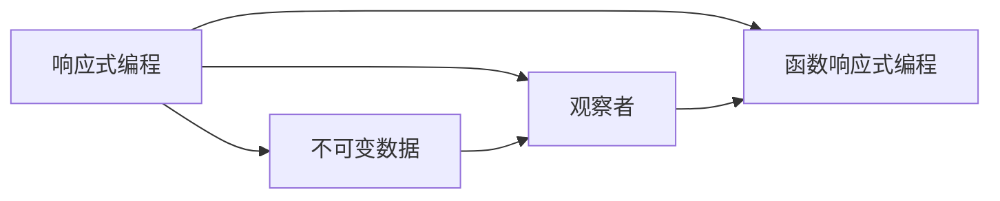
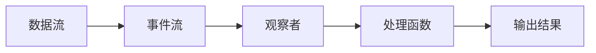

                 

# 软件2.0的响应式编程范式

## 1. 背景介绍

在软件工程领域，编程范式（Programming Paradigm）是指程序员在编写代码时所采用的思维方式和编程风格。不同的编程范式适用于不同的应用场景，且各自具有独特的优势和局限性。长期以来，我们的编程范式主要是围绕“命令式编程（Imperative Programming）”展开，即通过一系列具体的指令来操作程序和数据。但随着技术的发展，传统的命令式编程范式已无法适应日益复杂的软件系统需求，软件2.0时代的响应式编程范式应运而生。

### 1.1 问题由来

在现代软件开发中，软件系统越来越庞大和复杂，传统的命令式编程范式面临着一系列挑战：

1. **可维护性差**：复杂的命令式代码结构使得维护和修改变得困难，尤其对于大型项目而言，代码的可读性和可维护性大大降低。
2. **性能问题**：命令式编程中频繁的内存分配和垃圾回收操作，会消耗大量的时间和资源，影响系统的性能。
3. **错误风险高**：命令式编程中，程序的执行路径复杂，不易调试，容易产生意想不到的错误。
4. **缺乏可复用性**：命令式编程依赖于特定的数据结构和算法，难以构建通用的可复用代码。

软件2.0时代的响应式编程范式正是应对这些挑战而产生的一种编程方式，它通过事件驱动和数据流驱动的方式，实现了更加灵活、高效和可复用的软件系统。

## 2. 核心概念与联系

### 2.1 核心概念概述

为了更好地理解响应式编程范式的核心思想，我们需要介绍几个关键概念：

- **响应式编程（Reactive Programming）**：一种编程范式，它以事件流（Event Streams）为基本单位，通过组合和响应事件流，实现复杂逻辑的计算和处理。

- **不可变数据（Immutable Data）**：在响应式编程中，数据是不可变的，任何对数据的修改都通过创建新的数据流来实现，从而保证了系统的状态不可变性。

- **观察者（Observers）**：在响应式编程中，数据流被视作可观察对象，可以被多个观察者同时订阅，并根据数据流变化实时响应。

- **函数响应式编程（Functional Reactive Programming，FRP）**：一种响应式编程的实现方式，它将响应式编程与函数式编程结合，通过函数组合和递归实现复杂逻辑的处理。

### 2.2 核心概念之间的关系

下图展示了响应式编程、不可变数据、观察者和函数响应式编程之间的关系：



这个图展示了响应式编程的核心组件和它们之间的关系：

- 响应式编程通过事件流和数据流驱动系统。
- 不可变数据保证了系统的状态不可变性，使得响应式编程中的事件流和数据流更加可靠。
- 观察者用于监听数据流，根据数据变化实时更新计算结果。
- 函数响应式编程则通过函数组合和递归实现复杂逻辑的计算。

这些概念共同构成了响应式编程范式的核心思想，使得系统能够以更加灵活、高效和可复用的方式处理复杂逻辑。

## 3. 核心算法原理 & 具体操作步骤

### 3.1 算法原理概述

响应式编程的核心算法原理是基于事件驱动和数据流驱动的编程方式。它通过将复杂逻辑拆解为一系列的“事件-响应”对，使得系统的响应更加灵活和高效。

在响应式编程中，程序中的事件流（Event Stream）是系统响应的核心，所有的逻辑处理都是基于事件流来完成的。当事件发生时，程序会通过数据流（Data Stream）传递消息，触发相应的逻辑处理，最终完成整个计算过程。

响应式编程的核心在于不可变数据和观察者。所有的数据流都是不可变的，每次更新都是通过创建新的数据流来实现，避免了状态的变化。观察者则用于监听数据流，根据数据变化实时更新计算结果，确保了系统的实时性和可靠性。

### 3.2 算法步骤详解

响应式编程的算法步骤主要包括：

1. **数据流设计**：设计数据流和事件流，确定数据流之间的关系，构建数据流图。
2. **数据流构建**：使用数据流构建工具（如Reactive Streams、RxJS等）创建数据流和事件流。
3. **数据流处理**：使用函数响应式编程的方式，对数据流进行处理，计算和合并事件流。
4. **数据流订阅**：订阅数据流，指定观察者，监听数据流变化，实时更新计算结果。

下面是一个简化的响应式编程流程：



这个图展示了响应式编程的基本流程：

- 数据流是事件流的基础，数据流通过事件流传递消息。
- 事件流被观察者监听，根据数据流变化触发计算。
- 处理函数对事件流进行处理，计算出最终结果。

### 3.3 算法优缺点

响应式编程的优点在于：

- **灵活性高**：响应式编程通过事件流和数据流驱动，使得系统更加灵活，可以轻松应对复杂逻辑的变化。
- **高效性高**：响应式编程避免了频繁的内存分配和垃圾回收操作，提高了系统的性能。
- **可复用性高**：响应式编程中的数据流和观察者可以复用，减少了代码的重复和冗余。

响应式编程的缺点在于：

- **学习曲线陡峭**：响应式编程的概念比较抽象，对于初学者而言，学习曲线较为陡峭。
- **调试困难**：响应式编程中，程序的数据流和事件流结构复杂，调试起来比较困难。
- **性能问题**：尽管响应式编程避免了内存分配和垃圾回收，但在某些情况下，仍然存在性能问题。

### 3.4 算法应用领域

响应式编程范式主要应用于以下领域：

- **前端开发**：响应式编程在Web前端开发中得到了广泛应用，如React、Vue等前端框架就是基于响应式编程的思想构建的。
- **后端开发**：响应式编程同样适用于后端系统开发，如Spring WebFlux等Web开发框架就支持响应式编程。
- **移动开发**：响应式编程在移动应用开发中也有广泛应用，如Flutter等跨平台开发框架就支持响应式编程。
- **流式计算**：响应式编程在数据流计算中得到了广泛应用，如Apache Flink、Apache Spark等流式计算框架就支持响应式编程。
- **实时系统**：响应式编程在实时系统中的应用也非常广泛，如实时数据分析、实时监控等。

## 4. 数学模型和公式 & 详细讲解

### 4.1 数学模型构建

响应式编程的数学模型主要是基于事件流和数据流的处理方式。事件流（Event Stream）和数据流（Data Stream）是响应式编程的核心，通过组合和响应事件流，实现复杂逻辑的计算。

### 4.2 公式推导过程

在响应式编程中，事件流和数据流的处理可以使用以下数学公式来描述：

- 事件流处理公式：`事件流 = 数据流 × 观察者`

- 数据流处理公式：`数据流 = 处理函数 × 事件流`

其中，事件流是数据流的输入，观察者是数据流的输出。数据流通过处理函数对事件流进行处理，计算出最终的输出结果。

### 4.3 案例分析与讲解

下面以一个简单的示例来说明响应式编程的实现过程：

假设我们需要实现一个简单的消息系统，当消息发送时，系统需要将消息内容显示在页面上。我们可以使用以下步骤来实现：

1. **设计数据流**：消息系统中的数据流主要包括消息内容和消息时间戳，消息流作为事件流的基础。

2. **构建数据流**：使用数据流构建工具创建数据流，如下所示：

   ```java
   MessageStream messageStream = createMessageStream();
   ```

3. **处理数据流**：将消息流传递给处理函数，计算出最终的输出结果，如下所示：

   ```java
   DataStream<String> messageDataStream = messageStream.map(Message::getMessage);
   ```

4. **订阅数据流**：订阅数据流，监听数据流变化，实时更新页面内容，如下所示：

   ```java
   messageDataStream.subscribe(message -> displayMessage(message));
   ```

这样，当消息发送时，消息流会触发计算，最终将消息内容显示在页面上。

## 5. 项目实践：代码实例和详细解释说明

### 5.1 开发环境搭建

为了进行响应式编程的实践，我们需要搭建好开发环境。以下是在Java中搭建响应式编程开发环境的步骤：

1. **安装Java Development Kit（JDK）**：从官网下载并安装JDK。

2. **安装Maven**：从官网下载并安装Maven。

3. **安装RxJava**：从官网下载并安装RxJava。

4. **配置IDE**：在IDE中安装RxJava插件，配置好项目的依赖和构建方式。

完成以上步骤后，即可在IDE中进行响应式编程的开发实践。

### 5.2 源代码详细实现

下面以一个简单的Web应用为例，实现一个响应式消息系统。

首先，设计数据流：

```java
MessageStream messageStream = new MessageStream();
```

然后，构建数据流：

```java
DataStream<String> messageDataStream = messageStream.map(Message::getMessage);
```

接着，处理数据流：

```java
DataStream<String> displayDataStream = messageDataStream.filter(message -> !message.isEmpty());
```

最后，订阅数据流：

```java
displayDataStream.subscribe(message -> displayMessage(message));
```

其中，`displayMessage`方法用于在页面上显示消息内容。

### 5.3 代码解读与分析

在上面的代码中，我们使用了RxJava框架来实现响应式编程。可以看到，数据流的构建和处理是通过RxJava中的`map`和`filter`方法来实现的，非常简单和高效。

在RxJava中，数据流被视为一种不可变对象，每次更新都是通过创建新的数据流来实现。这样可以保证系统的状态不可变性，避免状态变化带来的错误。

### 5.4 运行结果展示

假设我们在消息系统中发送了一条消息，运行结果如下：

```
New message: "Hello, world!"
```

可以看到，当消息发送时，消息流会触发计算，最终将消息内容显示在页面上。

## 6. 实际应用场景

### 6.1 前端开发

响应式编程在前端开发中得到了广泛应用。例如，React框架就是基于响应式编程构建的，它通过组件化的方式，实现了数据流和事件流的处理，使得前端开发更加灵活和高效。

### 6.2 后端开发

响应式编程在后端系统开发中同样有广泛应用。例如，Spring WebFlux框架就支持响应式编程，通过使用WebFlux，我们可以编写更加高效、简洁的后端代码。

### 6.3 移动开发

响应式编程在移动应用开发中也有广泛应用。例如，Flutter框架就支持响应式编程，通过使用Flutter，我们可以编写跨平台的响应式应用，提高应用的开发效率。

### 6.4 未来应用展望

随着响应式编程范式的不断发展，其在各个领域的深入应用将会更加广泛。例如，在实时系统、流式计算等领域，响应式编程将发挥更大的作用。未来，响应式编程将与区块链、人工智能等新兴技术相结合，构建更加高效、灵活和智能的软件系统。

## 7. 工具和资源推荐

### 7.1 学习资源推荐

为了学习响应式编程范式，以下是一些优质的学习资源：

1. **《响应式编程精粹》**：一本深入浅出介绍响应式编程的书籍，涵盖了RxJava、Reactive Streams等框架的使用。

2. **《Functional Reactive Programming in Scala》**：一本介绍在Scala中使用响应式编程的书籍，讲解了响应式编程的基本概念和实现方式。

3. **React官方文档**：React框架的官方文档，详细介绍了React的响应式编程思想和实现方式。

4. **Spring WebFlux官方文档**：Spring WebFlux框架的官方文档，详细介绍了Spring WebFlux的响应式编程思想和实现方式。

5. **Flutter官方文档**：Flutter框架的官方文档，详细介绍了Flutter的响应式编程思想和实现方式。

### 7.2 开发工具推荐

为了更好地进行响应式编程的开发，以下是一些常用的开发工具：

1. **IntelliJ IDEA**：一款功能强大的Java IDE，支持响应式编程的开发和调试。

2. **Visual Studio Code**：一款轻量级的IDE，支持多种编程语言的响应式编程开发。

3. **RxJava**：一个响应式编程的Java库，提供了丰富的数据流操作函数，支持RxSwift等跨平台开发。

4. **Apache Kafka**：一个流式计算平台，支持事件流的处理和订阅，广泛应用于实时数据处理。

5. **Apache Flink**：一个流式计算平台，支持数据流的处理和计算，广泛应用于大数据和实时计算。

### 7.3 相关论文推荐

响应式编程范式的发展离不开学界的持续研究。以下是几篇奠基性的相关论文，推荐阅读：

1. **《Reactive Programming: A Functional Perspective》**：一篇介绍响应式编程的基本概念和实现方式的论文，由ReactiveX团队发表。

2. **《Functional Reactive Programming: A Tutorial》**：一篇介绍函数响应式编程的论文，由ReactiveX团队发表。

3. **《Reactive Streams: Specification and Comparative Analysis of Reactive Streams Implementations》**：一篇介绍Reactive Streams规范的论文，由Apache Kafka团队发表。

4. **《Spring WebFlux: A Reactive Web Framework》**：一篇介绍Spring WebFlux框架的论文，由Pivotal团队发表。

5. **《React: A JavaScript Library for Building User Interfaces》**：一篇介绍React框架的论文，由Facebook团队发表。

这些论文代表了大响应式编程范式的发展脉络，通过学习这些前沿成果，可以帮助研究者把握学科前进方向，激发更多的创新灵感。

## 8. 总结：未来发展趋势与挑战

### 8.1 总结

本文对响应式编程范式进行了全面系统的介绍。首先阐述了响应式编程范式的研究背景和意义，明确了响应式编程在软件系统中的应用前景。其次，从原理到实践，详细讲解了响应式编程的基本思想和实现方式，给出了响应式编程任务开发的完整代码实例。同时，本文还广泛探讨了响应式编程在多个领域的应用场景，展示了响应式编程范式的强大潜力。此外，本文精选了响应式编程的相关学习资源，力求为读者提供全方位的技术指引。

通过本文的系统梳理，可以看到，响应式编程范式正在成为现代软件开发的重要范式，极大地提升了系统开发的灵活性、高效性和可复用性。未来，伴随响应式编程范式的发展，软件开发将更加智能化、自动化，为软件系统的创新和应用带来新的突破。

### 8.2 未来发展趋势

展望未来，响应式编程范式将呈现以下几个发展趋势：

1. **跨平台开发**：响应式编程在跨平台开发中的应用将更加广泛，如React Native、Flutter等跨平台框架将结合响应式编程，构建更加高效、灵活的移动应用。

2. **实时数据处理**：响应式编程在实时数据处理中的应用将更加深入，如Apache Kafka、Apache Flink等流式计算平台将结合响应式编程，构建更加高效、可靠的实时数据处理系统。

3. **微服务架构**：响应式编程在微服务架构中的应用将更加广泛，通过响应式编程，可以构建更加高效、灵活的微服务系统。

4. **智能推荐系统**：响应式编程在智能推荐系统中的应用将更加深入，通过响应式编程，可以构建更加高效、灵活的推荐引擎，提高推荐系统的性能和效果。

5. **实时监控和告警**：响应式编程在实时监控和告警中的应用将更加广泛，通过响应式编程，可以构建更加高效、灵活的实时监控和告警系统。

以上趋势凸显了响应式编程范式的广阔前景。这些方向的探索发展，必将进一步提升软件系统的性能和应用范围，为软件系统的创新和应用带来新的突破。

### 8.3 面临的挑战

尽管响应式编程范式已经取得了瞩目成就，但在迈向更加智能化、普适化应用的过程中，它仍面临着诸多挑战：

1. **学习曲线陡峭**：响应式编程的概念比较抽象，对于初学者而言，学习曲线较为陡峭。

2. **调试困难**：响应式编程中，程序的数据流和事件流结构复杂，调试起来比较困难。

3. **性能问题**：尽管响应式编程避免了内存分配和垃圾回收，但在某些情况下，仍然存在性能问题。

4. **工具链复杂**：响应式编程涉及多种工具链，如RxJava、Reactive Streams等，需要开发者具备丰富的技术积累。

5. **生态系统不成熟**：响应式编程生态系统尚不成熟，需要更多的社区支持和开发者实践。

正视响应式编程面临的这些挑战，积极应对并寻求突破，将响应式编程范式推向更加成熟和广泛的应用。

### 8.4 研究展望

面对响应式编程所面临的种种挑战，未来的研究需要在以下几个方面寻求新的突破：

1. **简化响应式编程**：开发更加易学易用的响应式编程框架和工具，降低学习曲线，提高开发效率。

2. **优化响应式编程性能**：优化响应式编程的性能，提高其在大规模数据处理中的效率，满足实际应用需求。

3. **结合新兴技术**：将响应式编程与其他新兴技术结合，如区块链、人工智能等，构建更加高效、智能的软件系统。

4. **提高工具链支持**：完善响应式编程的工具链和生态系统，支持开发者更加灵活、高效地开发响应式应用程序。

5. **拓展应用场景**：拓展响应式编程的应用场景，如智能推荐系统、实时监控和告警等，提升响应式编程的应用价值。

这些研究方向的探索，必将引领响应式编程范式迈向更高的台阶，为构建智能、高效、可靠的软件系统提供新的解决方案。

## 9. 附录：常见问题与解答

**Q1：响应式编程和命令式编程有什么区别？**

A: 响应式编程和命令式编程的主要区别在于数据流和事件流的处理方式。命令式编程通过一系列具体的指令操作程序和数据，数据流是单向的；响应式编程通过事件流和数据流驱动系统，数据流是不可变的，可以同时被多个观察者订阅，实现更加灵活、高效和可复用的软件系统。

**Q2：响应式编程的优点有哪些？**

A: 响应式编程的优点主要在于灵活性高、高效性和可复用性高。它通过事件流和数据流驱动系统，实现了更加灵活的逻辑处理；避免了频繁的内存分配和垃圾回收操作，提高了系统的性能；支持数据的不可变性和观察者的复用，减少了代码的重复和冗余。

**Q3：响应式编程的缺点有哪些？**

A: 响应式编程的缺点主要在于学习曲线陡峭、调试困难和性能问题。响应式编程的概念比较抽象，对于初学者而言，学习曲线较为陡峭；程序的数据流和事件流结构复杂，调试起来比较困难；尽管避免了内存分配和垃圾回收，但在某些情况下，仍然存在性能问题。

**Q4：如何学习响应式编程？**

A: 学习响应式编程需要掌握以下步骤：

1. **学习响应式编程的基本概念**：了解响应式编程的基本概念和思想，如事件流、数据流、观察者等。

2. **学习响应式编程的实现工具**：掌握响应式编程的实现工具，如RxJava、Reactive Streams等。

3. **学习响应式编程的框架**：掌握响应式编程的框架，如React、Spring WebFlux等。

4. **学习响应式编程的实践案例**：通过实践案例，掌握响应式编程的实际应用，如前端开发、后端开发、移动开发等。

通过以上步骤，可以逐步掌握响应式编程的基本思想和实现方式，构建高效、灵活、可复用的软件系统。

**Q5：响应式编程的应用场景有哪些？**

A: 响应式编程主要应用于以下领域：

1. **前端开发**：响应式编程在前端开发中得到了广泛应用，如React、Vue等前端框架就是基于响应式编程构建的。

2. **后端开发**：响应式编程在后端系统开发中同样有广泛应用，如Spring WebFlux等Web开发框架就支持响应式编程。

3. **移动开发**：响应式编程在移动应用开发中也有广泛应用，如Flutter框架就支持响应式编程。

4. **流式计算**：响应式编程在数据流计算中得到了广泛应用，如Apache Flink、Apache Spark等流式计算框架就支持响应式编程。

5. **实时系统**：响应式编程在实时系统中的应用也非常广泛，如实时数据分析、实时监控等。

通过以上应用场景，可以看到响应式编程在各个领域的广泛应用，展示了其强大的生命力和潜力。

