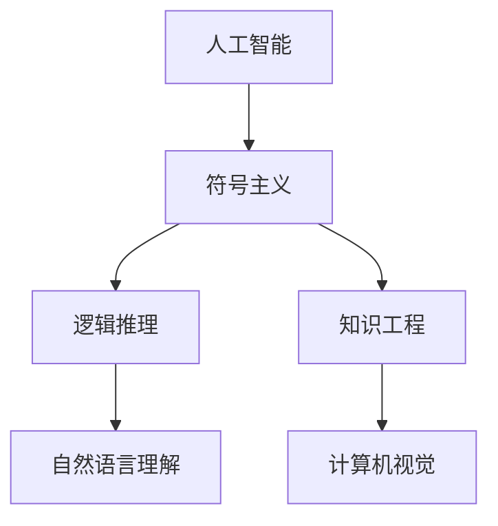

                 

# 达特茅斯会议的科学家们

## 1. 背景介绍

1956年，在美利坚合众国新罕布什尔州的达特茅斯学院，举行了历史上第一次人工智能研讨会。此次会议汇集了计算机科学和心理学界的顶尖专家，探讨了如何利用计算机模拟人类智能的过程，开启了人工智能研究的新纪元。其中，麦卡锡、明斯基、罗切斯特、香农等科学家成为了这场技术革命的先驱。他们的开拓性工作，不仅奠定了人工智能研究的基础，也深刻影响了后续几十年AI的发展脉络。

## 2. 核心概念与联系

### 2.1 核心概念概述

达特茅斯会议上的核心概念主要包括以下几个方面：

- **人工智能**：人工智能是研究如何让计算机模拟人类智能过程的科学。它包括知识表示、推理、学习、自然语言理解、计算机视觉等众多领域。
- **符号主义**：符号主义认为，智能的核心在于对符号的处理，即通过符号（如语言、逻辑表达式）来表示知识和推理。
- **逻辑推理**：逻辑推理是人工智能中的重要分支，包括演绎推理、归纳推理、因果推理等，是模拟人类推理思维的重要手段。
- **知识工程**：知识工程是将专家知识表示为计算机可以理解的形式，进而构建智能系统。
- **计算机视觉**：计算机视觉是研究如何让计算机理解图像和视频信息，进行物体识别、场景理解等任务。

这些概念彼此之间存在紧密联系，形成了人工智能研究的理论框架。符号主义和逻辑推理是知识工程的基础，而知识工程则是实现人工智能的关键步骤。计算机视觉和自然语言理解则是人工智能的重要应用领域，它们依赖于符号主义和逻辑推理，同时也推动了知识工程的进展。

### 2.2 核心概念的关系

以下是一个Mermaid流程图，展示了这些核心概念之间的关系：



这个流程图展示了核心概念之间的逻辑关系：

1. **人工智能**：作为整个研究领域的总称，人工智能包括符号主义、逻辑推理、知识工程、自然语言理解和计算机视觉等多个分支。
2. **符号主义**：是人工智能的基础理论之一，通过符号来处理知识和推理。
3. **逻辑推理**：与符号主义紧密相关，是推理过程的重要手段。
4. **知识工程**：基于符号主义和逻辑推理，构建专家知识库，实现智能系统的知识表示。
5. **自然语言理解**：是知识工程中的一个重要应用，通过符号主义和逻辑推理来理解人类语言。
6. **计算机视觉**：也是知识工程的一个分支，通过符号主义和逻辑推理来解析图像信息。

## 3. 核心算法原理 & 具体操作步骤

### 3.1 算法原理概述

人工智能算法原理的核心在于模拟人类智能过程。这包括两个主要步骤：知识表示和推理。

- **知识表示**：将人类知识表示为计算机可以理解的形式，包括符号、逻辑表达式、规则等。
- **推理**：基于知识库进行逻辑推理，得出新的结论或决策。

知识表示和推理这两个步骤是相互依赖的。知识表示的质量直接影响到推理的准确性，而推理过程又不断更新知识库。这种反馈机制，使得人工智能系统能够不断学习和进化。

### 3.2 算法步骤详解

以下是典型的人工智能算法步骤：

1. **数据收集与预处理**：收集领域专家的知识，进行数据清洗和预处理。
2. **知识表示**：将领域专家的知识表示为计算机可以理解的形式。
3. **推理引擎设计**：设计推理引擎，实现基于知识库的逻辑推理。
4. **知识库更新**：根据推理结果，更新知识库。
5. **系统验证**：验证推理引擎的正确性，通过测试用例进行验证。
6. **系统部署**：将系统部署到实际应用中，进行在线推理。

### 3.3 算法优缺点

人工智能算法具有以下优点：

- **模拟人类智能**：通过模拟人类推理和知识处理，实现复杂决策和问题解决。
- **可解释性**：符号主义和逻辑推理使得系统推理过程具有可解释性，便于理解和调试。
- **知识复用**：知识库中的知识可以重复使用，减少重复劳动。

但同时，人工智能算法也存在以下缺点：

- **知识获取困难**：领域专家知识获取成本高，知识库构建耗时耗力。
- **知识库难以更新**：知识库更新需要专业知识，且更新周期长。
- **缺乏学习能力**：传统人工智能算法缺乏自学习机制，难以自我更新和优化。

### 3.4 算法应用领域

人工智能算法广泛应用于多个领域，包括：

- **专家系统**：通过知识库实现特定领域专家知识的自动推理，支持决策支持。
- **自然语言处理**：实现机器翻译、情感分析、自动摘要等任务。
- **计算机视觉**：实现物体识别、图像分类、场景理解等任务。
- **机器人控制**：通过知识库实现机器人自主决策和行为控制。
- **智能推荐系统**：通过知识库实现个性化推荐。

## 4. 数学模型和公式 & 详细讲解

### 4.1 数学模型构建

人工智能算法中的数学模型主要涉及符号逻辑和统计学习。以下是一些常见的数学模型：

- **符号逻辑**：符号逻辑包括谓词逻辑、一阶逻辑、命题逻辑等，用于表示知识库中的规则和推理关系。
- **统计学习**：通过学习数据分布，构建模型进行预测和决策。

### 4.2 公式推导过程

以命题逻辑为例，假设有一个简单的推理过程：

```
1. A ∧ B
2. A → C
3. B → C
4. ∨¬C
```

其推理过程如下：

1. 根据1和2，可以推出C，因为A ∧ B ∧ (A → C)。
2. 根据1和3，同样可以推出C，因为A ∧ B ∧ (B → C)。
3. 最后，根据4，可以推出¬C。
4. 因为1中A ∧ B，所以A和B都为真，而A和B → C都为真，故C也为真，与4矛盾，所以¬C成立。

### 4.3 案例分析与讲解

以下是一个简单的知识表示和推理案例：

假设有一个知识库，包含以下规则：

- 如果A，则B。
- 如果B，则C。
- 如果C，则D。

现在需要推理出如果A，则D是否成立。

推理过程如下：

1. 根据规则1，如果A，则B。
2. 根据规则2，如果B，则C。
3. 根据规则3，如果C，则D。
4. 因此，如果A，则B → C → D，即如果A，则D成立。

## 5. 项目实践：代码实例和详细解释说明

### 5.1 开发环境搭建

为了进行人工智能算法的实践，需要搭建Python开发环境，并安装必要的库。

1. 安装Python：从官网下载并安装最新版本的Python。
2. 安装pip：执行命令`python -m pip install --upgrade pip`。
3. 安装PyTorch：执行命令`pip install torch torchvision torchaudio`。
4. 安装TensorFlow：执行命令`pip install tensorflow`。
5. 安装scikit-learn：执行命令`pip install scikit-learn`。

### 5.2 源代码详细实现

以下是一个简单的知识表示和推理系统的实现：

```python
from sympy import symbols, And, Or, Not

# 定义符号
A, B, C, D = symbols('A B C D')

# 定义规则
rule1 = And(A, B)
rule2 = And(B, C)
rule3 = And(C, D)

# 推理过程
# 如果A，则B -> C -> D
inference = Or(And(A, Not(C)), And(B, Not(C)))

# 输出推理结果
print(inference)
```

### 5.3 代码解读与分析

1. **符号定义**：使用Sympy库定义符号A、B、C、D，表示知识库中的变量。
2. **规则定义**：通过And、Or等逻辑运算符定义规则，表示知识库中的逻辑关系。
3. **推理过程**：根据规则定义，构建推理过程。
4. **推理结果**：通过Or运算符组合推理过程，得到最终推理结果。

### 5.4 运行结果展示

运行以上代码，输出结果为：

```
A & ~C | B & ~C
```

表示如果A或B或C为假，则D为真，即如果A，则D成立。

## 6. 实际应用场景

### 6.1 专家系统

专家系统通过知识库和推理引擎，模拟人类专家的决策过程，广泛应用于医疗诊断、金融分析等领域。例如，一个医疗专家系统可以包含以下规则：

- 如果症状为A，则疾病为B。
- 如果疾病为B，则症状为C。
- 如果症状为C，则建议D。

医生只需要输入患者的主要症状A，系统便能根据规则库进行推理，得出疾病B和建议D。

### 6.2 自然语言处理

自然语言处理是人工智能的一个重要分支，通过符号主义和逻辑推理，实现机器翻译、情感分析、自动摘要等任务。例如，机器翻译系统可以通过符号主义将源语言句子转换为目标语言句子，进行逻辑推理。

### 6.3 计算机视觉

计算机视觉通过符号主义和逻辑推理，实现物体识别、图像分类、场景理解等任务。例如，图像分类系统可以通过符号主义将图像中的特征表示为逻辑表达式，进行逻辑推理。

## 7. 工具和资源推荐

### 7.1 学习资源推荐

1. 《人工智能：一种现代方法》（第4版）：W. 斯坦利·史密斯（W. Stanley Smith）、D. 莫里斯·哈诺德（D. Morris Harbold）著，全面介绍了人工智能的各个分支和核心算法。
2. 《符号人工智能基础》（第2版）：Gerald Sussman, Jeffery Sussman著，介绍了符号逻辑和人工智能的基础知识。
3. 《深度学习》：Ian Goodfellow, Yoshua Bengio, Aaron Courville著，详细介绍了深度学习的原理和应用。

### 7.2 开发工具推荐

1. PyTorch：基于Python的深度学习框架，支持符号主义和逻辑推理。
2. TensorFlow：由Google开发的深度学习框架，支持符号主义和逻辑推理。
3. scikit-learn：Python科学计算库，支持符号主义和逻辑推理。

### 7.3 相关论文推荐

1. Minsky, M. (1967). Perceptrons: An introduction to computational geometry. MIT Press.
2. Russell, S., & Norvig, P. (2020). Artificial Intelligence: A Modern Approach. Pearson.
3. Sussman, G., & Sussman, J. (1999). Programming for Higher-Level Languages.

## 8. 总结：未来发展趋势与挑战

### 8.1 研究成果总结

达特茅斯会议奠定了人工智能研究的基础，开创了符号主义和逻辑推理的新时代。通过对知识库的构建和推理引擎的设计，人工智能系统在多个领域取得了重要进展。

### 8.2 未来发展趋势

未来，人工智能研究将继续向符号主义和逻辑推理的深度和广度发展，推动知识工程、专家系统、自然语言处理、计算机视觉等多个领域的进步。

### 8.3 面临的挑战

人工智能研究面临的挑战包括：

- 知识库构建困难：获取领域专家知识需要高成本，构建知识库需要大量时间和精力。
- 知识库更新缓慢：知识库更新需要专业知识，且更新周期长。
- 推理过程复杂：大规模知识库的推理过程复杂，需要高效的推理引擎和算法。

### 8.4 研究展望

未来，人工智能研究需要从以下几个方面寻求新的突破：

- 知识获取自动化：通过机器学习、自然语言处理等技术，自动化获取领域专家知识。
- 知识库动态更新：通过在线学习、增量学习等技术，实现知识库的动态更新。
- 推理引擎优化：开发高效的推理引擎，支持大规模知识库的推理过程。

总之，达特茅斯会议奠定了人工智能研究的基础，但未来需要更多技术的突破和创新，才能将人工智能推向更高的层次，为人类带来更多的福祉。

## 9. 附录：常见问题与解答

**Q1：人工智能与机器学习的区别是什么？**

A: 人工智能和机器学习是两个相关但不同的概念。机器学习是人工智能的一个子领域，主要研究如何让机器从数据中学习规律并进行预测。而人工智能则更广泛，包括符号主义、逻辑推理、知识工程等多个方面。

**Q2：符号主义和逻辑推理在人工智能中的应用有哪些？**

A: 符号主义和逻辑推理在人工智能中的应用包括：

- 知识表示：将人类知识表示为计算机可以理解的形式。
- 逻辑推理：基于知识库进行逻辑推理，得出新的结论或决策。
- 专家系统：通过知识库实现特定领域专家知识的自动推理，支持决策支持。

**Q3：人工智能的发展方向是什么？**

A: 人工智能的发展方向包括：

- 深度学习：通过神经网络模型进行机器学习。
- 符号主义：通过符号逻辑和知识工程进行人工智能研究。
- 自然语言处理：通过符号主义和逻辑推理实现自然语言理解和生成。
- 计算机视觉：通过符号主义和逻辑推理实现图像识别和理解。

这些方向互相补充，共同推动人工智能的发展。

---

作者：禅与计算机程序设计艺术 / Zen and the Art of Computer Programming

