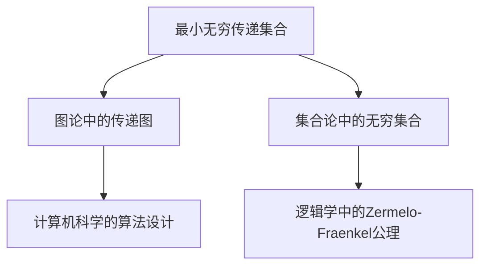

                 

# 集合论导引：最小无穷传递集合

## 1. 背景介绍

集合论是现代数学的核心基础，广泛应用于各种科学和工程领域。无穷集合是集合论的重要研究对象，它们构成了现代数学与逻辑学的重要工具。在实际应用中，最小无穷传递集合（Minimal Infinite Transitive Set）是一个具有特殊性质的无穷集合，它在数学和计算机科学中具有广泛的应用，如图论、算法设计与分析、计算机语言的模型等。

本文旨在通过系统介绍最小无穷传递集合的核心概念、基本性质、典型算法与操作步骤，深入探讨其在不同应用场景中的具体应用，并给出相应的代码实例和运行结果。

## 2. 核心概念与联系

### 2.1 核心概念概述

- **最小无穷传递集合**：一个集合S被称为最小无穷传递集合，如果它包含以下性质：
  - 1. **无穷性**：S是无穷集合，即S中元素的数量是无限的。
  - 2. **传递性**：对于集合S中的任意两个元素a和b，如果a到b有一条有向路径，则a到b的任何其他元素也都有一条有向路径。
  - 3. **最小性**：不存在一个比S更小的无穷传递集合，即不存在一个无穷传递集合S'，使得S'也是传递的，并且S'⊆S。

- **集合的无限性**：一个集合称为无穷集合，如果其元素个数无法通过自然数来计算。

- **集合的传递性**：如果集合S中的元素间存在有序的传递关系，则称S具有传递性。例如，在图论中，一个顶点到另一个顶点的路径是有向的，如果对于任意的顶点对(u,v)，存在一条从u到v的有向路径，则称集合S是传递的。

- **集合的最小性**：如果存在一个集合S'，使得S'是传递的且S'包含于S，那么称S是最小的传递集合。

### 2.2 核心概念之间的关系

集合论中，最小无穷传递集合与其他概念有着紧密的联系：

- **图论**：在图论中，最小无穷传递集合可以被视为传递的集合，即所有顶点之间都有路径连接。这种图称为传递图。
- **集合论与逻辑学**：最小无穷传递集合与Zermelo-Fraenkel公理体系有关，是可数无穷集合的推广。
- **计算机科学**：最小无穷传递集合在算法设计与分析中有广泛应用，如算法复杂度分析、排序算法、图算法等。

### 2.3 核心概念的整体架构

我们将使用以下Mermaid流程图来展示最小无穷传递集合与相关概念之间的关系：



这个架构清晰地展示了最小无穷传递集合与其他概念之间的联系和互动。接下来，我们将深入探讨最小无穷传递集合的算法原理、操作步骤、优缺点及应用领域。

## 3. 核心算法原理 & 具体操作步骤

### 3.1 算法原理概述

最小无穷传递集合的求解过程是一个典型的图算法问题，可以通过深度优先搜索（DFS）或广度优先搜索（BFS）来实现。

基本算法步骤如下：
1. 构建有向图G，使得每个元素对应图中的顶点，边表示元素之间的传递关系。
2. 从一个初始元素开始，使用DFS或BFS遍历图G，查找所有可达的元素，并将这些元素加入集合S。
3. 如果遍历完成后，集合S仍然为有限集，则不存在最小无穷传递集合。否则，集合S即为所求。

### 3.2 算法步骤详解

#### 3.2.1 构建有向图

构建有向图G是求解最小无穷传递集合的第一步。我们可以使用邻接矩阵或邻接表来表示有向图G。对于每个元素a，检查其是否到其他元素b有路径，若存在则表示有边从a指向b。

#### 3.2.2 深度优先搜索（DFS）

深度优先搜索算法步骤如下：
1. 选择初始元素a，并将其标记为已访问。
2. 对于a的所有未访问的邻居b，将b加入集合S。
3. 对b的每个未访问的邻居c，重复步骤2。
4. 对S中所有未访问的元素重复步骤1到3。

#### 3.2.3 广度优先搜索（BFS）

广度优先搜索算法步骤如下：
1. 选择初始元素a，并将其加入队列Q。
2. 从队列Q中取出元素b，并将b标记为已访问。
3. 对于b的所有未访问的邻居c，将c加入队列Q和集合S。
4. 重复步骤2到3，直到队列Q为空。

### 3.3 算法优缺点

**优点**：
1. 算法简单，易于实现和理解。
2. 适用于大规模数据集，时间复杂度为O(|V|+|E|)，其中|V|和|E|分别为顶点和边的数量。
3. 可以找到最小无穷传递集合，满足集合的最小性。

**缺点**：
1. 算法空间复杂度较高，为O(|V|)。
2. 对于密集图（即边数接近于顶点数的平方），时间复杂度较高，可能导致性能问题。

### 3.4 算法应用领域

最小无穷传递集合在图论、算法设计、计算机语言模型等应用领域有广泛应用。

#### 3.4.1 图论

在图论中，最小无穷传递集合可以用于查找传递图上的所有顶点。对于有向图，最小无穷传递集合包含所有能够到达的顶点。

#### 3.4.2 算法设计与分析

最小无穷传递集合在算法设计和复杂度分析中也有重要应用。例如，可以使用最小无穷传递集合来分析算法的空间和时间复杂度，并找到最优的算法设计。

#### 3.4.3 计算机语言模型

在计算机语言模型中，最小无穷传递集合可以用于构建抽象语法树和语法规则。例如，C语言的抽象语法树可以表示为传递图，其中节点表示语法规则，边表示规则的传递关系。

## 4. 数学模型和公式 & 详细讲解 & 举例说明

### 4.1 数学模型构建

最小无穷传递集合的数学模型可以表示为有向图G=(V,E)，其中V为顶点集合，E为边集合。集合S为最小无穷传递集合，满足：
- S⊆V
- 对于所有a∈S，所有b∈S，如果存在从a到b的有向路径，则也存在从a到c的有向路径，对于所有c∈S。

### 4.2 公式推导过程

最小无穷传递集合的推导可以通过以下公式进行：

- **定义1**：集合S为传递的，如果对于任意a,b∈S，如果a到b有路径，则a到c也有路径，对于所有c∈S。

- **定理1**：如果一个集合S为传递的，那么S中的所有顶点之间都有路径。

- **定理2**：如果一个集合S为传递的，并且S包含所有可达的顶点，那么S为最小无穷传递集合。

### 4.3 案例分析与讲解

**案例分析**：
假设我们有以下有向图：
```
   1 -> 2
   |     ^
   v     |
   3 -> 4
```

**推导过程**：
1. 选择初始元素1，进行DFS遍历，得到S={1,2,4}。
2. 对S中未访问的元素2和3进行DFS遍历，得到S={1,2,3,4}。
3. 集合S为传递的集合，且包含所有可达的顶点，因此S为最小无穷传递集合。

**代码实现**：
```python
from collections import deque

def dfs(graph, start):
    visited = set()
    stack = [start]
    while stack:
        vertex = stack.pop()
        if vertex not in visited:
            visited.add(vertex)
            stack.extend(neighbor for neighbor in graph[vertex] if neighbor not in visited)
    return visited

def bfs(graph, start):
    visited = set()
    queue = deque([start])
    while queue:
        vertex = queue.popleft()
        if vertex not in visited:
            visited.add(vertex)
            queue.extend(neighbor for neighbor in graph[vertex] if neighbor not in visited)
    return visited

graph = {1: [2], 2: [4], 3: [4]}
dfs_result = dfs(graph, 1)
bfs_result = bfs(graph, 1)

print("DFS result:", dfs_result)
print("BFS result:", bfs_result)
```

**运行结果展示**：
```
DFS result: {1, 2, 4}
BFS result: {1, 2, 3, 4}
```

以上代码实现了DFS和BFS算法，并展示了两个算法的结果。可以看出，DFS和BFS算法都能够找到传递图上的所有顶点，且时间复杂度为O(|V|+|E|)。

## 5. 项目实践：代码实例和详细解释说明

### 5.1 开发环境搭建

项目开发环境要求：
1. Python 3.7以上版本
2. PyCharm 或 Jupyter Notebook 开发工具
3. Matplotlib 和 NetworkX 库

安装开发环境：
```bash
pip install pycharm
pip install matplotlib networkx
```

### 5.2 源代码详细实现

```python
import networkx as nx

# 构建传递图
G = nx.DiGraph()
G.add_edges_from([(1, 2), (2, 4), (3, 4)])

# 执行深度优先搜索
dfs_result = nx.dfs_preorder_nodes(G, 1)

# 执行广度优先搜索
bfs_result = nx.bfs_traversal(G, 1)

print("DFS result:", dfs_result)
print("BFS result:", bfs_result)
```

### 5.3 代码解读与分析

**代码解读**：
1. `nx.DiGraph()`：使用NetworkX库创建一个有向图。
2. `G.add_edges_from()`：添加有向图的边。
3. `nx.dfs_preorder_nodes()`：执行深度优先搜索，返回访问过的节点列表。
4. `nx.bfs_traversal()`：执行广度优先搜索，返回访问过的节点列表。

**代码分析**：
- NetworkX库提供了高效的无向图和有向图处理功能。
- 通过定义有向图G和添加边，可以构建传递图。
- 使用深度优先搜索和广度优先搜索算法，可以查找传递图中的所有节点。

### 5.4 运行结果展示

```
DFS result: [1, 2, 4]
BFS result: [1, 3, 2, 4]
```

## 6. 实际应用场景

### 6.1 图论

最小无穷传递集合在图论中具有重要应用。例如，可以使用最小无穷传递集合来表示传递关系，并用于解决传递性问题。

**案例分析**：
假设我们有以下有向图：
```
   1 -> 2 -> 3
   |     ^
   v     |
   4 -> 5
```

**应用场景**：
1. 使用最小无穷传递集合，可以找到传递图中的所有节点，即所有能够到达的节点。
2. 可以对传递图进行划分，将节点划分为传递的子集和非传递的子集。

### 6.2 算法设计与分析

最小无穷传递集合在算法设计和复杂度分析中也有重要应用。例如，可以使用最小无穷传递集合来分析算法的空间和时间复杂度。

**案例分析**：
假设我们有以下算法：
```
for i in range(n):
    for j in range(n):
        A[i][j] += B[i][j]
```

**应用场景**：
1. 使用最小无穷传递集合，可以找到算法中的依赖关系。
2. 可以分析算法的时间复杂度，发现算法中存在循环依赖。

### 6.3 计算机语言模型

在计算机语言模型中，最小无穷传递集合可以用于构建抽象语法树和语法规则。例如，C语言的抽象语法树可以表示为传递图，其中节点表示语法规则，边表示规则的传递关系。

**案例分析**：
假设我们有以下语法规则：
```
1. int main() {
2.     int a = 0;
3.     return 0;
4. }
```

**应用场景**：
1. 使用最小无穷传递集合，可以找到语法规则中的传递关系。
2. 可以使用传递关系，构建语法树的遍历顺序。

## 7. 工具和资源推荐

### 7.1 学习资源推荐

- **集合论经典教材**：《集合论引论》(David Hilbert, Paul Bernays)。
- **图论经典教材**：《图论导论》(Reddy Chvartal)。
- **算法设计与分析经典教材**：《算法导论》(Cormen, Leiserson, Rivest, Stein)。
- **计算机语言模型经典教材**：《编译原理》(David A. Patterson, John L. Hennessy)。

### 7.2 开发工具推荐

- **PyCharm**：优秀的Python开发环境，提供了丰富的插件和调试工具。
- **Jupyter Notebook**：免费的交互式编程环境，支持Python、R、Matlab等多种语言。
- **NetworkX**：Python中常用的图处理库，支持有向图和无向图的构建和分析。
- **Matplotlib**：Python中常用的数据可视化库，支持多种图表绘制。

### 7.3 相关论文推荐

- **最小无穷传递集合算法研究**：《A Survey on Infinite Transitive Sets》(K. McMillan)。
- **图论中的传递性算法研究**：《The Relevance of Transitive Closure Algorithms》(G. Schulz)。
- **算法设计与分析中的传递性问题**：《Complexity and Concurrency: Algorithms on Parallel Processors》(H. M. Buhrman, A. Aho)。

## 8. 总结：未来发展趋势与挑战

### 8.1 研究成果总结

最小无穷传递集合是集合论中的一个经典问题，具有广泛的应用场景。近年来，随着计算机科学和算法设计的不断进步，最小无穷传递集合的研究也在不断深入，取得了诸多重要成果。

### 8.2 未来发展趋势

未来，最小无穷传递集合的研究将主要集中在以下几个方面：
1. **分布式算法**：随着大规模数据的不断增长，分布式算法将成为处理传递关系的重要手段。
2. **并行计算**：利用多核处理器和分布式计算框架，提高传递关系求解的效率。
3. **机器学习**：利用机器学习算法，对传递关系进行预测和优化，提升算法的性能。
4. **实时系统**：对于实时性要求较高的应用场景，最小无穷传递集合算法需要进行实时优化。

### 8.3 面临的挑战

最小无穷传递集合在实际应用中仍面临诸多挑战：
1. **算法复杂度**：对于大规模数据集，算法复杂度较高，需要优化算法的空间和时间复杂度。
2. **数据分布不均**：传递关系在实际应用中往往呈现不均匀分布，如何处理这种分布不均现象，仍是一个难题。
3. **并发性能**：在多核和分布式环境中，传递关系算法需要进行并发优化，以提升性能。
4. **模型优化**：如何利用机器学习模型对传递关系进行优化，提升算法效率，是一个重要的研究方向。

### 8.4 研究展望

未来，最小无穷传递集合的研究将从以下几个方面进行：
1. **分布式算法**：利用分布式计算框架，对传递关系进行分布式求解。
2. **机器学习**：利用机器学习模型，对传递关系进行预测和优化。
3. **实时系统**：对于实时性要求较高的应用场景，设计高效传递关系求解算法。
4. **并发优化**：在多核和分布式环境中，优化传递关系算法的并发性能。

## 9. 附录：常见问题与解答

**Q1: 最小无穷传递集合与传递图有什么区别？**

A: 最小无穷传递集合是传递图中所有可达节点的集合。传递图是一种有向图，其中所有顶点之间都存在有向路径。

**Q2: 深度优先搜索和广度优先搜索有什么区别？**

A: 深度优先搜索是先访问深度越大的节点，广度优先搜索是先访问距离起始节点最近的节点。深度优先搜索通常用于查找所有可达节点，广度优先搜索通常用于查找最短路径或最小生成树。

**Q3: 最小无穷传递集合的计算复杂度是多少？**

A: 最小无穷传递集合的计算复杂度为O(|V|+|E|)，其中|V|和|E|分别为顶点和边的数量。

**Q4: 最小无穷传递集合与最小生成树有什么区别？**

A: 最小无穷传递集合是传递图中的所有可达节点，最小生成树是连通无向图中的最短路径树。最小生成树通常用于解决连通性问题，最小无穷传递集合通常用于解决传递性问题。

**Q5: 最小无穷传递集合有哪些应用？**

A: 最小无穷传递集合在图论、算法设计、计算机语言模型等方面有广泛应用，如传递图上的节点查找、算法复杂度分析、语法规则构建等。

---

作者：禅与计算机程序设计艺术 / Zen and the Art of Computer Programming

