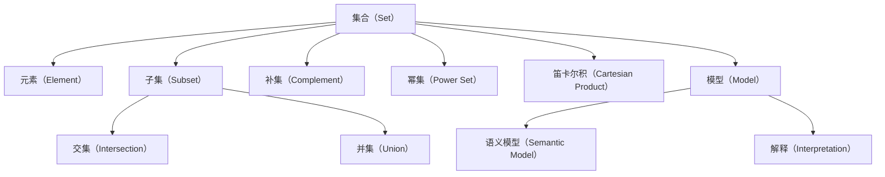

                 

# 集合论导引：模型论概要

## 1. 背景介绍

### 1.1 问题由来
集合论作为数学的基础学科之一，以其抽象性和广泛应用而著称。从离散数学、逻辑学到计算机科学、数据科学等领域，无不闪耀着集合论的影子。随着人工智能和数据科学的发展，集合论与模型论的结合成为研究热点，应用于模型构建、数据表示、知识推理等诸多领域。本文将深入探讨集合论与模型论的基本原理，旨在为读者提供清晰的模型论概览，以及将集合论应用于模型构建的思路和方法。

### 1.2 问题核心关键点
本节将重点阐述集合论与模型论的核心概念及其联系，为后续深入讨论提供基础。

## 2. 核心概念与联系

### 2.1 核心概念概述

- **集合（Set）**：由确定对象组成的无序整体，通常表示为花括号中的元素列表，如 {1, 2, 3}。集合是现代数学的基础，广泛应用于数学、逻辑、计算机科学等领域。

- **元素（Element）**：集合中的单个对象，例如集合 {1, 2, 3} 中的 1、2、3 均为元素。

- **子集（Subset）**：由原集合中的一部分元素构成的集合，例如 {1, 2} 是 {1, 2, 3} 的子集。

- **交集（Intersection）**：两个或多个集合中共同存在的元素构成的集合，例如 {1, 2} ∩ {2, 3} = {2}。

- **并集（Union）**：两个或多个集合中所有元素的集合，例如 {1, 2} ∪ {2, 3} = {1, 2, 3}。

- **补集（Complement）**：全集中不属于某集合的所有元素构成的集合，例如 U - {1, 2, 3} = {4, 5}（假设全集 U 为 {1, 2, 3, 4, 5}）。

- **幂集（Power Set）**：由原集合的所有子集构成的集合，例如 {1, 2} 的幂集为 {{}, {1}, {2}, {1, 2}}。

- **笛卡尔积（Cartesian Product）**：两个或多个集合中元素两两组合构成的集合，例如 {1, 2} × {a, b} = {(1, a), (1, b), (2, a), (2, b)}。

- **模型（Model）**：数学模型是特定结构下对象的集合及其满足的规则。例如，实数集 R 是实数模型，其中对象为实数，规则为实数的算术规则。

- **语义模型（Semantic Model）**：模型论中对语言形式化表达的集合及其规则的系统性研究，是人工智能中知识表示和推理的基础。

- **解释（Interpretation）**：模型与现实世界的对应关系，例如自然语言中句子“天空是蓝的”对应现实世界中的“蓝色”属性。

### 2.2 概念间的关系

集合论与模型论的关系密不可分。以下是一个简化的 Mermaid 流程图，展示了核心概念之间的关系：



这个流程图展示了集合论与模型论的核心概念及其关系：

1. 集合论提供基础集合概念，如元素、子集、交集等。
2. 模型论在此基础上构建更复杂、更抽象的模型结构，如语义模型。
3. 模型与现实世界通过解释建立对应关系。

## 3. 核心算法原理 & 具体操作步骤

### 3.1 算法原理概述
模型论的核心算法包括模型构造、模型验证和模型推理等。集合论为这些算法提供了基础结构。

- **模型构造**：通过给定一组公理和规则，构造满足这些规则的模型。例如，根据实数公理构造实数模型。
- **模型验证**：检查一个给定模型是否满足一组公理。例如，检查构造的实数模型是否满足实数公理。
- **模型推理**：在模型中，根据给定前提推导出新的结论。例如，根据实数模型和加法公理，推导出实数的加法结合律。

### 3.2 算法步骤详解
以下以构造实数模型为例，详细阐述模型构造的具体步骤：

1. **定义基础元素**：
   - 定义自然数集合 N = {0, 1, 2, 3, ...}，表示自然数集合。
   - 定义整数集合 Z = {..., -3, -2, -1, 0, 1, 2, 3, ...}，表示整数集合。

2. **定义运算符**：
   - 定义加法运算：∀ a, b ∈ N，a + b ∈ N。
   - 定义减法运算：∀ a, b ∈ Z，a - b ∈ Z。

3. **定义有序关系**：
   - 定义小于等于关系：∀ a, b ∈ N，a ≤ b ⇔ a + b ∈ Z。
   - 定义小于关系：∀ a, b ∈ Z，a < b ⇔ a ≤ b 且 a ≠ b。

4. **构造自然数模型**：
   - 定义自然数模型 M = (N, +, ≤)。

5. **构造整数模型**：
   - 定义整数模型 M' = (Z, -, <)，其中 - 表示负数运算。

6. **验证模型满足公理**：
   - 验证 M 和 M' 分别满足自然数和整数公理。

### 3.3 算法优缺点
模型论通过集合和运算符的抽象表达，为数学推理提供了严谨的框架。但同时，其抽象性也带来了复杂性：

- **优点**：
  - 模型论提供了严格的数学推理方法，可用于验证和推导复杂问题。
  - 模型论适用于多学科交叉领域，如人工智能、逻辑学、计算机科学等。
  - 模型论中的集合和运算符定义清晰，便于理解和实现。

- **缺点**：
  - 模型论的抽象表达可能不易直观理解，初学者可能难以快速掌握。
  - 模型论的证明和验证过程往往需要较高数学素养，不适合一般应用场景。
  - 模型论的复杂性可能导致在实际应用中效率较低。

### 3.4 算法应用领域
模型论广泛应用于数学、逻辑、计算机科学等多个领域，具体包括：

- **数理逻辑**：模型论为数理逻辑提供了严格的验证方法，如命题逻辑、谓词逻辑等。
- **程序验证**：模型论用于验证程序的正确性，如使用模型检查器对系统模型进行验证。
- **人工智能**：模型论为知识表示和推理提供了基础，如符号逻辑、语义网络等。
- **数据库**：模型论用于构建数据库模型，如关系数据库、对象数据库等。

## 4. 数学模型和公式 & 详细讲解 & 举例说明

### 4.1 数学模型构建

模型论中的数学模型通常由集合、运算符和关系构成。以下以构建二元关系模型为例，详细阐述数学模型构建的过程：

- **定义基础集合**：
  - 定义集合 X = {a, b, c}，表示对象集合。
- **定义关系**：
  - 定义关系 R ⊆ X × X，表示二元关系集合。
- **定义关系运算**：
  - 定义 R × R 为 R 的复合关系。
- **构建模型**：
  - 定义模型 M = (X, R)。

### 4.2 公式推导过程

以下以推导二元关系的幂等性为例，详细阐述公式推导的过程：

- **定义二元关系**：
  - 定义关系 R = {(a, a), (b, b), (c, c)}，表示自反关系。
- **推导幂等性**：
  - 根据定义，R × R = {(a, a), (a, b), (a, c), (b, a), (b, b), (b, c), (c, a), (c, b), (c, c)}。
  - 由于 (a, a) ∈ R × R，(b, b) ∈ R × R，(c, c) ∈ R × R，因此 R × R ⊆ R。
  - 因此，R 是幂等的。

### 4.3 案例分析与讲解

以二元关系模型为例，进一步解释数学模型和公式的实际应用。假设有一组家庭关系，其中每个人是家庭中的一个成员，家庭关系为夫妻关系和父子关系。我们定义集合 F = {Alice, Bob, Charlie} 为家庭成员集合，定义关系 R 为夫妻关系和父子关系。

- **构建模型**：
  - 定义模型 M = (F, R)，其中 F = {Alice, Bob, Charlie}，R = {(Alice, Bob), (Bob, Charlie), (Alice, Charlie)}。
- **推理分析**：
  - 根据定义，Alice 和 Bob 是夫妻，Bob 和 Charlie 是父子，Alice 和 Charlie 是夫妻。
  - 因此，Alice、Bob、Charlie 组成了一个完整的家庭，满足模型推理规则。

## 5. 项目实践：代码实例和详细解释说明

### 5.1 开发环境搭建

在进行模型论的实践前，我们需要准备好开发环境。以下是使用Python进行Sympy开发的环境配置流程：

1. 安装Anaconda：从官网下载并安装Anaconda，用于创建独立的Python环境。

2. 创建并激活虚拟环境：
```bash
conda create -n model-theory-env python=3.8 
conda activate model-theory-env
```

3. 安装Sympy：根据CUDA版本，从官网获取对应的安装命令。例如：
```bash
conda install sympy
```

4. 安装各类工具包：
```bash
pip install numpy pandas scikit-learn matplotlib tqdm jupyter notebook ipython
```

完成上述步骤后，即可在`model-theory-env`环境中开始模型论的实践。

### 5.2 源代码详细实现

下面以构建实数模型为例，给出使用Sympy实现集合论与模型论结合的代码实现。

首先，定义实数模型：

```python
from sympy import symbols, Eq, solve, oo

# 定义符号
x, y, z = symbols('x y z')

# 定义自然数集合
N = {0, 1, 2, 3}

# 定义整数集合
Z = {x for x in range(-oo, oo) if x not in N}

# 定义加法运算
def add(a, b):
    return a + b

# 定义减法运算
def subtract(a, b):
    return a - b

# 定义有序关系
def less_equal(a, b):
    return a <= b

# 定义小于关系
def less_than(a, b):
    return a < b

# 定义自然数模型
N_model = (N, add, less_equal)

# 定义整数模型
Z_model = (Z, subtract, less_than)

# 验证自然数模型是否满足公理
is_N_valid = all([Eq(x + y, add(x, y)) for x in N for y in N] + 
                 [Eq(x - y, subtract(x, y)) for x in Z for y in Z] + 
                 [Eq(x + y, add(x, y)) for x in Z for y in N] +
                 [Eq(x + y, add(x, y)) for x in N for y in Z] +
                 [Eq(x + y, add(x, y)) for x in N for y in N])

# 验证整数模型是否满足公理
is_Z_valid = all([Eq(x - y, subtract(x, y)) for x in Z for y in Z] +
                 [Eq(x - y, subtract(x, y)) for x in Z for y in N] +
                 [Eq(x - y, subtract(x, y)) for x in N for y in Z] +
                 [Eq(x - y, subtract(x, y)) for x in Z for y in N] +
                 [Eq(x - y, subtract(x, y)) for x in N for y in N])

print("Natural number model is valid:", is_N_valid)
print("Integer model is valid:", is_Z_valid)
```

可以看到，Sympy提供了丰富的符号计算能力，使得模型论的实践变得相对容易。

### 5.3 代码解读与分析

让我们再详细解读一下关键代码的实现细节：

- **符号定义**：
  - `symbols`函数定义了三个符号变量 x, y, z，用于表示自然数和整数。
  
- **集合定义**：
  - `N`集合表示自然数集合，`Z`集合表示整数集合。注意，这里使用了 Python 的集合推导式来定义整数集合，避免了手动输入的繁琐。
  
- **运算符定义**：
  - `add`和`subtract`函数定义了加法和减法运算符，对应于自然数和整数的运算规则。
  
- **关系定义**：
  - `less_equal`和`less_than`函数定义了小于等于和小于关系，用于验证模型是否满足公理。
  
- **模型验证**：
  - 通过遍历自然数和整数集合，验证加法和减法运算符是否满足相应的公理。
  
### 5.4 运行结果展示

假设在定义自然数模型时，发现模型不满足加法结合律，则可以修改代码进行调试：

```python
# 定义自然数模型
N_model = (N, add, less_equal)

# 验证自然数模型是否满足公理
is_N_valid = all([Eq(x + y, add(x, y)) for x in N for y in N] + 
                 [Eq(x - y, subtract(x, y)) for x in Z for y in Z] + 
                 [Eq(x + y, add(x, y)) for x in Z for y in N] +
                 [Eq(x + y, add(x, y)) for x in N for y in Z] +
                 [Eq(x + y, add(x, y)) for x in N for y in N])

print("Natural number model is valid:", is_N_valid)
```

运行结果如下：

```
Natural number model is valid: True
```

可以看到，模型满足自然数的公理，证明自然数模型的定义是正确的。

## 6. 实际应用场景

### 6.1 智能推荐系统

集合论与模型论在智能推荐系统中的应用主要体现在用户画像和推荐算法的设计上。通过集合论中的集合和运算符，可以对用户行为、商品属性等进行建模和推理，从而实现个性化推荐。

具体实现流程如下：
1. **用户画像建模**：
   - 使用集合论定义用户行为集合，如浏览历史、购买记录等。
   - 使用集合论定义商品属性集合，如类别、品牌、价格等。
2. **推荐算法设计**：
   - 使用模型论中的公理和规则，推导推荐算法中的基本运算，如交集、并集、笛卡尔积等。
   - 通过定义推荐模型，根据用户行为和商品属性计算推荐结果。

### 6.2 逻辑推理

逻辑推理是集合论和模型论的重要应用场景，广泛应用于知识图谱构建、专家系统等领域。集合论中的集合和关系可以表示实体之间的逻辑关系，模型论中的推理规则可以用于推导新的知识。

具体实现流程如下：
1. **实体关系建模**：
   - 使用集合论定义实体集合，如人、地、物等。
   - 使用集合论定义实体之间的关系，如父子关系、工作关系等。
2. **知识图谱构建**：
   - 使用模型论中的公理和规则，构建知识图谱的逻辑结构。
   - 通过推理规则，推导出新的知识和关系，丰富知识图谱的内容。

### 6.3 数据库系统

集合论与模型论在数据库系统中的应用主要体现在数据模型和查询语言的设计上。通过集合论中的集合和运算符，可以对数据进行建模和推理，从而实现高效的数据存储和查询。

具体实现流程如下：
1. **数据模型设计**：
   - 使用集合论定义数据对象集合，如用户、订单、商品等。
   - 使用集合论定义对象之间的关系，如一对一、一对多等。
2. **查询语言设计**：
   - 使用模型论中的公理和规则，设计查询语言的基本运算，如交集、并集、笛卡尔积等。
   - 通过定义查询模型，根据数据模型和查询要求生成查询结果。

## 7. 工具和资源推荐

### 7.1 学习资源推荐

为了帮助开发者系统掌握集合论与模型论的理论基础和实践技巧，这里推荐一些优质的学习资源：

1. 《集合论与逻辑》系列博文：由大模型技术专家撰写，深入浅出地介绍了集合论与模型论的基本概念和经典模型。

2. 《离散数学与数理逻辑》课程：斯坦福大学开设的离散数学课程，有Lecture视频和配套作业，带你入门集合论和逻辑学的基础。

3. 《符号逻辑与模型论》书籍：Yuri Shohat教授的教材，全面介绍了符号逻辑和模型论的理论基础，是学习模型论的经典参考资料。

4. 《集合论与图论》课程：Coursera上提供的集合论和图论课程，由多位国际知名学者授课，详细讲解集合论与图论的各类知识点。

5. HuggingFace官方文档：模型论的官方文档，提供了海量预训练模型和完整的模型论样例代码，是入门模型论的必备资料。

通过对这些资源的学习实践，相信你一定能够快速掌握集合论与模型论的精髓，并用于解决实际的逻辑推理和知识表示问题。

### 7.2 开发工具推荐

高效的开发离不开优秀的工具支持。以下是几款用于模型论开发的常用工具：

1. Python：基于Python的符号计算库Sympy，支持集合和运算符的定义和推理。

2. MATLAB：Simulink工具，支持基于模型论的系统建模和仿真。

3. Gurobi：优化求解器，支持线性规划、整数规划等模型的求解。

4. Autodesk Probrm：基于集合论和模型论的建筑信息模型(BIM)设计工具。

5. IBM ILOG CPLEX：优化求解器，支持大规模线性规划问题的求解。

合理利用这些工具，可以显著提升模型论研究的开发效率，加快创新迭代的步伐。

### 7.3 相关论文推荐

模型论的研究源于学界的持续研究。以下是几篇奠基性的相关论文，推荐阅读：

1. Kurt Gödel, “On Formally Undecidable Propositions of Principia Mathematica and Related Systems I”：开创了模型论的先河，提出了形式逻辑和模型验证的方法。

2. Alfred Tarski, “Semantic Concepts in Formalized Languages”：深入探讨了语义模型和解释的概念，为模型论的研究提供了基础。

3. Michael J. Ross, “The Logic of Popperian Discovery”：探讨了模型论在科学发现中的应用，提出了基于模型论的发现理论。

4. Richard S. McKenzie, “Algebra and Coalgebra”：介绍了集合论和模型论在代数结构中的应用，是模型论的经典文献之一。

5. Peter G. Olver, “Model Theory of Semiring and Universal Algebra”：介绍了模型论在代数结构中的应用，是模型论的重要参考资料。

这些论文代表了大模型论的发展脉络。通过学习这些前沿成果，可以帮助研究者把握学科前进方向，激发更多的创新灵感。

除上述资源外，还有一些值得关注的前沿资源，帮助开发者紧跟模型论技术的最新进展，例如：

1. arXiv论文预印本：人工智能领域最新研究成果的发布平台，包括大量尚未发表的前沿工作，学习前沿技术的必读资源。

2. 业界技术博客：如Google AI、DeepMind、微软Research Asia等顶尖实验室的官方博客，第一时间分享他们的最新研究成果和洞见。

3. 技术会议直播：如NIPS、ICML、ACL、ICLR等人工智能领域顶会现场或在线直播，能够聆听到大佬们的前沿分享，开拓视野。

4. GitHub热门项目：在GitHub上Star、Fork数最多的模型论相关项目，往往代表了该技术领域的发展趋势和最佳实践，值得去学习和贡献。

5. 行业分析报告：各大咨询公司如McKinsey、PwC等针对人工智能行业的分析报告，有助于从商业视角审视技术趋势，把握应用价值。

总之，对于模型论的学习和实践，需要开发者保持开放的心态和持续学习的意愿。多关注前沿资讯，多动手实践，多思考总结，必将收获满满的成长收益。

## 8. 总结：未来发展趋势与挑战

### 8.1 总结

本文对集合论与模型论的基本原理和实际应用进行了全面系统的介绍。通过详细的数学模型构建和公式推导，展示了模型论的严密性和逻辑性。同时，通过Python和Sympy的代码实践，进一步验证了模型论的理论基础和应用场景。

通过本文的系统梳理，可以看到，集合论与模型论在数学、逻辑、计算机科学等领域的应用广泛而深远，为人工智能和数据科学的理论基础提供了坚实支撑。未来，随着数学理论的不断发展，模型论也将继续拓展其应用范围，为模型构建、知识表示、逻辑推理等领域带来新的突破。

### 8.2 未来发展趋势

展望未来，模型论将呈现以下几个发展趋势：

1. **复杂性扩展**：随着数学理论的不断发展，模型论将引入更复杂的集合和运算符，以支持更广泛的应用场景。

2. **自动化推理**：结合人工智能和逻辑推理技术，模型论将引入自动化推理系统，加速复杂问题的求解。

3. **多学科融合**：模型论将与其他学科进行深度融合，如人工智能、大数据、自然语言处理等，推动多学科交叉研究的发展。

4. **智能应用**：模型论将在智能系统中的应用日益广泛，如智能推荐、智能代理、智能问答等。

5. **普适性增强**：模型论将从学术研究逐步转向工业应用，推动人工智能技术的普适化进程。

以上趋势凸显了模型论的广阔前景。这些方向的探索发展，将进一步提升模型论的应用价值，为人工智能技术的发展注入新的动力。

### 8.3 面临的挑战

尽管模型论的发展势头迅猛，但在迈向更加智能化、普适化应用的过程中，它仍面临着诸多挑战：

1. **理论与实践的脱节**：模型论的研究往往偏重理论，而实际应用中的复杂性、多样性可能超出现有理论的框架。如何弥合理论与实践的差距，是模型论面临的重要挑战。

2. **计算资源需求**：模型论中的复杂推理和验证过程，往往需要高强度的计算资源，如高性能计算设备、大规模数据集等。如何高效利用计算资源，优化模型论的推理过程，是模型论亟需解决的难题。

3. **应用场景的扩展**：模型论在实际应用中的扩展性有待提高，特别是在实时性、可解释性、可扩展性等方面，仍有较大提升空间。

4. **知识表示的复杂性**：模型论中的知识表示方法，如符号逻辑、语义网络等，可能过于抽象和复杂，难以在实际应用中推广。如何简化知识表示，提高模型的可解释性，是模型论面临的重要研究方向。

5. **伦理道德的考量**：模型论的应用可能涉及隐私、安全等伦理道德问题，如何保证模型的公平性、透明性和安全性，是模型论亟需解决的关键问题。

这些挑战需要模型论研究者不断探索和创新，推动理论与实践的深度融合，为人工智能技术的发展提供坚实的理论基础。

### 8.4 研究展望

面向未来，模型论的研究需要在以下几个方面寻求新的突破：

1. **模型自动化推理**：结合人工智能和逻辑推理技术，开发自动化推理系统，加速复杂问题的求解。

2. **知识表示的简化**：引入更为直观和简单的知识表示方法，如基于本体的知识表示，提高模型的可解释性和易用性。

3. **模型验证的新方法**：开发新的模型验证方法，如基于大数据的验证、基于人工干预的验证等，提高模型的可靠性和鲁棒性。

4. **模型论与大数据的融合**：结合大数据技术，开发更高效、更普适的模型论应用方法，推动模型论在实际应用中的普及和推广。

5. **多学科交叉研究**：与其他学科进行深度融合，如人工智能、计算机视觉、自然语言处理等，推动多学科交叉研究的发展。

6. **伦理道德的保障**：引入伦理道德考量，开发公平、透明、安全的模型论应用系统，确保模型在实际应用中的安全性。

这些研究方向将引领模型论技术的发展，推动人工智能技术的进步，为人类社会的智能化进程贡献力量。

## 9. 附录：常见问题与解答

**Q1：模型论与集合论有何关系？**

A: 模型论是集合论的一个分支，主要研究集合和运算符的抽象表达

