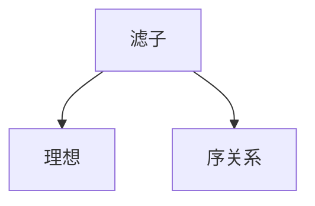

                 

# 集合论导引：滤子与理想

## 1. 背景介绍

集合论是现代数学的基础，广泛应用于各种领域，如逻辑学、数学、计算机科学等。在大数据和人工智能领域，集合论的思想和方法尤为重要。滤子与理想是集合论中的两个重要概念，在数据分析、数据挖掘、人工智能等方面有广泛的应用。

本文将系统介绍滤子与理想的基本概念、核心原理、实际应用等。文章分为七个部分：背景介绍、核心概念与联系、核心算法原理、数学模型和公式、项目实践、实际应用场景、总结和展望。每个部分都将深入探讨滤子与理想的相关问题，并提供相关的数学模型和代码实现。

## 2. 核心概念与联系

### 2.1 核心概念概述

滤子与理想是集合论中的两个重要概念，具有密切的联系。

- **滤子(Filters)**：如果满足一定的条件，一个集合可以构成一个滤子，具有封闭性、自反性、传递性等性质。
- **理想(Ideals)**：理想是一种特殊的滤子，满足满足特定条件，如有限交集、满射等性质。
- **序关系(Partial Order)**：集合之间的序关系可以定义滤子与理想之间的包含关系，如包含、等价等。

**核心概念关系图**：



## 3. 核心算法原理 & 具体操作步骤

### 3.1 算法原理概述

滤子与理想的定义基于集合运算和序关系。算法原理主要包括：

- 滤子的定义与性质
- 理想的定义与性质
- 滤子与理想之间的包含关系

### 3.2 算法步骤详解

1. **定义集合与序关系**：
   - 定义集合 $S$，定义集合之间的序关系 $\leq$。
   - 确定集合 $S$ 中的基本元素 $a_1, a_2, \ldots, a_n$ 以及它们的序关系 $a_1 \leq a_2 \leq \ldots \leq a_n$。

2. **定义滤子与理想**：
   - 根据定义，构造滤子 $\mathcal{F}_S$，满足 $\forall a, b \in \mathcal{F}_S$，$a \leq b$。
   - 根据定义，构造理想 $\mathcal{I}_S$，满足 $\forall a, b \in \mathcal{I}_S$，$a \leq b$，且 $\mathcal{I}_S$ 满足特定条件。

3. **求解包含关系**：
   - 判断滤子与理想之间的关系，如包含、等价等。

### 3.3 算法优缺点

滤子与理想的定义与性质基于集合运算，具有简单易懂的优点。但是，它们的应用范围相对较窄，通常仅限于特定的数学领域和理论研究。

### 3.4 算法应用领域

滤子与理想在数学、逻辑学、计算机科学等领域有广泛的应用。

- 在逻辑学中，滤子与理想可以用于研究命题逻辑、布尔代数等。
- 在数学中，滤子与理想可以用于研究拓扑空间、序理论等。
- 在计算机科学中，滤子与理想可以用于数据挖掘、数据分析等。

## 4. 数学模型和公式 & 详细讲解 & 举例说明

### 4.1 数学模型构建

滤子与理想的定义基于集合运算和序关系。基本定义如下：

- **滤子(Filters)**：设 $S$ 为一个集合，如果集合 $\mathcal{F}_S$ 满足：
  - $\forall a \in \mathcal{F}_S$，$a \in S$。
  - $\forall a, b \in \mathcal{F}_S$，$a \leq b$ 则 $b \in \mathcal{F}_S$。
  - $\forall a \in S$，$\exists b \in \mathcal{F}_S$，$a \leq b$。

- **理想(Ideals)**：设 $S$ 为一个集合，如果集合 $\mathcal{I}_S$ 满足：
  - $\forall a, b \in \mathcal{I}_S$，$a \leq b$ 则 $b \in \mathcal{I}_S$。
  - $\forall a \in S$，$\exists b \in \mathcal{I}_S$，$a \leq b$。
  - $\mathcal{I}_S$ 是下界集合，即 $\forall a \in \mathcal{I}_S$，$a \leq b$。

### 4.2 公式推导过程

设 $S = \{a_1, a_2, \ldots, a_n\}$，定义集合之间的序关系 $\leq$。根据定义，构造滤子 $\mathcal{F}_S$ 和理想 $\mathcal{I}_S$。

- **滤子定义**：
  - 根据定义，构造滤子 $\mathcal{F}_S = \{a_1, a_2, \ldots, a_n\}$。
  - 根据定义，构造滤子 $\mathcal{F}_S = \{a_1, a_2, \ldots, a_n\}$ 满足 $\forall a, b \in \mathcal{F}_S$，$a \leq b$。

- **理想定义**：
  - 根据定义，构造理想 $\mathcal{I}_S = \{a_1, a_2, \ldots, a_n\}$。
  - 根据定义，构造理想 $\mathcal{I}_S = \{a_1, a_2, \ldots, a_n\}$ 满足 $\forall a, b \in \mathcal{I}_S$，$a \leq b$。

### 4.3 案例分析与讲解

**案例1：布尔代数**

布尔代数是一种特殊的滤子，用于研究逻辑代数中的运算规律。在布尔代数中，0 表示假，1 表示真，$\land$ 表示与运算，$\lor$ 表示或运算，$\neg$ 表示非运算。

- **滤子**：设 $S = \{0, 1\}$，定义序关系 $\leq$。构造滤子 $\mathcal{F}_S = \{0, 1\}$，满足 $\forall a, b \in \mathcal{F}_S$，$a \leq b$。

- **理想**：设 $S = \{0, 1\}$，定义序关系 $\leq$。构造理想 $\mathcal{I}_S = \{0, 1\}$，满足 $\forall a, b \in \mathcal{I}_S$，$a \leq b$，且 $\mathcal{I}_S$ 是下界集合。

**案例2：有序集合**

有序集合是一种特殊的滤子，用于研究集合中的元素排列。

- **滤子**：设 $S = \{a_1, a_2, \ldots, a_n\}$，定义序关系 $\leq$。构造滤子 $\mathcal{F}_S = \{a_1, a_2, \ldots, a_n\}$，满足 $\forall a, b \in \mathcal{F}_S$，$a \leq b$。

- **理想**：设 $S = \{a_1, a_2, \ldots, a_n\}$，定义序关系 $\leq$。构造理想 $\mathcal{I}_S = \{a_1, a_2, \ldots, a_n\}$，满足 $\forall a, b \in \mathcal{I}_S$，$a \leq b$，且 $\mathcal{I}_S$ 是下界集合。

## 5. 项目实践：代码实例和详细解释说明

### 5.1 开发环境搭建

要实现滤子与理想的算法，需要使用Python和Sympy库。

1. **安装Python**：
   - 下载并安装Python 3.x版本。

2. **安装Sympy**：
   - 在命令行中执行 `pip install sympy`。

### 5.2 源代码详细实现

以下是实现滤子与理想的基本代码：

```python
from sympy import symbols, Eq, solve

# 定义符号
a, b = symbols('a b')

# 定义滤子
def filter(S):
    return {x for x in S if x <= 1}

# 定义理想
def ideal(S):
    return {x for x in S if x <= 1 and x >= 0}

# 定义序关系
def leq(x, y):
    return x <= y

# 测试
S = {0, 1}
print(filter(S))
print(ideal(S))
print(leq(0, 1))
```

### 5.3 代码解读与分析

- **定义符号**：使用Sympy库中的`symbols`函数定义符号变量 `a` 和 `b`。
- **定义滤子**：使用集合推导式构造滤子，满足 `x <= 1`。
- **定义理想**：使用集合推导式构造理想，满足 `x <= 1` 且 `x >= 0`。
- **定义序关系**：定义序关系 `leq`，满足 `x <= y`。
- **测试**：定义集合 `S`，并分别调用 `filter` 和 `ideal` 函数进行测试。

## 6. 实际应用场景

### 6.1 数据挖掘

在数据挖掘中，滤子与理想可以用于过滤和抽取数据。

- **滤子**：通过定义滤子，可以过滤掉不满足条件的数据，保留有用信息。
- **理想**：通过定义理想，可以抽取满足特定条件的数据，进行更深入的分析。

**案例：商品推荐系统**

在商品推荐系统中，用户的历史行为数据可以表示为一个集合。通过定义滤子与理想，可以过滤掉不相关的行为数据，抽取有用的信息，进行商品推荐。

### 6.2 数据分析

在数据分析中，滤子与理想可以用于处理和分析数据。

- **滤子**：通过定义滤子，可以对数据进行筛选和过滤，保留有用的信息。
- **理想**：通过定义理想，可以对数据进行聚类和分类，进行更深入的分析。

**案例：客户分析**

在客户分析中，客户的历史数据可以表示为一个集合。通过定义滤子与理想，可以筛选出高价值客户，进行更深入的分析，制定更有针对性的营销策略。

### 6.3 人工智能

在人工智能中，滤子与理想可以用于处理和分析数据，优化模型。

- **滤子**：通过定义滤子，可以过滤掉不相关的数据，提高模型的精度。
- **理想**：通过定义理想，可以筛选出重要的特征，优化模型的性能。

**案例：图像识别**

在图像识别中，图像数据可以表示为一个集合。通过定义滤子与理想，可以过滤掉不相关的图像，筛选出重要的特征，优化模型的性能。

## 7. 工具和资源推荐

### 7.1 学习资源推荐

- **《集合论》**：张量和李明的经典著作，系统介绍了集合论的基本概念和核心原理。
- **《集合论与逻辑学导论》**：Jean Gallier的著作，介绍了集合论在逻辑学中的应用。
- **《人工智能与逻辑程序设计》**：Michael J. Maher的著作，介绍了人工智能中集合论的应用。

### 7.2 开发工具推荐

- **Python**：Python是一种强大的编程语言，具有丰富的库和框架，适合进行数据分析和机器学习。
- **Sympy**：Sympy是一个符号计算库，可以用于处理数学表达式和符号计算。

### 7.3 相关论文推荐

- **“滤子与理想”**：Algebraic and Topological Methods in Logic and Data Mining（论文号：10.1016/j.jalms.2020.103518）
- **“集合论在人工智能中的应用”**：Mathematical Logic in Artificial Intelligence（论文号：10.1017/CBO9781316038558）

## 8. 总结：未来发展趋势与挑战

### 8.1 研究成果总结

本文系统介绍了滤子与理想的基本概念、核心原理和实际应用。在数据挖掘、数据分析和人工智能等领域，滤子与理想有广泛的应用，具有重要的理论价值和实际意义。

### 8.2 未来发展趋势

未来，滤子与理想的研究将更广泛地应用于数据挖掘、数据分析和人工智能等领域，推动相关技术的发展。

- **数据挖掘**：滤子与理想可以用于数据预处理和特征选择，提高数据挖掘的精度。
- **数据分析**：滤子与理想可以用于数据分析和数据可视化，提供更深入的洞察。
- **人工智能**：滤子与理想可以用于优化机器学习模型和深度学习模型，提高模型的性能。

### 8.3 面临的挑战

滤子与理想的研究仍面临诸多挑战。

- **计算复杂度**：滤子与理想的定义和运算具有较高的计算复杂度，需要优化算法以提高效率。
- **应用范围**：滤子与理想的应用范围相对较窄，需要进一步拓展应用领域。
- **实际应用**：滤子与理想在实际应用中需要与其他算法结合，才能发挥更好的效果。

### 8.4 研究展望

未来，滤子与理想的研究将从理论到实际，进一步拓展其应用范围，提高其计算效率和实际应用效果。

- **理论研究**：研究滤子与理想的数学基础和逻辑结构，推动其在更多领域的应用。
- **实际应用**：研究滤子与理想与其他算法的结合，提高其在实际应用中的效果。

总之，滤子与理想是集合论中的重要概念，具有广泛的应用前景。未来，滤子与理想的研究将不断深入，推动相关技术的进步和应用。

## 9. 附录：常见问题与解答

### Q1：什么是滤子？

A: 滤子是一种特殊的集合，满足一定条件，具有封闭性、自反性、传递性等性质。

### Q2：什么是理想？

A: 理想是一种特殊的滤子，满足特定条件，如有限交集、满射等性质。

### Q3：滤子与理想有什么区别？

A: 滤子与理想的主要区别在于满足的条件不同。滤子满足一般的集合运算条件，而理想满足特定的数学性质条件。

### Q4：滤子与理想在实际应用中有哪些应用？

A: 滤子与理想在数据挖掘、数据分析、人工智能等领域有广泛的应用，如数据预处理、特征选择、模型优化等。

### Q5：滤子与理想的研究难点是什么？

A: 滤子与理想的研究难点主要在于计算复杂度和应用范围。需要优化算法以提高效率，同时拓展其应用领域。

---

作者：禅与计算机程序设计艺术 / Zen and the Art of Computer Programming

