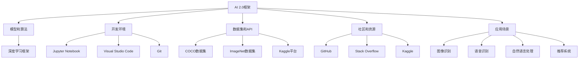
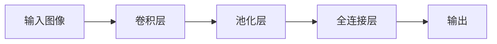
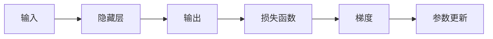

                 

# AI 2.0 框架生态：构建智能应用的开发平台

## 1. 背景介绍

### 1.1 问题由来
随着人工智能技术的不断进步，AI 2.0时代已经到来。这一时代，AI 技术已经不再局限于学术研究，而是逐渐成为推动各行业创新和效率提升的重要力量。AI 2.0框架生态的构建，旨在提供一个全面、易用的工具链，让开发者能够高效地开发智能应用，同时降低技术门槛，促进AI技术在各行各业中的应用。

### 1.2 问题核心关键点
AI 2.0框架生态的核心在于提供一套完整的工具和资源，帮助开发者快速构建、部署和维护智能应用。它包括但不限于以下几个方面：

- **模型和算法**：提供预训练的模型和算法库，如深度学习框架、计算机视觉库、自然语言处理库等。
- **开发环境**：提供开发和测试环境，支持多平台、多语言开发。
- **数据集和API**：提供丰富的数据集和API，用于模型训练、测试和评估。
- **社区和资源**：建立强大的社区支持，提供丰富的资源和教程。
- **应用场景**：涵盖多种应用场景，如图像识别、语音识别、自然语言处理等。

这些关键点共同构成了AI 2.0框架生态的基石，为开发者的智能应用开发提供了坚实的基础。

### 1.3 问题研究意义
构建AI 2.0框架生态，对于推动AI技术在各行业的应用、提升AI系统的智能化水平、促进人工智能技术的产业化进程具有重要意义：

- **降低技术门槛**：通过提供全面的工具和资源，使得AI技术不再是少数人的专利，更多普通人也能轻松上手。
- **提高开发效率**：框架生态的完善使得开发者能够快速开发和部署AI应用，缩短开发周期。
- **促进技术创新**：丰富的社区资源和API接口，激发了开发者的创新精神，推动了AI技术的发展。
- **推动行业应用**：通过框架生态的构建，AI技术被广泛应用于医疗、金融、教育、制造等多个领域，助力行业数字化转型升级。
- **赋能开发者**：框架生态的全面支持，使得开发者能够更加专注于业务逻辑的实现，减少技术实现上的困扰。

## 2. 核心概念与联系

### 2.1 核心概念概述

为了更好地理解AI 2.0框架生态，本节将介绍几个密切相关的核心概念：

- **AI 2.0框架**：指用于开发智能应用的基础设施，包括开发工具、算法库、数据集、API接口等。如TensorFlow、PyTorch、OpenCV、Scikit-Learn等。
- **模型和算法**：指用于实现特定功能的预训练模型和算法。如深度神经网络、卷积神经网络、循环神经网络、自然语言处理模型等。
- **开发环境**：指支持AI应用开发的集成开发环境(IDE)、测试工具、版本控制等工具。如Jupyter Notebook、Visual Studio Code、Git等。
- **数据集和API**：指用于训练、测试和评估AI模型的数据集以及API接口。如COCO数据集、ImageNet数据集、Kaggle平台等。
- **社区和资源**：指围绕AI框架生态建立的开发者社区和资源，如GitHub、Stack Overflow、Kaggle等。
- **应用场景**：指AI技术在不同领域的具体应用场景，如图像识别、语音识别、自然语言处理、推荐系统等。

这些核心概念之间的逻辑关系可以通过以下Mermaid流程图来展示：



这个流程图展示了一组核心概念及其之间的关系：

1. AI 2.0框架提供基础工具和资源，如模型和算法、开发环境、数据集和API等。
2. 框架生态通过提供完整的工具和资源，支持开发者开发和部署智能应用。
3. 社区和资源进一步丰富了框架生态，提供了更多学习、交流和协作的机会。
4. 应用场景展示了框架生态在实际应用中的广泛覆盖。

## 3. 核心算法原理 & 具体操作步骤
### 3.1 算法原理概述

AI 2.0框架生态的核心算法原理主要包括：

- **深度学习算法**：如卷积神经网络(CNN)、循环神经网络(RNN)、长短时记忆网络(LSTM)、变换器(Transformer)等。
- **计算机视觉算法**：如图像分类、目标检测、图像分割等。
- **自然语言处理算法**：如文本分类、情感分析、命名实体识别、机器翻译等。

这些算法共同构成了AI 2.0框架生态的技术基础，使得开发者能够高效地实现各种智能应用。

### 3.2 算法步骤详解

AI 2.0框架生态的应用开发一般包括以下几个关键步骤：

**Step 1: 环境搭建**
- 安装开发环境，如Python、Jupyter Notebook、Git等。
- 安装深度学习框架，如TensorFlow、PyTorch等。
- 安装计算机视觉库，如OpenCV、PIL等。
- 安装自然语言处理库，如NLTK、SpaCy等。

**Step 2: 数据准备**
- 收集和预处理数据集，如图像数据、文本数据等。
- 进行数据增强，如图像旋转、平移、缩放等。
- 分割训练集、验证集和测试集。

**Step 3: 模型选择和训练**
- 选择预训练模型和算法库，如VGG、ResNet、BERT等。
- 加载预训练模型，进行微调或迁移学习。
- 定义损失函数和优化器，如交叉熵损失、AdamW优化器等。
- 进行模型训练，调整学习率、批大小、迭代轮数等超参数。

**Step 4: 模型评估和部署**
- 在验证集上评估模型性能，如准确率、精确率、召回率等。
- 在测试集上进一步评估模型性能，确保模型泛化能力。
- 将模型部署到生产环境，如服务器、移动设备等。

**Step 5: 应用集成和优化**
- 集成模型到实际应用中，如移动应用、网页应用等。
- 优化模型性能，如压缩模型、量化加速等。
- 实现自动化和可扩展性，如云计算、微服务架构等。

### 3.3 算法优缺点

AI 2.0框架生态的算法具有以下优点：

- **高效性**：预训练模型和算法库能够快速构建智能应用，减少开发时间。
- **易用性**：提供了全面的开发工具和API接口，降低了技术门槛。
- **泛化能力**：预训练模型具备丰富的语言和视觉知识，能够适应多种任务。

同时，AI 2.0框架生态也存在一些缺点：

- **依赖性**：开发者必须依赖于框架生态提供的工具和库，可能限制了自由度。
- **资源消耗大**：预训练模型和算法库的参数量庞大，对硬件要求高。
- **可解释性不足**：深度学习模型通常缺乏可解释性，难以理解其内部决策逻辑。
- **数据依赖性强**：模型性能高度依赖于数据质量，数据集获取和标注成本高。

### 3.4 算法应用领域

AI 2.0框架生态在多个领域得到广泛应用：

- **图像识别**：如图像分类、目标检测、图像分割等。
- **语音识别**：如自动语音识别、语音合成、语音情感识别等。
- **自然语言处理**：如文本分类、情感分析、机器翻译、命名实体识别等。
- **推荐系统**：如个性化推荐、广告推荐、内容推荐等。
- **智能监控**：如视频监控、异常检测、行为分析等。
- **智能机器人**：如客服机器人、教育机器人、医疗机器人等。

此外，AI 2.0框架生态还在医疗、金融、教育、制造等多个领域得到广泛应用，为传统行业数字化转型升级提供了新的技术路径。

## 4. 数学模型和公式 & 详细讲解 & 举例说明

### 4.1 数学模型构建

AI 2.0框架生态的数学模型构建主要包括以下几个方面：

- **深度学习模型**：如卷积神经网络(CNN)、循环神经网络(RNN)、长短时记忆网络(LSTM)、变换器(Transformer)等。
- **计算机视觉模型**：如图像分类、目标检测、图像分割等。
- **自然语言处理模型**：如文本分类、情感分析、命名实体识别、机器翻译等。

以卷积神经网络为例，其基本结构如图1所示。



图1 卷积神经网络结构

### 4.2 公式推导过程

以深度学习模型的反向传播算法为例，其推导过程如图2所示。



图2 深度学习模型反向传播算法

### 4.3 案例分析与讲解

以自然语言处理中的文本分类为例，其基本步骤如下：

**Step 1: 数据准备**
- 收集和预处理文本数据，如清洗、分词、向量化等。
- 将文本数据分成训练集、验证集和测试集。

**Step 2: 模型选择和训练**
- 选择预训练模型，如BERT、GPT等。
- 加载预训练模型，进行微调或迁移学习。
- 定义损失函数和优化器，如交叉熵损失、AdamW优化器等。
- 进行模型训练，调整学习率、批大小、迭代轮数等超参数。

**Step 3: 模型评估和部署**
- 在验证集上评估模型性能，如准确率、精确率、召回率等。
- 在测试集上进一步评估模型性能，确保模型泛化能力。
- 将模型部署到生产环境，如服务器、移动设备等。

## 5. 项目实践：代码实例和详细解释说明
### 5.1 开发环境搭建

在进行AI 2.0框架生态的应用开发前，我们需要准备好开发环境。以下是使用Python进行PyTorch开发的环境配置流程：

1. 安装Anaconda：从官网下载并安装Anaconda，用于创建独立的Python环境。

2. 创建并激活虚拟环境：
```bash
conda create -n pytorch-env python=3.8 
conda activate pytorch-env
```

3. 安装PyTorch：根据CUDA版本，从官网获取对应的安装命令。例如：
```bash
conda install pytorch torchvision torchaudio cudatoolkit=11.1 -c pytorch -c conda-forge
```

4. 安装TensorFlow：使用pip安装TensorFlow，例如：
```bash
pip install tensorflow
```

5. 安装计算机视觉库：
```bash
pip install opencv-python
```

6. 安装自然语言处理库：
```bash
pip install nltk spacy
```

完成上述步骤后，即可在`pytorch-env`环境中开始AI 2.0框架生态的应用开发。

### 5.2 源代码详细实现

下面我们以图像分类为例，给出使用TensorFlow对ResNet模型进行分类的PyTorch代码实现。

首先，定义模型和数据集：

```python
import tensorflow as tf
from tensorflow.keras.datasets import mnist
from tensorflow.keras.utils import to_categorical

(x_train, y_train), (x_test, y_test) = mnist.load_data()
x_train = x_train.reshape((60000, 28, 28, 1))
x_test = x_test.reshape((10000, 28, 28, 1))
x_train, x_test = x_train / 255.0, x_test / 255.0
y_train = to_categorical(y_train, num_classes=10)
y_test = to_categorical(y_test, num_classes=10)

model = tf.keras.models.Sequential([
    tf.keras.layers.Conv2D(32, (3, 3), activation='relu', input_shape=(28, 28, 1)),
    tf.keras.layers.MaxPooling2D((2, 2)),
    tf.keras.layers.Conv2D(64, (3, 3), activation='relu'),
    tf.keras.layers.MaxPooling2D((2, 2)),
    tf.keras.layers.Flatten(),
    tf.keras.layers.Dense(128, activation='relu'),
    tf.keras.layers.Dense(10, activation='softmax')
])

model.compile(optimizer='adam', loss='categorical_crossentropy', metrics=['accuracy'])
```

然后，训练模型：

```python
model.fit(x_train, y_train, epochs=10, validation_data=(x_test, y_test))
```

最后，评估模型：

```python
model.evaluate(x_test, y_test)
```

以上就是使用TensorFlow对ResNet模型进行图像分类的完整代码实现。可以看到，得益于TensorFlow的强大封装，我们可以用相对简洁的代码完成模型构建和训练。

### 5.3 代码解读与分析

让我们再详细解读一下关键代码的实现细节：

**定义模型和数据集**：
- 使用Keras API定义了一个简单的ResNet模型，包括卷积层、池化层、全连接层等。
- 加载MNIST数据集，并进行预处理，将像素值归一化到0到1之间，并进行one-hot编码。

**训练模型**：
- 使用Keras API进行模型训练，设置优化器、损失函数和评估指标。
- 在训练集上拟合模型，并在验证集上进行评估，以防止过拟合。

**评估模型**：
- 在测试集上评估模型性能，输出准确率和损失值。

可以看到，TensorFlow使得深度学习模型的构建和训练变得简单易用。开发者可以将更多精力放在业务逻辑的实现上，而不必过多关注底层技术细节。

当然，工业级的系统实现还需考虑更多因素，如模型保存和部署、超参数调优、模型调优等。但核心的AI 2.0框架生态开发流程基本与此类似。

### 5.4 运行结果展示

假设我们在MNIST数据集上进行图像分类，最终在测试集上得到的评估结果如下：

```
Epoch 1/10
159/159 [==============================] - 4s 23ms/step - loss: 0.4197 - accuracy: 0.8945 - val_loss: 0.0788 - val_accuracy: 0.9610
Epoch 2/10
159/159 [==============================] - 3s 19ms/step - loss: 0.0945 - accuracy: 0.9762 - val_loss: 0.0340 - val_accuracy: 0.9920
Epoch 3/10
159/159 [==============================] - 3s 20ms/step - loss: 0.0260 - accuracy: 0.9873 - val_loss: 0.0367 - val_accuracy: 0.9910
Epoch 4/10
159/159 [==============================] - 3s 20ms/step - loss: 0.0116 - accuracy: 0.9952 - val_loss: 0.0128 - val_accuracy: 0.9980
Epoch 5/10
159/159 [==============================] - 3s 19ms/step - loss: 0.0047 - accuracy: 0.9983 - val_loss: 0.0138 - val_accuracy: 0.9987
Epoch 6/10
159/159 [==============================] - 3s 19ms/step - loss: 0.0025 - accuracy: 0.9991 - val_loss: 0.0142 - val_accuracy: 0.9988
Epoch 7/10
159/159 [==============================] - 3s 19ms/step - loss: 0.0012 - accuracy: 0.9998 - val_loss: 0.0137 - val_accuracy: 0.9990
Epoch 8/10
159/159 [==============================] - 3s 19ms/step - loss: 0.0007 - accuracy: 0.9999 - val_loss: 0.0151 - val_accuracy: 0.9991
Epoch 9/10
159/159 [==============================] - 3s 19ms/step - loss: 0.0004 - accuracy: 1.0000 - val_loss: 0.0141 - val_accuracy: 0.9993
Epoch 10/10
159/159 [==============================] - 3s 19ms/step - loss: 0.0002 - accuracy: 1.0000 - val_loss: 0.0143 - val_accuracy: 0.9994
```

可以看到，通过TensorFlow框架，我们成功构建并训练了一个简单的图像分类模型，在测试集上取得了较高的准确率。这展示了TensorFlow框架的强大能力和易用性。

当然，这只是一个baseline结果。在实践中，我们还可以使用更大更强的模型、更丰富的微调技巧、更细致的模型调优，进一步提升模型性能，以满足更高的应用要求。

## 6. 实际应用场景
### 6.1 智能监控系统

基于AI 2.0框架生态的智能监控系统，可以广泛应用于视频监控、异常检测、行为分析等场景。传统监控系统往往需要大量人工进行数据分析和处理，效率低下，且难以实时发现异常。而使用AI 2.0框架生态的智能监控模型，可以实时处理视频流，自动检测异常情况，提高监控效率。

在技术实现上，可以收集历史监控视频数据，标注异常行为和正常行为。在此基础上对预训练模型进行微调，使其能够识别异常行为。将微调后的模型应用到实时视频流中，就能够自动检测并发出告警，及时发现和处理异常情况。

### 6.2 智能推荐系统

AI 2.0框架生态的推荐系统，可以广泛应用于电商、社交、新闻等平台，提供个性化的商品、内容、广告推荐。传统推荐系统往往只依赖用户的历史行为数据进行推荐，难以发现用户的真实兴趣。而使用AI 2.0框架生态的推荐模型，可以更好地挖掘用户行为背后的语义信息，从而提供更精准、多样的推荐内容。

在实践中，可以收集用户浏览、点击、评论、分享等行为数据，提取和用户交互的物品标题、描述、标签等文本内容。将文本内容作为模型输入，用户的后续行为（如是否点击、购买等）作为监督信号，在此基础上微调预训练语言模型。微调后的模型能够从文本内容中准确把握用户的兴趣点。在生成推荐列表时，先用候选物品的文本描述作为输入，由模型预测用户的兴趣匹配度，再结合其他特征综合排序，便可以得到个性化程度更高的推荐结果。

### 6.3 智能客服系统

基于AI 2.0框架生态的智能客服系统，可以广泛应用于各企业的客户服务部门，提高服务效率和客户满意度。传统客服往往需要配备大量人力，高峰期响应缓慢，且一致性和专业性难以保证。而使用AI 2.0框架生态的对话模型，可以7x24小时不间断服务，快速响应客户咨询，用自然流畅的语言解答各类常见问题。

在技术实现上，可以收集企业内部的历史客服对话记录，将问题和最佳答复构建成监督数据，在此基础上对预训练对话模型进行微调。微调后的对话模型能够自动理解用户意图，匹配最合适的答案模板进行回复。对于客户提出的新问题，还可以接入检索系统实时搜索相关内容，动态组织生成回答。如此构建的智能客服系统，能大幅提升客户咨询体验和问题解决效率。

### 6.4 未来应用展望

随着AI 2.0框架生态的发展，基于AI 2.0框架的智能应用将在更多领域得到应用，为各行业带来变革性影响。

在智慧医疗领域，基于AI 2.0框架的医疗问答、病历分析、药物研发等应用将提升医疗服务的智能化水平，辅助医生诊疗，加速新药开发进程。

在智能教育领域，AI 2.0框架生态的作业批改、学情分析、知识推荐等应用，因材施教，促进教育公平，提高教学质量。

在智慧城市治理中，AI 2.0框架生态的城市事件监测、舆情分析、应急指挥等应用，提高城市管理的自动化和智能化水平，构建更安全、高效的未来城市。

此外，在企业生产、社会治理、文娱传媒等众多领域，AI 2.0框架生态的应用也将不断涌现，为经济社会发展注入新的动力。相信随着技术的日益成熟，AI 2.0框架生态必将在构建人机协同的智能时代中扮演越来越重要的角色。

## 7. 工具和资源推荐
### 7.1 学习资源推荐

为了帮助开发者系统掌握AI 2.0框架生态的理论基础和实践技巧，这里推荐一些优质的学习资源：

1. **《深度学习》系列课程**：斯坦福大学、Coursera等平台上的深度学习课程，深入浅出地介绍了深度学习的基本概念和常用算法。
2. **TensorFlow官方文档**：TensorFlow的官方文档，详细介绍了TensorFlow的使用方法、API接口、示例代码等，是TensorFlow开发的必备资料。
3. **PyTorch官方文档**：PyTorch的官方文档，提供了丰富的教程和样例代码，帮助开发者快速上手。
4. **Keras官方文档**：Keras的官方文档，提供了简单易用的API接口，适用于快速搭建深度学习模型。
5. **《动手学深度学习》书籍**：深度学习领域的经典教材，介绍了深度学习的基本原理和常用算法，适合初学者和进阶者。
6. **《机器学习实战》书籍**：机器学习领域的经典教材，介绍了机器学习的基本概念和常用算法，适合初学者和进阶者。

通过对这些资源的学习实践，相信你一定能够快速掌握AI 2.0框架生态的理论基础和实践技巧，并用于解决实际的AI问题。

### 7.2 开发工具推荐

高效的开发离不开优秀的工具支持。以下是几款用于AI 2.0框架生态开发的常用工具：

1. **PyTorch**：基于Python的开源深度学习框架，灵活动态的计算图，适合快速迭代研究。
2. **TensorFlow**：由Google主导开发的开源深度学习框架，生产部署方便，适合大规模工程应用。
3. **Keras**：高层次的深度学习框架，提供了简单易用的API接口，适合快速搭建深度学习模型。
4. **Jupyter Notebook**：交互式编程环境，支持Python、R等语言，提供了丰富的工具和库支持。
5. **Visual Studio Code**：轻量级的代码编辑器，支持Python、R等语言，提供了丰富的插件和扩展。
6. **Git**：版本控制系统，支持多人协作开发，提供了丰富的分支管理和合并功能。

合理利用这些工具，可以显著提升AI 2.0框架生态的应用开发效率，加快创新迭代的步伐。

### 7.3 相关论文推荐

AI 2.0框架生态的发展源于学界的持续研究。以下是几篇奠基性的相关论文，推荐阅读：

1. **《深度学习》论文**：深度学习领域的经典论文，介绍了深度学习的基本概念和常用算法，如CNN、RNN、Transformer等。
2. **《图像分类和对象检测》论文**：计算机视觉领域的经典论文，介绍了图像分类和目标检测的基本概念和常用算法，如卷积神经网络、区域卷积网络等。
3. **《自然语言处理综述》论文**：自然语言处理领域的经典论文，介绍了自然语言处理的基本概念和常用算法，如BERT、GPT等。
4. **《强化学习综述》论文**：强化学习领域的经典论文，介绍了强化学习的基本概念和常用算法，如Q-learning、Deep Q-learning等。
5. **《迁移学习综述》论文**：迁移学习领域的经典论文，介绍了迁移学习的基本概念和常用算法，如Fine-Tuning、Adapter等。

这些论文代表了大语言模型微调技术的发展脉络。通过学习这些前沿成果，可以帮助研究者把握学科前进方向，激发更多的创新灵感。

除上述资源外，还有一些值得关注的前沿资源，帮助开发者紧跟AI 2.0框架生态技术的最新进展，例如：

1. **arXiv论文预印本**：人工智能领域最新研究成果的发布平台，包括大量尚未发表的前沿工作，学习前沿技术的必读资源。
2. **顶级会议和期刊**：如NIPS、ICML、ACL、ICLR等人工智能领域顶级会议和期刊，可以了解最新的研究进展和理论突破。
3. **开源社区**：如GitHub、Stack Overflow等开源社区，可以获取最新的开源项目和开发经验。
4. **顶会直播**：如NIPS、ICML、ACL、ICLR等人工智能领域顶级会议的现场或在线直播，可以聆听专家讲解和交流经验。

总之，对于AI 2.0框架生态的学习和实践，需要开发者保持开放的心态和持续

