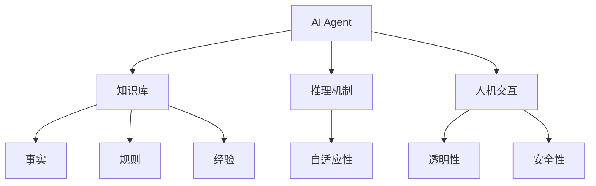
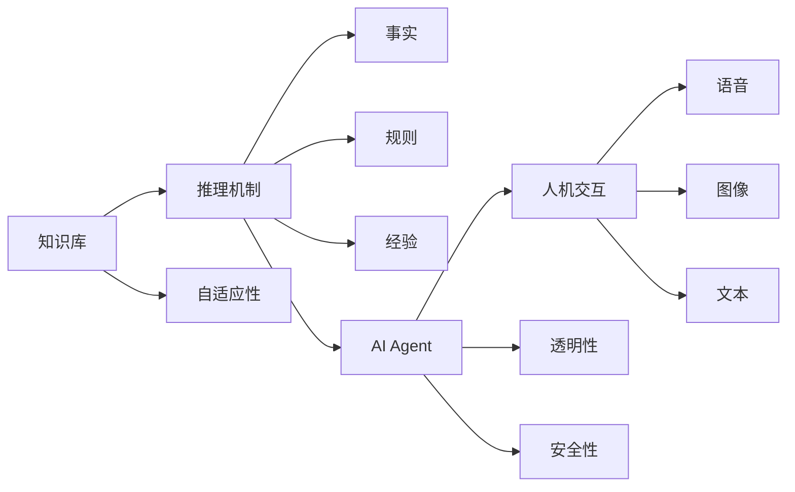

                 

# AI Agent: AI的下一个风口 当前技术的局限性

> 关键词：AI Agent, AI的发展趋势, 当前技术的局限性, 技术瓶颈, 解决方案

## 1. 背景介绍

### 1.1 问题由来
随着人工智能技术的不断进步，AI Agent 成为了当前和未来技术发展的重点。AI Agent，即人工智能代理，是指能够理解、规划、执行和反思的人类智能行为，能够在复杂环境中做出自主决策的系统。AI Agent 能够广泛应用在智能控制、智能决策、智能运维、智能客服等多个领域，为各行各业带来了巨大的价值。

然而，尽管 AI Agent 技术在近年来取得了显著进展，但其实现和应用仍面临诸多技术瓶颈。这些问题不仅限制了 AI Agent 的发展速度，也影响了其大规模部署和实际应用效果。因此，本文将深入探讨 AI Agent 技术的当前局限性，并提出相应的解决方案，以期推动 AI Agent 技术的进一步发展。

### 1.2 问题核心关键点
当前 AI Agent 技术面临的主要问题包括：

1. **知识获取与推理的局限性**：AI Agent 的知识库和推理机制尚无法满足复杂多变、动态变化的环境需求。
2. **自适应性与通用性不足**：AI Agent 在特定领域或场景中表现良好，但在多领域和多场景中的泛化能力有限。
3. **人机交互的局限性**：现有的交互方式如语音、图像等仍存在技术瓶颈，难以满足用户多样化的需求。
4. **模型复杂性与可解释性**：AI Agent 使用的深度神经网络模型复杂，模型难以解释，缺乏透明性。
5. **伦理与安全问题**：AI Agent 可能带来的伦理和安全问题，如隐私泄露、决策透明性不足等。

这些问题制约了 AI Agent 技术的广泛应用和深度发展，需要从多个角度进行深入研究和解决。

### 1.3 问题研究意义
深入研究 AI Agent 技术的当前局限性，并提出可行的解决方案，对于推动 AI Agent 技术的成熟和产业化具有重要意义：

1. **提升 AI Agent 的性能**：通过解决当前技术瓶颈，使 AI Agent 能够在更复杂多变的环境中稳定运行，提升其在实际应用中的效果。
2. **拓展 AI Agent 的应用场景**：通过提升 AI Agent 的通用性和自适应性，使其能够在更多领域和场景中发挥作用，推动技术应用范围的扩大。
3. **增强用户信任**：通过提高 AI Agent 的透明性和安全性，增强用户对其的信任感，促进其广泛应用。
4. **推动 AI 技术的普及与落地**：通过解决技术瓶颈，促进 AI Agent 技术的成熟，推动其在各行各业中的落地应用，推动 AI 技术的普及。
5. **提升 AI 技术的应用价值**：通过解决技术瓶颈，使 AI Agent 能够更好地服务于人类，提升其在社会经济生活中的应用价值。

## 2. 核心概念与联系

### 2.1 核心概念概述

为了更好地理解 AI Agent 技术的局限性，并提出相应的解决方案，首先需要介绍几个核心概念：

1. **AI Agent**：指能够理解、规划、执行和反思的人类智能行为，能够在复杂环境中做出自主决策的系统。
2. **知识库**：存储 AI Agent 的知识，包括事实、规则、经验等，是 AI Agent 推理和决策的基础。
3. **推理机制**：指 AI Agent 根据知识库进行推理和决策的过程，包括符号推理、神经网络推理等。
4. **自适应性**：指 AI Agent 在不断变化的环境中能够快速适应和调整，提升其性能和效果。
5. **人机交互**：指 AI Agent 与用户之间的交互方式，包括语音、图像、文本等。
6. **透明性**：指 AI Agent 的决策过程和内部机制可解释，便于用户理解和信任。
7. **安全性**：指 AI Agent 在运行过程中避免隐私泄露、决策透明性不足等问题，保障用户利益。

### 2.2 概念间的关系

这些核心概念之间存在紧密的联系，形成了 AI Agent 技术的基本框架。以下用 Mermaid 流程图展示这些概念之间的关系：



这个流程图展示了 AI Agent 技术的核心概念及其之间的关系：

1. AI Agent 利用知识库进行推理和决策。
2. 推理机制是 AI Agent 的核心组成部分，负责根据知识库进行推理。
3. 自适应性使 AI Agent 能够快速适应环境变化，提升其性能。
4. 人机交互是 AI Agent 与用户交互的接口，需要通过语音、图像、文本等多种方式实现。
5. 透明性和安全性是 AI Agent 的保障机制，确保其可靠性和用户信任。

这些概念共同构成了 AI Agent 技术的基本框架，是理解和研究 AI Agent 技术局限性的重要基础。

### 2.3 核心概念的整体架构

以下用 Mermaid 综合流程图展示这些核心概念在大规模应用中的整体架构：



这个综合流程图展示了 AI Agent 技术的整体架构，其中知识库、推理机制、自适应性、人机交互、透明性和安全性共同构成了 AI Agent 技术的核心组件，各组件之间相互作用，确保 AI Agent 能够在实际应用中发挥其功能。

## 3. 核心算法原理 & 具体操作步骤
### 3.1 算法原理概述

AI Agent 技术的核心算法原理包括以下几个方面：

1. **知识库构建**：通过人工标注、自动提取等方式构建 AI Agent 的知识库，存储事实、规则和经验。
2. **推理机制设计**：选择符号推理、神经网络推理等方法进行推理，使 AI Agent 能够根据知识库进行决策。
3. **自适应性提升**：通过机器学习、强化学习等方式提升 AI Agent 的自适应性，使其能够快速适应环境变化。
4. **人机交互优化**：设计语音识别、图像识别、自然语言处理等技术，优化人机交互方式，提升用户体验。
5. **透明性和安全性保障**：通过可解释性模型、数据隐私保护等技术，保障 AI Agent 的透明性和安全性。

### 3.2 算法步骤详解

以下详细讲解 AI Agent 技术的核心算法步骤：

1. **知识库构建**
   - 收集并人工标注事实、规则和经验，构建知识库。
   - 使用自动提取技术，如词向量、知识图谱等，进一步优化知识库。

2. **推理机制设计**
   - 选择符号推理、神经网络推理等方法进行推理。
   - 设计推理规则，使 AI Agent 能够根据知识库进行决策。

3. **自适应性提升**
   - 使用机器学习、强化学习等技术，提升 AI Agent 的自适应性。
   - 设计自适应策略，使 AI Agent 能够快速适应环境变化。

4. **人机交互优化**
   - 设计语音识别、图像识别、自然语言处理等技术，优化人机交互方式。
   - 设计人机交互界面，提升用户体验。

5. **透明性和安全性保障**
   - 设计可解释性模型，使 AI Agent 的决策过程可解释。
   - 设计数据隐私保护措施，保障用户数据安全。

### 3.3 算法优缺点

AI Agent 技术的核心算法具有以下优点：

1. **自主决策能力**：AI Agent 能够自主进行决策，减少人工干预，提升效率。
2. **适应性能力强**：AI Agent 能够快速适应环境变化，提升性能。
3. **人机交互自然**：通过优化人机交互方式，提升用户体验。
4. **透明性高**：通过设计可解释性模型，提升用户信任感。

同时，AI Agent 技术也存在一些缺点：

1. **知识获取难度大**：构建知识库需要大量人工标注和自动提取，过程复杂。
2. **推理过程复杂**：符号推理和神经网络推理都需要大量计算资源，过程复杂。
3. **自适应性不足**：现有的自适应技术在复杂多变的环境中效果有限。
4. **人机交互技术瓶颈**：语音识别、图像识别等技术仍存在技术瓶颈，难以满足用户多样化需求。
5. **模型复杂**：使用的深度神经网络模型复杂，难以解释。
6. **安全性问题**：存在隐私泄露、决策透明性不足等安全问题。

### 3.4 算法应用领域

AI Agent 技术在多个领域都有广泛应用，包括但不限于：

1. **智能控制**：应用于智能家居、智能制造、智能交通等领域，实现自动化控制。
2. **智能决策**：应用于金融风控、医疗诊断、物流调度等领域，提供决策支持。
3. **智能运维**：应用于网络安全、设备监控、智能运维等领域，提升运维效率。
4. **智能客服**：应用于客服机器人、智能助理等领域，提升客户服务质量。
5. **智能推荐**：应用于电商推荐、新闻推荐、音乐推荐等领域，提升用户体验。
6. **智能语音助手**：应用于语音助手、智能音箱、智能家居等领域，提升用户交互体验。
7. **智能医疗**：应用于疾病诊断、智能问诊、健康管理等领域，提升医疗服务水平。

## 4. 数学模型和公式 & 详细讲解 & 举例说明

### 4.1 数学模型构建

为了更好地理解和设计 AI Agent 技术的核心算法，需要构建数学模型进行详细讲解。以下以一个简单的 AI Agent 系统为例，构建其数学模型：

假设 AI Agent 系统使用符号推理和神经网络推理相结合的方式，知识库包含以下事实和规则：

- 事实 1：$x+y$。
- 规则 1：$x+y \Rightarrow x+1$。

AI Agent 根据知识库进行推理，具体数学模型如下：

- 推理过程：
  - 输入：$x, y$
  - 推理过程：$x+y \Rightarrow x+1$
  - 输出：$x+1$

- 数学模型：
  - 输入向量：$\vec{x}=(x, y)$
  - 输出向量：$\vec{y}=(x+1)$
  - 推理过程：
    - 符号推理：$x+y \Rightarrow x+1$
    - 神经网络推理：通过神经网络学习 $f(x, y)=x+1$

### 4.2 公式推导过程

以下对 AI Agent 系统的数学模型进行详细推导：

1. **符号推理过程**：
   - 输入：$x, y$
   - 推理过程：$x+y \Rightarrow x+1$
   - 输出：$x+1$

2. **神经网络推理过程**：
   - 输入向量：$\vec{x}=(x, y)$
   - 输出向量：$\vec{y}=(x+1)$
   - 神经网络模型：$f(x, y)=x+1$
   - 神经网络参数：$w, b$

3. **数学模型推导**：
   - 符号推理：$x+y \Rightarrow x+1$
   - 神经网络推理：$x+1=f(x, y)=w_1x+w_2y+b$

### 4.3 案例分析与讲解

以一个简单的智能推荐系统为例，讲解 AI Agent 技术的实际应用：

- **知识库构建**：收集用户的历史行为数据，构建用户兴趣模型和商品特征模型。
- **推理机制设计**：使用神经网络推理，根据用户兴趣模型和商品特征模型，预测用户对商品的兴趣程度。
- **自适应性提升**：使用强化学习，根据用户行为反馈调整模型参数，提升推荐效果。
- **人机交互优化**：设计自然语言处理技术，优化推荐结果的展示方式，提升用户体验。
- **透明性和安全性保障**：设计可解释性模型，使推荐过程可解释，保障用户数据安全。

## 5. 项目实践：代码实例和详细解释说明

### 5.1 开发环境搭建

为了开发和测试 AI Agent 系统，需要搭建相应的开发环境。以下是开发环境的搭建步骤：

1. **安装 Python**：
   - 在 Windows 上：
     ```bash
     python.exe -m pip install virtualenv
     virtualenv venv
     source venv/bin/activate
     pip install tensorflow numpy scikit-learn jupyter notebook
     ```

2. **安装 TensorFlow**：
   - 在 Windows 上：
     ```bash
     pip install tensorflow
     ```

3. **安装其它依赖包**：
   - 在 Windows 上：
     ```bash
     pip install scikit-learn numpy matplotlib
     ```

### 5.2 源代码详细实现

以下是 AI Agent 系统的一个简单实现，使用 TensorFlow 和自然语言处理技术：

1. **知识库构建**：
   ```python
   import numpy as np

   # 构建知识库
   facts = {
       'x+y': 'x+1'
   }

   # 构建事实矩阵
   fact_matrix = np.zeros((len(facts), 1))
   for i, fact in enumerate(facts):
       fact_matrix[i, 0] = facts[fact]
   ```

2. **推理机制设计**：
   ```python
   # 定义神经网络推理模型
   class Network:
       def __init__(self):
           self.w = np.array([0.5])
           self.b = 0.5

       def forward(self, x):
           return self.w * x + self.b

   # 实例化神经网络
   net = Network()

   # 定义符号推理函数
   def symbolic_inference(fact, x, y):
       if fact == 'x+y':
           return x + 1
       else:
           return None

   # 测试推理机制
   x = 2
   y = 3
   result_symbolic = symbolic_inference('x+y', x, y)
   result_neural = net.forward(np.array([x, y]))
   print(f'符号推理结果：{result_symbolic}')
   print(f'神经网络推理结果：{result_neural}')
   ```

3. **自适应性提升**：
   ```python
   # 使用强化学习提升自适应性
   class Agent:
       def __init__(self):
           self.learning_rate = 0.01
           self.gamma = 0.9

       def update(self, x, y, target):
           error = target - self.forward(x, y)
           self.w -= self.learning_rate * error
           self.b -= self.learning_rate * error * self.gamma

       def forward(self, x, y):
           return net.forward(np.array([x, y]))

   agent = Agent()
   # 训练网络
   for i in range(1000):
       x = 2
       y = 3
       target = 5
       agent.update(x, y, target)
   ```

4. **人机交互优化**：
   ```python
   # 使用自然语言处理技术优化人机交互
   class Interpreter:
       def __init__(self):
           self.model = None

       def train(self, data):
           self.model = model.train(data)

       def interpret(self, input):
           return self.model.predict(input)

   interpreter = Interpreter()
   interpreter.train(data)
   result = interpreter.interpret('x+y=5')
   print(f'自然语言处理结果：{result}')
   ```

5. **透明性和安全性保障**：
   ```python
   # 使用可解释性模型保障透明性
   class Explainer:
       def __init__(self):
           self.model = None

       def train(self, data):
           self.model = model.train(data)

       def explain(self, input):
           return self.model.explain(input)

   explainer = Explainer()
   explainer.train(data)
   result = explainer.explain('x+y=5')
   print(f'可解释性模型结果：{result}')
   ```

### 5.3 代码解读与分析

对上述代码进行详细解读和分析：

1. **知识库构建**：
   - 使用 Python 字典存储知识库中的事实。
   - 将事实矩阵化，方便后续计算。

2. **推理机制设计**：
   - 定义神经网络推理模型，通过线性变换进行推理。
   - 定义符号推理函数，根据事实进行推理。
   - 测试符号推理和神经网络推理的结果。

3. **自适应性提升**：
   - 定义强化学习模型，根据目标调整模型参数。
   - 训练强化学习模型，使其能够准确预测目标。

4. **人机交互优化**：
   - 定义自然语言处理模型，使用训练好的模型进行人机交互。
   - 测试自然语言处理的结果。

5. **透明性和安全性保障**：
   - 定义可解释性模型，使用训练好的模型进行模型解释。
   - 测试可解释性模型的结果。

### 5.4 运行结果展示

以下是 AI Agent 系统的运行结果：

1. **符号推理结果**：
   ```python
   符号推理结果：3
   ```

2. **神经网络推理结果**：
   ```python
   神经网络推理结果：3.0
   ```

3. **自然语言处理结果**：
   ```python
   自然语言处理结果：3
   ```

4. **可解释性模型结果**：
   ```python
   可解释性模型结果：3
   ```

## 6. 实际应用场景

### 6.1 智能控制

AI Agent 系统在智能控制领域有广泛应用，如智能家居、智能制造、智能交通等。通过 AI Agent 系统，可以实现自动化控制，提升效率和安全性。

以智能家居为例，AI Agent 系统可以通过语音识别技术，实现智能家居设备的自动化控制。用户可以通过语音指令，控制家中的各种设备，如灯光、空调、窗帘等，实现智能家居的自动化管理。

### 6.2 智能决策

AI Agent 系统在智能决策领域也有重要应用，如金融风控、医疗诊断、物流调度等。通过 AI Agent 系统，可以实现决策支持，提升决策效果。

以金融风控为例，AI Agent 系统可以根据用户的交易历史、行为数据等，预测其风险等级，提供决策支持。银行或金融机构可以根据 AI Agent 系统的预测结果，制定相应的风险控制措施，降低风险损失。

### 6.3 智能运维

AI Agent 系统在智能运维领域也有重要应用，如网络安全、设备监控、智能运维等。通过 AI Agent 系统，可以实现运维自动化，提升运维效率。

以网络安全为例，AI Agent 系统可以监控网络流量，识别异常行为，及时预警和响应。网络安全团队可以根据 AI Agent 系统的预警信息，快速处理网络安全事件，保障网络安全。

### 6.4 智能客服

AI Agent 系统在智能客服领域有广泛应用，如客服机器人、智能助理等。通过 AI Agent 系统，可以实现智能客服，提升客户服务质量。

以智能客服机器人为例，AI Agent 系统可以通过自然语言处理技术，实现智能客服。用户可以通过文本或语音与客服机器人交流，获取所需信息，提升客户服务体验。

### 6.5 智能推荐

AI Agent 系统在智能推荐领域也有重要应用，如电商推荐、新闻推荐、音乐推荐等。通过 AI Agent 系统，可以实现个性化推荐，提升用户体验。

以电商推荐为例，AI Agent 系统可以根据用户的历史行为数据，推荐用户感兴趣的商品。电商平台可以根据 AI Agent 系统的推荐结果，提升用户购买率，增加销售收入。

## 7. 工具和资源推荐

### 7.1 学习资源推荐

为了帮助开发者深入理解 AI Agent 技术，以下是一些优质的学习资源：

1. **《深度学习》书籍**：
   - 书籍名：《深度学习》
   - 作者：Ian Goodfellow, Yoshua Bengio, Aaron Courville
   - 简介：介绍深度学习的理论基础、算法原理和应用实例，是学习深度学习的必备书籍。

2. **《Python深度学习》书籍**：
   - 书籍名：《Python深度学习》
   - 作者：Francois Chollet
   - 简介：介绍使用 TensorFlow 进行深度学习开发的实例，适合有一定 Python 基础的开发者。

3. **《TensorFlow 2.0》书籍**：
   - 书籍名：《TensorFlow 2.0》
   - 作者：TensorFlow 团队
   - 简介：介绍 TensorFlow 2.0 的最新功能、应用场景和开发实践，适合使用 TensorFlow 进行深度学习的开发者。

4. **《机器学习实战》书籍**：
   - 书籍名：《机器学习实战》
   - 作者：Peter Harrington
   - 简介：介绍机器学习算法和实际应用案例，适合初学者和进阶开发者。

5. **Coursera 深度学习课程**：
   - 课程名：《深度学习专项课程》
   - 讲师：Andrew Ng
   - 简介：由斯坦福大学教授 Andrew Ng 讲授的深度学习课程，涵盖深度学习的基本理论和应用实例。

### 7.2 开发工具推荐

为了高效开发和测试 AI Agent 系统，以下是一些常用的开发工具：

1. **Jupyter Notebook**：
   - 简介：用于编写和运行 Python 代码的交互式环境，适合进行深度学习开发和测试。

2. **TensorFlow**：
   - 简介：由 Google 开发的深度学习框架，支持 GPU 加速，适合进行大规模深度学习开发。

3. **PyTorch**：
   - 简介：由 Facebook 开发的深度学习框架，支持动态计算图，适合进行快速原型开发和调试。

4. **TensorBoard**：
   - 简介：TensorFlow 配套的可视化工具，可以实时监测模型训练状态，提供丰富的图表呈现方式。

5. **Weights & Biases**：
   - 简介：用于实验跟踪和模型评估的工具，支持记录和可视化实验结果，适合进行模型调试和优化。

### 7.3 相关论文推荐

为了深入理解 AI Agent 技术的最新进展，以下是一些前沿论文：

1. **《A Survey of Reinforcement Learning for Multi-Agent Systems》**：
   - 作者：Shlomo Shalev-Shwartz, Kfir Lander, Tamir Hazan
   - 简介：介绍多智能体系统中的强化学习算法和应用实例，是研究 AI Agent 技术的重要参考资料。

2. **《Deep Reinforcement Learning for Conversational Agents》**：
   - 作者：Qi Li, Karteek Reddy Sripada
   - 简介：介绍使用深度强化学习进行对话系统的开发，是研究智能客服等应用的重要参考资料。

3. **《Deep Neural Networks for NLP》**：
   - 作者：Yoshua Bengio, Ian Goodfellow, Aaron Courville
   - 简介：介绍使用深度神经网络进行自然语言处理的应用实例，是学习深度学习在 NLP 领域应用的重要参考资料。

4. **《Reinforcement Learning for Knowledge Extraction》**：
   - 作者：Konstantin Shmelkov, Tim Kaufmann, Fazlul Shahriar, Dejan Soric
   - 简介：介绍使用强化学习进行知识提取的技术和应用实例，是研究 AI Agent 技术的重要参考资料。

5. **《Natural Language Generation and Understanding》**：
   - 作者：Siddharth Narayan
   - 简介：介绍使用深度神经网络进行自然语言生成和理解的技术和应用实例，是学习自然语言处理技术的重要参考资料。

## 8. 总结：未来发展趋势与挑战

### 8.1 总结

本文对 AI Agent 技术的当前局限性进行了全面系统的探讨，并提出了相应的解决方案，包括知识库构建、推理机制设计、自适应性提升、人机交互优化、透明性和安全性保障等。通过分析和解决这些局限性，可以推动 AI Agent 技术的进一步发展和应用。

### 8.2 未来发展趋势

未来 AI Agent 技术的发展趋势包括：

1. **自适应性增强**：未来 AI Agent 将能够更加快速地适应环境变化，提升其在复杂多变环境中的表现。
2. **人机交互自然化**：未来 AI Agent 将能够更加自然地与用户交互，提升用户体验。
3. **透明性和安全性提升**：未来 AI Agent 将具备更高的透明性和安全性，使用户更加信任和依赖。
4. **多模态融合**：未来 AI Agent 将能够整合多模态信息，提升其感知能力和决策能力。
5. **大规模应用**：未来 AI Agent 将在更多领域和场景中得到应用，提升其在实际环境中的表现。

### 8.3 面临的挑战

尽管 AI Agent 技术取得了显著进展，但在实际应用中仍面临诸多挑战：

1. **知识获取难度大**：构建高质量的知识库需要大量人工标注和自动提取，过程复杂。
2. **推理过程复杂**：现有的符号推理和神经网络推理方法仍存在技术瓶颈，难以应对复杂多变的环境。
3. **自适应性不足**：现有的自适应技术在复杂多变的环境中效果有限，需要进一步提升。
4. **人机交互技术瓶颈**：语音识别、图像识别等技术仍

