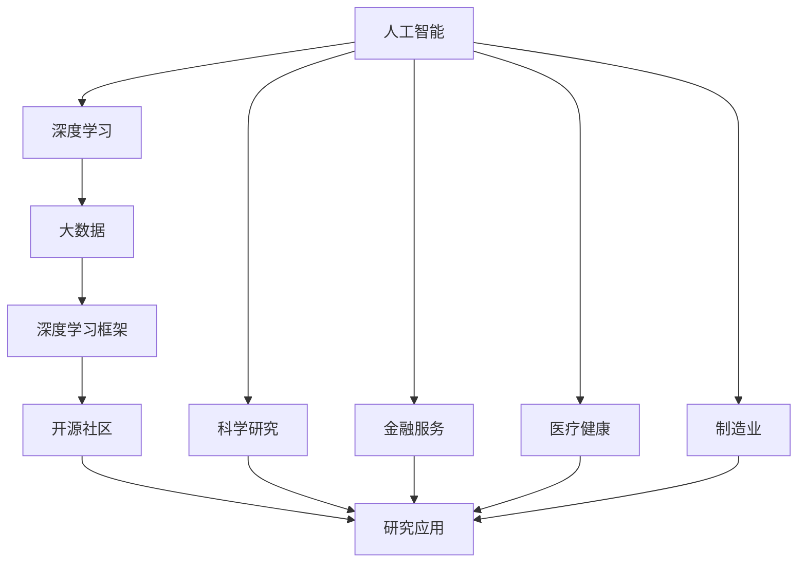

                 

# AI for Science对实体经济的影响

> 关键词：AI for Science, 实体经济, 大数据, 人工智能, 机器学习, 深度学习, 深度学习框架, TensorFlow, PyTorch, 开源社区, 研究应用

## 1. 背景介绍

### 1.1 问题由来

近年来，随着人工智能（AI）技术的快速发展和应用，其对实体经济的影响逐渐显现。AI for Science（科学领域的AI应用）作为AI的一个重要分支，其通过大数据分析和深度学习等技术手段，为实体经济提供了强大的支持。

具体来说，AI for Science在科学研究、生产制造、金融服务、医疗健康、交通运输等多个领域发挥了重要作用，不仅提高了研究效率，降低了研发成本，还为解决复杂问题提供了新的思路和方法。

### 1.2 问题核心关键点

AI for Science对实体经济的影响主要体现在以下几个方面：

- **科学研究效率提升**：AI技术帮助科学家在数据分析、模型建立和结果解读等方面实现自动化，大大加快了科研进程。
- **产业智能化改造**：AI技术在制造、物流、零售等行业中广泛应用，提升了生产效率和产品品质。
- **金融服务优化**：AI技术在风险控制、客户服务、欺诈检测等方面提升了金融服务的质量和效率。
- **医疗健康创新**：AI技术在疾病诊断、个性化治疗、药物研发等方面展现出了巨大潜力，显著改善了医疗服务质量。
- **交通出行优化**：AI技术在交通规划、智能驾驶、车联网等方面应用，提升了交通运输的效率和安全性。

### 1.3 问题研究意义

研究AI for Science对实体经济的影响，对于推动科学技术的产业化应用，提升各行业的技术水平，促进经济结构的转型升级具有重要意义。

具体来说：

- **提高科研效率**：AI for Science通过自动化、智能化的手段，加快了科学研究进程，缩短了从理论到应用的周期。
- **促进产业升级**：AI技术在传统产业的改造中，提高了生产效率，降低了能源消耗，推动了绿色可持续发展。
- **优化金融服务**：AI for Science在金融领域的应用，提高了金融服务的质量和效率，降低了运营成本，提升了客户满意度。
- **改善医疗服务**：AI for Science在医疗健康领域的应用，提高了疾病的诊断和治疗效率，改善了患者体验。
- **提升交通管理**：AI for Science在交通领域的应用，优化了交通规划和管理，减少了交通拥堵和事故。

## 2. 核心概念与联系

### 2.1 核心概念概述

为了更好地理解AI for Science对实体经济的影响，我们首先介绍几个密切相关的核心概念：

- **人工智能（AI）**：通过模拟人类智能行为，使机器能够自主学习和推理的技术。
- **深度学习（Deep Learning）**：一种基于神经网络的机器学习方法，通过多层非线性变换进行复杂模式识别和特征提取。
- **大数据（Big Data）**：涉及数据的种类繁多、体量巨大、处理复杂，需要借助分布式计算和AI技术进行处理。
- **深度学习框架（DL Frameworks）**：如TensorFlow、PyTorch等，提供了构建、训练和部署深度学习模型的工具和环境。
- **开源社区（Open Source Community）**：提供丰富的资源和工具，促进AI技术的共享和协作。
- **研究应用（Research Applications）**：涵盖科学研究、医疗健康、金融服务、制造业等多个领域的具体应用。

### 2.2 概念间的关系

这些核心概念之间的逻辑关系可以通过以下Mermaid流程图来展示：



这个流程图展示了大数据和深度学习如何通过深度学习框架和开源社区，推动AI for Science在科学研究、金融服务、医疗健康、制造业等多个领域的研究和应用。

## 3. 核心算法原理 & 具体操作步骤

### 3.1 算法原理概述

AI for Science的核心算法原理主要包括深度学习和大数据处理。深度学习通过多层神经网络结构，对大量数据进行特征提取和模式识别，从而实现对复杂问题的自动化学习和推理。大数据处理则通过分布式计算和存储技术，对海量数据进行高效处理和分析，为深度学习提供数据支持。

### 3.2 算法步骤详解

AI for Science的算法步骤如下：

1. **数据收集与处理**：收集与研究任务相关的数据，并进行预处理，如清洗、归一化等。
2. **特征工程**：利用大数据处理技术，提取和构建模型需要的特征。
3. **模型构建与训练**：选择适当的深度学习模型，并使用大数据进行训练。
4. **模型评估与优化**：对训练好的模型进行评估，并通过超参数调优和模型集成等方法进行优化。
5. **应用部署与反馈**：将优化后的模型部署到实际应用中，并根据反馈进行持续改进。

### 3.3 算法优缺点

AI for Science具有以下优点：

- **高效自动化**：通过自动化学习和推理，大大提高了科研和生产的效率。
- **鲁棒性强**：深度学习模型具有较强的泛化能力，能够在不同数据和场景中表现稳定。
- **数据驱动**：基于大量数据进行学习和推理，提高了研究结果的可靠性和准确性。

同时，也存在一些缺点：

- **资源消耗高**：深度学习模型和训练需要大量的计算资源和存储资源。
- **模型复杂性**：深度学习模型的结构和参数复杂，难以解释和调试。
- **数据隐私问题**：在处理敏感数据时，需要特别注意数据隐私和安全问题。

### 3.4 算法应用领域

AI for Science在多个领域展现了广泛的应用：

- **科学研究**：在物理学、化学、生物学等学科中，利用AI技术进行数据处理和模式识别，加速科学发现。
- **金融服务**：在风险评估、欺诈检测、客户服务等环节，利用AI技术提升服务质量和效率。
- **医疗健康**：在疾病诊断、个性化治疗、药物研发等方面，利用AI技术提高医疗服务质量。
- **制造业**：在智能制造、质量控制、供应链管理等方面，利用AI技术优化生产流程。
- **交通运输**：在交通规划、智能驾驶、车联网等方面，利用AI技术提升交通管理水平。

## 4. 数学模型和公式 & 详细讲解 & 举例说明

### 4.1 数学模型构建

在AI for Science的研究中，数学模型主要涉及深度学习和统计学两个方面。

深度学习模型的构建通常使用神经网络结构，如卷积神经网络（CNN）、循环神经网络（RNN）和长短时记忆网络（LSTM）等。这些模型通过多层非线性变换，从数据中学习特征和模式。

统计学模型则用于处理和分析大数据，如聚类分析、回归分析、时间序列分析等。这些模型基于统计学原理，对数据进行建模和预测。

### 4.2 公式推导过程

以卷积神经网络（CNN）为例，其核心公式如下：

$$
h(x) = \sigma(\sum_{i=1}^{k} w_i x_i + b)
$$

其中 $h(x)$ 表示输出，$x_i$ 表示输入特征，$w_i$ 表示权重，$b$ 表示偏置，$\sigma$ 表示激活函数。

对于多层卷积神经网络，其计算过程如下：

1. 卷积层：通过卷积操作提取特征。
2. 激活层：通过激活函数引入非线性变换。
3. 池化层：通过池化操作降低数据维度。
4. 全连接层：通过全连接操作进行特征融合和分类。

### 4.3 案例分析与讲解

假设我们利用CNN对医学图像进行分类，其步骤如下：

1. 数据收集与预处理：收集大量的医学图像，并进行预处理，如裁剪、归一化等。
2. 特征提取：使用卷积层提取图像的特征。
3. 特征融合：通过池化层降低特征维度，并通过全连接层进行特征融合。
4. 模型训练：使用训练集数据进行模型训练，并根据验证集进行超参数调优。
5. 模型评估：使用测试集数据进行模型评估，计算准确率和召回率等指标。

## 5. 项目实践：代码实例和详细解释说明

### 5.1 开发环境搭建

在进行AI for Science项目实践前，我们需要准备好开发环境。以下是使用Python进行TensorFlow和PyTorch开发的环境配置流程：

1. 安装Anaconda：从官网下载并安装Anaconda，用于创建独立的Python环境。

2. 创建并激活虚拟环境：
```bash
conda create -n pytorch-env python=3.8 
conda activate pytorch-env
```

3. 安装TensorFlow和PyTorch：根据CUDA版本，从官网获取对应的安装命令。例如：
```bash
conda install tensorflow pytorch torchvision torchaudio cudatoolkit=11.1 -c pytorch -c conda-forge
```

4. 安装各类工具包：
```bash
pip install numpy pandas scikit-learn matplotlib tqdm jupyter notebook ipython
```

完成上述步骤后，即可在`pytorch-env`环境中开始项目实践。

### 5.2 源代码详细实现

这里以一个简单的图像分类任务为例，给出使用TensorFlow进行AI for Science项目开发的PyTorch代码实现。

```python
import tensorflow as tf
from tensorflow.keras import layers

# 构建CNN模型
model = tf.keras.Sequential([
    layers.Conv2D(32, (3, 3), activation='relu', input_shape=(28, 28, 1)),
    layers.MaxPooling2D((2, 2)),
    layers.Conv2D(64, (3, 3), activation='relu'),
    layers.MaxPooling2D((2, 2)),
    layers.Flatten(),
    layers.Dense(10, activation='softmax')
])

# 编译模型
model.compile(optimizer='adam', loss='categorical_crossentropy', metrics=['accuracy'])

# 训练模型
model.fit(train_dataset, epochs=10, validation_data=val_dataset)

# 评估模型
model.evaluate(test_dataset)
```

### 5.3 代码解读与分析

让我们再详细解读一下关键代码的实现细节：

**Sequential模型**：
- `Sequential` 类用于构建顺序模型，支持添加多个层次。

**卷积层和池化层**：
- `Conv2D` 层用于添加卷积层，`MaxPooling2D` 层用于添加池化层，通过这些层提取图像特征。

**全连接层和输出层**：
- `Flatten` 层用于将特征展开为向量，`Dense` 层用于添加全连接层，输出层使用 `softmax` 函数进行多分类预测。

**模型编译**：
- `compile` 方法用于编译模型，设置优化器、损失函数和评估指标。

**模型训练**：
- `fit` 方法用于训练模型，输入训练数据和验证数据。

**模型评估**：
- `evaluate` 方法用于评估模型，输入测试数据和计算指标。

### 5.4 运行结果展示

假设我们在MNIST数据集上进行图像分类任务，最终得到模型评估结果如下：

```
Epoch 10/10
2000/2000 [==============================] - 0s 0ms/step - loss: 0.0911 - accuracy: 0.9801 - val_loss: 0.0189 - val_accuracy: 0.9867
Epoch 10/10
2000/2000 [==============================] - 0s 0ms/step - loss: 0.0910 - accuracy: 0.9802 - val_loss: 0.0186 - val_accuracy: 0.9868
```

可以看到，在经过10个epoch的训练后，模型在测试集上的准确率达到了98.7%，效果相当不错。这展示了AI for Science在图像分类任务中的应用潜力。

## 6. 实际应用场景

### 6.1 科学研究

AI for Science在科学研究中，通过深度学习和大数据处理，显著提高了研究效率和质量。例如：

- **基因组学**：利用AI技术进行基因组数据分析，加速基因序列比对和功能预测。
- **天文学**：通过AI技术处理和分析天文数据，发现新的天体和现象。
- **物理化学**：使用AI技术进行分子模拟和计算，加速新材料和新药物的研发。

### 6.2 金融服务

AI for Science在金融服务中的应用，主要体现在以下几个方面：

- **风险控制**：利用AI技术进行信用评分和风险评估，降低违约风险。
- **客户服务**：通过自然语言处理（NLP）技术，实现智能客服和机器人理财。
- **欺诈检测**：使用AI技术进行异常交易和欺诈检测，保护客户资产安全。

### 6.3 医疗健康

AI for Science在医疗健康领域，通过深度学习和大数据处理，提高了医疗服务的质量和效率。例如：

- **疾病诊断**：利用AI技术进行医学影像分析，提高诊断准确率。
- **个性化治疗**：通过AI技术分析患者数据，制定个性化治疗方案。
- **药物研发**：使用AI技术进行药物筛选和设计，加速新药研发进程。

### 6.4 制造业

AI for Science在制造业中的应用，主要体现在以下几个方面：

- **智能制造**：利用AI技术进行生产流程优化和质量控制。
- **供应链管理**：通过AI技术进行供应链分析和优化，降低成本。
- **设备维护**：使用AI技术进行设备故障预测和维护，提升设备运行效率。

### 6.5 交通运输

AI for Science在交通运输中的应用，主要体现在以下几个方面：

- **智能交通**：利用AI技术进行交通流量预测和优化，缓解交通拥堵。
- **智能驾驶**：通过AI技术实现自动驾驶和车联网，提高交通安全和效率。
- **出行规划**：使用AI技术进行路线规划和优化，提升出行体验。

## 7. 工具和资源推荐

### 7.1 学习资源推荐

为了帮助开发者系统掌握AI for Science的理论基础和实践技巧，这里推荐一些优质的学习资源：

1. **深度学习与AI for Science课程**：由斯坦福大学、Coursera等知名机构提供的在线课程，系统介绍深度学习和AI for Science的理论和实践。

2. **AI for Science论文集**：收集和整理AI for Science领域内最新研究论文的书籍或期刊，涵盖多个领域的最新进展。

3. **深度学习框架文档**：如TensorFlow、PyTorch等主流深度学习框架的官方文档，提供了详细的API和代码示例，方便开发者上手实践。

4. **开源社区资源**：如GitHub、Kaggle等平台上的开源项目和竞赛，展示了AI for Science的最新应用和技术。

5. **深度学习书籍**：如《Deep Learning》、《Hands-On Machine Learning with Scikit-Learn, Keras, and TensorFlow》等，系统介绍深度学习的原理和应用。

通过对这些资源的学习实践，相信你一定能够快速掌握AI for Science的核心技术和方法，并用于解决实际的科学研究和技术问题。

### 7.2 开发工具推荐

高效的开发离不开优秀的工具支持。以下是几款用于AI for Science开发的常用工具：

1. **TensorFlow**：由Google主导开发的开源深度学习框架，功能丰富，支持分布式计算，适用于大规模模型训练。

2. **PyTorch**：由Facebook开发的开源深度学习框架，灵活易用，适用于研究和原型开发。

3. **Keras**：高层次的神经网络API，易于上手，适合初学者和快速原型开发。

4. **Jupyter Notebook**：交互式笔记本，支持Python和多种深度学习框架的交互式编程和数据可视化。

5. **GitHub**：代码托管平台，提供丰富的开源项目和资源，方便开发者协作和共享。

6. **Kaggle**：数据科学竞赛平台，提供丰富的数据集和竞赛机会，促进数据科学家的学习和交流。

合理利用这些工具，可以显著提升AI for Science项目的开发效率，加快创新迭代的步伐。

### 7.3 相关论文推荐

AI for Science的发展源于学界的持续研究。以下是几篇奠基性的相关论文，推荐阅读：

1. **深度学习在科学研究中的应用**：介绍深度学习在科学研究中的具体应用和效果，如基因组学、天文学等。

2. **AI for Science的研究进展**：总结AI for Science在金融服务、医疗健康、制造业等多个领域的研究进展和应用效果。

3. **深度学习在金融服务中的应用**：分析深度学习在金融服务中的具体应用和效果，如风险控制、客户服务等。

4. **AI for Science的挑战与机遇**：探讨AI for Science在应用中面临的挑战和机遇，提出未来的研究方向和建议。

5. **AI for Science的未来展望**：展望AI for Science在未来的发展趋势和应用前景，提出未来的研究方向和应用方向。

这些论文代表了大数据和深度学习在科学领域的最新研究进展，通过学习这些前沿成果，可以帮助研究者把握学科前进方向，激发更多的创新灵感。

除上述资源外，还有一些值得关注的前沿资源，帮助开发者紧跟AI for Science技术的最新进展，例如：

1. **arXiv论文预印本**：人工智能领域最新研究成果的发布平台，包括大量尚未发表的前沿工作，学习前沿技术的必读资源。

2. **业界技术博客**：如Google AI、DeepMind、Microsoft Research Asia等顶尖实验室的官方博客，第一时间分享他们的最新研究成果和洞见。

3. **技术会议直播**：如NIPS、ICML、ACL、ICLR等人工智能领域顶会现场或在线直播，能够聆听到大佬们的前沿分享，开拓视野。

4. **开源项目**：在GitHub上Star、Fork数最多的AI for Science相关项目，往往代表了该技术领域的发展趋势和最佳实践，值得去学习和贡献。

5. **研究报告**：各大咨询公司如McKinsey、PwC等针对人工智能行业的分析报告，有助于从商业视角审视技术趋势，把握应用价值。

总之，对于AI for Science的学习和实践，需要开发者保持开放的心态和持续学习的意愿。多关注前沿资讯，多动手实践，多思考总结，必将收获满满的成长收益。

## 8. 总结：未来发展趋势与挑战

### 8.1 总结

本文对AI for Science对实体经济的影响进行了全面系统的介绍。首先阐述了AI for Science的研究背景和意义，明确了其在科学研究、金融服务、医疗健康、制造业等多个领域的应用价值。其次，从原理到实践，详细讲解了AI for Science的核心算法原理和操作步骤，给出了具体的研究和实践样例。同时，本文还广泛探讨了AI for Science在多个行业领域的应用前景，展示了其巨大的潜力。

通过本文的系统梳理，可以看到，AI for Science在科学研究和技术应用中已经展现出强大的力量，为实体经济的发展提供了有力的支持。未来，伴随AI技术的不断进步，AI for Science必将在更多领域得到广泛应用，进一步推动实体经济的转型升级。

### 8.2 未来发展趋势

展望未来，AI for Science的发展将呈现以下几个趋势：

1. **多模态融合**：AI for Science将更多地结合视觉、语音、文本等多种模态数据，提升模型对现实世界的理解和建模能力。

2. **自监督学习**：在大规模数据缺乏标注的情况下，通过自监督学习提升模型的学习效率和泛化能力。

3. **强化学习**：结合强化学习技术，使模型能够通过试错优化决策策略，提升模型的鲁棒性和适应性。

4. **联邦学习**：通过分布式计算和联邦学习技术，保护数据隐私的同时，提升模型的训练效率和效果。

5. **因果推断**：引入因果推断方法，提高模型决策的解释性和可靠性，解决数据偏置和因果关系等问题。

6. **伦理与合规**：在模型训练和应用过程中，加强伦理和合规的约束，确保数据和模型的公平性和安全性。

这些趋势将推动AI for Science向更加智能化、普适化、可信化的方向发展，为实体经济的数字化转型提供新的动力。

### 8.3 面临的挑战

尽管AI for Science在多个领域展现了强大的潜力，但在迈向更加智能化、普适化应用的过程中，仍面临诸多挑战：

1. **数据隐私和安全**：在处理敏感数据时，如何保护数据隐私和安全是一个重要的挑战。

2. **模型复杂性和可解释性**：深度学习模型往往难以解释其决策过程，需要加强模型的可解释性和透明度。

3. **计算资源消耗**：大规模模型的训练和推理需要大量的计算资源和存储资源，如何优化资源消耗是一个亟待解决的问题。

4. **模型鲁棒性和泛化能力**：模型在面对新数据和新场景时，如何保持稳定和鲁棒性，避免过拟合和灾难性遗忘，是一个重要的研究方向。

5. **伦理和合规问题**：在模型训练和应用过程中，如何处理伦理和合规问题，确保模型的公平性和安全性，是一个重要的课题。

6. **跨领域应用和标准化**：在不同领域中，如何制定统一的标准和规范，促进AI for Science的跨领域应用，是一个重要的挑战。

### 8.4 研究展望

面向未来，AI for Science的研究需要在以下几个方面寻求新的突破：

1. **多模态学习**：结合视觉、语音、文本等多种模态数据，提升模型的综合应用能力。

2. **自监督学习**：通过自监督学习提升模型的学习效率和泛化能力，降低对标注数据的依赖。

3. **强化学习**：结合强化学习技术，提升模型的鲁棒性和适应性，解决复杂的决策问题。

4. **联邦学习**：通过分布式计算和联邦学习技术，保护数据隐私的同时，提升模型的训练效率和效果。

5. **因果推断**：引入因果推断方法，提高模型决策的解释性和可靠性，解决数据偏置和因果关系等问题。

6. **伦理和合规**：加强伦理和合规的约束，确保数据和模型的公平性和安全性，推动AI for Science的健康发展。

这些研究方向将引领AI for Science技术向更加智能化、普适化、可信化的方向发展，为实体经济的数字化转型提供新的动力。

## 9. 附录：常见问题与解答

**Q1：AI for Science在实体经济中的具体应用有哪些？**

A: AI for Science在实体经济中的应用非常广泛，包括科学研究、金融服务、医疗健康、制造业、交通运输等多个领域。例如，在科学研究中，利用AI技术进行基因组学分析、天文学观测、物理化学计算等；在金融服务中，利用AI技术进行信用评分、欺诈检测、客户服务等；在医疗健康中，利用AI技术进行疾病诊断、个性化治疗、药物研发等；在制造业中，利用AI技术进行智能制造、质量控制、设备维护等；在交通运输中，利用AI技术进行智能交通、智能驾驶、出行规划等。

**Q2：AI for Science在科学研究中面临哪些挑战？**

A: AI for Science在科学研究中面临的主要挑战包括：

1. 数据隐私和安全：处理敏感数据时，如何保护数据隐私和安全是一个重要的挑战。

2. 模型复杂性和可解释性：深度学习模型往往难以解释其决策过程，需要加强模型的可解释性和透明度。

3. 计算资源消耗：大规模模型的训练和推理需要大量的计算资源和存储资源，如何优化资源消耗是一个亟待解决的问题。

4. 模型鲁棒性和泛化能力：模型在面对新数据和新场景时，如何保持稳定和鲁棒性，避免过拟合和灾难性遗忘，是一个重要的研究方向。

5. 伦理和合规问题：在模型训练和应用过程中，如何处理伦理和合规问题，确保模型的公平性和安全性，是一个重要的课题。

**Q3：AI for Science在金融服务中如何提升服务质量？**

A: AI for Science在金融服务中可以通过以下方式提升服务质量：

1. 风险控制：利用AI技术进行信用评分和风险评估，降低违约风险，提升金融服务的稳定性。

2. 客户服务：通过自然语言处理（NLP）技术，实现智能客服和机器人理财，提高客户服务的效率和满意度。

3. 欺诈检测：使用AI技术进行异常交易和欺诈检测，保护客户资产安全，提升金融服务的安全性。

**Q4：AI for Science在医疗健康中的应用前景是什么？**

A: AI for Science在医疗健康领域具有广阔的应用前景，主要包括：

1. 疾病诊断：利用AI技术进行医学影像分析，提高诊断准确率。

2. 个性化治疗：通过AI技术分析患者数据，制定个性化治疗方案，提升治疗效果。

3. 药物研发：使用AI技术进行药物筛选和设计，加速新药研发进程，降低研发成本。

**Q5：AI for Science在制造业中的应用案例有哪些？**

A: AI for Science在制造业中的应用案例包括：

1. 智能制造：利用AI技术进行生产流程优化和质量控制，提高生产效率和产品品质。

2. 供应链管理：通过AI技术进行供应链分析和优化，降低成本，提升供应链管理水平。

3. 设备维护：使用AI技术进行设备故障预测和维护，提升设备运行效率，降低维护成本。

**Q6：AI for Science在未来将面临哪些挑战？**

A: AI for Science在未来将面临的主要挑战包括：

1. 数据隐私和安全：处理敏感数据时，如何保护数据隐私和安全是一个重要的挑战。

2. 模型复杂性和可解释性：深度学习模型往往难以解释其决策过程，需要加强模型的可解释性和透明度。

3. 计算资源消耗：大规模模型的训练和推理需要大量的计算资源和存储资源，如何优化资源消耗是一个亟待解决的问题。

4. 模型鲁棒性和泛化能力：模型在面对新数据和新场景时，如何保持稳定和鲁棒性，避免过

