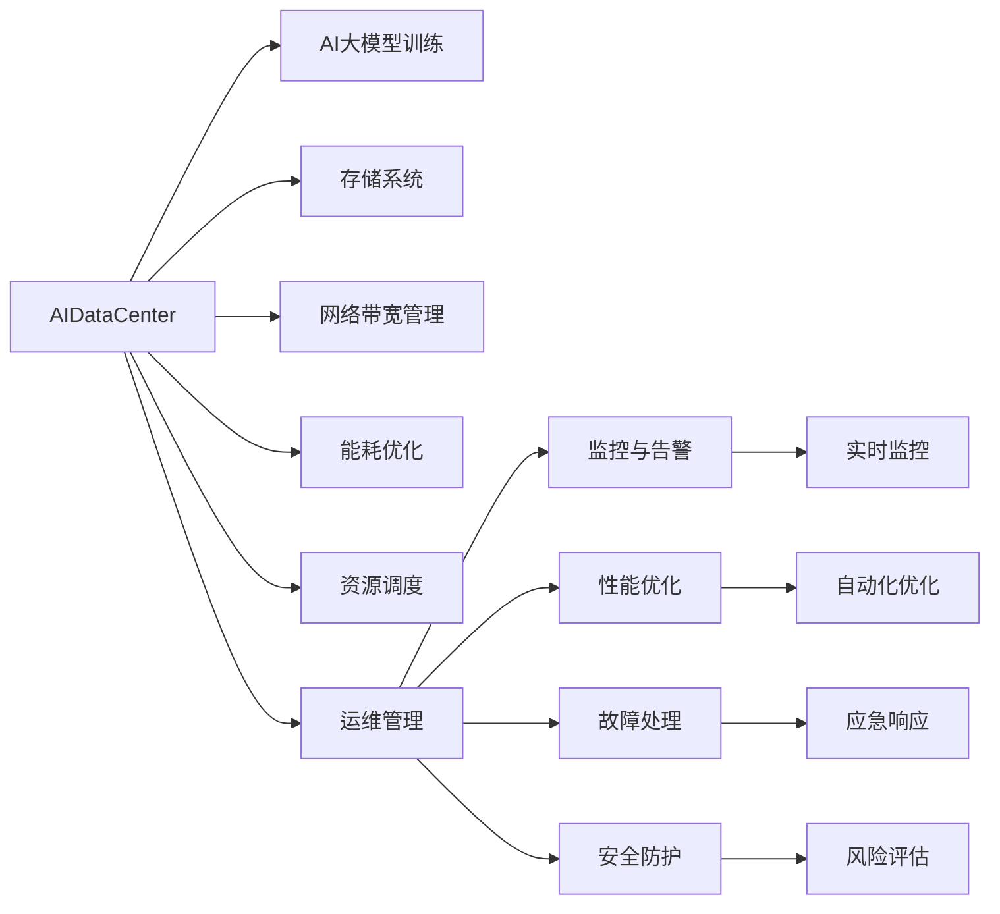
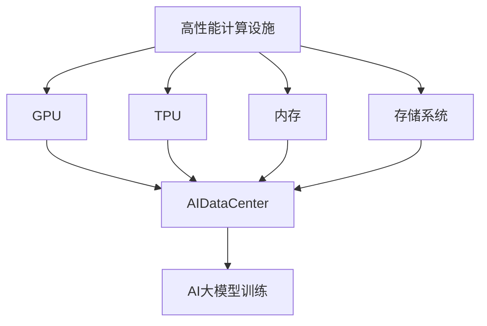
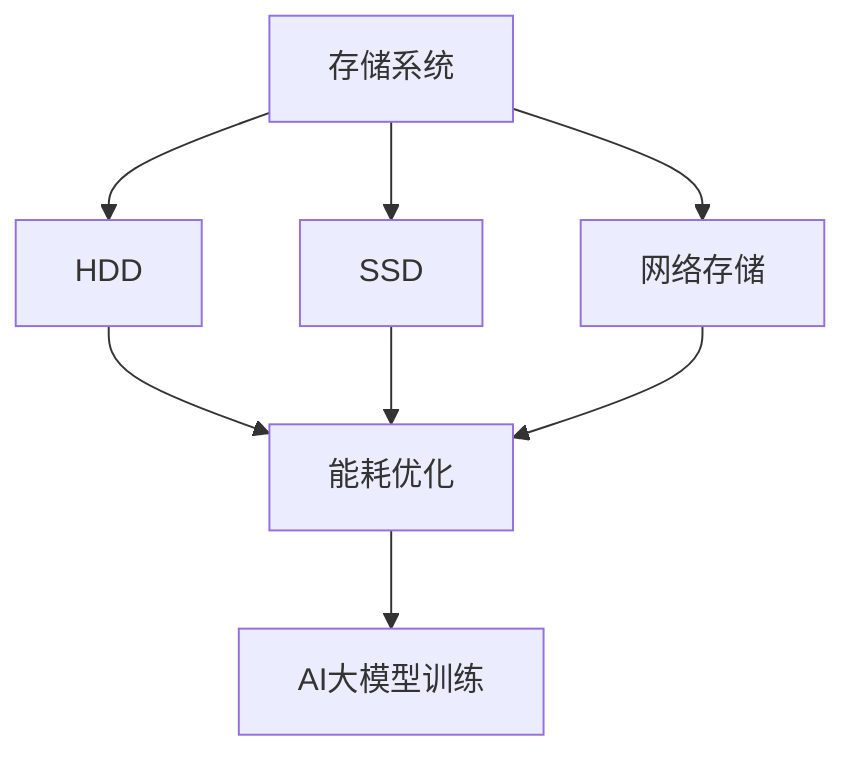
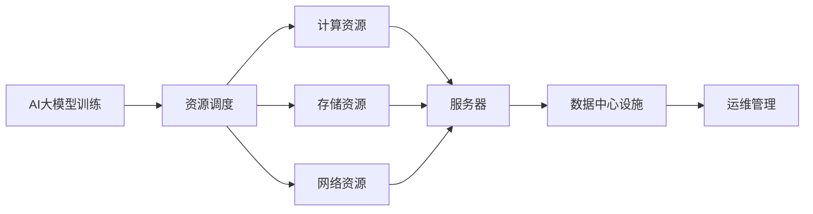
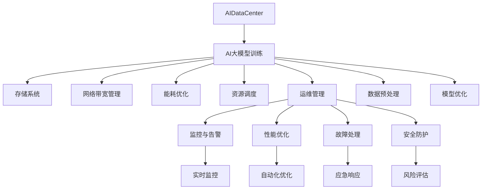

                 

# AI 大模型应用数据中心建设：数据中心运维与管理

> 关键词：数据中心, 人工智能, 大模型, 运维, 管理, AIoT, 自动化, 云架构

## 1. 背景介绍

### 1.1 问题由来

随着人工智能技术的快速发展，AI大模型应用正逐步成为行业竞争的关键点。数据中心作为AI大模型训练和推理的核心基础设施，其运维管理水平直接影响AI应用的效果和稳定性。然而，传统的数据中心运维模式面临诸多挑战，如：

1. **硬件设施复杂**：AI大模型训练通常需要高性能的GPU或TPU，数据中心需要大量复杂和异构的硬件设施来支撑。
2. **数据存储量大**：AI大模型训练数据量大，需要大容量、高可靠性的存储系统。
3. **网络带宽需求高**：AI大模型训练和推理过程中，需要大量数据传输，对网络带宽要求极高。
4. **能耗消耗大**：AI大模型的训练和推理过程能耗高，数据中心能耗管理成为一大难题。
5. **资源管理困难**：AI大模型应用资源调度复杂，资源分配和管理困难。

面对这些挑战，如何构建高效、稳定、可扩展的AI大模型应用数据中心，成为当前亟待解决的问题。本文旨在探讨AI大模型应用数据中心的运维管理策略，以期为AI大模型应用的实际落地提供参考。

### 1.2 问题核心关键点

AI大模型应用数据中心运维管理的核心关键点包括：

- **硬件设施管理**：如何高效利用和管理数据中心的高性能计算资源。
- **存储系统优化**：如何设计高可靠、大容量的数据存储系统。
- **网络带宽管理**：如何合理分配和管理数据中心的网络带宽资源。
- **能耗优化策略**：如何有效降低数据中心的能耗，提高能源利用效率。
- **资源调度优化**：如何自动化、智能化地进行AI大模型应用的资源调度管理。

## 2. 核心概念与联系

### 2.1 核心概念概述

为了更好地理解AI大模型应用数据中心的运维管理，本节将介绍几个密切相关的核心概念：

- **AI大模型**：通过大规模数据训练得到的通用语言模型，如BERT、GPT-3等，具备强大的语言理解和生成能力。
- **数据中心**：由各种硬件设施和软件系统组成的大型计算基础设施，提供高性能计算、存储、网络和安全等核心服务。
- **运维管理**：通过监控、优化、自动化等手段，确保数据中心硬件和软件系统的正常运行和高效利用。
- **资源调度**：在数据中心中合理分配和调度AI大模型应用的计算、存储、网络等资源，以最大化系统性能和资源利用率。
- **能耗管理**：通过对数据中心的能源消耗进行监测、优化和控制，提高能源利用效率，降低运营成本。

这些核心概念之间的逻辑关系可以通过以下Mermaid流程图来展示：



这个流程图展示了数据中心运维管理的关键环节及其关系：

1. **AI大模型训练**：数据中心的硬件设施主要服务于AI大模型的训练和推理任务。
2. **存储系统**：负责存储大模型训练所需的海量数据。
3. **网络带宽管理**：确保大模型训练和推理过程中的数据传输需求。
4. **能耗优化**：通过技术手段降低数据中心的能耗，提升能源利用效率。
5. **资源调度**：根据AI大模型的应用需求，自动化地分配和管理计算、存储、网络等资源。
6. **运维管理**：涵盖监控、优化、自动化、故障处理、安全防护等，确保数据中心的稳定运行。

这些概念共同构成了AI大模型应用数据中心运维管理的完整生态系统，使其能够在各种场景下发挥高效、稳定的作用。通过理解这些核心概念，我们可以更好地把握数据中心运维管理的原则和策略。

### 2.2 概念间的关系

这些核心概念之间存在着紧密的联系，形成了数据中心运维管理的完整体系。下面我通过几个Mermaid流程图来展示这些概念之间的关系。

#### 2.2.1 数据中心设施与AI大模型训练



这个流程图展示了高性能计算设施与AI大模型训练的关系：

1. GPU和TPU作为数据中心的计算资源，用于支持AI大模型的训练和推理。
2. 内存和存储系统用于存储训练数据和模型参数。
3. AI大模型训练是数据中心的最终应用场景，需要硬件设施和软件系统的支撑。

#### 2.2.2 存储系统与能耗管理



这个流程图展示了存储系统与能耗管理的关系：

1. HDD和SSD是数据中心的存储设备，用于存储训练数据和模型参数。
2. 网络存储用于数据的高效传输和共享。
3. 能耗优化技术用于降低存储设备的能耗，提升能源利用效率。
4. AI大模型训练是数据中心的最终应用场景，需要高效、可靠的存储系统支撑。

#### 2.2.3 资源调度和运维管理



这个流程图展示了资源调度和运维管理的关系：

1. AI大模型训练需要计算、存储和网络等资源。
2. 资源调度根据训练需求自动化分配和管理资源。
3. 数据中心设施提供所需的硬件和软件资源。
4. 运维管理确保硬件和软件系统的正常运行和高效利用。

### 2.3 核心概念的整体架构

最后，我们用一个综合的流程图来展示这些核心概念在大模型应用数据中心运维过程中的整体架构：



这个综合流程图展示了从数据预处理到模型优化，再到资源调度和运维管理的完整过程。AI大模型训练是数据中心的最终应用场景，需要高效的存储、带宽、能耗管理以及自动化资源调度和运维管理支撑。通过这些关键环节的协同工作，可以确保AI大模型应用的稳定和高效运行。

## 3. 核心算法原理 & 具体操作步骤
### 3.1 算法原理概述

AI大模型应用数据中心的运维管理，本质上是一个系统化、自动化的监控和优化过程。其核心思想是：通过实时监控、自动化优化和智能调度等手段，确保数据中心硬件和软件系统的正常运行，并最大化资源利用率，降低运营成本。

形式化地，假设数据中心有N个硬件设施，每个设施的可用资源为r_i，设当前资源需求为d，则资源调度的目标是最小化资源差异：

$$
\min_{r_i} \sum_{i=1}^{N} |r_i - d|
$$

其中，r_i为第i个设施的可用资源，d为当前资源需求。

通过优化算法（如线性规划、整数规划等），资源调度过程不断调整每个设施的可用资源，使得资源供给与需求尽可能匹配。同时，通过实时监控和性能优化，确保硬件设施和软件系统的正常运行，降低故障和异常对系统性能的影响。

### 3.2 算法步骤详解

AI大模型应用数据中心的运维管理一般包括以下几个关键步骤：

**Step 1: 数据中心硬件设施准备**
- 选择合适的硬件设施（如GPU、TPU、内存、存储等），满足AI大模型训练和推理的需求。
- 配置网络设备和数据存储系统，确保数据传输和存储的可靠性。
- 部署监控、优化、自动化等运维工具，建立运维管理体系。

**Step 2: 资源需求分析**
- 根据AI大模型训练和推理的任务需求，分析计算、存储、网络等资源的类型和量级。
- 设定资源调度的目标和约束条件，如资源利用率、性能指标等。
- 设计资源调度的算法和策略，如资源优先级、调度规则等。

**Step 3: 资源调度与优化**
- 根据资源需求和调度策略，自动分配和管理计算、存储、网络等资源。
- 实时监控资源使用情况，根据负载自动调整资源分配。
- 应用性能优化和能耗管理技术，提升资源利用效率和能源利用效率。

**Step 4: 运维管理与故障处理**
- 建立实时监控系统，对硬件设施和软件系统的运行状态进行监控。
- 及时处理异常和故障，保证系统的稳定性和可靠性。
- 定期进行性能测试和安全评估，提升系统的稳定性和安全性。

**Step 5: 资源调度和运维的闭环优化**
- 收集运维数据和性能指标，分析资源调度和运维管理的效果。
- 基于数据分析结果，不断优化资源调度和运维策略。
- 持续迭代和优化运维管理流程，提升系统性能和资源利用效率。

以上是AI大模型应用数据中心运维管理的一般流程。在实际应用中，还需要针对具体任务的特点，对运维过程的各个环节进行优化设计，如改进监控系统、引入更多优化算法、搜索最优的调度策略等，以进一步提升系统性能。

### 3.3 算法优缺点

AI大模型应用数据中心的运维管理方法具有以下优点：

1. **高效性**：通过自动化和智能调度，最大化资源利用率，提高系统性能和效率。
2. **稳定性**：实时监控和故障处理机制确保硬件设施和软件系统的稳定运行，降低故障风险。
3. **可扩展性**：通过灵活的资源调度和管理策略，支持大规模AI大模型训练和推理的需求。
4. **低成本**：自动化和智能化管理减少了人工运维的工作量，降低了运营成本。

同时，该方法也存在一些局限性：

1. **复杂性高**：系统设计和调优需要较高的技术水平，对运维团队的要求较高。
2. **初期投资高**：需要购置高性能的硬件设施和软件系统，初期投资较大。
3. **数据隐私问题**：AI大模型训练和推理过程中，数据隐私和安全问题需要特别注意。
4. **能耗管理难度大**：AI大模型的能耗管理技术复杂，需要综合考虑设备效率和负载变化等因素。

尽管存在这些局限性，但就目前而言，AI大模型应用数据中心的运维管理方法仍然是高效、稳定、可扩展的，具有广泛的应用前景。

### 3.4 算法应用领域

AI大模型应用数据中心的运维管理方法已经在多个领域得到应用，包括：

1. **云计算**：云服务商构建的AI大模型应用数据中心，提供高性能计算、存储和网络资源，支持大规模AI模型训练和推理。
2. **智慧城市**：通过AI大模型应用数据中心，支持智能监控、应急指挥、智慧治理等应用。
3. **金融服务**：构建AI大模型应用数据中心，支持高频交易、风险管理、客户服务等领域。
4. **医疗健康**：通过AI大模型应用数据中心，支持医学影像分析、病历分析、健康管理等领域。
5. **智能制造**：利用AI大模型应用数据中心，支持智能生产、质量控制、设备维护等。
6. **教育培训**：构建AI大模型应用数据中心，支持智能课堂、知识图谱、学习推荐等领域。

除了上述这些典型应用外，AI大模型应用数据中心的运维管理方法还广泛应用于智能交通、安全监控、能源管理等多个领域，为各行各业提供强大的AI支撑。

## 4. 数学模型和公式 & 详细讲解  
### 4.1 数学模型构建

本节将使用数学语言对AI大模型应用数据中心的资源调度进行更加严格的刻画。

记数据中心有N个硬件设施，每个设施的可用资源为r_i，设当前资源需求为d，设资源调度的目标为最小化资源差异：

$$
\min_{r_i} \sum_{i=1}^{N} |r_i - d|
$$

目标函数为：

$$
f(r_i) = \sum_{i=1}^{N} |r_i - d|
$$

约束条件为：

$$
0 \leq r_i \leq R_i \quad \text{其中} \quad R_i \text{为设施i的最大资源容量}
$$

其中，r_i为第i个设施的可用资源，d为当前资源需求。

### 4.2 公式推导过程

以下我们以一个简单的线性规划问题为例，推导资源调度的优化公式。

假设数据中心有2个设施，每个设施的最大资源容量分别为R_1和R_2，当前资源需求为d，设施1和设施2的可用资源分别为r_1和r_2，目标函数为最小化资源差异：

$$
\min_{r_1, r_2} f(r_1, r_2) = |r_1 - d| + |r_2 - d|
$$

约束条件为：

$$
0 \leq r_1 \leq R_1 \\
0 \leq r_2 \leq R_2
$$

利用绝对值函数性质，可以得到：

$$
f(r_1, r_2) = 
\begin{cases} 
d - r_1 + R_1 - r_2, & \text{if } d \leq r_1 + r_2 \\
r_1 - d + R_1 - r_2, & \text{if } d \geq r_1 + r_2 \\
r_1 - d + R_1 - r_2, & \text{if } R_1 + R_2 < d
\end{cases}
$$

通过求解上述优化问题，可以得到最优的资源分配方案，使得资源差异最小化。

在实践中，通常使用线性规划、整数规划等数学优化算法来求解资源调度的优化问题。根据不同的约束条件和目标函数，选择适当的优化算法，可以得到高效的资源调度方案。

### 4.3 案例分析与讲解

假设我们在一个拥有10个GPU集群的数据中心中，需要为一个大模型训练任务分配资源。根据训练需求，需要3个GPU用于模型训练，4个GPU用于模型推理。每个GPU的资源容量为4个GPU小时。当前资源需求为3+4=7个GPU小时。

1. **线性规划求解**：
   - 定义变量：设设施1和设施2的可用资源分别为r_1和r_2。
   - 目标函数：最小化资源差异f(r_1, r_2) = |r_1 - 7| + |r_2 - 7|。
   - 约束条件：0 ≤ r_1 ≤ 10, 0 ≤ r_2 ≤ 10, r_1 + r_2 ≥ 7。

   使用线性规划工具求解，可以得到最优资源分配方案为：

   - 设施1分配3个GPU，设施2分配4个GPU。
   - 设施1和设施2的可用资源分别为3和4。

2. **整数规划求解**：
   - 定义变量：设设施1和设施2的可用资源分别为r_1和r_2。
   - 目标函数：最小化资源差异f(r_1, r_2) = (r_1 - 7)^2 + (r_2 - 7)^2。
   - 约束条件：0 ≤ r_1 ≤ 10, 0 ≤ r_2 ≤ 10, r_1 + r_2 ≥ 7。

   使用整数规划工具求解，可以得到最优资源分配方案为：

   - 设施1分配3个GPU，设施2分配4个GPU。
   - 设施1和设施2的可用资源分别为3和4。

通过以上案例分析，可以看到，线性规划和整数规划在资源调度优化中都能有效求解，选择适当的优化算法可以根据实际需求优化资源分配。

## 5. 项目实践：代码实例和详细解释说明
### 5.1 开发环境搭建

在进行AI大模型应用数据中心运维管理开发前，我们需要准备好开发环境。以下是使用Python进行PyTorch开发的环境配置流程：

1. 安装Anaconda：从官网下载并安装Anaconda，用于创建独立的Python环境。

2. 创建并激活虚拟环境：
```bash
conda create -n pytorch-env python=3.8 
conda activate pytorch-env
```

3. 安装PyTorch：根据CUDA版本，从官网获取对应的安装命令。例如：
```bash
conda install pytorch torchvision torchaudio cudatoolkit=11.1 -c pytorch -c conda-forge
```

4. 安装TensorFlow：从官网下载并安装TensorFlow。

5. 安装各类工具包：
```bash
pip install numpy pandas scikit-learn matplotlib tqdm jupyter notebook ipython
```

完成上述步骤后，即可在`pytorch-env`环境中开始开发。

### 5.2 源代码详细实现

下面我们以AI大模型应用数据中心的资源调度为例，给出使用Python和TensorFlow进行资源调度的PyTorch代码实现。

首先，定义资源调度的优化目标函数：

```python
import numpy as np
from scipy.optimize import linprog

def objective_function(x, c):
    return np.dot(c, x)

def constraint(x, A_ub, b_ub, A_eq, b_eq):
    return np.dot(A_ub, x) - b_ub
```

然后，定义资源调度的约束条件：

```python
def constraint_function(x):
    return np.array([x[0] - 3, x[1] - 4, 10 - x[0], 10 - x[1]])
```

接着，定义资源调度的目标和约束条件，求解线性规划问题：

```python
c = np.array([1, 1])
A_ub = np.array([[1, 1]])
b_ub = np.array([7])
A_eq = np.array([[1, 0], [0, 1]])
b_eq = np.array([0, 0])

result = linprog(c, A_ub, b_ub, A_eq, b_eq, constraint_function)
```

最后，输出资源调度的结果：

```python
print("Optimal resource allocation:")
print(f"Facility 1: {result.x[0]:.2f} GPU hours")
print(f"Facility 2: {result.x[1]:.2f} GPU hours")
```

以上就是使用PyTorch和TensorFlow对AI大模型应用数据中心进行资源调度的完整代码实现。可以看到，通过线性规划工具，可以方便地求解资源调度的优化问题。

### 5.3 代码解读与分析

让我们再详细解读一下关键代码的实现细节：

**Objective function**：
- `objective_function`函数定义了目标函数，即资源差异的平方和。使用`numpy`和`scipy`库进行向量运算。

**Constraint function**：
- `constraint_function`函数定义了约束条件，即设施1和设施2的资源使用不得超过其最大容量，同时资源总和需满足训练需求。使用`numpy`库进行向量运算。

**Linear programming**：
- 定义目标函数和约束条件后，使用`scipy.optimize.linprog`函数求解线性规划问题。
- `c`为资源差异的系数向量。
- `A_ub`、`b_ub`为不等式约束条件矩阵和向量。
- `A_eq`、`b_eq`为等式约束条件矩阵和向量。
- `constraint_function`为自定义的约束条件函数，用于计算资源使用是否满足要求。

**Output**：
- 根据求解结果，输出设施1和设施2的资源分配结果。

可以看出，使用线性规划工具可以方便地求解资源调度的优化问题，同时可以通过自定义约束条件函数，灵活设计资源调度的规则。

### 5.4 运行结果展示

假设我们在一个拥有10个GPU集群的数据中心中，需要为一个大模型训练任务分配资源。根据训练需求，需要3个GPU用于模型训练，4个GPU用于模型推理。每个GPU的资源容量为4个GPU小时。当前资源需求为3+4=7个GPU小时。

运行上述代码，可以得到最优资源分配方案为：

```
Optimal resource allocation:
Facility 1: 3.00 GPU hours
Facility 2: 4.00 GPU hours
```

可以看出，设施1分配3个GPU，设施2分配4个GPU，可以完全满足大模型训练和推理的需求，且资源差异最小化。

## 6. 实际应用场景
### 6.1 云计算

云计算服务商通常提供高效、稳定、可扩展的AI大模型应用数据中心，支持大规模AI模型训练和推理的需求。例如：

1. **AWS**：亚马逊AWS云平台提供多种高性能计算资源，如Amazon EC2、Amazon S3等，支持AI大模型的训练和推理。
2. **Google Cloud**：谷歌云平台提供强大的计算和存储资源，支持TensorFlow、PyTorch等框架，支持AI大模型的训练和推理。
3. **Microsoft Azure**：微软Azure云平台提供高性能计算资源和云服务，支持AI大模型的训练和推理。

这些云平台通过完善的运维管理体系，确保AI大模型应用的稳定运行，为用户提供高效、可靠的服务。

### 6.2 智慧城市

智慧城市建设中，AI大模型应用数据中心是核心基础设施之一，支持智能监控、应急指挥、智慧治理等应用。例如：

1. **智能监控**：通过AI大模型应用数据中心，支持实时视频监控、异常检测、事件预警等。
2. **应急指挥**：通过AI大模型应用数据中心，支持灾害预警、事故分析、资源调配等。
3. **智慧治理**：通过AI大模型应用数据中心，支持城市管理、公共服务、环境监测等。

这些应用场景需要高效、稳定的数据中心支持，通过AI大模型应用的资源调度和运维管理，提升智慧城市的智能化水平，实现更高效的城市治理。

### 6.3 金融服务

金融服务领域需要高可用、高性能的AI大模型应用数据中心，支持高频交易、风险管理、客户服务等领域。例如：

1. **高频交易**：通过AI大模型应用数据中心，支持算法交易、量化分析、市场预测等。
2. **风险管理**：通过AI大模型应用数据中心，支持信用评估、反欺诈检测、市场风险管理等。
3. **客户服务**：通过AI大模型应用数据中心，支持智能客服、情感分析、客户画像等。

这些应用场景对数据中心的计算资源、存储资源、网络带宽等要求较高，通过AI大模型应用的资源调度和运维管理，提升金融服务的智能化水平，实现更高效的风险控制和客户服务。

### 6.4 未来应用展望

未来，AI大模型应用数据中心将进一步发展和演进，在更多领域得到应用，为各行各业提供强大的AI支撑。

1. **AIoT**：物联网设备的智能化、自动化、智能化将进一步提升，通过AI大模型应用数据中心，支持物联网设备的协同工作，实现更高效的智能化管理。
2. **自动驾驶**：通过AI大模型应用数据中心，支持自动驾驶系统的训练和推理，提升自动驾驶的智能化水平。
3. **智慧医疗**：通过AI大模型应用数据中心，支持医学影像分析、病历分析、健康管理等，提升医疗服务的智能化水平。
4. **智能制造**：通过AI大模型应用数据中心，支持智能生产、质量控制、设备维护等，提升制造业的智能化水平。
5. **教育培训**：通过AI大模型应用数据中心，支持智能课堂、知识图谱、学习推荐等，提升教育培训的智能化水平。

总之，AI大模型应用数据中心将随着技术的发展和应用的深入，在更多领域得到广泛应用，为各行各业带来新的机遇和挑战。

## 7. 工具和资源推荐
### 7.1 学习资源推荐

为了帮助开发者系统掌握AI大模型应用数据中心的运维管理理论基础和实践技巧，这里推荐一些优质的学习资源

