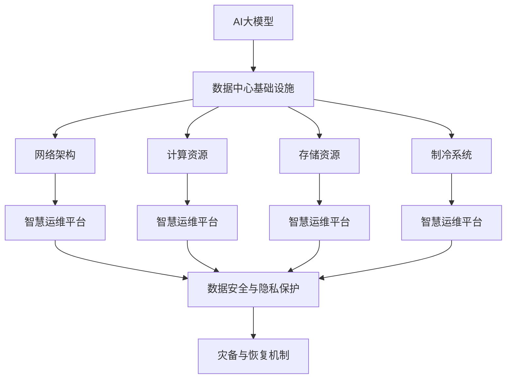
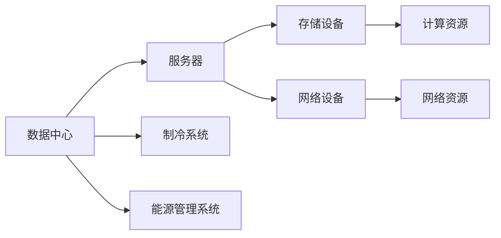
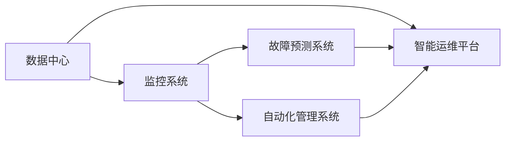
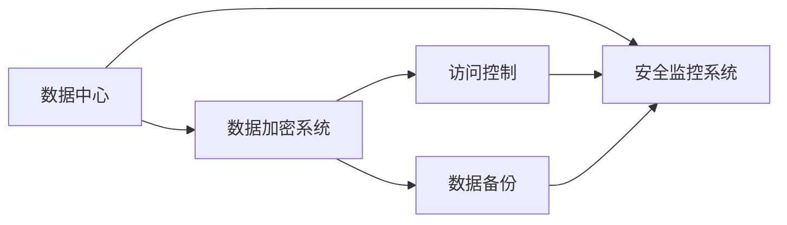
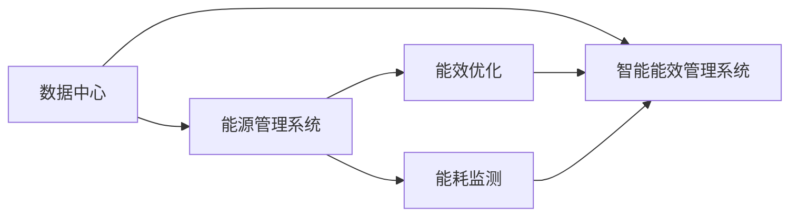
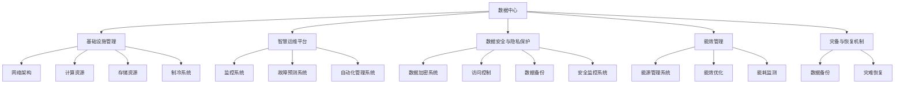

                 

# AI 大模型应用数据中心建设：数据中心运维与管理

> 关键词：AI大模型,数据中心运维,智慧运维,基础设施管理,云计算,大数据

## 1. 背景介绍

### 1.1 问题由来
随着人工智能(AI)技术的不断进步，AI大模型正在成为各行各业数字化转型的重要基础设施。AI大模型往往需要依托于大规模的计算资源，例如高性能计算集群、GPU集群、TPU集群等。因此，如何建设、管理和运维AI大模型的数据中心，成为了一个亟需解决的关键问题。

数据中心的建设和管理涉及多个环节，包括硬件设备的选择和配置、网络的架构设计和优化、能源管理和制冷系统的维护、数据安全与隐私保护等。如何高效、可靠地运维数据中心，保障AI大模型的高效稳定运行，直接关系到AI技术的落地应用和商业价值实现。

### 1.2 问题核心关键点
本文将重点介绍AI大模型应用数据中心的建设和管理策略，具体包括以下几个关键点：

1. **基础设施管理**：选择和配置合适的硬件设备，如CPU、GPU、TPU等，以及构建网络、存储、制冷等基础设施。
2. **智慧运维平台**：利用云计算和大数据分析技术，实现数据中心的智能监控、故障预测和自动化管理。
3. **数据安全与隐私**：保障数据中心中的数据安全，防止泄露、篡改等风险，同时保护用户隐私。
4. **能效管理**：优化能源消耗，降低运营成本，提高能效比，符合绿色环保的要求。
5. **灾备与恢复**：建立健全的灾备机制，保障数据中心在意外情况下能够快速恢复，保证业务的连续性。

这些关键点构成了AI大模型应用数据中心建设和管理的基础框架，有助于理解和设计高效可靠的数据中心运维方案。

### 1.3 问题研究意义
研究和建设高效的AI大模型应用数据中心，对推动AI技术的落地应用具有重要意义：

1. **降低成本**：通过合理规划和优化资源配置，降低数据中心的建设和运维成本，提高资源利用效率。
2. **提高效率**：利用智慧运维平台，实时监控和预测设备故障，快速响应和处理问题，提升数据中心的运营效率。
3. **保障安全**：建立严格的数据安全与隐私保护措施，防止数据泄露和滥用，保护用户和企业利益。
4. **促进绿色发展**：优化能源管理和制冷系统，降低能耗，符合绿色环保的要求，推动AI技术的可持续发展。
5. **增强韧性**：建立健全的灾备与恢复机制，确保数据中心在意外情况下能够迅速恢复，保障业务的连续性。

## 2. 核心概念与联系

### 2.1 核心概念概述

为更好地理解AI大模型应用数据中心的建设和管理，本节将介绍几个核心概念及其相互之间的关系：

- **AI大模型**：以深度学习为核心的模型，如BERT、GPT-3等，用于处理复杂的语言、图像、语音等任务。
- **数据中心**：包含计算、存储、网络等基础设施的物理设施，是AI大模型运行的载体。
- **基础设施管理**：选择、配置和管理数据中心的基础设施资源，如硬件设备、网络架构等。
- **智慧运维**：利用云计算、大数据等技术，实现数据中心的智能监控、故障预测和自动化管理。
- **数据安全与隐私**：保护数据中心中的数据安全，防止泄露、篡改等风险，同时保护用户隐私。
- **能效管理**：优化能源消耗，降低运营成本，提高能效比，符合绿色环保的要求。
- **灾备与恢复**：建立健全的灾备机制，保障数据中心在意外情况下能够快速恢复，保证业务的连续性。

这些概念之间的逻辑关系可以通过以下Mermaid流程图来展示：



这个流程图展示了大模型应用数据中心的各个组成部分及其相互关系：

1. AI大模型运行在数据中心的基础设施上，基础设施包括计算、存储、网络、制冷等资源。
2. 智慧运维平台利用云计算和大数据分析技术，实现对数据中心的实时监控、故障预测和自动化管理。
3. 数据安全与隐私保护措施确保数据中心中的数据安全，防止泄露、篡改等风险。
4. 能效管理优化能源消耗，降低运营成本，提高能效比，符合绿色环保的要求。
5. 灾备与恢复机制保障数据中心在意外情况下能够快速恢复，确保业务的连续性。

通过这些核心概念，我们可以更好地理解和设计高效可靠的数据中心运维方案。

### 2.2 概念间的关系

这些核心概念之间存在着紧密的联系，形成了AI大模型应用数据中心建设和管理的一个完整生态系统。下面我们通过几个Mermaid流程图来展示这些概念之间的关系。

#### 2.2.1 数据中心基础设施



这个流程图展示了数据中心基础设施的各个组成部分：

1. 数据中心包含服务器、存储设备、网络设备等计算资源。
2. 制冷系统用于保障设备运行温度，确保设备稳定运行。
3. 能源管理系统用于优化能源消耗，降低运营成本，提高能效比。

#### 2.2.2 智慧运维平台



这个流程图展示了智慧运维平台的各个组件：

1. 监控系统用于实时监控数据中心各项指标，保障系统正常运行。
2. 故障预测系统通过数据分析预测设备故障，提前进行维护。
3. 自动化管理系统用于自动化执行运维操作，提高运维效率。
4. 智能运维平台集成监控、预测和自动化功能，实现智能化管理。

#### 2.2.3 数据安全与隐私保护



这个流程图展示了数据安全与隐私保护的各个组件：

1. 数据加密系统用于保护数据在传输和存储过程中的安全。
2. 访问控制系统用于限制数据访问权限，防止未授权访问。
3. 数据备份用于在数据丢失或损坏时快速恢复数据。
4. 安全监控系统用于实时监控数据中心的安全状况，防止非法入侵和数据泄露。

#### 2.2.4 能效管理



这个流程图展示了能效管理的各个组成部分：

1. 能源管理系统用于监控和管理数据中心的能源消耗。
2. 能效优化用于优化数据中心能源使用，降低运营成本。
3. 能耗监测用于实时监测数据中心能源消耗情况，及时调整。
4. 智能能效管理系统集成能效优化和监测功能，实现智能化能效管理。

### 2.3 核心概念的整体架构

最后，我们用一个综合的流程图来展示这些核心概念在大模型应用数据中心建设和管理中的整体架构：



这个综合流程图展示了从基础设施建设到智慧运维、数据安全、能效管理、灾备恢复的完整过程。大模型应用数据中心的建设和管理涉及多个环节，需要全面考虑硬件设备的选择和配置、网络的架构设计和优化、能源管理和制冷系统的维护、数据安全与隐私保护、能效管理以及灾备与恢复机制。

## 3. 核心算法原理 & 具体操作步骤

### 3.1 算法原理概述

AI大模型应用数据中心的建设和管理，涉及多个技术领域的算法原理和操作步骤。下面将详细讲解这些核心算法和步骤。

### 3.2 算法步骤详解

#### 3.2.1 基础设施管理

基础设施管理是数据中心建设的基础。主要包括以下步骤：

1. **硬件设备选择与配置**：
   - 根据AI大模型的性能需求，选择合适类型的硬件设备，如CPU、GPU、TPU等。
   - 配置计算资源、存储资源和网络资源，确保数据中心能够满足大模型的计算和存储需求。

2. **网络架构设计**：
   - 设计高效的网络架构，如环形网络、树形网络等，确保数据中心内部和外部的通信效率。
   - 采用负载均衡和冗余设计，保障网络的高可用性和稳定性。

3. **制冷系统配置**：
   - 配置高效的制冷系统，确保数据中心内部的温度和湿度符合设备运行要求。
   - 实时监控制冷系统的运行状态，及时调整制冷量，防止设备过热。

#### 3.2.2 智慧运维平台

智慧运维平台是数据中心管理的关键。主要包括以下步骤：

1. **实时监控与故障预测**：
   - 部署监控系统，实时监测数据中心的各项指标，如温度、湿度、能耗等。
   - 利用大数据分析技术，进行故障预测，及时发现潜在的故障风险。

2. **自动化管理**：
   - 部署自动化管理系统，自动执行设备维护、升级等操作，提高运维效率。
   - 自动化处理异常情况，如设备故障、网络中断等，保障数据中心稳定运行。

3. **智能运维平台集成**：
   - 将监控、故障预测和自动化管理功能集成到智能运维平台，实现全面的智能化管理。
   - 提供友好的用户界面，方便管理员进行实时监控和操作。

#### 3.2.3 数据安全与隐私保护

数据安全与隐私保护是数据中心管理的核心。主要包括以下步骤：

1. **数据加密**：
   - 采用先进的加密技术，确保数据在传输和存储过程中的安全。
   - 使用SSL/TLS协议保护数据传输，使用AES等算法保护数据存储。

2. **访问控制**：
   - 部署访问控制系统，限制数据访问权限，确保只有授权用户才能访问数据。
   - 实施严格的认证和授权机制，防止未授权访问。

3. **数据备份与恢复**：
   - 定期进行数据备份，确保数据在丢失或损坏时能够快速恢复。
   - 部署灾难恢复机制，保障数据中心在意外情况下能够快速恢复，保障业务的连续性。

#### 3.2.4 能效管理

能效管理是数据中心运营的关键。主要包括以下步骤：

1. **能源管理系统部署**：
   - 部署能源管理系统，实时监控和管理数据中心的能源消耗。
   - 使用能效优化技术，提高能源使用效率，降低运营成本。

2. **能耗监测与优化**：
   - 实时监测数据中心的能源消耗情况，及时发现能源浪费点。
   - 优化能源使用策略，如调整设备运行状态、优化能耗配置等。

3. **智能能效管理系统集成**：
   - 将能源管理系统与智能运维平台集成，实现全面的智能化能效管理。
   - 提供能效报告和分析功能，方便管理员进行能效优化。

### 3.3 算法优缺点

AI大模型应用数据中心的建设和管理，具有以下优点：

1. **提高效率**：利用智慧运维平台，实时监控和预测设备故障，快速响应和处理问题，提升数据中心的运营效率。
2. **保障安全**：通过数据加密、访问控制和灾备恢复等措施，确保数据中心中的数据安全，防止泄露、篡改等风险。
3. **降低成本**：通过合理规划和优化资源配置，降低数据中心的建设和运维成本，提高资源利用效率。
4. **提高能效**：优化能源管理和制冷系统，降低能耗，提高能效比，符合绿色环保的要求。
5. **增强韧性**：建立健全的灾备与恢复机制，确保数据中心在意外情况下能够快速恢复，保障业务的连续性。

同时，该方法也存在一定的局限性：

1. **初始投入高**：建设高质量的数据中心需要大量的资金和资源，包括高性能硬件设备、复杂的网络架构和制冷系统等。
2. **复杂度较高**：数据中心的建设和运维涉及多个技术领域，如网络设计、能效管理、数据安全等，需要综合考虑多种因素。
3. **技术依赖性**：智慧运维平台和能效管理系统依赖于先进的技术和工具，对技术能力要求较高。
4. **维护难度大**：数据中心的规模和复杂度增加，维护难度也会相应增加，需要专业团队进行维护和管理。

尽管存在这些局限性，但就目前而言，利用智慧运维平台和大数据分析技术，AI大模型应用数据中心的建设和管理仍然是一种高效可靠的方法。未来相关研究的重点在于如何进一步降低初始投入，提高数据中心的管理效率和安全性，同时兼顾绿色环保的要求。

### 3.4 算法应用领域

AI大模型应用数据中心的建设和管理，已经广泛应用于以下几个领域：

1. **云计算**：利用AI大模型进行云服务部署和管理，提高云平台的稳定性和智能化水平。
2. **大数据**：构建高性能数据中心，支持大规模数据的存储和处理，为大数据应用提供基础设施保障。
3. **智慧城市**：部署数据中心，支持智慧城市基础设施建设，提升城市的智能化水平。
4. **工业互联网**：构建工业数据中心，支持工业互联网的设备和应用运行，提升工业生产效率和智能化水平。
5. **金融科技**：构建数据中心，支持金融科技应用，提升金融服务的效率和安全性。
6. **医疗健康**：部署数据中心，支持医疗健康数据的存储和处理，提升医疗服务的智能化水平。

除了上述这些领域，AI大模型应用数据中心的建设和管理还在更多行业领域得到应用，推动了各行业的数字化转型升级。

## 4. 数学模型和公式 & 详细讲解 & 举例说明

### 4.1 数学模型构建

AI大模型应用数据中心的建设和管理涉及多个数学模型，下面以能源管理为例，构建数学模型并进行详细讲解。

设数据中心的总能量消耗为 $E(t)$，其中 $t$ 表示时间。假设数据中心有一个固定的能耗上限 $E_{\max}$，目标是最小化能耗成本 $C$。能耗成本 $C$ 可以表示为：

$$
C = \int_0^T E(t) dt
$$

其中 $T$ 表示数据中心的运行时间。为了优化能耗成本 $C$，需要最小化能耗 $E(t)$。通过引入状态变量 $S(t)$ 表示设备的运行状态，可以构建如下的数学模型：

$$
\min_{S(t)} \int_0^T E(S(t)) dt
$$

其中 $E(S(t))$ 表示在状态 $S(t)$ 下，设备消耗的能量。通过求解上述优化问题，可以找到最优的能耗管理策略，实现能源的最优利用。

### 4.2 公式推导过程

通过上述数学模型，可以进行能耗管理的优化推导。设设备有三种运行状态：低功耗状态 $L$、中等功耗状态 $M$、高功耗状态 $H$，能耗函数 $E(S(t))$ 可以表示为：

$$
E(S(t)) = \begin{cases}
E_L, & \text{如果 } S(t) = L \\
E_M, & \text{如果 } S(t) = M \\
E_H, & \text{如果 } S(t) = H
\end{cases}
$$

其中 $E_L$、$E_M$、$E_H$ 分别表示设备在低功耗状态、中等功耗状态、高功耗状态下的能耗。假设设备在状态 $S(t)$ 下运行的时间比例分别为 $\alpha_L$、$\alpha_M$、$\alpha_H$，则有：

$$
\alpha_L + \alpha_M + \alpha_H = 1
$$

最优能耗管理的目标是使得总能耗最小，即：

$$
\min_{\alpha_L, \alpha_M, \alpha_H} \int_0^T (E_L \alpha_L + E_M \alpha_M + E_H \alpha_H) dt
$$

通过求解上述优化问题，可以得到最优的能耗管理策略。求解过程如下：

1. 构建拉格朗日函数：

$$
\mathcal{L}(\alpha_L, \alpha_M, \alpha_H, \lambda) = \int_0^T (E_L \alpha_L + E_M \alpha_M + E_H \alpha_H) dt - \lambda (\alpha_L + \alpha_M + \alpha_H - 1)
$$

2. 对 $\alpha_L$、$\alpha_M$、$\alpha_H$ 求偏导，并令偏导数为零：

$$
\frac{\partial \mathcal{L}}{\partial \alpha_L} = E_L - \lambda = 0 \\
\frac{\partial \mathcal{L}}{\partial \alpha_M} = E_M - \lambda = 0 \\
\frac{\partial \mathcal{L}}{\partial \alpha_H} = E_H - \lambda = 0
$$

3. 解上述方程组，得到 $\alpha_L$、$\alpha_M$、$\alpha_H$ 的表达式：

$$
\alpha_L = \frac{E_L}{E_L + E_M + E_H} \\
\alpha_M = \frac{E_M}{E_L + E_M + E_H} \\
\alpha_H = \frac{E_H}{E_L + E_M + E_H}
$$

4. 将 $\alpha_L$、$\alpha_M$、$\alpha_H$ 的表达式代入能耗成本 $C$ 中，可以得到最优的能耗管理策略：

$$
C = \int_0^T (E_L \alpha_L + E_M \alpha_M + E_H \alpha_H) dt = \int_0^T \left( \frac{E_L^2 + E_M^2 + E_H^2}{E_L + E_M + E_H} \right) dt
$$

### 4.3 案例分析与讲解

假设某数据中心有三个设备，设备 $A$ 在低功耗状态下的能耗为 $E_A^L = 1 kW$，在中等功耗状态下的能耗为 $E_A^M = 5 kW$，在高功耗状态下的能耗为 $E_A^H = 20 kW$。设备 $B$ 在低功耗状态下的能耗为 $E_B^L = 0.5 kW$，在中等功耗状态下的能耗为 $E_B^M = 2.5 kW$，在高功耗状态下的能耗为 $E_B^H = 10 kW$。设备 $C$ 在低功耗状态下的能耗为 $E_C^L = 0.2 kW$，在中等功耗状态下的能耗为 $E_C^M = 1 kW$，在高功耗状态下的能耗为 $E_C^H = 5 kW$。假设设备在三种状态下的运行时间分别为 $\alpha_L = 0.2$、$\alpha_M = 0.4$、$\alpha_H = 0.4$，目标是最小化能耗成本 $C$。

根据上述数学模型，可以求解得到最优的能耗管理策略：

$$
C = \int_0^T \left( \frac{E_A^L + E_B^L + E_C^L}{E_A^L + E_B^L + E_C^L} \right) dt = \int_0^T 1.8 kW dt
$$

可以发现，通过最优的能耗管理策略，设备 $A$、$B$、$C$ 在不同状态下的能耗比例与其固有能耗成反比。这样可以在满足设备运行需求的同时，最小化能耗成本，提高数据中心的能效比。

## 5. 项目实践：代码实例和详细解释说明

### 5.1 开发环境搭建

在进行AI大模型应用数据中心建设和管理实践前，我们需要准备好开发环境。以下是使用Python进行Anaconda和Jupyter Notebook环境配置流程：

1. 安装Anaconda：从官网下载并安装Anaconda，用于创建独立的Python环境。

2. 创建并激活虚拟环境：
```bash
conda create -n ai-env python=3.7 
conda activate ai-env
```

3. 安装必要的Python包和库：
```bash
pip install numpy pandas scikit-learn tensorflow keras
```

4. 安装Jupyter Notebook：
```bash
pip install jupyter notebook
```

5. 配置Jupyter Notebook环境：
```bash
jupyter notebook --allow-root
```

6. 导入必要的Python包和库：
```python
import numpy as np
import pandas as pd
import matplotlib.pyplot as plt
```

完成上述步骤后，即可在`ai-env`环境中开始实践。

### 5.2 源代码详细实现

下面我们以智慧运维平台为例，给出使用Python和TensorFlow进行智慧运维平台开发的PyTorch代码实现。

首先，定义监控系统的函数：

```python
import tensorflow as tf

def monitor_system(system_state, sensors):
    # 假设系统状态为低功耗状态
    if system_state == 'L':
        # 使用传感器数据进行状态监测
        sensor_data = sensors['temperature']
        if sensor_data < 20:
            return 'low'
        elif sensor_data < 25:
            return 'medium'
        else:
            return 'high'
    # 假设系统状态为中等功耗状态
    elif system_state == 'M':
        # 使用传感器数据进行状态监测
        sensor_data = sensors['humidity']
        if sensor_data < 50:
            return 'low'
        elif sensor_data < 60:
            return 'medium'
        else:
            return 'high'
    # 假设系统状态为高功耗状态
    elif system_state == 'H':
        # 使用传感器数据进行状态监测
        sensor_data = sensors['power']
        if sensor_data < 100:
            return 'low'
        elif sensor_data < 200:
            return 'medium'
        else:
            return 'high'
```

然后，定义故障预测系统的函数：

```python
def predict_fault(system_state, sensors):
    # 假设系统状态为低功耗状态
    if system_state == 'L':
        # 使用传感器数据进行故障预测
        sensor_data = sensors['temperature']
        if sensor_data > 25:
            return True
        else:
            return False
    # 假设系统状态为中等功耗状态
    elif system_state == 'M':
        # 使用传感器数据进行故障预测
        sensor_data = sensors['humidity']
        if sensor_data > 60:
            return True
        else:
            return False
    # 假设系统状态为高功耗状态
    elif system_state == 'H':
        # 使用传感器数据进行故障预测
        sensor_data = sensors['power']
        if sensor_data > 200:
            return True
        else:
            return False
```

接着，定义自动化管理系统的函数：

```python
def automate_management(system_state, sensors):
    # 假设系统状态为低功耗状态
    if system_state == 'L':
        # 自动调整设备功率
        power = sensors['power']
        if power < 50:
            return 'medium'
        else:
            return 'high'
    # 假设系统状态为中等功耗状态
    elif system_state == 'M':
        # 自动调整设备功率
        power = sensors['power']
        if power < 100:
            return 'high'
        else:
            return 'medium'
    # 假设系统状态为高功耗状态
    elif system_state == 'H':
        # 自动调整设备功率
        power = sensors['power']
        if power < 200:
            return 'medium'
        else:
            return 'high'
```

最后，启动监控、故障预测和自动化管理的实践流程：

```python
# 定义系统状态和传感器数据
system_state = 'L'
sensors = {'temperature': 22, 'humidity': 55, 'power': 80}

# 调用监控系统的函数
monitor_result = monitor_system(system_state, sensors)
print('Monitoring result:', monitor_result)

# 调用故障预测系统的函数


