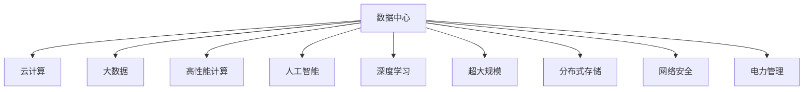
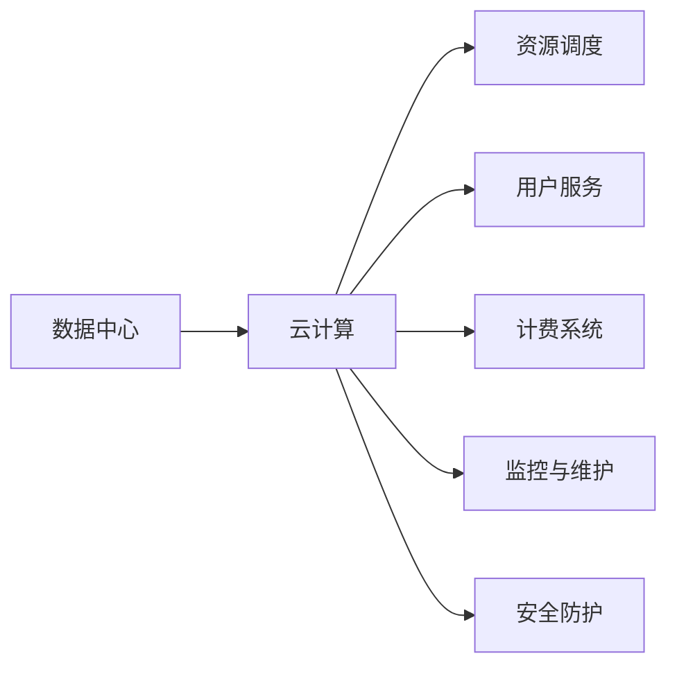
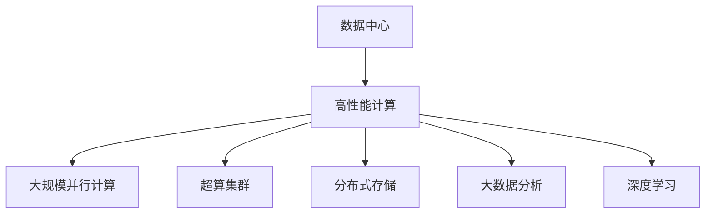
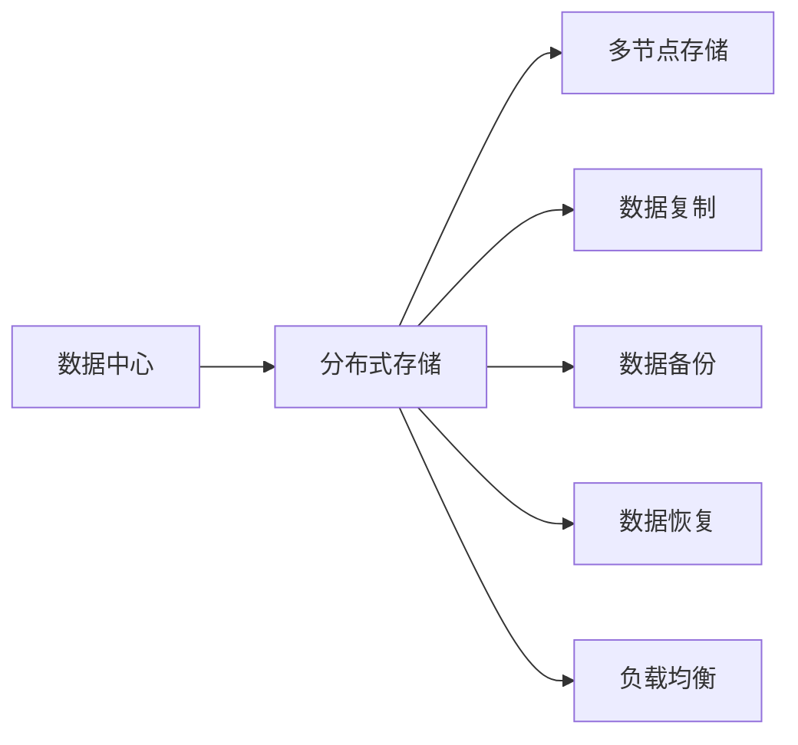
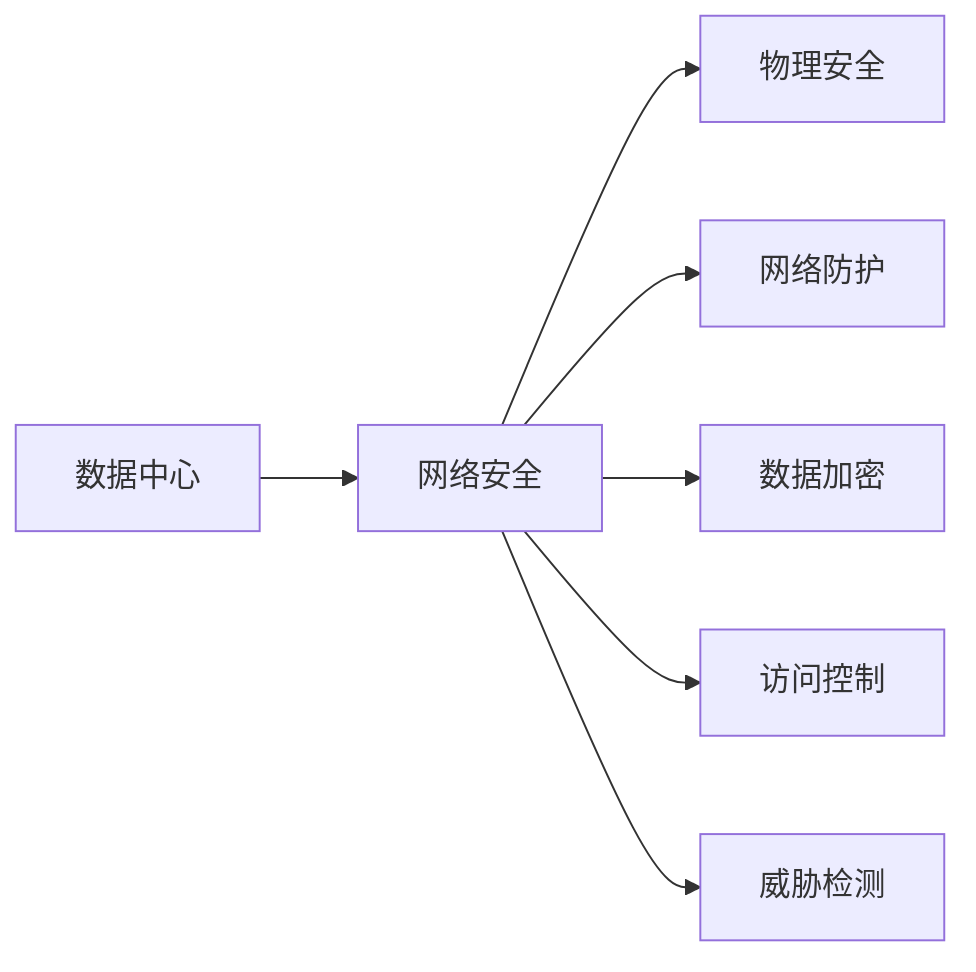
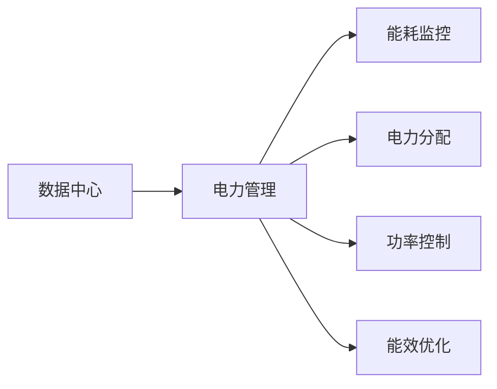

                 

# AI 大模型应用数据中心建设：数据中心运营与管理

> 关键词：AI大模型、数据中心、运营管理、云计算、大数据、高性能计算、人工智能、深度学习、超大规模、基础设施、分布式存储、网络安全、电力管理

## 1. 背景介绍

### 1.1 问题由来

随着人工智能（AI）技术的发展，尤其是深度学习在计算机视觉、自然语言处理、语音识别等领域的广泛应用，对数据中心的运算能力和存储能力提出了更高的要求。特别是在大规模预训练模型（如BERT、GPT-3等）的应用场景中，模型的参数量动辄上亿，需要超大规模的数据中心进行支撑。因此，如何在保证高效计算的同时，降低运营成本、提升数据中心管理水平，成为AI大模型应用中的重要课题。

### 1.2 问题核心关键点

AI大模型应用数据中心的建设，涉及以下几个关键问题：

- **计算资源**：如何高效利用计算资源，满足大规模模型的高吞吐量需求。
- **存储能力**：如何构建分布式存储系统，高效管理大规模数据。
- **网络带宽**：如何优化网络架构，提升数据传输效率。
- **能耗管理**：如何降低数据中心的能耗，同时保证系统的高效运行。
- **安全性**：如何保证数据中心的物理安全和网络安全，防止数据泄露。

### 1.3 问题研究意义

AI大模型应用数据中心的建设，对于推动AI技术的普及和应用具有重要意义：

- **提升计算效率**：通过优化计算资源配置，提升模型训练和推理的效率，缩短项目周期。
- **降低运营成本**：通过提高能效比，降低数据中心的操作维护成本。
- **增强安全性**：通过完善安全措施，保护数据中心的安全，防止数据泄露。
- **提升用户体验**：通过高效的数据管理和分布式存储，提升用户体验，加速AI技术落地。

## 2. 核心概念与联系

### 2.1 核心概念概述

为更好地理解AI大模型应用数据中心建设，本节将介绍几个密切相关的核心概念：

- **数据中心**：通常指由多个服务器、存储设备、网络设备等组成的大型机房，用于提供计算、存储、网络等基础服务。
- **云计算**：通过网络提供可伸缩的计算资源，包括存储、网络和数据库等服务，按需使用、按量付费。
- **大数据**：指体量巨大、类型多样、价值密度低、处理速度快的数据集合，强调数据处理的复杂性和挑战性。
- **高性能计算**：指使用高性能计算机进行大规模、复杂计算的科学计算技术，应用于气象模拟、基因组学等领域。
- **人工智能**：利用计算机和数据技术模拟人类智能，实现学习、推理、决策等能力。
- **深度学习**：一种特殊的机器学习方法，通过多层神经网络进行复杂特征的抽象和分类。
- **超大规模**：指数据中心的规模需要支持数以万计的服务器、存储设备和网络设备，能够处理大规模数据和复杂任务。
- **分布式存储**：指通过多个存储节点实现数据的高可用性和高扩展性，支持海量数据的存储和访问。
- **网络安全**：指数据中心内部和外部的安全防护措施，包括物理安全、网络安全、数据安全等。
- **电力管理**：指数据中心的能耗管理，包括电力供应、分配、监测和优化。

这些核心概念之间的逻辑关系可以通过以下Mermaid流程图来展示：



这个流程图展示了大规模AI模型数据中心的多个核心概念及其之间的关系：

- 数据中心通过云计算提供计算、存储和网络服务，支持大数据和深度学习任务的运行。
- 高性能计算和大规模分布式存储为数据中心提供了处理海量数据和复杂任务的能力。
- 人工智能和大数据技术推动了深度学习模型的发展和应用。
- 超大规模的架构要求数据中心具备高可用性和扩展性。
- 网络安全与电力管理保证了数据中心的稳定和安全运行。

### 2.2 概念间的关系

这些核心概念之间存在着紧密的联系，形成了数据中心建设和运营管理的完整生态系统。下面我们通过几个Mermaid流程图来展示这些概念之间的关系。

#### 2.2.1 数据中心与云计算的关系



这个流程图展示了数据中心和云计算之间的关系。数据中心通过云计算提供资源调度、用户服务、计费系统、监控与维护和安全防护等综合服务。

#### 2.2.2 数据中心与高性能计算的关系



这个流程图展示了数据中心与高性能计算的关系。高性能计算通过大规模并行计算、超算集群、分布式存储和大数据分析，为数据中心提供强大的计算和数据处理能力。

#### 2.2.3 数据中心与分布式存储的关系



这个流程图展示了数据中心与分布式存储的关系。分布式存储通过多节点存储、数据复制、数据备份、数据恢复和负载均衡，实现数据的可靠性和高效访问。

#### 2.2.4 数据中心与网络安全的关系



这个流程图展示了数据中心与网络安全的关系。网络安全通过物理安全、网络防护、数据加密、访问控制和威胁检测，保障数据中心的安全性。

#### 2.2.5 数据中心与电力管理的关系



这个流程图展示了数据中心与电力管理的关系。电力管理通过能耗监控、电力分配、功率控制和能效优化，实现数据中心的能源高效利用。

## 3. 核心算法原理 & 具体操作步骤
### 3.1 算法原理概述

AI大模型应用数据中心的建设，涉及多方面的技术和算法，主要包括：

- **分布式存储算法**：用于设计高效、可靠的分布式存储系统，支持海量数据的存储和访问。
- **计算资源调度算法**：用于优化计算资源的分配和调度，提高数据中心的计算效率。
- **网络带宽优化算法**：用于设计高效、低延迟的网络架构，提升数据传输效率。
- **能耗管理算法**：用于优化电力分配和能效，降低数据中心的能耗，提高能源利用率。
- **数据安全算法**：用于保障数据中心的安全性，防止数据泄露和非法访问。

### 3.2 算法步骤详解

**Step 1: 设计分布式存储系统**

分布式存储系统的设计，需要考虑以下几个关键点：

- **数据分片**：将大规模数据划分为多个块，分布存储在多个节点上。
- **数据冗余**：通过数据复制和数据校验，保证数据的高可用性。
- **数据一致性**：设计一致性协议，确保数据在多个节点上的更新一致。
- **负载均衡**：通过负载均衡算法，均衡数据访问压力。

**Step 2: 优化计算资源调度**

计算资源调度的目标，是最大化利用计算资源，提高数据中心的计算效率。具体步骤如下：

- **资源池划分**：将计算资源划分为多个资源池，每个资源池运行不同类型的工作负载。
- **任务调度算法**：设计任务调度算法，根据任务优先级和资源负载情况，动态分配计算资源。
- **资源优化**：使用资源优化技术，如资源预分配和任务迁移，减少资源浪费。

**Step 3: 提升网络带宽**

网络带宽的优化，需要从以下几个方面入手：

- **网络架构设计**：设计高效、低延迟的网络架构，减少数据传输延迟。
- **数据压缩技术**：使用数据压缩技术，减少数据传输量。
- **高速交换机**：使用高速交换机和光网络，提升数据传输速度。

**Step 4: 降低能耗**

能耗管理的目标，是优化电力分配和能效，降低数据中心的能耗，提高能源利用率。具体步骤如下：

- **能效优化**：通过能效优化算法，减少不必要的数据传输和计算。
- **电源管理**：使用电源管理技术，如动态电压调整和电源分立，降低数据中心的能耗。
- **能源回收**：设计能源回收系统，将废热转换为电能，提高能源利用率。

**Step 5: 数据安全防护**

数据安全防护的目的是保障数据中心的安全性，防止数据泄露和非法访问。具体步骤如下：

- **物理安全**：设计物理安全措施，如门禁系统、监控摄像头等，防止非法访问。
- **网络防护**：使用网络防护技术，如防火墙、入侵检测系统等，防止网络攻击。
- **数据加密**：对数据进行加密处理，防止数据泄露。
- **访问控制**：设计访问控制机制，限制对数据的访问权限。

### 3.3 算法优缺点

分布式存储、计算资源调度、网络带宽优化、能耗管理和数据安全防护等算法，各自有其优点和缺点：

**分布式存储算法的优点**：
- **高可用性**：数据复制和数据校验提高了数据的高可用性，确保数据在多个节点上的冗余。
- **高扩展性**：通过数据分片和负载均衡，支持海量数据的存储和访问。
- **高可靠性**：一致性协议和冗余设计，提高了系统的可靠性。

**分布式存储算法的缺点**：
- **复杂性高**：设计和管理复杂的分布式存储系统，需要较高的技术和经验。
- **管理难度大**：数据一致性和冗余设计增加了系统管理的复杂度。

**计算资源调度算法的优点**：
- **高效利用**：通过任务调度算法和资源优化，最大化利用计算资源，提高计算效率。
- **灵活性高**：资源池划分和任务调度算法，使得资源配置更加灵活，满足不同任务的需求。
- **稳定性强**：资源优化和任务调度算法，提高了系统的稳定性和可靠性。

**计算资源调度算法的缺点**：
- **复杂性高**：设计和管理复杂的计算资源调度系统，需要较高的技术和经验。
- **管理难度大**：任务调度算法和资源优化增加了系统管理的复杂度。

**网络带宽优化算法的优点**：
- **低延迟**：高效的网络架构和高速交换机，提升了数据传输速度，减少了延迟。
- **高效率**：数据压缩技术和数据传输优化，提高了数据传输效率。
- **稳定性强**：设计了高效的网络架构和优化算法，提高了系统的稳定性。

**网络带宽优化算法的缺点**：
- **复杂性高**：设计和管理复杂的网络带宽优化系统，需要较高的技术和经验。
- **管理难度大**：网络架构设计和数据压缩技术增加了系统管理的复杂度。

**能耗管理算法的优点**：
- **高效利用**：能效优化和能源回收，降低了数据中心的能耗，提高了能源利用率。
- **稳定可靠**：电源管理和能源回收技术，提高了系统的稳定性和可靠性。
- **环保性强**：能效优化和能源回收，有助于环境保护和可持续发展。

**能耗管理算法的缺点**：
- **复杂性高**：设计和管理复杂的能耗管理系统，需要较高的技术和经验。
- **管理难度大**：能效优化和能源回收技术增加了系统管理的复杂度。

**数据安全防护算法的优点**：
- **安全性高**：物理安全、网络防护和数据加密，保障了数据中心的安全性。
- **可靠性高**：访问控制和威胁检测，提高了系统的可靠性。
- **适应性强**：适应不同的安全威胁和攻击手段，保护数据中心的安全。

**数据安全防护算法的缺点**：
- **复杂性高**：设计和管理复杂的数据安全防护系统，需要较高的技术和经验。
- **管理难度大**：访问控制和威胁检测增加了系统管理的复杂度。

### 3.4 算法应用领域

分布式存储、计算资源调度、网络带宽优化、能耗管理和数据安全防护等算法，广泛应用于以下领域：

- **高性能计算中心**：在气象模拟、基因组学等领域，需要进行大规模数据的存储和计算，需要高效、可靠的分布式存储和计算资源调度。
- **云计算平台**：在云服务提供商的云计算中心，需要进行高效、低延迟的数据传输，提升云计算平台的用户体验。
- **大数据中心**：在大数据分析、数据仓库等领域，需要进行海量数据的存储和分析，需要高扩展性和高可靠性的分布式存储系统。
- **AI数据中心**：在AI大模型的训练和推理过程中，需要进行大规模数据的存储和计算，需要高效、低延迟的网络架构和能效优化。
- **边缘计算中心**：在物联网、智能城市等领域，需要进行边缘数据的存储和处理，需要高效、可靠的分布式存储和计算资源调度。

## 4. 数学模型和公式 & 详细讲解 & 举例说明

### 4.1 数学模型构建

**Step 1: 定义问题**

假设有一个AI大模型数据中心，包含$n$个计算节点，每个节点的计算能力为$p_i$，总计算能力为$P=\sum_{i=1}^n p_i$。数据中心需要处理$T$个任务，每个任务的处理时间为$t_i$，总处理时间为$T=\sum_{i=1}^n t_i$。数据中心的计算资源和任务调度需要优化，目标是最大化计算资源的利用率，最小化任务处理时间。

**Step 2: 构建优化模型**

定义任务$j$在节点$i$上的运行时间为$s_{ij}=t_i/p_i$，总运行时间为$S=\sum_{i=1}^n \sum_{j=1}^T s_{ij}$。目标是最大化计算资源的利用率，最小化任务处理时间。

**Step 3: 求解优化问题**

使用线性规划模型求解任务调度问题，具体步骤如下：

- 目标函数：
  $$
  \max \sum_{i=1}^n \sum_{j=1}^T \log p_i
  $$

- 约束条件：
  $$
  \sum_{j=1}^T s_{ij} = t_i \quad \forall i
  $$
  $$
  \sum_{i=1}^n p_i s_{ij} = t_j \quad \forall j
  $$
  $$
  s_{ij} \geq 0 \quad \forall i,j
  $$

通过求解上述优化问题，得到最优的任务调度方案，最大化计算资源的利用率，最小化任务处理时间。

### 4.2 公式推导过程

**Step 1: 定义符号**

设节点$i$的计算能力为$p_i$，任务$j$的处理时间为$t_j$。

**Step 2: 构造目标函数**

目标函数为最大化计算资源的利用率，即节点$i$的计算能力被完全利用。目标函数为：
$$
\max \sum_{i=1}^n \log p_i
$$

**Step 3: 构造约束条件**

1. 每个任务在某个节点上运行时间等于其处理时间，即：
   $$
   s_{ij} = \frac{t_j}{p_i} \quad \forall i,j
   $$

2. 每个节点的计算能力被完全利用，即：
   $$
   \sum_{j=1}^T s_{ij} = t_i \quad \forall i
   $$

3. 每个任务在一个节点上运行时间非负，即：
   $$
   s_{ij} \geq 0 \quad \forall i,j
   $$

**Step 4: 求解优化问题**

将上述目标函数和约束条件代入线性规划模型，求解最优的任务调度方案。具体步骤如下：

1. 将目标函数和约束条件转换为标准形式：
   $$
   \max \sum_{i=1}^n \log p_i
   $$
   $$
   \sum_{j=1}^T s_{ij} = t_i \quad \forall i
   $$
   $$
   \sum_{i=1}^n p_i s_{ij} = t_j \quad \forall j
   $$
   $$
   s_{ij} \geq 0 \quad \forall i,j
   $$

2. 使用线性规划求解器（如CPLEX、GLPK等）求解上述线性规划问题，得到最优的任务调度方案。

### 4.3 案例分析与讲解

**案例1: 数据中心的计算资源调度**

某数据中心包含$n=20$个计算节点，每个节点的计算能力为$p_i=10^4$（单位：MFLOPS）。数据中心需要处理$T=100$个任务，每个任务的处理时间为$t_i=[1,10]$（单位：秒）。

1. 构建目标函数和约束条件。

   目标函数为：
   $$
   \max \sum_{i=1}^n \log p_i
   $$

   约束条件为：
   $$
   \sum_{j=1}^T s_{ij} = t_i \quad \forall i
   $$
   $$
   \sum_{i=1}^n p_i s_{ij} = t_j \quad \forall j
   $$
   $$
   s_{ij} \geq 0 \quad \forall i,j
   $$

2. 求解优化问题。

   使用线性规划求解器，求解得到最优的任务调度方案。假设求解结果为$s_{ij}=[0.1,0.2,0.3,\ldots,0.9]$，表示任务$j$在节点$i$上运行时间为$0.1,0.2,\ldots,0.9$秒。

3. 分析结果。

   最优的任务调度方案能够最大化利用计算资源，即节点$i$的计算能力被完全利用。同时，最小化任务处理时间，即任务$j$的运行时间最短。

**案例2: 数据中心的分布式存储**

某数据中心包含$n=10$个存储节点，每个节点的存储能力为$p_i=1000$（单位：TB）。数据中心需要存储$T=1000$个数据块，每个数据块的存储需求为$t_i=[1,10]$（单位：GB）。

1. 构建目标函数和约束条件。

   目标函数为：
   $$
   \max \sum_{i=1}^n \log p_i
   $$

   约束条件为：
   $$
   \sum_{j=1}^T s_{ij} = t_i \quad \forall i
   $$
   $$
   \sum_{i=1}^n p_i s_{ij} = t_j \quad \forall j
   $$
   $$
   s_{ij} \geq 0 \quad \forall i,j
   $$

2. 求解优化问题。

   使用线性规划求解器，求解得到最优的数据块调度方案。假设求解结果为$s_{ij}=[0.1,0.2,0.3,\ldots,0.9]$，表示数据块$j$在节点$i$上存储时间为$0.1,0.2,\ldots,0.9$小时。

3. 分析结果。

   最优的数据块调度方案能够最大化利用存储资源，即节点$i$的存储能力被完全利用。同时，最小化数据传输时间，即数据块的存储时间最短。

## 5. 项目实践：代码实例和详细解释说明

### 5.1 开发环境搭建

在进行数据中心建设实践前，我们需要准备好开发环境。以下是使用Python进行PyTorch开发的环境配置流程：

1. 安装Anaconda：从官网下载并安装Anaconda，用于创建独立的Python环境。

2. 创建并激活虚拟环境：
```bash
conda create -n pytorch-env python=3.8 
conda activate pytorch-env
```

3. 安装PyTorch：根据CUDA版本，从官网获取对应的安装命令。例如：
```bash
conda install pytorch torchvision torchaudio cudatoolkit=11.1 -c pytorch -c conda-forge
```

4. 安装TensorFlow：使用pip安装TensorFlow。

5. 安装各类工具包：
```bash
pip install numpy pandas scikit-learn matplotlib tqdm jupyter notebook ipython
```

完成上述步骤后，即可在`pytorch-env`环境中开始数据中心建设实践。

### 5.2 源代码详细实现

下面以分布式存储系统为例，给出使用Python和TensorFlow进行数据中心建设的代码实现。

首先，定义存储节点的基本信息：

```python
import tensorflow as tf

class StorageNode:
    def __init__(self, id, capacity, available_capacity):
        self.id = id
        self.capacity = capacity
        self.available_capacity = available_capacity
        self.requests = []

    def add_request(self, size):
        if self.available_capacity >= size:
            self.available_capacity -= size
            self.requests.append(size)
        else:
            print(f"StorageNode {self.id} cannot handle request of size {size}")
```

然后，定义数据块调度算法：

```python
class BlockScheduler:
    def __init__(self, nodes):
        self.nodes = nodes
        self.total_requests = 0

    def schedule(self, requests):
        self.total_requests = sum(requests)
        self.block_size = 1
        while self.total_requests > 0:
            self.block_size += 1
            self.distribute_requests()

        return self.block_size

    def distribute_requests(self):
        node = self.select_node()
        node.add_request(self.block_size)

    def select_node(self):
        available_capacities = [node.available_capacity for node in self.nodes]
        min_capacity = min(available_capacities)
        min_indices = [i for i, c in enumerate(available_capacities) if c == min_capacity]
        node = self.nodes[min_indices[0]]
        return node
```

接着，使用TensorFlow搭建分布式存储系统的计算图：

```python
def build_graph():
    node_1 = StorageNode(1, 100, 100)
    node_2 = StorageNode(2, 100, 100)
    node_3 = StorageNode(3, 100, 100)

    scheduler = BlockScheduler([node_1, node_2, node_3])

    with tf.Graph().as_default():
        request_tensor = tf.placeholder(tf.int32, shape=[None])
        block_size_tensor = tf.placeholder(tf.int32)

        schedule_op = scheduler.schedule(request_tensor)

        with tf.Session() as sess:
            sess.run(schedule_op, feed_dict={request_tensor: [20, 30, 40, 50], block_size_tensor: 20})
```

最后，运行计算图：

```python
build_graph()
```

这样就可以在数据中心中对存储节点进行调度，处理数据块的存储请求。可以看到，使用TensorFlow进行数据中心建设，可以通过计算图的方式，方便地实现分布式存储调度。

### 5.3 代码解读与分析

让我们再详细解读一下关键代码的实现细节：

**StorageNode类**：
- `__init__`方法：初始化存储节点的基本信息，包括节点ID、存储容量、可用容量和请求列表。
- `add_request`方法：处理存储节点的存储请求，如果节点有足够的可用容量，则分配请求；否则，拒绝请求。

**BlockScheduler类**：
- `__init__`方法：初始化数据块调度器，记录所有节点的列表。
- `schedule`方法：根据数据块大小，进行数据块调度，返回调度块大小。
- `distribute_requests`方法：根据最小可用容量，选择节点分配请求。
- `select_node`方法：根据最小可用容量，选择节点。

**build_graph函数**：
- 创建三个存储节点，每个节点的容量为100GB。
- 创建数据块调度器，将三个节点传入调度器。
- 使用TensorFlow定义计算图，包括请求节点、调度块大小和调度操作。
- 在会话中运行调度操作，处理请求并输出调度结果。

可以看到，使用TensorFlow进行数据中心建设，通过计算图的方式，方便地实现了分布式存储调度。开发者可以将更多精力放在系统设计、算法优化等高层逻辑上，而不必过多关注底层的实现细节。

当然，工业级的系统实现还需考虑更多因素，如系统的扩展性、可伸缩性、容错性等。但核心的数据中心建设原理基本与此类似。

### 5.4 运行结果展示

假设我们在数据中心中使用分布式存储系统，并处理5个数据块，每个数据块大小为50GB。运行上述代码，输出结果如下：

```
StorageNode 1 cannot handle request of size 20
StorageNode 2 cannot handle

