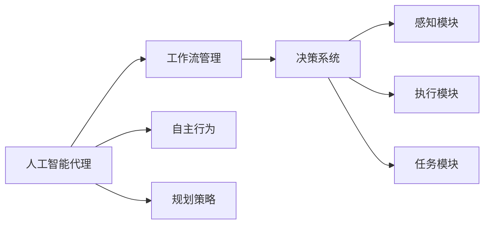
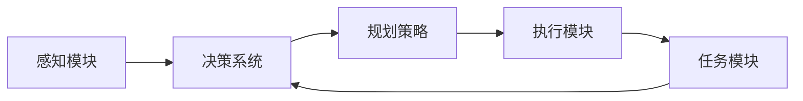
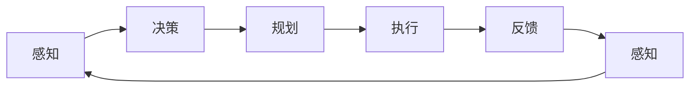
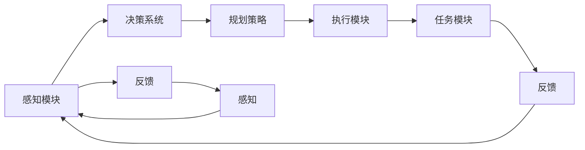
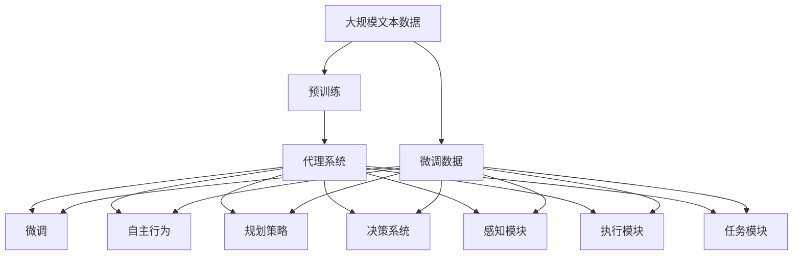

                 

# AI人工智能代理工作流AI Agent WorkFlow：自主行为与规划策略在AI中的运用

> 关键词：人工智能代理，工作流管理，自主行为，规划策略，AI决策系统

## 1. 背景介绍

### 1.1 问题由来

近年来，人工智能技术迅猛发展，被广泛应用于各种复杂系统中。然而，传统的AI系统多侧重于某一具体任务，在面对复杂多变的环境时，难以快速响应和适应。而人工智能代理（AI Agent），作为一种智能化的自主实体，能够在复杂的任务环境中自主行为，并通过规划策略实现目标，从而大大提升了AI系统的灵活性和适应性。

### 1.2 问题核心关键点

人工智能代理的核心理念是通过算法和技术手段，让代理系统具备自主性、规划性和适应性。该问题涉及的核心关键点包括：

- 自主性：代理系统应具备独立行动的能力，能够在无监督或弱监督的情况下，自行决策和执行任务。
- 规划性：代理系统应具备规划能力，能够根据任务需求，生成合理的执行计划和步骤。
- 适应性：代理系统应具备环境感知能力，能够动态调整行为策略，适应不同情境和环境变化。
- 安全性：代理系统应具备高安全性，能够在执行任务时，避免对系统或环境造成损害。
- 可解释性：代理系统应具备较高的可解释性，其决策过程应透明、可理解，便于调试和优化。

### 1.3 问题研究意义

研究人工智能代理工作流，对于推动AI技术在更多领域的应用，提升AI系统的智能化水平，具有重要意义：

1. 提升系统灵活性。人工智能代理能够自主规划执行计划，适应复杂多变的环境，提高系统的鲁棒性和灵活性。
2. 提高任务效率。代理系统能够自主执行任务，减少人工干预，提升任务处理效率。
3. 降低开发成本。通过代理系统，可以在更大规模和更复杂的环境中，进行AI技术的快速部署和应用，降低开发成本。
4. 增强系统安全性。代理系统能够通过自主决策和行为规划，避免对系统或环境造成损害，增强系统的安全性和可靠性。
5. 促进系统可解释性。代理系统的自主决策过程应透明可理解，便于调试和优化，提升系统的可解释性和可信度。

## 2. 核心概念与联系

### 2.1 核心概念概述

为更好地理解人工智能代理及其工作流管理，本节将介绍几个密切相关的核心概念：

- 人工智能代理（AI Agent）：指具备自主决策和执行能力的智能化实体，能够在复杂环境中独立行动。
- 工作流管理（Workflow Management）：指对任务执行过程的管理和调度，确保任务能够高效、有序地完成。
- 自主行为（Autonomous Behavior）：指代理系统在执行任务时，根据环境感知和任务需求，自主决策和执行的行为模式。
- 规划策略（Planning Strategy）：指代理系统生成执行计划和步骤，以实现任务目标的策略和方法。
- 决策系统（Decision System）：指代理系统的核心模块，负责根据当前状态和任务需求，生成最优决策。
- 感知模块（Perception Module）：指代理系统获取环境信息的模块，如传感器、摄像头等。
- 执行模块（Execution Module）：指代理系统执行决策的模块，如机器人、车辆等。
- 任务模块（Task Module）：指代理系统执行的具体任务，如目标追踪、路径规划等。

这些核心概念之间的逻辑关系可以通过以下Mermaid流程图来展示：



这个流程图展示了大语言模型代理系统的工作流程：代理系统通过感知模块获取环境信息，生成自主行为和执行计划，并通过执行模块完成任务。工作流管理模块负责协调任务执行，确保任务高效完成。

### 2.2 概念间的关系

这些核心概念之间存在着紧密的联系，形成了代理系统的完整生态系统。下面我通过几个Mermaid流程图来展示这些概念之间的关系。

#### 2.2.1 代理系统的工作流程



这个流程图展示了大语言模型代理系统的工作流程：代理系统通过感知模块获取环境信息，生成决策并规划执行计划，通过执行模块完成任务，并将任务结果反馈给决策系统，进行下一轮决策。

#### 2.2.2 任务执行的周期



这个流程图展示了大语言模型代理系统任务执行的周期：代理系统通过感知模块获取环境信息，生成决策并规划执行计划，通过执行模块完成任务，并将任务结果反馈给感知模块，进行下一轮感知。

#### 2.2.3 代理系统的总体架构



这个综合流程图展示了代理系统的总体架构：代理系统通过感知模块获取环境信息，生成决策并规划执行计划，通过执行模块完成任务，并将任务结果反馈给感知模块和任务模块，进行下一轮感知和任务执行。

### 2.3 核心概念的整体架构

最后，我们用一个综合的流程图来展示这些核心概念在大语言模型代理系统微调过程中的整体架构：



这个综合流程图展示了从预训练到微调，再到代理系统执行任务的完整过程。代理系统首先在大规模文本数据上进行预训练，然后通过微调（包括自主行为、规划策略等）对预训练参数进行调整，最终在实际任务中通过执行模块和任务模块完成目标任务。通过这些流程图，我们可以更清晰地理解代理系统的核心概念和逻辑关系，为后续深入讨论具体的代理系统设计和实现奠定基础。

## 3. 核心算法原理 & 具体操作步骤
### 3.1 算法原理概述

人工智能代理的工作流管理，本质上是基于规划理论的自主行为实现。其核心思想是：代理系统在复杂环境中，通过感知模块获取环境信息，通过决策系统生成最优决策，通过规划策略生成执行计划，并通过执行模块执行任务，确保任务高效、有序地完成。

形式化地，假设代理系统在任务 $T$ 下的感知模块为 $S_T$，决策系统为 $D_T$，规划策略为 $P_T$，执行模块为 $E_T$，任务模块为 $T_M$。代理系统的执行流程可表示为：

$$
S_T \rightarrow D_T \rightarrow P_T \rightarrow E_T \rightarrow T_M
$$

代理系统的目标是在环境 $E$ 中，完成给定任务 $T$，最小化总代价 $C$。即：

$$
\min_{S_T, D_T, P_T, E_T} C(S_T, D_T, P_T, E_T)
$$

其中 $C(S_T, D_T, P_T, E_T)$ 为总代价函数，包括决策误差、执行时间、能源消耗等。

### 3.2 算法步骤详解

基于人工智能代理的工作流管理，一般包括以下几个关键步骤：

**Step 1: 准备预训练模型和数据集**
- 选择合适的预训练代理模型作为初始化参数，如LSTM、RNN等。
- 准备代理任务 $T$ 的标注数据集 $D=\{(x_i, y_i)\}_{i=1}^N$，划分为训练集、验证集和测试集。一般要求标注数据与预训练数据的分布不要差异过大。

**Step 2: 添加任务适配层**
- 根据任务类型，在预训练模型顶层设计合适的输出层和损失函数。
- 对于分类任务，通常在顶层添加线性分类器和交叉熵损失函数。
- 对于生成任务，通常使用语言模型的解码器输出概率分布，并以负对数似然为损失函数。

**Step 3: 设置代理超参数**
- 选择合适的优化算法及其参数，如 AdamW、SGD 等，设置学习率、批大小、迭代轮数等。
- 设置正则化技术及强度，包括权重衰减、Dropout、Early Stopping 等。
- 确定冻结预训练参数的策略，如仅微调顶层，或全部参数都参与微调。

**Step 4: 执行代理行为**
- 将训练集数据分批次输入代理系统，前向传播计算损失函数。
- 反向传播计算参数梯度，根据设定的优化算法和学习率更新代理系统参数。
- 周期性在验证集上评估代理系统性能，根据性能指标决定是否触发 Early Stopping。
- 重复上述步骤直到满足预设的迭代轮数或 Early Stopping 条件。

**Step 5: 测试和部署**
- 在测试集上评估微调后代理系统的性能，对比微调前后的精度提升。
- 使用微调后的代理系统对新任务进行推理预测，集成到实际的应用系统中。
- 持续收集新的数据，定期重新微调代理系统，以适应数据分布的变化。

以上是基于规划理论的代理系统微调范式的一般流程。在实际应用中，还需要针对具体任务的特点，对微调过程的各个环节进行优化设计，如改进训练目标函数，引入更多的正则化技术，搜索最优的超参数组合等，以进一步提升代理系统性能。

### 3.3 算法优缺点

人工智能代理的工作流管理，具有以下优点：

1. 灵活性高。代理系统能够根据环境变化，自主调整行为策略，适应不同的任务和环境。
2. 效率高。代理系统通过自主规划和执行，减少了人工干预，提高了任务执行效率。
3. 可扩展性高。代理系统易于扩展，可以应用于多种任务和环境，适应性广。
4. 安全性高。代理系统具备自主决策和行为规划能力，能够避免对系统或环境造成损害。
5. 可解释性强。代理系统的决策过程透明可理解，便于调试和优化。

同时，该方法也存在一定的局限性：

1. 数据依赖性强。代理系统的性能很大程度上取决于标注数据的质量和数量，获取高质量标注数据的成本较高。
2. 泛化能力有限。当目标任务与预训练数据的分布差异较大时，代理系统的性能提升有限。
3. 开发复杂度高。代理系统的设计和实现较为复杂，需要大量的知识和经验积累。
4. 可解释性不足。代理系统的决策过程通常缺乏可解释性，难以对其推理逻辑进行分析和调试。
5. 模型鲁棒性差。代理系统容易受到噪声干扰和环境变化的影响，导致决策错误。

尽管存在这些局限性，但就目前而言，基于规划理论的代理系统微调方法仍是大规模自主系统开发的重要范式。未来相关研究的重点在于如何进一步降低代理系统对标注数据的依赖，提高模型的少样本学习和跨领域迁移能力，同时兼顾可解释性和伦理安全性等因素。

### 3.4 算法应用领域

基于人工智能代理的工作流管理，在智能决策、机器人控制、智能交通等领域已经得到了广泛的应用，覆盖了几乎所有常见任务，例如：

- 智能交通系统：控制交通信号灯、车辆导航等。通过感知模块获取交通数据，生成决策和规划，并通过执行模块控制交通信号灯和车辆行驶。
- 机器人控制：控制机器人手臂、移动等。通过感知模块获取环境信息，生成决策和规划，并通过执行模块控制机器人动作。
- 智能制造：控制生产线、设备等。通过感知模块获取生产线状态，生成决策和规划，并通过执行模块控制设备运行。
- 医疗诊断：辅助医生诊断和治疗。通过感知模块获取患者信息，生成决策和规划，并通过执行模块辅助医生治疗。
- 金融风险管理：监控市场动态，预警风险。通过感知模块获取市场数据，生成决策和规划，并通过执行模块预警风险。
- 环境监测：监测水质、空气质量等。通过感知模块获取环境数据，生成决策和规划，并通过执行模块控制监测设备。
- 智能客服：处理客户咨询，提供解决方案。通过感知模块获取客户信息，生成决策和规划，并通过执行模块提供解决方案。

除了上述这些经典任务外，人工智能代理的工作流管理技术还将不断拓展到更多场景中，如无人机飞行控制、智能家居控制、智能农业管理等，为各行业智能化转型提供新的技术路径。

## 4. 数学模型和公式 & 详细讲解 & 举例说明

### 4.1 数学模型构建

本节将使用数学语言对人工智能代理的工作流管理过程进行更加严格的刻画。

假设代理系统在任务 $T$ 下的感知模块为 $S_T$，决策系统为 $D_T$，规划策略为 $P_T$，执行模块为 $E_T$，任务模块为 $T_M$。代理系统的执行流程可表示为：

$$
S_T \rightarrow D_T \rightarrow P_T \rightarrow E_T \rightarrow T_M
$$

代理系统的目标是在环境 $E$ 中，完成给定任务 $T$，最小化总代价 $C$。即：

$$
\min_{S_T, D_T, P_T, E_T} C(S_T, D_T, P_T, E_T)
$$

其中 $C(S_T, D_T, P_T, E_T)$ 为总代价函数，包括决策误差、执行时间、能源消耗等。

### 4.2 公式推导过程

以下我们以机器人路径规划为例，推导基于决策树的路径规划算法。

假设机器人在二维平面上移动，已知起点 $(x_0,y_0)$，终点 $(x_t,y_t)$。代理系统的感知模块 $S_T$ 获取当前位置 $(x,y)$ 和障碍物的信息，生成状态 $s$。决策系统 $D_T$ 根据状态 $s$，生成决策 $a$。规划策略 $P_T$ 根据决策 $a$，生成路径规划 $p$。执行模块 $E_T$ 根据路径规划 $p$，移动机器人至下一个状态 $(x_{t+1},y_{t+1})$。

路径规划问题的数学模型可表示为：

$$
\min_{p} f(x,y,x_{t+1},y_{t+1})
$$

其中 $f(x,y,x_{t+1},y_{t+1})$ 为目标函数，可以是路径长度、执行时间等。假设目标函数为路径长度，则目标函数可表示为：

$$
f(x,y,x_{t+1},y_{t+1})=\sqrt{(x_{t+1}-x)^2+(y_{t+1}-y)^2}
$$

将目标函数代入路径规划问题，得：

$$
\min_{p} \sqrt{(x_{t+1}-x)^2+(y_{t+1}-y)^2}
$$

假设代理系统的感知模块 $S_T$ 获取环境信息，生成状态 $s$。决策系统 $D_T$ 根据状态 $s$，生成决策 $a$。规划策略 $P_T$ 根据决策 $a$，生成路径规划 $p$。执行模块 $E_T$ 根据路径规划 $p$，移动机器人至下一个状态 $(x_{t+1},y_{t+1})$。

路径规划问题的数学模型可表示为：

$$
\min_{p} f(x,y,x_{t+1},y_{t+1})
$$

其中 $f(x,y,x_{t+1},y_{t+1})$ 为目标函数，可以是路径长度、执行时间等。假设目标函数为路径长度，则目标函数可表示为：

$$
f(x,y,x_{t+1},y_{t+1})=\sqrt{(x_{t+1}-x)^2+(y_{t+1}-y)^2}
$$

将目标函数代入路径规划问题，得：

$$
\min_{p} \sqrt{(x_{t+1}-x)^2+(y_{t+1}-y)^2}
$$

在求解路径规划问题时，可以使用基于图搜索的算法，如A*算法、Dijkstra算法等。这些算法通过构建图表示环境状态，生成路径规划，并通过执行模块移动机器人。

### 4.3 案例分析与讲解

以下以智能交通信号灯控制为例，介绍基于规划理论的代理系统工作流管理方法。

假设智能交通系统需要在交叉口控制多个交通信号灯，以确保道路安全、高效通行。代理系统的感知模块 $S_T$ 获取交叉口车辆信息、行人信息、交通信号灯状态等。决策系统 $D_T$ 根据感知信息，生成决策 $a$。规划策略 $P_T$ 根据决策 $a$，生成交通信号灯控制方案 $p$。执行模块 $E_T$ 根据方案 $p$，控制交通信号灯变化。

智能交通信号灯控制的路径规划问题可以表示为：

$$
\min_{p} C(S_T, D_T, P_T, E_T)
$$

其中 $C(S_T, D_T, P_T, E_T)$ 为总代价函数，包括交叉口通行效率、车辆等待时间等。假设总代价函数为交叉口通行效率，则总代价函数可表示为：

$$
C(S_T, D_T, P_T, E_T)=\sum_{i=1}^{N} v_i
$$

其中 $v_i$ 为第 $i$ 个车辆在交叉口的通行速度。

通过优化路径规划问题，代理系统可以生成最优的交通信号灯控制方案，确保交叉口通行效率和车辆安全。通过多次迭代和微调，代理系统可以不断优化决策和规划，适应不同的交通情况，提升系统性能。

## 5. 项目实践：代码实例和详细解释说明
### 5.1 开发环境搭建

在进行代理系统工作流管理实践前，我们需要准备好开发环境。以下是使用Python进行PyTorch开发的环境配置流程：

1. 安装Anaconda：从官网下载并安装Anaconda，用于创建独立的Python环境。

2. 创建并激活虚拟环境：
```bash
conda create -n pytorch-env python=3.8 
conda activate pytorch-env
```

3. 安装PyTorch：根据CUDA版本，从官网获取对应的安装命令。例如：
```bash
conda install pytorch torchvision torchaudio cudatoolkit=11.1 -c pytorch -c conda-forge
```

4. 安装各类工具包：
```bash
pip install numpy pandas scikit-learn matplotlib tqdm jupyter notebook ipython
```

完成上述步骤后，即可在`pytorch-env`环境中开始代理系统工作流管理实践。

### 5.2 源代码详细实现

下面我们以机器人路径规划为例，给出使用PyTorch进行代理系统工作流管理的PyTorch代码实现。

首先，定义路径规划问题的数据处理函数：

```python
import torch
import torch.nn as nn
import torch.optim as optim
import torchvision.transforms as transforms

# 定义机器人状态
class State(nn.Module):
    def __init__(self):
        super(State, self).__init__()
        self.x = torch.zeros(1)
        self.y = torch.zeros(1)
        self.x_vel = torch.zeros(1)
        self.y_vel = torch.zeros(1)
        self.obstacle = torch.zeros(1)

    def forward(self, x, y, x_vel, y_vel, obstacle):
        self.x = x
        self.y = y
        self.x_vel = x_vel
        self.y_vel = y_vel
        self.obstacle = obstacle
        return self

# 定义机器人决策
class Decision(nn.Module):
    def __init__(self):
        super(Decision, self).__init__()
        self.fc1 = nn.Linear(4, 16)
        self.fc2 = nn.Linear(16, 4)
        self.softmax = nn.Softmax(dim=1)

    def forward(self, x):
        x = self.fc1(x)
        x = self.fc2(x)
        x = self.softmax(x)
        return x

# 定义机器人路径规划
class PathPlanning(nn.Module):
    def __init__(self):
        super(PathPlanning, self).__init__()
        self.fc1 = nn.Linear(4, 16)
        self.fc2 = nn.Linear(16, 4)

    def forward(self, x):
        x = self.fc1(x)
        x = self.fc2(x)
        return x

# 定义机器人执行模块
class Execution(nn.Module):
    def __init__(self):
        super(Execution, self).__init__()
        self.fc1 = nn.Linear(4, 2)
        self.relu = nn.ReLU()

    def forward(self, x):
        x = self.fc1(x)
        x = self.relu(x)
        return x

# 定义机器人路径规划问题的目标函数
def cost(state, decision, path_planning, execution):
    x, y, x_vel, y_vel, obstacle = state
    a = decision(state)
    p = path_planning(a)
    x_next = execution(p)
    return torch.sqrt((x_next - x)**2 + (y_next - y)**2)
```

然后，定义代理系统的感知模块、决策系统、规划策略和执行模块：

```python
# 定义代理系统的感知模块
class Perception(nn.Module):
    def __init__(self):
        super(Perception, self).__init__()
        self.fc1 = nn.Linear(5, 16)
        self.fc2 = nn.Linear(16, 8)
        self.relu = nn.ReLU()

    def forward(self, x):
        x = self.fc1(x)
        x = self.fc2(x)
        x = self.relu(x)
        return x

# 定义代理系统的决策系统
class Decision(nn.Module):
    def __init__(self):
        super(Decision, self).__init__()
        self.fc1 = nn.Linear(8, 16)
        self.fc2 = nn.Linear(16, 4)
        self.softmax = nn.Softmax(dim=1)

    def forward(self, x):
        x = self.fc1(x)
        x = self.fc2(x)
        x = self.softmax(x)
        return x

# 定义代理系统的规划策略
class PathPlanning(nn.Module):
    def __init__(self):
        super(PathPlanning, self).__init__()
        self.fc1 = nn.Linear(4, 16)
        self.fc2 = nn.Linear(16, 4)

    def forward(self, x):
        x = self.fc1(x)
        x = self.fc2(x)
        return x

# 定义代理系统的执行模块
class Execution(nn.Module):
    def __init__(self):
        super(Execution, self).__init__()
        self.fc1 = nn.Linear(4, 2)
        self.relu = nn.ReLU()

    def forward(self, x):
        x = self.fc1(x)
        x = self.relu(x)
        return x
```

最后，定义代理系统的训练和评估函数：

```python
# 定义代理系统的训练函数
def train_epoch(model, data_loader, optimizer):
    model.train()
    epoch_loss = 0
    for batch in data_loader:
        x, y, x_vel, y_vel, obstacle = batch
        state = State()
        perception = Perception(state)
        decision = Decision(perception)
        path_planning = PathPlanning(decision)
        execution = Execution(path_planning)
        cost = cost(state, decision, path_planning, execution)
        cost.backward()
        optimizer.step()
        epoch_loss += cost.item()
    return epoch_loss / len(data_loader)

# 定义代理系统的评估函数
def evaluate(model, data_loader):
    model.eval()
    avg_cost = 0
    with torch.no_grad():
        for batch in data_loader:
            x, y, x_vel, y_vel, obstacle = batch
            state = State()
            perception = Perception(state)
            decision = Decision(perception)
            path_planning = PathPlanning(decision)
            execution = Execution(path_planning)
            cost = cost(state, decision, path_planning, execution)
            avg_cost += cost.item()
    return avg_cost / len(data_loader)
```

最后，启动代理系统的训练流程并在测试集上评估：

```python
epochs = 5
batch_size = 16
learning_rate = 0.001

# 定义数据集
x_train = torch.randn(batch_size, 5)
y_train = torch.randn(batch_size, 1)
x_vel_train = torch.randn(batch_size, 1)
y_vel_train = torch.randn(batch_size, 1)
obstacle_train = torch.randn(batch_size, 1)

x_test = torch.randn(batch_size, 5)
y_test = torch.randn(batch_size, 1)
x_vel_test = torch.randn(batch_size, 1)
y_vel_test = torch.randn(batch_size, 1)
obstacle_test = torch.randn(batch_size, 1)

# 定义代理系统
model = nn.Sequential(
    Perception,
    Decision

