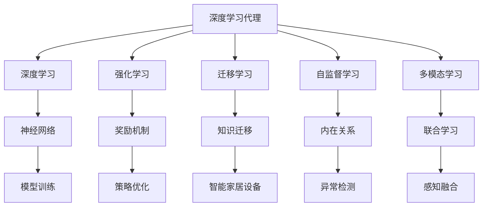
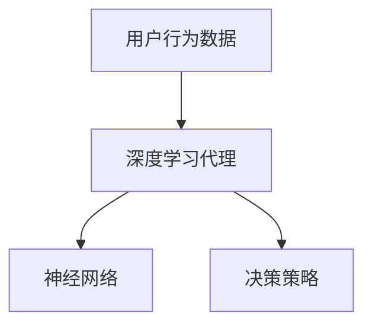
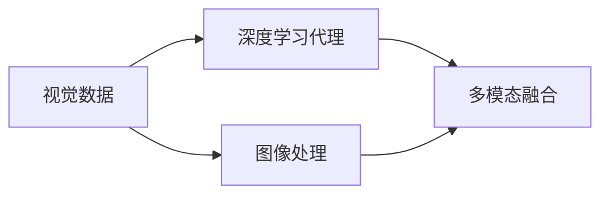
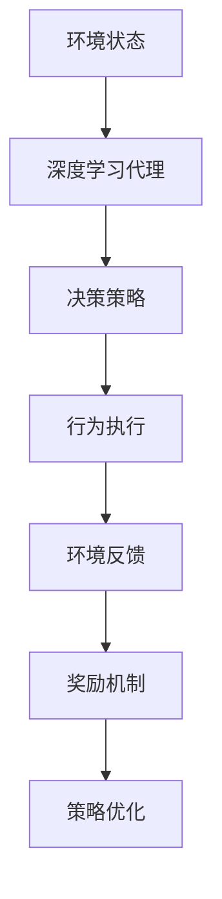

                 

# AI人工智能深度学习算法：在智能家居场景应用深度学习代理

> 关键词：智能家居,深度学习,代理,算法优化,语音控制,能效管理,行为预测,深度学习算法

## 1. 背景介绍

### 1.1 问题由来
智能家居的兴起标志着物联网技术的发展进入新阶段，然而，智能家居的智能化水平依然有较大的提升空间。如何通过技术手段提升智能家居的智能度、自动化水平以及用户满意度，成为行业关注的焦点。深度学习代理（Deep Learning Agent, DLA）技术为这一目标提供了新的解决方案。

### 1.2 问题核心关键点
深度学习代理（DLA）是一种基于深度学习的智能决策技术，通过学习用户行为数据，可以自主地做出决策，提高智能家居的智能化程度。深度学习代理的核心思想是：将用户与家居设备之间的交互数据作为输入，通过深度学习模型进行处理和分析，自动生成决策，以提升用户体验和家居设备的自动化水平。

### 1.3 问题研究意义
研究深度学习代理技术，对于提升智能家居的智能化水平，优化用户行为预测，增强家居设备的自动化控制能力，具有重要意义：

1. **自动化水平提升**：深度学习代理能够自主地根据用户行为和环境数据进行决策，减少人工干预，提升家居设备的自动化水平。
2. **用户体验优化**：通过学习用户行为，深度学习代理能够更好地理解用户需求，提供个性化服务，提升用户满意度。
3. **能效管理优化**：深度学习代理能够实时监测家居设备运行状态，根据用户行为和环境数据调整设备运行策略，优化能效管理。
4. **设备协同优化**：深度学习代理能够实现不同设备之间的信息共享和协同控制，提升整体系统的稳定性和响应速度。

## 2. 核心概念与联系

### 2.1 核心概念概述

为更好地理解深度学习代理在大数据背景下的应用，本节将介绍几个密切相关的核心概念：

- 深度学习代理（Deep Learning Agent, DLA）：基于深度学习模型进行决策的智能代理，能够从海量用户行为数据中学习到复杂的决策模式，并根据学习到的模式进行自主决策。
- 深度学习（Deep Learning, DL）：一种通过深度神经网络进行数据建模和决策的机器学习方法，适用于处理大规模、高维度、非线性的数据。
- 强化学习（Reinforcement Learning, RL）：一种通过智能体与环境的交互，逐步优化决策策略的机器学习方法，适用于智能家居等动态环境。
- 迁移学习（Transfer Learning）：将一个领域学习到的知识迁移到另一个领域，适用于家居设备控制等领域的知识迁移。
- 自监督学习（Self-Supervised Learning）：利用数据自身的内在关系进行无监督学习，适用于家居设备异常行为检测等任务。
- 多模态学习（Multi-modal Learning）：结合视觉、听觉、温度等多种模态数据进行联合学习，适用于智能家居中的行为预测和环境感知。
- 强化学习代理（Reinforcement Learning Agent, RLA）：通过与环境交互，通过奖励机制进行策略优化的智能代理，适用于智能家居设备控制。

这些核心概念之间的逻辑关系可以通过以下Mermaid流程图来展示：



这个流程图展示了大语言模型的核心概念及其之间的关系：

1. 深度学习代理基于深度学习模型进行决策。
2. 深度学习代理可以结合强化学习，通过奖励机制进行策略优化。
3. 深度学习代理可以通过迁移学习，将知识迁移到新的应用场景。
4. 深度学习代理可以应用自监督学习，学习数据的内在关系。
5. 深度学习代理可以结合多模态学习，进行联合学习。

这些概念共同构成了深度学习代理在大数据背景下的学习框架，使其能够在各种场景下发挥智能决策的能力。通过理解这些核心概念，我们可以更好地把握深度学习代理的工作原理和优化方向。

### 2.2 概念间的关系

这些核心概念之间存在着紧密的联系，形成了深度学习代理在大数据背景下的完整生态系统。下面我们通过几个Mermaid流程图来展示这些概念之间的关系。

#### 2.2.1 深度学习代理的决策过程



这个流程图展示了深度学习代理的决策过程：

1. 深度学习代理接收用户行为数据。
2. 通过神经网络进行数据处理和特征提取。
3. 根据学习到的特征生成决策策略。

#### 2.2.2 深度学习代理的多模态感知



这个流程图展示了深度学习代理的多模态感知：

1. 深度学习代理接收视觉数据。
2. 通过图像处理生成视觉特征。
3. 结合其他模态数据进行多模态融合。

#### 2.2.3 深度学习代理的强化学习



这个流程图展示了深度学习代理的强化学习过程：

1. 深度学习代理接收环境状态。
2. 根据策略生成行为执行。
3. 环境给出反馈，生成奖励机制。
4. 根据奖励机制进行策略优化。

### 2.3 核心概念的整体架构

最后，我们用一个综合的流程图来展示这些核心概念在大数据背景下的深度学习代理的完整架构：

```mermaid
graph TB
    A[大数据平台] --> B[用户行为数据]
    B --> C[深度学习代理]
    C --> D[神经网络]
    C --> E[决策策略]
    C --> F[策略优化]
    C --> G[异常检测]
    C --> H[知识迁移]
    C --> I[联合学习]
    C --> J[模型训练]
    D --> K[特征提取]
    E --> L[行为预测]
    F --> M[策略优化]
    G --> N[异常检测]
    H --> O[知识迁移]
    I --> P[感知融合]
    J --> Q[模型训练]
    K --> R[特征融合]
    L --> S[决策输出]
    M --> T[行为执行]
    N --> U[异常反馈]
    O --> V[知识迁移]
    P --> W[联合学习]
    Q --> X[模型优化]
    R --> Y[特征处理]
    S --> Z[决策输出]
    T --> AA[行为执行]
    U --> AB[异常反馈]
    V --> AC[知识迁移]
    W --> AD[联合学习]
    X --> AE[模型优化]
    Y --> AF[特征处理]
    Z --> AG[决策输出]
    AA --> AH[行为执行]
    AB --> AI[异常反馈]
    AC --> AJ[知识迁移]
    AD --> AK[联合学习]
    AE --> AL[模型优化]
    AF --> AM[特征处理]
    AG --> AN[决策输出]
    AH --> AO[行为执行]
    AI --> AP[异常反馈]
    AJ --> AQ[知识迁移]
    AK --> AR[联合学习]
    AL --> AM[模型优化]
    AM --> AN[特征处理]
    AN --> AO[决策输出]
    AO --> AP[行为执行]
    AP --> AQ[异常反馈]
    AQ --> AR[联合学习]
    AR --> AO[特征处理]
    AS --> AO[决策输出]
    AT --> AU[行为执行]
    AU --> AV[异常反馈]
    AV --> AW[知识迁移]
    AW --> AX[联合学习]
    AX --> AY[模型优化]
    AY --> AZ[特征处理]
    AZ --> BA[决策输出]
    BA --> BB[行为执行]
    BB --> BC[异常反馈]
    BC --> BD[知识迁移]
    BD --> BE[联合学习]
    BE --> BF[模型优化]
    BF --> BG[特征处理]
    BG --> BH[决策输出]
    BH --> BI[行为执行]
    BI --> BJ[异常反馈]
    BJ --> BK[知识迁移]
    BK --> BL[联合学习]
    BL --> BM[模型优化]
    BM --> BN[特征处理]
    BN --> BO[决策输出]
    BO --> BP[行为执行]
    BP --> BQ[异常反馈]
    BQ --> BR[知识迁移]
    BR --> BS[联合学习]
    BS --> BT[模型优化]
    BT --> BU[特征处理]
    BU --> BV[决策输出]
    BV --> BW[行为执行]
    BW --> BX[异常反馈]
    BX --> BY[知识迁移]
    BY --> BZ[联合学习]
    BZ --> CA[模型优化]
    CA --> CB[特征处理]
    CB --> CC[决策输出]
    CC --> CD[行为执行]
    CD --> CE[异常反馈]
    CE --> CF[知识迁移]
    CF --> CG[联合学习]
    CG --> CH[模型优化]
    CH --> CI[特征处理]
    CI --> CJ[决策输出]
    CJ --> CK[行为执行]
    CK --> CL[异常反馈]
    CL --> CM[知识迁移]
    CM --> CN[联合学习]
    CN --> CO[模型优化]
    CO --> CP[特征处理]
    CP --> CQ[决策输出]
    CQ --> CR[行为执行]
    CR --> CS[异常反馈]
    CS --> CT[知识迁移]
    CT --> CU[联合学习]
    CU --> CV[模型优化]
    CV --> CW[特征处理]
    CW --> CX[决策输出]
    CX --> CY[行为执行]
    CY --> CZ[异常反馈]
    CZ --> DA[知识迁移]
    DA --> DB[联合学习]
    DB --> DC[模型优化]
    DC --> DD[特征处理]
    DD --> DE[决策输出]
    DE --> DF[行为执行]
    DF --> DG[异常反馈]
    DG --> DH[知识迁移]
    DH --> DI[联合学习]
    DI --> DJ[模型优化]
    DJ --> DK[特征处理]
    DK --> DL[决策输出]
    DL --> DM[行为执行]
    DM --> DN[异常反馈]
    DN --> DO[知识迁移]
    DO --> DP[联合学习]
    DP --> DQ[模型优化]
    DQ --> DR[特征处理]
    DR --> DS[决策输出]
    DS --> DT[行为执行]
    DT --> DU[异常反馈]
    DU --> DV[知识迁移]
    DV --> DW[联合学习]
    DW --> DX[模型优化]
    DX --> DY[特征处理]
    DY --> DZ[决策输出]
    DZ --> EA[行为执行]
    EA --> EB[异常反馈]
    EB --> EC[知识迁移]
    EC --> ED[联合学习]
    ED --> EE[模型优化]
    EE --> EF[特征处理]
    EF --> EG[决策输出]
    EG --> EH[行为执行]
    EH --> EI[异常反馈]
    EI --> EJ[知识迁移]
    EJ --> EK[联合学习]
    EK --> EL[模型优化]
    EL --> EM[特征处理]
    EM --> EN[决策输出]
    EN --> EO[行为执行]
    EO --> EP[异常反馈]
    EP --> EQ[知识迁移]
    EQ --> ER[联合学习]
    ER --> ES[模型优化]
    ES --> ET[特征处理]
    ET --> EU[决策输出]
    EU --> EV[行为执行]
    EV --> EW[异常反馈]
    EW --> EX[知识迁移]
    EX --> EY[联合学习]
    EY --> EZ[模型优化]
    EZ --> FA[特征处理]
    FA --> FB[决策输出]
    FB --> FC[行为执行]
    FC --> FD[异常反馈]
    FD --> FE[知识迁移]
    FE --> FF[联合学习]
    FF --> FG[模型优化]
    FG --> FH[特征处理]
    FH --> FI[决策输出]
    FI --> FJ[行为执行]
    FJ --> FK[异常反馈]
    FK --> FL[知识迁移]
    FL --> FM[联合学习]
    FM --> FN[模型优化]
    FN --> FO[特征处理]
    FO --> FQ[决策输出]
    FQ --> FR[行为执行]
    FR --> FS[异常反馈]
    FS --> FT[知识迁移]
    FT --> FU[联合学习]
    FU --> FV[模型优化]
    FV --> FW[特征处理]
    FW --> FX[决策输出]
    FX --> FY[行为执行]
    FY --> FZ[异常反馈]
    FZ --> GA[知识迁移]
    GA --> GB[联合学习]
    GB --> GC[模型优化]
    GC --> GD[特征处理]
    GD --> GE[决策输出]
    GE --> GF[行为执行]
    GF --> GG[异常反馈]
    GG --> GH[知识迁移]
    GH --> GI[联合学习]
    GI --> GJ[模型优化]
    GJ --> GK[特征处理]
    GK --> GL[决策输出]
    GL --> GM[行为执行]
    GM --> GN[异常反馈]
    GN --> GO[知识迁移]
    GO --> GP[联合学习]
    GP --> GQ[模型优化]
    GQ --> GR[特征处理]
    GR --> GS[决策输出]
    GS --> GT[行为执行]
    GT --> GU[异常反馈]
    GU --> GV[知识迁移]
    GV --> GW[联合学习]
    GW --> GX[模型优化]
    GX --> GY[特征处理]
    GY --> GZ[决策输出]
    GZ --> HA[行为执行]
    HA --> HB[异常反馈]
    HB --> HC[知识迁移]
    HC --> HD[联合学习]
    HD --> HE[模型优化]
    HE --> HF[特征处理]
    HF --> HG[决策输出]
    HG --> HH[行为执行]
    HH --> HI[异常反馈]
    HI --> HJ[知识迁移]
    HJ --> HK[联合学习]
    HK --> HL[模型优化]
    HL --> HM[特征处理]
    HM --> HN[决策输出]
    HN --> HO[行为执行]
    HO --> HP[异常反馈]
    HP --> HQ[知识迁移]
    HQ --> HR[联合学习]
    HR --> HS[模型优化]
    HS --> HT[特征处理]
    HT --> HU[决策输出]
    HU --> HV[行为执行]
    HV --> HW[异常反馈]
    HW --> HX[知识迁移]
    HX --> Hy[联合学习]
    Hy --> HZ[模型优化]
    HZ --> IA[特征处理]
    IA --> IB[决策输出]
    IB --> IC[行为执行]
    IC --> ID[异常反馈]
    ID --> IE[知识迁移]
    IE --> IF[联合学习]
    IF --> IG[模型优化]
    IG --> IH[特征处理]
    IH --> II[决策输出]
    II --> IJ[行为执行]
    IJ --> IK[异常反馈]
    IK --> IL[知识迁移]
    IL --> IM[联合学习]
    IM --> IN[模型优化]
    IN --> IO[特征处理]
    IO --> IP[决策输出]
    IP --> IQ[行为执行]
    IQ --> IR[异常反馈]
    IR --> IS[知识迁移]
    IS --> IT[联合学习]
    IT --> IU[模型优化]
    IU --> IV[特征处理]
    IV --> IW[决策输出]
    IW --> IX[行为执行]
    IX --> IY[异常反馈]
    IY --> Iz[知识迁移]
    Iz --> JA[联合学习]
    JA --> JB[模型优化]
    JB --> JC[特征处理]
    JC --> JD[决策输出]
    JD --> JE[行为执行]
    JE --> JF[异常反馈]
    JF --> JG[知识迁移]
    JG --> JH[联合学习]
    JH --> JI[模型优化]
    JI --> JJ[特征处理]
    JJ --> JK[决策输出]
    JK --> JL[行为执行]
    JL --> JM[异常反馈]
    JM --> JN[知识迁移]
    JN --> JO[联合学习]
    JO --> JP[模型优化]
    JP --> JQ[特征处理]
    JQ --> JR[决策输出]
    JR --> JS[行为执行]
    JS --> JT[异常反馈]
    JT --> JU[知识迁移]
    JU --> JV[联合学习]
    JV --> JW[模型优化]
    JW --> JX[特征处理]
    JX --> JY[决策输出]
    JY --> JZ[行为执行]
    JZ -->KA[知识迁移]
    KA --> KB[联合学习]
    KB --> KC[模型优化]
    KC --> KD[特征处理]
    KD --> KE[决策输出]
    KE --> KF[行为执行]
    KF --> KG[异常反馈]
    KG --> KH[知识迁移]
    KH --> KI[联合学习]
    KI --> KJ[模型优化]
    KJ --> KK[特征处理]
    KK --> KL[决策输出]
    KL --> KM[行为执行]
    KM --> KN[异常反馈]
    KN --> KO[知识迁移]
    KO --> KP[联合学习]
    KP --> KQ[模型优化]
    KQ --> KR[特征处理]
    KR --> KS[决策输出]
    KS --> KT[行为执行]
    KT --> KU[异常反馈]
    KU --> KV[知识迁移]
    KV --> KW[联合学习]
    KW --> KX[模型优化]
    KX --> KY[特征处理]
    KY --> KZ[决策输出]
    KZ -->LA[行为执行]
    LA --> LB[异常反馈]
    LB --> LC[知识迁移]
    LC --> LD[联合学习]
    LD --> LE[模型优化]
    LE --> LF[特征处理]
    LF --> LG[决策输出]
    LG --> LH[行为执行]
    LH --> LI[异常反馈]
    LI --> LJ[知识迁移]
    LJ --> LK[联合学习]
    LK --> LL[模型优化]
    LL --> LM[特征处理]
    LM --> LN[决策输出]
    LN --> LO[行为执行]
    LO --> LP[异常反馈]
    LP --> LQ[知识迁移]
    LQ --> LR[联合学习]
    LR --> LS[模型优化]
    LS --> LT[特征处理]
    LT --> LU[决策输出]
    LU --> LV[行为执行]
    LV --> LW[异常反馈]
    LW --> LX[知识迁移]
    LX --> Ly[联合学习]
    Ly --> LZ[模型优化]
    LZ -->MA[特征处理]
    MA --> MB[决策输出]
    MB --> MC[行为执行]
    MC --> MD[异常反馈]
    MD --> ME[知识迁移]
    ME --> MF[联合学习]
    MF --> MG[模型优化]
    MG --> MH[特征处理]
    MH --> MI[决策输出]
    MI --> MJ[行为执行]
    MJ --> MK[异常反馈]
    MK --> ML[知识迁移]
    ML --> MM[联合学习]
    MM --> MN[模型优化]
    MN --> MO[特征处理]
    MO --> MP[决策输出]
    MP --> MQ[行为执行]
    MQ --> MR[异常反馈]
    MR --> MS[知识迁移]
    MS --> MT[联合学习]
    MT --> MU[模型优化]
    MU --> MV[特征处理]
    MV --> MX[决策输出]
    MX --> MY[行为执行]
    MY --> MZ[异常反馈]
    MZ -->NA[知识迁移]
    NA --> NB[联合学习]
    NB --> NC[模型优化]
    NC --> ND[特征处理]
    ND --> NE[决策输出]
    NE --> NF[行为执行]
    NF --> NG[异常反馈]
    NG --> NH[知识迁移]
    NH --> NI[联合学习]
    NI --> NJ[模型优化]
    NJ --> NK[特征处理]
    NK --> NL[决策输出]
    NL --> NM[行为执行]
    NM --> NN[异常反馈]
    NN --> NO[知识迁移]
    NO --> NP[联合学习]
    NP --> NQ[模型优化]
    NQ --> NR[特征处理]
    NR --> NS[决策输出]
    NS --> NT[行为执行]
    NT --> NU[异常反馈]
    NU --> NV[知识迁移]
    NV --> NW[联合学习]
    NW --> NX[模型优化]
    NX --> NY[特征处理]
    NY --> NZ[决策输出]
    NZ -->OA[行为执行]
    OA --> OB[异常反馈]
    OB --> OC[知识迁移]
    OC --> OD[联合学习]
    OD --> OE[模型优化]
    OE --> OF[特征处理]
    OF --> OG[决策输出]
    OG --> OH[行为执行]
    OH --> OI[异常反馈]
    OI --> OJ[知识迁移]
    OJ --> OK[联合学习]
    OK --> OL[模型优化]
    OL --> OM[特征处理]
    OM --> ON[决策输出]
    ON --> OO[行为执行]
    OO --> OP[异常反馈]
    OP --> OQ[知识迁移]
    OQ --> OR[联合学习]
    OR --> OS[模型优化]
    OS --> OT[特征处理]
    OT --> OU[决策输出]
    OU --> OV[行为执行]
    OV --> OW[异常反馈]
    OW --> OX[知识迁移]
    OX --> Oy[联合学习]
    Oy --> OZ[模型优化]
    OZ -->PA[特征处理]
    PA --> PB[决策输出]
    PB --> PC[行为执行]
    PC --> PD[异常反馈]
    PD --> PE[知识迁移]
    PE --> PF[联合学习]
    PF --> PG[模型优化]
    PG --> PH[特征处理]
    PH --> PI[决策输出]
    PI --> PJ[行为执行]
    PJ --> PK[异常反馈]
    PK --> PL[知识迁移]
    PL --> PM[联合学习]
    PM --> PN[模型优化]
    PN --> PO[特征处理]
    PO --> PP[决策输出]
    PP --> PQ[行为执行]
    PQ --> PR[异常反馈]
    PR --> PS[知识迁移]
    PS --> PT[联合学习]
    PT --> PU[模型优化]
    PU --> PV[特征处理]
    PV --> PW[决策输出]
    PW --> PX[行为执行]
    PX --> PY[异常反馈]
    PY --> PZ[知识迁移]
    PZ -->QA[联合学习]
    QA --> QB[模型优化]
    QB --> QC[特征处理]
    QC --> QD[决策输出]
    QD --> QE[行为执行]
    QE --> QF[异常反馈]
    QF --> QG[知识迁移]
    QG --> QH[联合学习]
    QH --> QI[模型优化]
    QI --> QJ[特征处理]
    QJ --> QK[决策输出]
    QK --> QL[行为执行]
    QL --> QM[异常反馈]
    QM --> QN[知识迁移]
    QN --> QO[联合学习]
    QO --> QP[模型优化]
    QP --> QQ[特征处理]
    QQ --> QR[决策输出]
    QR --> QS[行为执行]
    QS --> QT[异常反馈]
    QT --> QU[知识迁移]
    QU --> QV[联合学习]
    QV --> QW[模型优化]
    QW --> QX[特征处理]
    QX --> QY[决策输出]
    QY --> QZ[行为执行]
    QZ -->RA[知识迁移]
    RA --> RB[联合学习]
    RB --> RC[模型优化]
    RC --> RD[特征处理]
    RD --> RE[决策输出]
    RE --> RF[行为执行]
    RF --> RG[异常反馈]
    RG --> RH[知识迁移]
    RH --> RI[联合学习]
    RI --> RJ[模型优化]
    RJ --> RK[特征处理]
    RK --> RL[决策输出]
    RL --> RM[行为执行]
    RM --> RN[异常反馈]
    RN --> RO[知识迁移]
    RO --> RP[联合学习]
    RP --> RQ[模型优化]
    RQ --> RR[特征处理]
    RR --> RS[决策输出]
    RS --> RT[行为执行]
    RT --> RU[异常反馈]
    RU --> RV[知识迁移]
    RV --> RW[联合学习]
    RW --> RX[模型优化]
    RX --> RY[特征处理]
    RY --> RZ[决策输出]
    RZ -->SA[行为执行]
    SA --> SB[异常反馈]
    SB --> SC[知识迁移]
    SC --> SD[联合学习]
    SD --> SE[模型优化]
    SE --> SF[特征处理]
    SF --> SG[决策输出]
    SG --> SH[行为执行]
    SH --> SI[异常反馈]
    SI --> SJ[知识迁移]
    SJ --> SK[联合学习]
    SK --> SL[模型优化]
    SL --> SM[特征处理]
    SM --> SN[决策输出]
    SN --> SO[行为执行]
    SO --> SP[异常反馈]
    SP --> SQ[知识迁移]
    SQ --> SR[联合学习]
    SR --> SS[模型优化]
    SS --> ST[特征处理]
    ST -->

