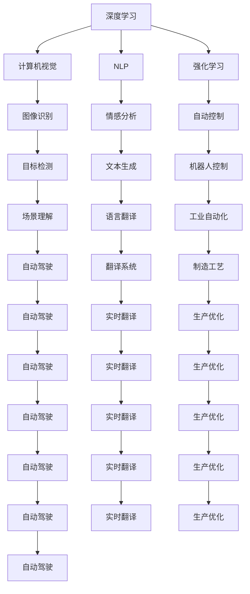
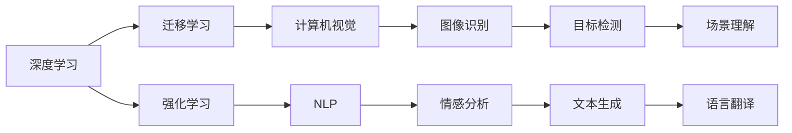
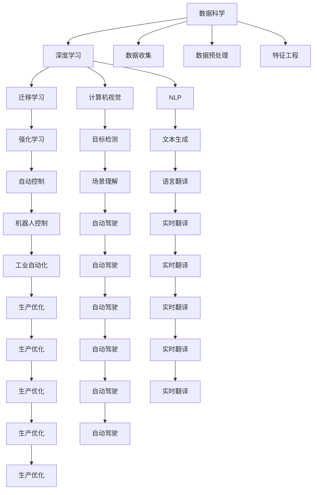

                 

# AI发展的三大核心力量

> 关键词：人工智能, 数据科学, 深度学习, 计算机视觉, 自然语言处理

## 1. 背景介绍

### 1.1 问题由来
人工智能(Artificial Intelligence, AI)作为21世纪最具颠覆性的技术之一，正深刻影响着各行各业的发展。从自动驾驶、工业自动化，到医疗诊断、金融风控，AI技术的应用无处不在。然而，AI技术的快速发展也带来了诸多挑战，如数据质量、模型复杂度、计算资源等。本文将从数据、算法和计算三大核心力量，探讨如何克服这些挑战，推动AI技术的不断进步。

### 1.2 问题核心关键点
AI发展的三大核心力量包括：

- 数据：高质量、多样性、海量化的数据是大模型训练和优化的基础。
- 算法：深度学习、迁移学习、强化学习等算法是大模型表现优异的动力。
- 计算：高性能的计算资源和高效的计算图是大模型快速训练和推理的保障。

这些核心力量之间相互依存、相互促进，共同推动了AI技术的不断突破。本文将详细探讨这三大力量，分析它们在AI技术发展中的作用和影响，并给出相关建议和展望。

### 1.3 问题研究意义
研究AI发展的三大核心力量，对于理解AI技术的本质和潜力，指导AI技术的工程实践，具有重要意义：

1. 降低AI应用的成本。通过合理利用数据、算法和计算资源，可以显著降低AI技术的开发和部署成本。
2. 提升AI模型的性能。高质量的数据、先进的算法和高效的计算，共同作用于模型的训练和推理，能够提升模型的效果。
3. 加速AI技术的产业化。三大核心力量协同作用，使得AI技术能够快速应用于各行各业，推动产业数字化转型。
4. 赋能AI创新研究。在数据、算法和计算上不断突破，能够促进AI技术的更多创新和应用，推动AI领域的前沿研究。
5. 确保AI技术的可信性。通过合理的数据处理和算法设计，可以有效减少AI模型的偏差和误判，保障技术的可信性。

## 2. 核心概念与联系

### 2.1 核心概念概述

为更好地理解AI发展的三大核心力量，本节将介绍几个密切相关的核心概念：

- 深度学习(Deep Learning)：基于神经网络的机器学习方法，能够自动学习并提取数据中的复杂特征，广泛应用于图像、语音、文本等领域的任务。
- 迁移学习(Transfer Learning)：将一个领域学习到的知识，迁移到另一个不同但相关的领域，减少在新任务上从头训练的需求。
- 强化学习(Reinforcement Learning)：通过与环境的互动，学习最优的决策策略，广泛应用于游戏、自动控制、机器人等领域。
- 计算机视觉(Computer Vision)：使计算机能够“看”和理解图像和视频内容的技术，主要应用在图像识别、物体检测、场景理解等方面。
- 自然语言处理(Natural Language Processing, NLP)：使计算机能够理解和生成人类语言的技术，主要应用在机器翻译、情感分析、文本生成等方面。

这些核心概念之间的逻辑关系可以通过以下Mermaid流程图来展示：



这个流程图展示了大语言模型微调过程中各个核心概念的关系：

1. 深度学习提供了自动提取特征的强大能力，是大模型训练和优化的基础。
2. 迁移学习使得模型能够在不同任务间迁移知识，提高学习效率。
3. 强化学习用于优化模型决策策略，特别适用于需要动态调整的任务。
4. 计算机视觉和自然语言处理是大模型在视觉和文本领域的重要应用。
5. 三大核心力量之间相互配合，共同推动了AI技术在多个领域的广泛应用。

### 2.2 概念间的关系

这些核心概念之间存在着紧密的联系，形成了AI技术的完整生态系统。下面我通过几个Mermaid流程图来展示这些概念之间的关系。

#### 2.2.1 AI的通用框架



这个流程图展示了AI技术的通用框架，包括深度学习、迁移学习和强化学习，以及它们在计算机视觉和自然语言处理中的应用。

#### 2.2.2 AI应用范式



这个流程图展示了AI技术在不同应用领域的范式，包括数据科学和深度学习、迁移学习、强化学习，以及它们在计算机视觉和自然语言处理中的应用。

### 2.3 核心概念的整体架构

最后，我们用一个综合的流程图来展示这些核心概念在大语言模型微调过程中的整体架构：

```mermaid
graph TB
    A[大规模数据] --> B[数据科学]
    B --> C[深度学习]
    C --> D[迁移学习]
    C --> E[强化学习]
    C --> F[计算机视觉]
    C --> G[NLP]
    A --> H[数据收集]
    A --> I[数据预处理]
    A --> J[特征工程]
    F --> K[图像识别]
    G --> L[情感分析]
    D --> M[自动控制]
    E --> N[机器人控制]
    K --> O[场景理解]
    L --> P[文本生成]
    M --> Q[工业自动化]
    N --> R[自动驾驶]
    O --> S[实时翻译]
    P --> T[生产优化]
    Q --> U[生产优化]
    R --> V[自动驾驶]
    S --> W[实时翻译]
    T --> X[自动驾驶]
    U --> Y[生产优化]
    V --> Z[自动驾驶]
    W --> AA[实时翻译]
    X --> AB[自动驾驶]
    Y --> AC[生产优化]
    Z --> AD[自动驾驶]
    AA --> AE[实时翻译]
    AB --> AF[自动驾驶]
    AC --> AG[工业自动化]
    AE --> AH[生产优化]
    AG --> AI[制造工艺]
    AH --> AJ[生产优化]
    AI --> AK[生产优化]
    AJ --> AL[生产优化]
    AK --> AM[生产优化]
    AL --> AN[生产优化]
    AM --> AO[生产优化]
    AN --> AP[生产优化]
    AO --> AQ[生产优化]
    AP --> AR[生产优化]
    AQ --> AS[生产优化]
    AR --> AT[生产优化]
    AS --> AU[生产优化]
    AT --> AV[生产优化]
    AU --> AW[生产优化]
    AV --> AX[生产优化]
    AW --> AY[生产优化]
    AX --> AZ[生产优化]
    AY --> BA[生产优化]
    AZ --> BB[生产优化]
    BA --> BC[生产优化]
    BB --> BD[生产优化]
    BC --> BE[生产优化]
    BD --> BF[生产优化]
    BE --> BG[生产优化]
    BF --> BH[生产优化]
    BG --> BI[生产优化]
    BH --> BJ[生产优化]
    BI --> BK[生产优化]
    BJ --> BL[生产优化]
    BK --> BM[生产优化]
    BL --> BN[生产优化]
    BM --> BO[生产优化]
    BN --> BP[生产优化]
    BO --> BQ[生产优化]
    BP --> BR[生产优化]
    BQ --> BS[生产优化]
    BR --> BT[生产优化]
    BS --> BU[生产优化]
    BT --> BV[生产优化]
    BU --> BW[生产优化]
    BV --> BX[生产优化]
    BW --> BY[生产优化]
    BX --> BZ[生产优化]
    BY --> CA[生产优化]
    BZ --> CB[生产优化]
    CA --> CC[生产优化]
    CB --> CD[生产优化]
    CC --> CE[生产优化]
    CD --> CF[生产优化]
    CE --> CG[生产优化]
    CF --> CH[生产优化]
    CG --> CI[生产优化]
    CH --> CJ[生产优化]
    CI --> CK[生产优化]
    CJ --> CL[生产优化]
    CK --> CM[生产优化]
    CL --> CN[生产优化]
    CM --> CO[生产优化]
    CN --> CP[生产优化]
    CO --> CQ[生产优化]
    CP --> CR[生产优化]
    CQ --> CS[生产优化]
    CR --> CT[生产优化]
    CS --> CU[生产优化]
    CT --> CV[生产优化]
    CU --> CW[生产优化]
    CV --> CX[生产优化]
    CW --> CY[生产优化]
    CX --> CZ[生产优化]
    CY --> DA[生产优化]
    CZ --> DB[生产优化]
    DA --> DC[生产优化]
    DB --> DD[生产优化]
    DC --> DE[生产优化]
    DD --> DF[生产优化]
    DE --> DG[生产优化]
    DF --> DH[生产优化]
    DG --> DI[生产优化]
    DH --> DJ[生产优化]
    DI --> DK[生产优化]
    DJ --> DL[生产优化]
    DK --> DM[生产优化]
    DL --> DN[生产优化]
    DM --> DO[生产优化]
    DN --> DP[生产优化]
    DO --> DQ[生产优化]
    DP --> DR[生产优化]
    DQ --> DS[生产优化]
    DR --> DT[生产优化]
    DS --> DU[生产优化]
    DT --> DV[生产优化]
    DU --> DW[生产优化]
    DV --> DX[生产优化]
    DW --> DY[生产优化]
    DX --> DZ[生产优化]
    DY --> EA[生产优化]
    DZ --> EB[生产优化]
    EA --> EC[生产优化]
    EB --> ED[生产优化]
    EC --> EE[生产优化]
    ED --> EF[生产优化]
    EE --> EG[生产优化]
    EF --> EH[生产优化]
    EG --> EI[生产优化]
    EH --> EJ[生产优化]
    EI --> EK[生产优化]
    EJ --> EL[生产优化]
    EK --> EM[生产优化]
    EL --> EN[生产优化]
    EM -->EO[生产优化]
    EN --> EP[生产优化]
    EO --> EQ[生产优化]
    EP --> ER[生产优化]
    EQ --> ES[生产优化]
    ER --> ET[生产优化]
    ES --> EU[生产优化]
    ET --> EV[生产优化]
    EU --> EW[生产优化]
    EV --> EX[生产优化]
    EW --> EY[生产优化]
    EX --> EZ[生产优化]
    EY --> FA[生产优化]
    EZ --> FB[生产优化]
    FA --> FC[生产优化]
    FB --> FD[生产优化]
    FC --> FE[生产优化]
    FD --> FF[生产优化]
    FE --> FG[生产优化]
    FF --> FH[生产优化]
    FG --> FI[生产优化]
    FH --> FJ[生产优化]
    FI --> FK[生产优化]
    FJ --> FL[生产优化]
    FK --> FM[生产优化]
    FL --> FN[生产优化]
    FM --> FO[生产优化]
    FN --> FP[生产优化]
    FO --> FQ[生产优化]
    FP --> FR[生产优化]
    FQ --> FS[生产优化]
    FR --> FT[生产优化]
    FS --> FU[生产优化]
    FT --> FV[生产优化]
    FU --> FW[生产优化]
    FV --> FX[生产优化]
    FW --> FY[生产优化]
    FX --> FZ[生产优化]
    FY --> GA[生产优化]
    FZ --> GB[生产优化]
    GA --> GC[生产优化]
    GB --> GD[生产优化]
    GC --> GE[生产优化]
    GD --> GF[生产优化]
    GE --> GG[生产优化]
    GF --> GH[生产优化]
    GG --> GI[生产优化]
    GH --> GJ[生产优化]
    GI --> GK[生产优化]
    GJ --> GL[生产优化]
    GK --> GM[生产优化]
    GL --> GN[生产优化]
    GM --> GO[生产优化]
    GN --> GP[生产优化]
    GO --> GQ[生产优化]
    GP --> GR[生产优化]
    GQ --> GS[生产优化]
    GR --> GT[生产优化]
    GS --> GU[生产优化]
    GT --> GV[生产优化]
    GU --> GW[生产优化]
    GV --> GX[生产优化]
    GW --> GY[生产优化]
    GX --> GZ[生产优化]
    GY --> HA[生产优化]
    GZ --> HB[生产优化]
    HA --> HC[生产优化]
    HB --> HD[生产优化]
    HC --> HE[生产优化]
    HD --> HF[生产优化]
    HE --> HG[生产优化]
    HF --> HH[生产优化]
    HG --> HI[生产优化]
    HH --> HJ[生产优化]
    HI --> HK[生产优化]
    HJ --> HL[生产优化]
    HK --> HM[生产优化]
    HL --> HN[生产优化]
    HM --> HO[生产优化]
    HN --> HP[生产优化]
    HO --> HQ[生产优化]
    HP --> HR[生产优化]
    HQ --> HS[生产优化]
    HR --> HT[生产优化]
    HS --> HU[生产优化]
    HT --> HV[生产优化]
    HU --> HW[生产优化]
    HV --> HX[生产优化]
    HW --> HY[生产优化]
    HX --> HZ[生产优化]
    HY --> IA[生产优化]
    HZ --> IB[生产优化]
    IA --> IC[生产优化]
    IB --> ID[生产优化]
    IC --> IE[生产优化]
    ID --> IF[生产优化]
    IE --> IG[生产优化]
    IF --> IH[生产优化]
    IG --> II[生产优化]
    IH --> IJ[生产优化]
    II --> IK[生产优化]
    IJ --> IL[生产优化]
    IK --> IM[生产优化]
    IL --> IN[生产优化]
    IM --> IO[生产优化]
    IN --> IP[生产优化]
    IO --> IQ[生产优化]
    IP --> IR[生产优化]
    IQ --> IS[生产优化]
    IR --> IT[生产优化]
    IS --> IU[生产优化]
    IT --> IV[生产优化]
    IU --> IW[生产优化]
    IV --> IX[生产优化]
    IW --> IY[生产优化]
    IX --> IZ[生产优化]
    IY --> JA[生产优化]
    IZ --> JB[生产优化]
    JA --> JC[生产优化]
    JB --> JD[生产优化]
    JC --> JE[生产优化]
    JD --> JF[生产优化]
    JE --> JG[生产优化]
    JF --> JH[生产优化]
    JG --> JI[生产优化]
    JH --> JJ[生产优化]
    JI --> JK[生产优化]
    JJ --> JL[生产优化]
    JK --> JM[生产优化]
    JL --> JN[生产优化]
    JM --> JO[生产优化]
    JN --> JP[生产优化]
    JO --> JQ[生产优化]
    JP --> JR[生产优化]
    JQ --> JS[生产优化]
    JR --> JT[生产优化]
    JS --> JU[生产优化]
    JT --> JV[生产优化]
    JU --> JW[生产优化]
    JV --> JX[生产优化]
    JW --> JY[生产优化]
    JX --> JZ[生产优化]
    JY --> KA[生产优化]
    JZ --> KB[生产优化]
    KA --> KC[生产优化]
    KB --> KD[生产优化]
    KC --> KE[生产优化]
    KD --> KF[生产优化]
    KE --> KG[生产优化]
    KF --> KH[生产优化]
    KG --> KI[生产优化]
    KH --> KJ[生产优化]
    KI --> KK[生产优化]
    KJ --> KL[生产优化]
    KK --> KM[生产优化]
    KL --> KN[生产优化]
    KM --> KO[生产优化]
    KN --> KP[生产优化]
    KO --> KQ[生产优化]
    KP --> KR[生产优化]
    KQ --> KS[生产优化]
    KR --> KT[生产优化]
    KS --> KU[生产优化]
    KT --> KV[生产优化]
    KU --> KW[生产优化]
    KV --> KX[生产优化]
    KW --> KY[生产优化]
    KX --> KZ[生产优化]
    KY --> LA[生产优化]
    KZ --> LB[生产优化]
    LA --> LC[生产优化]
    LB --> LD[生产优化]
    LC --> LE[生产优化]
    LD --> LF[生产优化]
    LE --> LG[生产优化]
    LF --> LH[生产优化]
    LG --> LI[生产优化]
    LH --> LJ[生产优化]
    LI --> LK[生产优化]
    LJ --> LL[生产优化]
    LK --> LM[生产优化]
    LL --> LN[生产优化]
    LM --> LO[生产优化]
    LN --> LP[生产优化]
    LO --> LQ[生产优化]
    LP --> LR[生产优化]
    LQ --> LS[生产优化]
    LR --> LT[生产优化]
    LS --> LU[生产优化]
    LT --> LV[生产优化]
    LU --> LW[生产优化]
    LV --> LX[生产优化]
    LW --> LY[生产优化]
    LX --> LZ[生产优化]
    LY --> MA[生产优化]
    LZ --> MB[生产优化]
    MA --> MC[生产优化]
    MB --> MD[生产优化]
    MC --> ME[生产优化]
    MD --> MF[生产优化]
    ME --> MG[生产优化]
    MF --> MH[生产优化]
    MG --> MI[生产优化]
    MH --> MJ[生产优化]
    MI --> MK[生产优化]
    MJ --> ML[生产优化]
    MK --> MO[生产优化]
    ML --> MP[生产优化]
    MO --> MQ[生产优化]
    MP --> MR[生产优化]
    MQ --> MS[生产优化]
    MR --> MT[生产优化]
    MS --> MU[生产优化]
    MT --> MV[生产优化]
    MU --> MW[生产优化]
    MV --> MX[生产优化]
    MW --> MY[生产优化]
    MX --> MZ[生产优化]
    MY --> NA[生产优化]
    MZ --> NB[生产优化]
    NA --> NC[生产优化]
    NB --> ND[生产优化]
    NC --> NE[生产优化]
    ND --> NF[生产优化]
    NE --> NG[生产优化]
    NF --> NH[生产优化]
    NG --> NI[生产优化]
    NH --> NJ[生产优化]
    NI --> NK[生产优化]
    NJ --> NL[生产优化]
    NK --> NM[生产优化]
    NL --> NN[生产优化]
    NM --> NO[生产优化]
    NN --> NP[生产优化]
    NO --> NQ[生产优化]
    NP --> NR[生产优化]
    NQ --> NS[生产优化]
    NR --> NT[生产优化]
    NS --> NU[生产优化]
    NT --> NV[生产优化]
    NU --> NW[生产优化]
    NV --> NX[生产优化]
    NW --> NY[生产优化]
    NX --> NZ[生产优化]
    NY --> OA[生产优化]
    NZ --> OB[生产优化]
    OA --> OC[生产优化]
    OB --> OD[生产优化]
    OC --> OE[生产优化]
    OD --> OF[生产优化]
    OE --> OG[生产优化]
    OF --> OH[生产优化]
    OG --> OI[生产优化]
    OH --> OJ[生产优化]
    OI --> OK[生产优化]
    OJ --> OL[生产优化]
    OK --> OM[生产优化]
    OL --> ON[生产优化]
    OM --> OP[生产优化]
    ON --> OQ[生产优化]
    OP --> OR[生产优化]
    OQ --> OS[生产优化]
    OR --> OT[生产优化]
    OS --> OU[生产优化]
    OT -->OV[生产优化]
    OU --> OW[生产优化]
    OV --> OX[生产优化]
    OW --> OY[生产优化]
    OX --> OZ[生产优化]
    OY --> PA[生产优化]
    OZ --> PB[生产优化]
    PA --> PC[生产优化]
    PB --> PD[生产优化]
    PC --> PE[生产优化]
    PD --> PF[生产优化]
    PE --> PG[生产优化]
    PF --> PH[生产优化]
    PG --> PI[生产优化]
    PH --> PJ[生产优化]
    PI --> PK[生产优化]
    PJ --> PL[生产优化]
    PK --> PM[生产优化]
    PL --> PN[生产优化]
    PM --> PO[生产优化]
    PN --> PP[生产优化]
    PO --> PQ[生产优化]
    PP --> PR[生产优化]
    PQ --> PS[生产优化]
    PR --> PT[生产优化]
    PS --> PU[生产优化]
    PT --> PV[生产优化]
    PU --> PW[生产优化]
    PV --> PX[生产优化]
    PW --> PY[生产优化]
    PX --> PZ[生产优化]
    PY --> QA[生产优化]
    PZ --> QB[生产优化]
    QA --> QC[生产优化]
    QB --> QD[生产优化]
    QC --> QE[生产优化]
    QD --> QF[生产优化]
    QE --> QG[生产优化]
    QF --> QH[生产优化]
    QG --> QI[生产优化]
    QH --> QJ[生产优化]
    QI --> QK[生产优化]
    QJ --> QL[生产优化]
    QK --> QM[生产优化]
    QL --> QN[生产优化]
    QM --> QO[生产优化]
    QN --> QP[生产优化]
    QO --> QQ[生产优化]
    QP --> QR[生产优化]
    QQ --> QS[生产优化]
    QR --> QT[生产优化]
    QS --> QU[生产优化]
    QT --> QV[生产优化]
    QU --> QW[生产优化]
    QV --> QX[生产优化]
    QW --> QY[生产优化]
    QX --> QZ[生产优化]
    QY --> RA[生产优化]
    QZ --> RB[生产优化]
    RA --> RC[生产优化]
    RB --> RD[生产优化]
    RC --> RE[生产优化]
    RD --> RF[生产优化]
    RE --> RG[生产优化]
    RF --> RH[生产优化]
    RG --> RI[生产优化]
    RH --> RJ[生产优化]
    RI --> RK[生产优化]
    RJ --> RL[生产优化]
    RK --> RM[生产优化]
    RL --> RN[生产优化]
    RM --> RO[生产优化]
    RN --> RP[生产优化]
    RO --> RQ[生产优化]
    RP --> RR[生产优化]
    RQ --> RS[生产优化]
    RR --> RT[生产优化]
    RS --> RU[生产优化]
    RT --> RV[生产优化]
    RU --> RW[生产优化]
    RV --> RX[生产优化]
    RW --> RY[生产优化]
    RX --> RZ[生产优化]
    RY --> SA[生产优化]
    RZ --> SB[生产优化]
    SA --> SC[生产优化]
    SB --> SD[生产优化]
    SC --> SE[生产优化]
    SD --> SF[生产优化]
    SE --> SG[生产优化]
    SF --> SH[生产优化]
    SG --> SI[生产优化]
    SH --> SJ[生产优化]
    SI --> SK[生产优化]


