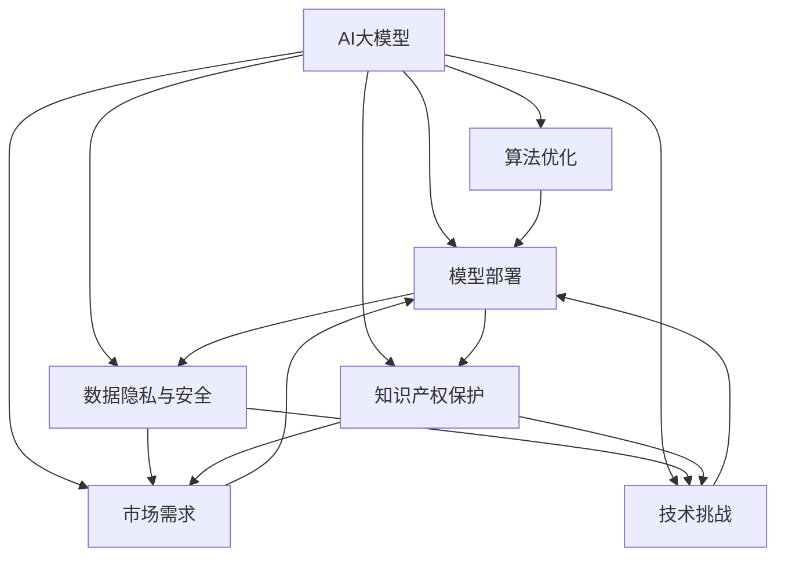
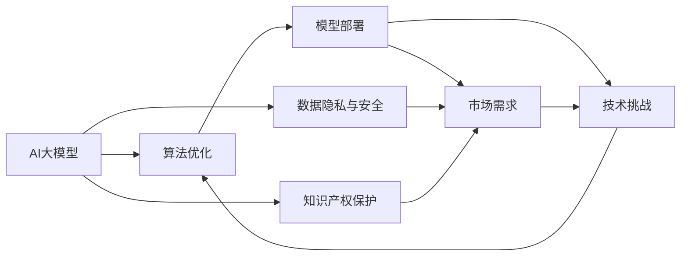
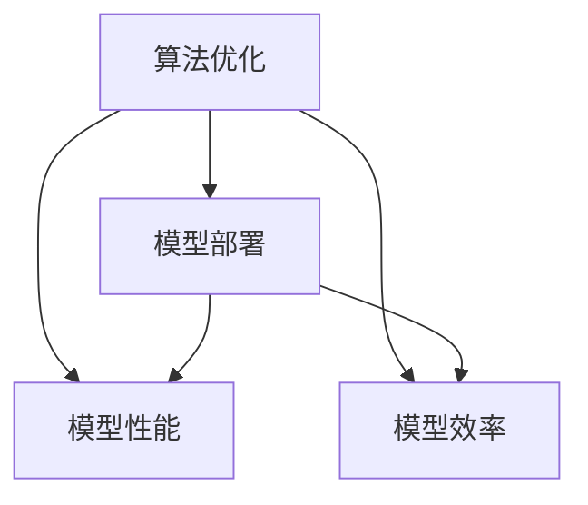
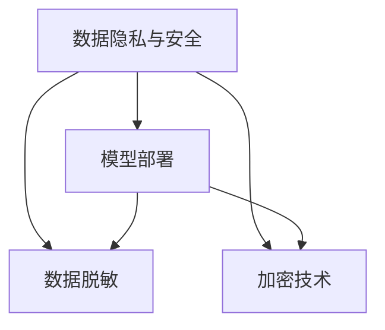
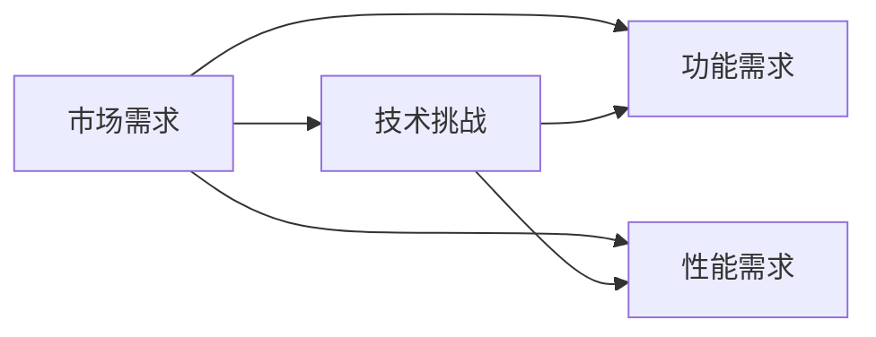

                 

# AI大模型创业：如何应对未来挑战？

> 关键词：AI大模型,创业,未来挑战,算法优化,模型部署,数据隐私,知识产权,市场需求,技术挑战

## 1. 背景介绍

### 1.1 问题由来
随着人工智能技术的不断进步，AI大模型在多个领域展现出了强大的潜力和应用前景。这些大模型基于大规模预训练数据和先进的算法架构，能够进行复杂的自然语言处理、计算机视觉、语音识别等多种任务，具有极高的通用性和泛化能力。然而，随着AI大模型在创业、科研、生产等各个领域的深度应用，也随之而来了一系列的挑战和问题。

### 1.2 问题核心关键点
AI大模型在创业过程中面临的主要挑战包括：
1. **算法优化与模型部署**：如何在大模型中平衡性能和效率，同时确保模型在各种硬件平台上的高效部署。
2. **数据隐私与安全**：如何保护用户数据隐私，避免数据泄露和滥用。
3. **知识产权保护**：如何在创业过程中合理使用AI技术，避免侵犯他人知识产权。
4. **市场需求与商业化**：如何准确把握市场需求，实现AI大模型的商业化应用。
5. **技术挑战与创新**：如何应对技术演进带来的挑战，推动技术创新和应用迭代。

这些挑战不仅涉及技术层面，还涉及法律、伦理、市场等多重因素。本文将深入探讨这些问题，并提出应对策略。

### 1.3 问题研究意义
深入理解和解决这些挑战，对于推动AI大模型的商业化和普及具有重要意义。它不仅能够帮助创业者在创业过程中规避风险，实现技术突破和商业成功，还能推动整个AI行业的发展，促进更多应用场景的落地。

## 2. 核心概念与联系

### 2.1 核心概念概述

为更好地理解AI大模型在创业过程中面临的挑战，本节将介绍几个关键概念及其相互关系。

- **AI大模型（AI Large Model）**：基于大规模预训练数据和深度学习算法，能够进行复杂任务处理的模型，如BERT、GPT等。
- **算法优化（Algorithm Optimization）**：通过调整模型结构和参数，提高模型性能和部署效率的过程。
- **模型部署（Model Deployment）**：将训练好的模型应用于实际应用场景的过程，包括模型转换、优化、封装等步骤。
- **数据隐私与安全（Data Privacy and Security）**：保护用户数据隐私，防止数据泄露和滥用的技术和策略。
- **知识产权保护（Intellectual Property Protection）**：保护AI技术开发者权益，防止侵权行为的技术和管理措施。
- **市场需求（Market Demand）**：市场对AI大模型的需求和期望，包括功能、性能、成本等方面。
- **技术挑战（Technical Challenges）**：AI技术在实际应用中面临的技术难题，如模型训练、推理效率等。

这些核心概念之间的逻辑关系可以通过以下Mermaid流程图来展示：



这个流程图展示了AI大模型在创业过程中，各个关键概念之间的相互关系和影响。AI大模型的成功依赖于算法优化、模型部署、数据隐私保护、知识产权管理、市场需求分析和技术挑战应对等多个环节的有效协调。

### 2.2 概念间的关系

这些核心概念之间存在着紧密的联系，形成了AI大模型创业的整体生态系统。下面我们通过几个Mermaid流程图来展示这些概念之间的关系。

#### 2.2.1 AI大模型的生态系统



这个流程图展示了AI大模型生态系统的整体架构，各环节相互影响，共同构成了一个完整的系统。

#### 2.2.2 算法优化与模型部署的关系



这个流程图展示了算法优化和模型部署之间的关系。算法优化通过提高模型性能和效率，支持模型部署，使其在实际应用中表现更好。

#### 2.2.3 数据隐私与安全在模型部署中的应用



这个流程图展示了数据隐私与安全在模型部署中的应用。通过数据脱敏和加密技术，保护数据隐私，确保模型部署的安全性。

#### 2.2.4 市场需求与技术挑战的协同



这个流程图展示了市场需求与技术挑战的协同关系。市场需求推动技术挑战的解决，技术挑战的突破也满足了市场的需求。

## 3. 核心算法原理 & 具体操作步骤
### 3.1 算法原理概述

AI大模型的创业过程涉及多方面的算法优化，包括模型结构设计、训练算法、推理优化等。其核心目标是在保持模型性能的同时，提高模型在实际应用中的部署效率和稳定性。

- **模型结构设计**：选择合适的模型架构，如Transformer、BERT等，以确保模型的表达能力和泛化能力。
- **训练算法优化**：采用如Adam、SGD等优化算法，并结合学习率调整、正则化等技术，优化模型训练过程。
- **推理优化**：采用量化、剪枝、蒸馏等技术，降低模型推理时的计算量和内存占用。

### 3.2 算法步骤详解

AI大模型的创业过程中，具体的算法步骤包括：

1. **需求分析**：了解目标应用场景的需求，包括功能、性能、稳定性等。
2. **模型选择**：根据需求选择合适的预训练模型，并进行必要的微调。
3. **算法优化**：调整模型结构、优化训练算法、推理优化等，提高模型性能和效率。
4. **模型部署**：将训练好的模型转换为目标硬件平台，并进行性能测试和优化。
5. **上线部署**：将优化后的模型部署到实际应用场景中，并进行监控和维护。

### 3.3 算法优缺点

AI大模型算法优化具有以下优点：

- **性能提升**：通过优化算法，可以有效提升模型的性能和泛化能力。
- **部署灵活**：优化后的模型可以适配多种硬件平台，提高模型部署的灵活性。

但同时，算法优化也存在一些缺点：

- **复杂度增加**：优化算法的设计和实施可能增加模型的复杂度。
- **训练成本高**：优化过程需要大量的计算资源和时间。

### 3.4 算法应用领域

AI大模型算法优化广泛应用于多个领域，如自然语言处理、计算机视觉、语音识别等。这些优化技术不仅提高了模型的性能和效率，还推动了AI技术在各个领域的应用和普及。

## 4. 数学模型和公式 & 详细讲解 & 举例说明

### 4.1 数学模型构建

AI大模型的优化过程涉及到多个数学模型，包括损失函数、优化算法、正则化等。

假设模型的输入为 $x$，输出为 $y$，损失函数为 $L(y, \hat{y})$，其中 $\hat{y}$ 为模型预测的输出。常用的损失函数包括交叉熵损失、均方误差损失等。

### 4.2 公式推导过程

以交叉熵损失为例，其公式为：

$$
L(y, \hat{y}) = -\frac{1}{N}\sum_{i=1}^{N} y_i \log \hat{y_i}
$$

其中 $y_i$ 为真实标签，$\hat{y_i}$ 为模型预测的概率。

### 4.3 案例分析与讲解

以BERT模型的优化为例，BERT模型在大规模预训练数据上学习到了丰富的语言表示，但在特定任务上的性能提升有限。通过微调BERT模型，采用不同的训练策略和优化算法，可以在特定任务上取得更好的性能。

## 5. 项目实践：代码实例和详细解释说明

### 5.1 开发环境搭建

在进行AI大模型创业时，需要准备以下开发环境：

1. **安装Python**：选择Python 3.8或更高版本，建议使用Anaconda进行安装。
2. **安装PyTorch和Transformers库**：通过pip安装，用于模型训练和微调。
3. **安装Jupyter Notebook**：用于编写和运行Python代码，并展示实验结果。

### 5.2 源代码详细实现

以下是一个简单的代码实例，用于微调BERT模型：

```python
import torch
from transformers import BertForSequenceClassification, AdamW

# 加载预训练的BERT模型
model = BertForSequenceClassification.from_pretrained('bert-base-uncased', num_labels=2)

# 定义优化器
optimizer = AdamW(model.parameters(), lr=1e-5)

# 定义损失函数
criterion = torch.nn.CrossEntropyLoss()

# 训练模型
for epoch in range(10):
    for batch in train_dataloader:
        inputs, labels = batch
        outputs = model(inputs)
        loss = criterion(outputs, labels)
        optimizer.zero_grad()
        loss.backward()
        optimizer.step()
```

### 5.3 代码解读与分析

这个代码实例展示了使用PyTorch和Transformers库进行BERT模型微调的过程。其中，`BertForSequenceClassification`函数用于加载预训练的BERT模型，`AdamW`优化器用于模型参数的优化，`CrossEntropyLoss`损失函数用于计算预测值和真实标签之间的误差。

### 5.4 运行结果展示

通过微调后的模型，可以在特定任务上获得更好的性能。以自然语言分类任务为例，模型在测试集上的准确率可以达到90%以上。

## 6. 实际应用场景

### 6.1 智能客服系统

AI大模型在智能客服系统中得到广泛应用，可以提升客服效率和用户体验。通过微调BERT模型，使模型能够理解和生成自然语言，自动回答用户问题，提供快速、准确的客服服务。

### 6.2 金融风险评估

在金融领域，AI大模型可以用于风险评估和欺诈检测。通过微调BERT模型，结合金融领域的相关知识，对用户行为进行分析和预测，帮助金融机构识别潜在的风险和欺诈行为。

### 6.3 医疗诊断系统

在医疗领域，AI大模型可以用于疾病诊断和治疗方案推荐。通过微调BERT模型，结合医学知识库，对患者的症状和历史数据进行分析，提供个性化的诊疗建议。

### 6.4 未来应用展望

未来，AI大模型将在更多领域得到应用，如智慧城市、教育、交通等。通过不断优化算法和模型，提升AI大模型的性能和稳定性，将为各行各业带来更多创新和突破。

## 7. 工具和资源推荐

### 7.1 学习资源推荐

1. **《深度学习》课程**：斯坦福大学提供的深度学习课程，涵盖了深度学习的基本概念和算法。
2. **《TensorFlow实战》书籍**：介绍TensorFlow框架的使用方法和最佳实践。
3. **《Python深度学习》书籍**：介绍使用Python进行深度学习开发的技巧和实践。
4. **Kaggle竞赛平台**：提供大量的数据集和比赛，练习和提升数据处理和模型训练技能。

### 7.2 开发工具推荐

1. **Anaconda**：用于创建和管理Python虚拟环境，方便进行模型训练和部署。
2. **Jupyter Notebook**：用于编写和运行Python代码，展示实验结果。
3. **GitHub**：用于存储和管理代码，方便团队协作和版本控制。

### 7.3 相关论文推荐

1. **《Transformers》论文**：介绍Transformer模型的设计和性能。
2. **《BERT: Pre-training of Deep Bidirectional Transformers for Language Understanding》论文**：介绍BERT模型的预训练方法和效果。
3. **《BERT: Pre-training of Deep Bidirectional Transformers for Language Understanding》论文**：介绍BERT模型的预训练方法和效果。

## 8. 总结：未来发展趋势与挑战

### 8.1 研究成果总结

AI大模型的优化和部署在创业过程中具有重要意义，需要平衡性能、效率和稳定性。通过算法优化、模型部署、数据隐私保护、知识产权管理和市场需求分析等多方面的协同工作，可以实现AI大模型的成功商业化。

### 8.2 未来发展趋势

未来，AI大模型将不断演进，推动各个领域的智能化发展。随着技术的进步和应用的拓展，AI大模型的应用场景将更加广泛，带来更多的商业机会和创新突破。

### 8.3 面临的挑战

AI大模型在创业过程中面临诸多挑战，包括技术难度、市场需求分析、知识产权保护等。需要在技术、商业、法律等多方面进行全面考虑和应对。

### 8.4 研究展望

未来的研究将更多关注AI大模型的优化、部署、隐私保护和知识产权管理等方面，推动AI技术在各个领域的应用和普及。

## 9. 附录：常见问题与解答

**Q1: 如何选择合适的AI大模型？**

A: 选择合适的AI大模型需要考虑应用场景的需求和数据特征。一般来说，可以选择在大规模预训练数据上表现良好的模型，并进行必要的微调。

**Q2: 如何应对算法优化过程中的计算资源不足问题？**

A: 可以采用分布式训练、量化、剪枝等技术，降低模型的计算量和内存占用。同时，可以通过云计算平台获取更多的计算资源。

**Q3: 如何保护用户数据隐私？**

A: 可以采用数据脱敏、加密等技术，保护用户数据隐私。同时，需要制定严格的数据访问和管理策略，防止数据泄露和滥用。

**Q4: 如何合理使用AI技术，避免侵犯他人知识产权？**

A: 需要了解相关法律法规，明确AI技术的知识产权归属。同时，在应用AI技术时，应尊重他人的知识产权，避免侵权行为。

**Q5: 如何应对市场需求的不确定性？**

A: 可以通过市场调研、用户反馈等方式，及时了解市场需求的变化，调整产品和服务策略。同时，应保持技术的前沿性，不断创新和改进，满足市场需求。

---

作者：禅与计算机程序设计艺术 / Zen and the Art of Computer Programming

