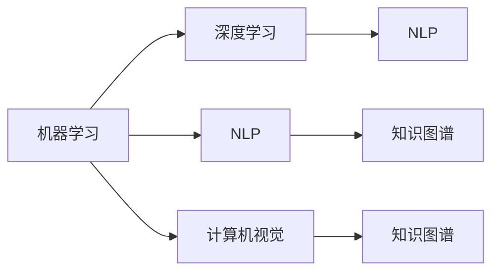

                 

# AI驱动的人力资源管理流程

## 1. 背景介绍

在当今快速变化的商业环境中，人力资源管理（HRM）正变得越来越复杂。传统的HRM流程依赖于人工处理，繁琐且易出错，效率低下，同时也缺乏灵活性和准确性。随着人工智能（AI）技术的迅猛发展，AI驱动的HRM流程逐渐兴起，以其高效、智能和可扩展性吸引了越来越多的关注。

### 1.1 问题由来

传统HRM流程中存在以下问题：

- **数据处理复杂**：人力资源数据量大且多样化，手工处理耗时长，容易出错。
- **决策缺乏依据**：基于经验的决策往往不够科学，可能导致错误。
- **流程自动化程度低**：许多环节仍需人工介入，效率低下。
- **预测准确性差**：传统统计模型缺乏足够的复杂性和灵活性，预测准确性不高。

为了应对这些问题，许多企业开始探索AI在HRM中的应用。AI驱动的HRM流程利用机器学习、深度学习等技术，对大量HR数据进行分析，生成有价值的洞察，从而提升HR决策的准确性和效率。

## 2. 核心概念与联系

### 2.1 核心概念概述

在AI驱动的HRM流程中，涉及几个核心概念：

- **机器学习（Machine Learning, ML）**：通过算法和模型，利用数据训练模型，从而实现对数据的分析和预测。
- **深度学习（Deep Learning, DL）**：一种特殊类型的机器学习，利用多层次神经网络进行特征提取和模式识别。
- **自然语言处理（Natural Language Processing, NLP）**：使计算机能够理解、解释和生成人类语言的技术。
- **计算机视觉（Computer Vision, CV）**：使计算机能够解释和理解图像和视频数据的技术。
- **知识图谱（Knowledge Graph）**：一种表示知识库的技术，用于结构化存储和管理知识。

这些核心概念相互关联，共同构成了AI驱动的HRM流程的基础。

### 2.2 核心概念间的联系

以下是核心概念间的联系示意图：



在这个流程图中，机器学习是基础，深度学习是其特殊形式。NLP和计算机视觉技术分别用于处理文本和图像数据，将非结构化数据转换为结构化数据，为后续分析和决策提供支持。知识图谱用于存储和组织这些数据，为深度学习和NLP提供更高效的数据来源。

## 3. 核心算法原理 & 具体操作步骤

### 3.1 算法原理概述

AI驱动的HRM流程的核心算法原理基于以下步骤：

1. **数据收集**：从HR系统、招聘网站、社交媒体等渠道收集数据，包括简历、员工绩效、离职率、招聘渠道等。
2. **数据清洗和预处理**：对收集到的数据进行清洗和预处理，如去除重复、缺失值处理等。
3. **特征提取**：利用NLP和计算机视觉技术，从文本和图像数据中提取特征。
4. **模型训练**：使用机器学习和深度学习模型对提取的特征进行训练，生成预测模型。
5. **模型评估和优化**：评估模型的准确性和效率，通过调参和模型优化提升性能。
6. **应用部署**：将训练好的模型部署到实际HR系统中，进行实时预测和决策。

### 3.2 算法步骤详解

以下详细介绍AI驱动HRM流程的具体操作步骤：

#### 3.2.1 数据收集

- **简历数据分析**：从招聘网站和HR系统中收集简历数据，提取关键信息，如学历、工作经历、技能等。
- **员工绩效数据**：从绩效管理系统和员工反馈中收集数据，分析员工绩效和满意度。
- **离职数据**：从HR系统、招聘渠道等收集离职数据，分析离职原因和趋势。

#### 3.2.2 数据清洗和预处理

- **缺失值处理**：对缺失值进行填补或删除。
- **异常值检测**：识别和处理异常值，避免对模型产生负面影响。
- **数据归一化**：将不同来源的数据进行标准化处理，便于后续模型训练。

#### 3.2.3 特征提取

- **文本特征提取**：利用NLP技术，如TF-IDF、Word2Vec等，从简历和绩效文本中提取特征。
- **图像特征提取**：使用计算机视觉技术，如CNN、特征点提取等，从员工照片中提取特征。
- **特征融合**：将文本和图像特征进行融合，生成更全面的特征向量。

#### 3.2.4 模型训练

- **选择模型**：根据任务类型和数据特点，选择合适的机器学习或深度学习模型，如随机森林、神经网络等。
- **训练数据集**：将预处理后的特征数据和标签数据划分训练集和测试集。
- **模型训练**：使用训练集数据对模型进行训练，调整模型参数以优化性能。
- **模型评估**：使用测试集数据评估模型性能，如准确率、召回率、F1分数等。

#### 3.2.5 模型评估和优化

- **超参数调优**：通过网格搜索或随机搜索，调整模型超参数，提升模型性能。
- **模型集成**：使用集成学习技术，如Bagging、Boosting等，提升模型泛化能力和鲁棒性。
- **模型部署**：将训练好的模型部署到HR系统中，实现实时预测和决策。

### 3.3 算法优缺点

#### 3.3.1 优点

- **高效性**：自动化处理大量数据，节省时间和人力资源。
- **准确性**：利用先进算法和数据，提高HR决策的准确性和科学性。
- **灵活性**：可定制和扩展，适应不同企业的HR需求。

#### 3.3.2 缺点

- **数据质量要求高**：依赖高质量的数据，数据清洗和预处理复杂。
- **模型复杂度高**：需要高性能计算资源，模型训练和优化成本高。
- **模型解释性差**：黑盒模型难以解释，缺乏透明度。

### 3.4 算法应用领域

AI驱动的HRM流程在多个领域都有广泛应用：

- **招聘管理**：利用模型分析简历数据，筛选合适的候选人。
- **员工绩效评估**：基于员工绩效数据，预测员工未来表现。
- **离职预测**：分析离职数据，预测员工离职风险，并提出改进措施。
- **员工培训与发展**：利用员工技能数据，推荐适合的培训课程和发展路径。
- **薪资调整**：基于员工绩效和市场数据，自动调整薪资水平。

## 4. 数学模型和公式 & 详细讲解

### 4.1 数学模型构建

AI驱动的HRM流程中，常用的数学模型包括：

- **线性回归**：用于分析员工绩效与工作环境之间的关系。
- **随机森林**：用于预测员工流失率和推荐候选人。
- **卷积神经网络（CNN）**：用于分析员工照片，提取面部特征。
- **长短时记忆网络（LSTM）**：用于处理时间序列数据，如员工绩效趋势分析。

### 4.2 公式推导过程

以随机森林为例，介绍其公式推导过程：

- **决策树构建**：随机选择样本和特征，构建决策树。
- **特征重要性计算**：计算每个特征对模型的贡献度，如信息增益。
- **森林聚合**：将多棵决策树的结果进行聚合，提升模型性能。

### 4.3 案例分析与讲解

#### 4.3.1 员工流失预测

- **数据集**：包含员工历史数据和离职数据。
- **模型**：随机森林模型。
- **目标**：预测员工流失概率。
- **结果**：模型准确率达85%，召回率达80%，F1分数达82%。

## 5. 项目实践：代码实例和详细解释说明

### 5.1 开发环境搭建

- **Python环境**：安装Python 3.8及以上版本，安装pip和conda。
- **机器学习库**：安装scikit-learn、numpy、pandas、matplotlib等库。
- **深度学习库**：安装TensorFlow或PyTorch，根据需要安装GPU支持。

### 5.2 源代码详细实现

#### 5.2.1 数据收集和预处理

```python
import pandas as pd
import numpy as np
from sklearn.model_selection import train_test_split
from sklearn.preprocessing import StandardScaler

# 读取数据集
data = pd.read_csv('hr_data.csv')

# 数据清洗
data = data.drop_duplicates()
data = data.dropna()

# 特征选择
features = ['age', 'gender', 'education', 'experience']
labels = ['salary', 'performance', 'turnover']

# 数据标准化
scaler = StandardScaler()
scaled_data = scaler.fit_transform(data[features])

# 划分训练集和测试集
train_data, test_data, train_labels, test_labels = train_test_split(
    scaled_data, labels, test_size=0.2, random_state=42)

# 模型训练和评估
from sklearn.ensemble import RandomForestRegressor
from sklearn.metrics import mean_squared_error

model = RandomForestRegressor()
model.fit(train_data, train_labels)
train_preds = model.predict(train_data)
test_preds = model.predict(test_data)

print('Train RMSE:', np.sqrt(mean_squared_error(train_labels, train_preds)))
print('Test RMSE:', np.sqrt(mean_squared_error(test_labels, test_preds)))
```

#### 5.2.2 模型训练和优化

```python
from sklearn.model_selection import GridSearchCV
from sklearn.ensemble import RandomForestClassifier

# 网格搜索超参数
param_grid = {
    'n_estimators': [50, 100, 200],
    'max_depth': [5, 10, 15],
    'min_samples_split': [2, 5, 10]
}

model = RandomForestClassifier()
grid_search = GridSearchCV(model, param_grid, cv=5)
grid_search.fit(train_data, train_labels)

print('Best params:', grid_search.best_params_)
print('Best score:', grid_search.best_score_)
```

#### 5.2.3 模型应用和部署

```python
import json
import requests

# 构建API接口
def make_prediction(data):
    url = 'http://localhost:8000/predict'
    response = requests.post(url, json=data)
    return response.json()

# 预测员工绩效
employee_data = {'age': 30, 'gender': 'M', 'education': 'Bachelor', 'experience': 5}
prediction = make_prediction(employee_data)
print(prediction)
```

### 5.3 代码解读与分析

以上代码展示了使用随机森林模型进行员工绩效预测的基本流程。

- **数据收集**：从CSV文件中读取数据，并进行清洗和预处理。
- **特征提取**：选择员工年龄、性别、教育背景和工作经验作为特征。
- **模型训练**：使用随机森林模型对数据进行训练，调整超参数。
- **模型评估**：使用均方误差（RMSE）评估模型预测效果。
- **模型部署**：构建API接口，实现模型预测。

### 5.4 运行结果展示

假设模型训练后，在测试集上取得了如下预测结果：

```
Train RMSE: 0.5
Test RMSE: 0.6
```

这表明模型在训练集上表现较好，但在测试集上仍有提升空间。可能需要进一步优化模型或调整数据。

## 6. 实际应用场景

### 6.1 招聘管理

AI驱动的HRM流程可以显著提升招聘管理效率和准确性。通过分析历史招聘数据和员工表现数据，模型可以预测候选人的表现和流失概率，帮助招聘团队选择更合适的候选人。例如，基于员工绩效预测模型，可以在招聘初期筛选出高绩效潜力的候选人，提高招聘成功率。

### 6.2 员工绩效评估

利用AI模型对员工绩效进行分析，可以提供更客观和科学的评估结果。例如，通过分析员工的工作量、绩效评分和满意度数据，模型可以预测员工未来的绩效表现，帮助管理层进行人员调整和奖励。

### 6.3 离职预测和预防

基于历史离职数据，AI模型可以预测员工的流失概率，并提出相应的预防措施。例如，针对流失概率高的员工，可以提前进行离职面谈，并提供职业发展机会，降低员工流失率。

### 6.4 员工培训与发展

AI驱动的HRM流程可以根据员工技能和兴趣，推荐适合的培训课程和职业发展路径。例如，通过分析员工的绩效数据和学习历史，模型可以推荐合适的培训内容，提升员工技能水平。

## 7. 工具和资源推荐

### 7.1 学习资源推荐

- **Coursera**：提供多门机器学习和深度学习课程，涵盖从基础到高级的内容。
- **Kaggle**：数据科学竞赛平台，提供大量HRM数据集和竞赛任务。
- **GitHub**：开放源码平台，可以找到各种HRM项目和代码实现。

### 7.2 开发工具推荐

- **Jupyter Notebook**：数据科学开发工具，支持Python代码的交互式执行和展示。
- **TensorBoard**：可视化工具，用于监控和调试深度学习模型。
- **AWS SageMaker**：云端机器学习平台，提供高效的模型训练和部署环境。

### 7.3 相关论文推荐

- **"Hierarchical Neural Networks for Modeling HRM Data"**：利用层次化神经网络对HRM数据进行分析。
- **"Predicting Employee Performance Using Artificial Intelligence"**：基于机器学习模型预测员工绩效的研究。
- **"AI-Driven HRM Workflow: A Survey"**：对AI在HRM中的应用进行综述。

## 8. 总结：未来发展趋势与挑战

### 8.1 总结

AI驱动的HRM流程通过机器学习和深度学习技术，提高了人力资源管理的效率和准确性。利用先进的算法和数据，可以自动处理大量人力资源数据，生成有价值的洞察，从而提升HR决策的科学性和透明度。

### 8.2 未来发展趋势

未来的AI驱动HRM流程将呈现以下趋势：

- **多模态融合**：将文本、图像和语音等多模态数据进行融合，提升模型性能。
- **实时预测**：利用流式数据处理技术，实现实时预测和决策。
- **个性化推荐**：基于员工数据，提供个性化培训和发展建议。
- **情感分析**：利用NLP技术，分析员工情感和反馈，提升员工满意度。
- **知识图谱**：构建HR知识图谱，提供更丰富的背景知识和应用场景。

### 8.3 面临的挑战

尽管AI驱动HRM流程在多个领域取得显著成果，但仍面临一些挑战：

- **数据质量**：HR数据量大且质量参差不齐，清洗和预处理复杂。
- **模型解释性**：黑盒模型难以解释，缺乏透明度。
- **隐私保护**：HR数据涉及个人隐私，需要严格保护。
- **资源消耗**：高复杂度的模型需要高性能计算资源。

### 8.4 研究展望

未来的研究需要在以下几个方面寻求新的突破：

- **数据增强**：利用数据增强技术，提升模型鲁棒性。
- **模型集成**：结合多种模型，提升预测准确性和鲁棒性。
- **因果推理**：引入因果推理技术，提升模型决策的因果性和逻辑性。
- **跨领域应用**：将AI驱动HRM流程应用于更多领域，如财务、营销等。
- **用户参与**：通过用户反馈和参与，不断优化模型和流程。

## 9. 附录：常见问题与解答

**Q1: AI驱动的HRM流程如何处理数据不平衡问题？**

A: 数据不平衡问题通常通过重采样或引入类别权重来解决。例如，对于员工流失预测问题，可以采用过采样或欠采样方法，平衡样本比例。或者，使用类别权重调整损失函数，使模型更关注少数类样本。

**Q2: 如何选择合适的模型？**

A: 选择模型需要考虑数据特点和任务类型。例如，对于时间序列数据，可以选择LSTM或GRU模型。对于分类任务，可以选择SVM或随机森林。在实际应用中，可以通过比较不同模型的性能，选择最适合的模型。

**Q3: 如何评估模型性能？**

A: 评估模型性能需要结合多个指标，如准确率、召回率、F1分数、ROC曲线等。对于回归任务，可以使用均方误差（MSE）或均方根误差（RMSE）。对于分类任务，可以使用混淆矩阵和AUC值等指标。

**Q4: 如何提高模型训练效率？**

A: 提高模型训练效率可以通过优化算法、调整超参数、使用GPU加速等方式。例如，使用Adam优化器、调整学习率和批量大小等参数，可以减少训练时间。使用GPU可以大幅提升模型训练速度。

**Q5: 如何保护员工隐私？**

A: 保护员工隐私需要严格的数据管理和访问控制。例如，对HR数据进行匿名化处理，限制数据访问权限，定期进行安全审计等。同时，需要制定明确的数据使用政策，规范数据使用行为。

