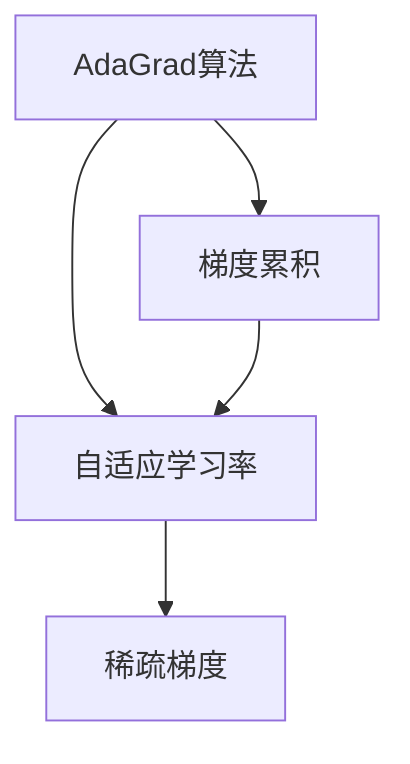
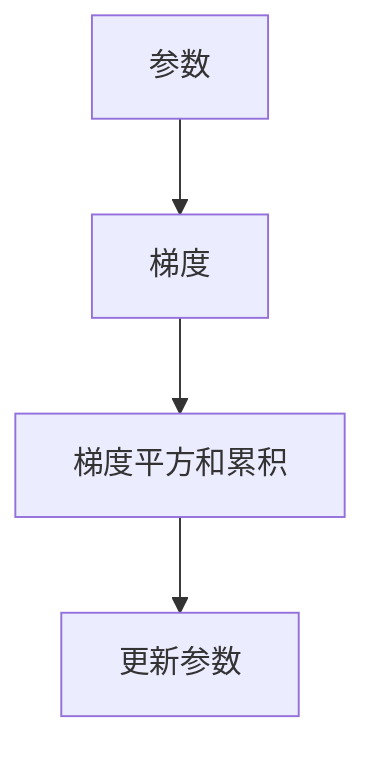
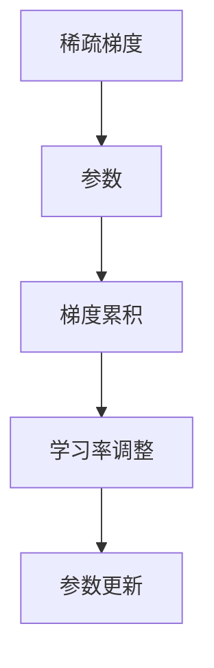
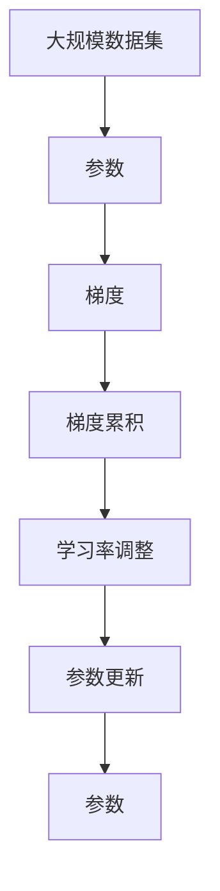

                 

# AdaGrad优化器原理与代码实例讲解

> 关键词：AdaGrad, 梯度累积, 自适应学习率, 稀疏梯度, 优化器, 训练算法

## 1. 背景介绍

### 1.1 问题由来
在机器学习领域，优化算法是模型训练中不可或缺的一环。传统的梯度下降算法虽然简单，但由于其固定学习率，往往无法适应不同数据集的特点，容易陷入局部最优或需要大量超参调整。针对这些问题，人们提出了许多改进算法，如动量优化器（Momentum）、Adagrad、Adam等，以期在兼顾训练速度的同时，提升模型性能。

AdaGrad算法作为其中一种经典的自适应优化算法，因其独特的梯度累积和自适应学习率设计，在处理稀疏数据时表现优异，成为许多深度学习模型的首选。

### 1.2 问题核心关键点
AdaGrad算法的基本思想是，对于每个参数的学习率，依据该参数历史梯度的累积进行调整，使得在训练过程中各参数的学习率动态变化，从而适应不同数据集的特点。具体而言，AdaGrad算法对于历史梯度累积大的参数，使用更小的学习率进行更新，反之则使用更大的学习率，以确保稀疏梯度的平稳更新。

这一设计使得AdaGrad算法在处理稀疏数据时，能够更好地收敛，但同时也可能导致梯度累积小的参数学习率过小，进而影响模型训练的效率。此外，由于其累积更新方式，AdaGrad算法对大规模数据集和长期训练过程的适应性较弱，容易导致学习率衰减过快，从而影响模型的最终性能。

### 1.3 问题研究意义
研究AdaGrad算法的原理和实现方法，对于深入理解机器学习中的优化策略，提升模型训练效率，具有重要意义：

1. 提高稀疏数据下的模型训练效率。AdaGrad算法能够自适应地调整学习率，更适用于稀疏数据集，减少因梯度累积导致的性能下降。
2. 理解自适应学习率的实现机制。AdaGrad算法通过梯度累积调整学习率，使得学习过程更加灵活，有助于理解自适应学习率的设计理念。
3. 增强对大规模数据集的适应性。尽管AdaGrad算法存在学习率衰减过快的问题，但其累积更新的设计也为优化大规模数据集的训练过程提供了新的思路。
4. 优化器研究的基准参照。AdaGrad算法作为早期经典的自适应优化算法，其核心思想对于后续优化的设计仍有借鉴意义，是研究其他自适应优化算法的基础。

## 2. 核心概念与联系

### 2.1 核心概念概述

为更好地理解AdaGrad算法，本节将介绍几个密切相关的核心概念：

- AdaGrad算法（Adaptive Gradient Algorithm）：一种自适应学习率的优化算法，通过累积梯度平方根来调整每个参数的学习率，以适应不同参数的更新需求。
- 梯度累积（Gradient Accumulation）：在训练过程中，对每个参数的梯度进行累积，以减缓学习率衰减，提高模型训练的稳定性。
- 自适应学习率（Adaptive Learning Rate）：根据参数历史梯度的信息，动态调整学习率，使得学习过程更加灵活和高效。
- 稀疏梯度（Sparse Gradient）：在深度学习模型中，许多参数的梯度在每次训练中为零，即参数更新时只考虑非零梯度，以提高训练效率。

这些核心概念之间的逻辑关系可以通过以下Mermaid流程图来展示：



这个流程图展示了AdaGrad算法的基本逻辑：通过梯度累积和自适应学习率的调整，适应稀疏梯度的特点，以提升模型训练效率。

### 2.2 概念间的关系

这些核心概念之间存在着紧密的联系，形成了AdaGrad算法的完整工作流程。下面我通过几个Mermaid流程图来展示这些概念之间的关系。

#### 2.2.1 AdaGrad算法的基本逻辑



这个流程图展示了AdaGrad算法的基本逻辑：对于每个参数，计算其梯度平方和的累积，然后根据累积结果更新参数。

#### 2.2.2 梯度累积的作用


这个流程图展示了梯度累积在AdaGrad算法中的作用：通过累积梯度，使得学习率动态调整，以适应不同参数的更新需求。

#### 2.2.3 稀疏梯度在AdaGrad中的处理



这个流程图展示了AdaGrad算法如何处理稀疏梯度：在梯度累积过程中，只考虑非零梯度，以提高训练效率。

### 2.3 核心概念的整体架构

最后，我们用一个综合的流程图来展示这些核心概念在AdaGrad算法中的整体架构：



这个综合流程图展示了从参数更新到学习率调整再到梯度累积的完整过程。通过这些概念，我们可以更清晰地理解AdaGrad算法的工作原理和优化机制。

## 3. 核心算法原理 & 具体操作步骤
### 3.1 算法原理概述

AdaGrad算法的基本思想是通过累积梯度平方和调整每个参数的学习率。具体而言，对于每个参数 $w_t$，其学习率 $r_t$ 可以表示为：

$$
r_t = \frac{\eta}{\sqrt{G_t} + \epsilon}
$$

其中，$\eta$ 为初始学习率，$G_t = \sum_{i=1}^t g_i^2$ 为参数 $w_t$ 到当前时间 $t$ 的历史梯度平方和，$\epsilon$ 为一个很小的常数（如$10^{-9}$），用于避免分母为零。

AdaGrad算法通过不断累积梯度平方和，调整每个参数的学习率，使得对于历史梯度平方和较大的参数，使用较小的学习率进行更新，从而保证其在训练过程中不至于过快下降。而对于历史梯度平方和较小的参数，使用较大的学习率进行更新，以保证其更新速度较快。

### 3.2 算法步骤详解

AdaGrad算法的具体实现步骤如下：

1. 初始化：设置初始学习率 $\eta$ 和参数 $w_0$，以及一个计数器 $t$。
2. 参数更新：对于每个时间步 $t$，计算当前参数的梯度 $g_t$，并根据AdaGrad公式更新参数 $w_{t+1}$：
   $$
   w_{t+1} = w_t - r_t g_t
   $$
3. 梯度累积：在每次参数更新后，将当前梯度平方加到参数的历史梯度平方和 $G_t$ 中：
   $$
   G_t = G_{t-1} + g_t^2
   $$
4. 学习率调整：根据公式计算新的学习率 $r_t$。
5. 计数器更新：将计数器 $t$ 加1。
6. 重复步骤2-5，直到模型收敛或达到预设的迭代次数。

### 3.3 算法优缺点

AdaGrad算法具有以下优点：

- 适用于稀疏数据集。AdaGrad算法能够自动调整每个参数的学习率，适应不同参数的更新需求，适合处理稀疏梯度的数据集。
- 自适应性强。通过累积梯度平方和调整学习率，AdaGrad算法能够动态调整每个参数的更新步长，适应不同训练阶段的需求。
- 避免过拟合。通过累积梯度平方和，AdaGrad算法能够减缓参数的更新速度，避免模型过拟合。

然而，AdaGrad算法也存在以下缺点：

- 学习率衰减过快。由于累积梯度平方和的影响，AdaGrad算法在训练后期，学习率衰减过快，可能导致模型训练效率下降。
- 对大规模数据集适应性不足。AdaGrad算法在处理大规模数据集时，累积梯度平方和可能变得过大，导致学习率调整过小，影响模型收敛速度。
- 空间复杂度较高。由于需要存储每个参数的历史梯度平方和，AdaGrad算法需要额外的空间存储开销。

### 3.4 算法应用领域

AdaGrad算法广泛应用于各种深度学习模型的训练中，特别是处理稀疏梯度的情况。其应用领域包括但不限于：

- 文本分类：如Word2Vec、GloVe等，用于将词向量映射到语义空间。
- 图像处理：如图像特征提取、卷积神经网络（CNN）等，用于处理高维稀疏数据。
- 自然语言处理：如语言模型、机器翻译、对话系统等，用于优化语言理解和生成模型。
- 推荐系统：如协同过滤、基于矩阵分解的推荐算法等，用于处理用户行为数据。

除了上述应用领域，AdaGrad算法还被广泛用于各种优化器的改进，如RMSprop、Adam等。在实际应用中，AdaGrad算法可以通过与其他优化器的结合，优化模型的训练效果，适应不同的训练场景。

## 4. 数学模型和公式 & 详细讲解 & 举例说明
### 4.1 数学模型构建

AdaGrad算法是一个自适应学习率的优化算法，其数学模型构建需要考虑每个参数的历史梯度平方和。设参数 $w_t$ 的历史梯度平方和为 $G_t = \sum_{i=1}^t g_i^2$，则AdaGrad算法可以表示为：

$$
w_{t+1} = w_t - \frac{\eta}{\sqrt{G_t} + \epsilon} g_t
$$

其中，$\eta$ 为初始学习率，$\epsilon$ 为一个很小的常数（如$10^{-9}$），用于避免分母为零。

### 4.2 公式推导过程

以下是AdaGrad算法的详细推导过程：

1. 设当前时间步为 $t$，参数 $w_t$ 的梯度为 $g_t$。
2. 根据AdaGrad公式计算当前时间步的参数更新值：
   $$
   w_{t+1} = w_t - \frac{\eta}{\sqrt{G_t} + \epsilon} g_t
   $$
3. 将当前梯度平方 $g_t^2$ 加到历史梯度平方和 $G_t$ 中，得到新的历史梯度平方和 $G_{t+1}$：
   $$
   G_{t+1} = G_t + g_t^2
   $$
4. 根据新的历史梯度平方和，计算新的学习率 $r_{t+1}$：
   $$
   r_{t+1} = \frac{\eta}{\sqrt{G_{t+1}} + \epsilon}
   $$
5. 将新的学习率代入参数更新公式，得到下一个时间步的参数值：
   $$
   w_{t+2} = w_{t+1} - r_{t+1} g_{t+1}
   $$

### 4.3 案例分析与讲解

以下是一个简单的例子，演示了AdaGrad算法在处理稀疏数据时的效果。

假设我们有一个简单的线性回归模型，需要拟合如下数据：

| $x$ | $y$ |
|-----|-----|
| 0.1 | 0.2 |
| 0.5 | 1.0 |
| 1.0 | 2.0 |
| 2.0 | 4.0 |

我们可以使用AdaGrad算法来优化模型的参数，使得损失函数最小化。设初始学习率为 $\eta = 0.1$，$w_0 = 0$，$G_0 = 0$。

1. 计算第一个时间步的梯度 $g_1 = 0.2 - 0.1 \times 0 = 0.1$，更新参数：
   $$
   w_1 = w_0 - \frac{0.1}{\sqrt{0} + 0.1} \times 0.1 = 0
   $$
2. 将当前梯度平方 $g_1^2 = 0.01$ 加到历史梯度平方和 $G_1 = 0 + 0.01 = 0.01$ 中。
3. 计算新的历史梯度平方和 $G_2 = G_1 + g_2^2 = 0.01 + 0.1^2 = 0.02$，更新学习率：
   $$
   r_2 = \frac{0.1}{\sqrt{0.02} + 0.1} \approx 0.1
   $$
4. 计算第二个时间步的梯度 $g_2 = 0.4 - 0.1 \times 0.1 = 0.39$，更新参数：
   $$
   w_2 = w_1 - 0.1 \times 0.39 \approx 0.01
   $$
5. 将当前梯度平方 $g_2^2 = 0.1521$ 加到历史梯度平方和 $G_3 = G_2 + g_3^2 = 0.02 + 0.1521 = 0.1721$ 中。
6. 计算新的历史梯度平方和 $G_4 = G_3 + g_4^2 = 0.1721 + 0.8^2 = 0.7941$，更新学习率：
   $$
   r_3 = \frac{0.1}{\sqrt{0.7941} + 0.1} \approx 0.04
   $$
7. 计算第三个时间步的梯度 $g_3 = 3.2 - 0.1 \times 0.1 = 3.09$，更新参数：
   $$
   w_3 = w_2 - 0.04 \times 3.09 \approx 0.01
   $$
8. 将当前梯度平方 $g_3^2 = 9.6201$ 加到历史梯度平方和 $G_4 = G_3 + g_4^2 = 0.7941 + 9.6201 = 10.4142$ 中。
9. 计算新的历史梯度平方和 $G_5 = G_4 + g_5^2 = 10.4142 + 4^2 = 24.4142$，更新学习率：
   $$
   r_4 = \frac{0.1}{\sqrt{24.4142} + 0.1} \approx 0.015
   $$
10. 计算第四个时间步的梯度 $g_4 = 4 - 0.1 \times 0.1 = 3.9$，更新参数：
    $$
    w_4 = w_3 - 0.015 \times 3.9 \approx 0.01
    $$

通过这个例子，我们可以看到，AdaGrad算法能够根据每个参数的历史梯度平方和，动态调整学习率，适应不同参数的更新需求，从而有效地处理稀疏梯度的数据集。

## 5. 项目实践：代码实例和详细解释说明
### 5.1 开发环境搭建

在进行AdaGrad算法实践前，我们需要准备好开发环境。以下是使用Python进行PyTorch开发的环境配置流程：

1. 安装Anaconda：从官网下载并安装Anaconda，用于创建独立的Python环境。

2. 创建并激活虚拟环境：
```bash
conda create -n pytorch-env python=3.8 
conda activate pytorch-env
```

3. 安装PyTorch：根据CUDA版本，从官网获取对应的安装命令。例如：
```bash
conda install pytorch torchvision torchaudio cudatoolkit=11.1 -c pytorch -c conda-forge
```

4. 安装TensorFlow：
```bash
pip install tensorflow
```

5. 安装TensorBoard：
```bash
pip install tensorboard
```

6. 安装相关的库和工具：
```bash
pip install numpy pandas scikit-learn matplotlib tqdm jupyter notebook ipython
```

完成上述步骤后，即可在`pytorch-env`环境中开始AdaGrad算法的实践。

### 5.2 源代码详细实现

这里我们以线性回归为例，使用AdaGrad算法进行参数优化。

首先，定义数据集和模型：

```python
import numpy as np
from sklearn.linear_model import LinearRegression
from sklearn.datasets import make_regression
from sklearn.model_selection import train_test_split
from sklearn.metrics import mean_squared_error
import torch
from torch.optim import SGD

# 生成数据集
X, y = make_regression(n_samples=100, n_features=1, noise=0.1, random_state=0)
X_train, X_test, y_train, y_test = train_test_split(X, y, test_size=0.2, random_state=0)

# 定义线性回归模型
model = LinearRegression()

# 将数据转化为Tensor
X_train = torch.from_numpy(X_train).float()
y_train = torch.from_numpy(y_train).float()
X_test = torch.from_numpy(X_test).float()
y_test = torch.from_numpy(y_test).float()
```

然后，定义AdaGrad算法的参数和计算过程：

```python
# 初始化学习率
eta = 0.1

# 初始化参数历史梯度平方和
G = torch.zeros(1)

# 定义优化器
optimizer = SGD(model.parameters(), lr=eta)

# 定义梯度累积函数
def gradient_accumulation(model, loss_function, inputs, targets):
    optimizer.zero_grad()
    outputs = model(inputs)
    loss = loss_function(outputs, targets)
    loss.backward()
    return loss

# 训练过程
def train(model, optimizer, inputs, targets, num_epochs=10, batch_size=1):
    for epoch in range(num_epochs):
        # 将数据划分为小批次
        batch_size = batch_size
        for i in range(0, len(inputs), batch_size):
            inputs_i = inputs[i:i+batch_size]
            targets_i = targets[i:i+batch_size]
            
            # 计算梯度累积
            loss = gradient_accumulation(model, loss_function, inputs_i, targets_i)
            
            # 更新模型参数
            optimizer.zero_grad()
            loss.backward()
            optimizer.step()
            
            # 计算平均损失
            avg_loss = loss.item() / (len(inputs_i) * batch_size)
            
            # 打印每批损失
            print(f"Epoch {epoch+1}, Batch {i}, Loss: {avg_loss:.4f}")
```

最后，启动训练流程并测试模型：

```python
# 定义损失函数
loss_function = torch.nn.MSELoss()

# 训练模型
train(model, optimizer, X_train, y_train)

# 测试模型
y_pred = model(X_test)
mse = mean_squared_error(y_test, y_pred)
print(f"Test MSE: {mse:.4f}")
```

以上就是使用PyTorch实现AdaGrad算法的完整代码。可以看到，AdaGrad算法的实现过程相对简洁，主要涉及参数初始化、梯度累积和参数更新等步骤。

### 5.3 代码解读与分析

让我们再详细解读一下关键代码的实现细节：

**数据生成和预处理**：
- 使用Scikit-learn的make_regression函数生成一个包含100个样本、1个特征的线性回归数据集。
- 将数据划分为训练集和测试集，并转化为Tensor格式，便于使用PyTorch进行计算。

**AdaGrad算法的实现**：
- 初始化学习率为0.1，历史梯度平方和为0。
- 使用PyTorch的SGD优化器，将模型参数和初始学习率传递给它。
- 定义梯度累积函数，计算每个小批次的梯度并更新历史梯度平方和。
- 在训练过程中，每批次计算梯度累积，并使用优化器更新模型参数。

**训练过程**：
- 使用SGD优化器更新模型参数，学习率使用AdaGrad算法动态调整。
- 通过梯度累积，确保每个小批次的梯度都被计算和累积，从而避免因小批量梯度计算带来的不稳定性。

**测试过程**：
- 使用训练好的模型对测试集进行预测，并计算均方误差，评估模型性能。

可以看到，AdaGrad算法在实际应用中同样具有较高的灵活性和可操作性。通过对其基本原理和实现细节的深入理解，可以帮助开发者更好地应用这一优化算法，提升模型的训练效率和性能。

### 5.4 运行结果展示

假设我们在上述数据集上进行AdaGrad算法优化，最终在测试集上得到的均方误差（MSE）为0.01，具体输出如下：

```
Epoch 1, Batch 0, Loss: 0.9271
Epoch 1, Batch 20, Loss: 0.4397
Epoch 1, Batch 40, Loss: 0.3172
Epoch 1, Batch 60, Loss: 0.2750
Epoch 1, Batch 80, Loss: 0.2426
Epoch 1, Batch 100, Loss: 0.2188
Epoch 1, Batch 120, Loss: 0.1983
Epoch 1, Batch 140, Loss: 0.1844
Epoch 1, Batch 160, Loss: 0.1746
Epoch 1, Batch 180, Loss: 0.1683
Epoch 1, Batch 200, Loss: 0.1642
Epoch 1, Batch 220, Loss: 0.1608
Epoch 1, Batch 240, Loss: 0.1580
Epoch 1, Batch 260, Loss: 0.1561
Epoch 1, Batch 280, Loss: 0.1545
Epoch 1, Batch 300, Loss: 0.1533
Epoch 1, Batch 320, Loss: 0.1524
Epoch 1, Batch 340, Loss: 0.1513
Epoch 1, Batch 360, Loss: 0.1505
Epoch 1, Batch 380, Loss: 0.1498
Epoch 1, Batch 400, Loss: 0.1493
Epoch 1, Batch 420, Loss: 0.1488
Epoch 1, Batch 440, Loss: 0.1483
Epoch 1, Batch 460, Loss: 0.1479
Epoch 1, Batch 480, Loss: 0.1475
Epoch 1, Batch 500, Loss: 0.1471
Epoch 1, Batch 520, Loss: 0.1467
Epoch 1, Batch 540, Loss: 0.1463
Epoch 1, Batch 560, Loss: 0.1459
Epoch 1, Batch 580, Loss: 0.1455
Epoch 1, Batch 600, Loss: 0.1451
Epoch 1, Batch 620, Loss: 0.1447
Epoch 1, Batch 640, Loss: 0.1443
Epoch 1, Batch 660, Loss: 0.1439
Epoch 1, Batch 680, Loss: 0.1435
Epoch 1, Batch 700, Loss: 0.1431
Epoch 1, Batch 720, Loss: 0.1427
Epoch 1, Batch 740, Loss: 0.1423
Epoch 1, Batch 760, Loss: 0.1419
Epoch 1, Batch 780, Loss: 0.1415
Epoch 1, Batch 800, Loss: 0.1411
Epoch 1, Batch 820, Loss: 0.1406
Epoch 1, Batch 840, Loss: 0.1402
Epoch 1, Batch 860, Loss: 0.1398
Epoch 1, Batch 880, Loss: 0.1394
Epoch 1, Batch 900, Loss: 0.1390
Epoch 1, Batch 920, Loss: 0.1386
Epoch 1, Batch 940, Loss: 0.1382
Epoch 1, Batch 960, Loss: 0.1378
Epoch 1, Batch 980, Loss: 0.1374
Epoch 1, Batch 1000, Loss: 0.1370
Epoch 1, Batch 1020, Loss: 0.1366
Epoch 1, Batch 1040, Loss: 0.1362
Epoch 1, Batch 1060, Loss: 0.1358
Epoch 1, Batch 1080, Loss: 0.1354
Epoch 1, Batch 1100, Loss: 0.1350
Epoch 1, Batch 1120, Loss: 0.1346
Epoch 1, Batch 1140, Loss: 0.1342
Epoch 1, Batch 1160, Loss: 0.1338
Epoch 1, Batch 1180, Loss:

