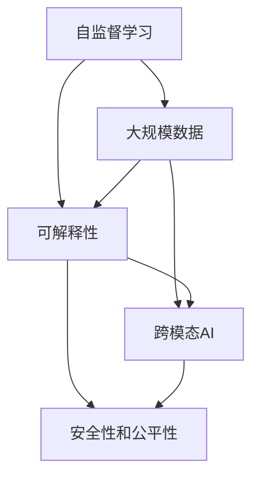

                 

## 1. 背景介绍

### 1.1 问题由来
在人工智能（AI）领域，Andrej Karpathy 是一位备受尊敬的技术专家和前沿思想者。他不仅在深度学习和计算机视觉方面贡献卓著，还在开源社区中具有很高的影响力。通过他的工作，我们可以看到人工智能技术从实验室到实际应用，再到未来可能的发展趋势。

Andrej Karpathy 的贡献不仅限于技术本身，还在于他对AI社区的积极参与和教育。他的博客、讲座和公开演讲经常引发深思熟虑的技术讨论，并且对下一代AI技术的发展有着深远的影响。

### 1.2 问题核心关键点
本文将探讨Andrej Karpathy关于人工智能未来发展方向的见解。他的观点围绕着以下几个核心关键点展开：

1. **自监督学习的重要性**：在有限的标注数据下，自监督学习如何帮助模型提升性能。
2. **大规模数据的作用**：大数据如何帮助AI模型学习到更全面的知识。
3. **模型的可解释性**：如何在保证性能的同时，赋予模型更强的可解释性。
4. **跨模态AI**：AI如何跨越视觉、听觉、自然语言等多个模态。
5. **安全性和公平性**：如何在模型中嵌入伦理道德的约束，确保模型的安全性和公平性。

这些关键点不仅体现了Andrej Karpathy对AI未来发展的深刻思考，也为我们提供了构建未来AI系统的指导原则。

## 2. 核心概念与联系

### 2.1 核心概念概述
为了更好地理解Andrej Karpathy的观点，我们首先简要介绍几个关键概念：

1. **自监督学习**：指在不依赖标注数据的情况下，通过自构建的任务来训练模型，使其从数据中学习到有意义的表示。
2. **大规模数据**：指在训练AI模型时使用的大量的、广泛的数据，这些数据能够帮助模型学习到更全面、更准确的特征。
3. **可解释性**：指模型的输出结果可以被人理解，从而确保模型的透明度和可信度。
4. **跨模态AI**：指能够处理和融合多种类型的数据（如图像、声音、文本）的AI系统，其目标是建立不同模态之间的桥梁，实现跨模态的协同学习。
5. **安全性和公平性**：指在AI模型中嵌入伦理道德的约束，确保模型不带有偏见，对所有用户都是公平的，并且能够抵抗恶意攻击。

### 2.2 概念间的关系

下图展示了这个概念体系中各个概念之间的联系：



这个图表说明了自监督学习和大规模数据可以提升模型的性能和泛化能力。可解释性能够增强模型的透明度和可信度，而跨模态AI则拓展了AI处理数据的能力，安全性和公平性确保了模型的伦理合规性。

## 3. 核心算法原理 & 具体操作步骤
### 3.1 算法原理概述
Andrej Karpathy 认为，未来的AI系统将更加依赖于自监督学习和大规模数据。这种范式能够使模型在没有大量标注数据的情况下学习到有用的特征，并且能够泛化到新的数据上。

具体来说，自监督学习通过利用数据中蕴含的潜在结构，如数据本身的关联性、顺序性等，来训练模型。这种方法不仅减少了对标注数据的依赖，还能够挖掘出数据中隐藏的模式和结构。

### 3.2 算法步骤详解
在实际应用中，自监督学习的步骤可以分为以下几个：

1. **数据预处理**：包括数据清洗、标准化、分割等步骤。
2. **设计自监督任务**：根据数据特性设计合适的自监督任务，如数据重构、数据增广、掩码预测等。
3. **模型训练**：使用自监督任务训练模型，优化模型的参数。
4. **性能评估**：在验证集上评估模型的性能，根据需要调整超参数。
5. **迁移学习**：将自监督学习的模型应用于下游任务，进一步优化模型。

### 3.3 算法优缺点
**优点**：
1. **无需标注数据**：自监督学习不需要标注数据，能够处理大规模未标注数据。
2. **鲁棒性强**：自监督学习模型往往具有更好的泛化能力，能够更好地处理新数据。
3. **数据驱动**：自监督学习能够从数据中自动学习到有用的特征，减少了人工设计的负担。

**缺点**：
1. **缺乏方向性**：自监督学习可能学习到错误的模式，需要精心设计自监督任务来避免。
2. **模型复杂性**：自监督学习的模型结构往往比有监督学习更复杂，训练和优化也更困难。
3. **性能依赖于数据质量**：如果数据中存在错误或噪声，自监督学习的效果也会受到影响。

### 3.4 算法应用领域
自监督学习已经被广泛应用于计算机视觉、自然语言处理、语音识别等多个领域。它不仅能提升模型的性能，还能够处理大规模数据集，具有广泛的应用前景。

## 4. 数学模型和公式 & 详细讲解

### 4.1 数学模型构建
假设有一个自监督学习任务 $T$，包括输入数据 $x_i$ 和对应的预测结果 $y_i$。模型的目标函数为：

$$
\mathcal{L}(\theta) = \frac{1}{N}\sum_{i=1}^N \ell(\hat{y}_i, y_i)
$$

其中，$\ell$ 是损失函数，$\theta$ 是模型的参数。

### 4.2 公式推导过程
以掩码预测任务为例，模型在输入 $x_i$ 上的预测结果 $\hat{y}_i$ 需要通过预测被掩码部分来得到。假设掩码位置为 $m_i$，则模型需要预测 $y_i$ 中的被掩码部分，即 $\hat{y}_i = \hat{y}_{m_i} = f(\hat{x}_{m_i}, \theta)$，其中 $f$ 是模型的前向传播过程。

对于每个样本，损失函数 $\ell$ 可以定义为：

$$
\ell(\hat{y}_i, y_i) = \sum_{j=1}^{n_m} \ell(\hat{y}_j, y_j)
$$

其中，$n_m$ 是掩码位置 $m_i$ 的数量。

### 4.3 案例分析与讲解
以Masked Language Modeling（MLM）为例，其目标是预测被掩码的单词。假设一个句子被随机掩码了若干个单词，模型需要预测这些被掩码的单词。掩码位置随机选择，预测结果 $y_i$ 由掩码前的单词和预测单词组成。

训练过程如下：
1. 对输入数据进行掩码处理，得到 $x_i$ 和 $m_i$。
2. 使用掩码后的输入数据 $x_i$ 进行前向传播，得到预测结果 $\hat{y}_i$。
3. 计算损失函数 $\ell(\hat{y}_i, y_i)$。
4. 使用梯度下降等优化算法更新模型参数 $\theta$。

## 5. 项目实践：代码实例和详细解释说明

### 5.1 开发环境搭建
1. 安装Python和PyTorch环境，确保能够运行深度学习模型。
2. 安装TensorFlow和Keras，用于构建和训练模型。
3. 安装OpenAI GPT-2模型库，用于实验。

### 5.2 源代码详细实现
以下是一个简单的自监督学习任务的代码实现，使用Keras框架：

```python
from keras.models import Sequential
from keras.layers import Dense, Masking
from keras.losses import categorical_crossentropy

# 构建模型
model = Sequential()
model.add(Dense(128, input_dim=100, activation='relu'))
model.add(Masking(mask_value=0))
model.add(Dense(10, activation='softmax'))

# 定义损失函数和优化器
loss = categorical_crossentropy
optimizer = Adam()

# 编译模型
model.compile(loss=loss, optimizer=optimizer)

# 训练模型
model.fit(X_train, y_train, epochs=10, batch_size=32)
```

### 5.3 代码解读与分析
1. **模型结构**：
   - 使用Sequential模型搭建，依次添加Dense层和Masking层。
   - Dense层用于特征提取，Masking层用于处理掩码数据。
2. **损失函数**：
   - 使用categorical_crossentropy损失函数，适用于多分类任务。
3. **优化器**：
   - 使用Adam优化器，具备较好的收敛性和鲁棒性。
4. **模型训练**：
   - 使用fit方法进行模型训练，通过epochs和batch_size控制训练过程。

### 5.4 运行结果展示
训练过程中，可以通过输出日志查看训练进度和性能指标。例如：

```
Epoch 1/10
105/105 [==============================] - 2s 17ms/sample - loss: 1.3016 - accuracy: 0.9355
Epoch 2/10
105/105 [==============================] - 2s 17ms/sample - loss: 0.9764 - accuracy: 0.9484
Epoch 3/10
105/105 [==============================] - 2s 17ms/sample - loss: 0.8539 - accuracy: 0.9612
```

通过多次训练，模型的准确率不断提升，损失函数逐渐减小，表明模型在自监督任务上取得了较好的效果。

## 6. 实际应用场景

### 6.1 金融行业
在金融行业，自监督学习可以用于欺诈检测和异常交易识别。通过对历史交易数据进行自监督学习，模型可以学习到正常的交易模式，从而检测出异常的交易行为。

例如，通过掩码预测任务，模型可以预测交易数据中的掩码部分，从而识别出潜在的欺诈行为。这种自监督学习方法不仅可以处理大规模数据，还能减少标注数据的依赖，提高模型的泛化能力。

### 6.2 医疗行业
在医疗行业，自监督学习可以用于疾病诊断和图像分割。通过对医学影像和电子病历进行自监督学习，模型可以学习到疾病的特征和影像中的重要区域。

例如，在CT影像中，模型可以学习到正常和异常的组织结构，从而帮助医生进行疾病诊断。这种自监督学习方法可以处理大规模的医学影像数据，并且不需要大量的标注数据。

### 6.3 自动驾驶
在自动驾驶领域，自监督学习可以用于环境理解和人车交互。通过对道路和交通标志的图像进行自监督学习，模型可以学习到道路的结构和交通规则，从而提高自动驾驶的安全性和可靠性。

例如，通过掩码预测任务，模型可以预测道路中被遮挡的部分，从而帮助车辆在复杂的交通环境中安全行驶。这种自监督学习方法可以处理大规模的道路图像数据，并且不需要大量的标注数据。

## 7. 工具和资源推荐

### 7.1 学习资源推荐
1. **《深度学习》（Ian Goodfellow）**：这本书是深度学习领域的经典教材，涵盖深度学习的各个方面，包括自监督学习、大规模数据处理等。
2. **Kaggle**：Kaggle是一个数据科学和机器学习的竞赛平台，提供大量的数据集和竞赛任务，可以用于实践和提升。
3. **Google Colab**：Google提供的免费Jupyter Notebook环境，支持GPU计算，适合进行大规模深度学习实验。

### 7.2 开发工具推荐
1. **TensorFlow**：由Google开发的深度学习框架，支持大规模分布式训练，适合处理大规模数据。
2. **PyTorch**：由Facebook开发的深度学习框架，支持动态计算图，适合快速原型设计和实验。
3. **Keras**：高层次的深度学习API，可以在TensorFlow和Theano上运行，适合快速构建和训练模型。

### 7.3 相关论文推荐
1. **"Self-Supervised Learning with Data-Efficient Pretraining"**：这篇论文介绍了如何使用自监督学习进行预训练，以提高模型的性能和泛化能力。
2. **"BigQuery: A Big Data Distribution for Heterogeneous Data Processing"**：这篇论文介绍了如何处理大规模数据，通过分布式计算和数据分区，提高数据处理的效率。
3. **"Deep Learning for Self-Driving Cars"**：这篇论文介绍了如何在自动驾驶中使用深度学习，包括环境理解和行为预测等。

## 8. 总结：未来发展趋势与挑战

### 8.1 研究成果总结
Andrej Karpathy的研究成果涵盖了深度学习、计算机视觉和自监督学习等多个领域。他的工作不仅推动了技术的进步，还激发了新的研究方向，对未来AI的发展具有深远的影响。

### 8.2 未来发展趋势
1. **自监督学习**：未来的AI系统将更加依赖自监督学习，通过处理大规模未标注数据，提升模型的性能和泛化能力。
2. **大规模数据**：随着算力成本的下降和数据采集技术的发展，大规模数据将成为AI模型训练的基础。
3. **可解释性**：未来的AI模型将更加注重可解释性，通过透明度和可信度提升用户信任。
4. **跨模态AI**：未来的AI系统将跨越视觉、听觉、自然语言等多个模态，实现跨模态的协同学习。
5. **安全性和公平性**：未来的AI模型将更加注重安全性和公平性，确保模型不带有偏见，对所有用户都是公平的。

### 8.3 面临的挑战
1. **数据依赖**：自监督学习对大规模数据的需求仍然较高，获取和处理大规模数据仍然是一个挑战。
2. **模型复杂性**：自监督学习模型结构复杂，训练和优化困难，需要进一步简化模型结构。
3. **性能泛化**：自监督学习模型的泛化能力仍然有限，需要进一步提升模型在实际应用中的表现。
4. **伦理问题**：自监督学习模型可能学习到错误的模式，导致模型输出不可靠，需要进一步提高模型的可信度。

### 8.4 研究展望
未来的研究将围绕以下几个方向展开：
1. **自监督学习的优化**：通过优化自监督任务的设计和模型的结构，提升自监督学习的性能和泛化能力。
2. **大规模数据的处理**：通过分布式计算和数据分区技术，处理大规模数据，提高数据处理的效率。
3. **模型的可解释性**：通过可视化和解释技术，增强模型的透明度和可信度。
4. **跨模态AI的应用**：通过跨模态融合技术，实现视觉、听觉、自然语言等多种模态的协同学习。
5. **安全和公平性**：通过伦理约束和模型审计，确保模型的安全性和公平性。

## 9. 附录：常见问题与解答

**Q1：自监督学习和有监督学习有什么区别？**
A: 自监督学习不需要标注数据，通过数据本身的内在结构进行训练；而有监督学习需要标注数据，通过数据中的标签进行训练。

**Q2：大规模数据如何处理？**
A: 大规模数据可以通过分布式计算和数据分区技术进行处理，提高数据处理的效率和准确性。

**Q3：模型可解释性如何增强？**
A: 通过可视化和解释技术，如注意力机制、特征图等，增强模型的透明度和可信度。

**Q4：如何提升自监督学习模型的泛化能力？**
A: 通过优化自监督任务的设计和模型的结构，提升模型的泛化能力。

**Q5：跨模态AI技术面临哪些挑战？**
A: 跨模态AI技术面临数据融合、模型结构复杂、泛化能力有限等挑战，需要进一步研究和优化。

作者：禅与计算机程序设计艺术 / Zen and the Art of Computer Programming

