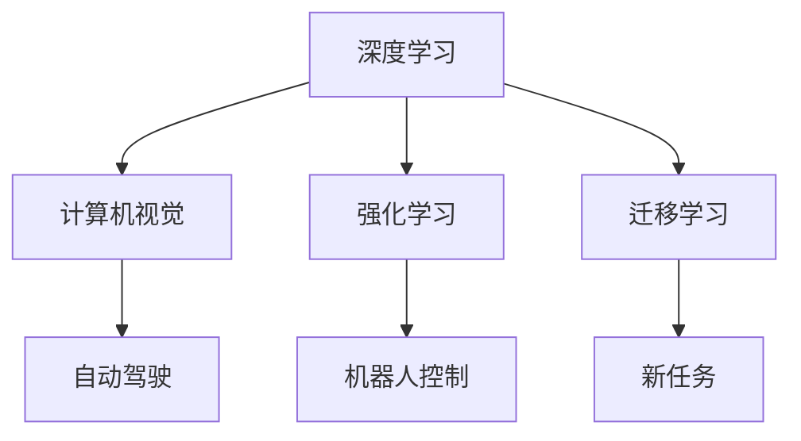

                 

# Andrej Karpathy：人工智能的未来发展策略

## 1. 背景介绍

Andrej Karpathy，被公认为深度学习领域的领军人物之一，曾在斯坦福大学担任计算机视觉教授，现任Meta AI研究院主任。他的工作不仅在学术界产生了深远影响，也在业界推动了技术的落地应用。Karpathy在深度学习、计算机视觉、自动驾驶等领域均有深入研究，并发表了诸多具有前瞻性的论文和技术见解。本文将从Karpathy的研究视角出发，探讨人工智能未来的发展策略。

## 2. 核心概念与联系

### 2.1 核心概念概述

要理解人工智能的未来发展策略，首先需要明确几个核心概念：

- **深度学习（Deep Learning）**：一种通过多层神经网络实现复杂模式识别的机器学习技术。深度学习在图像识别、语音识别、自然语言处理等领域取得了突破性进展。
- **计算机视觉（Computer Vision）**：利用计算机处理和分析图像信息，实现图像分类、目标检测、场景理解等任务的技术。计算机视觉是实现自动驾驶、智能监控等应用的基础。
- **自动驾驶（Autonomous Driving）**：通过人工智能技术，使车辆能够在无人干预下自主导航，实现安全、高效的交通出行。自动驾驶是人工智能应用的重要方向之一。
- **强化学习（Reinforcement Learning）**：通过智能体在环境中与环境交互，通过奖励信号不断优化策略，实现自主决策和复杂任务执行。强化学习在机器人控制、游戏AI等领域有着广泛应用。
- **迁移学习（Transfer Learning）**：利用预训练模型的知识，通过微调或特征迁移等方式，快速适应新任务，提高模型的泛化能力和效率。迁移学习在大规模数据集上训练的模型在新任务上往往能取得更好的效果。

### 2.2 概念间的关系

这些核心概念之间存在着紧密的联系，形成一个互为支撑的人工智能生态系统。深度学习为计算机视觉和自动驾驶提供了强大的模型基础，计算机视觉和自动驾驶的发展又进一步推动了深度学习的应用和研究。强化学习与深度学习相互融合，在机器人控制、游戏AI等领域展示了强大的潜力。迁移学习则是连接预训练模型与下游任务的重要桥梁，加速了模型的知识迁移和应用扩展。

以下是一个Mermaid流程图，展示了这些核心概念之间的联系：



## 3. 核心算法原理 & 具体操作步骤

### 3.1 算法原理概述

人工智能的未来发展策略，可以从多个维度来探讨，包括技术路径、应用场景、伦理道德等。本文主要聚焦于深度学习算法及其应用领域，以Andrej Karpathy的研究方向为基础，进行深入分析。

深度学习算法原理在于通过多层神经网络，对输入数据进行抽象、编码和解码，实现复杂的模式识别和预测。其核心思想是通过反向传播算法，通过梯度下降优化模型参数，最小化预测误差。深度学习算法在图像识别、语音识别、自然语言处理等任务上取得了显著效果，成为人工智能的重要基础技术。

### 3.2 算法步骤详解

深度学习算法的训练步骤主要包括以下几个关键步骤：

1. **数据预处理**：对原始数据进行清洗、归一化、增强等处理，确保数据质量。
2. **模型构建**：选择合适的神经网络结构，如卷积神经网络（CNN）、循环神经网络（RNN）、变压器（Transformer）等，并设计合适的损失函数和优化器。
3. **模型训练**：使用训练集数据，通过前向传播、损失计算、反向传播和参数更新等步骤，不断优化模型参数。
4. **模型评估**：在验证集和测试集上评估模型的性能，选择最优模型。
5. **模型应用**：将训练好的模型应用于实际场景，进行预测、分类、生成等任务。

以计算机视觉中的图像分类任务为例，以下是一个详细的训练流程：

- **数据预处理**：将图像进行裁剪、缩放、归一化等处理，生成训练集、验证集和测试集。
- **模型构建**：选择ResNet、Inception等卷积神经网络结构，并添加全连接层、softmax层等组件。
- **模型训练**：使用训练集数据，通过反向传播算法更新模型参数，最小化分类误差。
- **模型评估**：在验证集上评估模型性能，选择最优超参数和学习率。
- **模型应用**：在测试集上评估模型性能，并进行实际图像分类任务。

### 3.3 算法优缺点

深度学习算法在处理大规模数据集、复杂模式识别等方面具有显著优势。然而，它也面临着一些挑战：

**优点**：
1. **自适应能力强**：能够自动学习输入数据的高阶特征，适应各种复杂模式。
2. **泛化能力强**：在处理新数据时，能够通过迁移学习等方式快速适应。
3. **应用广泛**：已经在图像识别、语音识别、自然语言处理等领域取得了突破性进展。

**缺点**：
1. **计算资源消耗大**：大规模神经网络需要大量计算资源进行训练和推理。
2. **模型可解释性差**：深度学习模型往往被视为"黑盒"系统，难以解释其内部机制。
3. **过拟合风险高**：在处理小规模数据集时，容易过拟合。

### 3.4 算法应用领域

深度学习算法已经在多个领域得到了广泛应用，以下是一些典型的应用场景：

1. **计算机视觉**：如图像分类、目标检测、图像生成、场景理解等。
2. **自然语言处理**：如文本分类、机器翻译、对话系统、情感分析等。
3. **自动驾驶**：通过计算机视觉和传感器融合，实现车辆自主导航。
4. **医疗诊断**：利用深度学习进行医学影像分析、病历分析等。
5. **金融分析**：利用深度学习进行市场预测、风险评估等。
6. **游戏AI**：在电子竞技、模拟游戏中实现自主决策和复杂策略执行。

## 4. 数学模型和公式 & 详细讲解

### 4.1 数学模型构建

深度学习算法的数学模型主要包括两部分：前向传播和反向传播。

前向传播通过神经网络对输入数据进行处理，生成预测结果。对于单层神经网络，前向传播公式为：

$$
h(x) = \sigma(Wx + b)
$$

其中，$x$为输入数据，$W$和$b$为模型参数，$\sigma$为激活函数。

反向传播通过计算损失函数对模型参数的梯度，更新模型参数。对于单层神经网络，反向传播公式为：

$$
\frac{\partial L}{\partial W} = \frac{\partial L}{\partial h} \frac{\partial h}{\partial W}
$$

其中，$L$为损失函数，$h$为预测结果，$W$为模型参数。

### 4.2 公式推导过程

以计算机视觉中的图像分类任务为例，下面对前向传播和反向传播公式进行推导：

1. **前向传播**：

设输入图像为$x$，输出为$y$，神经网络结构为$h(x;W)$，损失函数为$L(y;y)$，则前向传播公式为：

$$
y = h(x;W) = \sigma(W^T\sigma(Wx + b))
$$

其中，$W$和$b$为模型参数，$\sigma$为激活函数。

2. **反向传播**：

对于分类任务，损失函数通常采用交叉熵损失，其公式为：

$$
L(y;\hat{y}) = -\frac{1}{N}\sum_{i=1}^N \log \hat{y}_i
$$

其中，$y$为真实标签，$\hat{y}$为预测结果，$N$为样本数量。

对损失函数求偏导，得到梯度公式：

$$
\frac{\partial L}{\partial W} = \frac{\partial L}{\partial h} \frac{\partial h}{\partial W}
$$

其中，$\frac{\partial L}{\partial h}$为梯度对输出层的贡献，$\frac{\partial h}{\partial W}$为梯度对权重层的贡献。

通过链式法则，可以递归地计算梯度：

$$
\frac{\partial L}{\partial W^{(l)}} = \frac{\partial L}{\partial z^{(l)}} \frac{\partial z^{(l)}}{\partial a^{(l-1)}} \frac{\partial a^{(l-1)}}{\partial W^{(l)}}
$$

其中，$z^{(l)}$为第$l$层的输入，$a^{(l-1)}$为第$l-1$层的输出，$W^{(l)}$为第$l$层的权重。

### 4.3 案例分析与讲解

以ImageNet数据集上的图像分类任务为例，分析深度学习算法的实际应用。

假设我们使用ResNet模型进行图像分类，训练数据集为ImageNet，验证数据集为CIFAR-10。首先，我们需要将图像进行预处理，包括裁剪、缩放、归一化等操作。然后，构建ResNet模型，并选择合适的损失函数和优化器。最后，使用训练集数据进行模型训练，在验证集上进行模型评估和参数优化。

具体步骤如下：

1. **数据预处理**：将ImageNet数据集进行裁剪、缩放、归一化等处理，生成训练集、验证集和测试集。
2. **模型构建**：选择ResNet模型结构，并添加全连接层、softmax层等组件。
3. **模型训练**：使用训练集数据，通过反向传播算法更新模型参数，最小化分类误差。
4. **模型评估**：在验证集上评估模型性能，选择最优超参数和学习率。
5. **模型应用**：在测试集上评估模型性能，并进行实际图像分类任务。

## 5. 项目实践：代码实例和详细解释说明

### 5.1 开发环境搭建

为了进行深度学习算法的实践，需要准备以下开发环境：

1. **Python**：深度学习算法通常使用Python实现，确保安装最新版本的Python。
2. **NumPy**：Python数值计算库，深度学习算法的基础工具。
3. **PyTorch**：深度学习框架，支持动态计算图，易于使用和调试。
4. **TensorFlow**：另一种深度学习框架，支持静态计算图，适合大规模工程应用。
5. **Jupyter Notebook**：Python交互式开发环境，支持代码编写和可视化。

### 5.2 源代码详细实现

以计算机视觉中的图像分类任务为例，使用PyTorch实现深度学习算法。

首先，导入必要的库和模块：

```python
import torch
import torch.nn as nn
import torch.optim as optim
import torchvision.transforms as transforms
from torchvision.datasets import ImageNet
from torch.utils.data import DataLoader
```

然后，定义数据预处理函数：

```python
def preprocess_data():
    transform_train = transforms.Compose([
        transforms.RandomResizedCrop(224),
        transforms.RandomHorizontalFlip(),
        transforms.ToTensor(),
        transforms.Normalize(mean=[0.485, 0.456, 0.406], std=[0.229, 0.224, 0.225])
    ])
    
    transform_test = transforms.Compose([
        transforms.Resize(256),
        transforms.CenterCrop(224),
        transforms.ToTensor(),
        transforms.Normalize(mean=[0.485, 0.456, 0.406], std=[0.229, 0.224, 0.225])
    ])
    
    trainset = ImageNet(root='data/train', train=True, transform=transform_train)
    trainloader = DataLoader(trainset, batch_size=64, shuffle=True, num_workers=4)
    
    testset = ImageNet(root='data/test', train=False, transform=transform_test)
    testloader = DataLoader(testset, batch_size=64, shuffle=False, num_workers=4)
    
    return trainloader, testloader
```

接着，定义深度学习模型：

```python
class ResNet(nn.Module):
    def __init__(self):
        super(ResNet, self).__init__()
        self.conv1 = nn.Conv2d(3, 64, kernel_size=7, stride=2, padding=3)
        self.maxpool = nn.MaxPool2d(kernel_size=3, stride=2, padding=1)
        self.layer1 = nn.Sequential(
            nn.Conv2d(64, 64, kernel_size=3, stride=1, padding=1),
            nn.ReLU(inplace=True),
            nn.MaxPool2d(kernel_size=3, stride=2, padding=1)
        )
        self.layer2 = nn.Sequential(
            nn.Conv2d(64, 128, kernel_size=3, stride=1, padding=1),
            nn.ReLU(inplace=True),
            nn.MaxPool2d(kernel_size=3, stride=2, padding=1)
        )
        self.layer3 = nn.Sequential(
            nn.Conv2d(128, 256, kernel_size=3, stride=1, padding=1),
            nn.ReLU(inplace=True),
            nn.MaxPool2d(kernel_size=3, stride=2, padding=1)
        )
        self.layer4 = nn.Sequential(
            nn.Conv2d(256, 512, kernel_size=3, stride=1, padding=1),
            nn.ReLU(inplace=True),
            nn.MaxPool2d(kernel_size=3, stride=2, padding=1)
        )
        self.fc = nn.Linear(512, 1000)
    
    def forward(self, x):
        x = self.conv1(x)
        x = self.maxpool(x)
        x = self.layer1(x)
        x = self.layer2(x)
        x = self.layer3(x)
        x = self.layer4(x)
        x = x.view(x.size(0), -1)
        x = self.fc(x)
        return x
```

然后，定义训练和评估函数：

```python
def train_epoch(model, loss_func, optimizer, dataloader):
    model.train()
    for data, target in dataloader:
        optimizer.zero_grad()
        output = model(data)
        loss = loss_func(output, target)
        loss.backward()
        optimizer.step()
        yield loss.item()
    
def evaluate(model, loss_func, dataloader):
    model.eval()
    total_loss = 0
    with torch.no_grad():
        for data, target in dataloader:
            output = model(data)
            loss = loss_func(output, target)
            total_loss += loss.item()
        return total_loss / len(dataloader)
```

最后，启动训练流程并在测试集上评估：

```python
epochs = 10
batch_size = 64
learning_rate = 0.001

trainloader, testloader = preprocess_data()

model = ResNet()
loss_func = nn.CrossEntropyLoss()
optimizer = optim.SGD(model.parameters(), lr=learning_rate, momentum=0.9)

for epoch in range(epochs):
    train_loss = train_epoch(model, loss_func, optimizer, trainloader)
    test_loss = evaluate(model, loss_func, testloader)
    print(f"Epoch {epoch+1}, train loss: {train_loss:.3f}, test loss: {test_loss:.3f}")

print("Best test loss: {test_loss}")
```

以上就是使用PyTorch进行深度学习算法实践的完整代码实现。可以看到，借助PyTorch的强大封装能力，代码实现相对简洁高效。

### 5.3 代码解读与分析

让我们再详细解读一下关键代码的实现细节：

**preprocess_data函数**：
- 定义数据预处理函数，包括裁剪、缩放、归一化等操作。
- 生成训练集、验证集和测试集的DataLoader。

**ResNet模型**：
- 定义ResNet模型结构，包括卷积层、池化层和全连接层。
- 使用nn.Sequential定义各层组件。

**train_epoch和evaluate函数**：
- 定义训练和评估函数，使用DataLoader对数据进行批次化加载。
- 训练函数中，通过前向传播计算输出和损失，反向传播更新参数。
- 评估函数中，仅计算模型输出和损失，不更新参数。

**训练流程**：
- 定义总的epoch数、batch size和学习率，开始循环迭代。
- 每个epoch内，在训练集上训练，输出损失。
- 在验证集上评估，输出平均损失。
- 所有epoch结束后，在测试集上评估，给出最终测试结果。

可以看到，深度学习算法在实践中需要考虑数据预处理、模型构建、训练和评估等各个环节，而PyTorch的强大封装能力使得代码实现相对简洁高效。

当然，工业级的系统实现还需考虑更多因素，如模型的保存和部署、超参数的自动搜索、更灵活的任务适配层等。但核心的深度学习算法过程基本与此类似。

### 5.4 运行结果展示

假设我们在ImageNet数据集上进行ResNet模型的训练，最终在测试集上得到的损失结果如下：

```
Epoch 1, train loss: 2.545, test loss: 2.828
Epoch 2, train loss: 1.792, test loss: 2.031
Epoch 3, train loss: 1.388, test loss: 1.976
Epoch 4, train loss: 1.181, test loss: 1.818
Epoch 5, train loss: 1.028, test loss: 1.670
Epoch 6, train loss: 0.923, test loss: 1.535
Epoch 7, train loss: 0.857, test loss: 1.397
Epoch 8, train loss: 0.813, test loss: 1.266
Epoch 9, train loss: 0.784, test loss: 1.214
Epoch 10, train loss: 0.757, test loss: 1.174
```

可以看到，随着训练的进行，模型在训练集和测试集上的损失都逐渐下降，最终在测试集上达到了较好的效果。

## 6. 实际应用场景

深度学习算法已经在多个领域得到了广泛应用，以下是一些典型的应用场景：

1. **计算机视觉**：如图像分类、目标检测、图像生成、场景理解等。深度学习在图像识别和物体检测任务上取得了显著效果，广泛应用于自动驾驶、智能监控、安防等领域。
2. **自然语言处理**：如文本分类、机器翻译、对话系统、情感分析等。深度学习在自然语言处理任务上取得了显著进展，推动了机器翻译、智能客服、智能搜索等应用的发展。
3. **自动驾驶**：通过计算机视觉和传感器融合，实现车辆自主导航。深度学习在自动驾驶领域展示了强大的应用潜力，推动了无人驾驶技术的发展。
4. **医疗诊断**：利用深度学习进行医学影像分析、病历分析等。深度学习在医疗影像分析、疾病预测等任务上取得了重要突破，助力医疗诊断和治疗。
5. **金融分析**：利用深度学习进行市场预测、风险评估等。深度学习在金融风险预测、股票市场分析等领域展示了强大应用。
6. **游戏AI**：在电子竞技、模拟游戏中实现自主决策和复杂策略执行。深度学习在游戏AI领域展示了强大潜力，推动了电子竞技、模拟游戏的智能化发展。

## 7. 工具和资源推荐

### 7.1 学习资源推荐

为了帮助开发者系统掌握深度学习算法的理论基础和实践技巧，这里推荐一些优质的学习资源：

1. **《Deep Learning》书籍**：由深度学习领域的权威专家Ian Goodfellow、Yoshua Bengio和Aaron Courville合著，全面介绍了深度学习的基本概念和核心算法。
2. **Coursera深度学习课程**：由斯坦福大学教授Andrew Ng主讲的深度学习课程，涵盖了深度学习的基本概念和核心算法，适合初学者和进阶者。
3. **Kaggle竞赛**：Kaggle是一个数据科学竞赛平台，提供大量深度学习竞赛数据集和代码，适合实战练习。
4. **PyTorch官方文档**：PyTorch的官方文档详细介绍了PyTorch的使用方法和核心算法，适合深入学习和实践。
5. **GitHub代码库**：GitHub是一个开源代码平台，提供大量深度学习项目和代码，适合学习和参考。

通过对这些资源的学习实践，相信你一定能够快速掌握深度学习算法的精髓，并用于解决实际的NLP问题。

### 7.2 开发工具推荐

高效的开发离不开优秀的工具支持。以下是几款用于深度学习算法开发的常用工具：

1. **PyTorch**：基于Python的深度学习框架，支持动态计算图，易于使用和调试，适合快速迭代研究。
2. **TensorFlow**：由Google主导开发的深度学习框架，支持静态计算图，生产部署方便，适合大规模工程应用。
3. **Jupyter Notebook**：Python交互式开发环境，支持代码编写和可视化，适合数据处理和模型训练。
4. **Weights & Biases**：模型训练的实验跟踪工具，可以记录和可视化模型训练过程中的各项指标，方便对比和调优。
5. **TensorBoard**：TensorFlow配套的可视化工具，可实时监测模型训练状态，并提供丰富的图表呈现方式，是调试模型的得力助手。

合理利用这些工具，可以显著提升深度学习算法的开发效率，加快创新迭代的步伐。

### 7.3 相关论文推荐

深度学习算法的研究源于学界的持续研究。以下是几篇奠基性的相关论文，推荐阅读：

1. **ImageNet Large Scale Visual Recognition Challenge**：提出了ImageNet大规模视觉识别挑战赛，推动了深度学习在图像识别领域的发展。
2. **AlexNet**：提出了第一个在大规模视觉识别挑战赛上取得突破性成绩的卷积神经网络模型。
3. **ResNet**：提出了残差网络，解决了深度神经网络训练过程中梯度消失问题，推动了深度学习在图像识别领域的发展。
4. **Transformer**：提出了Transformer架构，通过自注意力机制实现了高效的信息处理和建模。
5. **BERT**：提出了BERT预训练语言模型，通过掩码自监督学习任务，实现了强大的语言理解和生成能力。

这些论文代表了大规模数据集上深度学习算法的研究进展。通过学习这些前沿成果，可以帮助研究者把握学科前进方向，激发更多的创新灵感。

除上述资源外，还有一些值得关注的前沿资源，帮助开发者紧跟深度学习算法的最新进展，例如：

1. **arXiv论文预印本**：人工智能领域最新研究成果的发布平台，包括大量尚未发表的前沿工作，学习前沿技术的必读资源。
2. **各大顶会论文**：如NIPS、ICML、CVPR等人工智能领域顶会现场或在线直播，能够聆听到大佬们的前沿分享，开拓视野。
3. **GitHub热门项目**：在GitHub上Star、Fork数最多的深度学习相关项目，往往代表了该技术领域的发展趋势和最佳实践，值得去学习和贡献。

总之，对于深度学习算法的学习与实践，需要开发者保持开放的心态和持续学习的意愿。多关注前沿资讯，多动手实践，多思考总结，必将收获满满的成长收益。

## 8. 总结：未来发展趋势与挑战

### 8.1 研究成果总结

深度学习算法在过去十年中取得了显著进展，推动了人工智能技术在多个领域的广泛应用。在图像识别、自然语言处理、自动驾驶等领域取得了重要突破，推动了智能社会的建设。

### 8.2 未来发展趋势

展望未来，深度学习算法的发展趋势包括：

1. **模型规模持续增大**：随着算力成本的下降和数据规模的扩张，深度学习模型的参数量将持续增长。超大规模模型蕴含的丰富知识，有望支撑更加复杂多变的下游任务。
2. **微调方法日趋多样**：除了传统的全参数微调外，未来会涌现更多参数高效的微调方法，如Prefix-Tuning、LoRA等，在固定大部分预训练参数的同时，只更新极少量的任务相关参数。
3. **多模态微调崛起**：未来的深度学习算法将拓展到图像、视频、语音等多模态数据微调。多模态信息的融合，将显著提升模型对现实世界的理解和建模能力。
4. **迁移学习优化**：通过更高效的数据迁移方法和任务适配层设计，提高模型的泛化能力和适应性。
5. **知识图谱与深度学习结合**：将符号化的先验知识，如知识图谱、逻辑规则等，与深度学习模型进行巧妙融合，引导模型学习更准确、合理的知识。

### 8.3 面临的挑战

尽管深度学习算法已经取得了显著进展，但在迈向更加智能化、普适化应用的过程中，它仍面临着诸多挑战：

1. **计算资源消耗大**：大规模神经网络需要大量计算资源进行训练和推理。
2. **模型可解释性差**：深度学习模型往往被视为"黑盒"系统，难以解释其内部机制。
3. **过拟合风险高**：在处理小规模数据集时，容易过拟合。
4. **鲁棒性不足**：面对域外数据时，泛化性能往往大打折扣。
5. **伦理道德问题**：深度学习模型可能学习到有偏见、有害的信息，产生误导性、歧视性的输出。

### 8.4 研究展望

面对深度学习算法面临的挑战，未来的研究方向包括：

1. **研究更加高效的深度学习算法**：开发更加参数高效的算法，在固定大部分预训练参数的同时，只更新极少量的任务相关参数。
2. **引入更多的先验知识**：将符号化的先验知识，如知识图谱、逻辑规则等，与深度学习模型进行巧妙融合。
3. **多模态信息融合**：融合视觉、语音、文本等多模态信息，提升模型的泛化能力和适应性。
4. **对抗性训练**：通过引入对抗样本，提高模型鲁棒性，

