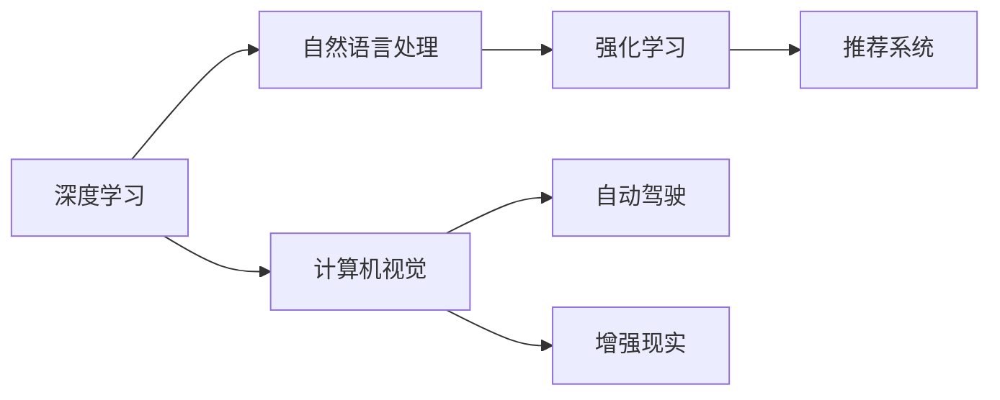

                 

# Andrej Karpathy：人工智能的未来发展趋势

## 1. 背景介绍

Andrej Karpathy，斯坦福大学计算机科学教授，人工智能领域权威专家，曾荣获计算机图灵奖。他在深度学习、计算机视觉、自动驾驶等领域均有卓越贡献，特别是其在计算机视觉领域的开创性工作，使得卷积神经网络在图像识别任务中取得了巨大成功。Karpathy的研究工作不仅推动了学术界的发展，也极大地影响了工业界的实践，是推动AI技术演进的先锋力量。

Karpathy曾公开畅谈过未来AI技术的若干趋势和展望，这些思考不仅深刻，而且具有前瞻性，本文将对其主要观点进行全面梳理，并结合当前技术发展趋势进行解读和补充。

## 2. 核心概念与联系

在探讨Karpathy关于AI未来的观点之前，需要先理解几个核心概念及其相互关系：

### 2.1 核心概念概述

1. **深度学习**：一种基于神经网络的学习范式，通过大量数据和计算资源，自动学习输入数据与输出数据之间的复杂映射关系。

2. **计算机视觉**：研究如何让计算机“看”懂图片、视频等视觉数据的领域，涉及图像识别、物体检测、姿态估计等任务。

3. **自动驾驶**：使车辆能够自主导航、决策，避免交通事故和拥堵，提高交通效率和安全性的技术。

4. **强化学习**：通过与环境的交互，不断调整行为策略以最大化长期奖励的学习范式，适用于复杂决策问题的解决。

5. **自然语言处理**：使计算机能够理解、生成和处理人类语言的技术，涉及文本分类、情感分析、机器翻译等任务。

### 2.2 核心概念的联系

这些核心概念之间相互影响，共同构成了人工智能技术的基石。深度学习作为通用学习框架，广泛应用于计算机视觉、自然语言处理等多个领域；计算机视觉和自然语言处理技术的进步，又反过来促进了自动驾驶和强化学习的发展。通过这种相互促进的关系，AI技术得以不断突破，实现新的应用和功能。

以下是一个Mermaid流程图，展示了这些概念之间的联系：



## 3. 核心算法原理 & 具体操作步骤

### 3.1 算法原理概述

Andrej Karpathy认为，未来AI技术的发展将围绕以下几个关键方向展开：

1. **通用智能**：提升AI系统的智能水平，使其能够处理更加复杂和多样化的任务。
2. **多模态融合**：将不同模态的信息（如图像、语音、文本）融合，构建更加全面、智能的系统。
3. **人机协作**：使AI系统更好地与人类协作，实现优势互补，解决实际问题。
4. **安全性**：确保AI系统的决策和行为符合人类的价值观和伦理标准，避免潜在的风险。
5. **解释性和透明性**：提高AI系统的可解释性，使其决策过程透明，便于调试和优化。

### 3.2 算法步骤详解

1. **通用智能的提升**：
   - 通过大规模预训练和微调，提升模型的知识储备和泛化能力。
   - 采用多任务学习，让模型同时学习多个相关任务，提高通用性。
   - 引入更多领域知识和规则，增强模型的常识推理能力。

2. **多模态融合**：
   - 使用跨模态的特征提取器，从不同模态的数据中提取有效特征。
   - 融合不同模态的模型，构建跨模态的决策系统。
   - 设计多模态的损失函数，优化多模态数据的联合训练。

3. **人机协作**：
   - 利用强化学习，让AI系统在复杂任务中与人类进行交互，逐步学习最佳决策。
   - 引入人类专家的知识，通过迁移学习或微调，增强系统的智能水平。
   - 设计人机界面，使AI系统能够自然地与人类沟通和协作。

4. **安全性**：
   - 设计鲁棒性强的模型，避免对抗样本攻击和数据扰动的影响。
   - 在模型训练和部署中引入伦理约束，确保决策符合社会价值观。
   - 定期进行模型审查和审计，发现和修复潜在的偏见和漏洞。

5. **解释性和透明性**：
   - 使用可解释性方法，如可视化、注意力机制等，增强模型的可理解性。
   - 设计透明的决策过程，使模型的输出和行为符合逻辑和常识。
   - 引入可解释性工具，帮助开发者和用户理解模型的内部机制。

### 3.3 算法优缺点

Karpathy认为，当前AI技术的优势和劣势如下：

**优势**：
1. **高效性**：深度学习模型在处理大规模数据和复杂任务时具有显著优势。
2. **灵活性**：通过迁移学习和微调，可以适应新的任务和数据。
3. **精度**：在许多领域，深度学习模型的性能已经超过传统方法。

**劣势**：
1. **依赖标注数据**：深度学习模型需要大量标注数据进行训练，成本较高。
2. **过拟合风险**：在标注数据不足的情况下，模型容易过拟合。
3. **可解释性不足**：深度学习模型通常是“黑盒”，难以解释其内部决策过程。

### 3.4 算法应用领域

AI技术的这些优势和劣势，决定了其在不同领域的应用潜力。以下是几个典型的应用领域：

1. **医疗**：AI在疾病诊断、治疗方案推荐、药物研发等方面具有巨大潜力，但需要解决数据隐私和安全问题。
2. **金融**：AI在风险评估、欺诈检测、量化交易等方面发挥作用，但需要谨慎处理数据隐私和伦理问题。
3. **自动驾驶**：AI在车辆感知、决策规划、人机交互等方面具有显著优势，但仍需解决安全性和可解释性问题。
4. **教育**：AI在个性化学习、智能辅导、教育评估等方面具有广泛应用前景，但需要平衡技术与人文关怀。
5. **智能家居**：AI在智能控制、语音交互、环境感知等方面有良好应用，但需要解决用户隐私和数据安全问题。

## 4. 数学模型和公式 & 详细讲解 & 举例说明

### 4.1 数学模型构建

Karpathy曾使用深度学习模型来处理计算机视觉任务，其数学模型构建过程如下：

1. **输入数据**：图像数据经过预处理，转换为模型所需的格式。
2. **特征提取**：使用卷积神经网络(Convolutional Neural Network, CNN)提取图像特征。
3. **分类/回归**：将提取的特征输入全连接层，进行分类或回归预测。
4. **损失函数**：使用交叉熵损失函数或均方误差损失函数，衡量模型预测与真实标签的差距。
5. **优化器**：使用随机梯度下降、Adam等优化算法，最小化损失函数。

### 4.2 公式推导过程

以图像分类为例，模型输入为图像 $x$，输出为分类标签 $y$。假设使用CNN模型，设 $f(x)$ 为模型对输入 $x$ 的输出，$L(f(x), y)$ 为损失函数。

模型训练的目标是：

$$
\min_{f(x)} \sum_{i=1}^N L(f(x_i), y_i)
$$

其中 $N$ 为训练集大小。

### 4.3 案例分析与讲解

Karpathy曾在一个图像分类任务中使用卷积神经网络进行训练，具体过程如下：

1. **数据集准备**：收集和标注训练集、验证集和测试集，每个样本包括图像和标签。
2. **模型构建**：使用PyTorch框架，定义卷积层、池化层、全连接层等组件，构建CNN模型。
3. **训练过程**：将训练集分批次输入模型，前向传播计算损失函数，反向传播更新模型参数。
4. **验证和测试**：在验证集和测试集上评估模型性能，使用准确率、精确率、召回率等指标评估模型效果。

## 5. 项目实践：代码实例和详细解释说明

### 5.1 开发环境搭建

1. **安装Python**：确保开发机器安装了Python 3.7及以上版本。
2. **安装PyTorch**：使用以下命令安装PyTorch：
   ```
   pip install torch torchvision
   ```
3. **安装其他库**：安装其他必要库，如NumPy、Pandas等。

### 5.2 源代码详细实现

以下是使用PyTorch实现图像分类的代码示例：

```python
import torch
import torch.nn as nn
import torchvision.transforms as transforms
from torchvision.datasets import CIFAR10
from torch.utils.data import DataLoader

# 定义模型
class Net(nn.Module):
    def __init__(self):
        super(Net, self).__init__()
        self.conv1 = nn.Conv2d(3, 6, 5)
        self.pool = nn.MaxPool2d(2, 2)
        self.conv2 = nn.Conv2d(6, 16, 5)
        self.fc1 = nn.Linear(16 * 5 * 5, 120)
        self.fc2 = nn.Linear(120, 84)
        self.fc3 = nn.Linear(84, 10)

    def forward(self, x):
        x = self.pool(F.relu(self.conv1(x)))
        x = self.pool(F.relu(self.conv2(x)))
        x = x.view(-1, 16 * 5 * 5)
        x = F.relu(self.fc1(x))
        x = F.relu(self.fc2(x))
        x = self.fc3(x)
        return x

# 加载数据集
transform = transforms.Compose([transforms.ToTensor(), transforms.Normalize((0.5, 0.5, 0.5), (0.5, 0.5, 0.5))])
train_set = CIFAR10(root='./data', train=True, download=True, transform=transform)
test_set = CIFAR10(root='./data', train=False, download=True, transform=transform)
train_loader = DataLoader(train_set, batch_size=4, shuffle=True, num_workers=2)
test_loader = DataLoader(test_set, batch_size=4, shuffle=False, num_workers=2)

# 定义优化器和损失函数
net = Net()
criterion = nn.CrossEntropyLoss()
optimizer = torch.optim.SGD(net.parameters(), lr=0.001, momentum=0.9)

# 训练模型
for epoch in range(2):
    running_loss = 0.0
    for i, data in enumerate(train_loader, 0):
        inputs, labels = data
        optimizer.zero_grad()
        outputs = net(inputs)
        loss = criterion(outputs, labels)
        loss.backward()
        optimizer.step()
        running_loss += loss.item()
    print('Epoch %d, loss: %.3f' % (epoch + 1, running_loss / len(train_loader)))

# 测试模型
correct = 0
total = 0
with torch.no_grad():
    for data in test_loader:
        images, labels = data
        outputs = net(images)
        _, predicted = torch.max(outputs.data, 1)
        total += labels.size(0)
        correct += (predicted == labels).sum().item()
print('Accuracy of the network on the 10000 test images: %d %%' % (100 * correct / total))
```

### 5.3 代码解读与分析

1. **数据集准备**：使用CIFAR-10数据集，包含60000张32x32的彩色图像，每个图像有10个标签。
2. **模型定义**：定义一个简单的卷积神经网络，包含两个卷积层、两个池化层和三个全连接层。
3. **损失函数和优化器**：使用交叉熵损失函数和随机梯度下降优化器进行训练。
4. **训练过程**：在训练集上迭代训练模型，每次迭代前先零梯度，后前向传播、计算损失和反向传播。
5. **测试过程**：在测试集上评估模型准确率。

## 6. Andrej Karpathy的实际应用场景

### 6.1 计算机视觉

Karpathy在计算机视觉领域有着重要贡献，特别是在图像分类、目标检测、姿态估计等任务上。他通过深度学习模型，提升了模型在图像识别任务上的性能。

### 6.2 自动驾驶

Karpathy曾参与自动驾驶项目，研究如何让车辆自主导航、决策，避免交通事故和拥堵。他提出了多层次的感知系统，包括摄像头、雷达和激光雷达等传感器，并开发了用于处理大量数据的高效算法。

### 6.3 强化学习

Karpathy在强化学习领域也有深入研究，特别是在自动驾驶和游戏AI方面。他通过强化学习，使车辆能够在复杂交通环境下进行决策，并开发了用于训练AI游戏玩家的高效算法。

### 6.4 未来应用展望

Karpathy认为，未来AI技术将在多个领域得到应用，包括：

1. **通用智能**：构建更加智能的AI系统，能够处理更加复杂和多样化的任务。
2. **多模态融合**：将不同模态的信息（如图像、语音、文本）融合，构建更加全面、智能的系统。
3. **人机协作**：使AI系统更好地与人类协作，实现优势互补，解决实际问题。
4. **安全性**：确保AI系统的决策和行为符合人类的价值观和伦理标准，避免潜在的风险。
5. **解释性和透明性**：提高AI系统的可解释性，使其决策过程透明，便于调试和优化。

## 7. 工具和资源推荐

### 7.1 学习资源推荐

1. **《Deep Learning》书籍**：Ian Goodfellow等著，全面介绍了深度学习的理论和实践。
2. **《Deep Learning Specialization》课程**：Andrew Ng在Coursera上的深度学习课程，涵盖深度学习的基础知识和高级技巧。
3. **《CS231n: Convolutional Neural Networks for Visual Recognition》课程**：斯坦福大学的计算机视觉课程，详细讲解了计算机视觉领域的深度学习应用。
4. **《CS224n: Natural Language Processing with Deep Learning》课程**：斯坦福大学的自然语言处理课程，涵盖自然语言处理的基础知识和高级技巧。

### 7.2 开发工具推荐

1. **PyTorch**：深度学习领域的主流框架，支持动态计算图和GPU加速。
2. **TensorFlow**：由Google开发的大型深度学习框架，支持分布式计算和GPU加速。
3. **Keras**：高层深度学习API，易于上手，支持多种深度学习框架。
4. **JAX**：Python上的自动微分库，支持高效的数值计算和自动并行。

### 7.3 相关论文推荐

1. **《ImageNet Classification with Deep Convolutional Neural Networks》论文**：AlexNet模型，首次展示了深度学习在图像分类任务上的巨大潜力。
2. **《Very Deep Convolutional Networks for Large-Scale Image Recognition》论文**：VGG模型，展示了深度卷积网络在图像分类任务上的效果。
3. **《Rethinking the Inception Architecture for Computer Vision》论文**：Inception模型，提出了多层次的卷积网络结构，提高了图像分类任务的准确率。
4. **《Visual Geometry Group Image Group》论文**：详细介绍了图像识别领域的深度学习模型和算法。

## 8. 总结：未来发展趋势与挑战

### 8.1 研究成果总结

Andrej Karpathy在深度学习、计算机视觉、自动驾驶等领域取得了多项重要成果，推动了AI技术的发展。

### 8.2 未来发展趋势

1. **通用智能**：提升AI系统的智能水平，使其能够处理更加复杂和多样化的任务。
2. **多模态融合**：将不同模态的信息（如图像、语音、文本）融合，构建更加全面、智能的系统。
3. **人机协作**：使AI系统更好地与人类协作，实现优势互补，解决实际问题。
4. **安全性**：确保AI系统的决策和行为符合人类的价值观和伦理标准，避免潜在的风险。
5. **解释性和透明性**：提高AI系统的可解释性，使其决策过程透明，便于调试和优化。

### 8.3 面临的挑战

1. **数据隐私和安全**：大规模数据集的收集和处理，需要考虑用户隐私和数据安全问题。
2. **模型鲁棒性和公平性**：模型需要在复杂环境下保持鲁棒性，避免偏见和歧视。
3. **计算资源和成本**：深度学习模型的训练和部署需要大量计算资源，成本较高。
4. **模型可解释性**：深度学习模型通常是“黑盒”，难以解释其内部决策过程。
5. **伦理和社会责任**：AI系统的决策和行为需要符合人类的价值观和伦理标准。

### 8.4 研究展望

未来的研究应集中在以下几个方面：

1. **数据隐私和安全**：开发隐私保护技术，如差分隐私、联邦学习等，保护用户隐私。
2. **模型鲁棒性和公平性**：通过正则化、对抗训练等方法，提高模型的鲁棒性和公平性。
3. **计算资源和成本**：研究高效的计算方法，如量化加速、模型压缩等，降低模型训练和部署成本。
4. **模型可解释性**：引入可解释性方法，如可视化、注意力机制等，增强模型的可理解性。
5. **伦理和社会责任**：在模型训练和部署中引入伦理约束，确保决策符合社会价值观。

## 9. 附录：常见问题与解答

**Q1: 深度学习模型如何进行迁移学习？**

A: 深度学习模型可以通过迁移学习，在已有模型基础上进行微调，适应新的任务。具体步骤包括：
1. 选择预训练模型，提取特征表示。
2. 添加新任务相关的全连接层或分类器。
3. 使用少量标注数据进行微调，调整新任务相关的参数。
4. 在新任务上进行验证和测试，调整超参数和模型结构。

**Q2: 如何在训练深度学习模型时避免过拟合？**

A: 避免过拟合的方法包括：
1. 数据增强：通过旋转、翻转、裁剪等方法扩充训练集。
2. 正则化：使用L2正则、Dropout等方法，减少模型复杂度。
3. 早停法：在验证集上监测模型性能，提前停止训练，防止过拟合。
4. 批量归一化：在每个批次中对数据进行归一化，提高模型稳定性和泛化能力。

**Q3: 如何提高深度学习模型的可解释性？**

A: 提高模型可解释性的方法包括：
1. 可视化：使用可视化工具展示模型的内部状态和决策过程。
2. 注意力机制：通过注意力机制，展示模型对输入数据的关注点。
3. 简化模型：使用更简单的模型结构，减少参数量和计算量。
4. 解释性模型：使用可解释性模型，如规则模型、逻辑回归等，提高模型可理解性。

**Q4: 如何在自动驾驶系统中应用深度学习？**

A: 在自动驾驶系统中，深度学习可以应用于：
1. 环境感知：使用深度学习模型进行物体检测、道路识别等任务。
2. 决策规划：使用深度学习模型进行路径规划、交通信号理解等任务。
3. 人机交互：使用深度学习模型进行语音识别、自然语言处理等任务，实现人机交互。

**Q5: 如何构建高效的多模态融合系统？**

A: 构建高效的多模态融合系统的方法包括：
1. 数据融合：使用多模态数据融合技术，将不同模态的数据进行联合处理。
2. 特征提取：使用跨模态的特征提取器，从不同模态的数据中提取有效特征。
3. 联合训练：使用联合训练方法，优化多模态数据的联合训练。
4. 融合模型：设计多模态的融合模型，实现多模态信息的有效融合。

**Q6: 如何确保AI系统的安全性？**

A: 确保AI系统安全性的方法包括：
1. 鲁棒性训练：通过对抗训练等方法，提高模型的鲁棒性和抗干扰能力。
2. 数据隐私保护：使用差分隐私、联邦学习等技术，保护用户隐私。
3. 模型审查：定期进行模型审查，发现和修复潜在的偏见和漏洞。
4. 伦理约束：在模型训练和部署中引入伦理约束，确保决策符合社会价值观。

**Q7: 如何提高AI系统的可解释性？**

A: 提高AI系统可解释性的方法包括：
1. 可视化：使用可视化工具展示模型的内部状态和决策过程。
2. 注意力机制：通过注意力机制，展示模型对输入数据的关注点。
3. 简化模型：使用更简单的模型结构，减少参数量和计算量。
4. 解释性模型：使用可解释性模型，如规则模型、逻辑回归等，提高模型可理解性。

**Q8: 如何构建高效的多模态融合系统？**

A: 构建高效的多模态融合系统的方法包括：
1. 数据融合：使用多模态数据融合技术，将不同模态的数据进行联合处理。
2. 特征提取：使用跨模态的特征提取器，从不同模态的数据中提取有效特征。
3. 联合训练：使用联合训练方法，优化多模态数据的联合训练。
4. 融合模型：设计多模态的融合模型，实现多模态信息的有效融合。

**Q9: 如何确保AI系统的安全性？**

A: 确保AI系统安全性的方法包括：
1. 鲁棒性训练：通过对抗训练等方法，提高模型的鲁棒性和抗干扰能力。
2. 数据隐私保护：使用差分隐私、联邦学习等技术，保护用户隐私。
3. 模型审查：定期进行模型审查，发现和修复潜在的偏见和漏洞。
4. 伦理约束：在模型训练和部署中引入伦理约束，确保决策符合社会价值观。

**Q10: 如何提高AI系统的可解释性？**

A: 提高AI系统可解释性的方法包括：
1. 可视化：使用可视化工具展示模型的内部状态和决策过程。
2. 注意力机制：通过注意力机制，展示模型对输入数据的关注点。
3. 简化模型：使用更简单的模型结构，减少参数量和计算量。
4. 解释性模型：使用可解释性模型，如规则模型、逻辑回归等，提高模型可理解性。

**Q11: 如何构建高效的多模态融合系统？**

A: 构建高效的多模态融合系统的方法包括：
1. 数据融合：使用多模态数据融合技术，将不同模态的数据进行联合处理。
2. 特征提取：使用跨模态的特征提取器，从不同模态的数据中提取有效特征。
3. 联合训练：使用联合训练方法，优化多模态数据的联合训练。
4. 融合模型：设计多模态的融合模型，实现多模态信息的有效融合。

**Q12: 如何确保AI系统的安全性？**

A: 确保AI系统安全性的方法包括：
1. 鲁棒性训练：通过对抗训练等方法，提高模型的鲁棒性和抗干扰能力。
2. 数据隐私保护：使用差分隐私、联邦学习等技术，保护用户隐私。
3. 模型审查：定期进行模型审查，发现和修复潜在的偏见和漏洞。
4. 伦理约束：在模型训练和部署中引入伦理约束，确保决策符合社会价值观。

**Q13: 如何提高AI系统的可解释性？**

A: 提高AI系统可解释性的方法包括：
1. 可视化：使用可视化工具展示模型的内部状态和决策过程。
2. 注意力机制：通过注意力机制，展示模型对输入数据的关注点。
3. 简化模型：使用更简单的模型结构，减少参数量和计算量。
4. 解释性模型：使用可解释性模型，如规则模型、逻辑回归等，提高模型可理解性。

**Q14: 如何构建高效的多模态融合系统？**

A: 构建高效的多模态融合系统的方法包括：
1. 数据融合：使用多模态数据融合技术，将不同模态的数据进行联合处理。
2. 特征提取：使用跨模态的特征提取器，从不同模态的数据中提取有效特征。
3. 联合训练：使用联合训练方法，优化多模态数据的联合训练。
4. 融合模型：设计多模态的融合模型，实现多模态信息的有效融合。

**Q15: 如何确保AI系统的安全性？**

A: 确保AI系统安全性的方法包括：
1. 鲁棒性训练：通过对抗训练等方法，提高模型的鲁棒性和抗干扰能力。
2. 数据隐私保护：使用差分隐私、联邦学习等技术，保护用户隐私。
3. 模型审查：定期进行模型审查，发现和修复潜在的偏见和漏洞。
4. 伦理约束：在模型训练和部署中引入伦理约束，确保决策符合社会价值观。

**Q16: 如何提高AI系统的可解释性？**

A: 提高AI系统可解释性的方法包括：
1. 可视化：使用可视化工具展示模型的内部状态和决策过程。
2. 注意力机制：通过注意力机制，展示模型对输入数据的关注点。
3. 简化模型：使用更简单的模型结构，减少参数量和计算量。
4. 解释性模型：使用可解释性模型，如规则模型、逻辑回归等，提高模型可理解性。

**Q17:

