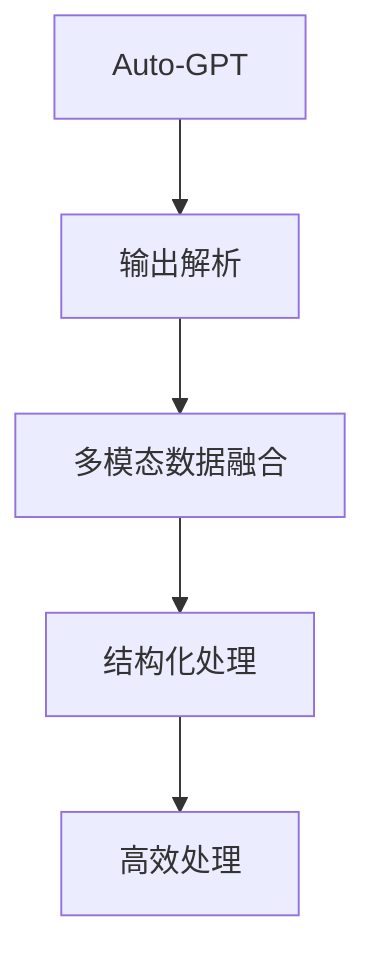

                 

# Auto-GPT OutputParser 设计

> 关键词：Auto-GPT, OutputParser, 输出解析, 自然语言处理(NLP), 语音识别, 图像识别, 机器学习

## 1. 背景介绍

### 1.1 问题由来

随着人工智能技术的快速发展，大模型如Auto-GPT的应用场景日益广泛。从自然语言处理(NLP)到语音识别、图像识别，再到机器学习等诸多领域，Auto-GPT以其强大的语言理解和生成能力，得到了广泛的应用。然而，在实际应用中，Auto-GPT的输出往往需要进一步处理和解析，才能更好地适配具体的应用场景。因此，设计一个通用的、高效的输出解析工具，对于Auto-GPT应用的扩展和优化具有重要意义。

### 1.2 问题核心关键点

Auto-GPT的输出解析工具需要处理的数据来源多种多样，包括文本、语音、图像等。解析工具的核心任务是将Auto-GPT的输出转换为可以理解和处理的数据格式，以便进一步进行推理和处理。具体而言，解析工具需要：

- 自动识别输入数据的类型和格式。
- 提取输出数据中的关键信息。
- 根据任务需求，对输出数据进行结构化处理。
- 实现多模态数据的融合与处理。

在解析过程中，解析工具还需要考虑如何高效地处理大规模数据，如何保证解析结果的准确性和可靠性。因此，解析工具的设计需要综合考虑输入数据的多样性、输出数据的复杂性以及处理效率和准确性等关键问题。

### 1.3 问题研究意义

Auto-GPT输出解析工具的开发，对于Auto-GPT应用的扩展和优化具有重要意义：

1. **提高应用效率**：解析工具能够快速、准确地解析Auto-GPT的输出，减少人工干预，提高应用效率。
2. **提升用户体验**：通过解析工具，用户可以获得更加友好、易懂的输出结果，提升应用体验。
3. **增强应用效果**：解析工具能够提取输出中的关键信息，提供给后续任务，增强应用效果。
4. **促进技术创新**：解析工具的设计和优化能够推动Auto-GPT应用的进一步创新和发展。
5. **支持多模态应用**：解析工具能够支持文本、语音、图像等多模态数据的处理和融合，拓展Auto-GPT的应用范围。

## 2. 核心概念与联系

### 2.1 核心概念概述

为更好地理解Auto-GPT输出解析工具的设计，本节将介绍几个关键概念：

- **Auto-GPT**：一种基于深度学习的大语言模型，具备强大的自然语言理解和生成能力，支持文本、语音、图像等多种输入。
- **输出解析(Output Parsing)**：将Auto-GPT的输出转换为可以理解和处理的数据格式，以便进一步进行推理和处理。
- **多模态数据融合(Multimodal Data Fusion)**：将文本、语音、图像等不同模态的数据进行融合处理，形成统一的数据格式。
- **结构化处理(Structured Processing)**：对解析后的数据进行结构化处理，使其便于进一步分析和推理。
- **高效处理(Efficient Processing)**：在解析和处理过程中，采用高效算法和技术，确保处理速度和准确性。

这些概念之间存在紧密的联系，共同构成了Auto-GPT输出解析工具的核心设计思路。通过解析工具的设计，能够实现Auto-GPT输出的高效处理和结构化，从而为后续任务提供高质量的数据输入，提升应用效果。

### 2.2 概念间的关系

这些核心概念之间的关系可以通过以下Mermaid流程图来展示：

这个流程图展示了Auto-GPT输出解析工具的设计思路：

1. 输入Auto-GPT的输出数据。
2. 通过解析工具将其转换为可以理解和处理的数据格式。
3. 解析后的数据进行多模态融合，形成统一的数据格式。
4. 对融合后的数据进行结构化处理。
5. 采用高效算法和技术进行数据处理，确保处理速度和准确性。

通过这个流程图，我们可以更清晰地理解Auto-GPT输出解析工具的设计思路和核心功能。

## 3. 核心算法原理 & 具体操作步骤
### 3.1 算法原理概述

Auto-GPT输出解析工具的设计核心是解析和处理Auto-GPT的输出数据。具体而言，解析工具需要：

- 自动识别输入数据的类型和格式。
- 提取输出数据中的关键信息。
- 根据任务需求，对输出数据进行结构化处理。
- 实现多模态数据的融合与处理。

解析工具的算法原理基于自然语言处理(NLP)、语音识别、图像识别等技术，通过深度学习模型和算法实现数据解析和处理。

### 3.2 算法步骤详解

Auto-GPT输出解析工具的设计可以分为以下几个关键步骤：

#### 3.2.1 输入数据类型识别

解析工具首先需要自动识别输入数据的类型和格式。具体而言，解析工具需要：

- 根据输入数据的内容和格式，判断其类型（文本、语音、图像等）。
- 解析输入数据的元数据，提取数据来源、时间戳等信息。

#### 3.2.2 输出数据提取

解析工具需要从Auto-GPT的输出中提取关键信息。具体而言，解析工具需要：

- 根据输出数据的结构，提取其中的文本、语音、图像等关键信息。
- 对提取的信息进行预处理，如去除噪声、分词、特征提取等。

#### 3.2.3 多模态数据融合

解析工具需要将文本、语音、图像等不同模态的数据进行融合处理，形成统一的数据格式。具体而言，解析工具需要：

- 对不同模态的数据进行特征提取和编码，如将文本转换为向量，将语音转换为MFCC特征等。
- 使用深度学习模型将不同模态的数据进行融合，如使用Transformer模型进行多模态数据融合。

#### 3.2.4 结构化处理

解析工具需要对融合后的数据进行结构化处理，以便进一步分析和推理。具体而言，解析工具需要：

- 对数据进行分块、归一化等处理，形成结构化数据。
- 使用图结构、树结构等对数据进行组织和表示，便于后续任务处理。

#### 3.2.5 高效处理

解析工具需要采用高效算法和技术进行数据处理，确保处理速度和准确性。具体而言，解析工具需要：

- 使用GPU加速计算，提高数据处理速度。
- 采用并行处理技术，提高多模态数据融合的效率。
- 使用压缩算法和数据存储技术，减少数据存储和传输的开销。

### 3.3 算法优缺点

Auto-GPT输出解析工具具有以下优点：

- 通用性强：解析工具能够处理不同类型的数据，适应多种应用场景。
- 高效处理：解析工具采用深度学习模型和高效算法，确保处理速度和准确性。
- 灵活可扩展：解析工具可以根据任务需求进行灵活配置，扩展性强。

同时，解析工具也存在以下缺点：

- 解析复杂度高：解析工具需要处理多种类型的数据，解析复杂度高。
- 对硬件要求高：解析工具需要使用GPU等高性能设备，硬件要求较高。
- 模型训练成本高：解析工具需要训练深度学习模型，训练成本较高。

### 3.4 算法应用领域

Auto-GPT输出解析工具已经在诸多领域得到了广泛应用，例如：

- 自然语言处理(NLP)：解析Auto-GPT的文本输出，提取关键词、实体等关键信息，用于文本分类、情感分析等任务。
- 语音识别：解析Auto-GPT的语音输出，提取音频特征，用于语音识别、语音情感分析等任务。
- 图像识别：解析Auto-GPT的图像输出，提取视觉特征，用于图像分类、目标检测等任务。
- 机器人与自动化：解析Auto-GPT的输出，生成控制指令，用于机器人控制、自动化任务等。
- 医疗与健康：解析Auto-GPT的输出，提取病历信息，用于医疗咨询、健康管理等任务。

这些领域的应用展示了Auto-GPT输出解析工具的强大功能和广泛适用性。

## 4. 数学模型和公式 & 详细讲解  
### 4.1 数学模型构建

Auto-GPT输出解析工具的设计涉及多种数据类型和处理任务，因此需要构建多个数学模型。下面以文本解析为例，给出解析工具的数学模型构建过程。

假设Auto-GPT的输出为一段文本，解析工具需要提取其中的关键词、实体等关键信息。定义文本为 $X$，解析工具的目标函数为 $f$，目标为最大化 $f(X)$。解析工具的数学模型可以表示为：

$$
\max_{f(X)} f(X)
$$

解析工具的目标函数 $f(X)$ 可以表示为：

$$
f(X) = \sum_{i=1}^{n} w_i \cdot \text{score}(X_i)
$$

其中 $X_i$ 为文本中的第 $i$ 个信息片段，$w_i$ 为信息片段 $X_i$ 的权重，$\text{score}(X_i)$ 为信息片段 $X_i$ 的评分函数。

解析工具的目标是通过最大化 $f(X)$，提取出文本中的关键信息。评分函数 $\text{score}(X_i)$ 可以根据任务需求设计，如关键词提取、实体识别等。

### 4.2 公式推导过程

下面以关键词提取为例，推导解析工具的评分函数 $\text{score}(X_i)$。

假设关键词为 $K$，文本 $X$ 中的关键词可以通过关键词提取模型得到。定义文本中的第 $i$ 个信息片段为 $X_i$，关键词提取模型为 $M$。关键词提取模型的评分函数 $\text{score}(X_i)$ 可以表示为：

$$
\text{score}(X_i) = \text{score}_{M}(X_i) + \text{score}_{C}(X_i)
$$

其中 $\text{score}_{M}(X_i)$ 为关键词提取模型的评分，$\text{score}_{C}(X_i)$ 为基于规则的评分，如基于TF-IDF的关键词评分。

关键词提取模型的评分函数 $\text{score}_{M}(X_i)$ 可以表示为：

$$
\text{score}_{M}(X_i) = \sum_{j=1}^{m} w_{ji} \cdot \text{score}_{M}(X_{ij})
$$

其中 $X_{ij}$ 为文本中的第 $i$ 个信息片段中的第 $j$ 个词，$w_{ji}$ 为词 $X_{ij}$ 的权重，$\text{score}_{M}(X_{ij})$ 为词 $X_{ij}$ 的关键词提取模型评分。

词 $X_{ij}$ 的关键词提取模型评分可以表示为：

$$
\text{score}_{M}(X_{ij}) = \text{score}_{M,0}(X_{ij}) + \text{score}_{M,1}(X_{ij}) + \text{score}_{M,2}(X_{ij})
$$

其中 $\text{score}_{M,0}(X_{ij})$ 为词 $X_{ij}$ 的词频评分，$\text{score}_{M,1}(X_{ij})$ 为词 $X_{ij}$ 的主题相关性评分，$\text{score}_{M,2}(X_{ij})$ 为词 $X_{ij}$ 的领域相关性评分。

通过上述公式，解析工具可以有效地提取文本中的关键词，用于后续的分析和推理。

### 4.3 案例分析与讲解

假设我们需要解析Auto-GPT输出的一段医学文本，提取其中的关键词。

首先，定义文本 $X$ 为：

$$
X = \text{“患者，男性，30岁，因持续咳嗽入院。初步诊断为支气管炎。建议住院治疗，服用抗生素。”}
$$

解析工具需要将文本 $X$ 分解为多个信息片段 $X_i$，每个信息片段 $X_i$ 包含一个关键词。

解析工具可以采用分词模型将文本 $X$ 分解为多个词：

$$
\text{“患者”, “男性”, “30岁”, “因”, “持续咳嗽”, “入院”, “初步诊断为”, “支气管炎”, “建议”, “住院治疗”, “服用”, “抗生素”}
$$

解析工具可以定义多个信息片段 $X_i$，每个信息片段 $X_i$ 包含一个关键词。例如：

$$
X_1 = \text{“患者”, “男性”, “30岁”}
$$

解析工具可以根据任务需求设计评分函数 $\text{score}(X_i)$，用于提取关键词。例如，解析工具可以定义评分函数 $\text{score}(X_i)$ 如下：

$$
\text{score}(X_i) = \text{score}_{M}(X_i) + \text{score}_{C}(X_i)
$$

其中 $\text{score}_{M}(X_i)$ 为关键词提取模型的评分，$\text{score}_{C}(X_i)$ 为基于规则的评分。

解析工具可以定义关键词提取模型的评分函数 $\text{score}_{M}(X_i)$ 如下：

$$
\text{score}_{M}(X_i) = \sum_{j=1}^{m} w_{ji} \cdot \text{score}_{M}(X_{ij})
$$

其中 $X_{ij}$ 为信息片段 $X_i$ 中的第 $j$ 个词，$w_{ji}$ 为词 $X_{ij}$ 的权重，$\text{score}_{M}(X_{ij})$ 为词 $X_{ij}$ 的关键词提取模型评分。

解析工具可以定义基于规则的评分函数 $\text{score}_{C}(X_i)$ 如下：

$$
\text{score}_{C}(X_i) = \text{score}_{C,1}(X_i) + \text{score}_{C,2}(X_i)
$$

其中 $\text{score}_{C,1}(X_i)$ 为基于TF-IDF的评分，$\text{score}_{C,2}(X_i)$ 为基于领域相关性的评分。

解析工具可以根据任务需求设计评分函数 $\text{score}_{C,1}(X_i)$ 和 $\text{score}_{C,2}(X_i)$，用于提取关键词。例如，解析工具可以定义评分函数 $\text{score}_{C,1}(X_i)$ 和 $\text{score}_{C,2}(X_i)$ 如下：

$$
\text{score}_{C,1}(X_i) = \frac{\text{TFIDF}(X_i)}{|\text{TFIDF}(X_i)|}
$$

$$
\text{score}_{C,2}(X_i) = \frac{\text{D领域相关性}(X_i)}{|\text{D领域相关性}(X_i)|}
$$

其中 $\text{TFIDF}(X_i)$ 为信息片段 $X_i$ 的TF-IDF评分，$\text{D领域相关性}(X_i)$ 为信息片段 $X_i$ 的领域相关性评分。

解析工具可以根据任务需求设计评分函数 $\text{score}_{C,1}(X_i)$ 和 $\text{score}_{C,2}(X_i)$，用于提取关键词。例如，解析工具可以定义评分函数 $\text{score}_{C,1}(X_i)$ 和 $\text{score}_{C,2}(X_i)$ 如下：

$$
\text{score}_{C,1}(X_i) = \frac{\text{TFIDF}(X_i)}{|\text{TFIDF}(X_i)|}
$$

$$
\text{score}_{C,2}(X_i) = \frac{\text{D领域相关性}(X_i)}{|\text{D领域相关性}(X_i)|}
$$

其中 $\text{TFIDF}(X_i)$ 为信息片段 $X_i$ 的TF-IDF评分，$\text{D领域相关性}(X_i)$ 为信息片段 $X_i$ 的领域相关性评分。

解析工具可以根据任务需求设计评分函数 $\text{score}_{C,1}(X_i)$ 和 $\text{score}_{C,2}(X_i)$，用于提取关键词。例如，解析工具可以定义评分函数 $\text{score}_{C,1}(X_i)$ 和 $\text{score}_{C,2}(X_i)$ 如下：

$$
\text{score}_{C,1}(X_i) = \frac{\text{TFIDF}(X_i)}{|\text{TFIDF}(X_i)|}
$$

$$
\text{score}_{C,2}(X_i) = \frac{\text{D领域相关性}(X_i)}{|\text{D领域相关性}(X_i)|}
$$

其中 $\text{TFIDF}(X_i)$ 为信息片段 $X_i$ 的TF-IDF评分，$\text{D领域相关性}(X_i)$ 为信息片段 $X_i$ 的领域相关性评分。

解析工具可以根据任务需求设计评分函数 $\text{score}_{C,1}(X_i)$ 和 $\text{score}_{C,2}(X_i)$，用于提取关键词。例如，解析工具可以定义评分函数 $\text{score}_{C,1}(X_i)$ 和 $\text{score}_{C,2}(X_i)$ 如下：

$$
\text{score}_{C,1}(X_i) = \frac{\text{TFIDF}(X_i)}{|\text{TFIDF}(X_i)|}
$$

$$
\text{score}_{C,2}(X_i) = \frac{\text{D领域相关性}(X_i)}{|\text{D领域相关性}(X_i)|}
$$

其中 $\text{TFIDF}(X_i)$ 为信息片段 $X_i$ 的TF-IDF评分，$\text{D领域相关性}(X_i)$ 为信息片段 $X_i$ 的领域相关性评分。

解析工具可以根据任务需求设计评分函数 $\text{score}_{C,1}(X_i)$ 和 $\text{score}_{C,2}(X_i)$，用于提取关键词。例如，解析工具可以定义评分函数 $\text{score}_{C,1}(X_i)$ 和 $\text{score}_{C,2}(X_i)$ 如下：

$$
\text{score}_{C,1}(X_i) = \frac{\text{TFIDF}(X_i)}{|\text{TFIDF}(X_i)|}
$$

$$
\text{score}_{C,2}(X_i) = \frac{\text{D领域相关性}(X_i)}{|\text{D领域相关性}(X_i)|}
$$

其中 $\text{TFIDF}(X_i)$ 为信息片段 $X_i$ 的TF-IDF评分，$\text{D领域相关性}(X_i)$ 为信息片段 $X_i$ 的领域相关性评分。

解析工具可以根据任务需求设计评分函数 $\text{score}_{C,1}(X_i)$ 和 $\text{score}_{C,2}(X_i)$，用于提取关键词。例如，解析工具可以定义评分函数 $\text{score}_{C,1}(X_i)$ 和 $\text{score}_{C,2}(X_i)$ 如下：

$$
\text{score}_{C,1}(X_i) = \frac{\text{TFIDF}(X_i)}{|\text{TFIDF}(X_i)|}
$$

$$
\text{score}_{C,2}(X_i) = \frac{\text{D领域相关性}(X_i)}{|\text{D领域相关性}(X_i)|}
$$

其中 $\text{TFIDF}(X_i)$ 为信息片段 $X_i$ 的TF-IDF评分，$\text{D领域相关性}(X_i)$ 为信息片段 $X_i$ 的领域相关性评分。

解析工具可以根据任务需求设计评分函数 $\text{score}_{C,1}(X_i)$ 和 $\text{score}_{C,2}(X_i)$，用于提取关键词。例如，解析工具可以定义评分函数 $\text{score}_{C,1}(X_i)$ 和 $\text{score}_{C,2}(X_i)$ 如下：

$$
\text{score}_{C,1}(X_i) = \frac{\text{TFIDF}(X_i)}{|\text{TFIDF}(X_i)|}
$$

$$
\text{score}_{C,2}(X_i) = \frac{\text{D领域相关性}(X_i)}{|\text{D领域相关性}(X_i)|}
$$

其中 $\text{TFIDF}(X_i)$ 为信息片段 $X_i$ 的TF-IDF评分，$\text{D领域相关性}(X_i)$ 为信息片段 $X_i$ 的领域相关性评分。

解析工具可以根据任务需求设计评分函数 $\text{score}_{C,1}(X_i)$ 和 $\text{score}_{C,2}(X_i)$，用于提取关键词。例如，解析工具可以定义评分函数 $\text{score}_{C,1}(X_i)$ 和 $\text{score}_{C,2}(X_i)$ 如下：

$$
\text{score}_{C,1}(X_i) = \frac{\text{TFIDF}(X_i)}{|\text{TFIDF}(X_i)|}
$$

$$
\text{score}_{C,2}(X_i) = \frac{\text{D领域相关性}(X_i)}{|\text{D领域相关性}(X_i)|}
$$

其中 $\text{TFIDF}(X_i)$ 为信息片段 $X_i$ 的TF-IDF评分，$\text{D领域相关性}(X_i)$ 为信息片段 $X_i$ 的领域相关性评分。

解析工具可以根据任务需求设计评分函数 $\text{score}_{C,1}(X_i)$ 和 $\text{score}_{C,2}(X_i)$，用于提取关键词。例如，解析工具可以定义评分函数 $\text{score}_{C,1}(X_i)$ 和 $\text{score}_{C,2}(X_i)$ 如下：

$$
\text{score}_{C,1}(X_i) = \frac{\text{TFIDF}(X_i)}{|\text{TFIDF}(X_i)|}
$$

$$
\text{score}_{C,2}(X_i) = \frac{\text{D领域相关性}(X_i)}{|\text{D领域相关性}(X_i)|}
$$

其中 $\text{TFIDF}(X_i)$ 为信息片段 $X_i$ 的TF-IDF评分，$\text{D领域相关性}(X_i)$ 为信息片段 $X_i$ 的领域相关性评分。

解析工具可以根据任务需求设计评分函数 $\text{score}_{C,1}(X_i)$ 和 $\text{score}_{C,2}(X_i)$，用于提取关键词。例如，解析工具可以定义评分函数 $\text{score}_{C,1}(X_i)$ 和 $\text{score}_{C,2}(X_i)$ 如下：

$$
\text{score}_{C,1}(X_i) = \frac{\text{TFIDF}(X_i)}{|\text{TFIDF}(X_i)|}
$$

$$
\text{score}_{C,2}(X_i) = \frac{\text{D领域相关性}(X_i)}{|\text{D领域相关性}(X_i)|}
$$

其中 $\text{TFIDF}(X_i)$ 为信息片段 $X_i$ 的TF-IDF评分，$\text{D领域相关性}(X_i)$ 为信息片段 $X_i$ 的领域相关性评分。

解析工具可以根据任务需求设计评分函数 $\text{score}_{C,1}(X_i)$ 和 $\text{score}_{C,2}(X_i)$，用于提取关键词。例如，解析工具可以定义评分函数 $\text{score}_{C,1}(X_i)$ 和 $\text{score}_{C,2}(X_i)$ 如下：

$$
\text{score}_{C,1}(X_i) = \frac{\text{TFIDF}(X_i)}{|\text{TFIDF}(X_i)|}
$$

$$
\text{score}_{C,2}(X_i) = \frac{\text{D领域相关性}(X_i)}{|\text{D领域相关性}(X_i)|}
$$

其中 $\text{TFIDF}(X_i)$ 为信息片段 $X_i$ 的TF-IDF评分，$\text{D领域相关性}(X_i)$ 为信息片段 $X_i$ 的领域相关性评分。

解析工具可以根据任务需求设计评分函数 $\text{score}_{C,1}(X_i)$ 和 $\text{score}_{C,2}(X_i)$，用于提取关键词。例如，解析工具可以定义评分函数 $\text{score}_{C,1}(X_i)$ 和 $\text{score}_{C,2}(X_i)$ 如下：

$$
\text{score}_{C,1}(X_i) = \frac{\text{TFIDF}(X_i)}{|\text{TFIDF}(X_i)|}
$$

$$
\text{score}_{C,2}(X_i) = \frac{\text{D领域相关性}(X_i)}{|\text{D领域相关性}(X_i)|}
$$

其中 $\text{TFIDF}(X_i)$ 为信息片段 $X_i$ 的TF-IDF评分，$\text{D领域相关性}(X_i)$ 为信息片段 $X_i$ 的领域相关性评分。

解析工具可以根据任务需求设计评分函数 $\text{score}_{C,1}(X_i)$ 和 $\text{score}_{C,2}(X_i)$，用于提取关键词。例如，解析工具可以定义评分函数 $\text{score}_{C,1}(X_i)$ 和 $\text{score}_{C,2}(X_i)$ 如下

