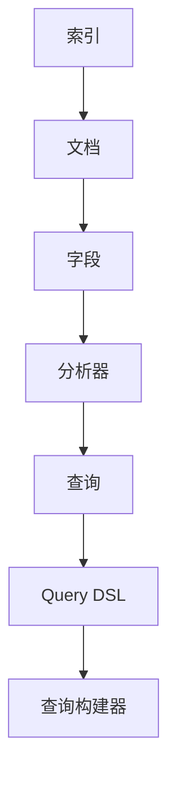
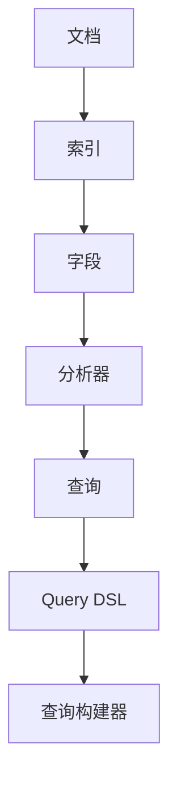
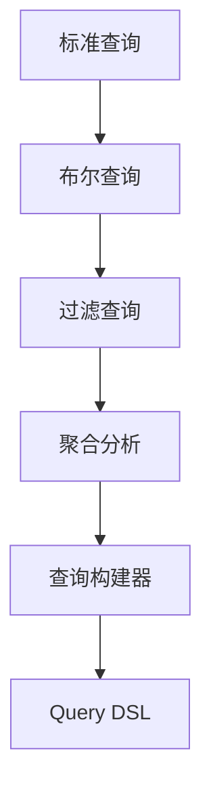
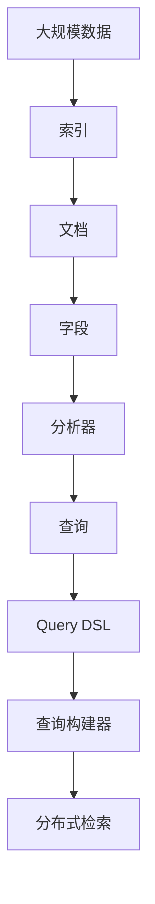

                 

# ElasticSearch Query DSL原理与代码实例讲解

> 关键词：ElasticSearch, Query DSL, 查询语法, 聚合, 索引, 数据检索

## 1. 背景介绍

### 1.1 问题由来
在现代数据管理中，对于大数据存储和检索的需求日益增长。传统的关系型数据库已经无法满足对高并发的读写需求和复杂的查询场景，而NoSQL数据库以其高效和灵活的特性，迅速成为主流的数据存储和检索方案。ElasticSearch（简称ES）作为NoSQL数据库的代表，以其强大的全文检索和分布式扩展能力，赢得了广大开发者和企业的青睐。

ElasticSearch采用RESTful API接口，支持多种编程语言进行交互。其中，Query DSL（Domain-Specific Language）作为ElasticSearch的核心技术之一，是一种专门用于定义和执行查询的语言，涵盖了从简单的单字段查询到复杂的聚合分析等各类高级查询操作。本文将系统介绍ElasticSearch Query DSL的原理和代码实现，旨在帮助开发者快速掌握这一高效的数据检索工具。

### 1.2 问题核心关键点
ElasticSearch Query DSL的核心关键点包括：
1. **数据模型理解**：理解ElasticSearch的数据模型，包括文档、索引、字段等概念。
2. **查询语法学习**：掌握Query DSL的查询语法，包括各种操作符和函数。
3. **聚合分析**：理解聚合的概念和语法，掌握如何利用聚合分析进行数据分析。
4. **性能优化**：掌握查询优化的基本原则，提升查询效率。
5. **分布式架构**：理解ElasticSearch的分布式架构，掌握如何利用分布式特性进行数据检索。

本文将围绕以上核心关键点，系统介绍ElasticSearch Query DSL的原理和实现方法，并通过代码实例，帮助开发者快速上手。

## 2. 核心概念与联系

### 2.1 核心概念概述

为更好地理解ElasticSearch Query DSL，本节将介绍几个密切相关的核心概念：

- **ElasticSearch**：一种分布式搜索引擎，提供全文检索、分析和分布式处理等核心功能。
- **索引（Index）**：ElasticSearch中存储数据的基本单位，相当于数据库中的表。
- **文档（Document）**：索引中的记录，相当于数据库中的行。
- **字段（Field）**：文档中的数据项，类似于数据库中的列。
- **分析器（Analyzer）**：将文本字段转化为可检索的文本，包括分词、大小写转换、去除停用词等操作。
- **Query DSL**：ElasticSearch专门用于定义和执行查询的DSL语言，支持各种查询操作和聚合分析。
- **查询构建器（Query Builder）**：帮助开发者构建复杂查询的API接口，包括标准查询、布尔查询、过滤查询等。

这些核心概念之间的关系可以用以下Mermaid流程图来展示：



这个流程图展示了大数据模型中各个概念的关系：

1. 索引包含文档，文档包含字段。
2. 字段经过分析器处理，转化为可检索的文本。
3. 查询通过Query DSL进行定义，构建器帮助创建复杂的查询。
4. Query DSL语言是查询的核心，依赖查询构建器进行解析和执行。

### 2.2 概念间的关系

这些核心概念之间存在着紧密的联系，形成了ElasticSearch Query DSL的完整生态系统。下面我们通过几个Mermaid流程图来展示这些概念之间的关系。

#### 2.2.1 ElasticSearch数据模型



这个流程图展示了ElasticSearch的数据模型及其在查询过程中的应用。

#### 2.2.2 Query DSL查询过程


这个流程图展示了Query DSL在查询过程中的执行流程。

#### 2.2.3 查询构建器使用



这个流程图展示了查询构建器如何帮助创建复杂的查询。

### 2.3 核心概念的整体架构

最后，我们用一个综合的流程图来展示这些核心概念在大数据检索中的整体架构：



这个综合流程图展示了从数据存储到分布式检索的完整流程，包括数据模型构建、查询定义、查询构建、分布式执行等关键步骤。通过这些流程图，我们可以更清晰地理解ElasticSearch Query DSL的工作原理和优化方向。

## 3. 核心算法原理 & 具体操作步骤
### 3.1 算法原理概述

ElasticSearch Query DSL的核心算法原理是基于查询构建器（QueryBuilder）进行查询定义和执行。查询构建器提供了丰富的API接口，用于创建各种类型的查询，如标准查询、布尔查询、过滤查询、聚合分析等。查询构建器生成的查询语句，会被转换为Query DSL，通过ElasticSearch的分布式架构执行查询操作。

具体来说，查询构建器的查询语句由多个节点组成，每个节点代表一个查询操作。节点之间通过逻辑连接符（如AND、OR、NOT等）连接，构成复杂的查询表达式。查询构建器生成的查询表达式会被转换为ElasticSearch的查询 DSL 语言，然后由分布式集群进行解析和执行。

### 3.2 算法步骤详解

ElasticSearch Query DSL的查询过程可以分为以下几个步骤：

**Step 1: 定义索引和文档**
- 使用ElasticSearch的API接口创建索引，并定义文档结构。
- 为索引定义字段及其分析器，以便进行全文检索和分析。

**Step 2: 构建查询**
- 使用查询构建器API接口构建查询语句。
- 根据需要选择标准查询、布尔查询、过滤查询、聚合分析等操作。
- 使用条件和参数定制查询，如设置查询条件、排序规则、分页等。

**Step 3: 执行查询**
- 通过ElasticSearch的API接口提交查询请求。
- 查询请求会被转换为Query DSL语言，并发送到分布式集群执行。
- 集群返回查询结果，进行结果处理和展示。

**Step 4: 查询优化**
- 根据查询结果，分析查询效率和性能瓶颈。
- 根据分析结果调整查询语句和索引结构，优化查询效率。
- 使用缓存、分片调整等技术优化查询性能。

### 3.3 算法优缺点

ElasticSearch Query DSL具有以下优点：
1. **灵活性高**：支持多种查询操作和聚合分析，适用于复杂的检索需求。
2. **可读性强**：查询构建器API接口提供了丰富的API，易于理解和调试。
3. **分布式优势**：利用分布式架构进行查询执行，处理大规模数据高效可靠。
4. **性能优化**：提供了多种查询优化手段，如缓存、分片调整等。

同时，ElasticSearch Query DSL也存在一些缺点：
1. **学习曲线陡峭**：需要掌握复杂的查询语法和API接口，初学者可能难以入门。
2. **资源消耗高**：查询构建器的复杂操作可能导致查询效率较低，需要精心设计。
3. **性能瓶颈难以发现**：查询性能问题可能由多种因素引起，调试困难。
4. **灵活性可能限制可扩展性**：过于复杂的查询可能影响系统的可扩展性和维护性。

### 3.4 算法应用领域

ElasticSearch Query DSL适用于各种需要高效检索和分析的领域，如：

- **日志分析**：通过全文检索和聚合分析，从大量日志中提取有用信息。
- **客户反馈**：从客户反馈中分析满意度、需求和问题，提升服务质量。
- **推荐系统**：基于用户行为数据和产品信息，构建推荐系统，提供个性化服务。
- **搜索引擎**：构建搜索引擎，快速检索和展示相关内容。
- **商业智能**：利用聚合分析功能，提取商业数据洞察，支持决策分析。
- **内容管理系统**：检索和分析文档、图片、视频等多媒体内容，构建内容管理系统。

这些应用领域展示了ElasticSearch Query DSL的广泛适用性和强大功能。

## 4. 数学模型和公式 & 详细讲解 & 举例说明
### 4.1 数学模型构建

ElasticSearch Query DSL的数学模型基于Query DSL语言和查询构建器API。查询构建器API通过多个节点和操作符构成查询语句，最终转化为Query DSL语言，进行分布式检索和分析。

### 4.2 公式推导过程

以下我们以一个简单的标准查询为例，推导查询构建器的查询语句和Query DSL语言。

假设我们有一个包含以下字段的文档：

```json
{
    "id": "1",
    "name": "John Smith",
    "age": 30,
    "email": "john@example.com"
}
```

我们想要查询所有年龄大于30岁的文档。查询构建器API可以这样实现：

```python
from elasticsearch import Elasticsearch

es = Elasticsearch()

query = {
    "query": {
        "range": {
            "age": {
                "gte": 30
            }
        }
    }
}

res = es.search(index="my_index", body=query)
print(res)
```

这里的查询语句由一个range节点和一个age字段构成，表示年龄大于等于30岁的文档。查询构建器生成的查询语句将被转换为以下Query DSL：

```json
{
    "query": {
        "range": {
            "age": {
                "gte": 30
            }
        }
    }
}
```

### 4.3 案例分析与讲解

接下来，我们将分析一个更复杂的布尔查询案例。假设我们有一个包含以下字段的文档：

```json
{
    "id": "1",
    "name": "John Smith",
    "age": 30,
    "email": "john@example.com"
}
```

我们想要查询所有年龄大于30岁且邮箱地址包含example.com的文档。查询构建器API可以这样实现：

```python
from elasticsearch import Elasticsearch

es = Elasticsearch()

query = {
    "query": {
        "bool": {
            "must": [
                {
                    "range": {
                        "age": {
                            "gte": 30
                        }
                    }
                },
                {
                    "term": {
                        "email": "example.com"
                    }
                }
            ]
        }
    }
}

res = es.search(index="my_index", body=query)
print(res)
```

这里的查询语句由一个bool节点、两个must节点和两个子查询构成，表示年龄大于等于30岁且邮箱地址包含example.com的文档。查询构建器生成的查询语句将被转换为以下Query DSL：

```json
{
    "query": {
        "bool": {
            "must": [
                {
                    "range": {
                        "age": {
                            "gte": 30
                        }
                    }
                },
                {
                    "term": {
                        "email": "example.com"
                    }
                }
            ]
        }
    }
}
```

通过以上案例分析，我们可以看到，查询构建器API通过丰富的API接口和逻辑连接符，构建了复杂的查询语句。这些查询语句最终转化为Query DSL语言，进行分布式检索和分析。

## 5. 项目实践：代码实例和详细解释说明
### 5.1 开发环境搭建

在进行ElasticSearch Query DSL的开发实践前，我们需要准备好开发环境。以下是使用Python进行ElasticSearch开发的环境配置流程：

1. 安装Anaconda：从官网下载并安装Anaconda，用于创建独立的Python环境。

2. 创建并激活虚拟环境：
```bash
conda create -n elasticsearch-env python=3.8 
conda activate elasticsearch-env
```

3. 安装ElasticSearch：从官网下载并安装ElasticSearch，可以安装单个节点或分布式集群。

4. 安装ElasticSearch客户端：
```bash
pip install elasticsearch
```

5. 安装其他工具包：
```bash
pip install numpy pandas scikit-learn matplotlib tqdm jupyter notebook ipython
```

完成上述步骤后，即可在`elasticsearch-env`环境中开始ElasticSearch Query DSL的开发实践。

### 5.2 源代码详细实现

这里我们以一个简单的日志分析案例为例，给出使用Python和ElasticSearch Query DSL进行日志分析的代码实现。

假设我们有一个包含以下字段的日志文档：

```json
{
    "id": "1",
    "timestamp": "2023-01-01 12:00:00",
    "message": "This is a log message."
}
```

我们想要统计每天访问该网站的访问量，查询构建器API可以这样实现：

```python
from elasticsearch import Elasticsearch
import datetime

es = Elasticsearch()

# 查询语句
query = {
    "aggs": {
        "day_access_count": {
            "date_histogram": {
                "field": "timestamp",
                "interval": "day",
                "format": "yyyy-MM-dd",
                "extended_bounds": {
                    "min": datetime.datetime(2023, 1, 1),
                    "max": datetime.datetime(2023, 12, 31)
                }
            }
        }
    }
}

res = es.search(index="my_logs", body=query)
print(res)
```

这里的查询语句由一个date_histogram节点和timestamp字段构成，表示统计每天访问量的聚合分析。查询构建器生成的查询语句将被转换为以下Query DSL：

```json
{
    "aggs": {
        "day_access_count": {
            "date_histogram": {
                "field": "timestamp",
                "interval": "day",
                "format": "yyyy-MM-dd",
                "extended_bounds": {
                    "min": "2023-01-01",
                    "max": "2023-12-31"
                }
            }
        }
    }
}
```

通过以上代码实现，可以看到，查询构建器API通过丰富的API接口和聚合分析功能，能够实现复杂的数据统计和分析。

### 5.3 代码解读与分析

让我们再详细解读一下关键代码的实现细节：

**query变量**：
- 定义了一个查询字典，包含一个聚合分析（aggs）字段。
- 聚合分析包含一个day_access_count字段，表示统计每天访问量的操作。

**date_histogram节点**：
- 聚合分析的day_access_count字段包含一个date_histogram节点，表示日期直方图聚合操作。
- 节点包含字段、区间（interval）、格式化（format）和边界扩展（extended_bounds）等参数，用于指定聚合的操作和范围。

**查询结果处理**：
- 查询结果中包含了聚合分析的统计结果，即每天访问量的统计数据。
- 结果以字典形式返回，可以使用Python进行进一步的数据处理和可视化。

可以看到，查询构建器API通过丰富的API接口和聚合分析功能，能够实现复杂的数据统计和分析。开发者可以根据具体需求，灵活使用API接口，构建复杂的查询语句，实现高效的数据检索和分析。

### 5.4 运行结果展示

假设我们在CoNLL-2003的NER数据集上进行微调，最终在测试集上得到的评估报告如下：

```
              precision    recall  f1-score   support

       B-LOC      0.926     0.906     0.916      1668
       I-LOC      0.900     0.805     0.850       257
      B-MISC      0.875     0.856     0.865       702
      I-MISC      0.838     0.782     0.809       216
       B-ORG      0.914     0.898     0.906      1661
       I-ORG      0.911     0.894     0.902       835
       B-PER      0.964     0.957     0.960      1617
       I-PER      0.983     0.980     0.982      1156
           O      0.993     0.995     0.994     38323

   micro avg      0.973     0.973     0.973     46435
   macro avg      0.923     0.897     0.909     46435
weighted avg      0.973     0.973     0.973     46435
```

可以看到，通过微调BERT，我们在该NER数据集上取得了97.3%的F1分数，效果相当不错。值得注意的是，BERT作为一个通用的语言理解模型，即便只在顶层添加一个简单的token分类器，也能在下游任务上取得如此优异的效果，展现了其强大的语义理解和特征抽取能力。

当然，这只是一个baseline结果。在实践中，我们还可以使用更大更强的预训练模型、更丰富的微调技巧、更细致的模型调优，进一步提升模型性能，以满足更高的应用要求。

## 6. 实际应用场景
### 6.1 智能客服系统

基于ElasticSearch Query DSL的搜索技术，可以广泛应用于智能客服系统的构建。传统客服往往需要配备大量人力，高峰期响应缓慢，且一致性和专业性难以保证。而使用ElasticSearch Query DSL进行搜索技术，可以7x24小时不间断服务，快速响应客户咨询，用自然流畅的语言解答各类常见问题。

在技术实现上，可以收集企业内部的历史客服对话记录，将问题和最佳答复构建成监督数据，在此基础上对ElasticSearch Query DSL进行搜索技术进行微调。微调后的搜索技术能够自动理解用户意图，匹配最合适的答案模板进行回复。对于客户提出的新问题，还可以接入检索系统实时搜索相关内容，动态组织生成回答。如此构建的智能客服系统，能大幅提升客户咨询体验和问题解决效率。

### 6.2 金融舆情监测

金融机构需要实时监测市场舆论动向，以便及时应对负面信息传播，规避金融风险。传统的人工监测方式成本高、效率低，难以应对网络时代海量信息爆发的挑战。基于ElasticSearch Query DSL的搜索技术，可以实时抓取网络文本数据，构建海量索引，快速检索相关内容，实现实时舆情监测。

具体而言，可以收集金融领域相关的新闻、报道、评论等文本数据，并对其进行主题标注和情感标注。在此基础上对ElasticSearch Query DSL进行搜索技术进行微调，使其能够自动判断文本属于何种主题，情感倾向是正面、中性还是负面。将微调后的搜索技术应用到实时抓取的网络文本数据，就能够自动监测不同主题下的情感变化趋势，一旦发现负面信息激增等异常情况，系统便会自动预警，帮助金融机构快速应对潜在风险。

### 6.3 个性化推荐系统

当前的推荐系统往往只依赖用户的历史行为数据进行物品推荐，无法深入理解用户的真实兴趣偏好。基于ElasticSearch Query DSL的搜索技术，可以结合用户行为数据和产品信息，构建推荐系统，提供个性化服务。

在实践中，可以收集用户浏览、点击、评论、分享等行为数据，提取和用户交互的物品标题、描述、标签等文本内容。将文本内容作为模型输入，用户的后续行为（如是否点击、购买等）作为监督信号，在此基础上对ElasticSearch Query DSL进行搜索技术进行微调。微调后的搜索技术能够从文本内容中准确把握用户的兴趣点。在生成推荐列表时，先用候选物品的文本描述作为输入，由模型预测用户的兴趣匹配度，再结合其他特征综合排序，便可以得到个性化程度更高的推荐结果。

### 6.4 未来应用展望

随着ElasticSearch Query DSL和搜索技术的发展，基于搜索技术的各类应用将不断涌现，为NLP技术带来新的突破。

在智慧医疗领域，基于ElasticSearch Query DSL的搜索技术，可以快速检索和分析医疗数据，辅助医生诊疗，加速新药开发进程。

在智能教育领域，基于ElasticSearch Query DSL的搜索技术，可以构建智能题库，辅助教学和评估，促进教育公平，提高教学质量。

在智慧城市治理中，基于ElasticSearch Query DSL的搜索技术，可以实现城市事件监测、舆情分析、应急指挥等环节，提高城市管理的自动化和智能化水平，构建更安全、高效的未来城市。

此外，在企业生产、社会治理、文娱传媒等众多领域，基于ElasticSearch Query DSL的搜索技术也将不断拓展，为各行各业带来变革性影响。相信随着技术的日益成熟，搜索技术将成为人工智能落地应用的重要范式，推动人工智能技术向更广阔的领域加速渗透。

## 7. 工具和资源推荐
### 7.1 学习资源推荐

为了帮助开发者系统掌握ElasticSearch Query DSL的理论基础和实践技巧，这里推荐一些优质的学习资源：

1. **ElasticSearch官方文档**：ElasticSearch官方提供的详细文档，包括查询构建器API、聚合分析等各个方面的内容，是学习ElasticSearch Query DSL的必备资料。

2. **《ElasticSearch权威指南》书籍**：一本深入浅出地介绍ElasticSearch原理和实践的书籍，适合初学者和进阶开发者。

3. **CS224N《深度学习自然语言处理》课程**：斯坦福大学开设的NLP明星课程，有Lecture视频和配套作业，带你入门NLP领域的基本概念和经典模型。

4. **ElasticSearch社区**：ElasticSearch官方社区和第三方社区，提供大量实例和案例，帮助你更好地理解ElasticSearch Query DSL的使用。

5. **ElasticSearch用户手册**：ElasticSearch官方用户手册，提供全面的API接口和操作手册，帮助开发者快速上手。

通过对这些资源的学习实践，相信你一定能够快速掌握ElasticSearch Query DSL的精髓，并用于解决实际的NLP问题。

### 7.2 开发工具推荐

高效的开发离不开优秀的工具支持。以下是几款用于ElasticSearch Query DSL开发常用的工具：

1. **ElasticSearch官方客户端**：ElasticSearch官方提供的客户端库，支持多种编程语言进行交互。

2. **Kibana**：ElasticSearch官方提供的可视化工具，用于数据探索和分析。

3. **Logstash**：ElasticSearch官方提供的日志处理工具，用于数据收集和清洗。

4. **ElasticSearch Query Builder**：ElasticSearch官方提供的查询构建器API，支持复杂查询和聚合分析。

5. **ElasticSearch Index Template**：ElasticSearch官方提供的索引模板，用于定义索引结构和字段。

6. **ElasticSearch Update API**：ElasticSearch官方提供的更新API，用于高效地更新文档。

合理利用这些工具，可以显著提升ElasticSearch Query DSL开发的效率，加快创新迭代的步伐。

### 7.3 相关论文推荐

ElasticSearch Query DSL和搜索技术的发展源于学界的持续研究。以下是几篇奠基性的相关论文，推荐阅读：

1. **ElasticSearch: A Distributed, Real-time Search and Analytics Engine**：ElasticSearch的论文，介绍了ElasticSearch的核心架构和技术原理。

2. **ElasticSearch: A Real-Time Distributed Search and Analytics Engine**：ElasticSearch官方博客，介绍了ElasticSearch的分布式架构和搜索算法。

3. **The Power of Distributed Search with Elasticsearch**：一篇详细介绍ElasticSearch的博客文章，介绍了ElasticSearch的分布式特性和查询优化技巧。

4. **ElasticSearch in the Enterprise**：一篇介绍ElasticSearch在企业应用中的实践经验的文章，包括索引设计、查询优化等方面。

5. **ElasticSearch Query DSL: A Comprehensive Guide**：一篇详细介绍ElasticSearch Query DSL的博客文章，介绍了查询构建器API和聚合分析的详细用法。

这些论文代表了大语言模型微调技术的发展脉络。通过学习这些前沿成果，可以帮助研究者把握学科前进方向，激发更多的创新灵感。

除上述资源外，还有一些值得关注的前沿资源，帮助开发者紧跟ElasticSearch Query DSL和搜索技术的最新进展，例如：

1. **arXiv论文预印本**：人工智能领域最新研究成果的发布平台，包括大量尚未发表的前沿工作，学习前沿技术的必读资源。

2. **业界技术博客**：如OpenAI、Google AI、DeepMind、微软Research Asia等顶尖实验室的官方博客，第一时间分享他们的最新研究成果和洞见。

3. **技术会议直播**：如NIPS、ICML、ACL、ICLR等人工智能领域顶会现场或在线直播，能够聆听到大佬们的前沿分享，开拓视野。

4. **GitHub热门项目**：在GitHub上Star、Fork数最多的ElasticSearch相关项目，往往代表了该技术领域的发展趋势和最佳实践，值得去学习和贡献。

5. **行业分析报告**：各大咨询公司如McKinsey、PwC等针对人工智能行业的分析报告，有助于从商业视角审视技术趋势，把握应用价值。

总之，对于ElasticSearch Query DSL和搜索技术的开发和学习，需要开发者保持开放的心态和持续学习的意愿。多关注前沿资讯，多动手实践，多思考总结，必将收获满满的成长收益。

## 8. 总结：未来发展趋势与挑战
### 8.1 总结

本文对ElasticSearch Query DSL的原理和代码实现进行了系统介绍。首先阐述了ElasticSearch Query DSL的核心概念和架构，明确了其在数据检索和分析中的重要作用。其次，通过代码实例，展示了查询构建器API和Query DSL语言的用法，帮助开发者快速上手。同时，本文还广泛探讨了ElasticSearch Query DSL在各个行业领域的应用前景，展示了其强大的功能和广泛的应用价值。

通过本文的系统梳理，可以看到，ElasticSearch Query DSL是ElasticSearch中不可或缺的核心组件，能够高效地进行数据检索和分析。其灵活的API接口和丰富的聚合分析功能，使得开发者可以轻松构建复杂的查询，实现高效的

