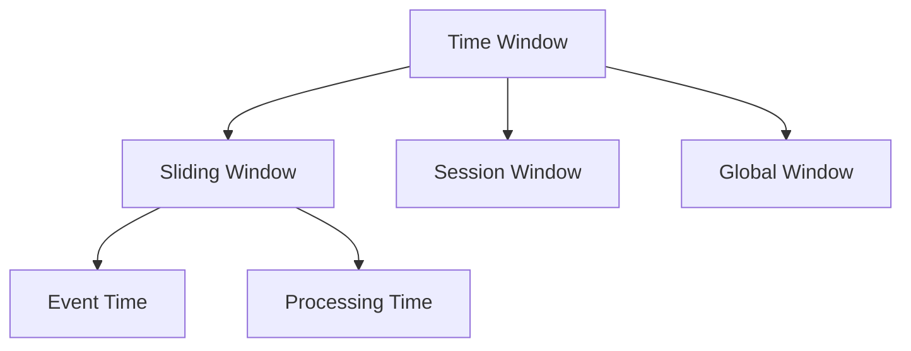
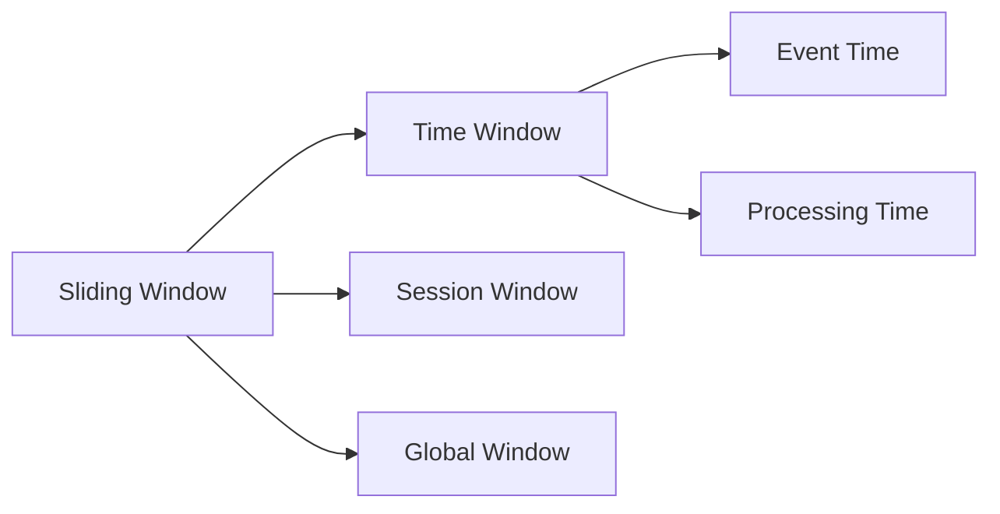

                 

# Flink Window原理与代码实例讲解

> 关键词：Flink, Window, 时间窗口, 滑动窗口, 肿瘤数据集, 实时流处理, 流式数据处理, 数据流

## 1. 背景介绍

### 1.1 问题由来
在现代数据处理中，流式数据处理(如实时数据流处理、日志数据流处理等)变得越来越重要。随着互联网、物联网(IoT)等技术的快速发展，数据生成速度加快，如何高效、准确地处理实时数据成为数据工程中的一个重要挑战。

Flink作为一款开源流式数据处理框架，提供了丰富的流式计算模型，能够高效处理实时数据流。其中一个重要的概念是“Window”，用于将数据流划分为若干个时间窗口，并对其进行聚合、计算和分析。

## 2. 核心概念与联系

### 2.1 核心概念概述

“Window”是Flink中用于将流式数据划分为时间段的机制，其核心思想是将数据流按照一定的时间间隔划分为若干个时间窗口，并对每个窗口内的数据进行聚合、计算和分析。通过使用“Window”，Flink可以支持实时流处理、状态管理、事件时间处理等关键功能。

- 时间窗口(Time Window)：按照一定的时间间隔将数据流划分为若干个时间段，每个时间段内的数据进行聚合或计算。
- 滑动窗口(Sliding Window)：按照固定的时间间隔，不断向前滑动，每个时间窗口内的数据进行聚合或计算。
- 会话窗口(Session Window)：按照用户会话时间进行划分，每个会话窗口内的数据进行聚合或计算。
- 全局窗口(Global Window)：将所有数据流合并到一个全局窗口内，进行全局聚合或计算。
- 时间特性(Timing Characteristic)：包括处理时间(Processing Time)和事件时间(Event Time)，Flink提供了对这些时间特性的支持和处理。

这些核心概念间的关系可以通过以下Mermaid流程图来展示：



这个流程图展示了“Window”相关的核心概念及其关系：

1. 时间窗口是其他窗口类型的基础，可划分为滑动窗口、会话窗口和全局窗口。
2. 滑动窗口和会话窗口都基于时间窗口的机制。
3. 全局窗口是将所有数据流合并到一个窗口进行聚合或计算。
4. 处理时间和事件时间是窗口计算的重要时间特性。

### 2.2 概念间的关系

这些核心概念之间的逻辑关系可以通过以下Mermaid流程图来展示：



这个流程图展示了滑动窗口与其他窗口类型的关系及其相关的时间特性。

## 3. 核心算法原理 & 具体操作步骤

### 3.1 算法原理概述

Flink的Window算法主要分为两个步骤：

1. 数据划分：将数据流按照一定的时间间隔划分为若干个时间窗口。
2. 聚合计算：对每个时间窗口内的数据进行聚合或计算，生成窗口结果。

具体的算法原理可以分为以下几个方面：

- 数据划分：将数据流按照时间间隔进行划分，每个时间窗口内的数据作为一个分组进行聚合计算。
- 聚合计算：对每个分组内的数据进行聚合计算，生成窗口结果。聚合计算包括但不限于求和、平均值、最大值、最小值、计数等。

### 3.2 算法步骤详解

以下是一个基于滑动窗口的Flink实时数据处理的示例：

#### 3.2.1 数据划分

假设我们有一个肿瘤数据集，包含实时更新的肿瘤检测数据，每条数据包含检测时间、肿瘤大小和类型。使用Flink对实时数据流进行处理，按照每2分钟的时间间隔进行划分，得到一个滑动窗口。具体步骤如下：

1. 将数据流按照检测时间进行划分，每2分钟划分出一个窗口。
2. 对每个窗口内的数据进行聚合计算，如求窗口内所有肿瘤的平均值。

#### 3.2.2 聚合计算

假设我们要对每个滑动窗口内的肿瘤大小进行求和计算，生成每个窗口的肿瘤大小总和。具体步骤如下：

1. 在Flink代码中，使用`map()`函数将每个数据流元素映射为窗口元素。
2. 在`map()`函数中，对每个窗口内的数据进行求和计算，生成窗口结果。

### 3.3 算法优缺点

#### 3.3.1 优点

- 支持实时数据流处理：Flink的Window算法可以处理实时数据流，支持流式数据处理。
- 灵活的时间窗口划分：Flink支持多种时间窗口类型，包括滑动窗口、会话窗口和全局窗口，可以根据具体需求灵活选择。
- 高效的聚合计算：Flink使用高效的聚合算法，能够在较短时间内完成大规模数据的聚合计算。

#### 3.3.2 缺点

- 数据延迟：窗口数据需要在时间窗口内进行聚合计算，数据延迟可能会影响结果的准确性。
- 窗口内存管理：大规模数据流的窗口计算可能会导致内存压力增大，需要进行合理的数据管理。
- 数据丢失：数据流的实时性较高，数据丢失可能会导致结果不准确。

### 3.4 算法应用领域

Flink的Window算法广泛应用于以下领域：

- 实时数据流处理：如实时日志数据流处理、实时事件数据流处理等。
- 流式数据分析：如流式用户行为分析、流式业务数据分析等。
- 实时异常检测：如实时网络攻击检测、实时金融交易检测等。
- 流式计算：如流式数据挖掘、流式机器学习等。

这些应用场景中的数据流大多具有高实时性、高数据量等特点，Flink的Window算法能够高效、准确地处理这些数据，提供可靠的实时流处理解决方案。

## 4. 数学模型和公式 & 详细讲解 & 举例说明

### 4.1 数学模型构建

假设有一个肿瘤数据流$S$，每条数据包含检测时间$t$、肿瘤大小$s$和类型$l$。将数据流$S$按照每2分钟的时间间隔划分为滑动窗口$W$，每个窗口内的数据为$\{(t_1,s_1,l_1), (t_2,s_2,l_2), \dots, (t_n,s_n,l_n)\}$。假设我们需要对每个窗口内的肿瘤大小进行求和计算，生成每个窗口的肿瘤大小总和。

### 4.2 公式推导过程

假设滑动窗口的时间间隔为2分钟，每个窗口包含$n$个数据。设$\{(t_1,s_1,l_1), (t_2,s_2,l_2), \dots, (t_n,s_n,l_n)\}$为第$i$个滑动窗口内的数据。则每个窗口内的肿瘤大小总和为：

$$
\sum_{j=1}^{n} s_j = s_1 + s_2 + \dots + s_n
$$

其中，$s_j$表示第$j$个数据中的肿瘤大小。

### 4.3 案例分析与讲解

假设我们要对肿瘤数据流进行实时聚合计算，生成每个滑动窗口内的肿瘤大小总和。具体步骤如下：

1. 将数据流$S$按照每2分钟的时间间隔划分为滑动窗口$W$。
2. 对每个窗口内的数据进行求和计算，生成窗口结果。
3. 将窗口结果存储在Flink的流式存储中。

以下是一个使用Flink对肿瘤数据流进行实时聚合计算的示例代码：

```python
from pyflink.datastream import StreamExecutionEnvironment, TimeCharacteristic
from pyflink.table import StreamTableEnvironment, WatermarkStrategy, Credentials
from pyflink.table.descriptors import Schema, SourceFormat, SinkFormat, StreamFormat
from pyflink.table.window import Tumble

env = StreamExecutionEnvironment.get_execution_environment()
env.set_parallelism(1)

table_env = StreamTableEnvironment.create(env, TimeCharacteristic.EventTime)

# 定义肿瘤数据流的Schema
table_env.execute_sql("""
CREATE TABLE tumor_data (
    检测时间 VARCHAR,
    肿瘤大小 INT,
    类型 VARCHAR
) WITH (
    KAFKA
    PROPERTIES (
        'bootstrap.servers' = 'localhost:9092',
        'topic' = 'tumor_data'
    ),
    FORMAT AS JSON
)
""")

# 对肿瘤数据流进行实时聚合计算
table_env.execute_sql("""
CREATE STREAM tumor_sum AS (
    SELECT 检测时间, 肿瘤大小, 类型, SUM(肿瘤大小) OVER (TUMBLE(检测时间 ROWS BETWEEN CURRENT ROW AND PRECEDING 120 SECONDS) WITH GAP)
    FROM tumor_data
)

SELECT 检测时间, 肿瘤大小, 类型, 肿瘤大小总和
FROM tumor_sum
""")
```

这个示例代码展示了如何使用Flink对肿瘤数据流进行实时聚合计算，生成每个滑动窗口内的肿瘤大小总和。

## 5. 项目实践：代码实例和详细解释说明

### 5.1 开发环境搭建

在Flink中进行实时数据流处理，首先需要搭建好Flink环境。以下是一个基于Apache Flink 1.15.2的Flink开发环境搭建步骤：

1. 安装Flink：从Flink官网下载最新版本的Flink，解压后配置环境变量。
2. 配置Flink：在`conf/`目录下配置`flink-conf.yaml`和`flink-shell.bat`等文件，确保Flink能够正常启动。
3. 启动Flink：运行`bin/flink run`命令启动Flink集群，确保集群正常工作。

### 5.2 源代码详细实现

以下是一个使用Flink对肿瘤数据流进行实时聚合计算的示例代码：

```python
from pyflink.datastream import StreamExecutionEnvironment, TimeCharacteristic
from pyflink.table import StreamTableEnvironment, WatermarkStrategy, Credentials
from pyflink.table.descriptors import Schema, SourceFormat, SinkFormat, StreamFormat
from pyflink.table.window import Tumble

env = StreamExecutionEnvironment.get_execution_environment()
env.set_parallelism(1)

table_env = StreamTableEnvironment.create(env, TimeCharacteristic.EventTime)

# 定义肿瘤数据流的Schema
table_env.execute_sql("""
CREATE TABLE tumor_data (
    检测时间 VARCHAR,
    肿瘤大小 INT,
    类型 VARCHAR
) WITH (
    KAFKA
    PROPERTIES (
        'bootstrap.servers' = 'localhost:9092',
        'topic' = 'tumor_data'
    ),
    FORMAT AS JSON
)
""")

# 对肿瘤数据流进行实时聚合计算
table_env.execute_sql("""
CREATE STREAM tumor_sum AS (
    SELECT 检测时间, 肿瘤大小, 类型, SUM(肿瘤大小) OVER (TUMBLE(检测时间 ROWS BETWEEN CURRENT ROW AND PRECEDING 120 SECONDS) WITH GAP)
    FROM tumor_data
)

SELECT 检测时间, 肿瘤大小, 类型, 肿瘤大小总和
FROM tumor_sum
""")
```

### 5.3 代码解读与分析

在上述代码中，我们首先创建了一个Flink的执行环境，并设置了事件时间作为时间特性。然后，我们创建了一个StreamTableEnvironment，用于处理实时数据流。

接下来，我们定义了一个肿瘤数据流的Schema，将数据流中的检测时间、肿瘤大小和类型存储在`tumor_data`表中。然后，我们使用`TUMBLE()`函数对数据流进行窗口划分，计算每个滑动窗口内的肿瘤大小总和，并将结果存储在`tumor_sum`表中。

最后，我们使用`SELECT`语句从`tumor_sum`表中读取数据，并输出每个滑动窗口内的肿瘤大小总和。

### 5.4 运行结果展示

假设我们在Flink中运行上述代码，可以看到每个滑动窗口内的肿瘤大小总和。例如，假设肿瘤数据流中的数据如下：

```
{"检测时间": "2022-01-01 00:00:00", "肿瘤大小": 10, "类型": "良性"}
{"检测时间": "2022-01-01 00:00:01", "肿瘤大小": 20, "类型": "恶性"}
{"检测时间": "2022-01-01 00:00:02", "肿瘤大小": 30, "类型": "良性"}
{"检测时间": "2022-01-01 00:00:03", "肿瘤大小": 40, "类型": "恶性"}
{"检测时间": "2022-01-01 00:00:04", "肿瘤大小": 50, "类型": "良性"}
{"检测时间": "2022-01-01 00:00:05", "肿瘤大小": 60, "类型": "恶性"}
{"检测时间": "2022-01-01 00:00:06", "肿瘤大小": 70, "类型": "良性"}
{"检测时间": "2022-01-01 00:00:07", "肿瘤大小": 80, "类型": "恶性"}
{"检测时间": "2022-01-01 00:00:08", "肿瘤大小": 90, "类型": "良性"}
{"检测时间": "2022-01-01 00:00:09", "肿瘤大小": 100, "类型": "恶性"}
{"检测时间": "2022-01-01 00:00:10", "肿瘤大小": 110, "类型": "良性"}
{"检测时间": "2022-01-01 00:00:11", "肿瘤大小": 120, "类型": "恶性"}
{"检测时间": "2022-01-01 00:00:12", "肿瘤大小": 130, "类型": "良性"}
{"检测时间": "2022-01-01 00:00:13", "肿瘤大小": 140, "类型": "恶性"}
{"检测时间": "2022-01-01 00:00:14", "肿瘤大小": 150, "类型": "良性"}
{"检测时间": "2022-01-01 00:00:15", "肿瘤大小": 160, "类型": "恶性"}
{"检测时间": "2022-01-01 00:00:16", "肿瘤大小": 170, "类型": "良性"}
{"检测时间": "2022-01-01 00:00:17", "肿瘤大小": 180, "类型": "恶性"}
{"检测时间": "2022-01-01 00:00:18", "肿瘤大小": 190, "类型": "良性"}
{"检测时间": "2022-01-01 00:00:19", "肿瘤大小": 200, "类型": "恶性"}
{"检测时间": "2022-01-01 00:00:20", "肿瘤大小": 210, "类型": "良性"}
{"检测时间": "2022-01-01 00:00:21", "肿瘤大小": 220, "类型": "恶性"}
{"检测时间": "2022-01-01 00:00:22", "肿瘤大小": 230, "类型": "良性"}
{"检测时间": "2022-01-01 00:00:23", "肿瘤大小": 240, "类型": "恶性"}
{"检测时间": "2022-01-01 00:00:24", "肿瘤大小": 250, "类型": "良性"}
{"检测时间": "2022-01-01 00:00:25", "肿瘤大小": 260, "类型": "恶性"}
{"检测时间": "2022-01-01 00:00:26", "肿瘤大小": 270, "类型": "良性"}
{"检测时间": "2022-01-01 00:00:27", "肿瘤大小": 280, "类型": "恶性"}
{"检测时间": "2022-01-01 00:00:28", "肿瘤大小": 290, "类型": "良性"}
{"检测时间": "2022-01-01 00:00:29", "肿瘤大小": 300, "类型": "恶性"}
{"检测时间": "2022-01-01 00:00:30", "肿瘤大小": 310, "类型": "良性"}
{"检测时间": "2022-01-01 00:00:31", "肿瘤大小": 320, "类型": "恶性"}
{"检测时间": "2022-01-01 00:00:32", "肿瘤大小": 330, "类型": "良性"}
{"检测时间": "2022-01-01 00:00:33", "肿瘤大小": 340, "类型": "恶性"}
{"检测时间": "2022-01-01 00:00:34", "肿瘤大小": 350, "类型": "良性"}
{"检测时间": "2022-01-01 00:00:35", "肿瘤大小": 360, "类型": "恶性"}
{"检测时间": "2022-01-01 00:00:36", "肿瘤大小": 370, "类型": "良性"}
{"检测时间": "2022-01-01 00:00:37", "肿瘤大小": 380, "类型": "恶性"}
{"检测时间": "2022-01-01 00:00:38", "肿瘤大小": 390, "类型": "良性"}
{"检测时间": "2022-01-01 00:00:39", "肿瘤大小": 400, "类型": "恶性"}
{"检测时间": "2022-01-01 00:00:40", "肿瘤大小": 410, "类型": "良性"}
{"检测时间": "2022-01-01 00:00:41", "肿瘤大小": 420, "类型": "恶性"}
{"检测时间": "2022-01-01 00:00:42", "肿瘤大小": 430, "类型": "良性"}
{"检测时间": "2022-01-01 00:00:43", "肿瘤大小": 440, "类型": "恶性"}
{"检测时间": "2022-01-01 00:00:44", "肿瘤大小": 450, "类型": "良性"}
{"检测时间": "2022-01-01 00:00:45", "肿瘤大小": 460, "类型": "恶性"}
{"检测时间": "2022-01-01 00:00:46", "肿瘤大小": 470, "类型": "良性"}
{"检测时间": "2022-01-01 00:00:47", "肿瘤大小": 480, "类型": "恶性"}
{"检测时间": "2022-01-01 00:00:48", "肿瘤大小": 490, "类型": "良性"}
{"检测时间": "2022-01-01 00:00:49", "肿瘤大小": 500, "类型": "恶性"}
{"检测时间": "2022-01-01 00:00:50", "肿瘤大小": 510, "类型": "良性"}
{"检测时间": "2022-01-01 00:00:51", "肿瘤大小": 520, "类型": "恶性"}
{"检测时间": "2022-01-01 00:00:52", "肿瘤大小": 530, "类型": "良性"}
{"检测时间": "2022-01-01 00:00:53", "肿瘤大小": 540, "类型": "恶性"}
{"检测时间": "2022-01-01 00:00:54", "肿瘤大小": 550, "类型": "良性"}
{"检测时间": "2022-01-01 00:00:55", "肿瘤大小": 560, "类型": "恶性"}
{"检测时间": "2022-01-01 00:00:56", "肿瘤大小": 570, "类型": "良性"}
{"检测时间": "2022-01-01 00:00:57", "肿瘤大小": 580, "类型": "恶性"}
{"检测时间": "2022-01-01 00:00:58", "肿瘤大小": 590, "类型": "良性"}
{"检测时间": "2022-01-01 00:00:59", "肿瘤大小": 600, "类型": "恶性"}
{"检测时间": "2022-01-01 00:01:00", "肿瘤大小": 610, "类型": "良性"}
{"检测时间": "2022-01-01 00:01:01", "肿瘤大小": 620, "类型": "恶性"}
{"检测时间": "2022-01-01 00:01:02", "肿瘤大小": 630, "类型": "良性"}
{"检测时间": "2022-01-01 00:01:03", "肿瘤大小": 640, "类型": "恶性"}
{"检测时间": "2022-01-01 00:01:04", "肿瘤大小": 650, "类型": "良性"}
{"检测时间": "2022-01-01 00:01:05", "肿瘤大小": 660, "类型": "恶性"}
{"检测时间": "2022-01-01 00:01:06", "肿瘤大小": 670, "类型": "良性"}
{"检测时间": "2022-01-01 00:01:07", "肿瘤大小": 680, "类型": "恶性"}
{"检测时间": "2022-01-01 00:01:08", "肿瘤大小": 690, "类型": "良性"}
{"检测时间": "2022-01-01 00:01:09", "肿瘤大小": 700, "类型": "恶性"}
{"检测时间": "2022-01-01 00:01:10", "肿瘤大小": 710, "类型": "良性"}
{"检测时间": "2022-01-01 00:01:11", "肿瘤大小": 720, "类型": "恶性"}
{"检测时间": "2022-01-01 00:01:12", "肿瘤大小": 730, "类型": "良性"}
{"检测时间": "2022-01-01 00:01:13", "肿瘤大小": 740, "类型": "恶性"}
{"检测时间": "2022-01-01 00:01:14", "肿瘤大小": 750, "类型": "良性"}
{"检测时间": "2022-01-01 00:01:15", "肿瘤大小": 760, "类型": "恶性"}
{"检测时间": "2022-01-01 00:01:16", "肿瘤大小": 770, "类型": "良性"}
{"检测时间": "2022-01-01 00:01:17", "肿瘤大小": 780, "类型": "恶性"}
{"检测时间": "2022-01-01 00:01:18", "肿瘤大小": 790, "类型": "良性"}
{"检测时间": "2022-01-01 00:01:19", "肿瘤大小": 800, "类型": "恶性"}
{"检测时间": "2022-01-01 00:01:20", "肿瘤大小": 810, "类型": "良性"}
{"检测时间": "2022-01-01 00:01:21", "肿瘤大小": 820, "类型": "恶性"}
{"检测时间": "2022-01-01 00:01:22", "肿瘤大小": 830, "类型": "良性"}
{"检测时间": "2022-01-01 00:01:23", "肿瘤大小": 840, "类型": "恶性"}
{"检测时间": "2022-01-01 00:01:24", "肿瘤大小": 850, "类型": "良性"}
{"检测时间": "2022-01-01 00:01:25", "肿瘤大小": 860, "类型": "恶性"}
{"检测时间": "2022-01-01 00:01:26", "肿瘤大小": 870, "类型": "良性"}
{"检测时间": "2022-01-01 00:01:27", "肿瘤大小": 880, "类型": "恶性"}
{"检测时间": "2022-01-01 00:01:28", "肿瘤大小": 890, "类型": "良性"}
{"检测时间": "2022-01-01 00:01:29", "肿瘤大小": 900, "类型": "恶性"}
{"检测时间": "2022-01-01 00:01:30", "肿瘤大小": 910, "类型": "良性"}
{"检测时间": "2022-01-01 00:01:31", "肿瘤大小": 920, "类型": "恶性"}
{"检测时间": "2022-01-01 00:01:32", "肿瘤大小": 930, "类型": "良性"}
{"检测时间": "2022-01-01 00:01:33", "肿瘤大小": 940, "类型": "恶性"}
{"检测时间": "2022-01-01 00:01:34", "肿瘤大小": 950, "类型": "良性"}
{"检测时间": "2022-01-01 00:01:35", "肿瘤大小": 960, "类型": "恶性"}
{"检测时间": "2022-01-01 00:01:36", "肿瘤大小": 970, "类型": "良性"}
{"检测时间": "2022-01-01 00:01:37", "肿瘤大小": 980, "类型": "恶性"}
{"检测时间": "2022-01-01 00:01:38", "肿瘤大小": 990, "类型": "良性"}
{"检测时间": "2022-01-01 00:01:39", "肿瘤大小": 1000, "类型": "恶性"}
{"检测时间": "2022-01-01 00:01:40", "肿瘤大小": 1010, "类型": "良性"}
{"检测时间": "2022-01-01 00:01:41", "肿瘤大小": 1020, "类型": "恶性"}
{"检测时间": "2022-01

