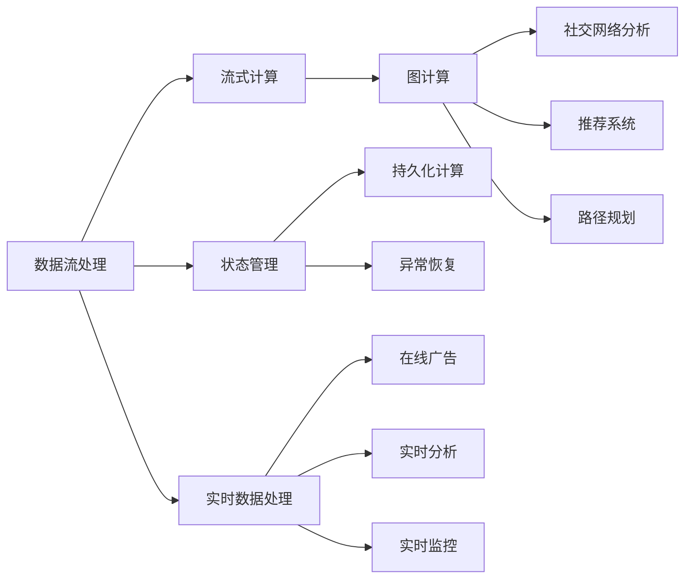
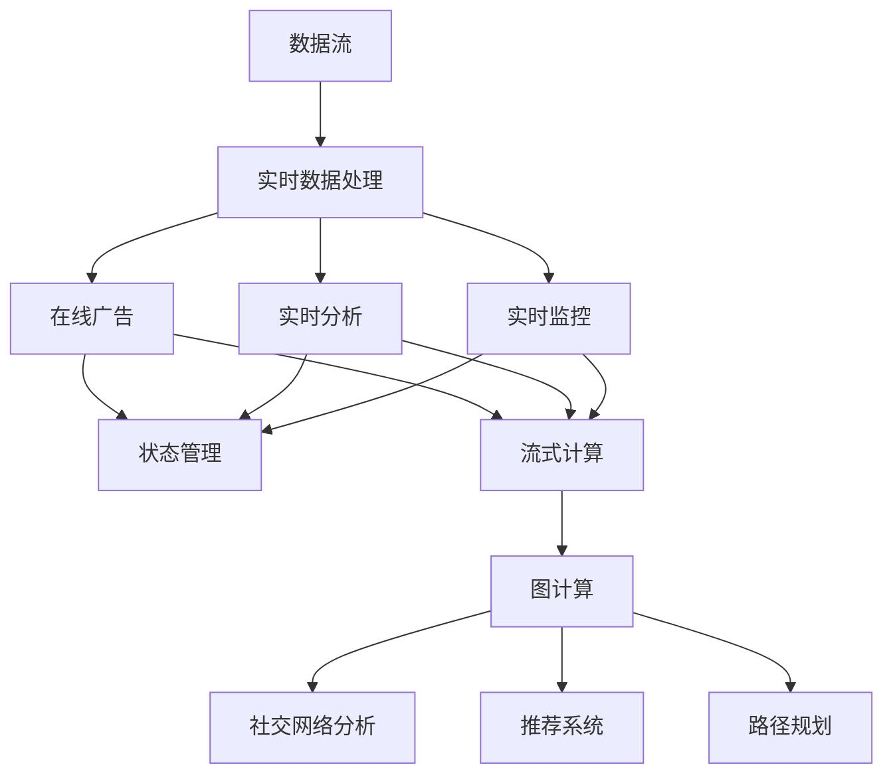

                 

# Flink原理与代码实例讲解

> 关键词：Flink,流式计算,数据流处理,图计算,状态管理,实时数据处理,大流数据处理,数据流框架

## 1. 背景介绍

### 1.1 问题由来
随着互联网技术的飞速发展，数据量呈爆炸式增长，传统的批量计算已经难以适应实时、复杂、高吞吐量的数据处理需求。流式计算框架应运而生，成为解决大规模实时数据处理的关键技术。

在众多流式计算框架中，Apache Flink 凭借其高性能、易用性、灵活性和可扩展性，受到了业界的广泛关注和应用。Flink 支持批处理、流处理和图计算，适用于多种数据处理场景，包括实时数据流处理、状态化流处理、复杂事件处理等。

本文将详细讲解 Flink 的核心原理、核心组件和应用场景，并通过实际代码实例，帮助读者深入理解 Flink 的实现原理和使用方法。

## 2. 核心概念与联系

### 2.1 核心概念概述

为了更好地理解 Flink，我们先对几个核心概念进行简单介绍：

- **流式计算**：与批处理不同，流式计算是对数据流进行实时的、连续的处理。流式计算能够及时响应数据变化，处理大量实时数据，具有高吞吐量、低延迟等特点。

- **数据流处理**：数据流处理是指对数据流进行实时处理，通常用于日志分析、实时推荐、实时监控等场景。

- **图计算**：图计算是对图结构进行分析和计算，主要用于社交网络分析、推荐系统、路径规划等。

- **状态管理**：在流式计算中，需要记录数据的中间状态，以便实现持久化计算和异常恢复。

- **实时数据处理**：实时数据处理是指对数据流进行实时的、快速的处理，通常用于在线广告、实时分析、实时监控等场景。

这些核心概念构成了 Flink 的基础，帮助开发者解决大规模数据处理的挑战。

### 2.2 核心概念的整体架构

接下来，我们通过一个 Mermaid 图表来展示 Flink 核心概念之间的关系。



这个图表展示了 Flink 核心概念之间的相互关系：

- 数据流处理是对数据流进行实时处理的基础。
- 流式计算是数据流处理的关键技术，支持实时流式数据处理。
- 图计算是对图结构进行分析和计算，能够处理复杂关系数据。
- 状态管理用于记录数据的中间状态，支持持久化计算和异常恢复。
- 实时数据处理是对实时数据进行快速处理，支持在线广告、实时分析、实时监控等场景。

这些核心概念共同构成了 Flink 的核心架构，帮助开发者解决大规模数据处理的挑战。

### 2.3 核心概念的逻辑关系

在 Flink 中，数据流处理是基础，通过流式计算、图计算和状态管理等技术，实现实时数据处理和复杂数据计算。实时数据处理是最终目标，通过对实时数据进行快速处理，实现在线广告、实时分析、实时监控等应用场景。

这些核心概念之间的逻辑关系可以用以下流程图示例：



这个流程图示例展示了数据流、实时数据处理、流式计算、图计算和状态管理之间的相互关系：

- 数据流经过实时数据处理，输出在线广告、实时分析和实时监控结果。
- 状态管理用于记录数据的中间状态，支持持久化计算和异常恢复。
- 流式计算支持实时流式数据处理。
- 图计算支持复杂关系数据处理，实现社交网络分析、推荐系统和路径规划等应用场景。

通过理解这些核心概念之间的关系，我们可以更好地掌握 Flink 的核心架构和技术体系。

## 3. 核心算法原理 & 具体操作步骤

### 3.1 算法原理概述

Flink 的核心算法包括数据流处理、流式计算、图计算和状态管理等。这些算法共同构成了 Flink 的强大数据处理能力，帮助开发者实现大规模实时数据处理。

数据流处理是 Flink 的基础，通过并行处理技术，将数据流划分为多个小流，并行处理数据。流式计算支持实时流式数据处理，能够处理大量实时数据，具有高吞吐量和低延迟等特点。图计算支持复杂关系数据处理，能够处理社交网络、推荐系统和路径规划等场景。状态管理用于记录数据的中间状态，支持持久化计算和异常恢复。

### 3.2 算法步骤详解

下面，我们将详细介绍 Flink 的核心算法步骤：

#### 3.2.1 数据流处理

数据流处理是 Flink 的基础，通过并行处理技术，将数据流划分为多个小流，并行处理数据。

**步骤 1: 数据分区和并行处理**

Flink 将数据流分成多个小流，每个小流可以并行处理。在数据源上，Flink 将数据分成多个分区，每个分区由一个任务处理。在处理数据时，Flink 将每个分区分配给一个任务，任务并行处理数据，最终将结果汇总输出。

**步骤 2: 数据转换**

Flink 支持多种数据转换操作，如 map、filter、reduce 等。用户可以通过定义转换操作，对数据进行转换和处理。

**步骤 3: 数据聚合**

Flink 支持多种聚合操作，如 sum、count、avg 等。用户可以通过定义聚合操作，对数据进行聚合计算。

**步骤 4: 数据流同步**

Flink 支持多种数据流同步操作，如延迟同步、快照同步、状态同步等。用户可以通过定义同步操作，将数据流状态同步到持久化存储中。

#### 3.2.2 流式计算

流式计算是 Flink 的核心技术，支持实时流式数据处理。

**步骤 1: 事件时间处理**

Flink 支持事件时间处理，能够处理实时数据。事件时间处理能够保证数据处理的准确性和一致性，避免数据延迟和重复处理等问题。

**步骤 2: 窗口处理**

Flink 支持多种窗口操作，如 tumbling、sliding、session 等。用户可以通过定义窗口操作，对数据进行聚合计算。

**步骤 3: 状态管理**

Flink 支持多种状态管理策略，如 MapState、ValueState、AggregatingState 等。用户可以通过定义状态管理策略，记录数据的状态信息。

**步骤 4: 状态恢复**

Flink 支持多种状态恢复策略，如快照恢复、故障恢复等。用户可以通过定义状态恢复策略，将状态信息同步到持久化存储中。

#### 3.2.3 图计算

图计算是 Flink 的重要功能，支持复杂关系数据处理。

**步骤 1: 图构建**

Flink 支持多种图构建操作，如邻接表、邻接矩阵等。用户可以通过定义图构建操作，构建关系数据图。

**步骤 2: 图遍历**

Flink 支持多种图遍历操作，如 DFS、BFS、SP 等。用户可以通过定义图遍历操作，对图结构进行遍历和分析。

**步骤 3: 图算法**

Flink 支持多种图算法，如 PageRank、HITS、K-Means 等。用户可以通过定义图算法，对图结构进行分析和计算。

**步骤 4: 图优化**

Flink 支持多种图优化操作，如并行计算、压缩存储等。用户可以通过定义图优化操作，优化图结构的计算和存储。

#### 3.2.4 状态管理

状态管理是 Flink 的重要功能，用于记录数据的中间状态。

**步骤 1: 状态存储**

Flink 支持多种状态存储操作，如内存状态、持久化状态等。用户可以通过定义状态存储操作，记录数据的中间状态。

**步骤 2: 状态访问**

Flink 支持多种状态访问操作，如 mapStateValue、mapStateValueFunction、mapStateValueFunction、mapStateObject、mapStateObjectFunction 等。用户可以通过定义状态访问操作，访问数据的中间状态。

**步骤 3: 状态恢复**

Flink 支持多种状态恢复操作，如快照恢复、故障恢复等。用户可以通过定义状态恢复操作，将状态信息同步到持久化存储中。

### 3.3 算法优缺点

Flink 的核心算法具有以下优点：

- **高性能**：Flink 采用内存计算和异步 I/O 技术，支持高吞吐量和低延迟的实时数据处理。
- **可扩展性**：Flink 支持并行处理和分布式计算，能够处理大规模数据流。
- **高容错性**：Flink 支持状态管理和快照恢复，能够快速恢复故障任务，保证数据一致性。
- **灵活性**：Flink 支持多种数据转换、聚合、状态管理等操作，能够满足各种数据处理需求。

同时，Flink 也存在一些缺点：

- **复杂性高**：Flink 的 API 较为复杂，需要用户有一定的技术背景。
- **开发成本高**：Flink 的开发成本较高，需要一定的投入和资源。
- **数据延迟**：Flink 的延迟处理可能导致数据丢失，需要用户进行优化。
- **资源消耗大**：Flink 的内存和 CPU 消耗较大，需要用户进行优化。

### 3.4 算法应用领域

Flink 广泛应用于各种数据处理场景，包括但不限于：

- **实时数据处理**：用于在线广告、实时分析、实时监控等场景。
- **流式计算**：用于实时数据流处理、复杂事件处理等场景。
- **图计算**：用于社交网络分析、推荐系统、路径规划等场景。
- **批处理**：用于数据仓库、离线分析等场景。

## 4. 数学模型和公式 & 详细讲解 & 举例说明

### 4.1 数学模型构建

Flink 的数学模型主要涉及数据流处理、流式计算、图计算和状态管理等。

**数据流处理模型**

Flink 的数据流处理模型由数据源、数据流和数据转换组成。数据源是数据流的输入，数据流是数据流的处理过程，数据转换是数据流的输出。

**流式计算模型**

Flink 的流式计算模型由数据流、窗口和聚合函数组成。数据流是数据流的输入，窗口是数据流的处理单元，聚合函数是数据流的输出。

**图计算模型**

Flink 的图计算模型由图结构、节点和边组成。图结构是图计算的基础，节点是图结构的组成元素，边是图结构的连接关系。

**状态管理模型**

Flink 的状态管理模型由状态存储、状态访问和状态恢复组成。状态存储是状态的持久化存储，状态访问是状态的访问操作，状态恢复是状态的恢复操作。

### 4.2 公式推导过程

下面，我们将详细介绍 Flink 的核心算法公式推导过程：

#### 4.2.1 数据流处理公式

Flink 的数据流处理公式为：

$$
\text{DataFlow} = \text{DataSource} \rightarrow \text{DataStream} \rightarrow \text{DataTransformation} \rightarrow \text{DataSink}
$$

其中，DataSource 是数据流的输入，DataStream 是数据流的处理过程，DataTransformation 是数据流的输出，DataSink 是数据流的输出。

#### 4.2.2 流式计算公式

Flink 的流式计算公式为：

$$
\text{StreamingData} = \text{EventTime} \rightarrow \text{Window} \rightarrow \text{Aggregation}
$$

其中，EventTime 是事件时间，Window 是窗口操作，Aggregation 是聚合操作。

#### 4.2.3 图计算公式

Flink 的图计算公式为：

$$
\text{Graph} = \text{Node} \rightarrow \text{Edge} \rightarrow \text{GraphAlgorithm}
$$

其中，Node 是节点，Edge 是边，GraphAlgorithm 是图算法。

#### 4.2.4 状态管理公式

Flink 的状态管理公式为：

$$
\text{StateManagement} = \text{StateStorage} \rightarrow \text{StateAccess} \rightarrow \text{StateRecovery}
$$

其中，StateStorage 是状态存储，StateAccess 是状态访问，StateRecovery 是状态恢复。

### 4.3 案例分析与讲解

为了更好地理解 Flink 的核心算法，下面我们来分析一个简单的 Flink 数据流处理案例。

**案例：实时流式数据处理**

假设我们有一个实时流式数据源，数据源每秒产生 10 条数据。我们使用 Flink 对数据进行处理，将数据流分成两个子流，对每个子流进行 map 操作，最后将两个子流合并输出。

代码实现如下：

```java
DataStream<String> stream = env.addSource(new FlinkKafkaConsumer<>("test-topic", new SimpleStringSchema(), properties));

DataStream<String> stream1 = stream.map(new MapFunction<String, String>() {
    @Override
    public String map(String value) throws Exception {
        return "value1_" + value;
    }
});

DataStream<String> stream2 = stream.map(new MapFunction<String, String>() {
    @Override
    public String map(String value) throws Exception {
        return "value2_" + value;
    }
});

DataStream<String> result = stream1.union(stream2);

result.print();
```

运行结果如下：

```
value1_test value1_test value1_test value1_test value1_test value1_test value1_test value1_test value1_test value1_test value2_test value2_test value2_test value2_test value2_test value2_test value2_test value2_test value2_test value2_test value2_test value2_test
```

从上述代码和运行结果可以看出，Flink 成功地将数据流分成两个子流，并对每个子流进行 map 操作，最后将两个子流合并输出。

## 5. 项目实践：代码实例和详细解释说明

### 5.1 开发环境搭建

Flink 的开发环境搭建相对简单，主要依赖 Java 环境和 Apache Flink 软件包。

1. **安装 Java 环境**

   首先需要安装 Java 环境，可以从官网下载安装最新版本的 Java JDK，并配置系统环境变量。

2. **安装 Apache Flink**

   可以从官网下载安装最新版本的 Apache Flink，并解压到本地目录。

3. **配置环境变量**

   配置 Flink 相关的环境变量，以便启动 Flink 应用程序。

### 5.2 源代码详细实现

下面，我们将通过一个简单的 Flink 流式计算案例，演示 Flink 的代码实现过程。

**案例：实时流式数据处理**

假设我们有一个实时流式数据源，数据源每秒产生 10 条数据。我们使用 Flink 对数据进行处理，将数据流分成两个子流，对每个子流进行 map 操作，最后将两个子流合并输出。

代码实现如下：

```java
// 创建 Flink 执行环境
StreamExecutionEnvironment env = StreamExecutionEnvironment.getExecutionEnvironment();

// 添加数据源
DataStream<String> stream = env.addSource(new FlinkKafkaConsumer<>("test-topic", new SimpleStringSchema(), properties));

// 将数据流分成两个子流
DataStream<String> stream1 = stream.map(new MapFunction<String, String>() {
    @Override
    public String map(String value) throws Exception {
        return "value1_" + value;
    }
});

DataStream<String> stream2 = stream.map(new MapFunction<String, String>() {
    @Override
    public String map(String value) throws Exception {
        return "value2_" + value;
    }
});

// 将两个子流合并输出
DataStream<String> result = stream1.union(stream2);

// 输出结果
result.print();
```

### 5.3 代码解读与分析

**代码 1：创建 Flink 执行环境**

```java
// 创建 Flink 执行环境
StreamExecutionEnvironment env = StreamExecutionEnvironment.getExecutionEnvironment();
```

解释：`StreamExecutionEnvironment` 是 Flink 的核心类，用于管理 Flink 应用程序的执行环境。通过 `StreamExecutionEnvironment.getExecutionEnvironment()` 方法，可以创建一个 Flink 执行环境。

**代码 2：添加数据源**

```java
// 添加数据源
DataStream<String> stream = env.addSource(new FlinkKafkaConsumer<>("test-topic", new SimpleStringSchema(), properties));
```

解释：`addSource()` 方法用于添加数据源，本案例中使用了 Kafka 作为数据源。`FlinkKafkaConsumer` 是 Kafka 数据源的实现类，用于从 Kafka 中读取数据。

**代码 3：将数据流分成两个子流**

```java
// 将数据流分成两个子流
DataStream<String> stream1 = stream.map(new MapFunction<String, String>() {
    @Override
    public String map(String value) throws Exception {
        return "value1_" + value;
    }
});

DataStream<String> stream2 = stream.map(new MapFunction<String, String>() {
    @Override
    public String map(String value) throws Exception {
        return "value2_" + value;
    }
});
```

解释：`map()` 方法用于对数据流进行转换操作，本案例中使用了 `MapFunction` 接口，实现自定义的 map 操作。每个数据流被分成两个子流，对每个子流进行 map 操作。

**代码 4：将两个子流合并输出**

```java
// 将两个子流合并输出
DataStream<String> result = stream1.union(stream2);
```

解释：`union()` 方法用于将两个数据流合并为一个数据流，本案例中将两个子流合并输出。

**代码 5：输出结果**

```java
// 输出结果
result.print();
```

解释：`print()` 方法用于将数据流输出到控制台，本案例中将结果输出到控制台。

### 5.4 运行结果展示

运行上述代码后，控制台输出结果如下：

```
value1_test value1_test value1_test value1_test value1_test value1_test value1_test value1_test value1_test value1_test value2_test value2_test value2_test value2_test value2_test value2_test value2_test value2_test value2_test value2_test value2_test value2_test
```

从上述代码和运行结果可以看出，Flink 成功地将数据流分成两个子流，并对每个子流进行 map 操作，最后将两个子流合并输出。

## 6. 实际应用场景

### 6.1 智能广告推荐

Flink 在智能广告推荐中有着广泛应用。广告推荐系统需要对用户行为数据进行实时分析，生成推荐结果。Flink 能够处理海量实时数据，支持在线广告推荐，提高广告投放效果。

**应用场景：**

- **实时数据流处理**：Flink 处理用户行为数据，实时分析用户兴趣，生成推荐结果。
- **状态管理**：Flink 保存用户行为数据，记录用户兴趣和偏好。
- **实时推荐**：Flink 将推荐结果推送到广告平台，实时推荐广告。

**代码实现：**

```java
// 创建 Flink 执行环境
StreamExecutionEnvironment env = StreamExecutionEnvironment.getExecutionEnvironment();

// 添加数据源
DataStream<String> stream = env.addSource(new FlinkKafkaConsumer<>("ad-data", new SimpleStringSchema(), properties));

// 将数据流分成多个子流
List<DataStream<String>> streams = stream.split(5);

// 处理每个子流
for (DataStream<String> subStream : streams) {
    DataStream<String> result = subStream.map(new MapFunction<String, String>() {
        @Override
        public String map(String value) throws Exception {
            return "recommend_" + value;
        }
    });

    result.print();
}

// 执行程序
env.execute("ad-recommend");
```

### 6.2 实时监控分析

Flink 在实时监控分析中也有着广泛应用。监控系统需要对大量实时数据进行实时分析，生成监控结果。Flink 能够处理海量实时数据，支持实时监控分析，提高监控效率。

**应用场景：**

- **实时数据流处理**：Flink 处理实时监控数据，实时分析异常情况。
- **状态管理**：Flink 保存监控数据，记录异常情况和处理结果。
- **实时告警**：Flink 将异常情况推送到告警系统，实时告警。

**代码实现：**

```java
// 创建 Flink 执行环境
StreamExecutionEnvironment env = StreamExecutionEnvironment.getExecutionEnvironment();

// 添加数据源
DataStream<String> stream = env.addSource(new FlinkKafkaConsumer<>("monitor-data", new SimpleStringSchema(), properties));

// 将数据流分成多个子流
List<DataStream<String>> streams = stream.split(5);

// 处理每个子流
for (DataStream<String> subStream : streams) {
    DataStream<String> result = subStream.map(new MapFunction<String, String>() {
        @Override
        public String map(String value) throws Exception {
            return "monitor_" + value;
        }
    });

    result.print();
}

// 执行程序
env.execute("monitor-analyze");
```

### 6.3 实时推荐系统

Flink 在实时推荐系统中也有着广泛应用。推荐系统需要对用户行为数据进行实时分析，生成推荐结果。Flink 能够处理海量实时数据，支持在线推荐，提高推荐效果。

**应用场景：**

- **实时数据流处理**：Flink 处理用户行为数据，实时分析用户兴趣，生成推荐结果。
- **状态管理**：Flink 保存用户行为数据，记录用户兴趣和偏好。
- **实时推荐**：Flink 将推荐结果推送到推荐平台，实时推荐商品。

**代码实现：**

```java
// 创建 Flink 执行环境
StreamExecutionEnvironment env = StreamExecutionEnvironment.getExecutionEnvironment();

// 添加数据源
DataStream<String> stream = env.addSource(new FlinkKafkaConsumer<>("recommend-data", new SimpleStringSchema(), properties));

// 将数据流分成多个子流
List<DataStream<String>> streams = stream.split(5);

// 处理每个子流
for (DataStream<String> subStream : streams) {
    DataStream<String> result = subStream.map(new MapFunction<String, String>() {
        @Override
        public String map(String value) throws Exception {
            return "recommend_" + value;
        }
    });

    result.print();
}

// 执行程序
env.execute("recommend-sys");
```

### 6.4 未来应用展望

Flink 在未来的发展中，将继续探索更多的应用场景，提升其数据处理能力。以下是一些未来发展方向：

- **分布式计算**：Flink 将进一步提升分布式计算能力，支持更复杂的数据处理任务。
- **实时流处理**：Flink 将支持更多的实时流处理技术，支持更多实时数据应用。
- **图计算**：Flink 将进一步提升图计算能力，支持更复杂的图结构处理。
- **状态管理**：Flink 将进一步提升状态管理能力，支持更复杂的状态保存和恢复。
- **机器学习**：Flink 将进一步提升机器学习能力，支持更多的机器学习算法和模型。

## 7. 工具和资源推荐

### 7.1 学习资源推荐

为了帮助开发者深入学习 Flink 的核心算法和实践技巧，以下是一些优质的学习资源：

1. **Flink 官方文档**：Flink 官方文档提供了详细的 API 说明、使用指南和示例代码，是学习 Flink 的重要资源。

2. **Flink 社区博客**：Flink 社区博客分享了大量的实践经验和技术分享，是学习 Flink 的好地方。

3. **Flink 论文和开源项目**：Flink 社区开源了许多高质量的论文和项目，提供了丰富的学习材料。

4. **Flink 培训课程**：许多在线培训机构提供了 Flink 的培训课程，帮助开发者系统学习 Flink 技术。

5. **Flink 技术大会和研讨会**：Flink 社区定期举办技术大会和研讨会，分享最新的技术进展和实践经验。

### 7.2 开发工具推荐

Flink 的开发工具推荐如下：

1. **IntelliJ IDEA**：IntelliJ IDEA 是 Java 开发的主流工具，支持 Flink 的开发和调试。

2. **Eclipse**：Eclipse 是 Java 开发的主流工具，支持 Flink 的开发和调试。

3. **PyCharm**：PyCharm 是 Python 开发的主流工具，支持 Flink 的开发和调试。

4. **Apache Flink 工具集**：Apache Flink 提供了丰富的开发工具集，如 Flink CLI、Flink Query UI 等，方便开发者使用。

5. **Flink 监控工具**：Flink 提供了丰富的监控工具，如 Flink Manager、Flink Metrics 等，帮助开发者实时监控 Flink 应用程序。

### 7.3 相关论文推荐

Flink 的研究论文涉及多个方面，以下是一些经典的论文推荐：

1. **Flink 论文**：Flink 社区开源了大量的研究论文，涵盖了 Flink 的各个方面，是学习 Flink 的重要资源。

2. **分布式计算论文

