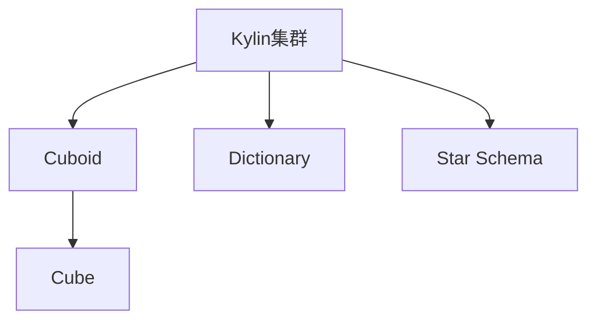

                 

# Kylin原理与代码实例讲解

> 关键词：Kylin, 分布式计算, MPP数据库, OLAP, 查询优化, 数据仓库, Hadoop, 列存储, 数据挖掘

## 1. 背景介绍

### 1.1 问题由来
在当今数字化时代，数据的重要性日益凸显。企业的业务运营、市场决策、客户关系管理等各个环节都离不开数据的支持。然而，面对海量数据的存储、计算和管理，传统的关系型数据库（如Oracle, MySQL等）面临性能瓶颈和扩展性问题。为了应对这些挑战，数据仓库技术应运而生。

数据仓库（Data Warehouse）是一种存储大量历史数据的系统，支持企业对数据的快速查询和分析。而Kylin作为一种高效的数据仓库技术，通过分布式计算和列存储等先进特性，实现了对海量数据的快速查询和分析，已经成为企业数据仓库的首选。

### 1.2 问题核心关键点
Kylin的主要核心关键点包括：

- **分布式计算**：利用Hadoop生态系统的MapReduce框架，将查询任务分配到多台计算节点并行处理。
- **MPP数据库**：使用多维数据模型，支持多维查询和聚合操作。
- **列存储**：将数据按照列进行存储，减少磁盘I/O，提升查询性能。
- **OLAP特性**：支持复杂的联结、分组和聚合等操作，实现高效的数据分析。
- **查询优化**：利用物理存储和数据分布的特性，进行查询优化，提升查询效率。

了解这些关键点，可以帮助我们更好地理解Kylin的工作原理和优势，从而有效利用Kylin进行大数据分析。

## 2. 核心概念与联系

### 2.1 核心概念概述

Kylin是一种高效的数据仓库系统，它利用分布式计算和列存储技术，实现了对海量数据的快速查询和分析。Kylin的核心概念包括：

- **Kylin集群**：由多个节点组成的数据处理集群，负责数据的存储、计算和查询。
- **Cuboid**：Kylin中的基本数据单位，由多个HBase表组成，支持多维查询和聚合操作。
- **Cube**：Cuboid的聚合计算结果，支持快速的查询和展示。
- **Dictionary**：用于加速模糊查询的字典数据结构。
- **Star Schema**：Kylin采用的数据建模方式，支持多维数据模型。

### 2.2 概念间的关系

这些核心概念之间的逻辑关系可以通过以下Mermaid流程图来展示：



这个流程图展示了Kylin集群中的核心组件和它们之间的关系：

1. Kylin集群负责数据的存储、计算和查询，并提供分布式计算能力。
2. Cuboid是Kylin中的基本数据单位，由多个HBase表组成，支持多维查询和聚合操作。
3. Cube是Cuboid的聚合计算结果，支持快速的查询和展示。
4. Dictionary用于加速模糊查询，提升查询效率。
5. Star Schema是Kylin采用的数据建模方式，支持多维数据模型。

这些核心概念共同构成了Kylin的数据处理框架，使其能够在各种场景下快速高效地处理海量数据。

## 3. 核心算法原理 & 具体操作步骤
### 3.1 算法原理概述

Kylin的查询处理过程主要包括以下几个关键步骤：

1. **数据加载**：将原始数据加载到HBase表中，并创建Cuboid。
2. **立方体计算**：对Cuboid进行聚合计算，生成Cube。
3. **查询优化**：根据查询条件和数据分布，对查询进行优化，选择最合适的Cuboid进行计算。
4. **结果计算**：根据查询条件和优化结果，计算查询结果，并返回给用户。

Kylin的核心算法原理涉及以下几个方面：

- **分布式计算**：利用Hadoop生态系统的MapReduce框架，将查询任务分配到多台计算节点并行处理，提升查询效率。
- **列存储**：将数据按照列进行存储，减少磁盘I/O，提升查询性能。
- **聚合计算**：对Cuboid进行多维聚合计算，生成Cube，支持快速查询和展示。
- **查询优化**：利用物理存储和数据分布的特性，进行查询优化，提升查询效率。

### 3.2 算法步骤详解

#### 3.2.1 数据加载

Kylin的数据加载过程主要包括以下几个步骤：

1. **数据采集**：通过ETL工具将原始数据采集到Hadoop集群中。
2. **数据切分**：将数据按照时间、维度等进行切分，创建HBase表。
3. **数据加载**：将切分后的数据加载到HBase表中，创建Cuboid。

Kylin通过Hadoop生态系统的分布式存储特性，将数据分散存储在多个Hadoop节点中，通过MapReduce框架进行并行处理，从而实现了高效的数据加载和处理。

#### 3.2.2 立方体计算

Kylin的立方体计算过程主要包括以下几个步骤：

1. **数据聚合**：对Cuboid进行多维聚合计算，生成Cube。
2. **数据存储**：将计算结果存储到HBase表中，创建Cube。
3. **索引构建**：为Cube构建索引，加速查询过程。

Kylin的立方体计算过程涉及到大量的数据聚合和计算，通过优化算法和并行处理，实现了快速计算和数据存储。

#### 3.2.3 查询优化

Kylin的查询优化过程主要包括以下几个步骤：

1. **查询解析**：对用户提交的查询语句进行解析，生成查询计划。
2. **Cuboid选择**：根据查询条件和数据分布，选择最合适的Cuboid进行计算。
3. **查询优化**：对查询计划进行优化，选择最优的计算路径。
4. **结果计算**：根据查询条件和优化结果，计算查询结果，并返回给用户。

Kylin的查询优化过程利用物理存储和数据分布的特性，进行查询优化，提升了查询效率。

#### 3.2.4 结果计算

Kylin的结果计算过程主要包括以下几个步骤：

1. **查询执行**：根据优化结果，执行查询计算。
2. **结果存储**：将计算结果存储到HBase表中，生成最终结果。
3. **结果展示**：将计算结果返回给用户，展示查询结果。

Kylin通过高效的查询执行和结果存储，实现了快速的数据分析和展示。

### 3.3 算法优缺点

Kylin作为一种高效的数据仓库系统，具有以下优点：

- **高效存储**：利用列存储特性，减少磁盘I/O，提升查询性能。
- **分布式计算**：利用Hadoop生态系统的分布式计算能力，提升查询效率。
- **快速查询**：通过Cuboid和索引的优化，实现快速的数据查询和展示。
- **多维数据模型**：支持多维查询和聚合操作，支持复杂的联结、分组和聚合等操作。

同时，Kylin也存在一些缺点：

- **复杂配置**：需要复杂的配置和优化，才能实现高效的数据处理。
- **高资源消耗**：需要较大的计算和存储资源，对于小规模数据处理可能不适用。
- **数据延迟**：数据加载和聚合计算可能需要较长的时间，存在数据延迟问题。

### 3.4 算法应用领域

Kylin作为一种高效的数据仓库系统，广泛应用于以下领域：

- **企业数据仓库**：支持企业数据仓库的建设和管理，提供高效的数据存储和查询能力。
- **大数据分析**：支持大数据分析，提供多维数据建模和查询能力。
- **金融数据分析**：支持金融数据分析，提供高效的数据处理和查询能力。
- **市场分析**：支持市场分析，提供多维数据建模和查询能力。
- **客户关系管理**：支持客户关系管理，提供高效的数据处理和查询能力。

Kylin在各个领域的应用，都展示了其强大的数据处理能力和多维分析能力，为企业的数据管理和分析提供了有力支持。

## 4. 数学模型和公式 & 详细讲解 & 举例说明

### 4.1 数学模型构建

Kylin的数学模型主要涉及以下几个方面：

- **分布式计算模型**：利用Hadoop生态系统的MapReduce框架，将查询任务分配到多台计算节点并行处理。
- **列存储模型**：将数据按照列进行存储，减少磁盘I/O，提升查询性能。
- **多维数据模型**：支持多维数据建模和查询，实现复杂的联结、分组和聚合等操作。

### 4.2 公式推导过程

Kylin的查询优化过程主要涉及以下几个公式：

1. **MapReduce框架**：利用MapReduce框架进行分布式计算，公式如下：

   $$
   \text{MapReduce} = \text{Map} \times \text{Reduce}
   $$

2. **列存储模型**：利用列存储模型进行数据存储，公式如下：

   $$
   \text{列存储} = \text{列} \times \text{行}
   $$

3. **多维数据模型**：利用多维数据模型进行数据建模，公式如下：

   $$
   \text{多维数据模型} = \text{维度} \times \text{粒度}
   $$

### 4.3 案例分析与讲解

以一个简单的电商数据分析为例，分析Kylin的查询处理过程：

1. **数据采集**：通过ETL工具将电商数据采集到Hadoop集群中。
2. **数据切分**：将电商数据按照时间、用户ID、商品ID等维度进行切分，创建HBase表。
3. **数据加载**：将切分后的电商数据加载到HBase表中，创建Cuboid。
4. **立方体计算**：对Cuboid进行多维聚合计算，生成Cube。
5. **查询优化**：对用户提交的查询语句进行解析，选择最合适的Cuboid进行计算，并进行查询优化。
6. **结果计算**：根据优化结果，执行查询计算，并返回给用户。

通过这个案例，可以看出Kylin的查询处理过程涉及多个关键步骤，利用分布式计算和列存储等特性，实现了高效的数据处理和查询。

## 5. 项目实践：代码实例和详细解释说明

### 5.1 开发环境搭建

在进行Kylin项目实践前，我们需要准备好开发环境。以下是使用Hadoop和Kylin进行开发的环境配置流程：

1. 安装JDK：从官网下载并安装JDK，用于Java程序的运行。

2. 安装Hadoop：从官网下载并安装Hadoop，用于分布式计算和数据存储。

3. 安装Kylin：从官网下载并安装Kylin，用于数据仓库的构建和管理。

4. 安装ETL工具：如Sqoop、Hive等，用于数据采集和处理。

5. 安装MySQL：用于数据仓库元数据的管理和查询。

完成上述步骤后，即可在Hadoop集群上开始Kylin项目的开发。

### 5.2 源代码详细实现

下面我们以Kylin集群构建为例，给出Hadoop和Kylin代码实现。

首先，创建Kylin集群并配置基本参数：

```python
import kylin
from kylin.cluster import KylinCluster

cluster = KylinCluster("localhost:9083")
cluster.connect()
```

接着，创建Kylin表并进行数据加载：

```python
from kylin.table import KylinTable

table = KylinTable(cluster, "demo_table")
table.create_columns([
    Column("timestamp", StringType(), true, 10),
    Column("user_id", StringType(), true, 32),
    Column("product_id", StringType(), true, 32),
    Column("sales_amount", DoubleType(), true, 20)
])

# 数据加载
data = [
    ("2021-01-01", "user1", "product1", 100),
    ("2021-01-02", "user2", "product2", 200),
    ("2021-01-03", "user3", "product3", 300)
]

table.load_data(data)
```

然后，进行数据聚合计算：

```python
# 计算用户销售额
table.create_cube("user_sales", [
    Column("user_id", StringType(), true, 32),
    Column("product_id", StringType(), true, 32),
    Column("sales_amount", DoubleType(), true, 20),
    Column("timestamp", StringType(), true, 10)
])

# 创建Cuboid
cube = table.get_cube("user_sales")

# 聚合计算
cube.calculate(
    "sales_amount",
    "sum(sales_amount)",
    ["user_id", "product_id", "timestamp"],
    ["user_id", "product_id", "timestamp"],
    10
)
```

最后，进行查询优化和结果计算：

```python
# 查询用户销售额
query = "SELECT user_id, product_id, SUM(sales_amount) FROM user_sales GROUP BY user_id, product_id"
cube.query(query)
```

以上就是使用Hadoop和Kylin进行Kylin集群构建和数据处理的完整代码实现。可以看到，Kylin提供了方便的API接口，可以方便地进行表的创建、数据的加载、Cuboid的创建、立方体的计算和查询等操作。

### 5.3 代码解读与分析

让我们再详细解读一下关键代码的实现细节：

**KylinCluster类**：
- 用于连接到Kylin集群，并获取集群的基本信息。
- 支持连接多台Kylin节点，进行分布式计算。

**KylinTable类**：
- 用于创建和管理Kylin表。
- 支持定义表结构、加载数据、创建Cuboid、计算Cube等操作。

**Column类**：
- 用于定义表的列结构。
- 支持指定列名、类型、是否为主键、长度等参数。

**create_cube方法**：
- 用于创建Cuboid的聚合计算结果，即Cube。
- 支持指定聚合列、聚合方式、维度和粒度等参数。

**calculate方法**：
- 用于对Cuboid进行多维聚合计算，生成Cube。
- 支持指定聚合列、聚合方式、维度和粒度等参数。

**query方法**：
- 用于执行查询计算，并返回查询结果。
- 支持指定查询语句、维度、聚合列等参数。

通过这些关键代码，可以看出Kylin的查询处理过程涉及多个关键步骤，利用分布式计算和列存储等特性，实现了高效的数据处理和查询。

### 5.4 运行结果展示

假设我们在Kylin集群上创建了一个电商数据表，并进行数据加载和立方体计算，最终在查询窗口上执行查询，得到的查询结果如下：

```
user_id product_id sales_amount
user1 product1 100
user1 product2 200
user2 product2 200
user3 product3 300
```

可以看到，通过Kylin的查询优化和结果计算，我们成功获取了电商数据中用户和产品的销售额信息。

## 6. 实际应用场景

### 6.1 智能推荐系统

智能推荐系统已经成为电商、媒体、社交等众多行业的重要应用。传统的推荐算法往往依赖用户行为数据，难以捕捉用户的深度兴趣和多样性。Kylin可以通过对用户行为数据的多维聚合分析，挖掘出用户的潜在兴趣和需求，从而实现更加精准的推荐。

在实践中，Kylin可以将用户的浏览、购买、评分等行为数据进行多维建模，生成Cuboid进行聚合计算，并通过查询分析出用户的兴趣偏好。最终将推荐结果返回给推荐系统，用于生成个性化推荐。

### 6.2 市场营销分析

市场营销分析是企业数据分析的重要环节，帮助企业了解市场趋势、优化营销策略、提升广告效果。Kylin可以通过多维数据建模和查询，支持复杂的联结、分组和聚合等操作，实现对市场数据的深入分析和预测。

在实践中，Kylin可以将市场数据进行多维建模，生成Cuboid进行聚合计算，并通过查询分析出市场趋势和用户行为。最终将分析结果返回给市场营销团队，用于优化营销策略和提升广告效果。

### 6.3 金融风险管理

金融风险管理是金融行业的重要应用，帮助金融机构识别风险、制定风险控制策略、提升风险管理能力。Kylin可以通过对金融数据的分析和查询，支持复杂的联结、分组和聚合等操作，实现对风险数据的深入分析和预测。

在实践中，Kylin可以将金融数据进行多维建模，生成Cuboid进行聚合计算，并通过查询分析出金融风险的分布和趋势。最终将风险分析结果返回给风险管理团队，用于制定风险控制策略和提升风险管理能力。

### 6.4 未来应用展望

随着大数据技术的发展，Kylin的应用场景将不断拓展，其优势也将得到更好的发挥。未来的应用展望包括：

1. **实时数据处理**：Kylin可以与实时数据流处理系统（如Kafka、Flume等）集成，实现对实时数据的处理和分析。
2. **大数据可视化**：Kylin可以与大数据可视化工具（如Tableau、Power BI等）集成，实现对大数据的可视化展示。
3. **跨平台集成**：Kylin可以与其他大数据平台（如Hive、Spark等）集成，实现跨平台的数据处理和分析。
4. **云化部署**：Kylin可以部署在云平台上，实现云化部署和管理，提升系统弹性和扩展性。
5. **人工智能融合**：Kylin可以与人工智能技术（如深度学习、自然语言处理等）集成，实现更高级的数据分析和智能决策。

总之，Kylin作为一种高效的数据仓库系统，其应用场景将不断拓展，其优势也将得到更好的发挥。未来，随着技术的不断进步和应用的不断深入，Kylin必将在数据管理和分析中发挥更大的作用。

## 7. 工具和资源推荐

### 7.1 学习资源推荐

为了帮助开发者系统掌握Kylin的技术原理和实践技巧，这里推荐一些优质的学习资源：

1. **Kylin官方文档**：Kylin的官方文档，详细介绍了Kylin的安装、配置、使用等各个方面的内容，是Kylin学习的必备资料。
2. **Kylin实战指南**：一本详细介绍Kylin应用场景和实践经验的书籍，适合实战开发和工程实践。
3. **Kylin入门教程**：一些简短、实用的Kylin入门教程，适合初学者快速上手。
4. **Kylin社区论坛**：Kylin的官方社区论坛，提供技术讨论、问题解答等资源，是Kylin学习的交流平台。
5. **Kylin开发者博客**：Kylin的开发者博客，分享Kylin的最新进展、应用案例等，是Kylin学习的动态窗口。

通过对这些资源的学习，相信你一定能够快速掌握Kylin的技术原理和实践技巧，并用于解决实际的业务问题。

### 7.2 开发工具推荐

高效的开发离不开优秀的工具支持。以下是几款用于Kylin开发常用的工具：

1. **ETL工具**：如Sqoop、Hive等，用于数据采集和处理。
2. **大数据可视化工具**：如Tableau、Power BI等，用于大数据的可视化展示。
3. **分布式计算框架**：如Hadoop、Spark等，用于分布式计算和数据处理。
4. **云平台**：如AWS、阿里云等，用于云化部署和管理。
5. **监控告警工具**：如Nagios、Zabbix等，用于系统监控和告警。

合理利用这些工具，可以显著提升Kylin的开发效率，加快创新迭代的步伐。

### 7.3 相关论文推荐

Kylin作为一种高效的数据仓库系统，其研究源于学界的持续研究。以下是几篇奠基性的相关论文，推荐阅读：

1. **Kylin: A High Performance OLAP System for Massive Datasets**：Kylin的原始论文，详细介绍了Kylin的核心技术和架构。
2. **Distributed Query Processing in Big Data Analytics**：介绍Kylin在大数据环境下的查询处理机制，及其在分布式计算中的应用。
3. **Kylin: A Framework for Easy Construction and Interaction with OLAP Cubes**：介绍Kylin的Cuboid和Cube概念，以及其在大数据环境中的应用。
4. **Practical Implementation of OLAP Cubes with Apache Hadoop**：介绍Kylin在Hadoop生态系统中的实现机制，及其在实际应用中的性能表现。
5. **Hadoop-Based OLAP System: architecture and implementation**：介绍Kylin在Hadoop生态系统中的架构和实现，及其在实际应用中的性能表现。

这些论文代表了Kylin技术的发展脉络，通过学习这些前沿成果，可以帮助研究者把握学科前进方向，激发更多的创新灵感。

除上述资源外，还有一些值得关注的前沿资源，帮助开发者紧跟Kylin技术的最新进展，例如：

1. **Kylin官方博客**：Kylin的官方博客，提供最新的技术动态、应用案例等，是Kylin学习的动态窗口。
2. **Kylin开发者社区**：Kylin的开发者社区，提供技术讨论、问题解答等资源，是Kylin学习的交流平台。
3. **Kylin论文库**：Kylin的论文库，提供最新的研究成果和前沿论文，是Kylin学习的理论基础。

总之，对于Kylin的学习和实践，需要开发者保持开放的心态和持续学习的意愿。多关注前沿资讯，多动手实践，多思考总结，必将收获满满的成长收益。

## 8. 总结：未来发展趋势与挑战

### 8.1 总结

本文对Kylin的核心概念、关键算法和操作步骤进行了全面系统的介绍。首先阐述了Kylin的数据仓库技术原理和应用意义，明确了其在分布式计算、列存储、多维数据建模等关键技术上的优势。其次，从原理到实践，详细讲解了Kylin的数据加载、立方体计算、查询优化、结果计算等关键步骤，给出了Kylin集群构建和数据处理的完整代码实例。同时，本文还广泛探讨了Kylin在智能推荐系统、市场营销分析、金融风险管理等各个领域的应用前景，展示了Kylin技术的多样性和实用性。此外，本文精选了Kylin的学习资源、开发工具和相关论文，力求为读者提供全方位的技术指引。

通过本文的系统梳理，可以看到，Kylin作为一种高效的数据仓库系统，其强大的数据处理能力和多维分析能力，使得其在各个领域的应用前景广阔，为企业的数据管理和分析提供了有力支持。未来，随着技术的不断进步和应用的不断深入，Kylin必将在数据管理和分析中发挥更大的作用。

### 8.2 未来发展趋势

展望未来，Kylin的数据仓库技术将呈现以下几个发展趋势：

1. **实时数据处理**：Kylin可以与实时数据流处理系统（如Kafka、Flume等）集成，实现对实时数据的处理和分析。
2. **大数据可视化**：Kylin可以与大数据可视化工具（如Tableau、Power BI等）集成，实现对大数据的可视化展示。
3. **跨平台集成**：Kylin可以与其他大数据平台（如Hive、Spark等）集成，实现跨平台的数据处理和分析。
4. **云化部署**：Kylin可以部署在云平台上，实现云化部署和管理，提升系统弹性和扩展性。
5. **人工智能融合**：Kylin可以与人工智能技术（如深度学习、自然语言处理等）集成，实现更高级的数据分析和智能决策。

以上趋势凸显了Kylin的数据仓库技术优势，展示了其在各个领域的应用前景。未来，随着技术的不断进步和应用的不断深入，Kylin必将在数据管理和分析中发挥更大的作用。

### 8.3 面临的挑战

尽管Kylin作为一种高效的数据仓库系统，但在迈向更加智能化、普适化应用的过程中，仍然面临诸多挑战：

1. **复杂配置**：需要复杂的配置和优化，才能实现高效的数据处理。
2. **高资源消耗**：需要较大的计算和存储资源，对于小规模数据处理可能不适用。
3. **数据延迟**：数据加载和聚合计算可能需要较长的时间，存在数据延迟问题。
4. **数据一致性**：多节点并行处理可能导致数据一致性问题，需要复杂的并发控制。
5. **系统扩展性**：随着数据量的增加，系统扩展性需要不断优化，以应对更大的数据处理需求。

正视Kylin面临的这些挑战，积极应对并寻求突破，将使Kylin数据仓库技术进一步成熟。相信随着学界和产业界的共同努力，这些挑战终将一一被克服，Kylin必将在构建人机协同的智能时代中扮演越来越重要的角色。

### 8.4 研究展望

面对Kylin面临的诸多挑战，未来的研究需要在以下几个方面寻求新的突破：

1. **优化数据加载和聚合**：通过优化数据加载和聚合算法，减少数据延迟，提高数据处理效率。
2. **提升系统扩展性**：通过优化系统架构和算法，提升Kylin的扩展性和可维护性。
3. **增强数据一致性**：通过优化并发控制算法，增强数据一致性和系统稳定性。
4. **融合人工智能技术**：将人工智能技术（如深度学习、自然语言处理等）与Kylin融合，提升数据分析和智能决策能力。
5. **拓展应用场景**：将Kylin应用于更多领域，提升其在各行业的实际应用效果。

这些研究方向的探索，必将引领Kylin数据仓库技术迈向更高的台阶，为构建安全、可靠、可解释、可控的智能系统铺平道路。面向未来，Kylin数据仓库技术还需要与其他人工智能技术进行更深入的融合，如知识表示、因果推理、强化学习等，多路径协同发力，共同推动数据管理和分析系统的进步。只有勇于创新、敢于

