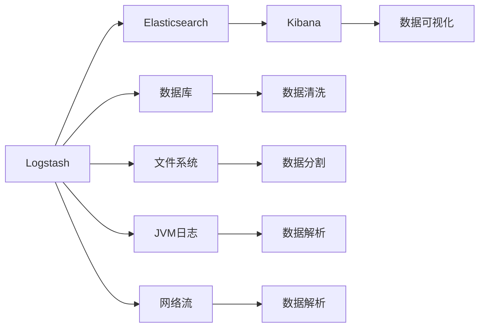
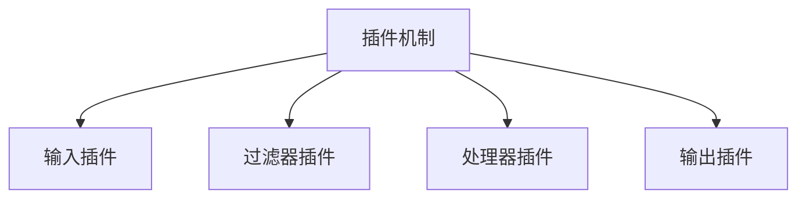
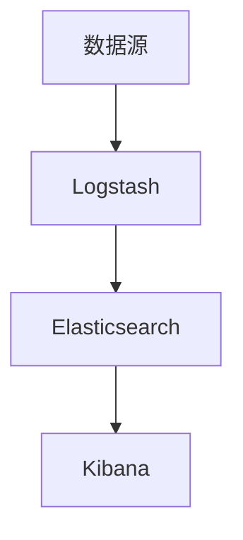

                 

# Logstash原理与代码实例讲解

> 关键词：Logstash, 数据管道, Elastic Stack, 日志处理, 数据清洗, 实时数据流处理, 代码实例

## 1. 背景介绍

### 1.1 问题由来
在当今数据驱动的时代，企业每天都在产生海量的数据，包括日志、交易记录、网络流量等。如何高效地收集、处理、分析和存储这些数据，成为企业面临的重要挑战。Logstash作为一个数据收集和预处理的工具，已成为Elastic Stack（包括Elasticsearch、Kibana和Logstash）中的核心组件，广泛应用于日志处理、监控、流处理等多个领域。本文将深入探讨Logstash的工作原理和代码实现，帮助读者系统理解其功能和应用。

### 1.2 问题核心关键点
Logstash是一个开源的数据管道工具，旨在帮助用户快速高效地处理和转换数据。它支持多种数据源和数据输出，可以实现数据的实时收集、过滤、转换和存储。Logstash的核心功能包括：
- 数据收集：从各种数据源收集数据，包括文件、网络流、数据库、JVM日志等。
- 数据清洗：对收集到的数据进行清洗和过滤，去除无用信息。
- 数据转换：通过插件对数据进行格式转换、解析、分割、重构等操作。
- 数据输出：将处理后的数据输出到各种目的地，如Elasticsearch、文件、数据库等。

### 1.3 问题研究意义
研究Logstash的工作原理和代码实现，对于提升企业的数据处理能力，降低数据处理的复杂性，具有重要意义。具体而言：
1. 提升数据处理效率。通过Logstash的实时数据流处理能力，企业可以迅速处理大量数据，避免数据堆积和滞后。
2. 增强数据质量。通过数据清洗和转换，提升数据的准确性和一致性，为企业决策提供可靠依据。
3. 优化数据存储。Logstash支持将处理后的数据输出到Elasticsearch等数据仓库，便于后续的分析和检索。
4. 支持多样化的数据源和输出。Logstash的插件生态丰富，可以灵活适配不同的数据源和输出目标，满足多样化的需求。

## 2. 核心概念与联系

### 2.1 核心概念概述

为了更好地理解Logstash的工作原理和实现细节，本节将介绍几个关键概念：

- Logstash：由Elastic提供的开源数据管道工具，支持多种数据源和输出，实现数据的收集、清洗、转换和存储。
- Elastic Stack：包括Elasticsearch、Logstash和Kibana，是一个完整的商业智能平台，支持数据的存储、搜索、可视化和分析。
- 插件机制：Logstash通过插件机制实现数据处理，插件包括输入、过滤和输出插件，支持丰富的数据处理功能。
- 数据流：Logstash支持实时数据流处理，可以高效地处理和转换大量数据。
- 过滤器和处理器：Logstash通过过滤器和处理器插件，实现数据的清洗、转换、解析等操作。
- 输出插件：将处理后的数据输出到各种目的地，如Elasticsearch、文件、数据库等。

这些核心概念之间的逻辑关系可以通过以下Mermaid流程图来展示：



这个流程图展示了Logstash的核心概念及其之间的关系：

1. Logstash从多种数据源收集数据。
2. 对收集到的数据进行清洗、解析、分割等操作，通过过滤器和处理器插件实现。
3. 将处理后的数据输出到Elasticsearch、数据库、文件系统等目的地。
4. 最终数据通过Kibana进行可视化分析。

### 2.2 概念间的关系

这些核心概念之间存在着紧密的联系，形成了Logstash的数据处理生态系统。下面我们通过几个Mermaid流程图来展示这些概念之间的关系。

#### 2.2.1 Logstash的核心架构



这个流程图展示了Logstash的插件架构，包括输入、过滤和输出插件，支持丰富的数据处理功能。

#### 2.2.2 数据流处理的实现


这个流程图展示了Logstash的数据流处理过程，从输入、过滤到处理和输出。

#### 2.2.3 Elastic Stack的集成


这个流程图展示了Logstash与Elastic Stack的集成，通过Elasticsearch进行数据存储和搜索，通过Kibana进行数据可视化。

### 2.3 核心概念的整体架构

最后，我们用一个综合的流程图来展示这些核心概念在大语言模型微调过程中的整体架构：



这个综合流程图展示了从数据源到Logstash，再到Elasticsearch和Kibana的整体数据处理流程。

## 3. 核心算法原理 & 具体操作步骤
### 3.1 算法原理概述

Logstash的核心算法原理可以概括为以下三点：

1. **数据收集**：通过各种输入插件，从不同数据源收集数据。
2. **数据处理**：通过过滤器和处理器插件，对收集到的数据进行清洗、转换和解析。
3. **数据输出**：通过输出插件，将处理后的数据输出到Elasticsearch、数据库、文件系统等目的地。

具体而言，Logstash的工作流程包括以下步骤：

1. 读取配置文件，初始化Logstash。
2. 通过输入插件从数据源收集数据。
3. 对收集到的数据进行过滤器和处理器插件的处理，实现数据的清洗、转换和解析。
4. 通过输出插件将处理后的数据输出到Elasticsearch等目的地。

### 3.2 算法步骤详解

下面以一个实际案例来说明Logstash的工作流程和具体操作步骤。

#### 3.2.1 数据收集

假设我们需要从Apache服务器上收集日志数据，可以使用文件输入插件。首先，需要创建一个配置文件`input.logstash`，内容如下：

```yaml
input {
  file {
    path => ["/path/to/logs/*.log"]
    start_position => "beginning"
    codec => "line"
  }
}
```

这个配置文件指定了要收集的日志文件路径和编码格式，并使用`start_position => "beginning"`指定从日志文件开始处开始收集。

#### 3.2.2 数据处理

假设我们需要对收集到的日志数据进行清洗和解析，可以使用过滤器插件。在同一个配置文件`input.logstash`中添加以下代码：

```yaml
filter {
  # 使用grok插件解析日志格式
  grok {
    match => ["message", "^(\\d{4}-\\d{2}-\\d{2} \\d{2}:\\d{2}:\\d{2} \\S+ \\S+ \\S+ \\S+ \\S+\\S+\\S+\\S+\\S+\\S+\\S+\\S+"]
  }
  # 使用remove_if_empty插件过滤空字段
  remove_if_empty {
    fields => ["host", "log_level", "message"]
  }
}
```

这个配置文件使用`grok`插件解析日志格式，并使用`remove_if_empty`插件过滤空字段。

#### 3.2.3 数据输出

假设我们需要将处理后的日志数据输出到Elasticsearch，可以使用ElasticSearch输出插件。在同一个配置文件`input.logstash`中添加以下代码：

```yaml
output {
  elasticsearch {
    hosts => ["localhost:9200"]
    index => "logs-%{+YYYY.MM.dd}"
    document_type => "log"
  }
}
```

这个配置文件指定了Elasticsearch的地址和索引名，并将数据输出到对应的索引中。

### 3.3 算法优缺点

Logstash作为一种高效的数据处理工具，具有以下优点：

1. **灵活性高**：通过插件机制，支持多种数据源和输出，满足多样化的需求。
2. **处理能力强**：支持实时数据流处理，可以高效地处理和转换大量数据。
3. **易用性好**：配置简单，语法直观，易于上手。
4. **扩展性强**：通过插件生态，支持丰富的数据处理功能，扩展性强。

但同时也存在以下缺点：

1. **性能瓶颈**：在处理大规模数据时，可能会遇到性能瓶颈，需要优化配置和硬件资源。
2. **配置复杂**：配置文件庞大，复杂的配置可能导致调试困难。
3. **安全性问题**：默认配置文件可能存在安全漏洞，需要谨慎使用。
4. **资源消耗大**：Logstash需要占用大量的内存和CPU资源，对于资源受限的服务器可能不适用。

### 3.4 算法应用领域

Logstash广泛应用于日志处理、监控、流处理等多个领域，具体应用包括：

1. **日志收集和管理**：从各种数据源收集日志，并进行清洗和存储，支持日积月累的日志管理。
2. **监控和告警**：通过监控数据流，及时发现系统异常和故障，并进行告警和处理。
3. **实时流处理**：对实时数据流进行清洗、转换和解析，支持流式计算和分析。
4. **数据清洗和转换**：对原始数据进行清洗和转换，提升数据质量和一致性，为后续分析奠定基础。
5. **数据可视化**：通过Kibana进行数据可视化，直观展示数据趋势和模式，支持决策支持。

这些应用场景使得Logstash成为企业数据处理的重要工具，广泛应用于各种行业和领域。

## 4. 数学模型和公式 & 详细讲解 & 举例说明

### 4.1 数学模型构建

Logstash的核心算法原理可以抽象为以下数学模型：

假设有一个数据流$D$，需要对其进行收集、清洗、转换和存储。Logstash的数据处理过程可以抽象为以下步骤：

1. 从数据流$D$中收集数据，生成数据流$D'$。
2. 对数据流$D'$进行过滤器处理，生成数据流$D''$。
3. 对数据流$D''$进行处理器处理，生成数据流$D'''$。
4. 将数据流$D'''$输出到目的地，如Elasticsearch。

这个数学模型可以抽象为以下形式：

$$D' = \text{Collect}(D)$$
$$D'' = \text{Filter}(D')$$
$$D''' = \text{Process}(D'')$$
$$D''' \to \text{Store}$$

其中，`Collect`表示数据收集操作，`Filter`表示数据过滤操作，`Process`表示数据处理操作，`Store`表示数据存储操作。

### 4.2 公式推导过程

以下我们以一个简单的日志解析和清洗过程为例，推导Logstash的数学模型和计算公式。

假设原始日志数据如下：

```
2021-09-01 13:30:45 INFO [app] User login success
```

我们需要将其解析为JSON格式，并过滤掉空字段。可以使用`grok`插件和`remove_if_empty`插件来实现。

首先，使用`grok`插件解析日志格式，生成以下JSON格式数据：

```json
{"timestamp":"2021-09-01 13:30:45","level":"INFO","message":"User login success","app":"app"}
```

然后，使用`remove_if_empty`插件过滤空字段，生成以下JSON格式数据：

```json
{"timestamp":"2021-09-01 13:30:45","level":"INFO","message":"User login success"}
```

这个JSON格式数据可以直接输出到Elasticsearch，进行后续的存储和分析。

### 4.3 案例分析与讲解

假设我们需要对Apache服务器上的访问日志进行处理，输出到Elasticsearch中进行存储和分析。

首先，创建配置文件`input.logstash`，内容如下：

```yaml
input {
  file {
    path => "/var/log/apache2/access.log"
    start_position => "beginning"
    codec => "line"
  }
}

filter {
  grok {
    match => ["message", "^(\\d{4}-\\d{2}-\\d{2} \\d{2}:\\d{2}:\\d{2} \\S+ \\S+ \\S+ \\S+ \\S+\\S+\\S+\\S+\\S+\\S+\\S+\\S+\\S+\\S+\\S+\\S+\\S+\\S+\\S+\\S+\\S+\\S+\\S+\\S+\\S+\\S+\\S+\\S+\\S+\\S+\\S+\\S+\\S+\\S+\\S+\\S+\\S+\\S+\\S+\\S+\\S+\\S+\\S+\\S+\\S+\\S+\\S+\\S+\\S+\\S+\\S+\\S+\\S+\\S+\\S+\\S+\\S+\\S+\\S+\\S+\\S+\\S+\\S+\\S+\\S+\\S+\\S+\\S+\\S+\\S+\\S+\\S+\\S+\\S+\\S+\\S+\\S+\\S+\\S+\\S+\\S+\\S+\\S+\\S+\\S+\\S+\\S+\\S+\\S+\\S+\\S+\\S+\\S+\\S+\\S+\\S+\\S+\\S+\\S+\\S+\\S+\\S+\\S+\\S+\\S+\\S+\\S+\\S+\\S+\\S+\\S+\\S+\\S+\\S+\\S+\\S+\\S+\\S+\\S+\\S+\\S+\\S+\\S+\\S+\\S+\\S+\\S+\\S+\\S+\\S+\\S+\\S+\\S+\\S+\\S+\\S+\\S+\\S+\\S+\\S+\\S+\\S+\\S+\\S+\\S+\\S+\\S+\\S+\\S+\\S+\\S+\\S+\\S+\\S+\\S+\\S+\\S+\\S+\\S+\\S+\\S+\\S+\\S+\\S+\\S+\\S+\\S+\\S+\\S+\\S+\\S+\\S+\\S+\\S+\\S+\\S+\\S+\\S+\\S+\\S+\\S+\\S+\\S+\\S+\\S+\\S+\\S+\\S+\\S+\\S+\\S+\\S+\\S+\\S+\\S+\\S+\\S+\\S+\\S+\\S+\\S+\\S+\\S+\\S+\\S+\\S+\\S+\\S+\\S+\\S+\\S+\\S+\\S+\\S+\\S+\\S+\\S+\\S+\\S+\\S+\\S+\\S+\\S+\\S+\\S+\\S+\\S+\\S+\\S+\\S+\\S+\\S+\\S+\\S+\\S+\\S+\\S+\\S+\\S+\\S+\\S+\\S+\\S+\\S+\\S+\\S+\\S+\\S+\\S+\\S+\\S+\\S+\\S+\\S+\\S+\\S+\\S+\\S+\\S+\\S+\\S+\\S+\\S+\\S+\\S+\\S+\\S+\\S+\\S+\\S+\\S+\\S+\\S+\\S+\\S+\\S+\\S+\\S+\\S+\\S+\\S+\\S+\\S+\\S+\\S+\\S+\\S+\\S+\\S+\\S+\\S+\\S+\\S+\\S+\\S+\\S+\\S+\\S+\\S+\\S+\\S+\\S+\\S+\\S+\\S+\\S+\\S+\\S+\\S+\\S+\\S+\\S+\\S+\\S+\\S+\\S+\\S+\\S+\\S+\\S+\\S+\\S+\\S+\\S+\\S+\\S+\\S+\\S+\\S+\\S+\\S+\\S+\\S+\\S+\\S+\\S+\\S+\\S+\\S+\\S+\\S+\\S+\\S+\\S+\\S+\\S+\\S+\\S+\\S+\\S+\\S+\\S+\\S+\\S+\\S+\\S+\\S+\\S+\\S+\\S+\\S+\\S+\\S+\\S+\\S+\\S+\\S+\\S+\\S+\\S+\\S+\\S+\\S+\\S+\\S+\\S+\\S+\\S+\\S+\\S+\\S+\\S+\\S+\\S+\\S+\\S+\\S+\\S+\\S+\\S+\\S+\\S+\\S+\\S+\\S+\\S+\\S+\\S+\\S+\\S+\\S+\\S+\\S+\\S+\\S+\\S+\\S+\\S+\\S+\\S+\\S+\\S+\\S+\\S+\\S+\\S+\\S+\\S+\\S+\\S+\\S+\\S+\\S+\\S+\\S+\\S+\\S+\\S+\\S+\\S+\\S+\\S+\\S+\\S+\\S+\\S+\\S+\\S+\\S+\\S+\\S+\\S+\\S+\\S+\\S+\\S+\\S+\\S+\\S+\\S+\\S+\\S+\\S+\\S+\\S+\\S+\\S+\\S+\\S+\\S+\\S+\\S+\\S+\\S+\\S+\\S+\\S+\\S+\\S+\\S+\\S+\\S+\\S+\\S+\\S+\\S+\\S+\\S+\\S+\\S+\\S+\\S+\\S+\\S+\\S+\\S+\\S+\\S+\\S+\\S+\\S+\\S+\\S+\\S+\\S+\\S+\\S+\\S+\\S+\\S+\\S+\\S+\\S+\\S+\\S+\\S+\\S+\\S+\\S+\\S+\\S+\\S+\\S+\\S+\\S+\\S+\\S+\\S+\\S+\\S+\\S+\\S+\\S+\\S+\\S+\\S+\\S+\\S+\\S+\\S+\\S+\\S+\\S+\\S+\\S+\\S+\\S+\\S+\\S+\\S+\\S+\\S+\\S+\\S+\\S+\\S+\\S+\\S+\\S+\\S+\\S+\\S+\\S+\\S+\\S+\\S+\\S+\\S+\\S+\\S+\\S+\\S+\\S+\\S+\\S+\\S+\\S+\\S+\\S+\\S+\\S+\\S+\\S+\\S+\\S+\\S+\\S+\\S+\\S+\\S+\\S+\\S+\\S+\\S+\\S+\\S+\\S+\\S+\\S+\\S+\\S+\\S+\\S+\\S+\\S+\\S+\\S+\\S+\\S+\\S+\\S+\\S+\\S+\\S+\\S+\\S+\\S+\\S+\\S+\\S+\\S+\\S+\\S+\\S+\\S+\\S+\\S+\\S+\\S+\\S+\\S+\\S+\\S+\\S+\\S+\\S+\\S+\\S+\\S+\\S+\\S+\\S+\\S+\\S+\\S+\\S+\\S+\\S+\\S+\\S+\\S+\\S+\\S+\\S+\\S+\\S+\\S+\\S+\\S+\\S+\\S+\\S+\\S+\\S+\\S+\\S+\\S+\\S+\\S+\\S+\\S+\\S+\\S+\\S+\\S+\\S+\\S+\\S+\\S+\\S+\\S+\\S+\\S+\\S+\\S+\\S+\\S+\\S+\\S+\\S+\\S+\\S+\\S+\\S+\\S+\\S+\\S+\\S+\\S+\\S+\\S+\\S+\\S+\\S+\\S+\\S+\\S+\\S+\\S+\\S+\\S+\\S+\\S+\\S+\\S+\\S+\\S+\\S+\\S+\\S+\\S+\\S+\\S+\\S+\\S+\\S+\\S+\\S+\\S+\\S+\\S+\\S+\\S+\\S+\\S+\\S+\\S+\\S+\\S+\\S+\\S+\\S+\\S+\\S+\\S+\\S+\\S+\\S+\\S+\\S+\\S+\\S+\\S+\\S+\\S+\\S+\\S+\\S+\\S+\\S+\\S+\\S+\\S+\\S+\\S+\\S+\\S+\\S+\\S+\\S+\\S+\\S+\\S+\\S+\\S+\\S+\\S+\\S+\\S+\\S+\\S+\\S+\\S+\\S+\\S+\\S+\\S+\\S+\\S+\\S+\\S+\\S+\\S+\\S+\\S+\\S+\\S+\\S+\\S+\\S+\\S+\\S+\\S+\\S+\\S+\\S+\\S+\\S+\\S+\\S+\\S+\\S+\\S+\\S+\\S+\\S+\\S+\\S+\\S+\\S+\\S+\\S+\\S+\\S+\\S+\\S+\\S+\\S+\\S+\\S+\\S+\\S+\\S+\\S+\\S+\\S+\\S+\\S+\\S+\\S+\\S+\\S+\\S+\\S+\\S+\\S+\\S+\\S+\\S+\\S+\\S+\\S+\\S+\\S+\\S+\\S+\\S+\\S+\\S+\\S+\\S+\\S+\\S+\\S+\\S+\\S+\\S+\\S+\\S+\\S+\\S+\\S+\\S+\\S+\\S+\\S+\\S+\\S+\\S+\\S+\\S+\\S+\\S+\\S+\\S+\\S+\\S+\\S+\\S+\\S+\\S+\\S+\\S+\\S+\\S+\\S+\\S+\\S+\\S+\\S+\\S+\\S+\\S+\\S+\\S+\\S+\\S+\\S+\\S+\\S+\\S+\\S+\\S+\\S+\\S+\\S+\\S+\\S+\\S+\\S+\\S+\\S+\\S+\\S+\\S+\\S+\\S+\\S+\\S+\\S+\\S+\\S+\\S+\\S+\\S+\\S+\\S+\\S+\\S+\\S+\\S+\\S+\\S+\\S+\\S+\\S+\\S+\\S+\\S+\\S+\\S+\\S+\\S+\\S+\\S+\\S+\\S+\\S+\\S+\\S+\\S+\\S+\\S+\\S+\\S+\\S+\\S+\\S+\\S+\\S+\\S+\\S+\\S+\\S+\\S+\\S+\\S+\\S+\\S+\\S+\\S+\\S+\\S+\\S+\\S+\\S+\\S+\\S+\\S+\\S+\\S+\\S+\\S+\\S+\\S+\\S+\\S+\\S+\\S+\\S+\\

