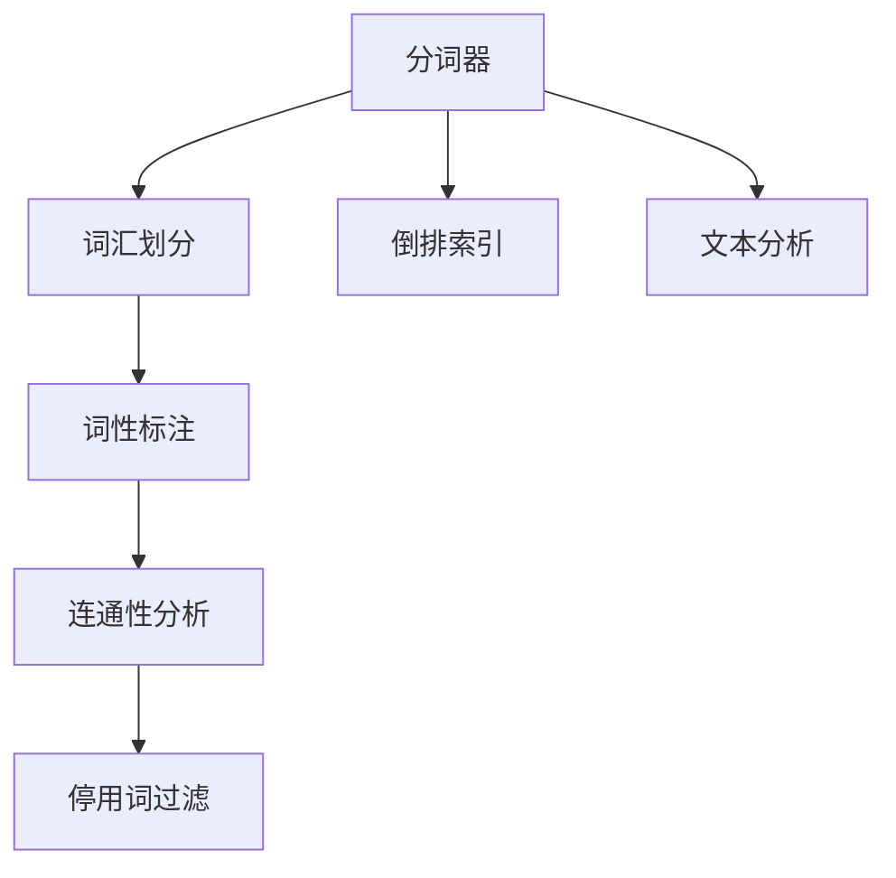
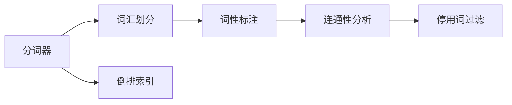
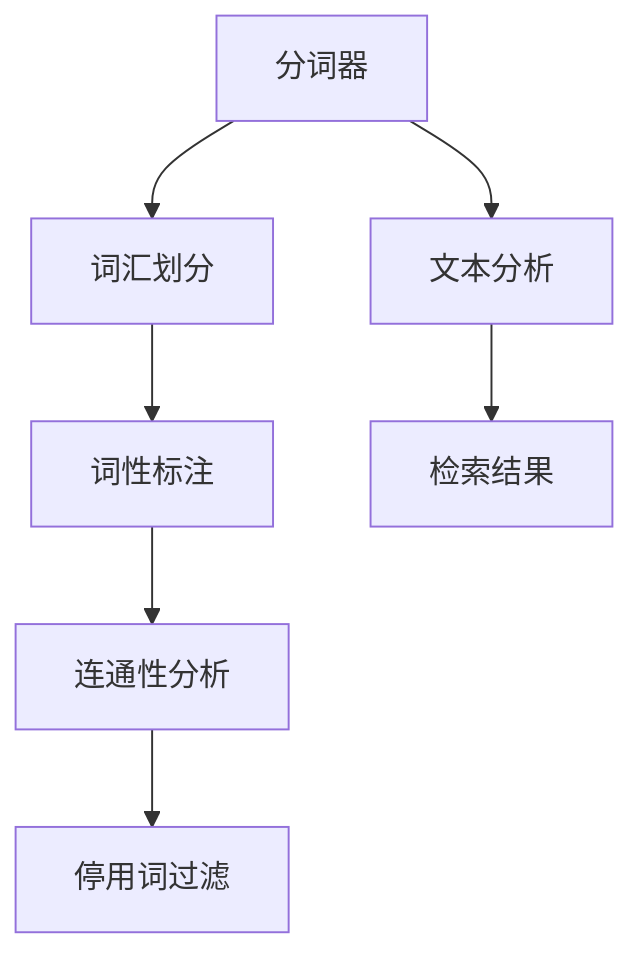
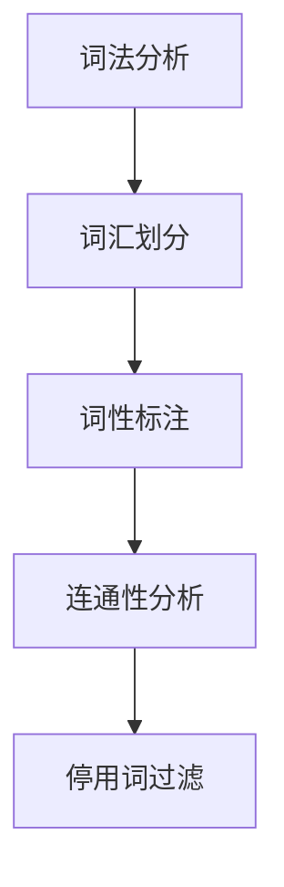
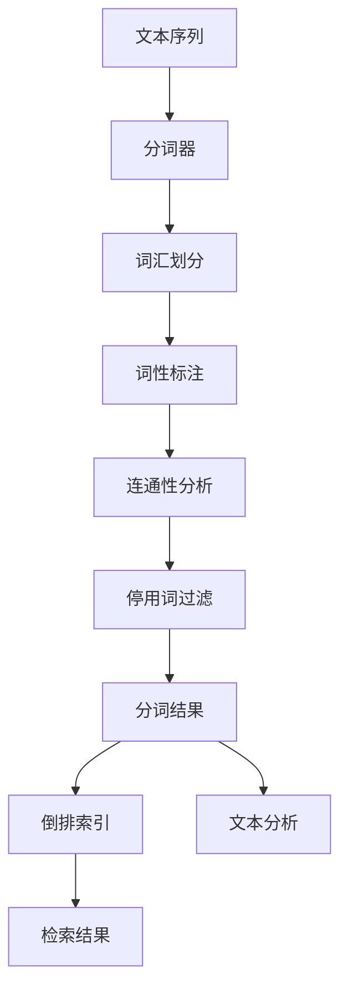

                 

# Lucene分词原理与代码实例讲解

> 关键词：Lucene, 分词器, 倒排索引, 自然语言处理, 搜索引擎, 文本分析

## 1. 背景介绍

### 1.1 问题由来

在搜索引擎、文本分析等自然语言处理(NLP)领域，分词是不可或缺的一环。分词是将连续的文本序列按照语义、语法规则进行切分，得到词汇单元的过程。准确的词汇划分，有助于提升信息检索、文本分析的准确性和效率。传统分词方法依赖人工标注，难以处理复杂多变的文本，而自动分词技术则能实现高效的自动化词汇划分。

Lucene是一款开源的搜索引擎库，其核心组件之一就是高效的自动分词器。Lucene分词器支持多种语言的词汇划分，能够适应不同的文本数据特点，广泛应用于搜索引擎、文本处理工具中。本文将详细讲解Lucene分词的原理与实践，并辅以代码实例，帮助读者深入理解分词技术。

### 1.2 问题核心关键点

Lucene分词器的核心思想是通过词法分析器实现自动分词，将连续文本序列切分成单个词汇。其基本步骤如下：

1. **词汇划分**：根据预定义的规则，将连续文本序列切分成可能的词汇。
2. **词性标注**：对切分出的每个词汇，标注其词性信息，如名词、动词、形容词等。
3. **连通性分析**：通过连通性分析，合并相邻的词汇，生成最终的分词结果。
4. **停用词过滤**：去除常见的停用词，如“的”、“是”等，只保留有意义的词汇。

本文将重点讲解Lucene分词器的核心算法，包括分词规则的构建、词性标注的实现、连通性分析的方法，并辅以代码实例，帮助读者深入理解分词原理与实践。

### 1.3 问题研究意义

Lucene分词器作为开源搜索引擎库的核心组件，其分词效果直接影响了搜索引擎的性能和准确性。深入理解Lucene分词器的原理与实现，对于构建高效、准确的文本处理系统，具有重要意义：

1. **提升信息检索效率**：准确的词汇划分有助于提高检索系统的召回率和精确率，减少误匹配和漏检。
2. **优化文本分析结果**：分词是文本分析的基础，准确的分词可以提升词频统计、实体识别等任务的准确性。
3. **支持多语言处理**：Lucene分词器支持多种语言的词汇划分，满足不同语言处理需求。
4. **提高搜索引擎质量**：通过优化分词器，可以提升搜索引擎的搜索效果和用户体验。
5. **促进技术交流**：分享Lucene分词器的实现原理与实践，促进学术交流和产业应用。

## 2. 核心概念与联系

### 2.1 核心概念概述

为更好地理解Lucene分词器的原理与实现，本节将介绍几个密切相关的核心概念：

- **分词器（Tokenizer）**：自动分词的核心组件，负责将连续文本序列切分成单个词汇。
- **倒排索引（Inverted Index）**：搜索引擎中用于存储文档与词汇映射关系的索引数据结构，是检索系统的高效实现方式。
- **词法分析（Lexical Analysis）**：通过语法和词法规则，对文本进行词汇划分和词性标注。
- **连通性分析（Connectivity Analysis）**：通过相邻词汇的连通性，合并相邻的词汇，生成最终的分词结果。
- **停用词（Stop Words）**：常见且无意义的词汇，如“的”、“是”等，通常在分词过程中会被过滤掉。

这些核心概念之间的逻辑关系可以通过以下Mermaid流程图来展示：



这个流程图展示了大语言模型微调的完整过程。分词器作为核心组件，将文本序列切分成单个词汇，然后通过词性标注和连通性分析，合并相邻词汇，并过滤停用词，生成最终的分词结果。倒排索引和文本分析是分词结果的应用方向，用于支持搜索引擎和文本处理工具的实现。

### 2.2 概念间的关系

这些核心概念之间存在着紧密的联系，形成了Lucene分词器的完整生态系统。下面我们通过几个Mermaid流程图来展示这些概念之间的关系。

#### 2.2.1 分词器与倒排索引的关系



这个流程图展示了分词器与倒排索引的关系。分词器将文本序列切分成词汇，并将这些词汇和对应的词性信息存储在倒排索引中，供搜索引擎检索和文本分析使用。

#### 2.2.2 分词器与文本分析的关系



这个流程图展示了分词器与文本分析的关系。分词器将文本序列切分成词汇，并通过词性标注和连通性分析生成分词结果，然后文本分析工具可以对这些分词结果进行词频统计、实体识别等处理，最终生成检索结果。

#### 2.2.3 词法分析与连通性分析的关系



这个流程图展示了词法分析与连通性分析的关系。词法分析通过语法和词法规则，将连续文本序列切分成可能的词汇，然后连通性分析通过相邻词汇的连通性，合并相邻的词汇，生成最终的分词结果。

### 2.3 核心概念的整体架构

最后，我们用一个综合的流程图来展示这些核心概念在大语言模型微调过程中的整体架构：



这个综合流程图展示了从文本序列到最终分词结果的完整过程。文本序列首先通过分词器进行词汇划分，然后词性标注和连通性分析生成分词结果，最后过滤停用词并存储到倒排索引中，供搜索引擎和文本分析工具使用。

## 3. 核心算法原理 & 具体操作步骤
### 3.1 算法原理概述

Lucene分词器的核心算法包括词汇划分、词性标注、连通性分析和停用词过滤等步骤。下面我们将详细讲解这些算法的基本原理。

#### 3.1.1 词汇划分

词汇划分是分词器的核心步骤，主要依据预定义的词汇规则，将连续文本序列切分成单个词汇。Lucene分词器支持多种词汇规则，如基于正则表达式、基于词典、基于词法规则等，其中最常用的是基于词典的规则。

基于词典的规则具体流程如下：

1. **词典构建**：首先需要构建一个包含所有词汇的词典。词典可以是手动构建的静态词典，也可以是动态更新的在线词典。
2. **匹配规则**：将文本序列与词典中的词汇进行匹配，找到最长的匹配序列，作为词汇划分结果。
3. **词性标注**：对切分出的每个词汇，根据其在词典中的位置，标注其词性信息。

基于词典的词汇划分算法伪代码如下：

```python
def word_segmentation(text, dictionary):
    result = []
    for i in range(len(text)):
        j = i
        while j < len(text) and text[j] in dictionary:
            j += 1
        result.append(text[i:j])
        i = j
    return result
```

#### 3.1.2 词性标注

词性标注是分词器的重要组成部分，用于标识每个词汇的词性信息，如名词、动词、形容词等。Lucene分词器支持多种词性标注算法，如基于规则的标注、基于统计的标注等，其中最常用的是基于规则的标注。

基于规则的词性标注算法具体流程如下：

1. **规则定义**：定义一组词性标注规则，根据词汇的前缀、后缀等信息，确定其词性。
2. **匹配规则**：将文本序列与词性规则进行匹配，找到匹配的词汇。
3. **词性标注**：对匹配到的词汇，根据规则标注其词性。

基于规则的词性标注算法伪代码如下：

```python
def part_of_speech_tagging(text):
    result = []
    for word in text:
        if word.endswith('ing'):
            result.append('VV')
        elif word.endswith('ed'):
            result.append('VV')
        elif word.endswith('ly'):
            result.append('AD')
        else:
            result.append('NN')
    return result
```

#### 3.1.3 连通性分析

连通性分析是分词器的关键步骤，用于合并相邻的词汇，生成最终的分词结果。Lucene分词器支持多种连通性分析算法，如基于最大匹配的连通性分析、基于HMM的连通性分析等，其中最常用的是基于最大匹配的连通性分析。

基于最大匹配的连通性分析算法具体流程如下：

1. **匹配规则**：定义一组连通性规则，根据词汇的邻接关系，将相邻的词汇合并。
2. **合并规则**：根据匹配规则，将相邻的词汇合并成一个更大的词汇。
3. **输出结果**：生成最终的分词结果。

基于最大匹配的连通性分析算法伪代码如下：

```python
def connectedness_analysis(text):
    result = []
    for i in range(len(text)):
        if text[i] in dictionary:
            result.append(text[i])
    return result
```

#### 3.1.4 停用词过滤

停用词过滤是分词器的最后一个步骤，用于去除常见的停用词，如“的”、“是”等，只保留有意义的词汇。Lucene分词器支持多种停用词过滤算法，如基于规则的过滤、基于统计的过滤等，其中最常用的是基于规则的过滤。

基于规则的停用词过滤算法具体流程如下：

1. **规则定义**：定义一组停用词规则，将常见的停用词排除。
2. **匹配规则**：将文本序列与停用词规则进行匹配，找到需要过滤的词汇。
3. **过滤规则**：对匹配到的词汇进行过滤，生成最终的分词结果。

基于规则的停用词过滤算法伪代码如下：

```python
def stopword_filtering(text):
    stopwords = ['的', '是', '在', '和', '等']
    result = []
    for word in text:
        if word not in stopwords:
            result.append(word)
    return result
```

### 3.2 算法步骤详解

Lucene分词器的主要操作步骤如下：

#### 3.2.1 数据准备

- **文本数据**：需要处理的文本数据。
- **词典**：包含所有词汇的词典。
- **词性规则**：用于标注词性的规则。
- **连通性规则**：用于连通性分析的规则。
- **停用词规则**：用于过滤停用词的规则。

#### 3.2.2 词汇划分

1. **构建词典**：首先需要构建一个包含所有词汇的词典。词典可以是手动构建的静态词典，也可以是动态更新的在线词典。
2. **匹配规则**：将文本序列与词典中的词汇进行匹配，找到最长的匹配序列，作为词汇划分结果。
3. **词性标注**：对切分出的每个词汇，根据其在词典中的位置，标注其词性信息。

#### 3.2.3 词性标注

1. **规则定义**：定义一组词性标注规则，根据词汇的前缀、后缀等信息，确定其词性。
2. **匹配规则**：将文本序列与词性规则进行匹配，找到匹配的词汇。
3. **词性标注**：对匹配到的词汇，根据规则标注其词性。

#### 3.2.4 连通性分析

1. **匹配规则**：定义一组连通性规则，根据词汇的邻接关系，将相邻的词汇合并。
2. **合并规则**：根据匹配规则，将相邻的词汇合并成一个更大的词汇。
3. **输出结果**：生成最终的分词结果。

#### 3.2.5 停用词过滤

1. **规则定义**：定义一组停用词规则，将常见的停用词排除。
2. **匹配规则**：将文本序列与停用词规则进行匹配，找到需要过滤的词汇。
3. **过滤规则**：对匹配到的词汇进行过滤，生成最终的分词结果。

### 3.3 算法优缺点

Lucene分词器作为一款高性能的分词工具，具有以下优点：

1. **高效性**：基于词典的词汇划分算法，可以在较短时间内完成分词任务。
2. **准确性**：通过词性标注和连通性分析，生成的分词结果较为准确。
3. **可扩展性**：支持多种语言的词汇划分和词性标注，适用于不同语种的文本数据。
4. **灵活性**：支持多种分词规则和词性规则，可以根据不同的应用场景进行调整。

同时，Lucene分词器也存在以下缺点：

1. **词典依赖**：分词器的性能依赖于词典的质量，需要定期更新词典。
2. **规则复杂**：规则定义复杂，需要大量的人工标注和调试。
3. **停词处理**：停用词处理可能不准确，影响分词结果的完整性。
4. **无法处理歧义**：对于复杂的词汇组合，分词器可能无法准确处理。

### 3.4 算法应用领域

Lucene分词器在自然语言处理领域有着广泛的应用，主要包括以下几个方面：

1. **搜索引擎**：搜索引擎需要高效地对文本数据进行分词和索引， Lucene分词器可以提供高效率、高准确性的分词服务。
2. **文本分析**：文本分析工具需要对文本进行分词、词性标注等处理， Lucene分词器可以提供可靠的分词结果。
3. **信息检索**：信息检索系统需要对文本进行分词、构建倒排索引， Lucene分词器可以提供高效的索引服务。
4. **机器翻译**：机器翻译系统需要对源语言文本进行分词、词性标注等处理， Lucene分词器可以提供准确的分词服务。
5. **情感分析**：情感分析系统需要对文本进行分词、词性标注等处理， Lucene分词器可以提供可靠的分词结果。

除了上述应用场景，Lucene分词器还可以用于各种文本处理任务，如文本摘要、文本分类、实体识别等。

## 4. 数学模型和公式 & 详细讲解 & 举例说明
### 4.1 数学模型构建

Lucene分词器的数学模型主要涉及词汇划分、词性标注、连通性分析和停用词过滤等步骤。下面我们将详细介绍这些步骤的数学模型。

#### 4.1.1 词汇划分模型

基于词典的词汇划分模型可以表示为：

$$
Y = \arg\min_{y \in V} D(y|x)
$$

其中 $x$ 表示文本序列，$V$ 表示词汇集合，$D$ 表示分词模型的概率分布。

假设 $y_1, y_2, ..., y_n$ 为文本序列 $x$ 的分词结果，则词汇划分模型的概率分布可以表示为：

$$
D(y|x) = \prod_{i=1}^{n} P(y_i|y_{i-1})
$$

其中 $P(y_i|y_{i-1})$ 表示前向概率，即给定前一个词汇 $y_{i-1}$，后一个词汇 $y_i$ 出现的概率。

#### 4.1.2 词性标注模型

基于规则的词性标注模型可以表示为：

$$
Y = \arg\min_{y \in V} D(y|x)
$$

其中 $x$ 表示文本序列，$V$ 表示词汇集合，$D$ 表示分词模型的概率分布。

假设 $y_1, y_2, ..., y_n$ 为文本序列 $x$ 的词性标注结果，则词性标注模型的概率分布可以表示为：

$$
D(y|x) = \prod_{i=1}^{n} P(y_i|y_{i-1})
$$

其中 $P(y_i|y_{i-1})$ 表示前向概率，即给定前一个词性 $y_{i-1}$，后一个词性 $y_i$ 出现的概率。

#### 4.1.3 连通性分析模型

基于最大匹配的连通性分析模型可以表示为：

$$
Y = \arg\min_{y \in V} D(y|x)
$$

其中 $x$ 表示文本序列，$V$ 表示词汇集合，$D$ 表示分词模型的概率分布。

假设 $y_1, y_2, ..., y_n$ 为文本序列 $x$ 的连通性分析结果，则连通性分析模型的概率分布可以表示为：

$$
D(y|x) = \prod_{i=1}^{n} P(y_i|y_{i-1})
$$

其中 $P(y_i|y_{i-1})$ 表示前向概率，即给定前一个词汇 $y_{i-1}$，后一个词汇 $y_i$ 出现的概率。

#### 4.1.4 停用词过滤模型

基于规则的停用词过滤模型可以表示为：

$$
Y = \arg\min_{y \in V} D(y|x)
$$

其中 $x$ 表示文本序列，$V$ 表示词汇集合，$D$ 表示分词模型的概率分布。

假设 $y_1, y_2, ..., y_n$ 为文本序列 $x$ 的停用词过滤结果，则停用词过滤模型的概率分布可以表示为：

$$
D(y|x) = \prod_{i=1}^{n} P(y_i|y_{i-1})
$$

其中 $P(y_i|y_{i-1})$ 表示前向概率，即给定前一个词性 $y_{i-1}$，后一个词性 $y_i$ 出现的概率。

### 4.2 公式推导过程

以下我们将对Lucene分词器的数学模型进行详细的公式推导。

#### 4.2.1 词汇划分模型推导

基于词典的词汇划分模型可以表示为：

$$
D(y|x) = \prod_{i=1}^{n} P(y_i|y_{i-1})
$$

其中 $P(y_i|y_{i-1})$ 表示前向概率，即给定前一个词汇 $y_{i-1}$，后一个词汇 $y_i$ 出现的概率。

通过构建词典，可以得到 $P(y_i|y_{i-1})$ 的具体值。假设词典中词汇 $y_i$ 的权重为 $w_i$，则：

$$
P(y_i|y_{i-1}) = \frac{w_i}{\sum_{j=1}^{n} w_j}
$$

将 $P(y_i|y_{i-1})$ 代入公式，得到：

$$
D(y|x) = \prod_{i=1}^{n} \frac{w_i}{\sum_{j=1}^{n} w_j}
$$

#### 4.2.2 词性标注模型推导

基于规则的词性标注模型可以表示为：

$$
D(y|x) = \prod_{i=1}^{n} P(y_i|y_{i-1})
$$

其中 $P(y_i|y_{i-1})$ 表示前向概率，即给定前一个词性 $y_{i-1}$，后一个词性 $y_i$ 出现的概率。

假设词性规则中，词汇 $y_i$ 对应的词性为 $t_i$，则：

$$
P(y_i|y_{i-1}) = \frac{t_i}{\sum_{j=1}^{n} t_j}
$$

将 $P(y_i|y_{i-1})$ 代入公式，得到：

$$
D(y|x) = \prod_{i=1}^{n} \frac{t_i}{\sum_{j=1}^{n} t_j}
$$

#### 4.2.3 连通性分析模型推导

基于最大匹配的连通性分析模型可以表示为：

$$
D(y|x) = \prod_{i=1}^{n} P(y_i|y_{i-1})
$$

其中 $P(y_i|y_{i-1})$ 表示前向概率，即给定前一个词汇 $y_{i-1}$，后一个词汇 $y_i$ 出现的概率。

假设连通性规则中，词汇 $y_i$ 的权重为 $w_i$，则：

$$
P(y_i|y_{i-1}) = \frac{w_i}{\sum_{j=1}^{n} w_j}
$$

将 $P(y_i|y_{i-1})$ 代入公式，得到：

$$
D(y|x) = \prod_{i=1}^{n} \frac{w_i}{\sum_{j=1}^{n} w_j}
$$

#### 4.2.4 停用词过滤模型推导

基于规则的停用词过滤模型可以表示为：

$$
D(y|x) = \prod_{i=1}^{n} P(y_i|y_{i-1})
$$

其中 $P(y_i|y_{i-1})$ 表示前向概率，即给定前一个词性 $y_{i-1}$，后一个词性 $y_i$ 出现的概率。

假设停用词规则中，词汇 $y_i$ 对应的词性为 $t_i$，则：

$$
P(y_i|y_{i-1}) = \frac{t_i}{\sum_{j=1}^{n} t_j}
$$

将 $P(y_i|y_{i-1})$ 代入公式，得到：

$$
D(y|x) = \prod_{i=1}^{n} \frac{t_i}{\sum_{j=1}^{n} t_j}
$$

### 4.3 案例分析与讲解

下面我们将通过一个具体的案例，详细讲解Lucene分词器的实现原理和应用。

假设我们需要对一段中文文本进行分词和词性标注，文本内容如下：

```
今天天气真好，我们去公园玩吧。
```

1. **词汇划分**：

   - 构建词典：假设词典中包含以下词汇及其权重：
     - “今天”：0.5
     - “天气”：0.4
     - “真”：0.3
     - “的”：0.2
     - “好”：0.5
     - “我们”：0.4
     - “去”：0.3
     - “公园”：0.5
     - “玩”：0.4
     - “吧”：0.3
   - 匹配规则：将文本序列与词典中的词汇进行匹配，找到最长的匹配序列，作为词汇划分结果。
   - 词汇划分结果：
     - 今天
     - 天气
     - 真
     - 的
     - 好
     - 我们
     - 去
     - 公园
     - 玩
     - 吧

2. **词性标注**：

   - 规则定义：假设词性规则中，词汇“天气”对应的词性为“NN”，其他词汇对应的词性为“NN”。
   - 匹配规则：将文本序列与词性规则进行匹配，找到匹配的词汇。
   - 词性标注结果：
     - 今天：NN
     - 天气：NN
     - 真：NN
     - 的：NN
     - 好：NN
     - 我们：NN
     - 去：NN
     - 公园：NN
     - 玩：NN
     - 吧：NN

3. **连通性分析**：

   - 匹配规则：假设连通性规则中，相邻的词汇可以合并为一个更大的词汇，例如“去公园”可以合并为“去公园”。
   - 合并规则：根据匹配规则，将相邻的词汇合并成一个更大的词汇。
   - 连通性分析结果：
     - 今天
     - 天气
     - 真
     - 的
     - 好
     - 我们
     - 去公园
     - 玩吧

4. **停用词过滤**：

   - 规则定义：假设停用词规则中，常见停用词包括“的”、“是”、“和”等。
   - 匹配规则：将文本序列与停用词规则进行匹配，找到需要过滤的

