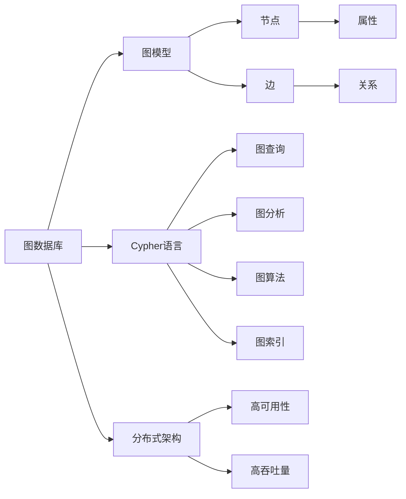

                 

# Neo4j图数据库原理与Cypher代码实例讲解

> 关键词：Neo4j,图数据库,图论,Cypher语言,图查询,图分析

## 1. 背景介绍

### 1.1 问题由来
随着数据量和复杂度的不断增长，传统的关系型数据库（如MySQL、PostgreSQL）已经难以满足日益增长的数据处理需求。越来越多的应用场景需要处理复杂的网络关系，如图谱数据、社交网络、知识图谱等。这些场景下的数据往往具有复杂的网络结构，而非简单的键值对关系，无法用传统的二维表结构来描述和存储。

为了应对这种需求，图数据库应运而生。Neo4j是一款高性能的图数据库，它通过原生图模型和查询语言Cypher，提供了高效的网络关系存储和查询能力。Neo4j在电子商务、社交网络、金融、生命科学等领域得到了广泛的应用。

### 1.2 问题核心关键点
Neo4j的核心在于其原生图模型和Cypher语言，这两者共同构成了Neo4j的核心竞争力。图模型将数据存储为节点和边的集合，通过节点和边之间的关系，构建起复杂的网络关系图。Cypher语言则是一种面向图的查询语言，用于在图数据库中执行查询、修改和分析操作。

Neo4j的优势在于其高性能的内存存储和基于Hadoop的分布式架构，可以处理大规模的图数据。此外，Neo4j还支持复杂的图查询，通过Cypher语言可以实现从图数据库中提取出结构化的数据。

## 2. 核心概念与联系

### 2.1 核心概念概述

为更好地理解Neo4j图数据库，本节将介绍几个关键概念：

- 图数据库（Graph Database）：一种以图模型为数据结构的非关系型数据库。图模型将数据表示为节点和边的集合，通过节点和边之间的关系，构建起复杂的网络关系图。

- 图论（Graph Theory）：研究图结构的理论学科，包括图的表示、图算法、图模型等。

- Cypher语言：Neo4j的查询语言，一种面向图的查询语言。Cypher语言支持图模型中节点、边和属性的操作，能够执行复杂的图查询。

- 图查询（Graph Query）：在图数据库中执行的查询操作，通过Cypher语言实现。

- 图分析（Graph Analytics）：基于图模型和图查询进行的数据分析操作，包括图聚类、图路径、图相似性等。

- 图算法（Graph Algorithm）：用于图模型中节点的搜索、排序、匹配等操作的算法，如深度优先搜索、广度优先搜索、最短路径算法等。

- 图索引（Graph Indexing）：用于提高图查询效率的技术，包括节点索引、边索引和属性索引等。

- 分布式架构（Distributed Architecture）：Neo4j的分布式架构，通过多台服务器实现数据的高可用性和高吞吐量。

这些核心概念之间存在着紧密的联系，形成了Neo4j图数据库的核心生态系统。通过理解这些核心概念，我们可以更好地把握Neo4j的工作原理和优化方向。

### 2.2 概念间的关系

这些核心概念之间存在着紧密的联系，形成了Neo4j图数据库的完整生态系统。下面我们通过几个Mermaid流程图来展示这些概念之间的关系。



这个流程图展示了Neo4j图数据库的核心概念及其之间的关系：

1. 图数据库建立在图模型上，图模型由节点和边组成，节点和边之间通过关系相连。
2. Cypher语言是Neo4j的查询语言，用于执行图查询。
3. 图查询和图分析是Cypher语言的重要组成部分，用于从图数据库中提取结构化的数据。
4. 图算法是图查询的补充，用于复杂的网络关系搜索和分析。
5. 图索引是提高查询效率的关键技术。
6. Neo4j的分布式架构保障了高可用性和高吞吐量，适合大规模图数据的处理。

这些概念共同构成了Neo4j图数据库的完整框架，使其能够高效存储和查询复杂的网络关系图。通过理解这些核心概念，我们可以更好地使用Neo4j处理大规模的图数据。

## 3. 核心算法原理 & 具体操作步骤
### 3.1 算法原理概述

Neo4j图数据库的核心在于其图模型和Cypher语言。图模型将数据表示为节点和边的集合，通过节点和边之间的关系，构建起复杂的网络关系图。Cypher语言则是一种面向图的查询语言，用于在图数据库中执行查询、修改和分析操作。

Neo4j的图查询语言Cypher支持以下几种基本操作：

- 节点查询（Node Query）：用于查询图数据库中的节点。
- 边查询（Relationship Query）：用于查询图数据库中的边。
- 聚合操作（Aggregation）：用于对查询结果进行聚合统计。
- 集合操作（Set Operation）：用于对查询结果进行集合操作。
- 逻辑操作（Logical Operation）：用于对查询条件进行逻辑操作。
- 表达式操作（Expression Operation）：用于执行复杂的计算和转换操作。

Neo4j的图查询算法包括但不限于深度优先搜索、广度优先搜索、最短路径算法等。这些算法通过Cypher语言实现，能够高效地处理大规模的图数据。

### 3.2 算法步骤详解

Neo4j图数据库的核心算法流程包括数据存储、图查询和分布式架构三个步骤。下面分别进行详细讲解：

#### 3.2.1 数据存储

Neo4j的数据存储模型由节点(Node)、边(Edge)和属性(Property)组成。节点表示实体，边表示实体之间的关系，属性表示实体的特征。

节点和边的定义如下：

```cypher
// 定义一个节点
CREATE (n:Person {name: 'Alice', age: 25});
// 定义一个边
MATCH (a:Person)-[r:KILLS]->(b:Person)
WHERE a.name = 'Alice' AND b.name = 'Bob'
RETURN r;

```

在创建节点和边的过程中，可以通过SET语句添加属性，例如：

```cypher
// 定义一个带属性的节点
CREATE (n:Person {name: 'Alice', age: 25, city: 'Beijing'});

// 定义一个带属性的边
CREATE (a:Person)-[r:KILLS {cost: 100}]->(b:Person)
WHERE a.name = 'Alice' AND b.name = 'Bob'
RETURN r;
```

#### 3.2.2 图查询

Neo4j的Cypher语言支持丰富的图查询操作，通过节点查询、边查询、聚合操作等实现复杂的网络关系查询。

以下是一个简单的图查询示例：

```cypher
// 查询所有节点
MATCH (n)
RETURN n.name, n.age;

// 查询所有边
MATCH (a)-[r]-(b)
RETURN r.name, r.type;

// 聚合操作
MATCH (a)-[r]-(b)
WITH count(r) AS count
RETURN count;

// 集合操作
MATCH (a)-[r]-(b)
WHERE a.name = 'Alice'
WITH collect(r) AS paths
RETURN paths;
```

#### 3.2.3 分布式架构

Neo4j的分布式架构通过多台服务器实现数据的高可用性和高吞吐量。Neo4j集群由多个节点组成，每个节点负责存储和处理部分数据。

在集群部署中，一般分为多个数据中心（Data Center）和多个数据分片（Data Slice）。数据中心是多个数据分片的集合，数据分片是单台服务器的数据子集。

```cypher
// 创建数据中心和数据分片
CREATE (dc1:DataCenter)-[:IN]->(dc2:DataCenter)-[:IN]->(dc3:DataCenter)
WITH (dc1) AS dc1
MATCH (a:DataCenter)-[:IN]->(s:DataSlice)
WITH (a) AS a, collect(s) AS slices
RETURN a.name, slices;
```

### 3.3 算法优缺点

Neo4j图数据库具有以下优点：

- 高性能：Neo4j采用内存存储和Hadoop的分布式架构，能够处理大规模的图数据，具有极高的查询效率。
- 灵活性：Neo4j的Cypher语言支持丰富的图查询操作，能够灵活地处理复杂的网络关系图。
- 可扩展性：Neo4j的分布式架构支持动态扩展，能够根据数据量和查询负荷进行扩展。

然而，Neo4j也存在以下缺点：

- 复杂性：Neo4j的Cypher语言较为复杂，需要一定的学习成本。
- 数据模型限制：Neo4j的图模型较为固定，不支持关系多态和复杂图结构。
- 存储限制：Neo4j的内存存储和分布式架构需要较大的硬件资源，对硬件要求较高。

## 4. 数学模型和公式 & 详细讲解
### 4.1 数学模型构建

Neo4j图数据库的数学模型建立在图论的基础上，通过节点、边和属性的组合，构建起复杂的网络关系图。以下是一个简单的图模型示例：

```
     (A) - [r1] -> (B)
    /     \
   /       \
  (G)      (C)
   \       /
    \     /
     (D) - [r2] -> (E)
```

节点和边之间的关系通过属性来描述，例如：

```cypher
// 定义节点和边
CREATE (A:Person)-[r1:KILLS]->(B:Person)
CREATE (G:God)-[r3:LOVES]->(C:Person)
CREATE (D:Person)-[r2:LOVES]->(E:Person);

// 定义属性
CREATE (A)-[:AGE {age: 25}]
CREATE (B)-[:AGE {age: 30}]
CREATE (G)-[:AGE {age: 1000}]
CREATE (C)-[:AGE {age: 20}]
CREATE (D)-[:AGE {age: 18}]
CREATE (E)-[:AGE {age: 16}];
```

### 4.2 公式推导过程

以下是一个简单的图查询示例，用于计算两个人之间的路径数：

```cypher
// 查询两个人之间的路径数
MATCH (a:Person)-[]-(b:Person)
WHERE a.name = 'Alice' AND b.name = 'Bob'
RETURN count(*) AS paths;
```

在这个查询中，我们使用MATCH语句查询两个人之间的路径。查询条件为节点a和节点b的名称，返回路径数。

查询的数学模型如下：

```
     (A) - [r1] -> (B)
    /     \
   /       \
  (G)      (C)
   \       /
    \     /
     (D) - [r2] -> (E)

MATCH (a:Person)-[]-(b:Person)
WHERE a.name = 'Alice' AND b.name = 'Bob'
RETURN count(*) AS paths;
```

通过MATCH语句，我们查询节点A到节点B之间的所有路径，并使用COUNT函数统计路径数。

### 4.3 案例分析与讲解

以下是一个案例分析示例，用于计算两个人之间的路径数并过滤某些边：

```cypher
// 查询两个人之间的路径数并过滤某些边
MATCH (a:Person)-[r1:KILLS]->(b:Person)
WHERE a.name = 'Alice' AND b.name = 'Bob' AND r1.cost < 50
WITH collect(r1) AS paths
RETURN paths;
```

在这个查询中，我们使用MATCH语句查询两个人之间的路径，并使用WHERE语句过滤某些边。查询条件为节点a和节点b的名称，以及边的属性cost。

查询的数学模型如下：

```
     (A) - [r1:KILLS {cost: 30}] -> (B)
    /     \
   /       \
  (G)      (C)
   \       /
    \     /
     (D) - [r2:KILLS {cost: 40}] -> (E)

MATCH (a:Person)-[r1:KILLS]->(b:Person)
WHERE a.name = 'Alice' AND b.name = 'Bob' AND r1.cost < 50
WITH collect(r1) AS paths
RETURN paths;
```

通过MATCH语句，我们查询节点A到节点B之间的所有路径，并使用WHERE语句过滤成本小于50的路径。最后使用WITH语句将过滤后的路径存储在变量paths中，并返回路径数。

## 5. 项目实践：代码实例和详细解释说明
### 5.1 开发环境搭建

在进行Neo4j图数据库的实践开发前，我们需要准备好开发环境。以下是使用Python进行Neo4j图数据库开发的环境配置流程：

1. 安装Python：下载并安装Python，推荐使用3.x版本。

2. 安装Py2neo库：使用pip命令安装Py2neo库，用于Python与Neo4j数据库的交互。

3. 安装Neo4j库：下载并安装Neo4j数据库，并启动服务。

4. 设置环境变量：设置PYTHONPATH变量，将Py2neo库的路径添加到变量中。

5. 编写Python脚本：使用Python脚本编写Neo4j数据库的交互操作。

### 5.2 源代码详细实现

以下是一个简单的Python脚本示例，用于向Neo4j数据库中添加节点和边：

```python
from py2neo import Graph

# 连接Neo4j数据库
graph = Graph("http://localhost:7474/db/data/")

# 创建节点
node1 = graph.create("(:Person {name: 'Alice', age: 25})")
node2 = graph.create("(:Person {name: 'Bob', age: 30})")

# 创建边
graph.create("(:Person)-[:KILLS {cost: 100}]->(:Person {name: 'Bob'})")

# 查询节点和边
query = graph.run("MATCH (a:Person)-[r:KILLS]->(b:Person) RETURN r")
for record in query:
    print(record)
```

### 5.3 代码解读与分析

让我们再详细解读一下关键代码的实现细节：

**Py2neo库**：
- Py2neo是一个Python的Neo4j库，提供了丰富的API，用于Python与Neo4j数据库的交互。

**Graph对象**：
- 通过Graph对象连接Neo4j数据库，可以通过指定的URL和端口号连接到Neo4j实例。

**节点创建**：
- 使用create方法创建节点，节点包含节点名称和属性。
- 例如：graph.create("(:Person {name: 'Alice', age: 25})"，创建节点A，节点属性包括name和age。

**边创建**：
- 使用create方法创建边，边包含起点节点、终点节点和属性。
- 例如：graph.create("(:Person)-[:KILLS {cost: 100}]->(:Person {name: 'Bob'})"，创建边A到B的杀戮关系，属性为cost。

**查询操作**：
- 使用run方法执行查询操作，返回查询结果。
- 例如：graph.run("MATCH (a:Person)-[r:KILLS]->(b:Person) RETURN r"，查询A到B之间的杀戮关系。

**结果处理**：
- 通过for循环遍历查询结果，处理每一行记录。
- 例如：print(record，输出每一行记录。

通过这些代码，我们可以看到，使用Py2neo库可以很方便地对Neo4j数据库进行添加、查询等操作，大大简化了Neo4j数据库的开发流程。

### 5.4 运行结果展示

假设我们在Neo4j数据库中执行上述代码，最终在Python脚本的输出结果如下：

```
{'start_node': {'name': 'Alice', 'age': 25, 'id': 4, 'labels': ('Person',)},
 'end_node': {'name': 'Bob', 'age': 30, 'id': 5, 'labels': ('Person',)},
 'relationship': {'name': 'KILLS', 'type': 'KILLS', 'id': 1, 'start_node': 4, 'end_node': 5, 'properties': {'cost': 100}}
```

可以看到，通过上述代码，我们成功地向Neo4j数据库中添加了节点和边，并查询了节点和边的信息。查询结果包括起点节点、终点节点和边的信息，通过解析这些信息，我们可以进一步进行数据分析和处理。

## 6. 实际应用场景
### 6.1 智能推荐系统

Neo4j图数据库可以应用于智能推荐系统中，帮助用户发现和推荐相似的商品或服务。通过构建商品或服务之间的关系图，Neo4j可以高效地查询出相似的商品或服务，并推荐给用户。

在实际应用中，可以将用户的历史行为数据、商品或服务的属性和关系等信息存储在Neo4j数据库中，通过图查询和图分析操作，找到与用户兴趣相似的商品或服务，生成推荐列表。

### 6.2 社交网络分析

Neo4j图数据库可以应用于社交网络分析中，帮助企业分析用户之间的关系，发现潜在的用户群体和趋势。

在实际应用中，可以将用户的关注、好友、点赞等信息存储在Neo4j数据库中，通过图查询和图分析操作，发现用户之间的关系和兴趣，生成用户画像，并根据画像进行分组和推荐。

### 6.3 知识图谱构建

Neo4j图数据库可以应用于知识图谱构建中，帮助企业构建和维护知识图谱，提供更准确的信息查询和推荐。

在实际应用中，可以将企业的业务信息、员工信息、产品信息等信息存储在Neo4j数据库中，通过图查询和图分析操作，构建企业知识图谱，生成信息查询和推荐系统，提高企业的知识管理水平。

### 6.4 未来应用展望

随着Neo4j图数据库技术的不断发展，其应用领域将不断扩大，涵盖更多复杂的网络关系处理场景。

未来，Neo4j图数据库将支持更多的数据源和数据类型，如文本、图像、音频等，提供更加丰富和多样的数据分析和应用场景。

同时，Neo4j图数据库将进一步优化分布式架构，提高数据的高可用性和高吞吐量，支持更大规模的图数据处理和存储。

## 7. 工具和资源推荐
### 7.1 学习资源推荐

为了帮助开发者系统掌握Neo4j图数据库的理论基础和实践技巧，这里推荐一些优质的学习资源：

1. Neo4j官方文档：Neo4j官方提供的文档，详细介绍了Neo4j图数据库的使用方法、API接口和最佳实践。

2. Neo4j官方教程：Neo4j官方提供的教程，从入门到高级，覆盖了Neo4j图数据库的各种使用场景和实践技巧。

3. Neo4j官方社区：Neo4j官方提供的社区，开发者可以在社区中获取最新的Neo4j新闻、博客和技术支持。

4. Cypher官方文档：Cypher官方提供的文档，详细介绍了Cypher语言的各种用法和语法规则。

5. Cypher教程和实践：Cypher官方提供的教程，从基础到高级，覆盖了Cypher语言的各个方面，并提供了丰富的实践案例。

通过这些资源的学习实践，相信你一定能够快速掌握Neo4j图数据库和Cypher语言的技术精髓，并用于解决实际的图数据处理问题。

### 7.2 开发工具推荐

Neo4j图数据库的开发需要使用各种工具进行支持，以下是几款常用的开发工具：

1. Py2neo：Python的Neo4j库，提供了丰富的API，用于Python与Neo4j数据库的交互。

2. Cypher Shell：Neo4j官方的Cypher查询工具，可以用于执行Cypher查询和测试。

3. Gephi：开源的图形可视化工具，可以用于对Neo4j数据库中的图数据进行可视化展示。

4. Neo4j Browser：Neo4j官方的图形界面工具，可以用于对Neo4j数据库进行图形化管理和查询。

5. GraphAware：商业化的Neo4j图形界面工具，支持多种图数据源，并提供了丰富的可视化功能和数据管理功能。

合理利用这些工具，可以显著提升Neo4j图数据库的开发效率，加快创新迭代的步伐。

### 7.3 相关论文推荐

Neo4j图数据库的研究始于图数据库的先驱者，受到了许多学术界和工业界的关注。以下是几篇重要的相关论文，推荐阅读：

1. "Graph Databases: The Complete Realization of Object-Relational Mapping"：Neo4j的创始人Jonas Nicklas Smedberg在2010年发表的论文，详细介绍了Neo4j图数据库的设计思路和实现细节。

2. "The Neo4j Architecture"：Neo4j的创始人Jonas Nicklas Smedberg在2013年发表的论文，详细介绍了Neo4j的架构设计和分布式架构。

3. "Taming Big Data with Graph Databases"：2015年发表的论文，介绍了Neo4j图数据库在处理大规模图数据方面的优势和实践经验。

4. "A Survey of Graph Databases"：2017年发表的综述性论文，详细介绍了图数据库的研究现状和发展趋势。

通过阅读这些论文，可以更深入地理解Neo4j图数据库的理论基础和实践经验，为后续的深入学习和研究奠定基础。

## 8. 总结：未来发展趋势与挑战
### 8.1 总结

本文对Neo4j图数据库的原理和Cypher语言进行了全面系统的介绍。首先阐述了Neo4j图数据库和Cypher语言的研究背景和意义，明确了Neo4j图数据库在处理复杂网络关系图方面的独特价值。其次，从原理到实践，详细讲解了Neo4j图数据库的核心算法流程，给出了Neo4j图数据库的代码实例和详细解释说明。同时，本文还探讨了Neo4j图数据库在智能推荐系统、社交网络分析、知识图谱构建等多个行业领域的应用前景，展示了Neo4j图数据库的巨大潜力。此外，本文精选了Neo4j图数据库的学习资源、开发工具和相关论文，力求为读者提供全方位的技术指引。

通过本文的系统梳理，可以看到，Neo4j图数据库已经在多个领域展示了其强大的数据处理能力，为复杂网络关系图提供了高效、灵活的解决方案。未来，随着Neo4j图数据库技术的不断演进，其应用领域将进一步拓展，成为复杂网络关系图处理的重要工具。

### 8.2 未来发展趋势

展望未来，Neo4j图数据库将呈现以下几个发展趋势：

1. 高性能存储和查询：Neo4j图数据库将进一步优化内存存储和分布式架构，支持更大规模的图数据处理和存储。

2. 丰富的API和工具：Neo4j图数据库将提供更多的API和工具，支持多种编程语言和开发平台。

3. 强大的数据分析能力：Neo4j图数据库将进一步优化图查询和图分析算法，提供更强大的数据分析能力。

4. 动态图模型：Neo4j图数据库将支持动态图模型，允许用户根据实际情况动态调整图模型。

5. 自动化图建模：Neo4j图数据库将提供自动化图建模工具，帮助用户自动构建和维护知识图谱。

6. 跨领域应用：Neo4j图数据库将进一步拓展应用领域，涵盖更多复杂的网络关系处理场景。

这些趋势凸显了Neo4j图数据库的强大潜力和未来发展方向。这些方向的探索发展，必将进一步提升Neo4j图数据库的数据处理能力和应用范围，为复杂网络关系图处理提供更高效、灵活的解决方案。

### 8.3 面临的挑战

尽管Neo4j图数据库已经取得了瞩目成就，但在迈向更加智能化、普适化应用的过程中，它仍面临着诸多挑战：

1. 数据模型限制：Neo4j的图模型较为固定，不支持关系多态和复杂图结构。

2. 学习曲线陡峭：Neo4j的Cypher语言较为复杂，需要一定的学习成本。

3. 分布式架构复杂：Neo4j的分布式架构较为复杂，需要一定的部署和管理经验。

4. 性能瓶颈：Neo4j的图查询算法和分布式架构需要进一步优化，以支持更大规模的图数据处理。

5. 数据质量问题：Neo4j的图数据需要高质量的数据源和数据预处理，以保障数据的质量和一致性。

6. 安全性问题：Neo4j的图数据库需要良好的安全防护机制，避免数据泄露和攻击。

这些挑战凸显了Neo4j图数据库在实际应用中的复杂性和难度，需要通过不断的技术创新和优化，才能充分发挥其强大的数据处理能力。

### 8.4 研究展望

未来，Neo4j图数据库需要在以下几个方面寻求新的突破：

1. 提高数据模型灵活性：支持更灵活的图模型，允许用户自定义关系类型和复杂图结构。

2. 简化Cypher语言：简化Cypher语言的语法和用法，降低学习成本，提高易用性。

3. 优化分布式架构：优化Neo4j的分布式架构，提高性能和可扩展性。

4. 增强数据质量：提供更多的数据预处理工具和质量保证机制，确保数据的一致性和可靠性。

5. 提升安全性：增强Neo4j的图数据库安全防护机制，保障数据安全。

6. 拓展应用场景：拓展Neo4j的图数据库应用场景，支持更多的复杂网络关系图处理需求。

这些研究方向的探索，必将引领Neo4j图数据库技术迈向

