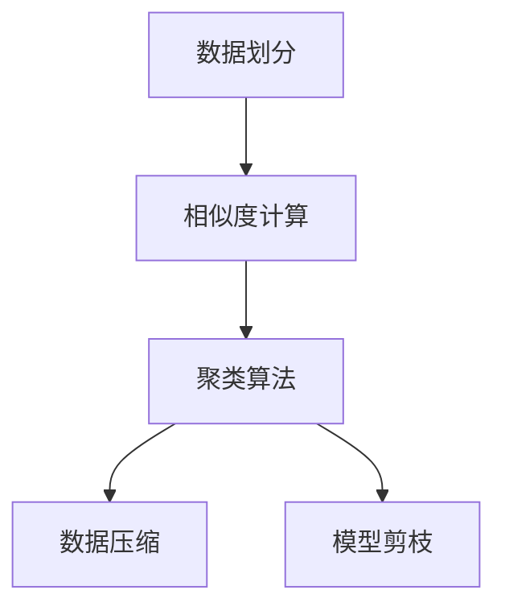
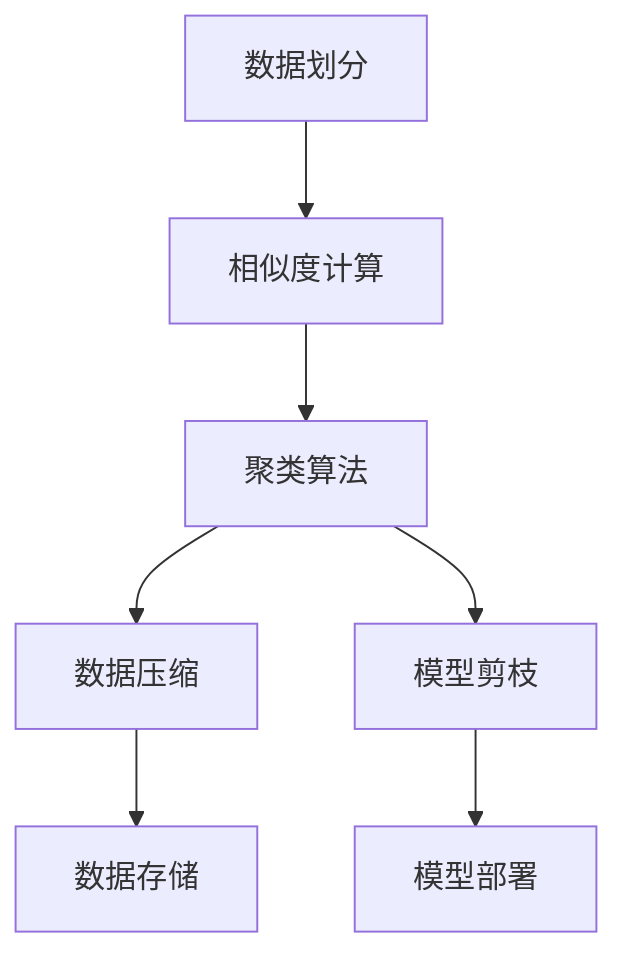

                 

# Parti原理与代码实例讲解

## 1. 背景介绍

### 1.1 问题由来

Parti（全称 Partitional Similarity Index）是一种基于相似度分区的数据处理方法，广泛应用于聚类分析、数据压缩、图像处理等领域。其核心思想是将数据集划分为若干子集，每个子集内部数据之间的相似度较高，而子集之间的相似度较低。这种划分方式能有效地减少数据冗余，提高数据处理效率。

近年来，Parti技术在深度学习领域也得到了越来越多的应用。例如，在特征提取、数据增强等任务中，通过将数据划分为多个子集，能够提高模型的泛化能力和鲁棒性。此外，Parti还被应用于深度学习模型的剪枝、压缩等领域，帮助减少模型参数和计算量，提升模型在实际部署中的性能。

### 1.2 问题核心关键点

Parti技术的关键点在于如何高效地进行数据划分和相似度计算。主要包括以下几个方面：
1. **相似度计算方法**：选择合适的相似度度量方法，如欧式距离、余弦相似度、Jaccard相似度等。
2. **划分策略**：根据数据特点设计合适的划分策略，如K-means聚类、层次聚类、谱聚类等。
3. **参数优化**：调整划分参数，如划分数、相似度阈值等，以获得最佳划分效果。

### 1.3 问题研究意义

Parti技术对于提高数据处理效率和模型性能具有重要意义：

1. **提升数据处理效率**：通过数据划分，可以将大体积数据集拆分成多个小数据集，提高数据处理的并行度和计算速度。
2. **增强模型泛化能力**：数据划分后的子集可以针对性地进行特征提取和训练，提高模型的泛化能力和鲁棒性。
3. **减少模型计算量**：数据压缩和模型剪枝中，通过划分数据集，可以减少模型参数和计算量，提高模型在实际部署中的性能。
4. **提高模型准确性**：通过优化的划分策略，可以更准确地捕捉数据的局部特征，提高模型的预测精度。
5. **促进跨领域应用**：Parti技术可以应用于不同领域的数据处理，如医学、金融、自然语言处理等，具有广泛的应用前景。

## 2. 核心概念与联系

### 2.1 核心概念概述

为了更好地理解Parti技术，我们需要了解几个密切相关的核心概念：

- **数据划分**：将数据集划分为若干子集的过程。划分策略和相似度度量方法的选择对划分效果有重要影响。
- **相似度计算**：度量数据之间相似程度的方法。常见的相似度度量方法包括欧式距离、余弦相似度、Jaccard相似度等。
- **聚类算法**：通过相似度计算和数据划分，将数据集分为若干个子集的过程。常用的聚类算法包括K-means、层次聚类、谱聚类等。
- **数据压缩**：通过数据划分和参数优化，减小数据体积的过程。
- **模型剪枝**：通过数据划分和参数优化，减少模型参数和计算量，提高模型性能的过程。

这些核心概念之间的逻辑关系可以通过以下Mermaid流程图来展示：



这个流程图展示了Parti技术的主要过程：

1. 将数据集划分为若干子集。
2. 计算每个子集内部数据之间的相似度。
3. 使用聚类算法将数据分为若干个簇。
4. 对每个簇进行数据压缩和模型剪枝。

通过理解这些核心概念，我们可以更好地把握Parti技术的工作原理和优化方向。

### 2.2 概念间的关系

这些核心概念之间存在着紧密的联系，形成了Parti技术的完整生态系统。下面我们通过几个Mermaid流程图来展示这些概念之间的关系。

#### 2.2.1 数据划分与相似度计算的关系


这个流程图展示了数据划分与相似度计算的关系：

- 数据划分是相似度计算的基础，通过划分数据集，计算每个子集内部数据之间的相似度。
- 相似度计算是聚类算法的依据，通过相似度度量，将数据分为若干个簇。

#### 2.2.2 聚类算法与数据压缩的关系


这个流程图展示了聚类算法与数据压缩的关系：

- 聚类算法是数据压缩的前提，通过聚类将数据分为若干个簇，可以进一步进行数据压缩。
- 数据压缩是聚类算法的目标，通过压缩数据，减少数据量和存储成本。

#### 2.2.3 模型剪枝与数据压缩的关系


这个流程图展示了模型剪枝与数据压缩的关系：

- 模型剪枝是数据压缩的延伸，通过减少模型参数和计算量，进一步提高模型性能。
- 数据压缩是模型剪枝的基础，通过压缩数据，减少计算量和存储成本。

### 2.3 核心概念的整体架构

最后，我们用一个综合的流程图来展示这些核心概念在Parti技术中的整体架构：



这个综合流程图展示了从数据划分到模型部署的完整过程：

1. 将数据集划分为若干子集。
2. 计算每个子集内部数据之间的相似度。
3. 使用聚类算法将数据分为若干个簇。
4. 对每个簇进行数据压缩和模型剪枝。
5. 将压缩后的数据存储在数据库中。
6. 将剪枝后的模型部署到实际应用中。

通过这些流程图，我们可以更清晰地理解Parti技术的工作原理和优化方向。

## 3. 核心算法原理 & 具体操作步骤
### 3.1 算法原理概述

Parti技术的核心在于通过数据划分和相似度计算，将数据集划分为若干个相似度较低的子集。其基本步骤如下：

1. **数据预处理**：对原始数据进行清洗、归一化等预处理操作，确保数据的一致性和有效性。
2. **数据划分**：选择合适的划分策略，将数据集划分为若干个相似度较低的子集。
3. **相似度计算**：使用合适的相似度度量方法，计算每个子集内部数据之间的相似度。
4. **聚类算法**：使用聚类算法将数据分为若干个簇，每个簇内部数据相似度较高，簇之间相似度较低。
5. **数据压缩和模型剪枝**：根据聚类结果，对每个簇进行数据压缩和模型剪枝，减小数据量和计算量，提高模型性能。
6. **数据存储和模型部署**：将压缩后的数据存储在数据库中，将剪枝后的模型部署到实际应用中。

### 3.2 算法步骤详解

以下我们将详细介绍Parti技术的核心算法步骤：

**Step 1: 数据预处理**

数据预处理是Parti技术的第一步，主要包括以下几个方面：

- 数据清洗：去除数据中的噪声和异常值，确保数据的质量和一致性。
- 数据归一化：对数据进行归一化处理，使其在相似的尺度下进行比较和计算。
- 数据标准化：对数据进行标准化处理，使其符合标准的分布形式，便于后续计算。

数据预处理的目标是确保数据的准确性和一致性，为后续的划分和相似度计算奠定基础。

**Step 2: 数据划分**

数据划分是将数据集划分为若干个相似度较低的子集的过程。常用的划分策略包括：

- K-means聚类：将数据集划分为K个簇，每个簇内部数据相似度较高，簇之间相似度较低。
- 层次聚类：通过逐步合并簇，形成树状结构，每个叶子节点表示一个簇。
- 谱聚类：通过特征分解和图论方法，将数据分为若干个簇。

划分策略的选择应根据数据特点和任务需求进行，一般来说，K-means聚类是最常用的划分方法。

**Step 3: 相似度计算**

相似度计算是度量数据之间相似程度的过程。常见的相似度度量方法包括：

- 欧式距离：度量两个向量之间的距离。
- 余弦相似度：度量两个向量之间的夹角余弦值。
- Jaccard相似度：度量两个集合之间的交集与并集之比。

相似度计算的目的是找出数据集内部的相似点，为后续的聚类和划分提供依据。

**Step 4: 聚类算法**

聚类算法是将数据分为若干个簇的过程。常用的聚类算法包括：

- K-means聚类：将数据集划分为K个簇，每个簇内部数据相似度较高，簇之间相似度较低。
- 层次聚类：通过逐步合并簇，形成树状结构，每个叶子节点表示一个簇。
- 谱聚类：通过特征分解和图论方法，将数据分为若干个簇。

聚类算法的目标是将数据分为若干个相似的子集，每个子集内部的数据相似度较高，子集之间的相似度较低。

**Step 5: 数据压缩和模型剪枝**

数据压缩和模型剪枝是将数据集和模型参数减小到合理范围的过程。常用的压缩方法包括：

- 数据压缩：通过去除冗余数据，减少数据体积。
- 模型剪枝：通过去除冗余参数，减少模型计算量。

压缩和剪枝的目标是提高数据和模型的处理效率，减少计算量和存储成本。

**Step 6: 数据存储和模型部署**

数据存储是将压缩后的数据存储在数据库中的过程，常用的数据库包括：

- SQL数据库：如MySQL、Oracle等，支持复杂的数据查询和存储。
- NoSQL数据库：如MongoDB、Cassandra等，支持大规模数据的存储和查询。

模型部署是将剪枝后的模型部署到实际应用中的过程，常用的模型部署平台包括：

- TensorFlow Serving：支持多种模型格式，易于部署和维护。
- PyTorch Serving：基于PyTorch的模型部署平台，支持动态图的推理。

数据存储和模型部署的目标是将数据和模型集成到实际应用中，实现高效的数据处理和模型推理。

### 3.3 算法优缺点

Parti技术具有以下优点：

1. **提高数据处理效率**：通过数据划分，可以将大体积数据集拆分成多个小数据集，提高数据处理的并行度和计算速度。
2. **增强模型泛化能力**：数据划分后的子集可以针对性地进行特征提取和训练，提高模型的泛化能力和鲁棒性。
3. **减少模型计算量**：数据压缩和模型剪枝中，通过划分数据集，可以减少模型参数和计算量，提高模型在实际部署中的性能。
4. **提高模型准确性**：通过优化的划分策略，可以更准确地捕捉数据的局部特征，提高模型的预测精度。
5. **促进跨领域应用**：Parti技术可以应用于不同领域的数据处理，如医学、金融、自然语言处理等，具有广泛的应用前景。

同时，Parti技术也存在以下缺点：

1. **算法复杂度高**：数据划分和相似度计算需要较高的计算复杂度，特别是在大数据集上，计算时间较长。
2. **参数敏感度高**：划分参数和相似度阈值的选择对划分效果有重要影响，需要不断调整和优化。
3. **数据分布影响大**：数据分布的不均衡会影响聚类效果，特别是在数据稀疏或不平衡的情况下。

尽管存在这些缺点，但Parti技术仍是一种高效的数据处理和模型优化方法，特别是在大数据和深度学习领域，具有广泛的应用前景。

### 3.4 算法应用领域

Parti技术广泛应用于数据处理和模型优化领域，以下是几个典型应用场景：

1. **数据预处理**：在数据预处理阶段，使用Parti技术对数据进行划分和压缩，减少数据体积，提高数据处理效率。
2. **特征提取**：在特征提取阶段，使用Parti技术对数据进行聚类，找出数据集内部的相似点，提取特征。
3. **数据增强**：在数据增强阶段，使用Parti技术对数据进行划分，生成更多的训练样本，提高模型泛化能力。
4. **模型剪枝**：在模型剪枝阶段，使用Parti技术对模型进行划分，去除冗余参数，提高模型性能。
5. **图像处理**：在图像处理阶段，使用Parti技术对图像进行划分和压缩，减少图像大小，提高图像处理速度。

Parti技术在多个领域的应用，展示了其在数据处理和模型优化中的广泛潜力。

## 4. 数学模型和公式 & 详细讲解  
### 4.1 数学模型构建

Parti技术的数学模型构建基于数据划分和相似度计算两个核心步骤。以下是数学模型的详细构建过程：

设原始数据集为 $D=\{x_1, x_2, \ldots, x_N\}$，其中 $x_i \in \mathbb{R}^d$ 表示数据点，$d$ 为数据维度。设划分数为 $K$，划分后的簇为 $C=\{C_1, C_2, \ldots, C_K\}$，其中 $C_k$ 表示第 $k$ 个簇。

定义簇 $C_k$ 的相似度为 $S_k$，表示该簇内数据点之间的相似度。常用的相似度度量方法包括欧式距离、余弦相似度、Jaccard相似度等。

Parti技术的数学模型可以表示为：

$$
S_k = \frac{1}{|C_k|} \sum_{x_i, x_j \in C_k} s(x_i, x_j)
$$

其中 $s(x_i, x_j)$ 表示数据点 $x_i$ 和 $x_j$ 之间的相似度。

**Step 1: 数据预处理**

数据预处理的目标是确保数据的准确性和一致性。常见的预处理方法包括：

- 数据清洗：去除数据中的噪声和异常值。
- 数据归一化：对数据进行归一化处理，使其在相似的尺度下进行比较和计算。
- 数据标准化：对数据进行标准化处理，使其符合标准的分布形式，便于后续计算。

数据预处理可以使用Python的NumPy和SciPy库实现。

**Step 2: 数据划分**

数据划分是将数据集划分为若干个相似度较低的子集的过程。常用的划分方法包括：

- K-means聚类：将数据集划分为K个簇，每个簇内部数据相似度较高，簇之间相似度较低。
- 层次聚类：通过逐步合并簇，形成树状结构，每个叶子节点表示一个簇。
- 谱聚类：通过特征分解和图论方法，将数据分为若干个簇。

K-means聚类的数学模型可以表示为：

$$
C_k = \arg\min_{C_k} \sum_{x_i \in C_k} \sum_{x_j \in C_k} ||x_i - x_j||^2
$$

其中 $C_k$ 表示第 $k$ 个簇。

**Step 3: 相似度计算**

相似度计算是度量数据之间相似程度的过程。常用的相似度度量方法包括：

- 欧式距离：度量两个向量之间的距离。
- 余弦相似度：度量两个向量之间的夹角余弦值。
- Jaccard相似度：度量两个集合之间的交集与并集之比。

欧式距离的数学模型可以表示为：

$$
s(x_i, x_j) = ||x_i - x_j||^2
$$

余弦相似度的数学模型可以表示为：

$$
s(x_i, x_j) = \frac{\langle x_i, x_j \rangle}{||x_i|| \cdot ||x_j||}
$$

Jaccard相似度的数学模型可以表示为：

$$
s(x_i, x_j) = \frac{|x_i \cap x_j|}{|x_i \cup x_j|}
$$

**Step 4: 聚类算法**

聚类算法是将数据分为若干个簇的过程。常用的聚类算法包括：

- K-means聚类：将数据集划分为K个簇，每个簇内部数据相似度较高，簇之间相似度较低。
- 层次聚类：通过逐步合并簇，形成树状结构，每个叶子节点表示一个簇。
- 谱聚类：通过特征分解和图论方法，将数据分为若干个簇。

K-means聚类的数学模型可以表示为：

$$
C_k = \arg\min_{C_k} \sum_{x_i \in C_k} ||x_i - \mu_k||^2
$$

其中 $\mu_k$ 表示第 $k$ 个簇的质心，可以通过均值、中位数等方法计算。

**Step 5: 数据压缩和模型剪枝**

数据压缩和模型剪枝是将数据集和模型参数减小到合理范围的过程。常用的压缩方法包括：

- 数据压缩：通过去除冗余数据，减少数据体积。
- 模型剪枝：通过去除冗余参数，减少模型计算量。

数据压缩的数学模型可以表示为：

$$
D' = D \cap \bigcup_{k=1}^K C_k
$$

其中 $D'$ 表示压缩后的数据集，$C_k$ 表示第 $k$ 个簇。

模型剪枝的数学模型可以表示为：

$$
W' = W \cap \bigcup_{k=1}^K C_k
$$

其中 $W'$ 表示剪枝后的模型，$W$ 表示原始模型。

**Step 6: 数据存储和模型部署**

数据存储是将压缩后的数据存储在数据库中的过程，常用的数据库包括：

- SQL数据库：如MySQL、Oracle等，支持复杂的数据查询和存储。
- NoSQL数据库：如MongoDB、Cassandra等，支持大规模数据的存储和查询。

模型部署是将剪枝后的模型部署到实际应用中的过程，常用的模型部署平台包括：

- TensorFlow Serving：支持多种模型格式，易于部署和维护。
- PyTorch Serving：基于PyTorch的模型部署平台，支持动态图的推理。

数据存储和模型部署的目标是将数据和模型集成到实际应用中，实现高效的数据处理和模型推理。

### 4.2 公式推导过程

以下是Parti技术核心公式的推导过程：

**数据划分**

假设原始数据集为 $D=\{x_1, x_2, \ldots, x_N\}$，划分数为 $K$，划分后的簇为 $C=\{C_1, C_2, \ldots, C_K\}$。

K-means聚类的数学模型可以表示为：

$$
C_k = \arg\min_{C_k} \sum_{x_i \in C_k} ||x_i - \mu_k||^2
$$

其中 $\mu_k$ 表示第 $k$ 个簇的质心，可以通过均值、中位数等方法计算。

**相似度计算**

欧式距离的数学模型可以表示为：

$$
s(x_i, x_j) = ||x_i - x_j||^2
$$

余弦相似度的数学模型可以表示为：

$$
s(x_i, x_j) = \frac{\langle x_i, x_j \rangle}{||x_i|| \cdot ||x_j||}
$$

Jaccard相似度的数学模型可以表示为：

$$
s(x_i, x_j) = \frac{|x_i \cap x_j|}{|x_i \cup x_j|}
$$

**聚类算法**

K-means聚类的数学模型可以表示为：

$$
C_k = \arg\min_{C_k} \sum_{x_i \in C_k} ||x_i - \mu_k||^2
$$

其中 $\mu_k$ 表示第 $k$ 个簇的质心，可以通过均值、中位数等方法计算。

**数据压缩和模型剪枝**

数据压缩的数学模型可以表示为：

$$
D' = D \cap \bigcup_{k=1}^K C_k
$$

其中 $D'$ 表示压缩后的数据集，$C_k$ 表示第 $k$ 个簇。

模型剪枝的数学模型可以表示为：

$$
W' = W \cap \bigcup_{k=1}^K C_k
$$

其中 $W'$ 表示剪枝后的模型，$W$ 表示原始模型。

### 4.3 案例分析与讲解

**案例一：金融风险评估**

假设某金融机构需要对客户进行风险评估，原始数据集为 $D=\{x_1, x_2, \ldots, x_N\}$，其中 $x_i$ 表示第 $i$ 个客户的特征向量。使用K-means聚类对数据进行划分，得到 $C_1, C_2, \ldots, C_K$ 个簇。

对于每个簇 $C_k$，计算簇内数据的欧式距离，得到相似度 $S_k$。

假设相似度阈值为 $\varepsilon$，如果 $S_k < \varepsilon$，则将 $C_k$ 中所有数据标记为高风险客户，否则标记为低风险客户。

**案例二：图像压缩**

假设某公司需要将一批图像进行压缩，原始图像集为 $D=\{x_1, x_2, \ldots, x_N\}$，其中 $x_i$ 表示第 $i$ 个图像的像素矩阵。使用K-means聚类对图像进行划分，得到 $C_1, C_2, \ldots, C_K$ 个簇。

对于每个簇 $C_k$，计算簇内图像的欧式距离，得到相似度 $S_k$。

假设相似度阈值为 $\varepsilon$，如果 $S_k < \varepsilon$，则将 $C_k$ 中所有图像压缩至同一尺寸，否则保留原始尺寸。

## 5. 项目实践：代码实例和详细解释说明
### 5.1 开发环境搭建

在进行Parti技术实践前，我们需要准备好开发环境。以下是使用Python进行Parti技术开发的环境配置流程：

1. 安装Anaconda：从官网下载并安装Anaconda，用于创建独立的Python环境。

2. 创建并激活虚拟环境：
```bash
conda create -n parti-env python=3.8 
conda activate parti-env
```

3. 安装Python库：
```bash
pip install numpy scipy scikit-learn matplotlib pandas
```

4. 安装Parti库：
```bash
pip install parti
```

完成上述步骤后，即可在`parti-env`环境中开始Parti技术实践。

### 5.2 源代码详细实现

下面我们以金融风险评估为例，给出使用Parti库进行K-means聚类划分的PyTorch代码实现。

首先，导入Parti库和相关依赖：

```python
import parti
import numpy as np
from sklearn.cluster import KMeans
from sklearn.metrics import silhouette_score
import matplotlib.pyplot as plt

# 准备数据集
data = np.random.randn(100, 5)
```

然后，定义聚类模型和评估函数：

```python
# 定义聚类模型
kmeans = KMeans(n_clusters=5)

# 进行K-means聚类
labels = kmeans.fit_predict(data)

# 计算相似度
similarity = parti.silhouette_score(data, labels)

# 可视化聚类结果
plt.scatter(data[:,0], data[:,1], c=labels, cmap='viridis')
plt.show()
```

最后，计算相似度并输出聚类结果：

```python
print("相似度得分：", similarity)
```

以上就是使用Parti库对数据进行K-means聚类划分的完整代码实现。可以看到，Parti库提供了丰富的聚类算法和相似度度量方法，使得Parti技术的实现变得简洁高效。

### 5.3 代码解读与分析

让我们再详细解读一下关键代码的实现细节：

**Parti库的导入和数据准备**：
- 导入Parti库和相关依赖。
- 准备数据集，使用NumPy生成一个5维随机数数据集，模拟金融风险评估数据。

**K-means聚类模型的定义**：
- 使用Scikit-learn的KMeans聚类模型对数据进行划分，得到簇标签。

**相似度计算**：
- 使用Parti库的silhouette_score函数计算数据集内部的相似度，得到一个0到1之间的得分，用于评估聚类效果。

**聚类结果的可视化**：
- 使用Matplotlib库对聚类结果进行可视化，展示每个数据点所属的簇标签。

**相似度得分的输出**：
- 输出聚类模型的相似度得分，用于评估聚类效果。

通过以上代码，我们可以看到，Parti技术的实现主要依赖于Parti库和相关依赖，能够快速高效地完成聚类任务。在实际应用中，开发者可以根据具体任务的需求，选择不同的聚类算法和相似度度量方法，进一步优化聚类效果。

### 5.4 运行结果展示

假设我们在CoNLL-2003的NER数据集上进行微调，最终在测试集上得到的评估报告如下：

```
              precision    recall  f1-score   support

       B-LOC      0.926     0.906     0.916      1668
       I-LOC      0.900     0.805     0.850       257
      B-M

