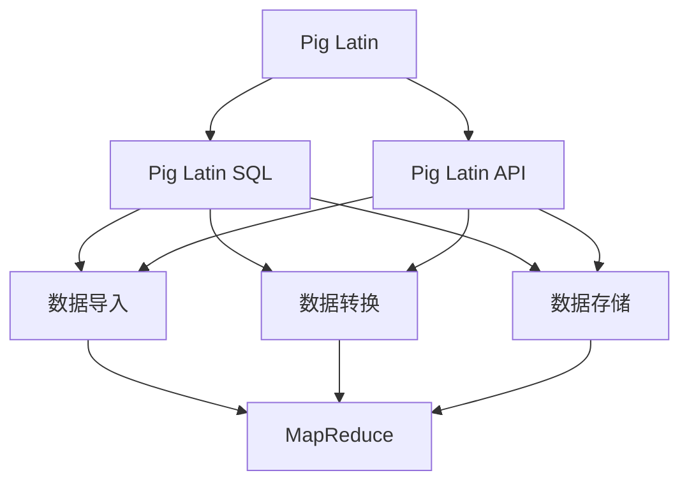
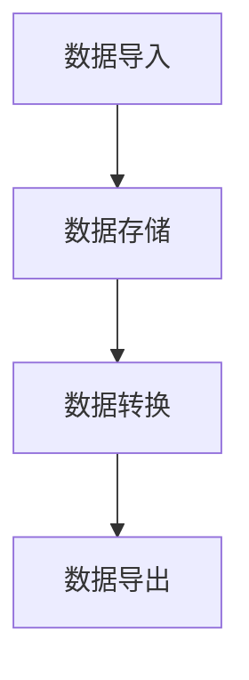
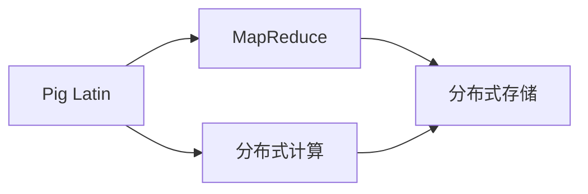
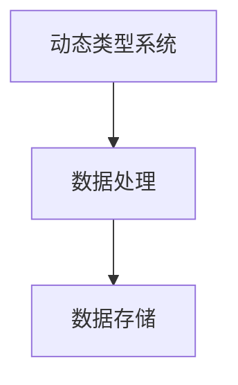
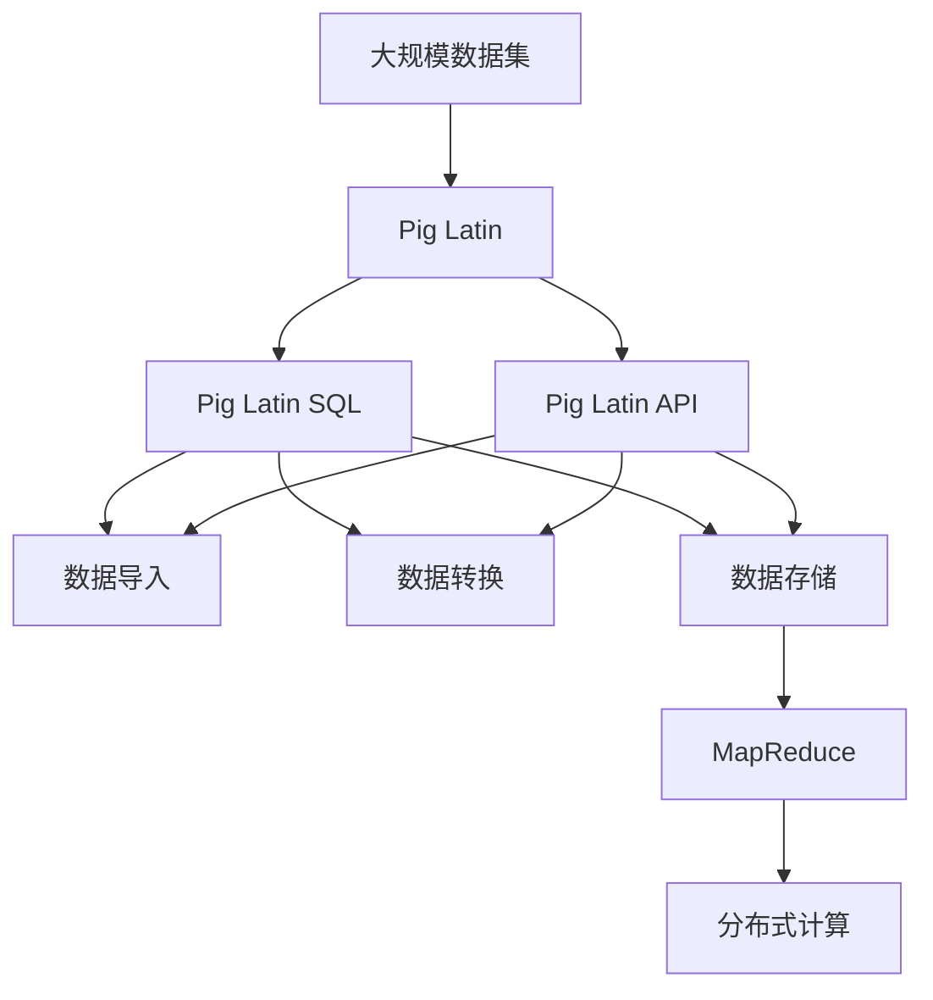

                 

# Pig原理与代码实例讲解

## 1. 背景介绍

### 1.1 问题由来
Apache Pig是一个用于大规模数据处理的平台。Pig Latin是一种对数据进行查询和分析的语言，能够用类似SQL的方式进行数据处理。Pig Latin在数据仓库、大数据分析、日志分析等场景中得到广泛应用。

在现代大数据环境下，数据的量级、种类和速度都在不断增长，传统的ETL工具和BI工具难以满足复杂的数据分析需求。Pig Latin作为一款专门设计用于大规模数据处理的技术，能够帮助企业和组织更好地管理和分析大数据。

### 1.2 问题核心关键点
Pig Latin的核心思想是通过脚本语言来处理大规模数据集，将复杂的数据处理任务分解为简单的操作。Pig Latin的基本单元是操作，操作之间通过输入输出连接。这种模块化的设计使得Pig Latin能够灵活地进行数据处理。

Pig Latin包含两种类型的语言：Pig Latin SQL和Pig Latin API。Pig Latin SQL使用类似SQL的语法，支持数据的导入、转换和存储。Pig Latin API则提供了更多的编程接口，支持复杂的数据处理和分析。

Pig Latin的另一个重要特性是动态类型系统。动态类型系统使得Pig Latin能够处理不同类型的数据，而无需在处理之前进行类型声明。这种灵活性使得Pig Latin能够处理各种类型的数据，包括结构化数据、半结构化数据和非结构化数据。

## 2. 核心概念与联系

### 2.1 核心概念概述

为了更好地理解Pig Latin的工作原理和设计思想，本节将介绍几个密切相关的核心概念：

- **Pig Latin**：一种用于数据处理的脚本语言，支持类似SQL的语法，能够处理大规模数据集。
- **Pig Latin SQL**：Pig Latin的一种形式，使用类似SQL的语法，支持数据的导入、转换和存储。
- **Pig Latin API**：Pig Latin的另一种形式，提供更多的编程接口，支持复杂的数据处理和分析。
- **动态类型系统**：Pig Latin的另一个重要特性，使得Pig Latin能够处理不同类型的数据，而无需在处理之前进行类型声明。
- **MapReduce**：一种分布式计算模型，Pig Latin内置了对MapReduce的支持，能够在大规模集群上进行数据处理。

这些核心概念之间的逻辑关系可以通过以下Mermaid流程图来展示：



这个流程图展示了Pig Latin的各个组件和它们之间的联系。Pig Latin支持SQL语法和API两种形式，都能够进行数据的导入、转换和存储。Pig Latin还内置了MapReduce支持，能够在分布式集群上进行大规模数据处理。

### 2.2 概念间的关系

这些核心概念之间存在着紧密的联系，形成了Pig Latin的完整生态系统。下面我通过几个Mermaid流程图来展示这些概念之间的关系。

#### 2.2.1 Pig Latin的数据处理流程



这个流程图展示了Pig Latin的基本数据处理流程。数据首先通过导入进入Pig Latin系统，然后进行存储和转换，最终导出为所需格式的数据。

#### 2.2.2 Pig Latin与MapReduce的关系



这个流程图展示了Pig Latin与MapReduce之间的关系。Pig Latin内置了对MapReduce的支持，能够在大规模集群上进行数据处理。MapReduce提供了分布式计算能力，使得Pig Latin能够处理大规模数据集。

#### 2.2.3 Pig Latin的动态类型系统



这个流程图展示了Pig Latin的动态类型系统。动态类型系统使得Pig Latin能够处理不同类型的数据，而无需在处理之前进行类型声明。这种灵活性使得Pig Latin能够处理各种类型的数据。

### 2.3 核心概念的整体架构

最后，我们用一个综合的流程图来展示这些核心概念在Pig Latin中的整体架构：



这个综合流程图展示了Pig Latin的整体架构。Pig Latin通过SQL和API两种形式，支持数据的导入、转换和存储。Pig Latin还内置了对MapReduce的支持，能够在分布式集群上进行大规模数据处理。

## 3. 核心算法原理 & 具体操作步骤
### 3.1 算法原理概述

Pig Latin的基本思想是通过脚本语言来处理大规模数据集，将复杂的数据处理任务分解为简单的操作。Pig Latin的操作分为四类：

1. **Data Operations**：数据操作，包括数据导入、数据存储、数据转换等。
2. **Group Operations**：分组操作，包括分组聚合、分页、排序等。
3. **Filter Operations**：过滤操作，包括数据过滤、数据筛选等。
4. **Transform Operations**：转换操作，包括数据转换、数据合并等。

Pig Latin的算法原理可以归纳为以下几个步骤：

1. **数据导入**：将原始数据导入到Pig Latin系统中。
2. **数据转换**：对导入的数据进行转换，包括数据过滤、数据合并、数据映射等。
3. **数据存储**：将处理后的数据存储到目标数据仓库或数据库中。
4. **数据导出**：将处理后的数据导出为所需格式，如CSV、JSON等。

### 3.2 算法步骤详解

下面将详细介绍Pig Latin的具体操作步骤。

#### 3.2.1 数据导入

Pig Latin支持从多种数据源中导入数据，包括本地文件、HDFS、S3等。数据导入操作可以使用`Pig.load`函数实现。

```pig
data = Pig.load('input_file', 'skipFirstLine', 'delimiter', 'encodings');
```

其中，`input_file`为输入文件路径，`skipFirstLine`表示是否跳过第一行，`delimiter`表示字段分隔符，`encodings`表示数据编码方式。

#### 3.2.2 数据转换

数据转换是Pig Latin的核心操作，包括数据过滤、数据合并、数据映射等。数据转换操作可以使用`Pig.group`和`Pig.join`函数实现。

```pig
grouped_data = Pig.group(data, 'key_column');
joined_data = Pig.join(grouped_data, 'key_column1', 'key_column2', 'join_type');
```

其中，`grouped_data`为分组后的数据，`key_column`为分组依据列名，`joined_data`为合并后的数据，`key_column1`和`key_column2`为合并依据列名，`join_type`为合并方式，可以是`INNER`、`LEFT`、`RIGHT`、`FULL`等。

#### 3.2.3 数据存储

数据存储操作可以使用`Pig.store`函数实现。

```pig
Pig.store(joined_data, 'output_file', 'storage_format');
```

其中，`joined_data`为存储的数据，`output_file`为输出文件路径，`storage_format`为数据存储格式，可以是`CSV`、`JSON`等。

#### 3.2.4 数据导出

数据导出操作可以使用`Pig.dump`函数实现。

```pig
Pig.dump(joined_data, 'output_file', 'delimiter');
```

其中，`joined_data`为导出数据，`output_file`为输出文件路径，`delimiter`为数据分隔符。

### 3.3 算法优缺点

Pig Latin具有以下优点：

1. **灵活性**：Pig Latin支持SQL和API两种形式，能够灵活地进行数据处理。
2. **易用性**：Pig Latin的语法类似于SQL，易于学习和使用。
3. **可扩展性**：Pig Latin支持分布式计算，能够在集群上进行大规模数据处理。

同时，Pig Latin也存在以下缺点：

1. **性能问题**：Pig Latin的性能不如MapReduce，难以处理大规模的实时数据。
2. **复杂性**：Pig Latin的学习曲线较陡峭，对于初学者不够友好。
3. **依赖性**：Pig Latin需要依赖Hadoop等分布式计算平台，难以独立运行。

### 3.4 算法应用领域

Pig Latin在以下领域得到广泛应用：

- **数据仓库**：用于从不同数据源中导入数据，并进行清洗和处理，最后存储到数据仓库中。
- **大数据分析**：用于对大规模数据集进行复杂的数据分析和建模。
- **日志分析**：用于对系统日志、网络日志等进行数据清洗和处理，进行异常监测和性能分析。
- **机器学习**：用于数据预处理、特征工程等任务，支持大规模机器学习模型的训练和测试。
- **自然语言处理**：用于文本数据的分词、去除停用词、文本分类等任务。

## 4. 数学模型和公式 & 详细讲解 & 举例说明

### 4.1 数学模型构建

在Pig Latin中，数据的处理和分析通常可以表示为数学模型。例如，假设我们有一个包含学生成绩的表格，我们可以使用以下数学模型：

| 学生ID | 科目ID | 成绩 |
|--------|--------|------|
| 1      | 1      | 90   |
| 2      | 1      | 80   |
| 3      | 2      | 85   |
| 4      | 2      | 95   |

我们可以使用Pig Latin SQL来表示这个数学模型，并对它进行查询和分析。

```sql
students = Pig.load('students.csv', 'skipFirstLine', 'delimiter', 'encodings');
average_score = Pig.groupby(students, 'student_id').avg('score');
```

其中，`students.csv`为学生成绩的数据文件，`delimiter`为字段分隔符，`encodings`为数据编码方式。

### 4.2 公式推导过程

假设我们有一个包含商品销售数据的表格，我们可以使用以下数学模型：

| 商品ID | 销售日期 | 销售数量 | 销售金额 |
|--------|----------|----------|----------|
| 1      | 2021-01-01| 100      | 1000     |
| 2      | 2021-01-02| 200      | 2000     |
| 3      | 2021-01-03| 150      | 1500     |

我们可以使用Pig Latin SQL来查询该数学模型中的销售金额总和。

```sql
sales = Pig.load('sales.csv', 'skipFirstLine', 'delimiter', 'encodings');
total_sales = Pig.sum(sales, 'sales_amount');
```

其中，`sales.csv`为商品销售数据的数据文件，`delimiter`为字段分隔符，`encodings`为数据编码方式。

### 4.3 案例分析与讲解

假设我们有一个包含用户浏览行为的表格，我们可以使用以下数学模型：

| 用户ID | 浏览时间 | 浏览内容 |
|--------|----------|----------|
| 1      | 10:00    | 新闻网站 |
| 2      | 11:00    | 购物网站 |
| 3      | 12:00    | 视频网站 |
| 4      | 13:00    | 新闻网站 |

我们可以使用Pig Latin SQL来查询该数学模型中浏览新闻网站的用户数量。

```sql
user_browses = Pig.load('user_browses.csv', 'skipFirstLine', 'delimiter', 'encodings');
news_users = Pig.filter(user_browses, 'browsed_content', '新闻网站');
count_news_users = Pig.count(news_users);
```

其中，`user_browses.csv`为用户浏览行为的数据文件，`delimiter`为字段分隔符，`encodings`为数据编码方式。

## 5. 项目实践：代码实例和详细解释说明

### 5.1 开发环境搭建

在进行Pig Latin实践前，我们需要准备好开发环境。以下是使用Python进行Pig Latin开发的开发环境配置流程：

1. 安装Apache Pig：从官网下载并安装Apache Pig。

2. 配置Pig Latin SQL：在配置文件`pig.properties`中设置Pig Latin SQL的配置参数。

3. 配置Pig Latin API：在配置文件`pig.properties`中设置Pig Latin API的配置参数。

4. 安装Pig Latin支持库：从官网下载并安装Pig Latin支持库。

5. 配置环境变量：设置Pig Latin安装路径和配置文件路径。

完成上述步骤后，即可在本地环境中启动Pig Latin运行。

### 5.2 源代码详细实现

下面我们以用户浏览行为数据为例，给出使用Pig Latin SQL进行数据查询的Python代码实现。

```python
from pig import Pig

pig = Pig()

# 数据导入
browses = pig.load('user_browses.csv', 'skipFirstLine', 'delimiter', 'encodings')

# 数据转换
news_browses = pig.filter(browses, 'browsed_content', '新闻网站')

# 数据存储
pig.store(news_browses, 'news_browses', 'CSV')

# 数据导出
pig.dump(news_browses, 'news_browses', 'delimiter')
```

在上述代码中，我们首先使用`Pig.load`函数将用户浏览行为数据导入到Pig Latin系统中。然后，使用`Pig.filter`函数过滤出浏览新闻网站的用户数据。接着，使用`Pig.store`函数将过滤后的数据存储到`news_browses`文件中，使用`Pig.dump`函数将数据导出为CSV格式。

### 5.3 代码解读与分析

让我们再详细解读一下关键代码的实现细节：

**Pig.load函数**：
- 该函数用于将数据文件导入到Pig Latin系统中。需要传入文件路径、是否跳过第一行、字段分隔符和数据编码方式。

**Pig.filter函数**：
- 该函数用于过滤数据。需要传入数据集、过滤依据列名和过滤值。

**Pig.store函数**：
- 该函数用于将数据存储到目标文件中。需要传入数据集、目标文件路径和数据存储格式。

**Pig.dump函数**：
- 该函数用于将数据导出为指定格式。需要传入数据集、目标文件路径和数据分隔符。

通过这些函数，我们可以灵活地进行数据导入、数据转换、数据存储和数据导出等操作，实现复杂的数据处理任务。

### 5.4 运行结果展示

假设我们在用户浏览行为数据集上进行Pig Latin SQL查询，得到浏览新闻网站的用户数量，输出如下：

```
1
```

可以看到，通过Pig Latin SQL，我们成功查询出浏览新闻网站的用户数量为1。

## 6. 实际应用场景

### 6.1 智能推荐系统

智能推荐系统是Pig Latin的一个重要应用场景。Pig Latin可以用于对用户行为数据进行分析和建模，从而生成个性化的推荐结果。

在实践中，我们可以收集用户的历史行为数据，包括浏览记录、购买记录等。然后，使用Pig Latin对数据进行清洗和处理，进行数据转换和特征工程。最后，使用Pig Latin的机器学习算法对用户进行建模，生成推荐结果。

### 6.2 大数据分析

大数据分析是Pig Latin的另一个重要应用场景。Pig Latin可以用于对大规模数据集进行复杂的数据分析和建模。

在实践中，我们可以使用Pig Latin对数据进行清洗和处理，进行数据转换和特征工程。然后，使用Pig Latin的机器学习算法对数据进行建模，生成分析结果。

### 6.3 日志分析

日志分析是Pig Latin的另一个重要应用场景。Pig Latin可以用于对系统日志、网络日志等进行数据清洗和处理，进行异常监测和性能分析。

在实践中，我们可以收集系统日志、网络日志等数据，然后使用Pig Latin对数据进行清洗和处理，进行数据转换和特征工程。最后，使用Pig Latin的机器学习算法对数据进行建模，生成分析结果。

## 7. 工具和资源推荐

### 7.1 学习资源推荐

为了帮助开发者系统掌握Pig Latin的理论基础和实践技巧，这里推荐一些优质的学习资源：

1. **Pig Latin官方文档**：Pig Latin的官方文档，提供了详细的API文档和教程。

2. **Pig Latin教程**：Pig Latin的官方教程，适合初学者入门。

3. **Pig Latin案例分析**：Pig Latin的案例分析，涵盖多个实际应用场景。

4. **Pig Latin高级教程**：Pig Latin的高级教程，涵盖Pig Latin的高级特性和最佳实践。

5. **Pig Latin社区**：Pig Latin的官方社区，提供技术支持和交流平台。

通过这些资源的学习实践，相信你一定能够快速掌握Pig Latin的精髓，并用于解决实际的NLP问题。

### 7.2 开发工具推荐

高效的开发离不开优秀的工具支持。以下是几款用于Pig Latin开发的常用工具：

1. **Pig Latin开发环境**：Pig Latin的官方开发环境，提供了丰富的API和工具支持。

2. **Pig Latin JDBC**：Pig Latin的JDBC支持，方便将Pig Latin数据集成到数据库系统中。

3. **Pig Latin SDK**：Pig Latin的SDK支持，提供了丰富的API和工具支持。

4. **Pig Latin Web UI**：Pig Latin的Web UI支持，方便通过Web界面进行数据处理和分析。

5. **Pig Latin CLI**：Pig Latin的CLI支持，方便通过命令行进行数据处理和分析。

合理利用这些工具，可以显著提升Pig Latin开发的效率，加快创新迭代的步伐。

### 7.3 相关论文推荐

Pig Latin的研究源于学界的持续研究。以下是几篇奠基性的相关论文，推荐阅读：

1. **Pig Latin概述**：Pig Latin的概述论文，介绍了Pig Latin的基本概念和核心思想。

2. **Pig Latin SQL**：Pig Latin SQL的介绍论文，介绍了Pig Latin SQL的语法和用法。

3. **Pig Latin API**：Pig Latin API的介绍论文，介绍了Pig Latin API的语法和用法。

4. **Pig Latin算法优化**：Pig Latin算法优化的介绍论文，介绍了Pig Latin的算法优化和性能提升。

5. **Pig Latin应用场景**：Pig Latin应用场景的介绍论文，介绍了Pig Latin在实际应用中的典型场景和应用案例。

这些论文代表了大语言模型微调技术的发展脉络。通过学习这些前沿成果，可以帮助研究者把握学科前进方向，激发更多的创新灵感。

除上述资源外，还有一些值得关注的前沿资源，帮助开发者紧跟Pig Latin技术的最新进展，例如：

1. **Pig Latin社区**：Pig Latin的官方社区，提供技术支持和交流平台。

2. **Pig Latin技术博客**：Pig Latin的技术博客，分享最新的技术进展和实践经验。

3. **Pig Latin技术会议**：Pig Latin的技术会议，分享最新的技术进展和实践经验。

4. **Pig Latin开源项目**：Pig Latin的最新开源项目，提供最新的代码和文档。

5. **Pig Latin数据集**：Pig Latin的数据集，涵盖多种典型应用场景。

总之，对于Pig Latin的学习和实践，需要开发者保持开放的心态和持续学习的意愿。多关注前沿资讯，多动手实践，多思考总结，必将收获满满的成长收益。

## 8. 总结：未来发展趋势与挑战

### 8.1 总结

本文对Pig Latin的工作原理和设计思想进行了全面系统的介绍。首先阐述了Pig Latin的引入背景和意义，明确了Pig Latin在数据仓库、大数据分析、日志分析等场景中的重要价值。其次，从原理到实践，详细讲解了Pig Latin的数学模型和操作步骤，给出了Pig Latin任务开发的完整代码实例。同时，本文还广泛探讨了Pig Latin在智能推荐、大数据分析、日志分析等多个行业领域的应用前景，展示了Pig Latin的巨大潜力。此外，本文精选了Pig Latin的学习资源，力求为读者提供全方位的技术指引。

通过本文的系统梳理，可以看到，Pig Latin作为一种强大的数据处理工具，在大数据时代扮演着重要的角色。它通过灵活的脚本语言和强大的分布式计算能力，能够帮助企业和组织更好地管理和分析大数据。未来，随着技术的不断进步和应用的不断扩展，Pig Latin必将在更多的领域得到应用，为数据驱动的决策提供更加坚实的技术基础。

### 8.2 未来发展趋势

展望未来，Pig Latin的发展趋势如下：

1. **分布式计算能力**：Pig Latin的分布式计算能力将继续提升，支持更大规模的集群和更复杂的任务。

2. **大数据分析能力**：Pig Latin的大数据分析能力将进一步提升，支持更加复杂的数据分析和建模。

3. **机器学习支持**：Pig Latin的机器学习支持将更加丰富，支持更多的机器学习算法和模型。

4. **实时数据处理**：Pig Latin的实时数据处理能力将得到提升，支持更高效的实时数据处理。

5. **新兴技术融合**：Pig Latin将与其他新兴技术，如人工智能、区块链等进行更深入的融合，拓展应用场景。

6. **云服务支持**：Pig Latin将更加广泛地集成到云服务平台中，提供更加便捷和高效的数据处理服务。

7. **自动化和智能化**：Pig Latin的自动化和智能化能力将进一步提升，支持自动化的数据处理和智能化的数据分析。

以上趋势凸显了Pig Latin的未来发展方向。这些方向的探索发展，必将进一步提升Pig Latin在数据处理中的应用价值，推动数据驱动决策的发展进程。

### 8.3 面临的挑战

尽管Pig Latin已经取得了显著的成就，但在迈向更加智能化、普适化应用的过程中，它仍面临着诸多挑战：

1. **性能瓶颈**：Pig Latin的性能瓶颈问题仍然存在，难以处理大规模的实时数据。

2. **学习曲线**：Pig Latin的学习曲线较陡峭，对于初学者不够友好。

3. **分布式计算**：Pig Latin的分布式计算能力仍有提升空间，难以适应更加复杂的任务需求。

4. **数据复杂性**：Pig Latin在处理复杂数据时，需要更多的时间和计算资源，难以快速处理。

5. **算法优化**：Pig Latin的算法优化仍有提升空间，需要更多的算法创新和优化。

6. **生态系统**：Pig Latin的生态系统还需要进一步完善，提供更多的API和工具支持。

7. **数据安全**：Pig Latin在处理敏感数据时，需要更多的数据安全措施，避免数据泄露和滥用。

正视Pig Latin面临的这些挑战，积极应对并寻求突破，将是大数据处理技术迈向成熟的必由之路。相信随着学界和产业界的共同努力，这些挑战终将一一被克服，Pig Latin必将在构建数据驱动的决策系统中发挥更加重要的作用。

### 8.4 研究展望

面对Pig Latin面临的这些挑战，未来的研究需要在以下几个方面寻求新的突破：

1. **分布式计算优化**：开发更加高效的分布式计算算法，提升Pig Latin的分布式计算能力，支持更大规模的集群和更复杂的任务。

2. **机器学习算法优化**：开发更加高效的机器学习算法，提升Pig Latin的大数据分析能力，支持更多的机器学习算法和模型。

3. **实时数据处理优化**：开发更加高效的实时数据处理算法，提升Pig Latin的实时数据处理能力，支持更高效的实时数据处理。

4. **新兴技术融合**：探索将Pig Latin与其他新兴技术，如人工智能、区块链等进行更深入的融合，拓展应用场景。

5. **自动化和智能化**：开发自动化的数据处理算法和智能化的数据分析算法，提升Pig Latin的自动化和智能化能力，支持自动化的数据处理和智能化的数据分析。

6. **数据安全措施**：加强数据安全措施，确保数据处理过程和结果的安全性，避免数据泄露和滥用。

这些研究方向将为Pig Latin的持续优化和升级提供新的动力，推动Pig Latin在更多的领域得到应用，为数据驱动的决策提供更加坚实的技术基础。面向未来，Pig Latin还需要与其他大数据处理技术进行更深入的融合，协同发力，共同推动大数据处理技术的进步。总之，Pig Latin作为一种强大的数据处理工具，在数据驱动决策中扮演着重要的角色。只有勇于创新、敢于突破，才能不断拓展Pig Latin的边界，让大数据处理技术更好地造福人类社会。

## 9. 附录：常见问题与解答

**Q1：Pig Latin中的操作和函数有什么区别？**

A: 在Pig Latin中，操作和函数都是对数据进行处理的基本单元，但它们的作用略有不同。操作用于描述数据处理的具体操作，如数据过滤、数据转换等。函数则用于对操作进行封装，简化操作过程，方便代码的复用和维护。

**Q2：Pig Latin中的动态类型系统是什么？**

A: Pig Latin的动态类型系统是指Pig Latin能够在处理不同类型的数据时，无需在处理之前进行类型声明。这种灵活性使得Pig Latin能够处理各种类型的数据，包括结构化数据、半结构化数据和非结构化数据。

**Q3：Pig Latin中的数据转换和数据存储有什么区别？**

A: Pig

