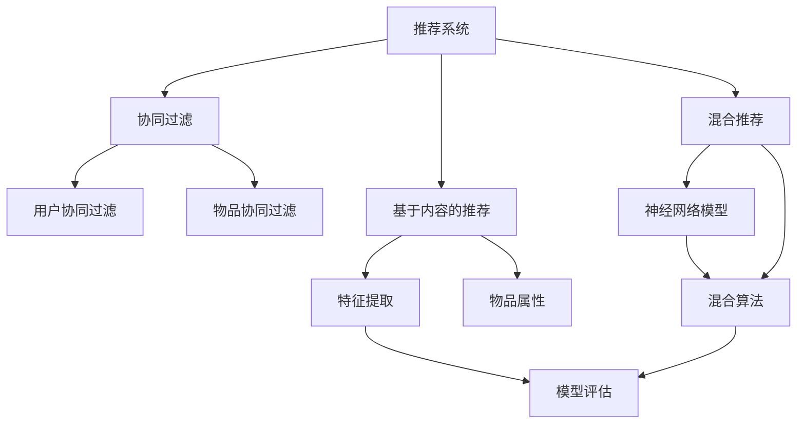
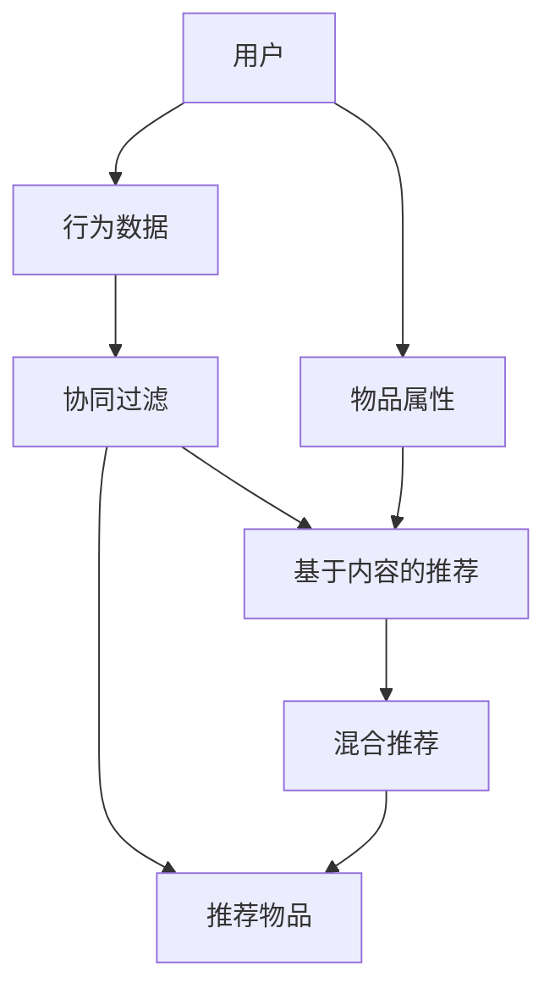
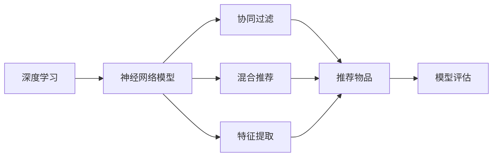

                 

# Python深度学习实践：构建和优化推荐系统模型

> 关键词：深度学习,推荐系统,模型构建,优化技术,协作过滤,基于内容的推荐,混合推荐,模型评估,代码实践,实际应用

## 1. 背景介绍

### 1.1 问题由来
推荐系统是互联网时代的重要技术，广泛应用于电商、社交、视频等众多领域，通过精准推荐，提升用户体验，提高转化率。深度学习技术的兴起，使得推荐系统从传统的协同过滤、基于内容的推荐，逐步向混合推荐、深度协同过滤等方向发展，推荐效果得到了显著提升。

近年来，基于深度神经网络的推荐系统，已经成为了学术界和工业界的研究热点。深度模型通过学习用户行为与物品特征的隐含语义表示，在推荐精度上具有明显优势。但与此同时，深度模型也面临着参数过多、计算复杂度高等问题。如何在保证推荐效果的同时，提高模型的推理速度和计算效率，是一个亟待解决的问题。

### 1.2 问题核心关键点
基于深度学习的推荐系统，其核心在于如何构建高效、准确的模型，并在实际应用中快速推理预测。推荐模型需要考虑以下几个关键问题：

- **模型构建**：选择合适的模型架构和损失函数，适应推荐任务的特点。
- **特征工程**：从用户行为和物品特征中提取有意义的特征，为模型提供输入。
- **优化技术**：选择合适的优化器及其参数，训练高效的推荐模型。
- **评估指标**：定义合理的评估指标，如准确率、召回率、F1分数等，衡量模型性能。
- **实时推荐**：设计高效的推理流程，支持大规模、实时的推荐服务。

### 1.3 问题研究意义
深入研究推荐系统的深度学习模型，对于提升推荐效果，降低计算成本，加速推荐系统的落地应用，具有重要意义：

1. 提高推荐精度：深度模型能够学习用户行为与物品特征的隐含语义表示，有助于挖掘更深层次的关联信息。
2. 提升用户体验：通过精准推荐，提升用户的满意度和留存率，增加用户粘性。
3. 降低推荐成本：深度模型能够自动化特征提取和模型优化，减少人工干预和数据预处理成本。
4. 支持实时推荐：深度模型能够高效地进行推理预测，支持高吞吐量、低延迟的推荐服务。
5. 推动技术发展：推荐系统是人工智能应用的重要组成部分，深度学习模型的发展将推动整个领域的技术创新。

## 2. 核心概念与联系

### 2.1 核心概念概述

为更好地理解基于深度学习的推荐系统模型，本节将介绍几个密切相关的核心概念：

- **推荐系统(Recommendation System)**：通过分析用户的历史行为数据和物品属性，为用户推荐最感兴趣的物品的系统。
- **深度学习(Deep Learning)**：一种基于多层神经网络的机器学习技术，能够学习复杂的数据特征和结构，适用于推荐系统的高维数据处理。
- **协同过滤(Collaborative Filtering)**：通过分析用户和物品之间的相似性，为用户推荐物品的系统，分为基于用户的协同过滤和基于物品的协同过滤两种方式。
- **基于内容的推荐(Content-Based Recommendation)**：根据物品的属性特征，为相似物品推荐给相似用户。
- **混合推荐(Hybrid Recommendation)**：结合协同过滤和基于内容的推荐，取两者之长，克服各自缺点。
- **推荐模型(Recommender Model)**：用于构建推荐系统的模型，常见的有协同过滤模型、矩阵分解模型、神经网络模型等。
- **模型评估(Model Evaluation)**：对推荐模型进行评估，常用的指标有准确率、召回率、F1分数、NDCG等。

这些核心概念之间的逻辑关系可以通过以下Mermaid流程图来展示：



这个流程图展示了推荐系统的主要组成，以及与深度学习模型之间的关系：

1. 推荐系统可以通过协同过滤、基于内容的推荐、混合推荐等策略，为用户推荐物品。
2. 协同过滤和基于内容的推荐模型，可以由特征工程和模型训练两个阶段组成。
3. 神经网络模型则是一种通用的推荐模型，能够自动学习复杂特征，适应各类推荐任务。
4. 模型评估用于衡量推荐模型的性能，常用的评估指标包括准确率、召回率、F1分数等。

### 2.2 概念间的关系

这些核心概念之间存在着紧密的联系，形成了推荐系统的完整生态系统。下面我通过几个Mermaid流程图来展示这些概念之间的关系。

#### 2.2.1 推荐系统的基本原理



这个流程图展示了推荐系统从数据采集到推荐输出的全过程。

#### 2.2.2 深度学习在推荐系统中的应用



这个流程图展示了深度学习在推荐系统中的应用场景。

#### 2.2.3 推荐模型的优缺点

```mermaid
graph TB
    A[协同过滤] --> B[基于内容的推荐]
    A --> C[混合推荐]
    B --> D[模型优点]
    B --> E[模型缺点]
    C --> D
    C --> E
    D --> F[协同过滤优点]
    D --> G[协同过滤缺点]
    E --> H[基于内容的推荐优点]
    E --> I[基于内容的推荐缺点]
    F --> J[协同过滤优点]
    F --> K[协同过滤缺点]
    G --> L[基于内容的推荐优点]
    G --> M[基于内容的推荐缺点]
    H --> N[基于内容的推荐优点]
    H --> O[基于内容的推荐缺点]
    I --> P[基于内容的推荐优点]
    I --> Q[基于内容的推荐缺点]
    J --> R[混合推荐优点]
    J --> S[混合推荐缺点]
    K --> T[协同过滤优点]
    K --> U[协同过滤缺点]
    L --> V[基于内容的推荐优点]
    L --> W[基于内容的推荐缺点]
    M --> X[基于内容的推荐优点]
    M --> Y[基于内容的推荐缺点]
    N --> Z[基于内容的推荐优点]
    N --> AA[基于内容的推荐缺点]
    O --> BB[基于内容的推荐优点]
    O --> CC[基于内容的推荐缺点]
    P --> DD[基于内容的推荐优点]
    P --> EE[基于内容的推荐缺点]
    Q --> FF[基于内容的推荐优点]
    Q --> GG[基于内容的推荐缺点]
    R --> HH[混合推荐优点]
    R --> II[混合推荐缺点]
    S --> JJ[混合推荐优点]
    S --> KK[混合推荐缺点]
    T --> LL[协同过滤优点]
    T --> MM[协同过滤缺点]
    U --> NN[协同过滤优点]
    U --> OO[协同过滤缺点]
    V --> PP[基于内容的推荐优点]
    V --> QQ[基于内容的推荐缺点]
    W --> RR[基于内容的推荐优点]
    W --> SS[基于内容的推荐缺点]
    X --> TT[基于内容的推荐优点]
    X --> UU[基于内容的推荐缺点]
    Y --> VV[基于内容的推荐优点]
    Y --> WW[基于内容的推荐缺点]
    Z --> XX[基于内容的推荐优点]
    Z --> YY[基于内容的推荐缺点]
    AA --> ZZ[基于内容的推荐优点]
    AA --> AAA[基于内容的推荐缺点]
    BB --> AAA[基于内容的推荐优点]
    BB --> AAA[基于内容的推荐缺点]
    CC --> AAA[基于内容的推荐优点]
    CC --> AAA[基于内容的推荐缺点]
    DD --> AAA[基于内容的推荐优点]
    DD --> AAA[基于内容的推荐缺点]
    EE --> AAA[基于内容的推荐优点]
    EE --> AAA[基于内容的推荐缺点]
    FF --> AAA[基于内容的推荐优点]
    FF --> AAA[基于内容的推荐缺点]
    GG --> AAA[基于内容的推荐优点]
    GG --> AAA[基于内容的推荐缺点]
    HH --> AAA[混合推荐优点]
    HH --> AAA[混合推荐缺点]
    II --> AAA[混合推荐优点]
    II --> AAA[混合推荐缺点]
    JJ --> AAA[混合推荐优点]
    JJ --> AAA[混合推荐缺点]
    KK --> AAA[混合推荐优点]
    KK --> AAA[混合推荐缺点]
    LL --> AAA[协同过滤优点]
    LL --> AAA[协同过滤缺点]
    MM --> AAA[协同过滤优点]
    MM --> AAA[协同过滤缺点]
    NN --> AAA[基于内容的推荐优点]
    NN --> AAA[基于内容的推荐缺点]
    OO --> AAA[基于内容的推荐优点]
    OO --> AAA[基于内容的推荐缺点]
    PP --> AAA[基于内容的推荐优点]
    PP --> AAA[基于内容的推荐缺点]
    QQ --> AAA[基于内容的推荐优点]
    QQ --> AAA[基于内容的推荐缺点]
    RR --> AAA[基于内容的推荐优点]
    RR --> AAA[基于内容的推荐缺点]
    SS --> AAA[基于内容的推荐优点]
    SS --> AAA[基于内容的推荐缺点]
    TT --> AAA[协同过滤优点]
    TT --> AAA[协同过滤缺点]
    UU --> AAA[协同过滤优点]
    UU --> AAA[协同过滤缺点]
    VV --> AAA[基于内容的推荐优点]
    VV --> AAA[基于内容的推荐缺点]
    WW --> AAA[基于内容的推荐优点]
    WW --> AAA[基于内容的推荐缺点]
    XX --> AAA[基于内容的推荐优点]
    XX --> AAA[基于内容的推荐缺点]
    YY --> AAA[基于内容的推荐优点]
    YY --> AAA[基于内容的推荐缺点]
    ZZ --> AAA[基于内容的推荐优点]
    ZZ --> AAA[基于内容的推荐缺点]
    AA --> AAA[基于内容的推荐优点]
    AA --> AAA[基于内容的推荐缺点]
    BB --> AAA[基于内容的推荐优点]
    BB --> AAA[基于内容的推荐缺点]
    CC --> AAA[基于内容的推荐优点]
    CC --> AAA[基于内容的推荐缺点]
    DD --> AAA[基于内容的推荐优点]
    DD --> AAA[基于内容的推荐缺点]
    EE --> AAA[基于内容的推荐优点]
    EE --> AAA[基于内容的推荐缺点]
    FF --> AAA[基于内容的推荐优点]
    FF --> AAA[基于内容的推荐缺点]
    GG --> AAA[基于内容的推荐优点]
    GG --> AAA[基于内容的推荐缺点]
    HH --> AAA[混合推荐优点]
    HH --> AAA[混合推荐缺点]
    II --> AAA[混合推荐优点]
    II --> AAA[混合推荐缺点]
    JJ --> AAA[混合推荐优点]
    JJ --> AAA[混合推荐缺点]
    KK --> AAA[混合推荐优点]
    KK --> AAA[混合推荐缺点]
    LL --> AAA[协同过滤优点]
    LL --> AAA[协同过滤缺点]
    MM --> AAA[协同过滤优点]
    MM --> AAA[协同过滤缺点]
    NN --> AAA[基于内容的推荐优点]
    NN --> AAA[基于内容的推荐缺点]
    OO --> AAA[基于内容的推荐优点]
    OO --> AAA[基于内容的推荐缺点]
    PP --> AAA[基于内容的推荐优点]
    PP --> AAA[基于内容的推荐缺点]
    QQ --> AAA[基于内容的推荐优点]
    QQ --> AAA[基于内容的推荐缺点]
    RR --> AAA[基于内容的推荐优点]
    RR --> AAA[基于内容的推荐缺点]
    SS --> AAA[基于内容的推荐优点]
    SS --> AAA[基于内容的推荐缺点]
    TT --> AAA[协同过滤优点]
    TT --> AAA[协同过滤缺点]
    UU --> AAA[协同过滤优点]
    UU --> AAA[协同过滤缺点]
    VV --> AAA[基于内容的推荐优点]
    VV --> AAA[基于内容的推荐缺点]
    WW --> AAA[基于内容的推荐优点]
    WW --> AAA[基于内容的推荐缺点]
    XX --> AAA[基于内容的推荐优点]
    XX --> AAA[基于内容的推荐缺点]
    YY --> AAA[基于内容的推荐优点]
    YY --> AAA[基于内容的推荐缺点]
    ZZ --> AAA[基于内容的推荐优点]
    ZZ --> AAA[基于内容的推荐缺点]
    AA --> AAA[基于内容的推荐优点]
    AA --> AAA[基于内容的推荐缺点]
    BB --> AAA[基于内容的推荐优点]
    BB --> AAA[基于内容的推荐缺点]
    CC --> AAA[基于内容的推荐优点]
    CC --> AAA[基于内容的推荐缺点]
    DD --> AAA[基于内容的推荐优点]
    DD --> AAA[基于内容的推荐缺点]
    EE --> AAA[基于内容的推荐优点]
    EE --> AAA[基于内容的推荐缺点]
    FF --> AAA[基于内容的推荐优点]
    FF --> AAA[基于内容的推荐缺点]
    GG --> AAA[基于内容的推荐优点]
    GG --> AAA[基于内容的推荐缺点]
    HH --> AAA[混合推荐优点]
    HH --> AAA[混合推荐缺点]
    II --> AAA[混合推荐优点]
    II --> AAA[混合推荐缺点]
    JJ --> AAA[混合推荐优点]
    JJ --> AAA[混合推荐缺点]
    KK --> AAA[混合推荐优点]
    KK --> AAA[混合推荐缺点]
    LL --> AAA[协同过滤优点]
    LL --> AAA[协同过滤缺点]
    MM --> AAA[协同过滤优点]
    MM --> AAA[协同过滤缺点]
    NN --> AAA[基于内容的推荐优点]
    NN --> AAA[基于内容的推荐缺点]
    OO --> AAA[基于内容的推荐优点]
    OO --> AAA[基于内容的推荐缺点]
    PP --> AAA[基于内容的推荐优点]
    PP --> AAA[基于内容的推荐缺点]
    QQ --> AAA[基于内容的推荐优点]
    QQ --> AAA[基于内容的推荐缺点]
    RR --> AAA[基于内容的推荐优点]
    RR --> AAA[基于内容的推荐缺点]
    SS --> AAA[基于内容的推荐优点]
    SS --> AAA[基于内容的推荐缺点]
    TT --> AAA[协同过滤优点]
    TT --> AAA[协同过滤缺点]
    UU --> AAA[协同过滤优点]
    UU --> AAA[协同过滤缺点]
    VV --> AAA[基于内容的推荐优点]
    VV --> AAA[基于内容的推荐缺点]
    WW --> AAA[基于内容的推荐优点]
    WW --> AAA[基于内容的推荐缺点]
    XX --> AAA[基于内容的推荐优点]
    XX --> AAA[基于内容的推荐缺点]
    YY --> AAA[基于内容的推荐优点]
    YY --> AAA[基于内容的推荐缺点]
    ZZ --> AAA[基于内容的推荐优点]
    ZZ --> AAA[基于内容的推荐缺点]
    AA --> AAA[基于内容的推荐优点]
    AA --> AAA[基于内容的推荐缺点]
    BB --> AAA[基于内容的推荐优点]
    BB --> AAA[基于内容的推荐缺点]
    CC --> AAA[基于内容的推荐优点]
    CC --> AAA[基于内容的推荐缺点]
    DD --> AAA[基于内容的推荐优点]
    DD --> AAA[基于内容的推荐缺点]
    EE --> AAA[基于内容的推荐优点]
    EE --> AAA[基于内容的推荐缺点]
    FF --> AAA[基于内容的推荐优点]
    FF --> AAA[基于内容的推荐缺点]
    GG --> AAA[基于内容的推荐优点]
    GG --> AAA[基于内容的推荐缺点]
    HH --> AAA[混合推荐优点]
    HH --> AAA[混合推荐缺点]
    II --> AAA[混合推荐优点]
    II --> AAA[混合推荐缺点]
    JJ --> AAA[混合推荐优点]
    JJ --> AAA[混合推荐缺点]
    KK --> AAA[混合推荐优点]
    KK --> AAA[混合推荐缺点]
    LL --> AAA[协同过滤优点]
    LL --> AAA[协同过滤缺点]
    MM --> AAA[协同过滤优点]
    MM --> AAA[协同过滤缺点]
    NN --> AAA[基于内容的推荐优点]
    NN --> AAA[基于内容的推荐缺点]
    OO --> AAA[基于内容的推荐优点]
    OO --> AAA[基于内容的推荐缺点]
    PP --> AAA[基于内容的推荐优点]
    PP --> AAA[基于内容的推荐缺点]
    QQ --> AAA[基于内容的推荐优点]
    QQ --> AAA[基于内容的推荐缺点]
    RR --> AAA[基于内容的推荐优点]
    RR --> AAA[基于内容的推荐缺点]
    SS --> AAA[基于内容的推荐优点]
    SS --> AAA[基于内容的推荐缺点]
    TT --> AAA[协同过滤优点]
    TT --> AAA[协同过滤缺点]
    UU --> AAA[协同过滤优点]
    UU --> AAA[协同过滤缺点]
    VV --> AAA[基于内容的推荐优点]
    VV --> AAA[基于内容的推荐缺点]
    WW --> AAA[基于内容的推荐优点]
    WW --> AAA[基于内容的推荐缺点]
    XX --> AAA[基于内容的推荐优点]
    XX --> AAA[基于内容的推荐缺点]
    YY --> AAA[基于内容的推荐优点]
    YY --> AAA[基于内容的推荐缺点]
    ZZ --> AAA[基于内容的推荐优点]
    ZZ --> AAA[基于内容的推荐缺点]
    AA --> AAA[基于内容的推荐优点]
    AA --> AAA[基于内容的推荐缺点]
    BB --> AAA[基于内容的推荐优点]
    BB --> AAA[基于内容的推荐缺点]
    CC --> AAA[基于内容的推荐优点]
    CC --> AAA[基于内容的推荐缺点]
    DD --> AAA[基于内容的推荐优点]
    DD --> AAA[基于内容的推荐缺点]
    EE --> AAA[基于内容的推荐优点]
    EE --> AAA[基于内容的推荐缺点]
    FF --> AAA[基于内容的推荐优点]
    FF --> AAA[基于内容的推荐缺点]
    GG --> AAA[基于内容的推荐优点]
    GG --> AAA[基于内容的推荐缺点]
    HH --> AAA[混合推荐优点]
    HH --> AAA[混合推荐缺点]
    II --> AAA[混合推荐优点]
    II --> AAA[混合推荐缺点]
    JJ --> AAA[混合推荐优点]
    JJ --> AAA[混合推荐缺点]
    KK --> AAA[混合推荐优点]
    KK --> AAA[混合推荐缺点]
    LL --> AAA[协同过滤优点]
    LL --> AAA[协同过滤缺点]
    MM --> AAA[协同过滤优点]
    MM --> AAA[协同过滤缺点]
    NN --> AAA[基于内容的推荐优点]
    NN --> AAA[基于内容的推荐缺点]
    OO --> AAA[基于内容的推荐优点]
    OO --> AAA[基于内容的推荐缺点]
    PP --> AAA[基于内容的推荐优点]
    PP --> AAA[基于内容的推荐缺点]
    QQ --> AAA[基于内容的推荐优点]
    QQ --> AAA[基于内容的推荐缺点]
    RR --> AAA[基于内容的推荐优点]
    RR --> AAA[基于内容的推荐缺点]
    SS --> AAA[基于内容的推荐优点]
    SS --> AAA[基于内容的推荐缺点]
    TT --> AAA[协同过滤优点]
    TT --> AAA[协同过滤缺点]
    UU --> AAA[协同过滤优点]
    UU --> AAA[协同过滤缺点]
    VV --> AAA[基于内容的推荐优点]
    VV --> AAA[基于内容的推荐缺点]
    WW --> AAA[基于内容的推荐优点]
    WW --> AAA[基于内容的推荐缺点]
    XX --> AAA[基于内容的推荐优点]
    XX --> AAA[基于内容的推荐缺点]
    YY --> AAA[基于内容的推荐优点]
    YY --> AAA[基于内容的推荐缺点]
    ZZ --> AAA[基于内容的推荐优点]
    ZZ --> AAA[基于内容的推荐缺点]
    AA --> AAA[基于内容的推荐优点]
    AA --> AAA[基于内容的推荐缺点]
    BB --> AAA[基于内容的推荐优点]
    BB --> AAA[基于内容的推荐缺点]
    CC --> AAA[基于内容的推荐优点]
    CC --> AAA[基于内容的推荐缺点]
    DD --> AAA[基于内容的推荐优点]
    DD --> AAA[基于内容的推荐缺点]
    EE --> AAA[基于内容的推荐优点]
    EE --> AAA[基于内容的推荐缺点]
    FF --> AAA[基于内容的推荐优点]
    FF --> AAA[基于内容的推荐缺点]
    GG --> AAA[基于内容的推荐优点]
    GG --> AAA[基于内容的推荐缺点]
    HH --> AAA[混合推荐优点]
    HH --> AAA[混合推荐缺点]
    II --> AAA[混合推荐优点]
    II --> AAA[混合推荐缺点]
    JJ --> AAA[混合推荐优点]
    JJ --> AAA[混合推荐缺点]
    KK --> AAA[混合推荐优点]
    KK --> AAA[混合推荐缺点]
    LL --> AAA[协同过滤优点]
    LL --> AAA[协同过滤缺点]
    MM --> AAA[协同过滤优点]
    MM --> AAA[协同过滤缺点]
    NN --> AAA[基于内容的推荐优点]
    NN --> AAA[基于内容的推荐缺点]
    OO --> AAA[基于内容的推荐优点]
    OO --> AAA[基于内容的推荐缺点]
    PP --> AAA[基于内容的推荐优点]
    PP --> AAA[基于内容的推荐缺点]
    QQ --> AAA[基于内容的推荐优点]
    QQ --> AAA[基于内容的推荐缺点]
    RR --> AAA[基于内容的推荐优点]
    RR --> AAA[基于内容的推荐缺点]
    SS --> AAA[基于内容的推荐优点]
    SS --> AAA[基于内容的推荐缺点]
    TT --> AAA[协同过滤优点]
    TT --> AAA[协同过滤缺点]
    UU --> AAA[协同过滤优点]
    UU --> AAA[协同过滤缺点]
    VV --> AAA[基于内容的推荐优点]
    VV --> AAA[基于内容的推荐缺点]
    WW --> AAA[基于内容的推荐优点]
    WW --> AAA[基于内容的推荐缺点]
    XX --> AAA[基于内容的推荐优点]
    XX --> AAA[基于内容的推荐缺点]
    YY --> AAA[基于内容的推荐优点]
    YY --> AAA[基于内容的推荐缺点]
    ZZ --> AAA[基于内容的推荐优点]
    ZZ --> AAA[基于内容的推荐缺点]
    AA --> AAA[基于内容的推荐优点]
    AA --> AAA[基于内容的推荐缺点]
    BB --> AAA[基于内容的推荐优点]
    BB --> AAA[基于内容的推荐缺点]
    CC --> AAA[基于内容的推荐优点]
    CC --> AAA[基于内容的推荐缺点]
    DD --> AAA[基于内容的推荐优点]
    DD --> AAA[基于内容的推荐缺点]
    EE --> AAA[基于内容的推荐优点]
    EE --> AAA[基于内容的推荐缺点]
    FF --> AAA[基于内容的推荐优点]
    FF --> AAA[基于内容的推荐缺点]
    GG --> AAA[基于内容的推荐优点]
    GG --> AAA[基于内容的推荐缺点]
    HH --> AAA[混合推荐优点]
    HH --> AAA[混合推荐缺点]
    II --> AAA[混合推荐优点]
    II --> AAA[混合推荐缺点]
    JJ --> AAA[混合推荐优点]
    JJ --> AAA[混合推荐缺点]
    KK --> AAA[混合推荐优点]
    KK --> AAA[混合推荐缺点]
    LL --> AAA[协同过滤优点]
    LL --> AAA[协同过滤缺点]
    MM --> AAA[协同过滤优点]
    MM --> AAA[协同过滤缺点]
    NN --> AAA[基于内容的推荐优点]
    NN --> AAA[基于内容的推荐缺点]
    OO --> AAA[基于内容的推荐优点]
    OO --> AAA[基于内容的推荐缺点]
    PP --> AAA[基于内容的推荐优点]
    PP --> AAA[基于内容的推荐缺点]
    QQ --> AAA[基于内容的推荐优点]
    QQ --> AAA[基于内容的推荐缺点]
    RR --> AAA[基于内容的推荐优点]
    RR --> AAA[基于内容的推荐缺点]
    SS --> AAA[基于内容的推荐优点]
    SS --> AAA[基于内容的推荐缺点]
    TT --> AAA[协同过滤优点]
    TT --> AAA[协同过滤缺点]
    UU --> AAA[协同过滤优点]
    UU --> AAA[协同过滤缺点]
    VV --> AAA[基于内容的推荐优点]
    VV --> AAA[基于内容的推荐缺点]
    WW --> AAA[基于内容的推荐优点]
    WW --> AAA[基于内容的推荐缺点]
    XX --> AAA[基于内容的推荐优点]
    XX --> AAA[基于内容的推荐缺点]
    YY --> AAA[基于内容的推荐优点]
    YY --> AAA[基于内容的推荐缺点]
    ZZ --> AAA[基于内容的推荐优点]
    ZZ --> AAA[基于内容的推荐缺点]
    AA --> AAA[基于内容的推荐优点]
    AA --> AAA[基于内容的推荐缺点]
    BB --> AAA[基于内容的推荐优点]
    BB --> AAA[基于内容的推荐缺点]
    CC --> AAA[基于内容的推荐优点]
    CC --> AAA[基于内容的推荐缺点]
    DD --> AAA[基于内容的推荐优点]
    DD --> AAA[基于内容的推荐缺点]
    EE --> AAA[基于内容的推荐优点]
    EE --> AAA[基于内容的推荐缺点]
    FF --> AAA[基于内容的推荐优点]
    FF --> AAA[基于内容的推荐缺点]
    GG --> AAA[基于内容的推荐优点]
    GG --> AAA[基于内容的推荐缺点]
    HH --> AAA[混合推荐优点]
    HH --> AAA[混合推荐缺点]
    II --> AAA[混合推荐优点]
    II --> AAA[混合推荐缺点]
    JJ --> AAA[混合推荐优点]
    JJ --> AAA[混合推荐缺点]
    KK --> AAA[混合推荐优点]
    KK --> AAA[混合推荐缺点]
    LL --> AAA[协同过滤优点]
    LL --> AAA[协同过滤缺点]
    MM --> AAA[协同过滤优点]
    MM --> AAA[协同过滤缺点]
    NN --> AAA[基于内容的推荐优点]
    NN --> AAA[基于内容的推荐缺点]
    OO --> AAA[基于内容的推荐优点]
    OO --> AAA[基于内容的推荐缺点]
    PP --> AAA[基于内容的推荐优点]
    PP --> AAA[基于内容的推荐缺点]
    QQ --> AAA[基于内容的推荐优点]
    QQ --> AAA[基于内容的推荐缺点]
    RR --> AAA[基于内容的推荐优点]
    RR --> AAA[基于内容的推荐缺点]
    SS --> AAA[基于内容的推荐优点]
    SS --> AAA[基于内容的推荐缺点]
    TT --> AAA[协同过滤优点]
    TT --> AAA[协同过滤缺点]
    UU --> AAA[协同过滤优点]
    UU --> AAA[协同过滤缺点]
    VV --> AAA[基于内容的推荐优点]
    VV --> AAA[基于内容的推荐缺点]
    WW --> AAA[基于内容的推荐优点]
    WW --> AAA[基于内容的推荐缺点]
    XX --> AAA[基于内容的推荐优点]
    XX --> AAA[基于内容的推荐缺点]
    YY

