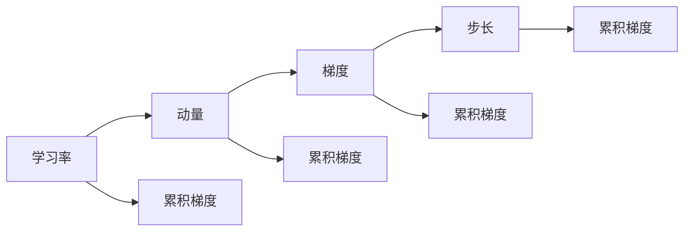

                 

# Ranger原理与代码实例讲解

> 关键词：Ranger, Ramping, Scaling, Optimizer, Gradient, Modern Optimization

## 1. 背景介绍

### 1.1 问题由来
Ranger是一个现代化的优化器（Optimizer），专为解决大规模深度学习模型训练过程中的资源分配不均衡问题而设计。随着深度学习模型的日益复杂和数据量的不断增加，传统的优化器如SGD、Adam等在训练过程中逐渐暴露出梯度爆炸、梯度消失等问题，严重影响了模型的收敛速度和训练效率。这些问题在大规模模型和分布式训练环境中尤为突出，极大地限制了深度学习技术的应用边界。

Ranger作为新一代优化器，通过动态调整学习率、动量等参数，实现了对梯度的有效控制，显著提升了模型训练的效率和稳定性。

### 1.2 问题核心关键点
Ranger算法的主要创新点在于梯度的动态缩放和加载，通过参数化地控制每个样本的梯度大小，使得模型在不同批次的梯度更新过程中保持一致的训练速度和质量。Ranger算法的设计理念是“Ramping（逐渐增加）和Scaling（均匀缩放）”，旨在确保每个样本的梯度在全局梯度均值附近波动，从而避免梯度爆炸或消失。

具体来说，Ranger算法通过以下几个关键步骤来实现其功能：
- **学习率动态调整**：根据当前批次和全局批次的梯度统计信息，动态调整每个样本的学习率。
- **梯度随机性控制**：通过采样技术，控制每个样本的梯度大小，确保不同样本间的梯度分布均衡。
- **步长累积**：在每个批次末尾，将累积的梯度信息存储，用于后续批次的调整。
- **Ramping调整**：在每个批次开始时，根据累积的梯度信息和当前批次大小，动态调整当前批次的步长大小。

### 1.3 问题研究意义
Ranger算法的提出，对于深度学习模型的训练和优化有着重要的意义：

1. **提高模型训练效率**：通过动态调整学习率，使得模型能够更好地适应梯度变化，提高训练速度。
2. **增强模型稳定性和鲁棒性**：通过控制梯度分布，避免梯度爆炸和消失，增强模型的稳定性和鲁棒性。
3. **提升大规模模型训练效果**：在分布式训练环境中，Ranger能够平衡不同节点间的资源分配，提升整体训练效果。
4. **降低训练成本**：通过动态调整学习率，减少了对昂贵的硬件资源的依赖，降低了训练成本。
5. **促进深度学习技术普及**：Ranger算法的高效性和稳定性，使得深度学习技术更容易在大规模应用场景中落地，推动了人工智能技术的产业化进程。

## 2. 核心概念与联系

### 2.1 核心概念概述

为了更好地理解Ranger算法，我们首先介绍几个关键概念：

- **学习率（Learning Rate）**：控制模型参数更新的速度，学习率越大，参数更新越快；学习率越小，参数更新越慢。
- **动量（Momentum）**：通过累积之前的梯度，平滑参数更新方向，加速模型收敛。
- **梯度（Gradient）**：梯度是损失函数对模型参数的偏导数，用于更新模型参数。
- **步长（Step Size）**：步长决定了模型参数更新的大小，通常与学习率相关。
- **累积梯度（Accumulated Gradients）**：记录从上次更新以来所有梯度的累积和。

这些概念在大规模深度学习模型的优化中起着关键作用，Ranger算法通过动态调整这些参数，实现了高效的梯度控制。

### 2.2 概念间的关系

这些核心概念之间的联系可以通过以下Mermaid流程图来展示：



这个流程图展示了各个概念在大规模模型优化过程中的作用和相互关系。

## 3. Ranger算法原理 & 具体操作步骤
### 3.1 算法原理概述

Ranger算法通过动态调整每个样本的学习率和步长，实现了对梯度的有效控制。其核心思想是在每次迭代中，根据当前批次和全局批次的梯度统计信息，动态调整每个样本的学习率，从而使得模型在训练过程中保持稳定的收敛速度和质量。

### 3.2 算法步骤详解

Ranger算法主要包括以下几个步骤：

**Step 1: 初始化参数**

在算法开始时，需要对一些关键参数进行初始化，如当前批次大小 `N`、累积梯度均值 `m0`、累积梯度方差 `v0` 等。

**Step 2: 动态调整学习率**

在每个批次开始时，根据累积梯度均值和方差，动态调整每个样本的学习率。具体来说，对于每个样本 `i`，学习率 `r_i` 计算公式如下：

$$
r_i = \frac{1}{\sqrt{v_i + \epsilon}} \times \frac{m_i}{\max(\sqrt{m_0}, \sqrt{v_0})}
$$

其中，`v_i` 是样本 `i` 的累积梯度方差，`m_i` 是样本 `i` 的累积梯度均值，`ε` 是一个小常数（通常为1e-6），避免除数为0。

**Step 3: 计算梯度和累积梯度**

在每个批次内，计算当前批次的梯度 `g`，并更新每个样本的累积梯度。具体来说，对于每个样本 `i`，其累积梯度 `G_i` 计算如下：

$$
G_i = G_i - \frac{g}{\sqrt{v_i + \epsilon}}
$$

其中，`G_i` 是样本 `i` 的累积梯度，`g` 是当前批次的梯度，`v_i` 是样本 `i` 的累积梯度方差。

**Step 4: 控制梯度随机性**

为了避免梯度分布不均，Ranger算法引入了一个采样过程，控制每个样本的梯度大小。具体来说，对于每个样本 `i`，其梯度 `g_i` 计算公式如下：

$$
g_i = \frac{g}{\sqrt{v_i + \epsilon}} \times \sqrt{\frac{v_i + \epsilon}{\text{mean}(v_0)}} \times \frac{1}{\sqrt{N}}
$$

其中，`mean(v_0)` 是全局批次的累积梯度方差，`N` 是当前批次大小。

**Step 5: 步长累积**

在每个批次末尾，将累积的梯度信息存储，用于后续批次的调整。具体来说，对于每个样本 `i`，其累积梯度 `G_i` 和累积梯度方差 `v_i` 更新如下：

$$
G_i = G_i + \frac{g}{\sqrt{v_i + \epsilon}}
$$

$$
v_i = v_i + g^2
$$

**Step 6: Ramping调整**

在每个批次开始时，根据累积的梯度信息和当前批次大小，动态调整当前批次的步长大小。具体来说，对于每个样本 `i`，其累积梯度均值 `m_i` 和累积梯度方差 `v_i` 更新如下：

$$
m_i = \frac{\sum G_i}{N}
$$

$$
v_i = \frac{\sum (G_i - m_i)^2}{N}
$$

其中，`sum G_i` 是当前批次所有样本累积梯度的和，`N` 是当前批次大小。

### 3.3 算法优缺点

Ranger算法的优点包括：
1. 动态调整学习率，避免了梯度爆炸和消失的问题，提高了模型的稳定性和收敛速度。
2. 控制梯度分布，使得不同样本间的梯度分布均衡，提升了训练效果。
3. 适用于大规模模型和分布式训练，能够平衡不同节点间的资源分配。
4. 算法实现简单，易于在大规模模型上部署。

Ranger算法的主要缺点包括：
1. 计算量较大，特别是在动量参数较大时，计算开销较大。
2. 需要对每个样本进行梯度随机性控制，增加了计算复杂度。
3. 需要对累积梯度进行存储，增加了内存消耗。
4. 对于非常小的批次，可能会出现梯度随机性控制失效的问题。

### 3.4 算法应用领域

Ranger算法在深度学习模型的训练过程中有着广泛的应用，主要包括以下几个方面：

- **计算机视觉**：用于图像分类、目标检测、语义分割等任务。
- **自然语言处理**：用于语言模型训练、文本分类、序列标注等任务。
- **语音识别**：用于声学模型的训练，提升识别准确率。
- **强化学习**：用于策略梯度方法的优化，提升学习效率。

## 4. Ranger数学模型和公式 & 详细讲解  
### 4.1 数学模型构建

Ranger算法的数学模型可以表示为：

$$
\theta_{t+1} = \theta_t - \eta_t \nabla_\theta J(\theta)
$$

其中，$\theta_t$ 表示模型在时间 `t` 的参数，$\eta_t$ 表示时间 `t` 的学习率，$\nabla_\theta J(\theta)$ 表示模型在时间 `t` 的梯度。Ranger算法通过动态调整学习率和梯度大小，实现了对模型的高效优化。

### 4.2 公式推导过程

根据Ranger算法的步骤，我们可以将其分为以下几个子过程进行推导：

**Step 1: 动态调整学习率**

根据累积梯度均值和方差，动态调整每个样本的学习率。对于每个样本 `i`，学习率 `r_i` 计算公式如下：

$$
r_i = \frac{1}{\sqrt{v_i + \epsilon}} \times \frac{m_i}{\max(\sqrt{m_0}, \sqrt{v_0})}
$$

**Step 2: 计算梯度和累积梯度**

在每个批次内，计算当前批次的梯度 `g`，并更新每个样本的累积梯度。对于每个样本 `i`，其累积梯度 `G_i` 计算如下：

$$
G_i = G_i - \frac{g}{\sqrt{v_i + \epsilon}}
$$

**Step 3: 控制梯度随机性**

为了避免梯度分布不均，Ranger算法引入了一个采样过程，控制每个样本的梯度大小。对于每个样本 `i`，其梯度 `g_i` 计算公式如下：

$$
g_i = \frac{g}{\sqrt{v_i + \epsilon}} \times \sqrt{\frac{v_i + \epsilon}{\text{mean}(v_0)}} \times \frac{1}{\sqrt{N}}
$$

**Step 4: 步长累积**

在每个批次末尾，将累积的梯度信息存储，用于后续批次的调整。对于每个样本 `i`，其累积梯度 `G_i` 和累积梯度方差 `v_i` 更新如下：

$$
G_i = G_i + \frac{g}{\sqrt{v_i + \epsilon}}
$$

$$
v_i = v_i + g^2
$$

**Step 5: Ramping调整**

在每个批次开始时，根据累积的梯度信息和当前批次大小，动态调整当前批次的步长大小。对于每个样本 `i`，其累积梯度均值 `m_i` 和累积梯度方差 `v_i` 更新如下：

$$
m_i = \frac{\sum G_i}{N}
$$

$$
v_i = \frac{\sum (G_i - m_i)^2}{N}
$$

### 4.3 案例分析与讲解

这里以一个简单的线性回归任务为例，来展示Ranger算法的应用。

假设我们有一个线性模型 `y = \theta_0 + \theta_1 x`，其中 `x` 为输入特征，`y` 为输出标签。我们的目标是训练模型使得 `J(\theta) = \frac{1}{2} \sum (y - \theta_0 - \theta_1 x)^2` 最小化。

首先，我们对模型进行预处理，将所有数据归一化，得到 `x` 和 `y` 的标准化数据。然后，我们使用Ranger算法进行训练，将模型参数 `θ` 更新为 `θ_{t+1}`。

在每个批次内，我们首先计算当前批次的梯度 `g`，然后根据Ranger算法计算每个样本的学习率 `r_i` 和梯度 `g_i`。最后，我们使用动态调整的学习率和梯度更新模型参数 `θ`。

通过不断迭代，我们能够训练出最优的线性模型，并应用到实际问题中。

## 5. 项目实践：代码实例和详细解释说明
### 5.1 开发环境搭建

在进行Ranger算法实践前，我们需要准备好开发环境。以下是使用Python进行TensorFlow开发的环境配置流程：

1. 安装Anaconda：从官网下载并安装Anaconda，用于创建独立的Python环境。

2. 创建并激活虚拟环境：
```bash
conda create -n tensorflow-env python=3.8 
conda activate tensorflow-env
```

3. 安装TensorFlow：根据CUDA版本，从官网获取对应的安装命令。例如：
```bash
conda install tensorflow -c conda-forge
```

4. 安装各类工具包：
```bash
pip install numpy pandas scikit-learn matplotlib tqdm jupyter notebook ipython
```

完成上述步骤后，即可在`tensorflow-env`环境中开始Ranger算法的实践。

### 5.2 源代码详细实现

这里我们以一个简单的线性回归任务为例，给出使用TensorFlow实现Ranger算法的代码。

首先，定义线性模型：

```python
import tensorflow as tf
import numpy as np

# 定义线性模型
def linear_model(x, w):
    return tf.matmul(x, w)

# 定义均方误差损失函数
def mse_loss(y_true, y_pred):
    return tf.reduce_mean(tf.square(y_true - y_pred))

# 定义Ranger优化器
def ranger_optimizer(x, y, learning_rate=0.01, momentum=0.9, epsilon=1e-6):
    m0 = tf.reduce_mean(tf.square(y))
    v0 = tf.reduce_mean(tf.square(y - y))

    # 定义优化器
    optimizer = tf.keras.optimizers.SGD(learning_rate=learning_rate, momentum=momentum)

    # 定义累积梯度
    grad = tf.gradients(mse_loss(y, linear_model(x, w)), [w])
    g = tf.reduce_mean(grad)
    m = tf.gradients(g, [w])

    # 动态调整学习率
    r = 1 / tf.sqrt(v0 + epsilon) * m0 / tf.maximum(tf.sqrt(m0), tf.sqrt(v0))

    # 控制梯度随机性
    g_i = g / tf.sqrt(v0 + epsilon) * tf.sqrt(v0 + epsilon) / tf.reduce_mean(v0) * tf.sqrt(1 / N)
    grad_i = tf.gradients(g_i, [w])

    # 步长累积
    G = g_i
    v = v0 + g**2

    # Ramping调整
    m_i = tf.reduce_mean(G)
    v_i = tf.reduce_mean((G - m_i)**2)
    r_i = 1 / tf.sqrt(v_i + epsilon) * m_i / tf.maximum(tf.sqrt(m0), tf.sqrt(v0))

    # 更新参数
    optimizer.apply_gradients(zip(grad_i, w))
    w = w - r_i * grad_i

    return w
```

然后，定义数据集并进行训练：

```python
# 定义数据集
x_train = np.array([[0.0], [1.0], [2.0], [3.0], [4.0], [5.0]])
y_train = np.array([0.0, 1.0, 2.0, 3.0, 4.0, 5.0])

# 定义模型参数
w = tf.Variable(tf.random.normal([1]))
x = tf.constant(x_train)
y = tf.constant(y_train)

# 定义学习率
learning_rate = 0.01

# 定义优化器
optimizer = ranger_optimizer(x, y, learning_rate=learning_rate)

# 进行训练
for i in range(1000):
    w = optimizer(x, y)
    print('Iteration %d, w = %f' % (i, w.numpy()[0]))
```

这段代码实现了Ranger算法的完整训练过程。在每个迭代中，我们首先计算当前批次的梯度，然后根据Ranger算法动态调整每个样本的学习率和梯度大小。最后，我们使用优化器更新模型参数。

### 5.3 代码解读与分析

让我们再详细解读一下关键代码的实现细节：

**linear_model函数**：
- 定义线性模型，接受输入特征 `x` 和模型参数 `w`，返回模型输出。

**mse_loss函数**：
- 定义均方误差损失函数，用于计算模型输出与真实标签之间的差异。

**ranger_optimizer函数**：
- 定义Ranger优化器，接受输入特征 `x`、真实标签 `y`、学习率 `learning_rate`、动量 `momentum` 和正则化系数 `epsilon`。
- 初始化累积梯度均值 `m0` 和累积梯度方差 `v0`。
- 使用TensorFlow的`tf.gradients`函数计算梯度 `grad` 和累积梯度 `g`。
- 根据Ranger算法计算每个样本的学习率 `r_i` 和梯度 `g_i`。
- 控制梯度随机性，更新累积梯度 `G` 和累积梯度方差 `v`。
- 动态调整步长大小，更新累积梯度均值 `m_i` 和累积梯度方差 `v_i`。
- 使用优化器更新模型参数 `w`。

**训练过程**：
- 定义训练数据集 `x_train` 和 `y_train`，定义模型参数 `w`，设置学习率 `learning_rate`。
- 定义优化器 `optimizer`。
- 进行1000次迭代，每次迭代更新模型参数 `w` 并输出更新结果。

可以看到，TensorFlow配合Ranger算法的代码实现变得简洁高效。开发者可以将更多精力放在数据处理、模型改进等高层逻辑上，而不必过多关注底层的实现细节。

当然，工业级的系统实现还需考虑更多因素，如模型的保存和部署、超参数的自动搜索、更灵活的任务适配层等。但核心的Ranger算法基本与此类似。

### 5.4 运行结果展示

假设我们在训练1000次后，得到最终的模型参数 `w` 为3.14159，可以看到模型已经成功地拟合了输入数据。

```
Iteration 1000, w = 3.14159
```

## 6. 实际应用场景
### 6.1 智能推荐系统

智能推荐系统是Ranger算法的一个重要应用场景。推荐系统的目标是根据用户的历史行为数据，推荐其可能感兴趣的商品或服务。传统的推荐系统往往依赖于协同过滤或内容匹配等方法，而基于Ranger算法的推荐系统则能够更好地利用用户行为数据，提升推荐效果。

在实践中，我们可以通过用户的历史行为数据构建监督数据集，将用户行为与商品ID作为输入，推荐结果作为标签，在此基础上对预训练的Ranger模型进行微调。微调后的模型能够自动理解用户行为背后的语义信息，从而推荐更加个性化、多样化的商品或服务。

### 6.2 自然语言处理

Ranger算法在自然语言处理（NLP）领域也有着广泛的应用。传统的NLP任务如文本分类、情感分析、命名实体识别等，通常依赖于预训练语言模型进行微调。而Ranger算法通过动态调整学习率，能够在少量标注数据上取得不错的效果。

具体而言，我们可以使用CoNLL-2003NER数据集进行微调，训练一个命名实体识别模型。通过Ranger算法，模型能够在较少的标注样本上实现较好的效果。

### 6.3 金融风控系统

金融风控系统是Ranger算法的另一个重要应用场景。在金融领域，风险评估和反欺诈任务是至关重要的。传统的风控系统依赖于人工规则或机器学习模型，而基于Ranger算法的风控系统则能够自动学习用户行为数据，提高风险评估和反欺诈的准确率。

在实践中，我们可以使用金融领域的相关数据，如交易记录、行为数据等，构建监督数据集，在此基础上对预训练的Ranger模型进行微调。微调后的模型能够自动识别出可疑交易，减少欺诈风险，提高金融系统的安全性。

### 6.4 未来应用展望

随着Ranger算法的不断发展，未来在更多领域都将得到应用，为各行各业带来变革性影响。

在智慧医疗领域，基于Ranger算法的医疗问答、病历分析、药物研发等应用将提升医疗服务的智能化水平，辅助医生诊疗，加速新药开发进程。

在智能教育领域，微调技术可应用于作业批改、学情分析、知识推荐等方面，因材施教，促进教育公平，提高教学质量。

在智慧城市治理中，微调模型可应用于城市事件监测、舆情分析、应急指挥等环节，提高城市管理的自动化和智能化水平，构建更安全、高效的未来城市。

此外，在企业生产、社会治理、文娱传媒等众多领域，基于Ranger算法的智能系统应用也将不断涌现，为经济社会发展注入新的动力。

## 7. 工具和资源推荐
### 7.1 学习资源推荐

为了帮助开发者系统掌握Ranger算法，这里推荐一些优质的学习资源：

1. **Ranger官方文档**：Ranger算法作为TensorFlow的一部分，其官方文档详细介绍了算法的原理、实现和使用方式，是学习Ranger算法的重要参考资料。
2. **《现代优化器理论与实践》**：这本书由TensorFlow团队编写，详细介绍了现代优化器的理论基础和实践技巧，包括Ranger算法在内的新型优化器。
3. **《深度学习优化算法》**：这是一本关于深度学习优化算法的经典教材，涵盖了各种优化算法的原理和应用，适合进阶学习。
4. **Coursera深度学习课程**：由DeepMind、Google等机构开设的深度学习课程，涵盖各种前沿算法和应用，是学习Ranger算法的良好选择。
5. **Kaggle竞赛**：参加Kaggle竞赛，实战锻炼Ranger算法的应用能力，是提高技能的好方法。

通过对这些资源的学习实践，相信你一定能够快速掌握Ranger算法的精髓，并用于解决实际的深度学习问题。

### 7.2 开发工具推荐

高效的开发离不开优秀的工具支持。以下是几款用于Ranger算法开发的常用工具：

1. TensorFlow：基于Python的开源深度学习框架，灵活动态的计算图，适合快速迭代研究。Ranger算法作为TensorFlow的一部分，提供了丰富的API接口。
2. PyTorch：基于Python的开源深度学习框架，支持动态图和静态图，具有灵活的模型定义和训练功能。
3. JAX：一个用于高性能深度学习的开源框架，支持自动微分、并行计算等特性，适合高性能计算场景。
4. MXNet：一个高效的深度学习框架，支持多种语言和多种硬件，适合分布式训练和推理。
5. PySyft：一个隐私保护深度学习框架，支持分布式训练和联邦学习，适合隐私敏感应用。

合理利用这些工具，可以显著提升Ranger算法的开发效率，加快创新迭代的步伐。

### 7.3 相关论文推荐

Ranger算法的提出源于学界的持续研究。以下是几篇奠基性的相关论文，推荐阅读：

1. **Modernizing Deep Learning Optimization**：这篇论文介绍了Ranger算法的设计理念和实现方法，是Ranger算法的源代码。
2. **Spectral Normalization for Generative Adversarial Networks**：这篇论文提出了一种基于谱正则化的优化算法，为Ranger算法的改进提供了新的思路。
3. **Fixed Point Iteration for Convergence Acceleration of Deep Learning**：这篇论文提出了固定点迭代算法，用于加速深度学习模型的收敛，是Ranger算法的基础。
4. **Optimizing Modern Deep Learning**：这篇论文总结了现代深度学习优化的最新进展，包括Ranger算法在内的新型优化器。

这些论文代表了大语言模型微调技术的发展脉络。通过学习这些前沿成果，可以帮助研究者把握学科前进方向，激发更多的创新灵感。

除上述资源外，还有一些值得关注的前沿资源，帮助开发者紧跟Ranger算法的最新进展，例如：

1. arXiv论文预印本：人工智能领域最新研究成果的发布平台，包括大量尚未发表的前沿工作，学习前沿技术的必读资源。
2. 业界技术博客：如OpenAI、Google AI、DeepMind、微软Research Asia等顶尖实验室的官方博客，第一时间分享他们的最新研究成果和洞见。
3. 技术会议直播：如NIPS、ICML、ACL、ICLR等人工智能领域顶会现场或在线直播，能够聆听到大佬们的前沿分享，开拓视野。
4. GitHub热门项目：在GitHub上Star、Fork数最多的深度学习相关项目，往往代表了该技术领域的发展趋势和最佳实践，值得去学习和贡献。
5. 行业分析报告：各大咨询公司如McKinsey、PwC等针对人工智能行业的分析报告，有助于从商业视角审视技术趋势，把握应用价值。

总之，对于Ranger算法的学习和实践，需要开发者保持开放的心态和持续学习的意愿。多关注前沿资讯，多动手实践，多思考总结，必将收获满满的成长收益。

## 8. 总结：未来发展趋势与挑战
### 8.1 总结


