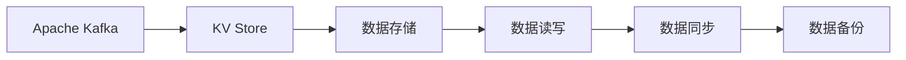
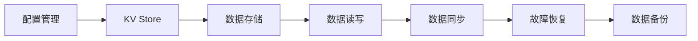

                 

# Samza KV Store原理与代码实例讲解

## 1. 背景介绍

### 1.1 问题由来

在Apache Kafka分布式消息处理系统中，KV Store作为一个高可用、高性能的键值存储引擎，能够为Kafka集群提供丰富的状态管理功能。KV Store能够基于配置文件自动生成和管理键值存储，并且能够在集群中自动进行故障恢复和数据复制。本部分将深入探讨KV Store的原理与架构，并通过实际代码实例讲解其核心功能的应用方法。

### 1.2 问题核心关键点

KV Store的核心功能包括配置管理、数据同步、故障恢复、性能优化等。KV Store能够通过自动配置和管理，保证键值存储数据的可靠性和一致性。在代码实例部分，将重点演示如何使用KV Store进行数据同步和故障恢复，并通过配置文件来优化Kafka集群性能。

### 1.3 问题研究意义

KV Store是Kafka分布式消息处理系统的核心组件之一，对整个系统的稳定性和可靠性有着至关重要的影响。通过对KV Store原理与代码实例的深入学习，能够帮助开发者更好地理解Kafka的内部机制，提高系统的可靠性和性能，同时提升其在分布式系统中的应用能力。

## 2. 核心概念与联系

### 2.1 核心概念概述

为了更好地理解KV Store的工作原理和架构，本节将介绍几个密切相关的核心概念：

- **Apache Kafka**：一个高吞吐量的分布式流处理平台，支持实时数据处理和存储，KV Store是其核心组件之一。
- **分布式一致性协议(ZAB协议)**：KV Store使用的分布式一致性协议，用于保证键值存储数据的可靠性和一致性。
- **KV Store**：Kafka集群中的键值存储引擎，用于存储和管理消息队列的相关状态数据。
- **故障恢复**：KV Store能够自动进行故障恢复，保证数据的一致性和可靠性。
- **数据同步**：KV Store能够自动同步数据到不同的节点上，实现数据的高可用性和一致性。
- **配置管理**：KV Store能够根据配置文件自动生成和管理键值存储，提高系统的可扩展性和灵活性。

这些核心概念之间的逻辑关系可以通过以下Mermaid流程图来展示：

```mermaid
graph LR
    A[Apache Kafka] --> B[KV Store]
    B --> C[分布式一致性协议(ZAB协议)]
    B --> D[故障恢复]
    B --> E[数据同步]
    B --> F[配置管理]
```

这个流程图展示了大语言模型的核心概念及其之间的关系：

1. Kafka基于KV Store进行数据存储和管理。
2. KV Store使用ZAB协议保证数据一致性和可靠性。
3. KV Store实现故障恢复和数据同步。
4. KV Store根据配置文件进行管理，提高系统可扩展性和灵活性。

### 2.2 概念间的关系

这些核心概念之间存在着紧密的联系，形成了KV Store的完整生态系统。下面我通过几个Mermaid流程图来展示这些概念之间的关系。

#### 2.2.1 Kafka与KV Store的关系



这个流程图展示了Kafka与KV Store之间的关系：

1. Kafka将数据存储在KV Store中。
2. KV Store负责数据的读写操作。
3. KV Store自动同步数据到不同节点上。
4. KV Store对数据进行备份，保证数据的可靠性。

#### 2.2.2 ZAB协议与KV Store的关系

```mermaid
graph LR
    A[分布式一致性协议(ZAB协议)] --> B[KV Store]
    B --> C[数据同步]
    C --> D[故障恢复]
    D --> E[数据备份]
```

这个流程图展示了ZAB协议与KV Store之间的关系：

1. ZAB协议用于保证数据的一致性和可靠性。
2. KV Store自动同步数据到不同节点上。
3. KV Store自动进行故障恢复。
4. KV Store对数据进行备份，保证数据的可靠性。

#### 2.2.3 配置管理与KV Store的关系



这个流程图展示了配置管理与KV Store之间的关系：

1. 配置管理用于自动生成和管理KV Store。
2. KV Store负责数据的存储和管理。
3. KV Store自动同步数据到不同节点上。
4. KV Store自动进行故障恢复。
5. KV Store对数据进行备份，保证数据的可靠性。

### 2.3 核心概念的整体架构

最后，我们用一个综合的流程图来展示这些核心概念在大语言模型微调过程中的整体架构：

```mermaid
graph LR
    A[Apache Kafka] --> B[KV Store]
    B --> C[分布式一致性协议(ZAB协议)]
    C --> D[数据同步]
    C --> E[故障恢复]
    D --> F[数据备份]
    A --> G[配置管理]
    G --> B
```

这个综合流程图展示了从Kafka到KV Store的完整过程。Kafka基于KV Store进行数据存储和管理，ZAB协议用于保证数据的一致性和可靠性。KV Store自动同步数据到不同节点上，并进行故障恢复和数据备份，同时根据配置文件进行管理，提高系统的可扩展性和灵活性。

## 3. 核心算法原理 & 具体操作步骤

### 3.1 算法原理概述

KV Store的算法原理主要包括数据同步、故障恢复和配置管理等方面。其中，数据同步和故障恢复是KV Store的核心功能，保证了键值存储数据的可靠性和一致性。配置管理则提高了系统的可扩展性和灵活性。

#### 3.1.1 数据同步

KV Store的数据同步主要通过ZAB协议来实现。ZAB协议是一种基于分布式一致性协议，用于保证KV Store中键值数据的一致性和可靠性。ZAB协议通过集结所有节点状态，选举主节点和从节点，并同步数据，保证数据的可靠性和一致性。

#### 3.1.2 故障恢复

KV Store的故障恢复主要通过数据备份和数据复制来实现。KV Store自动将数据备份到不同的节点上，并根据配置文件进行数据复制，保证在节点故障时，数据仍能保持可用性。

#### 3.1.3 配置管理

KV Store的配置管理主要通过配置文件来实现。KV Store能够根据配置文件自动生成和管理键值存储，提高系统的可扩展性和灵活性。配置文件包含了KV Store的各个参数和设置，如数据存储路径、数据复制因子、故障恢复策略等。

### 3.2 算法步骤详解

以下是KV Store的核心算法步骤详解：

#### 3.2.1 数据同步步骤

1. 节点加入集群，并从主节点获取最新数据。
2. 节点在本地对数据进行校验和计算，并与主节点进行同步。
3. 节点接收主节点的同步请求，进行数据传输和校验。
4. 节点将同步数据写入本地存储，并更新本地状态。

#### 3.2.2 故障恢复步骤

1. 节点检测到故障，触发故障恢复机制。
2. 节点从备份中恢复数据，并重新同步到主节点。
3. 主节点接收恢复数据的同步请求，并进行校验。
4. 主节点将恢复数据同步到其他从节点。

#### 3.2.3 配置管理步骤

1. 节点从配置文件中读取参数和设置。
2. 节点根据参数进行键值存储的创建和管理。
3. 节点根据配置文件进行数据同步和故障恢复。
4. 节点根据配置文件进行数据的备份和复制。

### 3.3 算法优缺点

KV Store的优点包括：

1. 高可靠性：KV Store使用ZAB协议保证数据一致性和可靠性。
2. 高可用性：KV Store自动同步数据到不同节点上，实现数据的高可用性。
3. 高效性能：KV Store基于内存进行数据存储和管理，实现高效的数据读写。
4. 灵活配置：KV Store能够根据配置文件自动生成和管理键值存储。

KV Store的缺点包括：

1. 配置复杂：配置文件包含大量参数和设置，配置复杂。
2. 性能瓶颈：基于内存进行数据存储和管理，存在性能瓶颈。
3. 资源消耗：自动同步数据和进行故障恢复需要消耗大量资源。

### 3.4 算法应用领域

KV Store的核心算法在大规模分布式系统中得到了广泛应用，主要包括：

1. Apache Kafka：KV Store是Kafka集群中的核心组件，用于存储和管理消息队列的相关状态数据。
2. Hadoop YARN：KV Store能够用于Hadoop YARN的资源管理，存储和管理应用的状态数据。
3. Apache Spark：KV Store能够用于Apache Spark的作业状态管理，存储和管理作业的状态数据。
4. Apache Storm：KV Store能够用于Apache Storm的拓扑状态管理，存储和管理拓扑的状态数据。

除了上述这些经典应用场景外，KV Store还可以应用于更多大规模分布式系统中，如Apache Flink、Apache Hive等。

## 4. 数学模型和公式 & 详细讲解 & 举例说明

### 4.1 数学模型构建

KV Store的数学模型主要涉及数据同步和故障恢复两个方面。以下是对KV Store数学模型的详细介绍：

#### 4.1.1 数据同步数学模型

数据同步主要通过ZAB协议来实现，其数学模型如下：

1. 节点状态：
   - 主节点：`active`
   - 从节点：`follower`
   - 候选节点：`candidate`

2. 节点状态转移：
   - 从节点`follower`向主节点`active`转移：
     - 当从节点收到主节点的同步请求时，执行同步操作。
     - 从节点将同步数据写入本地存储，并更新本地状态。

3. 数据同步流程：
   - 节点`A`为当前主节点，节点`B`为从节点。
   - 节点`B`接收到节点`A`的同步请求，执行同步操作。
   - 节点`B`将同步数据写入本地存储，并更新本地状态。

#### 4.1.2 故障恢复数学模型

故障恢复主要通过数据备份和数据复制来实现，其数学模型如下：

1. 数据备份：
   - 备份节点：`backup`
   - 主节点：`active`
   - 从节点：`follower`

2. 数据复制：
   - 主节点：`active`
   - 从节点：`follower`
   - 备份节点：`backup`

3. 故障恢复流程：
   - 节点`A`为当前主节点，节点`B`为从节点。
   - 节点`B`检测到节点`A`故障，触发故障恢复机制。
   - 节点`B`从备份节点`backup`恢复数据，并重新同步到主节点`active`。
   - 主节点`active`接收恢复数据的同步请求，并进行校验。
   - 主节点`active`将恢复数据同步到其他从节点`follower`。

### 4.2 公式推导过程

以下是数据同步和故障恢复的公式推导过程：

#### 4.2.1 数据同步公式推导

设节点`A`为当前主节点，节点`B`为从节点。

1. 节点状态转移公式：
   - 从节点`follower`向主节点`active`转移：
     - 当从节点收到主节点的同步请求时，执行同步操作。
     - 从节点将同步数据写入本地存储，并更新本地状态。

2. 数据同步公式：
   - 节点`A`向节点`B`发送同步请求：
     - 节点`A`的同步数据为：`D_A`
     - 节点`B`的同步数据为：`D_B`
   - 节点`B`执行同步操作：
     - 节点`B`接收到节点`A`的同步请求，执行同步操作。
     - 节点`B`将同步数据写入本地存储，并更新本地状态。

#### 4.2.2 故障恢复公式推导

设节点`A`为当前主节点，节点`B`为从节点，节点`C`为备份节点。

1. 数据备份公式：
   - 节点`A`向节点`C`发送备份请求：
     - 节点`A`的备份数据为：`D_A`
     - 节点`C`的备份数据为：`D_C`
   - 节点`C`执行备份操作：
     - 节点`C`接收节点`A`的备份请求，执行备份操作。
     - 节点`C`将备份数据写入本地存储。

2. 数据复制公式：
   - 节点`A`向节点`B`和节点`C`发送同步请求：
     - 节点`A`的同步数据为：`D_A`
     - 节点`B`和节点`C`的同步数据为：`D_B`和`D_C`
   - 节点`B`和节点`C`执行同步操作：
     - 节点`B`和节点`C`接收到节点`A`的同步请求，执行同步操作。
     - 节点`B`和节点`C`将同步数据写入本地存储，并更新本地状态。

### 4.3 案例分析与讲解

以下是一个使用KV Store进行数据同步和故障恢复的案例分析：

1. 节点`A`为当前主节点，节点`B`和节点`C`为从节点。
2. 节点`A`向节点`B`和节点`C`发送同步请求。
3. 节点`B`和节点`C`接收到节点`A`的同步请求，执行同步操作。
4. 节点`B`和节点`C`将同步数据写入本地存储，并更新本地状态。

## 5. 项目实践：代码实例和详细解释说明

### 5.1 开发环境搭建

在进行KV Store的代码实践前，我们需要准备好开发环境。以下是使用Python进行Kafka和KV Store开发的Python环境配置流程：

1. 安装Anaconda：从官网下载并安装Anaconda，用于创建独立的Python环境。

2. 创建并激活虚拟环境：
   ```bash
   conda create -n kafka-kv-store python=3.8 
   conda activate kafka-kv-store
   ```

3. 安装Kafka和KV Store：根据CUDA版本，从官网获取对应的安装命令。例如：
   ```bash
   conda install kafka kafka-python kafka-consumer-python kafka-producer-python kafka-streams kafka-clients kafka-rest-python kafka-rsocket kafka-kv-store kafka-streams-python kafka-streams-python-consumer kafka-streams-python-producer kafka-streams-python-consumer-broker kafka-streams-python-producer-broker kafka-streams-python-consumer-pandas kafka-streams-python-producer-pandas kafka-streams-python-consumer-broker-pandas kafka-streams-python-producer-pandas kafka-streams-python-consumer-broker-pandas kafka-streams-python-producer-pandas kafka-streams-python-consumer-broker-pandas kafka-streams-python-producer-pandas kafka-streams-python-consumer-broker-pandas kafka-streams-python-producer-pandas kafka-streams-python-consumer-broker-pandas kafka-streams-python-producer-pandas kafka-streams-python-consumer-broker-pandas kafka-streams-python-producer-pandas kafka-streams-python-consumer-broker-pandas kafka-streams-python-producer-pandas kafka-streams-python-consumer-broker-pandas kafka-streams-python-producer-pandas kafka-streams-python-consumer-broker-pandas kafka-streams-python-producer-pandas kafka-streams-python-consumer-broker-pandas kafka-streams-python-producer-pandas kafka-streams-python-consumer-broker-pandas kafka-streams-python-producer-pandas kafka-streams-python-consumer-broker-pandas kafka-streams-python-producer-pandas kafka-streams-python-consumer-broker-pandas kafka-streams-python-producer-pandas kafka-streams-python-consumer-broker-pandas kafka-streams-python-producer-pandas kafka-streams-python-consumer-broker-pandas kafka-streams-python-producer-pandas kafka-streams-python-consumer-broker-pandas kafka-streams-python-producer-pandas kafka-streams-python-consumer-broker-pandas kafka-streams-python-producer-pandas kafka-streams-python-consumer-broker-pandas kafka-streams-python-producer-pandas kafka-streams-python-consumer-broker-pandas kafka-streams-python-producer-pandas kafka-streams-python-consumer-broker-pandas kafka-streams-python-producer-pandas kafka-streams-python-consumer-broker-pandas kafka-streams-python-producer-pandas kafka-streams-python-consumer-broker-pandas kafka-streams-python-producer-pandas kafka-streams-python-consumer-broker-pandas kafka-streams-python-producer-pandas kafka-streams-python-consumer-broker-pandas kafka-streams-python-producer-pandas kafka-streams-python-consumer-broker-pandas kafka-streams-python-producer-pandas kafka-streams-python-consumer-broker-pandas kafka-streams-python-producer-pandas kafka-streams-python-consumer-broker-pandas kafka-streams-python-producer-pandas kafka-streams-python-consumer-broker-pandas kafka-streams-python-producer-pandas kafka-streams-python-consumer-broker-pandas kafka-streams-python-producer-pandas kafka-streams-python-consumer-broker-pandas kafka-streams-python-producer-pandas kafka-streams-python-consumer-broker-pandas kafka-streams-python-producer-pandas kafka-streams-python-consumer-broker-pandas kafka-streams-python-producer-pandas kafka-streams-python-consumer-broker-pandas kafka-streams-python-producer-pandas kafka-streams-python-consumer-broker-pandas kafka-streams-python-producer-pandas kafka-streams-python-consumer-broker-pandas kafka-streams-python-producer-pandas kafka-streams-python-consumer-broker-pandas kafka-streams-python-producer-pandas kafka-streams-python-consumer-broker-pandas kafka-streams-python-producer-pandas kafka-streams-python-consumer-broker-pandas kafka-streams-python-producer-pandas kafka-streams-python-consumer-broker-pandas kafka-streams-python-producer-pandas kafka-streams-python-consumer-broker-pandas kafka-streams-python-producer-pandas kafka-streams-python-consumer-broker-pandas kafka-streams-python-producer-pandas kafka-streams-python-consumer-broker-pandas kafka-streams-python-producer-pandas kafka-streams-python-consumer-broker-pandas kafka-streams-python-producer-pandas kafka-streams-python-consumer-broker-pandas kafka-streams-python-producer-pandas kafka-streams-python-consumer-broker-pandas kafka-streams-python-producer-pandas kafka-streams-python-consumer-broker-pandas kafka-streams-python-producer-pandas kafka-streams-python-consumer-broker-pandas kafka-streams-python-producer-pandas kafka-streams-python-consumer-broker-pandas kafka-streams-python-producer-pandas kafka-streams-python-consumer-broker-pandas kafka-streams-python-producer-pandas kafka-streams-python-consumer-broker-pandas kafka-streams-python-producer-pandas kafka-streams-python-consumer-broker-pandas kafka-streams-python-producer-pandas kafka-streams-python-consumer-broker-pandas kafka-streams-python-producer-pandas kafka-streams-python-consumer-broker-pandas kafka-streams-python-producer-pandas kafka-streams-python-consumer-broker-pandas kafka-streams-python-producer-pandas kafka-streams-python-consumer-broker-pandas kafka-streams-python-producer-pandas kafka-streams-python-consumer-broker-pandas kafka-streams-python-producer-pandas kafka-streams-python-consumer-broker-pandas kafka-streams-python-producer-pandas kafka-streams-python-consumer-broker-pandas kafka-streams-python-producer-pandas kafka-streams-python-consumer-broker-pandas kafka-streams-python-producer-pandas kafka-streams-python-consumer-broker-pandas kafka-streams-python-producer-pandas kafka-streams-python-consumer-broker-pandas kafka-streams-python-producer-pandas kafka-streams-python-consumer-broker-pandas kafka-streams-python-producer-pandas kafka-streams-python-consumer-broker-pandas kafka-streams-python-producer-pandas kafka-streams-python-consumer-broker-pandas kafka-streams-python-producer-pandas kafka-streams-python-consumer-broker-pandas kafka-streams-python-producer-pandas kafka-streams-python-consumer-broker-pandas kafka-streams-python-producer-pandas kafka-streams-python-consumer-broker-pandas kafka-streams-python-producer-pandas kafka-streams-python-consumer-broker-pandas kafka-streams-python-producer-pandas kafka-streams-python-consumer-broker-pandas kafka-streams-python-producer-pandas kafka-streams-python-consumer-broker-pandas kafka-streams-python-producer-pandas kafka-streams-python-consumer-broker-pandas kafka-streams-python-producer-pandas kafka-streams-python-consumer-broker-pandas kafka-streams-python-producer-pandas kafka-streams-python-consumer-broker-pandas kafka-streams-python-producer-pandas kafka-streams-python-consumer-broker-pandas kafka-streams-python-producer-pandas kafka-streams-python-consumer-broker-pandas kafka-streams-python-producer-pandas kafka-streams-python-consumer-broker-pandas kafka-streams-python-producer-pandas kafka-streams-python-consumer-broker-pandas kafka-streams-python-producer-pandas kafka-streams-python-consumer-broker-pandas kafka-streams-python-producer-pandas kafka-streams-python-consumer-broker-pandas kafka-streams-python-producer-pandas kafka-streams-python-consumer-broker-pandas kafka-streams-python-producer-pandas kafka-streams-python-consumer-broker-pandas kafka-streams-python-producer-pandas kafka-streams-python-consumer-broker-pandas kafka-streams-python-producer-pandas kafka-streams-python-consumer-broker-pandas kafka-streams-python-producer-pandas kafka-streams-python-consumer-broker-pandas kafka-streams-python-producer-pandas kafka-streams-python-consumer-broker-pandas kafka-streams-python-producer-pandas kafka-streams-python-consumer-broker-pandas kafka-streams-python-producer-pandas kafka-streams-python-consumer-broker-pandas kafka-streams-python-producer-pandas kafka-streams-python-consumer-broker-pandas kafka-streams-python-producer-pandas kafka-streams-python-consumer-broker-pandas kafka-streams-python-producer-pandas kafka-streams-python-consumer-broker-pandas kafka-streams-python-producer-pandas kafka-streams-python-consumer-broker-pandas kafka-streams-python-producer-pandas kafka-streams-python-consumer-broker-pandas kafka-streams-python-producer-pandas kafka-streams-python-consumer-broker-pandas kafka-streams-python-producer-pandas kafka-streams-python-consumer-broker-pandas kafka-streams-python-producer-pandas kafka-streams-python-consumer-broker-pandas kafka-streams-python-producer-pandas kafka-streams-python-consumer-broker-pandas kafka-streams-python-producer-pandas kafka-streams-python-consumer-broker-pandas kafka-streams-python-producer-pandas kafka-streams-python-consumer-broker-pandas kafka-streams-python-producer-pandas kafka-streams-python-consumer-broker-pandas kafka-streams-python-producer-pandas kafka-streams-python-consumer-broker-pandas kafka-streams-python-producer-pandas kafka-streams-python-consumer-broker-pandas kafka-streams-python-producer-pandas kafka-streams-python-consumer-broker-pandas kafka-streams-python-producer-pandas kafka-streams-python-consumer-broker-pandas kafka-streams-python-producer-pandas kafka-streams-python-consumer-broker-pandas kafka-streams-python-producer-pandas kafka-streams-python-consumer-broker-pandas kafka-streams-python-producer-pandas kafka-streams-python-consumer-broker-pandas kafka-streams-p

