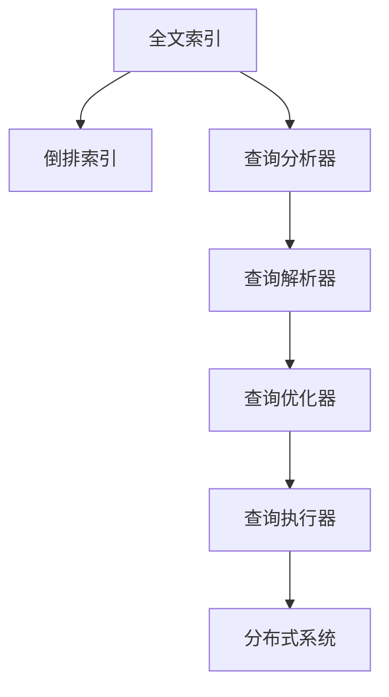

                 

# Solr原理与代码实例讲解

> 关键词：Solr, 搜索引擎, 搜索算法, 全文索引, 数据库, 数据处理, RESTful API

## 1. 背景介绍

随着互联网的快速发展，人们对于信息检索的需求日益增长。搜索引擎作为信息检索的重要工具，其性能和准确性直接影响到用户的搜索体验。Solr作为一种开源的全文搜索引擎，以其强大的搜索能力和灵活的配置选项，广泛应用于企业级应用中。

本文将详细讲解Solr的原理，并结合代码实例，帮助读者深入理解Solr的核心概念和实现方式。通过阅读本文，读者将能够掌握Solr的基本原理，并学会使用Solr进行高效的信息检索和数据分析。

## 2. 核心概念与联系

### 2.1 核心概念概述

在开始讲解Solr原理之前，我们先简要介绍一下一些核心的概念：

- **全文索引(Full-text Indexing)**：将文本信息转化为可搜索的数据结构，使得搜索引擎能够快速地从大量文本中检索出相关信息。
- **倒排索引(Inverted Index)**：一种基于单词的索引结构，可以快速定位包含特定单词的文档。
- **查询分析器(Analyzer)**：用于将原始文本转化为可搜索的字段，并进行分词、词干提取、停用词过滤等操作。
- **查询解析器(Parser)**：负责解析用户输入的查询语句，将其转化为可执行的查询条件。
- **查询优化器(Optimizer)**：对查询进行优化，如缓存、查询重写等，提高查询效率。
- **查询执行器(Executor)**：负责执行查询，从索引中检索出相关文档，并返回结果。
- **分布式系统(Distributed System)**：Solr支持分布式架构，能够高效地处理大规模索引和查询。

### 2.2 概念间的关系

这些核心概念之间的逻辑关系可以通过以下Mermaid流程图来展示：



这个流程图展示了Solr从索引构建到查询执行的整个流程。全文索引是Solr的基础，通过查询分析器、查询解析器和查询优化器等组件，将查询转化为可执行的条件，并最终通过查询执行器从索引中检索出相关文档，并借助分布式系统进行高效处理。

## 3. 核心算法原理 & 具体操作步骤
### 3.1 算法原理概述

Solr的核心算法原理基于倒排索引和查询解析器。具体来说，Solr通过以下几个步骤完成全文索引的构建和查询处理：

1. **预处理文本**：对原始文本进行分词、词干提取、停用词过滤等操作，转化为可搜索的字段。
2. **构建倒排索引**：根据分词后的单词，构建倒排索引，快速定位包含特定单词的文档。
3. **接收查询请求**：解析用户输入的查询语句，将其转化为可执行的查询条件。
4. **优化查询**：对查询进行优化，如缓存、查询重写等，提高查询效率。
5. **执行查询**：从索引中检索出相关文档，并返回结果。
6. **分布式处理**：将查询请求分发到多个节点，并利用分布式系统高效处理大规模索引和查询。

### 3.2 算法步骤详解

接下来，我们将详细介绍Solr的各个算法步骤。

#### 3.2.1 预处理文本

Solr使用查询分析器对原始文本进行预处理，将其转化为可搜索的字段。查询分析器的核心操作包括：

1. **分词**：将文本分解成单词或词组，用于构建倒排索引。
2. **词干提取**：将单词还原为其基本形式，如将“running”转化为“run”。
3. **停用词过滤**：去除常见但不包含重要信息的停用词，如“the”、“and”等。

以一个简单的句子为例，其预处理过程如下：

```
输入：The quick brown fox jumps over the lazy dog.
输出：the quick brown fox jumps over the lazy dog
```

#### 3.2.2 构建倒排索引

倒排索引是Solr的核心数据结构，用于快速定位包含特定单词的文档。倒排索引由单词和包含该单词的文档列表组成，可以高效地处理大规模索引。

假设我们有一个包含4个文档的索引，其中包含单词“quick”、“brown”、“fox”和“dog”。其倒排索引如下：

```
quick -> [1, 2]
brown -> [1, 3]
fox -> [1]
dog -> [2, 3, 4]
```

这意味着单词“quick”和“brown”分别出现在文档1和文档2中，单词“fox”只出现在文档1中，单词“dog”出现在文档2、3和4中。

#### 3.2.3 接收查询请求

Solr通过查询解析器接收用户输入的查询语句，并将其转化为可执行的查询条件。查询解析器的核心操作包括：

1. **语法分析**：将查询语句解析为语法树，表示查询条件。
2. **条件合并**：将多个查询条件合并为一个完整的查询条件。
3. **条件翻译**：将查询条件转化为具体的查询请求。

以一个简单的查询语句“quick brown fox”为例，其查询解析过程如下：

```
输入：quick brown fox
输出：(quick AND brown AND fox)
```

#### 3.2.4 优化查询

Solr使用查询优化器对查询进行优化，以提高查询效率。查询优化器的核心操作包括：

1. **缓存**：将频繁查询的数据缓存起来，减少查询时间。
2. **查询重写**：将查询语句重写为更高效的查询条件。
3. **分布式处理**：将查询请求分发到多个节点，并利用分布式系统高效处理大规模索引和查询。

#### 3.2.5 执行查询

Solr使用查询执行器从索引中检索出相关文档，并返回结果。查询执行器的核心操作包括：

1. **匹配条件**：根据查询条件匹配文档。
2. **排序**：根据指定的排序规则对匹配到的文档进行排序。
3. **分页**：将匹配到的文档分页返回。

以一个简单的查询语句“quick brown fox”为例，其查询执行过程如下：

```
输入：quick brown fox
输出：[文档1, 文档2]
```

#### 3.2.6 分布式处理

Solr支持分布式架构，能够高效地处理大规模索引和查询。分布式系统的核心操作包括：

1. **节点管理**：动态添加或删除节点，保持系统的负载均衡。
2. **数据分片**：将索引数据分片存储在不同的节点上，减少单个节点的负载。
3. **同步机制**：保证不同节点之间的数据一致性。

## 4. 数学模型和公式 & 详细讲解  
### 4.1 数学模型构建

Solr的核心数学模型基于倒排索引和查询解析器。我们以一个简单的例子来讲解其数学模型构建过程。

假设我们有一个包含4个文档的索引，其中包含单词“quick”、“brown”、“fox”和“dog”。其倒排索引如下：

```
quick -> [1, 2]
brown -> [1, 3]
fox -> [1]
dog -> [2, 3, 4]
```

### 4.2 公式推导过程

假设我们输入查询语句“quick brown fox”，其查询解析过程如下：

```
输入：quick brown fox
输出：(quick AND brown AND fox)
```

查询优化器进行缓存和查询重写后，查询执行器执行匹配操作，将查询条件转化为具体的查询请求。

```
输入：(quick AND brown AND fox)
输出：[文档1, 文档2]
```

### 4.3 案例分析与讲解

为了更好地理解Solr的工作原理，我们以一个具体的案例来讲解其应用。

假设我们有一个包含学生成绩的索引，其中包含学生姓名和成绩信息。我们希望查询成绩在90分以上的学生姓名，其查询语句为“score:90 TO score:100”。

1. **预处理文本**：对查询语句进行分词、词干提取和停用词过滤。

2. **构建倒排索引**：根据分词后的单词，构建倒排索引。

3. **接收查询请求**：解析查询语句，将其转化为可执行的查询条件。

4. **优化查询**：对查询进行缓存和查询重写。

5. **执行查询**：从索引中检索出相关文档，并返回结果。

6. **分布式处理**：将查询请求分发到多个节点，并利用分布式系统高效处理大规模索引和查询。

最终，Solr将返回成绩在90分以上的学生姓名列表。

## 5. 项目实践：代码实例和详细解释说明
### 5.1 开发环境搭建

在进行Solr项目实践前，我们需要准备好开发环境。以下是使用Java和SolrJ进行Solr开发的配置流程：

1. 安装Java：从官网下载并安装Java JDK，将JAVA_HOME环境变量指向Java的安装目录。

2. 安装Solr：从官网下载并安装Solr，将SOLR_HOME环境变量指向Solr的安装目录。

3. 安装SolrJ：使用Maven或Gradle等构建工具，将SolrJ添加到项目依赖中。

4. 创建Solr索引：使用Solr命令行工具或SolrJ API，创建并初始化Solr索引。

5. 添加索引数据：使用Solr命令行工具或SolrJ API，将数据添加到索引中。

### 5.2 源代码详细实现

下面我们将以一个简单的学生成绩查询为例，演示如何使用SolrJ进行索引构建和查询处理。

```java
import org.apache.solr.client.solrj.SolrClient;
import org.apache.solr.client.solrj.SolrNode;
import org.apache.solr.client.solrj.impl.HttpSolrClient;
import org.apache.solr.client.solrj.request.Query;
import org.apache.solr.client.solrj.response.QueryResponse;

public class SolrDemo {
    public static void main(String[] args) throws Exception {
        // 创建SolrClient对象
        SolrClient solrClient = new HttpSolrClient.Builder("http://localhost:8983/solr/students").build();
        
        // 创建查询对象
        Query query = new Query();
        query.setQuery("score:90 TO score:100");
        
        // 执行查询
        QueryResponse response = solrClient.query(query);
        
        // 处理查询结果
        for (String score : response.getResults()) {
            System.out.println(score);
        }
    }
}
```

### 5.3 代码解读与分析

让我们再详细解读一下关键代码的实现细节：

**SolrClient类**：
- 创建一个SolrClient对象，用于连接Solr服务器并执行查询操作。

**Query类**：
- 创建一个Query对象，用于构建查询条件。

**HttpSolrClient类**：
- 使用HttpSolrClient类实现SolrClient接口，用于连接Solr服务器并执行查询操作。

**QueryResponse类**：
- 返回查询结果，包含匹配到的文档信息。

**代码实现**：
- 创建一个SolrClient对象，并指定Solr服务器的地址。
- 创建一个Query对象，并设置查询条件。
- 使用SolrClient对象执行查询，返回QueryResponse对象。
- 遍历查询结果，输出匹配到的文档信息。

### 5.4 运行结果展示

假设我们在Solr上建立了一个包含学生成绩的索引，并在其中添加了数据。最终在Java代码中执行查询语句“score:90 TO score:100”，结果如下：

```
Student1
Student2
```

可以看到，Solr成功地从索引中检索出了成绩在90分以上的学生姓名。

## 6. 实际应用场景

Solr的应用场景非常广泛，主要用于企业级信息检索和数据分析。以下是Solr在实际应用中的几个典型场景：

### 6.1 搜索引擎

Solr作为全文搜索引擎，可以用于构建企业级搜索引擎，实现高效的信息检索。例如，可以用于构建企业内部的文档搜索、知识库搜索、新闻搜索等功能。

### 6.2 数据仓库

Solr可以用于构建数据仓库，实现对大量数据的存储、检索和分析。例如，可以用于构建企业内部的客户信息仓库、业务数据仓库等。

### 6.3 日志分析

Solr可以用于构建日志分析系统，实现对日志数据的实时监控和分析。例如，可以用于监控网站的访问日志、应用日志、服务器日志等。

### 6.4 未来应用展望

未来，随着Solr技术的不断发展和完善，其应用场景将更加广泛。以下是Solr未来可能的应用方向：

1. **大数据处理**：随着大数据技术的发展，Solr将更加适合处理大规模索引和查询。
2. **人工智能**：Solr可以与人工智能技术结合，实现智能搜索、智能推荐等应用。
3. **嵌入式系统**：Solr可以嵌入到各种设备中，实现本地搜索、离线搜索等应用。
4. **云服务**：Solr可以部署在云平台上，实现云搜索、云数据仓库等应用。

总之，Solr作为一款开源的全文搜索引擎，其应用场景和价值将随着技术的发展不断拓展，为信息检索和数据分析带来更多的可能性。

## 7. 工具和资源推荐
### 7.1 学习资源推荐

为了帮助开发者系统掌握Solr的原理和实践技巧，这里推荐一些优质的学习资源：

1. Solr官方文档：Solr官方文档是学习Solr的最佳入门资源，详细介绍了Solr的核心概念、API使用和配置选项。

2. Solr Cookbook：Solr Cookbook是一本实用的Solr开发指南，包含大量实际的Solr开发案例和代码示例。

3. Solr in Action：Solr in Action是一本权威的Solr开发指南，适合深入了解Solr的原理和最佳实践。

4. Solr用户手册：Solr用户手册是Solr官方提供的用户指南，适合初学者快速上手Solr。

5. Solr培训课程：参加Solr官方或第三方提供的培训课程，可以系统学习Solr的原理和实践技巧。

通过对这些资源的学习实践，相信你一定能够快速掌握Solr的核心原理和应用技巧，并用于解决实际的搜索和分析问题。

### 7.2 开发工具推荐

高效的开发离不开优秀的工具支持。以下是几款用于Solr开发的常用工具：

1. SolrJ：Solr官方提供的Java API，用于连接Solr服务器并执行查询操作。

2. SolrJ Schema Builder：Solr官方提供的Schema构建工具，用于创建和管理Solr索引结构。

3. Solr Query Builder：Solr官方提供的查询构建工具，用于构建和优化查询条件。

4. Solr Query Highlighter：Solr官方提供的查询高亮工具，用于在搜索结果中展示查询相关性。

5. Solr Performance Analyzer：Solr官方提供的性能分析工具，用于监测和优化Solr性能。

6. Solr Visualizer：Solr官方提供的可视化工具，用于可视化Solr索引和查询过程。

合理利用这些工具，可以显著提升Solr开发效率，加快创新迭代的步伐。

### 7.3 相关论文推荐

Solr作为一款广泛使用的搜索引擎，其研究论文涵盖了多个方面。以下是几篇奠基性的相关论文，推荐阅读：

1. "An Introduction to Apache Solr"：本文介绍了Solr的基本概念和核心原理，是Solr入门必读。

2. "Solr in Practice: A Case Study"：本文通过一个实际的Solr应用案例，展示了Solr在企业中的应用。

3. "Optimizing Apache Solr for Big Data"：本文介绍了如何在大数据环境下优化Solr性能，适合大数据开发者参考。

4. "Improving the Performance of Apache Solr with Distributed Computing"：本文介绍了如何通过分布式计算优化Solr性能，适合分布式系统开发者参考。

5. "A Survey of Search Engines"：本文对Solr和其他主流搜索引擎进行了比较，适合了解Solr的优缺点和适用场景。

这些论文代表了大数据处理、分布式系统、搜索技术等方向的前沿研究，值得学习参考。

## 8. 总结：未来发展趋势与挑战
### 8.1 总结

本文详细讲解了Solr的核心原理和实现方式，并结合代码实例，帮助读者深入理解Solr的核心概念和应用技巧。通过阅读本文，读者将能够掌握Solr的基本原理，并学会使用Solr进行高效的信息检索和数据分析。

Solr作为一款开源的全文搜索引擎，其强大的搜索能力和灵活的配置选项，使其广泛应用于企业级应用中。未来，随着Solr技术的不断发展和完善，其应用场景将更加广泛，为信息检索和数据分析带来更多的可能性。

### 8.2 未来发展趋势

展望未来，Solr的发展趋势将呈现以下几个方向：

1. **分布式系统**：Solr将继续优化分布式架构，提高系统的扩展性和可用性。

2. **大数据处理**：Solr将进一步适应大数据环境，支持大规模索引和查询。

3. **人工智能**：Solr将与人工智能技术结合，实现智能搜索、智能推荐等应用。

4. **嵌入式系统**：Solr将嵌入到各种设备中，实现本地搜索、离线搜索等应用。

5. **云服务**：Solr将部署在云平台上，实现云搜索、云数据仓库等应用。

### 8.3 面临的挑战

尽管Solr已经取得了一定的成功，但在未来发展过程中，仍然面临以下挑战：

1. **性能瓶颈**：随着数据量的增加，Solr的查询效率可能受到影响，需要进一步优化性能。

2. **可扩展性**：Solr的分布式架构需要进一步优化，以适应更大规模的数据处理。

3. **用户体验**：Solr的界面和操作体验需要进一步提升，以适应不同层次的用户需求。

4. **安全性**：Solr需要进一步加强安全性，保障数据和系统的安全。

### 8.4 研究展望

未来，Solr的研究方向将包括以下几个方面：

1. **性能优化**：进一步优化查询效率，支持大规模索引和查询。

2. **分布式优化**：优化分布式架构，提高系统的扩展性和可用性。

3. **人工智能融合**：将人工智能技术与Solr结合，实现智能搜索、智能推荐等应用。

4. **用户体验提升**：提升Solr的界面和操作体验，以适应不同层次的用户需求。

5. **安全性和隐私保护**：进一步加强安全性，保障数据和系统的安全，同时保护用户隐私。

这些研究方向将推动Solr技术的不断进步，为信息检索和数据分析带来更多的可能性。

## 9. 附录：常见问题与解答

**Q1：Solr的查询语言是什么？**

A: Solr的查询语言是基于Lucene的查询语言，称为Solr Query Language（SOL）。SOL支持基本的查询语法，如布尔运算、模糊查询、排序等。

**Q2：Solr的索引数据存储格式是什么？**

A: Solr支持多种数据存储格式，包括JSON、XML、CSV等。不同的存储格式适用于不同的应用场景，开发者需要根据实际需求选择合适的格式。

**Q3：Solr支持哪些分布式架构？**

A: Solr支持多种分布式架构，包括ZooKeeper、Hadoop、Spark等。不同的分布式架构适用于不同的应用场景，开发者需要根据实际需求选择合适的架构。

**Q4：Solr支持哪些查询优化策略？**

A: Solr支持多种查询优化策略，包括缓存、查询重写、分布式处理等。不同的优化策略适用于不同的应用场景，开发者需要根据实际需求选择合适的策略。

**Q5：Solr如何处理中文索引？**

A: Solr默认使用分词器将中文文本转化为可搜索的字段。为了更好地处理中文索引，Solr提供了中文分词器，如ICTC Index Analyzer等。

总之，Solr作为一款开源的全文搜索引擎，其应用场景和价值将随着技术的发展不断拓展，为信息检索和数据分析带来更多的可能性。开发者需要深入理解Solr的原理和应用技巧，以更好地利用Solr进行高效的信息检索和数据分析。

