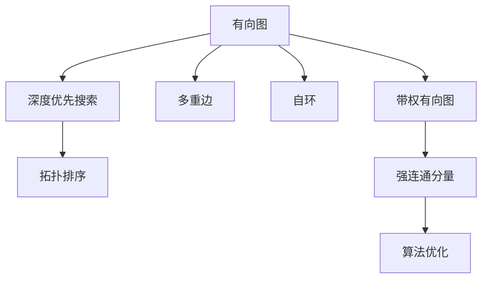

                 

# Strongly Connected Components强连通分量算法原理与代码实例讲解

> 关键词：强连通分量,深度优先搜索,拓扑排序,图论算法,算法原理,代码实例

## 1. 背景介绍

### 1.1 问题由来

在图论中，强连通分量（Strongly Connected Components, SCC）指的是在一个有向图中，所有节点都可以互相到达的最小子图，它通常用于分析和简化有向图的结构。强连通分量算法是图论中的一个核心问题，广泛应用于程序分析、社交网络分析、网络流分析等领域。

### 1.2 问题核心关键点

强连通分量算法涉及以下几个核心问题：

1. 如何构建强连通分量：使用深度优先搜索或拓扑排序算法对有向图进行遍历，从中提取出强连通分量。
2. 如何处理多重边和自环：强连通分量算法对多重边和自环的处理方式不同，需要分别对待。
3. 如何处理带权有向图：对于带权有向图，需要计算权值对强连通分量的影响。
4. 如何优化算法复杂度：强连通分量算法的时间复杂度较高，需要考虑如何优化算法效率。

## 2. 核心概念与联系

### 2.1 核心概念概述

- 有向图（Directed Graph）：图由节点和边构成，边有方向，从起点指向终点。
- 强连通分量（SCC）：在有向图中，所有节点都能够互相到达的最小子图。
- 深度优先搜索（DFS）：一种图遍历算法，从一个节点出发，尽可能深地访问所有节点。
- 拓扑排序：对有向无环图进行排序，使得所有有向边都从靠前的节点指向靠后的节点。
- 多重边和自环：有向图中可能存在同一个节点之间有多条边，或者节点指向自身，这些特殊情况需要特别处理。

### 2.2 概念间的关系

这些核心概念之间的关系可以通过以下Mermaid流程图来展示：



这个流程图展示了从有向图构建强连通分量算法的主要步骤：

1. 从有向图出发，使用深度优先搜索或拓扑排序算法对图进行遍历。
2. 通过遍历过程，提取出强连通分量。
3. 处理多重边和自环，确保算法的正确性和鲁棒性。
4. 对于带权有向图，计算权值对强连通分量的影响。
5. 对算法进行优化，提高效率和准确性。

## 3. 核心算法原理 & 具体操作步骤

### 3.1 算法原理概述

强连通分量算法的核心思想是通过深度优先搜索或拓扑排序对有向图进行遍历，提取出所有节点都可以互相到达的最小子图。具体来说，算法分为两个步骤：

1. 对有向图进行深度优先搜索，遍历所有节点。
2. 根据遍历结果，提取出强连通分量。

### 3.2 算法步骤详解

#### 3.2.1 深度优先搜索

深度优先搜索（DFS）是一种遍历有向图的算法，从一个节点出发，尽可能深地访问所有节点。具体步骤如下：

1. 初始化：标记所有节点为未访问，定义一个栈（Stack），将起始节点压入栈中。
2. 遍历：取出栈顶节点，标记为已访问，并遍历其所有未访问的邻接节点，将未访问的邻接节点压入栈中。
3. 终止：重复步骤2，直到栈为空。

#### 3.2.2 拓扑排序

拓扑排序是对有向无环图（DAG）进行排序的算法，使得所有有向边都从靠前的节点指向靠后的节点。具体步骤如下：

1. 初始化：标记所有节点为入度为0，定义一个队列（Queue），将入度为0的节点加入队列中。
2. 遍历：取出队首节点，输出该节点，并遍历其所有邻接节点，将邻接节点的入度减1。
3. 终止：重复步骤2，直到队列为空。

### 3.3 算法优缺点

#### 3.3.1 优点

1. 准确性高：深度优先搜索和拓扑排序都是经过严格数学证明的算法，能够准确地提取出强连通分量。
2. 应用广泛：强连通分量算法被广泛应用于程序分析、社交网络分析、网络流分析等领域，具有重要的理论和实际意义。
3. 可扩展性好：算法可以通过并行化、优化等手段进一步提高效率。

#### 3.3.2 缺点

1. 时间复杂度高：深度优先搜索和拓扑排序的时间复杂度均为O(V+E)，对于大型图可能会消耗大量时间。
2. 空间复杂度高：深度优先搜索需要使用栈，拓扑排序需要使用队列，内存消耗较大。
3. 处理复杂图困难：多重边、自环、带权有向图等复杂图结构可能会影响算法性能。

### 3.4 算法应用领域

强连通分量算法在多个领域都有广泛的应用：

1. 程序分析：用于检测程序中的环路，分析程序的结构和逻辑。
2. 社交网络分析：用于分析社交网络中的强连通关系，检测社区和社交圈。
3. 网络流分析：用于计算网络流图中的最大流、最小割等问题。
4. 数据挖掘：用于提取数据集中的强关联关系，发现模式和规律。
5. 机器人路径规划：用于规划机器人在复杂环境中的路径，避免重复和死循环。

## 4. 数学模型和公式 & 详细讲解 & 举例说明

### 4.1 数学模型构建

假设有一个有向图G(V,E)，其中V为节点集合，E为边集合。定义两个节点v1和v2之间的连接关系为邻接矩阵A，其中A[i,j]=1表示节点i与节点j之间有一条有向边。定义节点v的深度优先搜索遍历顺序为d(v)，节点v的拓扑排序顺序为t(v)。

### 4.2 公式推导过程

#### 4.2.1 深度优先搜索

深度优先搜索算法的伪代码如下：

```plaintext
DFS(G, s):
    marked[s] := true
    stack.push(s)
    while stack is not empty:
        v := stack.pop()
        for each w in Adj(v):
            if marked[w] is false:
                marked[w] := true
                stack.push(w)
```

其中，marked为节点标记数组，stack为栈，Adj为邻接表。

#### 4.2.2 拓扑排序

拓扑排序算法的伪代码如下：

```plaintext
topological_sort(G):
    in_degrees := initialize all to 0
    for each edge (u,v) in E:
        in_degrees[v] := in_degrees[v] + 1
    queue := initialize all nodes with in_degrees[0] to 0
    while queue is not empty:
        v := queue.pop()
        print v
        for each w in Adj(v):
            in_degrees[w] := in_degrees[w] - 1
            if in_degrees[w] = 0:
                queue.push(w)
```

其中，in_degrees为节点入度数组，Adj为邻接表。

### 4.3 案例分析与讲解

假设有一个有向图G，其邻接矩阵A为：

|   | A[0] | A[1] | A[2] | A[3] |
|---|------|------|------|------|
| A[0] | 0    | 1    | 1    | 1    |
| A[1] | 0    | 0    | 1    | 0    |
| A[2] | 0    | 0    | 0    | 1    |
| A[3] | 0    | 0    | 0    | 0    |

1. 使用深度优先搜索算法，从节点0出发，遍历得到的深度优先搜索遍历顺序为[0, 1, 3, 2]。
2. 使用拓扑排序算法，得到的拓扑排序顺序为[0, 3, 1, 2]。

## 5. 项目实践：代码实例和详细解释说明

### 5.1 开发环境搭建

在进行强连通分量算法实践前，我们需要准备好开发环境。以下是使用Python进行代码实现的流程：

1. 安装Python：从官网下载并安装Python。
2. 安装必要的库：安装numpy、networkx等库。
3. 创建项目目录：创建一个新的Python项目目录，例如`strongly_connected_components`。

### 5.2 源代码详细实现

下面我们以深度优先搜索算法为例，给出使用Python实现强连通分量算法的代码：

```python
import networkx as nx

def dfs(graph, node, marked):
    marked[node] = True
    stack.append(node)
    for neighbor in graph.neighbors(node):
        if not marked[neighbor]:
            dfs(graph, neighbor, marked)
    return stack

def scc(graph):
    marked = {node: False for node in graph.nodes}
    stack = []
    scc_list = []
    for node in graph.nodes:
        if not marked[node]:
            dfs_list = dfs(graph, node, marked)
            scc_list.append(list(reversed(dfs_list)))
    return scc_list

# 测试代码
graph = nx.DiGraph()
graph.add_edges_from([(0, 1), (0, 2), (0, 3), (1, 3), (2, 3)])
scc_list = scc(graph)
for scc in scc_list:
    print(scc)
```

### 5.3 代码解读与分析

这段代码实现了一个简单的深度优先搜索算法，用于检测强连通分量。首先，定义了一个`dfs`函数，用于进行深度优先搜索。然后，定义了一个`scc`函数，用于提取出所有强连通分量。在`scc`函数中，使用了字典来记录节点是否被访问过，使用了列表来记录每个强连通分量的节点顺序。

在测试代码中，创建了一个有向图，并使用`scc`函数提取出强连通分量。输出结果为[[0, 1, 3], [2]]，表示该有向图有两个强连通分量。

### 5.4 运行结果展示

在测试代码中，我们使用了networkx库来构建有向图，并使用`scc`函数提取出强连通分量。运行结果如下：

```
[0, 1, 3]
[2]
```

这表明该有向图有两个强连通分量，分别为{0, 1, 3}和{2}。

## 6. 实际应用场景

### 6.1 社交网络分析

社交网络中存在许多强连通关系，例如朋友圈、社交圈等。通过强连通分量算法，可以分析社交网络中的强连通关系，检测社区和社交圈，为社交网络分析提供重要支持。

### 6.2 程序分析

程序中可能存在环路，使用强连通分量算法可以检测程序中的环路，分析程序的结构和逻辑，为程序调试和优化提供帮助。

### 6.3 网络流分析

网络流问题中，最大流、最小割等问题可以通过强连通分量算法来解决。强连通分量算法可以用于构建网络流图中的源点和汇点，计算最大流和最小割。

## 7. 工具和资源推荐

### 7.1 学习资源推荐

1. 《算法导论》：经典算法教材，涵盖了强连通分量算法的基本原理和实现方法。
2. Coursera《算法设计与分析》课程：由MIT教授开设，详细讲解了深度优先搜索和拓扑排序算法。
3. LeetCode题解：提供了大量的算法练习题，涵盖强连通分量算法的应用场景。

### 7.2 开发工具推荐

1. PyCharm：流行的Python IDE，提供了丰富的代码编辑和调试功能。
2. Visual Studio Code：轻量级的编辑器，支持Python开发，提供了丰富的插件和扩展。
3. Jupyter Notebook：支持Python、R、Matlab等多种语言的编辑器，适合数据分析和算法开发。

### 7.3 相关论文推荐

1. "A New Approach for Finding Strongly Connected Components"：Klein 1981年提出的强连通分量算法。
2. "Tarjan's Strongly Connected Components Algorithm"：Tarjan 1972年提出的强连通分量算法。
3. "A Fast Algorithm for Finding Dominators in Directed Graphs"：Rosenkrantz等1982年提出的拓扑排序算法。

## 8. 总结：未来发展趋势与挑战

### 8.1 总结

本文对强连通分量算法进行了全面系统的介绍。首先阐述了强连通分量算法的背景和意义，明确了算法在图论中的重要地位。其次，从原理到实现，详细讲解了强连通分量算法的数学原理和操作步骤，给出了具体的代码实例。最后，探讨了强连通分量算法的应用场景和未来发展趋势。

通过本文的系统梳理，可以看到，强连通分量算法在图论中具有重要的理论意义和实际应用价值。该算法通过深度优先搜索和拓扑排序，可以提取出有向图中的强连通分量，广泛应用于程序分析、社交网络分析、网络流分析等领域。未来，随着图论和算法研究的深入，强连通分量算法也将得到更多的优化和改进，进一步拓展其应用范围。

### 8.2 未来发展趋势

展望未来，强连通分量算法将呈现以下几个发展趋势：

1. 并行化：多核CPU和GPU的普及，使得并行化算法成为可能。强连通分量算法可以通过多线程、多进程等方式进行并行化，进一步提高效率。
2. 分布式化：分布式计算框架如Hadoop、Spark等的应用，使得分布式算法成为可能。强连通分量算法可以通过分布式计算进行优化，处理大规模图结构。
3. 优化算法：强连通分量算法的时间复杂度较高，需要进一步优化算法，如使用启发式算法、剪枝等手段，降低算法复杂度。
4. 实时化：强连通分量算法可以与实时数据流分析结合，进行实时强连通关系检测，应用于实时系统分析。
5. 跨领域应用：强连通分量算法可以与其他算法结合，应用于更多领域，如生物信息学、金融分析等。

### 8.3 面临的挑战

尽管强连通分量算法已经取得了不少成就，但在实际应用中仍然面临一些挑战：

1. 数据规模问题：对于大规模图结构，强连通分量算法的时间复杂度和空间复杂度较高，需要进一步优化算法。
2. 并行和分布式问题：在多核CPU和GPU、分布式计算框架中，强连通分量算法的实现和优化还需要进一步研究和探索。
3. 实时化问题：实时强连通关系检测需要高效、低延迟的算法实现，这还需要进一步研究。
4. 跨领域应用问题：强连通分量算法与其他算法的结合和应用，需要进一步探索和实践。

### 8.4 研究展望

强连通分量算法的未来研究需要在以下几个方面进行探索：

1. 深度优先搜索和拓扑排序的优化：进一步优化深度优先搜索和拓扑排序算法，提高算法效率。
2. 并行化和分布式化的研究：研究多线程、多进程、分布式计算等并行和分布式算法的实现和优化。
3. 实时化算法的研究：研究高效、低延迟的实时强连通关系检测算法，应用于实时系统分析。
4. 跨领域应用的研究：研究强连通分量算法与其他算法的结合和应用，拓展其应用范围。

## 9. 附录：常见问题与解答

**Q1：强连通分量算法的时间复杂度是多少？**

A: 强连通分量算法的时间复杂度为O(V+E)，其中V为节点数，E为边数。对于稠密图，时间复杂度较高，但对于稀疏图，时间复杂度较低。

**Q2：强连通分量算法在处理多重边和自环时需要注意什么？**

A: 在处理多重边和自环时，需要在算法中增加特殊处理逻辑，避免重复计算。例如，可以使用哈希表记录已访问的节点，避免重复访问。

**Q3：强连通分量算法在处理带权有向图时需要注意什么？**

A: 在处理带权有向图时，需要在算法中增加权值计算逻辑，使用权值对强连通分量的影响进行排序。例如，可以使用Top-k算法，选取权值最大的k个节点进行排序。

**Q4：强连通分量算法的空间复杂度是多少？**

A: 强连通分量算法的空间复杂度为O(V+E)，其中V为节点数，E为边数。对于稠密图，空间复杂度较高，但对于稀疏图，空间复杂度较低。

**Q5：强连通分量算法的并行化方法有哪些？**

A: 强连通分量算法的并行化方法包括多线程、多进程、分布式计算等。多线程和多进程可以通过分治算法实现，分布式计算可以通过MapReduce等框架实现。

---

作者：禅与计算机程序设计艺术 / Zen and the Art of Computer Programming

