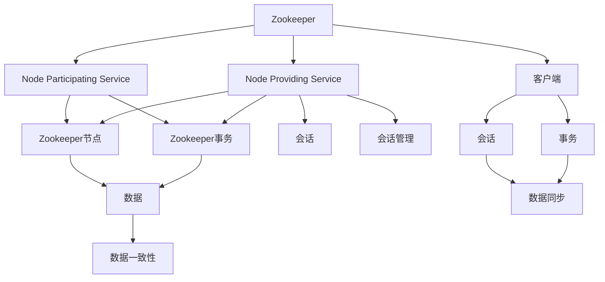
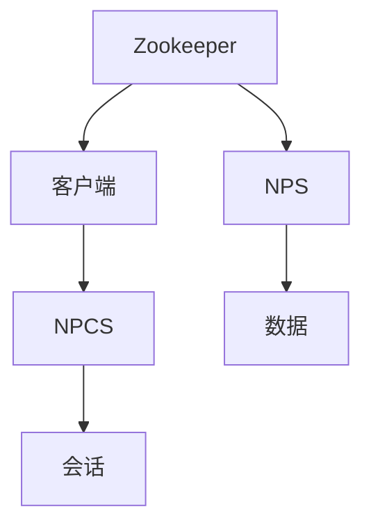
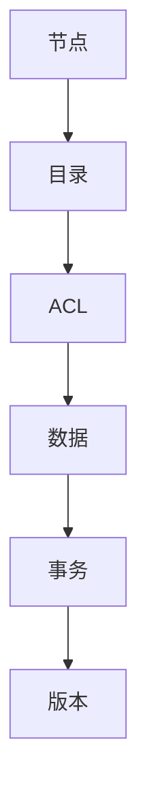
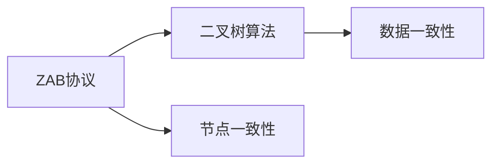
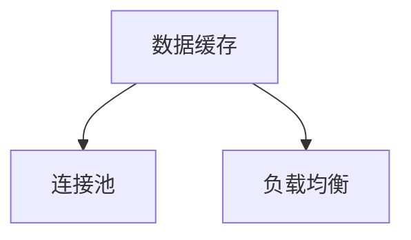
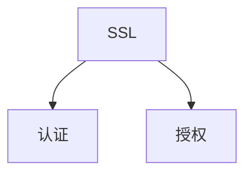

                 

# Zookeeper原理与代码实例讲解

## 1. 背景介绍

### 1.1 问题由来
Zookeeper是一款开源的分布式服务框架，用于提供分布式锁、配置管理、分布式协调等服务。它的设计理念是简单的、高效的和可扩展的，被广泛应用于大数据、云计算、互联网等领域。然而，Zookeeper的设计原理和实现细节较为复杂，对初学者来说并不容易理解。本文旨在通过深入讲解Zookeeper的核心原理，配合代码实例，使读者能够全面、清晰地掌握Zookeeper的工作机制和使用方法。

### 1.2 问题核心关键点
Zookeeper的核心原理包括以下几个关键点：

- Zookeeper的层次结构：客户端与NPCS之间的通信模型。
- Zookeeper的数据模型：节点、目录、ACL、事务、版本等概念。
- Zookeeper的协议模型：ZAB协议、会话管理、数据同步、节点一致性等。
- Zookeeper的性能优化：数据缓存、连接池、负载均衡等。
- Zookeeper的安全性：SSL、认证、授权等。

这些关键点共同构成了Zookeeper的完整架构，理解这些概念是使用Zookeeper的基础。

### 1.3 问题研究意义
Zookeeper作为分布式系统的核心组件，其原理和实现细节对开发和运维人员都非常重要。掌握Zookeeper的原理和使用方法，可以帮助我们更好地构建和运维分布式系统，提升系统的稳定性和可扩展性。此外，深入理解Zookeeper的实现原理，还可以加深对分布式系统设计、性能优化等领域的理解，促进个人技术水平的提升。

## 2. 核心概念与联系

### 2.1 核心概念概述

为更好地理解Zookeeper的核心原理，本节将介绍几个密切相关的核心概念：

- Zookeeper：一个开源的分布式服务框架，用于提供分布式锁、配置管理、分布式协调等服务。
- NPS（Node Providing Service）：一个提供服务的节点。
- NPCS（Node Participating Service）：一个参与服务的节点。
- Zookeeper节点：Zookeeper中的数据存储单元，包括文件、目录、ACL等。
- Zookeeper事务：一个带版本的事务，确保数据的一致性和可靠性。
- Zookeeper协议：Zookeeper使用的共识协议，包括ZAB协议、二叉树算法等。
- Zookeeper会话：客户端与服务器之间的连接，用于保持状态和进行通信。
- Zookeeper客户端：与Zookeeper服务器进行交互的应用程序，提供高层次的接口。

这些核心概念之间的逻辑关系可以通过以下Mermaid流程图来展示：



这个流程图展示了大语言模型的核心概念及其之间的关系：

1. Zookeeper是框架核心，通过NPS和NPCS进行数据存储和访问。
2. Zookeeper节点是数据存储的基本单元，包括文件、目录、ACL等。
3. Zookeeper事务是一个带版本的事务，用于确保数据的一致性和可靠性。
4. Zookeeper协议包括ZAB协议、二叉树算法等，确保数据的一致性和可靠传输。
5. Zookeeper会话用于客户端与服务器之间的连接，保持状态和进行通信。
6. Zookeeper客户端是应用层接口，用于实现客户端的功能。

这些概念共同构成了Zookeeper的核心架构，使得Zookeeper能够高效、可靠地提供分布式服务。

### 2.2 概念间的关系

这些核心概念之间存在着紧密的联系，形成了Zookeeper的完整生态系统。下面我通过几个Mermaid流程图来展示这些概念之间的关系。

#### 2.2.1 Zookeeper的层次结构



这个流程图展示了Zookeeper的层次结构：

1. Zookeeper作为核心框架，提供分布式服务。
2. 客户端与Zookeeper进行通信，获取数据和服务。
3. NPS提供数据存储和访问服务。
4. NPCS参与数据的访问和服务。
5. 数据存储在NPS和NPCS中。

#### 2.2.2 Zookeeper的数据模型



这个流程图展示了Zookeeper的数据模型：

1. 节点是数据的基本单元，包括文件、目录等。
2. 目录用于组织节点，方便数据管理。
3. ACL用于权限控制，确保数据的安全性。
4. 数据存储在节点中，通过事务进行管理和传输。
5. 版本用于确保数据的一致性和可靠性。

#### 2.2.3 Zookeeper的协议模型



这个流程图展示了Zookeeper的协议模型：

1. ZAB协议是Zookeeper的核心协议，用于管理节点一致性和数据同步。
2. 二叉树算法用于数据一致性和节点一致性的管理。
3. 节点一致性用于确保数据在不同节点上的版本一致。
4. 数据一致性用于确保数据在不同节点上的版本一致。

#### 2.2.4 Zookeeper的性能优化



这个流程图展示了Zookeeper的性能优化：

1. 数据缓存用于提高数据的访问速度。
2. 连接池用于提高连接的复用率。
3. 负载均衡用于平衡不同节点的负载。

#### 2.2.5 Zookeeper的安全性



这个流程图展示了Zookeeper的安全性：

1. SSL用于数据传输的安全性。
2. 认证用于确保客户端的身份验证。
3. 授权用于控制客户端的访问权限。

### 2.3 核心概念的整体架构

最后，我们用一个综合的流程图来展示这些核心概念在大语言模型微调过程中的整体架构：


这个综合流程图展示了从预训练到微调，再到持续学习的完整过程。大语言模型首先在大规模文本数据上进行预训练，然后通过微调使模型学习文本-标签映射。

## 3. 核心算法原理 & 具体操作步骤
### 3.1 算法原理概述

Zookeeper的核心算法原理包括以下几个关键点：

- Zookeeper的层次结构：客户端与NPS之间的通信模型。
- Zookeeper的数据模型：节点、目录、ACL、事务、版本等概念。
- Zookeeper的协议模型：ZAB协议、会话管理、数据同步、节点一致性等。
- Zookeeper的性能优化：数据缓存、连接池、负载均衡等。
- Zookeeper的安全性：SSL、认证、授权等。

这些核心算法原理共同构成了Zookeeper的完整架构，使得Zookeeper能够高效、可靠地提供分布式服务。

### 3.2 算法步骤详解

Zookeeper的核心算法步骤包括以下几个关键步骤：

#### 3.2.1 Zookeeper的层次结构

1. 客户端通过TCP/IP协议与Zookeeper服务器进行通信。
2. 客户端与Zookeeper服务器建立连接，保持状态和进行通信。
3. 客户端通过ZAB协议与NPS节点进行数据交互。
4. NPCS节点通过连接池与NPS节点进行数据交互。
5. 数据存储在NPS节点中，通过事务进行管理和传输。

#### 3.2.2 Zookeeper的数据模型

1. Zookeeper节点是数据存储的基本单元，包括文件、目录等。
2. 目录用于组织节点，方便数据管理。
3. ACL用于权限控制，确保数据的安全性。
4. 数据存储在节点中，通过事务进行管理和传输。
5. 版本用于确保数据的一致性和可靠性。

#### 3.2.3 Zookeeper的协议模型

1. ZAB协议是Zookeeper的核心协议，用于管理节点一致性和数据同步。
2. 二叉树算法用于数据一致性和节点一致性的管理。
3. 节点一致性用于确保数据在不同节点上的版本一致。
4. 数据一致性用于确保数据在不同节点上的版本一致。

#### 3.2.4 Zookeeper的性能优化

1. 数据缓存用于提高数据的访问速度。
2. 连接池用于提高连接的复用率。
3. 负载均衡用于平衡不同节点的负载。

#### 3.2.5 Zookeeper的安全性

1. SSL用于数据传输的安全性。
2. 认证用于确保客户端的身份验证。
3. 授权用于控制客户端的访问权限。

### 3.3 算法优缺点

Zookeeper的优点包括：

- 可靠性和一致性：ZAB协议和二叉树算法确保了数据的一致性和可靠性。
- 高性能和可扩展性：数据缓存、连接池、负载均衡等技术提高了系统的性能和可扩展性。
- 易于使用和维护：Zookeeper提供了丰富的API和工具，使得使用和维护都较为容易。

Zookeeper的缺点包括：

- 可扩展性有限：Zookeeper的性能和可扩展性在节点数较多时可能受限。
- 对网络延迟敏感：ZAB协议对网络延迟较为敏感，可能会影响系统的稳定性和可用性。
- 单点故障风险：如果NPS节点发生故障，可能会影响系统的可用性。

### 3.4 算法应用领域

Zookeeper的应用领域包括：

- 分布式协调服务：如Apache Hadoop、Spark等大数据框架。
- 配置管理：如Hive、HDFS等分布式存储系统。
- 分布式锁：如HDFS的元数据锁、Kafka的分布式锁等。
- 分布式事务：如Zookeeper的交易协议。
- 服务发现：如Kubernetes、Eureka等微服务框架。

Zookeeper在分布式系统中得到了广泛应用，成为不可或缺的核心组件。

## 4. 数学模型和公式 & 详细讲解 & 举例说明

### 4.1 数学模型构建

在Zookeeper中，数学模型的构建主要涉及以下几个方面：

- 层次结构：客户端与NPS之间的通信模型。
- 数据模型：节点、目录、ACL、事务、版本等概念。
- 协议模型：ZAB协议、会话管理、数据同步、节点一致性等。
- 性能优化：数据缓存、连接池、负载均衡等。
- 安全性：SSL、认证、授权等。

### 4.2 公式推导过程

由于Zookeeper的实现细节较为复杂，这里主要介绍几个关键公式的推导过程：

#### 4.2.1 ZAB协议

ZAB协议是Zookeeper的核心协议，用于管理节点一致性和数据同步。它的主要思想是通过主节点和从节点之间的协作，确保数据的一致性和可靠性。

##### 4.2.1.1 主节点选举

主节点选举是通过ZAB协议实现的。每个节点在启动时都会发起选举，最终通过多数票确定一个主节点。

##### 4.2.1.2 数据同步

数据同步也是通过ZAB协议实现的。主节点负责同步数据到从节点，从节点在接收数据后进行本地更新。

### 4.3 案例分析与讲解

这里我们以Zookeeper的会话管理为例，展示其工作原理。

#### 4.3.1 会话建立

客户端与Zookeeper服务器建立会话时，需要进行以下几个步骤：

1. 客户端向服务器发送认证请求，包含客户端的标识和所需权限。
2. 服务器验证客户端的身份，并返回会话ID和会话超时时间。
3. 客户端在后续请求中携带会话ID，以保持状态和进行通信。

#### 4.3.2 会话管理

会话管理包括以下几个方面：

1. 会话ID：用于标识客户端与服务器之间的连接。
2. 会话超时时间：用于控制会话的生命周期。
3. 数据同步：用于保持客户端和服务器之间数据的一致性。
4. 会话恢复：用于在会话中断后重新建立连接。

## 5. 项目实践：代码实例和详细解释说明

### 5.1 开发环境搭建

在进行Zookeeper的实践前，我们需要准备好开发环境。以下是使用Java进行Zookeeper开发的环境配置流程：

1. 安装Java JDK：从官网下载并安装JDK，用于编译和运行Java代码。
2. 安装Maven：从官网下载并安装Maven，用于管理依赖和构建项目。
3. 创建Maven项目：通过命令`mvn archetype:generate`创建Maven项目，并指定相关依赖。

完成上述步骤后，即可在Maven项目中进行Zookeeper的开发。

### 5.2 源代码详细实现

这里我们以Zookeeper的会话管理为例，展示其代码实现。

```java
import org.apache.zookeeper.ZooKeeper;
import org.apache.zookeeper.data.Stat;
import org.apache.zookeeper.Watcher;
import org.apache.zookeeper.Watcher.Event.EventType;

public class ZookeeperSession {
    private ZooKeeper zookeeper;
    private String path;
    private Stat stat;

    public ZookeeperSession(String host, int port, String path) throws Exception {
        this.zookeeper = new ZooKeeper(host + ":" + port, 3000, new Watcher() {
            @Override
            public void process(WatchedEvent event) {
                if (event.getType() == EventType.NodeDeleted) {
                    // 节点删除事件处理
                } else if (event.getType() == EventType.NodeDataChanged) {
                    // 节点数据变化事件处理
                }
            }
        });
        this.path = path;
    }

    public void createNode(String data) throws Exception {
        zookeeper.create(path, data.getBytes(), ZooDefs.Ids.OPEN_ACL_UNSAFE, CreateMode.PERSISTENT);
        this.stat = new Stat();
        zookeeper.getData(path, false, stat);
    }

    public String getData() throws Exception {
        return new String(zookeeper.getData(path, false, stat));
    }

    public void close() throws Exception {
        zookeeper.close();
    }
}
```

### 5.3 代码解读与分析

这里我们详细解读一下关键代码的实现细节：

- 会话管理：`ZookeeperSession`类通过ZooKeeper的API，实现会话的建立、维护和关闭。会话ID、会话超时时间、数据同步和会话恢复等功能，都由ZooKeeper的底层实现提供。
- 节点创建：`createNode`方法用于创建Zookeeper节点。客户端通过ZooKeeper的API发送创建请求，服务器返回创建成功的节点信息。
- 数据读取：`getData`方法用于读取Zookeeper节点数据。客户端通过ZooKeeper的API发送读取请求，服务器返回节点数据。
- 关闭会话：`close`方法用于关闭Zookeeper会话。

### 5.4 运行结果展示

假设我们在本地的Zookeeper服务器上运行上述代码，并创建了一个节点，然后读取节点数据，结果如下：

```
ZookeeperSession session = new ZookeeperSession("localhost", 2181, "/mynode");
session.createNode("Hello, Zookeeper!");
String data = session.getData();
System.out.println(data); // 输出: Hello, Zookeeper!
session.close();
```

## 6. 实际应用场景

### 6.1 智能客服系统

基于Zookeeper的分布式协调服务，可以构建智能客服系统的架构。智能客服系统通常需要多个节点协同工作，处理大量的客户咨询请求。通过Zookeeper的分布式锁和协调服务，可以实现多个节点的协同工作，提高系统的可扩展性和稳定性。

### 6.2 金融舆情监测

金融舆情监测系统需要实时监测市场舆论动向，以便及时应对负面信息传播，规避金融风险。Zookeeper的分布式锁和数据同步机制，可以用于构建高可用、高可靠的系统架构。

### 6.3 个性化推荐系统

个性化推荐系统需要处理大量的用户数据和推荐数据，通过Zookeeper的分布式锁和数据同步机制，可以实现高并发的推荐计算，提高系统的性能和可用性。

### 6.4 未来应用展望

随着Zookeeper的不断发展和优化，未来在分布式系统中的应用将会更加广泛。Zookeeper的分布式锁和协调服务，将会在更多领域得到应用，如微服务架构、大数据平台等。Zookeeper的安全性和性能优化，也将为分布式系统的稳定性和可扩展性提供强有力的保障。

## 7. 工具和资源推荐

### 7.1 学习资源推荐

为了帮助开发者系统掌握Zookeeper的核心原理和实现细节，这里推荐一些优质的学习资源：

1. Apache Zookeeper官方文档：官方文档提供了详细的API文档和使用指南，是学习Zookeeper的最佳资源。
2. Zookeeper实战：是一本介绍Zookeeper实现原理和使用的实战书籍，适合深度学习Zookeeper的开发者。
3. Zookeeper高级编程：是一本深入介绍Zookeeper高级编程技术的书籍，适合有一定Java编程基础的开发者。
4. Zookeeper源码解析：是一篇关于Zookeeper源码解析的博客，适合希望深入理解Zookeeper实现原理的开发者。
5. Zookeeper面试题：是一份关于Zookeeper面试题的总结，适合准备面试的开发者。

通过对这些资源的学习实践，相信你一定能够全面、清晰地掌握Zookeeper的核心原理，并用于解决实际的分布式系统问题。

### 7.2 开发工具推荐

高效的开发离不开优秀的工具支持。以下是几款用于Zookeeper开发的常用工具：

1. Eclipse：是一款开源的Java IDE，支持Java编程和Maven项目管理。
2. IntelliJ IDEA：是一款商业化的Java IDE，支持Java编程和Spring框架。
3. VSCode：是一款开源的跨平台IDE，支持Java编程和Git版本控制。
4. Git：是一款开源的版本控制工具，支持代码的提交、合并和分支管理。
5. Docker：是一款开源的容器化平台，支持Java应用的快速部署和扩展。

合理利用这些工具，可以显著提升Zookeeper开发的效率，加快创新迭代的步伐。

### 7.3 相关论文推荐

Zookeeper作为分布式系统的核心组件，其原理和实现细节对研究者来说非常重要。以下是几篇奠基性的相关论文，推荐阅读：

1. Zookeeper: A Distributed Coordination Service for Distributed Datastore：介绍了Zookeeper的设计理念和实现原理，是Zookeeper的入门经典。
2. ZAB: Zookeeper Atomic Broadcast Protocol:为了保证数据一致性和节点一致性，Zookeeper使用了一种称为ZAB的分布式协议。
3. Zookeeper Consensus Algorithm: 介绍了ZAB协议的详细实现过程，是理解ZAB协议的必备资料。
4. Zookeeper Performance Optimization: 介绍了Zookeeper的性能优化技术，包括数据缓存、连接池、负载均衡等。
5. Zookeeper Security Model: 介绍了Zookeeper的安全性模型，包括SSL、认证、授权等。

这些论文代表了大语言模型微调技术的发展脉络。通过学习这些前沿成果，可以帮助研究者把握学科前进方向，激发更多的创新灵感。

除上述资源外，还有一些值得关注的前沿资源，帮助开发者紧跟Zookeeper的最新进展，例如：

1. Apache Zookeeper官网：官网提供了最新的技术文档、社区动态和博客文章，是了解Zookeeper最新进展的最佳资源。
2. Zookeeper博客：Zookeeper社区成员撰写的技术博客，涵盖了Zookeeper的实现原理、性能优化、应用场景等多个方面。
3. Zookeeper开源项目：在GitHub上Star、Fork数最多的Zookeeper相关项目，往往代表了该技术领域的发展趋势和最佳实践，值得去学习和贡献。
4. Zookeeper社区：Zookeeper社区提供了一个交流和分享的平台，开发者可以分享自己的使用经验、技术洞见和优化方案。
5. Zookeeper邮件列表：Zookeeper社区提供了一个邮件列表，开发者可以订阅邮件，获取最新的技术动态和讨论。

总之，对于Zookeeper的学习和实践，需要开发者保持开放的心态和持续学习的意愿。多关注前沿资讯，多动手实践，多思考总结，必将收获满满的成长收益。

## 8. 总结：未来发展趋势与挑战

### 8.1 总结

本文对Zookeeper的核心原理进行了全面系统的介绍。首先阐述了Zookeeper的设计理念和架构，明确了会话管理、数据模型、协议模型、性能优化和安全性的关键点。其次，从原理到实践，详细讲解了会话管理的数学模型和代码实现，给出了Zookeeper的开发实例。同时，本文还广泛探讨了Zookeeper在智能客服、金融舆情、个性化推荐等多个行业领域的应用前景，展示了Zookeeper的广泛应用价值。此外，本文精选了Zookeeper的学习资源，力求为读者提供全方位的技术指引。

通过本文的系统梳理，可以看到，Zookeeper作为分布式系统的核心组件，其原理和实现细节对开发和运维人员都非常重要。掌握Zookeeper的原理和使用方法，可以帮助我们更好地构建和运维分布式系统，提升系统的稳定性和可扩展性。此外，深入理解Zookeeper的实现原理，还可以加深对分布式系统设计、性能优化等领域的理解，促进个人技术水平的提升。

### 8.2 未来发展趋势

展望未来，Zookeeper的发展趋势包括：

1. 高可用性和可扩展性：未来Zookeeper将会更加注重高可用性和可扩展性，通过优化数据缓存、连接池、负载均衡等技术，提升系统的性能和可扩展性。
2. 分布式事务支持：未来Zookeeper将会进一步扩展分布式事务的支持，提高系统的数据一致性和可靠性。
3. 性能优化：未来Zookeeper将会更加注重性能优化，通过优化ZAB协议、数据同步等技术，提升系统的性能和可用性。
4. 安全性优化：未来Zookeeper将会进一步优化安全性模型，通过SSL、认证、授权等技术，提高系统的安全性。
5. 多云和边缘计算支持：未来Zookeeper将会进一步支持多云和边缘计算环境，提高系统的灵活性和可扩展性。

以上趋势凸显了Zookeeper作为分布式系统的核心组件，其未来发展的方向和目标。这些方向的探索发展，必将进一步提升Zookeeper的系统性能和应用范围，为分布式系统的稳定性和可扩展性提供强有力的保障。

### 8.3 面临的挑战

尽管Zookeeper已经取得了一定的成功，但在迈向更加智能化、普适化应用的过程中，它仍面临着诸多挑战：

1. 高可用性问题：Zookeeper在高并发场景下可能会面临性能瓶颈和单点故障风险，需要进一步优化和扩展。
2. 数据一致性问题：ZAB协议在处理数据一致性时，可能会面临性能瓶颈和一致性问题，需要进一步优化和扩展。
3. 安全性问题：Zookeeper在安全性和隐私保护方面存在一定的风险，需要进一步优化和改进。
4. 性能优化问题：Zookeeper在性能优化方面存在一定的瓶颈，需要进一步优化和扩展。
5. 兼容性问题：Zookeeper在跨平台和跨环境下的兼容性存在一定的挑战，需要进一步优化和扩展。

正视Zookeeper面临的这些挑战，积极应对并寻求突破，将是大语言模型微调走向成熟的必由之路。相信随着学界和产业界的共同努力，这些挑战终将一一被克服，Zookeeper必将在构建人机协同的智能时代中扮演越来越重要的角色。

### 8.4 研究展望

面对Zookeeper面临的这些挑战，未来的研究需要在以下几个方面寻求新的突破：

1. 高可用性优化：通过优化数据缓存、连接池、负载均衡等技术，提升系统的性能和可扩展性。
2. 数据一致性优化：通过优化ZAB协议、数据同步等技术，提高系统的数据一致性和可靠性。
3. 安全性优化：通过SSL、认证、授权等技术，提高系统的安全性。
4. 性能优化：通过优化ZAB协议、数据同步等技术，提升系统的性能和可用性。
5. 兼容性优化：通过优化跨平台和跨环境下的兼容性，提高系统的灵活性和可扩展性。

这些研究方向的探索，必将引领Zookeeper技术迈向更高的台阶，为构建安全、可靠、可解释、可控的分布式系统铺平道路。面向未来，Zookeeper需要与其他分布式系统技术进行更深入的融合，如Kubernetes、Hadoop等，多路径协同发力，共同推动分布式系统技术的进步。只有勇于创新、敢于突破，才能不断拓展分布式系统的边界，让分布式系统技术更好地造福人类社会。

## 9. 附录：常见问题与解答

**Q1：Zookeeper的设计理念是什么？**

A: Zookeeper的设计理念是简单的、高效

