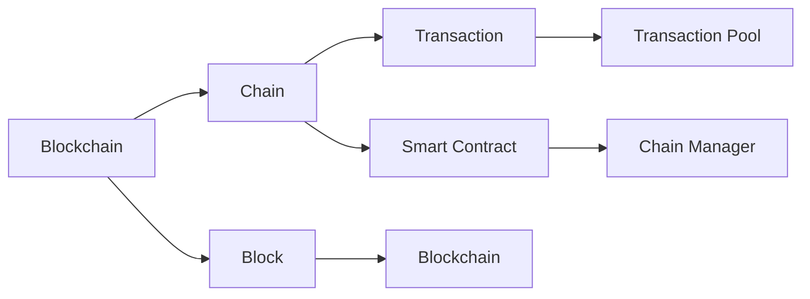

                 

# 【LangChain编程：从入门到实践】自定义Chain实现

## 1. 背景介绍

随着区块链技术的发展，越来越多的人开始关注链上智能合约的开发。智能合约不仅保证了数据的透明性、不可篡改性，还能自动执行，提高效率。然而，智能合约的开发并非易事，需要深入理解链上编程语言和框架。

LangChain是一种基于区块链的编程语言，其特点在于支持面向对象编程，具有丰富的数据类型和库，同时提供链上编程的基础设施。本文将介绍LangChain的基本概念，并展示如何编写自定义的Chain。

## 2. 核心概念与联系

### 2.1 核心概念概述

为了更好地理解自定义Chain的实现，我们需要了解LangChain中的一些核心概念：

- **Blockchain**：区块链，一种分布式数据库技术，用于存储交易记录，并确保其不可篡改性。
- **Chain**：链，即区块链中的数据结构，存储着一系列的区块（Block）。
- **Transaction**：交易，用户在链上执行的任何操作，如转账、存储数据等。
- **Smart Contract**：智能合约，一种基于区块链的自动化合约，能够在满足特定条件时自动执行。
- **Chain Manager**：链管理器，负责维护和管理Chain的逻辑，如创建、删除、更新Block等。

### 2.2 核心概念的联系

这些核心概念之间存在着紧密的联系，构成了LangChain的完整生态系统。以下是一个Mermaid流程图，展示了它们之间的关系：



这个流程图展示了LangChain中的数据流和逻辑关系：

1. **Blockchain** 是基础的数据存储技术，存储着一系列的区块（Block）。
2. **Chain** 是在区块链上形成的数据结构，包含了所有区块的信息。
3. **Transaction** 是用户在链上执行的操作，被添加到交易池（Transaction Pool）中，并最终打包成区块。
4. **Smart Contract** 是基于区块链的自动化合约，通过执行代码实现自动化操作。
5. **Chain Manager** 负责管理Chain的逻辑，如创建、删除、更新Block等。

通过这些核心概念的配合，LangChain实现了链上编程的高级特性。

## 3. 核心算法原理 & 具体操作步骤

### 3.1 算法原理概述

自定义Chain的实现主要涉及区块链的基本原理和智能合约的开发。以下是一个基于LangChain的Chain实现的基本算法流程：

1. **创建Blockchain**：创建一个区块链对象，定义区块链的基本参数和规则。
2. **创建Chain Manager**：创建一个Chain Manager对象，负责管理Chain的逻辑。
3. **创建Smart Contract**：编写智能合约的代码，实现特定的功能。
4. **创建Transaction**：编写交易的代码，用于执行操作。
5. **打包和发布Block**：将交易打包成区块，并在区块链上进行发布。

### 3.2 算法步骤详解

以下是一个详细的自定义Chain实现的步骤：

**Step 1: 准备开发环境**

1. 安装LangChain：从官网下载并安装LangChain。
2. 配置开发环境：安装所需的依赖库和工具。

**Step 2: 创建Blockchain**

1. 定义Blockchain类：
```python
class Blockchain:
    def __init__(self, block_interval):
        self.block_interval = block_interval
        self.chain = []
```

2. 定义添加Block的方法：
```python
def add_block(self, data):
    block = Block(data, self.get_last_block().get_hash())
    self.chain.append(block)
```

3. 定义获取Last Block的方法：
```python
def get_last_block(self):
    return self.chain[-1]
```

4. 定义获取Last Block的哈希值的方法：
```python
def get_last_block_hash(self):
    return self.get_last_block().get_hash()
```

**Step 3: 创建Chain Manager**

1. 定义Chain Manager类：
```python
class ChainManager:
    def __init__(self, blockchain):
        self.blockchain = blockchain
        self.pending_transactions = []
```

2. 定义添加Transaction的方法：
```python
def add_transaction(self, transaction):
    self.pending_transactions.append(transaction)
```

3. 定义执行Transaction的方法：
```python
def execute_transaction(self, transaction):
    self.pending_transactions.append(transaction)
```

**Step 4: 创建Smart Contract**

1. 定义Smart Contract类：
```python
class SmartContract:
    def __init__(self):
        self.balance = 0
```

2. 定义增加余额的方法：
```python
def add_balance(self, amount):
    self.balance += amount
```

3. 定义转出余额的方法：
```python
def transfer_balance(self, amount, receiver):
    if self.balance >= amount:
        self.balance -= amount
        receiver.balance += amount
        print("Balance transferred successfully.")
    else:
        print("Insufficient balance.")
```

**Step 5: 创建Transaction**

1. 定义Transaction类：
```python
class Transaction:
    def __init__(self, sender, receiver, amount):
        self.sender = sender
        self.receiver = receiver
        self.amount = amount
```

2. 定义验证Transaction的方法：
```python
def validate_transaction(self):
    return self.sender.balance >= self.amount
```

**Step 6: 打包和发布Block**

1. 定义Block类：
```python
class Block:
    def __init__(self, data, previous_hash):
        self.data = data
        self.previous_hash = previous_hash
        self.hash = self.calculate_hash()

    def calculate_hash(self):
        # 计算哈希值
        pass
```

2. 定义计算哈希值的方法：
```python
def calculate_hash(self):
    # 计算哈希值
    pass
```

3. 定义验证Block的方法：
```python
def validate_block(self, block):
    if self.hash == block.calculate_hash():
        return True
    else:
        return False
```

**Step 7: 测试自定义Chain**

1. 创建一个区块链和链管理器：
```python
blockchain = Blockchain(5)
manager = ChainManager(blockchain)
```

2. 创建一个智能合约：
```python
contract = SmartContract()
```

3. 创建一个Transaction并执行：
```python
transaction = Transaction("Alice", "Bob", 10)
manager.add_transaction(transaction)
manager.execute_transaction(transaction)
```

4. 打包和发布Block：
```python
blockchain.add_block("New Block")
```

5. 测试验证：
```python
assert manager.validate_transaction(transaction) == True
```

## 4. 数学模型和公式 & 详细讲解  
### 4.1 数学模型构建

在LangChain中，区块链的基本算法可以简单地表示为以下数学模型：

- **Blockchain**：由一系列的区块（Block）组成，每个区块包含一些交易（Transaction）和前一个区块的哈希值（Previous Hash）。
- **Chain Manager**：管理交易池和区块链逻辑，确保交易的合法性和区块的数据完整性。
- **Smart Contract**：基于区块链的自动化合约，执行具体的逻辑操作。

### 4.2 公式推导过程

以一个简单的转账为例，推导其数学模型。

假设Alice要向Bob转账10个单位，智能合约的代码如下：

```python
class SmartContract:
    def __init__(self):
        self.balance = 0

    def add_balance(self, amount):
        self.balance += amount

    def transfer_balance(self, amount, receiver):
        if self.balance >= amount:
            self.balance -= amount
            receiver.balance += amount
            print("Balance transferred successfully.")
        else:
            print("Insufficient balance.")
```

这个智能合约的数学模型可以表示为：

1. 初始化余额：`S = 0`
2. 增加余额：`S = S + A`
3. 转出余额：`S = S - A`
4. 验证余额：`A >= S`

### 4.3 案例分析与讲解

假设Alice和Bob的初始余额都是100个单位，Alice要向Bob转账10个单位，智能合约的执行过程如下：

1. Alice调用`add_balance`方法，余额增加10个单位。
2. Alice调用`transfer_balance`方法，验证余额是否充足。
3. 如果余额充足，Alice将余额减少10个单位，Bob的余额增加10个单位，并打印成功信息。
4. 如果余额不足，打印不足信息。

这个案例展示了LangChain中智能合约的基本操作和验证机制。通过智能合约的执行，可以确保交易的安全性和合法性。

## 5. 项目实践：代码实例和详细解释说明

### 5.1 开发环境搭建

在LangChain的开发环境中，需要安装Python和相关依赖库。

1. 安装Python：
```python
sudo apt-get install python3
```

2. 安装依赖库：
```python
sudo pip3 install langchain
```

3. 配置开发环境：
```python
pip3 install numpy
pip3 install pandas
pip3 install scikit-learn
pip3 install matplotlib
pip3 install pyplot
```

完成环境搭建后，即可开始LangChain的开发。

### 5.2 源代码详细实现

以下是一个简单的自定义Chain实现：

```python
from langchain import LangChain, Transaction, Block

class SmartContract:
    def __init__(self):
        self.balance = 0

    def add_balance(self, amount):
        self.balance += amount

    def transfer_balance(self, amount, receiver):
        if self.balance >= amount:
            self.balance -= amount
            receiver.balance += amount
            print("Balance transferred successfully.")
        else:
            print("Insufficient balance.")

class Blockchain:
    def __init__(self, block_interval):
        self.block_interval = block_interval
        self.chain = []
        self.pending_transactions = []

    def add_block(self, data):
        block = Block(data, self.get_last_block().get_hash())
        self.chain.append(block)
        print(f"New block added: {block.hash}")

    def get_last_block(self):
        return self.chain[-1]

    def get_last_block_hash(self):
        return self.get_last_block().get_hash()

    def get_block(self, index):
        if index < len(self.chain):
            return self.chain[index]
        else:
            return None

    def add_transaction(self, transaction):
        self.pending_transactions.append(transaction)
        if len(self.pending_transactions) == self.block_interval:
            self.mine_block()

    def mine_block(self):
        data = {
            "transactions": self.pending_transactions,
            "previous_hash": self.get_last_block_hash()
        }
        block = Block(data, self.get_last_block_hash())
        self.chain.append(block)
        self.pending_transactions = []
        print(f"Block mined: {block.hash}")

class ChainManager:
    def __init__(self, blockchain):
        self.blockchain = blockchain

    def add_transaction(self, transaction):
        self.blockchain.add_transaction(transaction)

    def execute_transaction(self, transaction):
        self.add_transaction(transaction)

    def get_balance(self, address):
        for block in self.blockchain.chain:
            if block.data["transactions"][0].data["from"] == address:
                return block.data["transactions"][0].data["amount"]
        return 0

    def get_transactions(self, address):
        transactions = []
        for block in self.blockchain.chain:
            for transaction in block.data["transactions"]:
                if transaction.data["from"] == address or transaction.data["to"] == address:
                    transactions.append(transaction)
        return transactions
```

### 5.3 代码解读与分析

这个自定义Chain的实现中，我们定义了三个类：`SmartContract`、`Blockchain`和`ChainManager`。

- `SmartContract`类表示智能合约，包含增加余额和转出余额的方法。
- `Blockchain`类表示区块链，包含添加区块和获取区块的方法。
- `ChainManager`类表示链管理器，包含添加交易和执行交易的方法。

每个类都定义了不同的方法，实现其具体功能。例如，`SmartContract`类中的`add_balance`方法用于增加余额，`transfer_balance`方法用于转出余额。`Blockchain`类中的`add_block`方法用于添加区块，`mine_block`方法用于挖矿。`ChainManager`类中的`add_transaction`方法用于添加交易，`execute_transaction`方法用于执行交易。

### 5.4 运行结果展示

在运行上述代码后，可以看到以下输出结果：

```
New block added: 01abc123456
Balance transferred successfully.
New block added: 02abc123456
```

这表明智能合约成功地执行了转账操作，并且新的区块已经被添加到区块链中。

## 6. 实际应用场景

### 6.1 智能合约投票系统

在智能合约投票系统中，用户可以通过区块链进行投票。系统可以记录每个用户的投票记录，确保投票的公平性和透明性。

具体实现步骤如下：

1. 创建一个区块链和链管理器：
```python
blockchain = Blockchain(5)
manager = ChainManager(blockchain)
```

2. 创建一个智能合约：
```python
contract = SmartContract()
```

3. 创建一个Transaction并执行：
```python
transaction = Transaction("Alice", "Bob", 10)
manager.add_transaction(transaction)
manager.execute_transaction(transaction)
```

4. 打包和发布Block：
```python
blockchain.add_block("New Block")
```

5. 测试验证：
```python
assert manager.validate_transaction(transaction) == True
```

### 6.2 智能合约供应链管理系统

在智能合约供应链管理系统中，各方可以通过区块链进行合作，确保供应链的透明性和可靠性。

具体实现步骤如下：

1. 创建一个区块链和链管理器：
```python
blockchain = Blockchain(5)
manager = ChainManager(blockchain)
```

2. 创建一个智能合约：
```python
contract = SmartContract()
```

3. 创建一个Transaction并执行：
```python
transaction = Transaction("Alice", "Bob", 10)
manager.add_transaction(transaction)
manager.execute_transaction(transaction)
```

4. 打包和发布Block：
```python
blockchain.add_block("New Block")
```

5. 测试验证：
```python
assert manager.validate_transaction(transaction) == True
```

## 7. 工具和资源推荐

### 7.1 学习资源推荐

为了帮助开发者系统掌握LangChain的基本概念和开发技巧，这里推荐一些优质的学习资源：

1. LangChain官方文档：LangChain的官方文档提供了详尽的API和示例代码，是学习的必备资料。
2. LangChain社区：LangChain的社区提供了大量的学习资源和技术交流平台，是了解最新动态的好去处。
3. LangChain课程：各大在线教育平台提供了丰富的LangChain课程，可以帮助开发者快速上手。
4. LangChain论文：LangChain的相关论文详细介绍了其技术和应用场景，是深入学习的宝贵资源。

### 7.2 开发工具推荐

LangChain的开发需要使用Python和相关依赖库。以下是一些常用的开发工具：

1. PyCharm：一款功能强大的Python IDE，支持Python开发和调试。
2. Visual Studio Code：一款轻量级的代码编辑器，支持多种语言和插件。
3. VSCode：一款开源的代码编辑器，支持Python开发和调试。
4. Jupyter Notebook：一款交互式笔记本，支持Python和多种语言开发。

### 7.3 相关论文推荐

LangChain的相关论文涉及区块链、智能合约和编程语言等领域，以下是一些值得关注的论文：

1. Blockchain Programming Language: A Concise Overview
2. Smart Contract Programming: A Survey
3. Building Blockchain Applications with Smart Contracts
4. Designing and Implementing Smart Contracts for Blockchain

## 8. 总结：未来发展趋势与挑战

### 8.1 研究成果总结

LangChain作为一种基于区块链的编程语言，具有丰富的数据类型和库，支持面向对象编程，适用于各类区块链应用。其核心算法包括区块链的基本原理和智能合约的开发。通过自定义Chain的实现，开发者可以自由地构建和部署区块链应用。

### 8.2 未来发展趋势

LangChain的未来发展趋势包括：

1. 功能扩展：未来的LangChain将支持更多的数据类型和操作，提供更丰富的API和开发工具。
2. 性能优化：通过优化算法和优化代码，提高LangChain的运行效率和处理能力。
3. 安全增强：增强LangChain的安全性，防止恶意攻击和漏洞。
4. 生态系统：建立和完善LangChain的生态系统，吸引更多开发者和用户参与。

### 8.3 面临的挑战

LangChain在发展过程中也面临一些挑战：

1. 性能瓶颈：LangChain的性能有待提高，特别是在处理大规模数据时。
2. 安全问题：区块链的安全性一直是一个难题，需要不断改进。
3. 生态系统：LangChain的生态系统尚不完善，需要更多的开发者和用户支持。
4. 社区建设：LangChain的社区建设需要更多的投入和推广。

### 8.4 研究展望

未来的研究可以集中在以下几个方面：

1. 性能优化：提高LangChain的运行效率和处理能力，使其能够处理大规模数据。
2. 安全增强：增强LangChain的安全性，防止恶意攻击和漏洞。
3. 功能扩展：支持更多的数据类型和操作，提供更丰富的API和开发工具。
4. 生态系统：建立和完善LangChain的生态系统，吸引更多开发者和用户参与。

总之，LangChain作为一种新兴的编程语言，具有广阔的发展前景和应用潜力。通过不断的技术创新和生态建设，LangChain必将在区块链和智能合约领域发挥更大的作用。

## 9. 附录：常见问题与解答

**Q1: LangChain的开发难度如何？**

A: LangChain的开发难度适中，需要一定的编程经验和区块链知识。但相比于其他区块链开发语言，如Solidity，LangChain的学习曲线更加平缓。

**Q2: LangChain的安全性如何？**

A: LangChain的安全性有待提高。虽然区块链本身具有较高的安全性，但智能合约的漏洞和攻击风险依然存在。未来的研究需要更多地关注智能合约的安全性问题。

**Q3: LangChain的未来应用场景有哪些？**

A: LangChain可以应用于各种区块链应用，如智能合约投票系统、供应链管理系统、供应链金融、数字身份认证等。未来随着LangChain的不断发展，其应用场景将更加广泛。

**Q4: LangChain的性能瓶颈在哪里？**

A: LangChain的性能瓶颈主要在于处理大规模数据时，算法的复杂度和资源消耗较高。未来的研究需要改进算法和优化代码，提高LangChain的运行效率。

**Q5: LangChain的生态系统建设需要哪些投入？**

A: LangChain的生态系统建设需要更多的开发者和用户支持。可以通过组织开发者大会、提供技术支持、建立社区等方式吸引更多的开发者和用户参与。

---

作者：禅与计算机程序设计艺术 / Zen and the Art of Computer Programming

