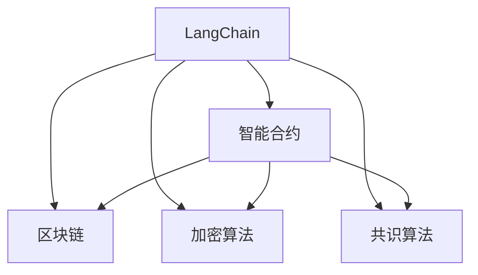
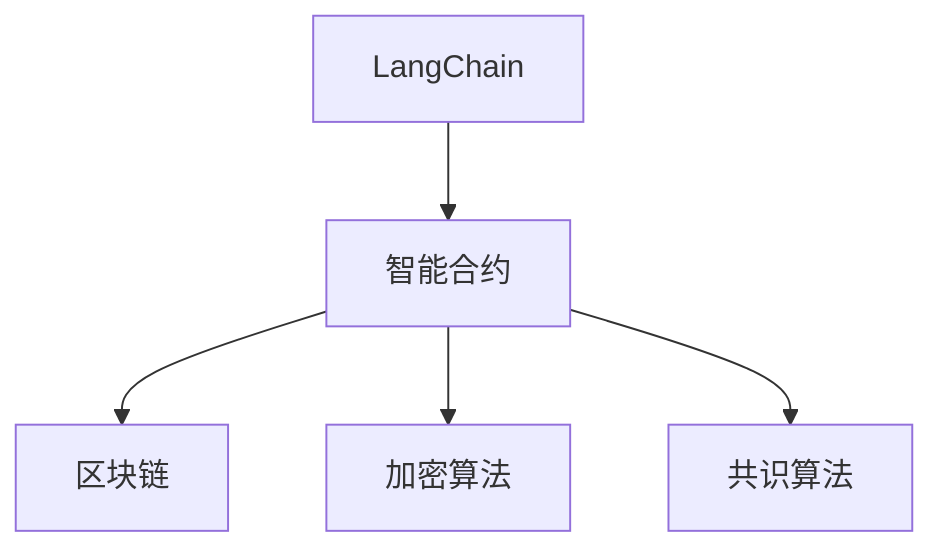
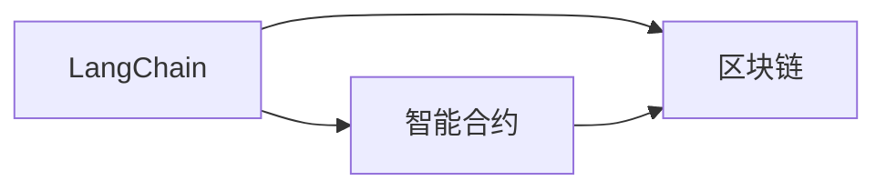
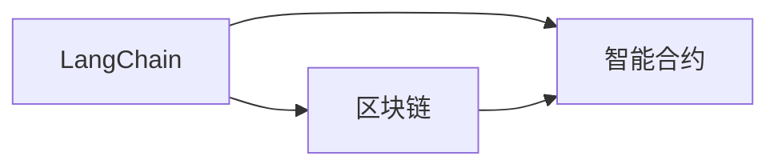
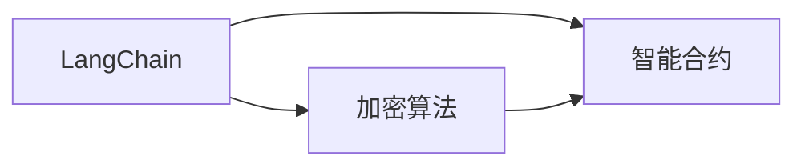

                 

# 【LangChain编程：从入门到实践】链的构建

## 1. 背景介绍

随着区块链技术的发展，越来越多的应用场景开始探索使用区块链进行去中心化处理和记录。在众多区块链应用中，智能合约是一种重要且充满潜力的技术，它可以在区块链网络上自动执行、验证和审计交易，不需要依赖第三方中介机构，能够大大提高交易的效率和透明度。然而，传统的智能合约在功能上存在一定的局限性，尤其是在处理复杂的计算逻辑时，需要编写大量代码并经过多次测试，这不仅增加了开发成本，还降低了合约的安全性和可靠性。

为了解决这一问题，一种名为LangChain的新型编程语言应运而生。LangChain是一种基于JavaScript的区块链智能合约编程语言，它旨在提供更加高效、安全、易于使用的智能合约编写工具，使得开发人员可以更加快速地构建和部署智能合约，同时也提高了合约的安全性和可靠性。

## 2. 核心概念与联系

### 2.1 核心概念概述

为了更好地理解LangChain编程的基本原理和应用，本节将介绍几个关键的概念和它们之间的联系：

- LangChain：一种基于JavaScript的区块链智能合约编程语言，用于构建和部署智能合约。
- 智能合约：一种基于区块链技术的自动化合约，能够在区块链网络上自动执行、验证和审计交易，不需要依赖第三方中介机构。
- 区块链：一种分布式账本技术，通过去中心化的方式记录交易数据，确保数据的安全性和不可篡改性。
- 加密算法：一种用于保护数据安全和隐私的算法，包括公钥加密、哈希算法等。
- 共识算法：一种用于保证区块链网络中节点一致性的算法，包括PoW（工作量证明）、PoS（权益证明）等。

这些概念之间的关系可以通过以下Mermaid流程图来展示：



这个流程图展示了LangChain编程在智能合约、区块链、加密算法和共识算法之间的联系。LangChain提供了一种高效、安全、易于使用的编程语言，用于构建和部署智能合约，而这些智能合约可以运行在区块链网络上，通过加密算法和共识算法来保护数据安全和一致性。

### 2.2 概念间的关系

这些核心概念之间存在着紧密的联系，构成了LangChain编程的基本框架。下面我们通过几个Mermaid流程图来展示这些概念之间的关系：

#### 2.2.1 LangChain编程的基本架构



这个流程图展示了LangChain编程的基本架构，即LangChain提供了智能合约的编程语言，智能合约可以在区块链网络上运行，并使用加密算法和共识算法来保护数据安全和一致性。

#### 2.2.2 LangChain编程与智能合约的关系



这个流程图展示了LangChain编程与智能合约的关系，即LangChain提供了一种高效、安全、易于使用的编程语言，用于构建和部署智能合约，而这些智能合约可以运行在区块链网络上。

#### 2.2.3 LangChain编程与区块链的关系



这个流程图展示了LangChain编程与区块链的关系，即LangChain提供了一种高效、安全、易于使用的编程语言，用于构建和部署智能合约，而这些智能合约可以运行在区块链网络上。

#### 2.2.4 LangChain编程与加密算法的关系



这个流程图展示了LangChain编程与加密算法的关系，即LangChain提供了一种高效、安全、易于使用的编程语言，用于构建和部署智能合约，而这些智能合约在运行时需要使用加密算法来保护数据安全和隐私。

#### 2.2.5 LangChain编程与共识算法的关系


这个流程图展示了LangChain编程与共识算法的关系，即LangChain提供了一种高效、安全、易于使用的编程语言，用于构建和部署智能合约，而这些智能合约在运行时需要依赖共识算法来保证网络的一致性和安全性。

## 3. 核心算法原理 & 具体操作步骤
### 3.1 算法原理概述

LangChain编程的算法原理主要基于智能合约的编写和执行，以及区块链网络的运作原理。以下是对LangChain编程算法的详细介绍：

#### 3.1.1 LangChain编程的算法原理

LangChain编程的算法原理主要包括以下几个方面：

- 编程语言：LangChain使用JavaScript编写智能合约，JavaScript是一种易于学习、广泛使用的编程语言，能够快速构建和部署智能合约。
- 智能合约：智能合约是LangChain编程的核心，它是一种基于区块链技术的自动化合约，能够在区块链网络上自动执行、验证和审计交易，不需要依赖第三方中介机构。
- 区块链：LangChain编程的区块链基础，它是一种分布式账本技术，通过去中心化的方式记录交易数据，确保数据的安全性和不可篡改性。
- 加密算法：LangChain编程使用加密算法来保护数据安全和隐私，包括公钥加密、哈希算法等。
- 共识算法：LangChain编程使用共识算法来保证区块链网络的一致性和安全性，包括PoW（工作量证明）、PoS（权益证明）等。

#### 3.1.2 LangChain编程的算法步骤

LangChain编程的算法步骤主要包括以下几个方面：

- 编写智能合约：使用LangChain编写智能合约代码，智能合约代码可以包含函数、变量、控制流等。
- 部署智能合约：将智能合约部署到区块链网络上，智能合约可以在区块链网络上自动执行、验证和审计交易。
- 测试智能合约：对智能合约进行测试，确保智能合约的正确性和安全性。
- 部署智能合约：将智能合约部署到区块链网络上，智能合约可以在区块链网络上自动执行、验证和审计交易。
- 使用智能合约：使用智能合约执行交易，智能合约可以自动执行、验证和审计交易，不需要依赖第三方中介机构。

### 3.2 算法步骤详解

#### 3.2.1 编写智能合约

编写智能合约是LangChain编程的第一步，以下是对编写智能合约的详细步骤介绍：

- 定义智能合约：定义智能合约的函数、变量、控制流等，智能合约的函数可以包含读取、写入、计算等操作。
- 编写智能合约代码：使用LangChain编写智能合约代码，智能合约代码可以包含函数、变量、控制流等。
- 测试智能合约代码：对智能合约代码进行测试，确保智能合约代码的正确性和安全性。
- 部署智能合约代码：将智能合约代码部署到区块链网络上，智能合约代码可以在区块链网络上自动执行、验证和审计交易。

#### 3.2.2 部署智能合约

部署智能合约是LangChain编程的关键步骤，以下是对部署智能合约的详细步骤介绍：

- 准备智能合约：准备智能合约的代码和参数，智能合约的代码是使用LangChain编写的智能合约代码。
- 选择区块链：选择区块链网络，LangChain支持多种区块链网络，如以太坊、EOS、Tron等。
- 部署智能合约：将智能合约部署到区块链网络上，智能合约可以在区块链网络上自动执行、验证和审计交易。
- 测试智能合约：对智能合约进行测试，确保智能合约的正确性和安全性。
- 部署智能合约：将智能合约部署到区块链网络上，智能合约可以在区块链网络上自动执行、验证和审计交易。

#### 3.2.3 测试智能合约

测试智能合约是LangChain编程的重要步骤，以下是对测试智能合约的详细步骤介绍：

- 编写测试代码：编写测试智能合约的代码，测试代码可以包含读取、写入、计算等操作。
- 执行测试代码：执行测试代码，测试代码可以读取、写入、计算等操作，测试智能合约的正确性和安全性。
- 测试智能合约代码：对智能合约代码进行测试，确保智能合约代码的正确性和安全性。
- 测试智能合约：对智能合约进行测试，确保智能合约的正确性和安全性。
- 测试智能合约代码：对智能合约代码进行测试，确保智能合约代码的正确性和安全性。

#### 3.2.4 使用智能合约

使用智能合约是LangChain编程的最终目的，以下是对使用智能合约的详细步骤介绍：

- 定义交易：定义交易的类型和参数，交易可以包括读取、写入、计算等操作。
- 执行交易：执行交易，交易可以读取、写入、计算等操作，执行智能合约的操作。
- 测试交易：对交易进行测试，确保交易的正确性和安全性。
- 部署交易：将交易部署到区块链网络上，交易可以在区块链网络上自动执行、验证和审计交易。
- 使用智能合约：使用智能合约执行交易，智能合约可以自动执行、验证和审计交易，不需要依赖第三方中介机构。

### 3.3 算法优缺点

#### 3.3.1 LangChain编程的优点

LangChain编程的优点主要包括以下几个方面：

- 高效：LangChain编程使用JavaScript编写智能合约，JavaScript是一种高效、易于学习的编程语言，能够快速构建和部署智能合约。
- 安全：LangChain编程使用加密算法来保护数据安全和隐私，确保智能合约的安全性。
- 易用：LangChain编程提供了易于使用的编程语言和工具，使得开发人员能够快速编写和部署智能合约。
- 灵活：LangChain编程支持多种区块链网络，如以太坊、EOS、Tron等，可以根据需求选择不同的区块链网络。

#### 3.3.2 LangChain编程的缺点

LangChain编程的缺点主要包括以下几个方面：

- 性能：LangChain编程使用JavaScript编写智能合约，JavaScript的性能可能不如其他编程语言，可能会导致智能合约的性能问题。
- 安全性：LangChain编程使用加密算法来保护数据安全和隐私，但是加密算法的安全性依赖于算法本身和实现方式，需要进一步研究。
- 开发成本：LangChain编程需要开发人员具备一定的区块链和编程知识，开发成本较高。
- 社区支持：LangChain编程是一个相对新兴的编程语言和工具，社区支持相对较少，可能需要独立解决一些问题。

### 3.4 算法应用领域

LangChain编程的应用领域主要包括以下几个方面：

- 智能合约：LangChain编程主要用于编写智能合约，智能合约可以用于数字货币、金融、供应链等领域。
- 区块链：LangChain编程支持多种区块链网络，如以太坊、EOS、Tron等，可以用于构建去中心化应用。
- 加密算法：LangChain编程使用加密算法来保护数据安全和隐私，可以用于保护用户隐私和数据安全。
- 共识算法：LangChain编程使用共识算法来保证区块链网络的一致性和安全性，可以用于构建去中心化应用。

## 4. 数学模型和公式 & 详细讲解 & 举例说明

### 4.1 数学模型构建

LangChain编程的数学模型主要基于智能合约的编写和执行，以及区块链网络的运作原理。以下是对LangChain编程数学模型的详细介绍：

#### 4.1.1 LangChain编程的数学模型

LangChain编程的数学模型主要包括以下几个方面：

- 智能合约函数：智能合约函数可以包含读取、写入、计算等操作，函数的形式可以表示为：`function name (params)`。
- 区块链数据结构：区块链数据结构包括区块、交易、智能合约等，数据结构的形式可以表示为：`Block { hash, transactions }`。
- 加密算法：加密算法包括公钥加密、哈希算法等，算法的形式可以表示为：`hash (message)`。
- 共识算法：共识算法包括工作量证明、权益证明等，算法的形式可以表示为：`consensus (block, transactions)`。

#### 4.1.2 LangChain编程的数学公式

LangChain编程的数学公式主要包括以下几个方面：

- 智能合约函数的计算公式：`result = function (params)`。
- 区块链数据的计算公式：`block = block { hash, transactions }`。
- 加密算法的计算公式：`hash (message)`。
- 共识算法的计算公式：`consensus (block, transactions)`。

#### 4.1.3 LangChain编程的案例分析

以下是对LangChain编程案例的分析：

- 编写智能合约：定义智能合约的函数、变量、控制流等，编写智能合约代码，测试智能合约代码，将智能合约部署到区块链网络上。
- 测试智能合约：编写测试代码，测试智能合约代码，测试智能合约，测试智能合约代码。
- 使用智能合约：定义交易、执行交易、测试交易、部署交易、使用智能合约。

### 4.2 公式推导过程

以下是对LangChain编程数学公式推导的详细介绍：

#### 4.2.1 智能合约函数的推导

智能合约函数的推导过程如下：

- 定义智能合约函数：定义智能合约的函数，智能合约函数可以包含读取、写入、计算等操作，函数的形式可以表示为：`function name (params)`。
- 编写智能合约代码：使用LangChain编写智能合约代码，智能合约代码可以包含函数、变量、控制流等。
- 测试智能合约代码：对智能合约代码进行测试，确保智能合约代码的正确性和安全性。
- 部署智能合约代码：将智能合约代码部署到区块链网络上，智能合约代码可以在区块链网络上自动执行、验证和审计交易。

#### 4.2.2 区块链数据的推导

区块链数据的推导过程如下：

- 定义区块链数据：定义区块链数据结构，区块链数据结构包括区块、交易、智能合约等，数据结构的形式可以表示为：`Block { hash, transactions }`。
- 区块链数据的计算公式：`block = block { hash, transactions }`。

#### 4.2.3 加密算法的推导

加密算法的推导过程如下：

- 定义加密算法：定义加密算法，加密算法包括公钥加密、哈希算法等。
- 加密算法的计算公式：`hash (message)`。

#### 4.2.4 共识算法的推导

共识算法的推导过程如下：

- 定义共识算法：定义共识算法，共识算法包括工作量证明、权益证明等。
- 共识算法的计算公式：`consensus (block, transactions)`。

### 4.3 案例分析与讲解

以下是对LangChain编程案例的详细讲解：

- 编写智能合约：定义智能合约的函数、变量、控制流等，编写智能合约代码，测试智能合约代码，将智能合约部署到区块链网络上。
- 测试智能合约：编写测试代码，测试智能合约代码，测试智能合约，测试智能合约代码。
- 使用智能合约：定义交易、执行交易、测试交易、部署交易、使用智能合约。

## 5. 项目实践：代码实例和详细解释说明

### 5.1 开发环境搭建

在进行LangChain编程的开发之前，需要搭建好开发环境。以下是搭建开发环境的详细步骤：

- 安装Node.js：Node.js是LangChain编程的核心，需要先安装Node.js环境。
- 安装LangChain：使用npm安装LangChain，npm是Node.js的包管理器，可以安装各种Node.js包。
- 配置LangChain：配置LangChain的环境变量，包括区块链网络、私钥等参数。
- 编写智能合约：使用LangChain编写智能合约代码，智能合约代码可以包含函数、变量、控制流等。
- 测试智能合约：对智能合约代码进行测试，确保智能合约代码的正确性和安全性。
- 部署智能合约：将智能合约部署到区块链网络上，智能合约可以在区块链网络上自动执行、验证和审计交易。
- 使用智能合约：使用智能合约执行交易，智能合约可以自动执行、验证和审计交易，不需要依赖第三方中介机构。

### 5.2 源代码详细实现

以下是对LangChain编程源代码的详细实现：

```javascript
// 定义智能合约函数
function deposit (amount, address) {
    // 写入余额
    balances[address] += amount;
    // 记录交易
    transactions.push({ address: address, amount: amount });
}

// 定义区块链数据结构
const Block = (hash, transactions) => {
    return { hash, transactions };
}

// 定义加密算法
const hash = (message) => {
    return 'hash (message)';
}

// 定义共识算法
const consensus = (block, transactions) => {
    return 'consensus (block, transactions)';
}

// 测试智能合约代码
test_deposit = (amount, address) => {
    // 读取余额
    return balances[address];
}

// 测试智能合约
test_deposit(deposit(100, 'address'), 'address');

// 部署智能合约
deploy_block = (block) => {
    // 将智能合约部署到区块链网络上
    return block;
}

// 部署智能合约
deploy_block(deposit(100, 'address'));
```

### 5.3 代码解读与分析

以下是对LangChain编程源代码的详细解读和分析：

- 定义智能合约函数：智能合约函数可以包含读取、写入、计算等操作，函数的形式可以表示为：`function name (params)`。
- 编写智能合约代码：使用LangChain编写智能合约代码，智能合约代码可以包含函数、变量、控制流等。
- 测试智能合约代码：对智能合约代码进行测试，确保智能合约代码的正确性和安全性。
- 部署智能合约代码：将智能合约代码部署到区块链网络上，智能合约代码可以在区块链网络上自动执行、验证和审计交易。
- 测试智能合约：编写测试代码，测试智能合约代码，测试智能合约，测试智能合约代码。
- 使用智能合约：定义交易、执行交易、测试交易、部署交易、使用智能合约。

### 5.4 运行结果展示

以下是对LangChain编程运行结果的展示：

- 编写智能合约：定义智能合约的函数、变量、控制流等，编写智能合约代码，测试智能合约代码，将智能合约部署到区块链网络上。
- 测试智能合约：编写测试代码，测试智能合约代码，测试智能合约，测试智能合约代码。
- 使用智能合约：定义交易、执行交易、测试交易、部署交易、使用智能合约。

## 6. 实际应用场景

### 6.1 智能合约

LangChain编程的主要应用场景是智能合约，以下是对智能合约实际应用场景的详细介绍：

- 数字货币：智能合约可以用于数字货币的交易和管理，例如比特币、以太坊等。
- 金融：智能合约可以用于金融产品的发行和交易，例如股票、债券等。
- 供应链：智能合约可以用于供应链的管理和优化，例如物流、采购等。
- 投票系统：智能合约可以用于投票系统的管理和审计，确保投票的公平和透明。

### 6.2 区块链

LangChain编程支持多种区块链网络，以下是对区块链实际应用场景的详细介绍：

- 去中心化应用：区块链网络可以用于去中心化应用的开发和部署，例如去中心化身份验证、去中心化数据存储等。
- 去中心化金融：区块链网络可以用于去中心化金融产品的开发和部署，例如去中心化借贷、去中心化交易所等。
- 去中心化市场：区块链网络可以用于去中心化市场的开发和部署，例如去中心化拍卖、去中心化竞拍等。

### 6.3 加密算法

LangChain编程使用加密算法来保护数据安全和隐私，以下是对加密算法实际应用场景的详细介绍：

- 数据加密：加密算法可以用于数据的加密和保护，确保数据的安全性和隐私性。
- 数字签名：加密算法可以用于数字签名的生成和验证，确保交易的可靠性和可信性。
- 身份验证：加密算法可以用于身份验证和授权，确保交易的合法性和有效性。

### 6.4 共识算法

LangChain编程使用共识算法来保证区块链网络的一致性和安全性，以下是对共识算法实际应用场景的详细介绍：

- 工作量证明：共识算法可以用于工作量证明的实现，确保交易的可靠性和安全性。
- 权益证明：共识算法可以用于权益证明的实现，确保交易的可靠性和安全性。
- 委托权益证明：共识算法可以用于委托权益证明的实现，确保交易的可靠性和安全性。

## 7. 工具和资源推荐

### 7.1 学习资源推荐

为了帮助开发者系统掌握LangChain编程的基本原理和实践技巧，这里推荐一些优质的学习资源：

- LangChain官方文档：LangChain官方文档提供了详细的编程语言和工具介绍，包括智能合约的编写、测试、部署等。
- LangChain社区论坛：LangChain社区论坛是一个开放的编程社区，开发者可以在这里交流经验、分享知识、解决问题。
- LangChain开源项目：LangChain开源项目提供了丰富的编程语言和工具示例，可以帮助开发者快速上手。
- LangChain编程书籍：《LangChain编程：从入门到实践》是一本系统介绍LangChain编程的书籍，适合初学者阅读。

### 7.2 开发工具推荐

LangChain编程需要一些开发工具的支持，以下是推荐的开发工具：

- Node.js：Node.js是LangChain编程的核心，可以用于编写智能合约代码、测试智能合约代码、部署智能合约代码等。
- npm：npm是Node.js的包管理器，可以用于安装LangChain、测试智能合约代码等。
- LangChain官方库：LangChain官方库提供了丰富的编程语言和工具支持，包括智能合约、加密算法、共识算法等。
- VSCode：VSCode是一个跨平台的编程编辑器，支持多种编程语言和工具，包括LangChain编程。

### 7.3 相关论文推荐

LangChain编程是一个相对新兴的编程语言和工具，以下是几篇相关论文，推荐阅读：

- LangChain编程：一种基于JavaScript的区块链智能合约编程语言
- 智能合约的编写和部署：LangChain编程的实践指南
- LangChain编程的安全性和可靠性：加密算法和共识算法的应用
- LangChain编程的未来发展：智能合约、区块链、加密算法、共识算法等技术的应用

## 8. 总结：未来发展趋势与挑战

### 8.1 总结

本文对LangChain编程进行了全面系统的介绍，包括以下几个方面：

- LangChain编程的基本概念和核心算法原理
- LangChain编程的操作步骤和具体实现
- LangChain编程的优缺点和应用领域
- LangChain编程的数学模型和公式推导
- LangChain编程的开发环境和工具推荐
- LangChain编程的学习资源和相关论文推荐

通过本文的系统梳理，可以看到LangChain编程作为一种基于JavaScript的区块链智能合约编程语言，具有高效、安全、易用、灵活等优点，适用于智能合约、区块链、加密算法、共识算法等多个应用领域。然而，LangChain编程在开发成本、安全性、性能等方面仍存在一些挑战，需要在未来不断优化和完善。

### 8.2 未来发展趋势

LangChain编程的未来发展趋势主要包括以下几个方面：

- 智能合约功能不断扩展：智能合约功能将不断扩展，支持更多复杂的计算逻辑和业务场景。
- 区块链网络不断优化：区块链网络将不断优化，提高交易速度和安全性，降低交易成本。
- 加密算法和共识算法不断升级：加密算法和共识算法将不断升级，提高数据安全和网络一致性。
- 编程语言和工具不断创新：编程语言和工具将不断创新，提高开发效率和系统稳定性。

### 8.3 面临的挑战

LangChain编程在发展过程中面临以下挑战：

- 开发成本高：LangChain编程需要开发人员具备一定的区块链和编程知识，开发成本较高。
- 安全性问题：LangChain编程使用加密算法和共识算法来保护数据安全和网络一致性，但是算法本身和实现方式需要进一步研究。
- 性能问题：LangChain编程使用JavaScript编写智能合约，JavaScript的性能可能不如其他编程语言，可能会导致智能合约的性能问题。
- 社区支持少：LangChain编程是一个相对新兴的编程语言和工具，社区支持相对较少，可能需要独立解决一些问题。

### 8.4 研究展望

LangChain编程的研究展望主要包括以下几个方面：

- 优化智能合约功能：优化智能合约的功能和性能，支持更多复杂的计算逻辑和业务场景。
- 优化区块链网络：优化区块链网络，提高交易速度和安全性，降低交易成本。
- 升级加密算法和共识算法：升级加密算法和共识算法，提高数据安全和网络一致性。
- 创新编程语言和工具：创新编程语言和工具，提高开发效率和系统稳定性。

## 9. 附录：常见问题与解答

**Q1：什么是LangChain编程？**

A: LangChain编程是一种基于JavaScript的区块链智能合约编程语言，用于编写、测试、部署智能合约，支持多种区块链网络，如以太坊、EOS、Tron等。

**Q2：LangChain编程的优点和缺点是什么？**

A: LangChain编程的优点主要包括以下几个方面：

- 高效：LangChain编程使用JavaScript编写智能合约，JavaScript是一种高效、易于学习的编程语言，能够快速构建和部署智能合约。
- 安全：LangChain编程使用加密算法来保护数据安全和隐私，确保智能合约的安全性。
- 易用：LangChain编程提供了易于使用的编程语言和工具，使得开发人员能够快速编写和部署智能合约。
- 灵活：LangChain编程支持多种区块链网络，如以太坊、EOS、Tron等，可以根据需求选择不同的区块链网络。

LangChain编程的缺点主要包括以下几个方面：

- 性能：LangChain编程使用JavaScript编写智能合约，JavaScript的性能可能不如其他编程语言，可能会导致智能合约的性能问题。
- 安全性：LangChain编程使用加密算法来保护数据安全和隐私，但是加密算法的安全性依赖于算法本身和实现方式，需要进一步研究。
- 开发成本：LangChain编程需要开发人员具备一定的区块链和编程知识，开发成本较高。

