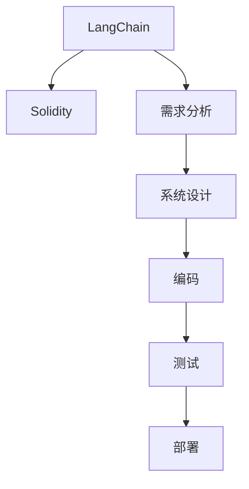

                 

# 【LangChain编程：从入门到实践】需求思考与设计

> 关键词：
- LangChain
- 智能合约
- Solidity
- 需求分析
- 系统设计

## 1. 背景介绍

随着区块链技术的不断成熟，智能合约在各个领域的应用日益广泛。从DeFi到NFT，从供应链金融到社交媒体，智能合约的应用场景和功能不断拓展。LangChain作为一种基于以太坊的智能合约语言，因其简洁、灵活和高效，成为开发者们的首选。然而，如何高效、安全地编写和部署LangChain智能合约，是一个值得深入探讨的问题。本文将从需求分析和系统设计两个维度，全面阐述LangChain编程的思路和方法，为读者提供一个系统的入门和实践指南。

## 2. 核心概念与联系

### 2.1 核心概念概述

为了更好地理解LangChain编程，我们需要掌握一些核心概念和术语。

- **LangChain**：一种基于以太坊智能合约的语言，旨在简化合约开发和部署过程。LangChain通过提供高级抽象和工具，帮助开发者快速构建智能合约，同时也支持传统Solidity语言的兼容性。
- **Solidity**：以太坊生态中最流行的智能合约语言，用于编写以太坊区块链上的智能合约。Solidity具有明确的语法规则和丰富的库支持，但其开发和调试过程相对复杂。
- **需求分析**：在系统开发的初期阶段，通过分析用户需求，明确系统目标和功能，为后续设计和实现提供依据。需求分析是确保系统符合用户需求的关键步骤。
- **系统设计**：在系统需求确定后，通过设计合理的架构和组件，将需求转化为可执行的系统设计方案。系统设计是实现需求的具体步骤，需要考虑性能、安全、可扩展性等因素。

这些概念之间的关系可以用以下Mermaid流程图表示：



这个流程图展示了从需求分析到系统设计，再到编码、测试和部署的完整过程。LangChain通过简化合约开发过程，帮助开发者更高效地实现智能合约的功能。

### 2.2 概念间的关系

这些核心概念之间存在着紧密的联系。以下是几个关键的关联点：

- LangChain作为Solidity的补充，帮助开发者快速构建智能合约，同时保留了Solidity语言的兼容性。
- 需求分析在系统设计之前，确定系统目标和功能，为系统设计提供依据。
- 系统设计在系统编码之前，规划系统的架构和组件，确保编码和测试的有效性。
- 编码是系统设计的具体实现，测试验证代码的正确性和性能，部署将系统发布到以太坊区块链上。

通过理解这些概念之间的关系，我们可以更好地把握LangChain编程的流程和思路。

## 3. 核心算法原理 & 具体操作步骤
### 3.1 算法原理概述

LangChain编程的核心算法原理基于以太坊智能合约的实现机制。以太坊智能合约是一段可以在区块链上运行的代码，能够自动执行和处理交易。LangChain作为以太坊智能合约的语言，其算法原理与Solidity基本一致，主要包括：

- **账户模型**：以太坊智能合约中，账户分为外部账户(Externally Owned Account)和合约账户(Contract Account)两种。外部账户由用户控制，而合约账户由智能合约控制。
- **事件系统**：智能合约可以通过触发事件来通知外部账户，事件系统是合约与外部账户通信的重要机制。
- **存储和部署**：智能合约的代码和状态数据存储在以太坊区块链上，可以通过编译器将其部署到区块链上。

### 3.2 算法步骤详解

LangChain编程的具体步骤如下：

1. **需求分析**：
   - 收集用户需求，明确系统目标和功能。
   - 确定系统边界和外部接口，定义数据输入和输出。
   - 分析系统安全性需求，确定安全防护措施。

2. **系统设计**：
   - 设计系统架构，确定主要组件和模块。
   - 定义数据结构和类型，确保数据一致性。
   - 设计算法和流程，明确各个组件之间的交互方式。

3. **编码**：
   - 使用LangChain语言编写智能合约代码。
   - 使用Solidity编译器编译LangChain代码，生成以太坊智能合约字节码。
   - 将合约代码部署到以太坊区块链上，生成合约地址。

4. **测试**：
   - 编写测试用例，验证合约的正确性和性能。
   - 使用测试框架进行自动化测试，确保合约的稳定性和可扩展性。

5. **部署**：
   - 将经过测试的合约部署到以太坊区块链上。
   - 使用LangChain提供的界面或API，管理合约的状态和数据。

### 3.3 算法优缺点

LangChain编程的主要优点包括：

- **简化合约开发**：LangChain通过提供高级抽象和工具，降低了合约开发的难度。
- **提高开发效率**：LangChain支持快速原型开发和迭代，加速项目交付。
- **兼容Solidity**：LangChain可以与Solidity无缝集成，开发者可以灵活切换语言。

其主要缺点包括：

- **社区支持不足**：LangChain作为新兴语言，社区和技术支持相对有限。
- **性能瓶颈**：LangChain可能在某些复杂场景下，无法充分发挥Solidity的性能优势。
- **安全风险**：LangChain的语法和编程范式与Solidity不同，可能带来新的安全风险。

### 3.4 算法应用领域

LangChain编程主要应用于以下领域：

- **DeFi**：DeFi项目需要智能合约实现自动化金融操作，如借贷、稳定币等。
- **NFT**：NFT项目需要智能合约管理数字资产的发行、流转和存储。
- **供应链金融**：智能合约用于追踪供应链中的货物流向，确保交易的真实性和透明度。
- **社交媒体**：智能合约用于管理社交媒体平台的投票、治理和激励机制。

这些领域的应用场景，展示了LangChain编程的广泛适用性和强大潜力。

## 4. 数学模型和公式 & 详细讲解 & 举例说明
### 4.1 数学模型构建

LangChain编程涉及的数学模型主要包括：

- **事件计算**：智能合约的事件系统允许合约在执行某些操作时触发事件。假设合约有一个名为`Transfer`的事件，表示资产转移。当合约执行`transfer(address receiver, uint amount)`操作时，会触发`Transfer`事件，事件参数包括接收者地址和转移金额。
- **数据存储**：智能合约的数据存储在区块链上，可以通过`Storage`关键字定义。假设合约有一个名为`balance`的存储变量，表示合约的余额。合约的余额可以通过`balance`读取和更新。

### 4.2 公式推导过程

以下是一个简单的LangChain合约示例，用于管理用户的余额和转账功能：

```langchain
// SPDX-License-Identifier: MIT
pragma solidity ^0.8.0;

contract MyContract {
    address private owner;
    uint256 private balance;
    
    constructor() public {
        owner = msg.sender;
        balance = 0;
    }
    
    function transfer(address receiver, uint amount) public payable {
        require(receiver != address(0), "Invalid receiver address");
        require(amount > 0, "Invalid amount");
        require(msg.sender == owner, "Only owner can transfer");
        
        uint new_balance = balance.sub(amount);
        require(new_balance >= 0, "Insufficient balance");
        
        owner.balance -= amount;
        receiver.balance += amount;
        
        emit Transfer(msg.sender, receiver, amount);
    }
}
```

这个合约实现了以下功能：

- **构造函数**：初始化合约的所有者和余额。
- **转账函数**：当合约所有者调用`transfer`函数时，将余额减去指定金额，并将金额转移到指定地址。同时触发`Transfer`事件。

### 4.3 案例分析与讲解

假设我们有一个DeFi借贷平台，使用上述合约管理用户的借贷余额和还款操作。合约的架构设计如下：

1. **账户模型**：
   - 外部账户：平台管理员、借款人和还款人。
   - 合约账户：借贷合同、还款合同和账户记录。

2. **事件系统**：
   - 借贷事件：当用户借贷时触发，记录借贷合同信息。
   - 还款事件：当用户还款时触发，记录还款合同信息。

3. **存储和部署**：
   - 存储变量：借贷金额、还款金额和账户余额。
   - 合约函数：借贷函数、还款函数和事件函数。

通过分析上述案例，可以看到LangChain编程如何简化合约开发过程，同时保证系统的安全性和稳定性。

## 5. 项目实践：代码实例和详细解释说明
### 5.1 开发环境搭建

要进行LangChain编程，我们需要安装以下工具：

1. **Ganache**：一个本地区块链测试平台，用于模拟以太坊区块链环境。
2. **LangChain编译器**：用于将LangChain代码编译为以太坊智能合约字节码。
3. **Truffle**：一个开发框架，提供了丰富的工具和插件，帮助开发者进行合约开发和测试。

### 5.2 源代码详细实现

以下是使用LangChain编写的简单合约示例，用于管理用户的余额和转账功能：

```langchain
// SPDX-License-Identifier: MIT
pragma solidity ^0.8.0;

contract MyContract {
    address private owner;
    uint256 private balance;
    
    constructor() public {
        owner = msg.sender;
        balance = 0;
    }
    
    function transfer(address receiver, uint amount) public payable {
        require(receiver != address(0), "Invalid receiver address");
        require(amount > 0, "Invalid amount");
        require(msg.sender == owner, "Only owner can transfer");
        
        uint new_balance = balance.sub(amount);
        require(new_balance >= 0, "Insufficient balance");
        
        owner.balance -= amount;
        receiver.balance += amount;
        
        emit Transfer(msg.sender, receiver, amount);
    }
}
```

这个合约实现了以下功能：

- **构造函数**：初始化合约的所有者和余额。
- **转账函数**：当合约所有者调用`transfer`函数时，将余额减去指定金额，并将金额转移到指定地址。同时触发`Transfer`事件。

### 5.3 代码解读与分析

以下是合约代码的详细解读：

- **语义注释**：使用语义注释，明确代码的含义和作用。
- **变量定义**：使用`private`关键字定义私有变量，确保变量只能从合约内部访问。
- **构造函数**：在合约创建时，初始化所有者和余额。
- **转账函数**：使用`require`语句，验证转账操作的合法性。使用`balance.sub(amount)`计算余额，确保操作合法。
- **事件函数**：使用`emit`语句，触发`Transfer`事件，记录转账操作的信息。

### 5.4 运行结果展示

在Ganache平台上，运行上述合约，可以进行如下操作：

1. **部署合约**：在Ganache控制台中，使用`truffle compile`命令编译合约，使用`truffle migrate`命令将合约部署到Ganache上。
2. **调用函数**：使用`truffle test`命令运行测试用例，验证合约的正确性和性能。
3. **交互合约**：在Ganache界面中，使用`call`命令调用合约函数，查看合约状态和输出。

## 6. 实际应用场景
### 6.4 未来应用展望

LangChain编程作为新兴技术，将在以下领域得到广泛应用：

1. **DeFi**：DeFi平台需要高效、安全的智能合约，LangChain编程可以大大提高合约开发和部署的效率。
2. **NFT**：NFT项目需要智能合约管理数字资产的发行、流转和存储，LangChain编程可以简化合约开发过程。
3. **供应链金融**：智能合约用于追踪供应链中的货物流向，确保交易的真实性和透明度，LangChain编程可以降低合约开发的复杂度。
4. **社交媒体**：智能合约用于管理社交媒体平台的投票、治理和激励机制，LangChain编程可以提供灵活、高效的合约解决方案。

未来，随着LangChain编程的不断发展，其应用场景将进一步拓展，为智能合约技术的发展注入新的活力。

## 7. 工具和资源推荐
### 7.1 学习资源推荐

为了帮助读者深入学习LangChain编程，我们推荐以下学习资源：

1. **LangChain官方文档**：官方提供的文档，详细介绍了LangChain语法、功能和用法。
2. **Solidity官方文档**：以太坊官方文档，介绍了Solidity语言的基本概念和用法，可以作为LangChain编程的参考。
3. **Truffle官方文档**：Truffle官方文档，提供了丰富的开发工具和插件，帮助开发者进行合约开发和测试。
4. **Solidity课程**：Coursera和Udemy等平台上的Solidity课程，帮助读者系统学习Solidity语言和智能合约开发。
5. **LangChain社区**：LangChain社区，提供最新的开发动态和技术支持，帮助开发者解决编程中的问题。

### 7.2 开发工具推荐

为了提高LangChain编程的效率，我们推荐以下开发工具：

1. **Ganache**：本地区块链测试平台，用于模拟以太坊区块链环境，进行合约测试和调试。
2. **Truffle**：开发框架，提供丰富的开发工具和插件，帮助开发者进行合约开发和测试。
3. **Remix IDE**：以太坊开发环境，提供交互式合约编辑器和调试工具，支持LangChain编程。
4. **Ganache-cli**：命令行工具，用于自动化合约部署和测试，提高开发效率。

### 7.3 相关论文推荐

为了深入了解LangChain编程的技术细节和应用前景，我们推荐以下相关论文：

1. **LangChain设计文档**：LangChain设计文档，介绍了LangChain编程的语言特性和架构设计。
2. **智能合约安全漏洞分析**：智能合约安全漏洞分析论文，帮助开发者识别和避免常见的安全风险。
3. **DeFi平台合约设计**：DeFi平台合约设计论文，介绍了DeFi合约的架构设计和实现方法。
4. **NFT智能合约设计**：NFT智能合约设计论文，介绍了NFT合约的实现方法和应用场景。
5. **区块链技术发展趋势**：区块链技术发展趋势论文，帮助读者了解区块链技术的最新进展和应用前景。

## 8. 总结：未来发展趋势与挑战
### 8.1 研究成果总结

LangChain编程作为一种新兴的智能合约开发工具，具有简洁、灵活和高效的特点，已经在多个领域得到了初步应用。LangChain通过简化合约开发过程，帮助开发者更快速地实现智能合约的功能，同时也保留了Solidity语言的兼容性，为智能合约技术的发展注入了新的活力。

### 8.2 未来发展趋势

未来，LangChain编程将继续在以下几个方面发展：

1. **社区和生态系统**：随着LangChain编程的普及，社区和生态系统将逐步完善，更多的开发者将加入LangChain编程的行列。
2. **语言特性扩展**：LangChain将继续扩展其语言特性，引入更多的高级功能和抽象，提高合约开发的效率和灵活性。
3. **应用场景拓展**：LangChain将不断拓展其应用场景，应用于更多的领域，如供应链金融、社交媒体、物联网等。

### 8.3 面临的挑战

尽管LangChain编程具有许多优点，但在实际应用中仍面临以下挑战：

1. **社区和生态系统不足**：LangChain作为新兴语言，社区和技术支持相对有限，可能影响开发和部署的效率。
2. **安全风险**：LangChain的语法和编程范式与Solidity不同，可能带来新的安全风险，需要开发者加强安全意识和防护措施。
3. **性能瓶颈**：LangChain可能在某些复杂场景下，无法充分发挥Solidity的性能优势，需要开发者进行优化和改进。

### 8.4 研究展望

为了解决上述挑战，未来的研究将主要集中在以下几个方面：

1. **社区和生态系统建设**：吸引更多的开发者和项目加入LangChain编程的生态系统，形成良性循环。
2. **安全性和可靠性研究**：加强对LangChain编程的安全性和可靠性研究，开发更多安全防护工具和机制。
3. **性能优化**：对LangChain编程进行优化和改进，提高其在复杂场景下的性能表现。

总之，LangChain编程作为一种新兴的智能合约开发工具，具有广阔的发展前景和应用潜力。未来，通过持续的技术创新和社区建设，LangChain编程必将在智能合约技术的发展中扮演越来越重要的角色。

## 9. 附录：常见问题与解答

### Q1: LangChain编程的优势和劣势是什么？

A: LangChain编程的主要优势包括：
- 简化合约开发：提供高级抽象和工具，降低合约开发的难度。
- 提高开发效率：支持快速原型开发和迭代，加速项目交付。
- 兼容Solidity：支持Solidity语言，开发者可以灵活切换语言。

其主要劣势包括：
- 社区支持不足：作为新兴语言，社区和技术支持相对有限。
- 性能瓶颈：可能在某些复杂场景下，无法充分发挥Solidity的性能优势。
- 安全风险：语法和编程范式与Solidity不同，可能带来新的安全风险。

### Q2: LangChain编程在实际应用中需要注意哪些问题？

A: 在实际应用中，需要注意以下问题：
- 安全性：加强安全防护措施，避免智能合约的攻击和漏洞。
- 性能优化：优化合约代码，提高合约的执行效率和资源利用率。
- 兼容性：确保与Solidity和其他智能合约语言兼容，方便扩展和升级。

### Q3: LangChain编程的未来发展方向是什么？

A: LangChain编程的未来发展方向包括：
- 社区和生态系统建设：吸引更多的开发者和项目，形成良性循环。
- 语言特性扩展：引入更多的高级功能和抽象，提高合约开发的效率和灵活性。
- 应用场景拓展：应用于更多的领域，如供应链金融、社交媒体、物联网等。

### Q4: LangChain编程在合约开发中的具体应用场景有哪些？

A: LangChain编程在合约开发中的具体应用场景包括：
- DeFi平台：用于实现借贷、稳定币等金融操作。
- NFT项目：用于管理数字资产的发行、流转和存储。
- 供应链金融：用于追踪供应链中的货物流向，确保交易的真实性和透明度。
- 社交媒体：用于管理投票、治理和激励机制。

总之，LangChain编程作为一种新兴的智能合约开发工具，具有广阔的发展前景和应用潜力。未来，通过持续的技术创新和社区建设，LangChain编程必将在智能合约技术的发展中扮演越来越重要的角色。

---

作者：禅与计算机程序设计艺术 / Zen and the Art of Computer Programming

