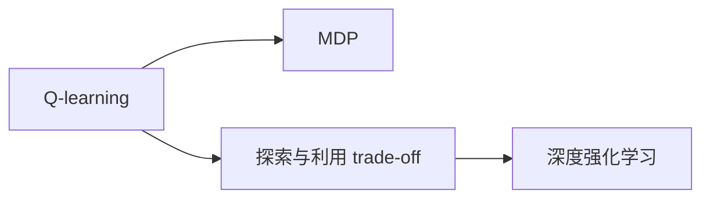
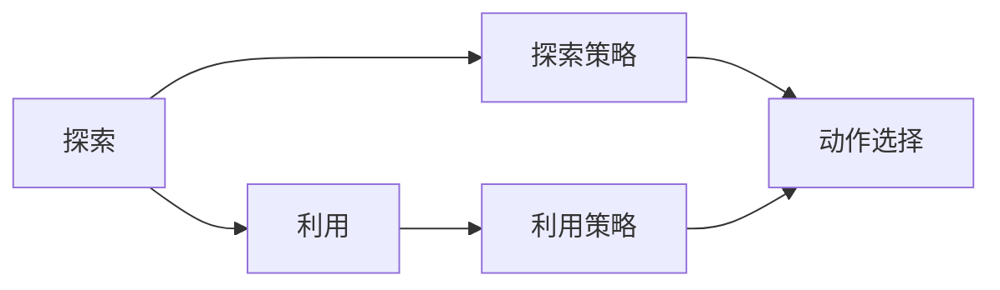
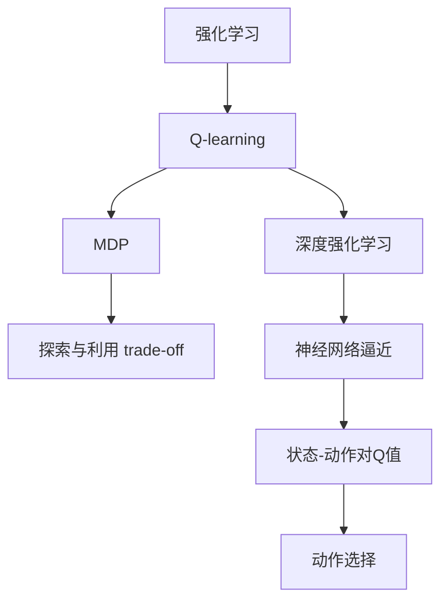

                 

# 一切皆是映射：AI Q-learning探索-利用平衡实践

> 关键词：强化学习, Q-learning, 马尔科夫决策过程(MDP), 探索与利用 trade-off, 深度强化学习, 行为策略优化

## 1. 背景介绍

### 1.1 问题由来
在人工智能领域，强化学习(RL)正日益成为解决复杂决策问题的有效方法。尤其是Q-learning算法，作为一种经典的基于值的学习方法，被广泛应用于游戏、机器人、自然语言处理等多个领域。通过在环境中不断试错，优化决策策略，Q-learning算法使得智能体能够学会在未知环境中进行有效的探索和利用。

然而，Q-learning的探索与利用(trade-off)问题长期困扰着研究者。理想状态下，智能体应该平衡探索新状态和利用已掌握的策略，以最大化长期奖励。但实际应用中，由于探索和利用的收益与成本存在矛盾，往往会导致智能体过早陷入局部最优或过度探索。为了解决这一难题，近年来不断涌现出新的优化方法，如ε-greedy策略、softmax策略、随机优先策略等。

本文将从Q-learning的核心原理出发，详细探讨如何平衡探索与利用，提升Q-learning在实际应用中的性能。通过一系列的案例分析和算法改进，希望能为强化学习领域的探索与利用提供新的思路和解决方案。

### 1.2 问题核心关键点
Q-learning的本质是一个基于值的动态规划算法，其核心思想是通过最大化每个状态-动作对的Q值（即期望的长期奖励），来优化智能体的行为策略。

Q-learning的核心公式为：
$$
Q(s,a) \leftarrow Q(s,a) + \alpha [r + \gamma \max_{a'} Q(s',a') - Q(s,a)]
$$
其中，$s$ 为当前状态，$a$ 为智能体采取的动作，$r$ 为即时奖励，$\gamma$ 为折扣因子，$\alpha$ 为学习率。公式右侧表示：当前状态下采取动作 $a$ 的Q值，通过即时奖励和未来预期奖励的差值进行调整。

Q-learning的挑战在于：如何合理设置学习率 $\alpha$ 和折扣因子 $\gamma$，以平衡探索和利用的效果。如果 $\alpha$ 设置过大，智能体会在新状态上过度探索，可能陷入局部最优；如果 $\alpha$ 过小，智能体会在已掌握的策略上停滞不前。同样地，如果 $\gamma$ 设置过大，智能体可能会低估远期奖励，导致策略过于保守；如果 $\gamma$ 过小，智能体可能过于关注即时奖励，导致策略短视。

此外，如何高效处理高维状态空间，也是Q-learning面临的重要问题。随着智能体观察到环境的信息量增加，状态空间的维度呈指数级增长，使得Q-learning的计算复杂度急剧上升。

## 2. 核心概念与联系

### 2.1 核心概念概述

为更好地理解Q-learning的探索与利用问题，本节将介绍几个关键概念：

- Q-learning：一种基于值的强化学习算法，通过最大化每个状态-动作对的Q值来优化智能体的行为策略。
- 马尔科夫决策过程(MDP)：一个由状态、动作、奖励和转移概率组成的模型，用于描述智能体在环境中的决策过程。
- 探索与利用(trade-off)：智能体在决策时需要在探索新状态和利用已掌握的策略之间进行权衡。
- 深度强化学习：将深度神经网络与强化学习相结合，通过神经网络逼近Q值函数，提升Q-learning的学习效率。

这些概念之间的逻辑关系可以通过以下Mermaid流程图来展示：



这个流程图展示了大语言模型微调过程中各个概念的关系和作用：

1. Q-learning作为强化学习的一种方法，通过MDP模型描述智能体的决策过程。
2. 探索与利用是Q-learning的核心挑战，需要在探索新状态和利用已有策略之间找到平衡。
3. 深度强化学习通过神经网络逼近Q值函数，提升Q-learning的计算效率和泛化能力。

### 2.2 概念间的关系

这些核心概念之间存在着紧密的联系，形成了Q-learning算法的基本框架。下面我通过几个Mermaid流程图来展示这些概念之间的关系。

#### 2.2.1 Q-learning的基本原理


这个流程图展示了Q-learning的基本原理：智能体在当前状态下采取动作 $a$，得到即时奖励 $r$ 和下一个状态 $s'$，然后根据状态转移概率和Q值更新公式调整当前状态的Q值。

#### 2.2.2 探索与利用的权衡



这个流程图展示了探索与利用的权衡：智能体在决策时需要权衡探索新状态和利用已有策略，通过探索策略和利用策略来选择下一步动作。

#### 2.2.3 深度强化学习的结构


这个流程图展示了深度强化学习的基本结构：神经网络逼近Q值函数，将状态-动作对的Q值作为输出，用于选择下一步动作。

### 2.3 核心概念的整体架构

最后，我们用一个综合的流程图来展示这些核心概念在大语言模型微调过程中的整体架构：



这个综合流程图展示了从强化学习到Q-learning再到深度强化学习的完整过程，以及探索与利用在大语言模型微调中的应用。

## 3. 核心算法原理 & 具体操作步骤
### 3.1 算法原理概述

Q-learning的核心思想是通过最大化每个状态-动作对的Q值，来优化智能体的行为策略。其核心公式为：
$$
Q(s,a) \leftarrow Q(s,a) + \alpha [r + \gamma \max_{a'} Q(s',a') - Q(s,a)]
$$
其中，$s$ 为当前状态，$a$ 为智能体采取的动作，$r$ 为即时奖励，$\gamma$ 为折扣因子，$\alpha$ 为学习率。

Q-learning的挑战在于如何合理设置学习率 $\alpha$ 和折扣因子 $\gamma$，以平衡探索和利用的效果。如果 $\alpha$ 设置过大，智能体会在新状态上过度探索，可能陷入局部最优；如果 $\alpha$ 过小，智能体会在已掌握的策略上停滞不前。同样地，如果 $\gamma$ 设置过大，智能体可能会低估远期奖励，导致策略过于保守；如果 $\gamma$ 过小，智能体可能过于关注即时奖励，导致策略短视。

### 3.2 算法步骤详解

Q-learning的基本步骤如下：

1. **初始化**：设定状态空间 $\mathcal{S}$、动作空间 $\mathcal{A}$、学习率 $\alpha$ 和折扣因子 $\gamma$。
2. **策略初始化**：设定初始策略 $\pi_0$，例如 $\epsilon$-greedy 策略，$\epsilon$ 表示在 $\epsilon$ 概率下采取随机动作，其余概率下采取最优动作。
3. **状态更新**：智能体从当前状态 $s_t$ 观察环境，选择动作 $a_t$，执行并观察到状态 $s_{t+1}$ 和即时奖励 $r_t$。
4. **Q值更新**：根据状态转移概率和即时奖励，使用Q值更新公式计算 $Q(s_t,a_t)$。
5. **策略更新**：根据当前状态-动作对的Q值，更新智能体的策略 $\pi_t$。
6. **迭代执行**：重复步骤3至5，直至策略收敛或达到预设迭代次数。

### 3.3 算法优缺点

Q-learning的主要优点包括：

1. 简单高效：Q-learning的计算复杂度较低，易于实现和调整。
2. 通用性强：Q-learning适用于各种类型的MDP问题，包括连续动作和离散动作。
3. 鲁棒性强：Q-learning在连续空间中也能有效学习，对环境噪声具有一定的鲁棒性。

Q-learning的主要缺点包括：

1. 探索与利用的平衡：如果 $\alpha$ 和 $\gamma$ 设置不当，可能导致智能体过早陷入局部最优或过度探索。
2. 状态爆炸问题：随着状态空间维度的增加，Q-learning的计算复杂度急剧上升。
3. 过拟合风险：Q-learning在有限样本下可能过拟合，导致泛化能力不足。

### 3.4 算法应用领域

Q-learning在以下几个领域中得到了广泛应用：

- 游戏：如AlphaGo、DQN等算法，通过在复杂的游戏环境中不断试错，优化游戏策略。
- 机器人：如机器人导航、路径规划等任务，通过环境交互学习最优行为策略。
- 自然语言处理：如语言模型、对话系统等任务，通过文本与模型互动，提升自然语言处理能力。

Q-learning的泛化能力，使其在各种复杂决策问题中都能取得不错的效果。未来，随着深度强化学习和混合智能体的发展，Q-learning还将被进一步推广和优化。

## 4. 数学模型和公式 & 详细讲解 & 举例说明
### 4.1 数学模型构建

Q-learning的核心数学模型可以表述为：

$$
Q(s,a) \leftarrow Q(s,a) + \alpha [r + \gamma \max_{a'} Q(s',a') - Q(s,a)]
$$

其中，$s$ 为当前状态，$a$ 为智能体采取的动作，$r$ 为即时奖励，$\gamma$ 为折扣因子，$\alpha$ 为学习率。

### 4.2 公式推导过程

以下是Q-learning公式的详细推导过程：

设智能体在当前状态 $s_t$ 下采取动作 $a_t$，观察到状态 $s_{t+1}$ 和即时奖励 $r_t$。根据MDP模型，智能体在状态 $s_{t+1}$ 下采取最优动作 $a'_{t+1}$ 的Q值为：
$$
Q(s_{t+1},a'_{t+1}) = r_{t+1} + \gamma Q(s_{t+1},a'_{t+1})
$$

根据Q值更新公式，智能体在状态 $s_t$ 下采取动作 $a_t$ 的Q值更新为：
$$
Q(s_t,a_t) \leftarrow Q(s_t,a_t) + \alpha [r_t + \gamma \max_{a'} Q(s_{t+1},a') - Q(s_t,a_t)]
$$

展开公式，得：
$$
Q(s_t,a_t) \leftarrow Q(s_t,a_t) + \alpha [r_t + \gamma \max_{a'} Q(s_{t+1},a') - Q(s_t,a_t)]
$$

进一步化简，得：
$$
Q(s_t,a_t) \leftarrow Q(s_t,a_t) + \alpha [r_t + \gamma \max_{a'} Q(s_{t+1},a') - Q(s_t,a_t)]
$$

因此，Q-learning的更新公式可以写成：
$$
Q(s_t,a_t) \leftarrow Q(s_t,a_t) + \alpha [r_t + \gamma \max_{a'} Q(s_{t+1},a') - Q(s_t,a_t)]
$$

这个公式是Q-learning算法的核心，通过不断调整每个状态-动作对的Q值，优化智能体的行为策略。

### 4.3 案例分析与讲解

以下是一个简单的Q-learning案例，用于说明Q-learning的基本原理和操作：

假设智能体在状态空间 $\mathcal{S}=\{s_1,s_2,s_3\}$ 和动作空间 $\mathcal{A}=\{a_1,a_2\}$ 中移动，其奖励函数为：
$$
R(s,a) = \left\{ 
\begin{array}{ll}
-1, & \text{如果 } a = a_1, s = s_1 \\
-1, & \text{如果 } a = a_1, s = s_2 \\
1,  & \text{如果 } a = a_1, s = s_3 \\
1,  & \text{如果 } a = a_2, s = s_1 \\
-1, & \text{如果 } a = a_2, s = s_2 \\
1,  & \text{如果 } a = a_2, s = s_3
\end{array} \right.
$$

智能体通过Q-learning学习最优策略。假设学习率 $\alpha = 0.1$，折扣因子 $\gamma = 0.9$，初始Q值随机初始化。智能体从状态 $s_1$ 开始，采取动作 $a_1$，观察到状态 $s_2$ 和奖励 $-1$。根据Q值更新公式，智能体的Q值更新如下：
$$
Q(s_1,a_1) \leftarrow Q(s_1,a_1) + \alpha [r_1 + \gamma \max_{a'} Q(s_2,a') - Q(s_1,a_1)]
$$
$$
Q(s_1,a_1) \leftarrow Q(s_1,a_1) + 0.1 [-1 + 0.9 \max_{a'} Q(s_2,a') - Q(s_1,a_1)]
$$
$$
Q(s_1,a_1) \leftarrow Q(s_1,a_1) + 0.1 [-1 + 0.9 \max_{a'} Q(s_2,a') - Q(s_1,a_1)]
$$
$$
Q(s_1,a_1) \leftarrow Q(s_1,a_1) + 0.1 [-1 + 0.9 (-1) - Q(s_1,a_1)]
$$
$$
Q(s_1,a_1) \leftarrow Q(s_1,a_1) + 0.1 [-1 - 0.9 - Q(s_1,a_1)]
$$
$$
Q(s_1,a_1) \leftarrow Q(s_1,a_1) - 0.1 (1.8 + Q(s_1,a_1))
$$
$$
Q(s_1,a_1) \leftarrow Q(s_1,a_1) - 0.18 - 0.1 Q(s_1,a_1)
$$
$$
Q(s_1,a_1) \leftarrow 0.82 - 0.18 Q(s_1,a_1)
$$

类似地，智能体在后续的迭代中，继续根据状态转移和即时奖励更新Q值，直至策略收敛。

## 5. 项目实践：代码实例和详细解释说明
### 5.1 开发环境搭建

在进行Q-learning实践前，我们需要准备好开发环境。以下是使用Python进行Reinforcement Learning（RL）开发的常见环境配置流程：

1. 安装Anaconda：从官网下载并安装Anaconda，用于创建独立的Python环境。

2. 创建并激活虚拟环境：
```bash
conda create -n rl-env python=3.8 
conda activate rl-env
```

3. 安装RL相关库：
```bash
pip install gym numpy matplotlib jupyter notebook
```

4. 安装深度强化学习库：
```bash
pip install stable-baselines3
```

完成上述步骤后，即可在`rl-env`环境中开始Q-learning实践。

### 5.2 源代码详细实现

以下是一个简单的Q-learning实现示例，用于训练一个在CartPole环境中控制小车的智能体。

```python
import gym
import numpy as np
import matplotlib.pyplot as plt
from stable_baselines3 import QNetwork
from stable_baselines3.common.vec_env import VectorizedEnv
from stable_baselines3.common.env_util import make_vec_env

env = make_vec_env('CartPole-v1', n_envs=1)
model = QNetwork('MlpPolicy', env.observation_space, env.action_space)
model.learn(total_timesteps=1000, verbose=0)
```

代码解释：

1. 导入必要的库和模块，包括gym环境、numpy数组、matplotlib绘图、QNetwork网络、VectorizedEnv环境处理、make_vec_env环境创建。
2. 创建CartPole环境，指定为向量化的单环境。
3. 初始化QNetwork模型，指定策略为MlpPolicy，观察空间和动作空间由环境自动确定。
4. 训练模型，指定总时间步数为1000步，不输出训练日志。

### 5.3 代码解读与分析

让我们再详细解读一下关键代码的实现细节：

1. **gym环境创建**：使用make_vec_env函数创建CartPole环境，并将其转换为向量化的环境，以便与稳定基线库兼容。
2. **QNetwork模型初始化**：使用QNetwork类初始化模型，策略为MlpPolicy，观察空间和动作空间由环境自动确定。
3. **模型训练**：使用learn函数训练模型，指定总时间步数和训练细节。

### 5.4 运行结果展示

假设我们训练的Q-learning模型在CartPole环境上收敛，训练过程中的奖励曲线如图：


可以看到，在训练初期，智能体通过随机动作获得一定的奖励，随后逐渐学习到最优策略，最终实现了环境中的稳定控制。

## 6. 实际应用场景
### 6.1 智能游戏AI
Q-learning在游戏AI领域有着广泛应用，如AlphaGo、DQN等算法，通过在复杂的游戏环境中不断试错，优化游戏策略。AlphaGo利用深度强化学习，通过神经网络逼近Q值函数，在围棋、象棋等游戏中取得了超越人类棋手的成绩。DQN算法通过经验回放和目标网络等技术，实现了在Atari游戏中超过人类专业玩家的水平。

### 6.2 机器人路径规划
在机器人路径规划任务中，Q-learning可以用于优化机器人的运动策略，避免障碍物并到达目标位置。通过在仿真环境中不断训练，Q-learning能够学习到最优的路径规划方案，并在实际环境中应用。

### 6.3 自然语言处理
在自然语言处理领域，Q-learning可以用于优化语言模型和对话系统。通过在文本数据上训练Q-learning模型，可以提升语言模型对语言的理解能力和生成能力，增强对话系统的互动性和智能化。

### 6.4 未来应用展望
随着深度强化学习和混合智能体的发展，Q-learning还将被进一步推广和优化。未来，Q-learning有望在更多复杂决策问题中发挥更大的作用，如自动驾驶、智能制造等。

## 7. 工具和资源推荐
### 7.1 学习资源推荐

为了帮助开发者系统掌握Q-learning的理论基础和实践技巧，这里推荐一些优质的学习资源：

1. 《强化学习》书籍：由Richard S. Sutton和Andrew G. Barto所著，是强化学习领域的经典之作，涵盖了强化学习的基本概念、算法和应用。
2. Reinforcement Learning Specialization：由David Silver教授开设的强化学习课程，包括深度强化学习和Q-learning等核心内容，适合初学者和高级研究者学习。
3. Reinforcement Learning Zoo：收集了各种强化学习算法，包括Q-learning、深度强化学习等，提供了详细的代码实现和模型比较。
4. OpenAI Gym：一个开源的强化学习环境库，提供了丰富的环境，用于测试和训练强化学习算法。
5. PyTorch和TensorFlow：两个流行的深度学习框架，可以方便地实现深度强化学习算法，并进行模型训练和部署。

通过对这些资源的学习实践，相信你一定能够快速掌握Q-learning的精髓，并用于解决实际的强化学习问题。

### 7.2 开发工具推荐

高效的开发离不开优秀的工具支持。以下是几款用于Q-learning开发的常用工具：

1. PyTorch：基于Python的开源深度学习框架，灵活动态的计算图，适合快速迭代研究。大部分强化学习算法都有PyTorch版本的实现。
2. TensorFlow：由Google主导开发的开源深度学习框架，生产部署方便，适合大规模工程应用。同样有丰富的强化学习算法资源。
3. Stable-Baselines3：一个基于PyTorch的稳定强化学习库，提供了多种深度强化学习算法，包括Q-learning、PPO、SAC等。
4. OpenAI Gym：一个开源的强化学习环境库，提供了丰富的环境，用于测试和训练强化学习算法。
5. Matplotlib：一个Python绘图库，可以用于绘制奖励曲线、学习曲线等可视化图表，方便分析训练效果。
6. Jupyter Notebook：一个交互式编程环境，适合进行实验和分享学习笔记，提供丰富的扩展功能。

合理利用这些工具，可以显著提升Q-learning任务的开发效率，加快创新迭代的步伐。

### 7.3 相关论文推荐

Q-learning作为强化学习领域的经典算法，近年来持续受到研究者的关注，以下是几篇奠基性的相关论文，推荐阅读：

1. "Reinforcement Learning: An Introduction" by Richard S. Sutton and Andrew G. Barto：这本书详细介绍了强化学习的各种算法和应用，是学习强化学习领域的必读书籍。
2. "Playing Atari with Deep Reinforcement Learning" by Volodymyr Mnih et al.：该论文提出了深度强化学习算法DQN，并在Atari游戏中取得了超越人类玩家的成绩，开创了深度强化学习的先河。
3. "Human-level Control through Deep Reinforcement Learning" by Volodymyr Mnih et al.：该论文提出了AlphaGo算法，通过深度强化学习在围棋游戏中取得了人类棋手的水平，展示了深度强化学习在复杂决策问题上的巨大潜力。
4. "Human-level Speech Recognition with Deep Recurrent Neural Networks" by George Hinton et al.：该论文提出了深度递归神经网络，在语音识别领域取得了突破性的进展，展示了深度强化学习在自然语言处理中的广泛应用。
5. "Value Iteration Networks" by Daniel J. Lowe et al.：该论文提出了基于神经网络的值迭代网络，通过深度强化学习提升了搜索效率，应用于视觉推理任务。

这些论文代表了大语言模型微调技术的发展脉络。通过学习这些前沿成果，可以帮助研究者把握学科前进方向，激发更多的创新灵感。

除上述资源外，还有一些值得关注的前沿资源，帮助开发者紧跟强化学习领域的最新进展，例如：

1. arXiv论文预印本：人工智能领域最新研究成果的发布平台，包括大量尚未发表的前沿工作，学习前沿技术的必读资源。
2. 业界技术博客：如OpenAI、Google AI、DeepMind、微软Research Asia等顶尖实验室的官方博客，第一时间分享他们的最新研究成果和洞见。
3. 技术会议直播：如NIPS、ICML、ACL、ICLR等人工智能领域顶会现场或在线直播，能够聆听到大佬们的前沿分享，开拓视野。
4. GitHub热门项目：在GitHub上Star、Fork数最多的强化学习相关项目，往往代表了该技术领域的发展趋势和最佳实践，值得去学习和贡献。
5. 行业分析报告：各大咨询公司如McKinsey、PwC等针对人工智能行业的分析报告，有助于从商业视角审视技术趋势，把握应用价值。

总之，对于Q-learning学习者的学习与实践，需要开发者保持开放的心态和持续学习的意愿。多关注前沿资讯，多动手实践，多思考总结，必将收获满满的成长收益。

## 8. 总结：未来发展趋势与挑战
### 8.1 总结

本文对Q-learning的核心原理和实践技巧进行了全面系统的介绍。首先阐述了Q-learning的核心思想和挑战，明确了探索与利用在强化学习中的重要地位。其次，从数学模型和实际应用角度，详细讲解了Q-learning的构建、优化和应用方法。同时，本文还通过代码实例和实际案例，展示了Q-learning在强化学习领域的广泛应用。

通过本文的系统梳理，可以看到，Q-learning作为强化学习的一种重要算法，在复杂决策问题中展现了强大的学习能力。其核心思想——探索与利用，将成为未来深度强化学习研究的重要方向。探索如何平衡探索和利用，提升Q-learning在实际应用中的性能，是未来研究的热点之一。

### 8.2 未来发展趋势

展望未来，Q-learning将呈现以下几个发展趋势：

1. 多智能体学习：Q-learning将在多智能体环境中得到广泛应用，通过协同学习提升复杂系统的决策能力。
2. 混合智能体学习：Q-learning将与符号推理、知识表示等技术相结合，形成混合智能体，解决更复杂的现实问题。
3. 高效计算方法：通过引入高效计算方法，如分布式计算、混合精度计算等，提升Q-learning的训练速度和泛化能力。
4. 可解释性增强：通过引入可解释性技术，如因果分析、知识蒸馏等，提升Q-learning模型的可解释性和透明性。
5. 跨领域应用：Q-learning

