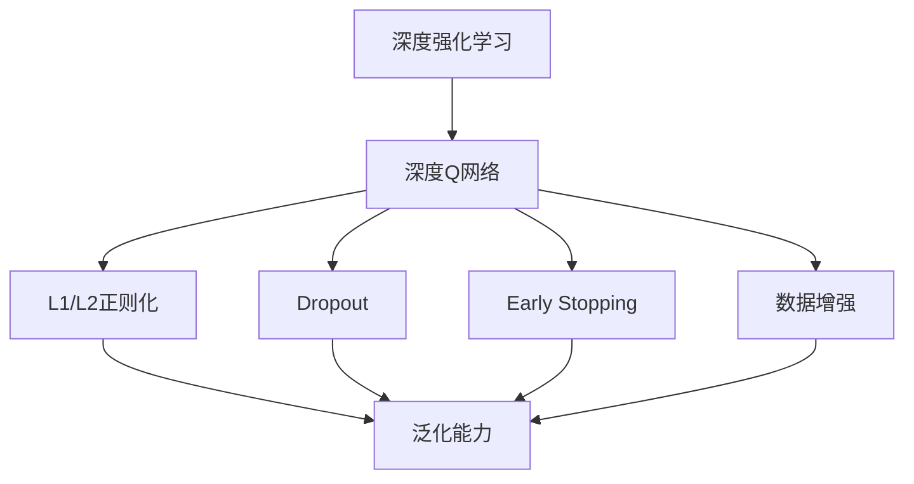

                 

# 一切皆是映射：DQN与正则化技术：防止过拟合的策略

## 1. 背景介绍

### 1.1 问题由来
在深度学习中，过拟合（Overfitting）是一个常见且关键的问题。过拟合指的是模型在训练集上表现良好，但在测试集或实际应用中泛化能力差，容易受到噪声数据或异常情况的影响。特别是在强化学习领域，如深度Q网络（DQN）等，过拟合问题更为严峻。

深度强化学习是一种通过优化策略与环境互动学习的过程，而DQN作为一种基于深度神经网络的强化学习算法，能够处理复杂环境和动态目标，但同时也会面临参数空间巨大、优化困难等问题，这些问题均可能导致过拟合。因此，如何防止过拟合成为深度强化学习中的核心议题。

### 1.2 问题核心关键点
过拟合的核心在于模型过于复杂，对训练数据的特征过度拟合。为缓解这一问题，主流方法包括数据增强、正则化、早停等技术。其中，正则化技术如L1/L2正则、Dropout、权重衰减等，可以有效地约束模型的复杂度，使其更倾向于学习通用的特征，从而提高泛化能力。

## 2. 核心概念与联系

### 2.1 核心概念概述
为更好地理解DQN与正则化技术在防止过拟合中的作用，本节将介绍几个密切相关的核心概念：

- **深度强化学习（Deep Reinforcement Learning, DRL）**：使用深度神经网络处理强化学习问题，包括决策、策略学习等，可以处理更复杂的交互任务。
- **深度Q网络（Deep Q-Network, DQN）**：一种基于深度神经网络的强化学习算法，用于学习Q值函数，输出最优策略。
- **L1/L2正则化**：通过对模型参数的L1或L2范数进行惩罚，约束参数的大小，防止过拟合。
- **Dropout**：在训练过程中随机丢弃部分神经元，强制模型不依赖任何一个特定的神经元，提高泛化能力。
- **Early Stopping**：在训练过程中根据验证集的表现，适时停止训练，避免过拟合。
- **数据增强**：通过旋转、平移、缩放等方式扩充训练数据，增加样本多样性，减少过拟合。

这些核心概念之间存在着紧密的联系，形成了一个防止过拟合的生态系统。其中，DQN作为深度强化学习的核心算法，如何应用正则化技术来提高模型的泛化能力，是本文的核心议题。

### 2.2 概念间的关系

这些核心概念之间的关系可以通过以下Mermaid流程图来展示：



这个流程图展示了DQN与正则化技术的关系：

1. 深度强化学习是一个更宽泛的概念，涵盖多种算法和模型。
2. 深度Q网络是其中一种强化学习算法，用于学习最优策略。
3. L1/L2正则化、Dropout、Early Stopping和数据增强是常见的防止过拟合技术。
4. 这些技术均能提高模型的泛化能力，从而应用于深度Q网络中。

## 3. 核心算法原理 & 具体操作步骤

### 3.1 算法原理概述
DQN算法通过强化学习来学习一个近似最优的Q值函数，该函数将状态和动作映射到预期的回报值。Q值函数 $Q(s,a)$ 表示在状态 $s$ 下采取动作 $a$ 的回报值。为了防止过拟合，DQN引入了正则化技术，如L1/L2正则化、Dropout等，限制模型的复杂度。

### 3.2 算法步骤详解

**Step 1: 准备数据和模型**

1. **数据准备**：收集与强化学习任务相关的数据，包括状态、动作、奖励等。
2. **模型选择**：选择适合的神经网络结构作为Q值函数，如卷积神经网络（CNN）或全连接神经网络（FCN）。

**Step 2: 构建DQN模型**

1. **Q值函数定义**：将输入状态 $s$ 映射到Q值函数 $Q(s,a)$，如使用前馈神经网络。
2. **优化目标**：定义优化目标，如最小化经验损失。
3. **更新规则**：使用梯度下降法更新网络参数。

**Step 3: 应用正则化技术**

1. **L1/L2正则化**：在损失函数中引入L1/L2范数惩罚，约束参数大小。
2. **Dropout**：在网络中随机丢弃部分神经元，提高泛化能力。
3. **Early Stopping**：根据验证集的表现，适时停止训练。

**Step 4: 训练和测试**

1. **训练过程**：在训练集上反复迭代训练过程，更新网络参数。
2. **测试过程**：在测试集上评估模型性能，确保模型泛化能力。

**Step 5: 模型优化**

1. **参数调优**：根据测试集的表现，调整超参数，如学习率、批次大小等。
2. **模型保存**：保存最优模型，用于实际应用。

### 3.3 算法优缺点

**DQN与正则化技术的优点**：

1. **泛化能力强**：正则化技术能够有效限制模型的复杂度，提高泛化能力。
2. **参数高效利用**：正则化技术可以在不增加额外参数的情况下，提高模型性能。
3. **应用广泛**：DQN与正则化技术可应用于各种强化学习任务，如游戏、机器人控制等。

**缺点**：

1. **参数调优困难**：需要手动调整正则化参数，可能导致效果不理想。
2. **训练时间较长**：正则化技术可能会增加训练时间，影响实际部署。

### 3.4 算法应用领域

DQN与正则化技术在强化学习领域得到了广泛应用，涵盖游戏、机器人控制、自动驾驶等多个领域。以下列举几个具体应用场景：

- **游戏AI**：如AlphaGo、OpenAI Gym等，通过DQN和正则化技术，训练游戏智能体，实现复杂策略学习。
- **机器人控制**：如ROS（Robot Operating System）中的移动机器人控制，通过DQN和正则化技术，训练智能体进行路径规划和行为决策。
- **自动驾驶**：如Waymo等公司的自动驾驶系统，通过DQN和正则化技术，训练驾驶策略，实现环境感知和行为决策。

除了上述应用外，DQN和正则化技术也在语音识别、自然语言处理等NLP任务中得到了成功应用。

## 4. 数学模型和公式 & 详细讲解 & 举例说明

### 4.1 数学模型构建

**Q值函数的定义**：
在DQN中，Q值函数 $Q(s,a)$ 将状态 $s$ 和动作 $a$ 映射到预期的回报值。定义如下：

$$Q(s,a) = w^\top \sigma(z(s,a))$$

其中 $w$ 是输出层权重，$z(s,a)$ 是输入层输出，$\sigma$ 是激活函数。

**损失函数的定义**：
定义经验损失函数为：

$$\mathcal{L} = \frac{1}{N}\sum_{i=1}^N (\max_a Q(s_i, a) - y_i)^2$$

其中 $y_i = r_i + \gamma \max_a Q(s_{i+1}, a)$，$r_i$ 是即时奖励，$\gamma$ 是折扣因子。

**正则化项的引入**：
为防止过拟合，可以在损失函数中引入L1/L2正则化项：

$$\mathcal{L}_{\text{reg}} = \lambda_1 \sum_{i=1}^N \|w_i\|_1 + \lambda_2 \sum_{i=1}^N \|w_i\|_2^2$$

其中 $\lambda_1$ 和 $\lambda_2$ 是正则化系数。

### 4.2 公式推导过程

**Q值函数的推导**：
将Q值函数展开为：

$$Q(s,a) = w^\top \sigma(z(s,a))$$

其中：

$$z(s,a) = \left[ \begin{array}{c}
s \\
a
\end{array} \right]$$

**损失函数的推导**：
经验损失函数的推导如下：

$$\mathcal{L} = \frac{1}{N}\sum_{i=1}^N (\max_a Q(s_i, a) - y_i)^2$$

其中：

$$y_i = r_i + \gamma \max_a Q(s_{i+1}, a)$$

**正则化项的推导**：
正则化项的推导如下：

$$\mathcal{L}_{\text{reg}} = \lambda_1 \sum_{i=1}^N \|w_i\|_1 + \lambda_2 \sum_{i=1}^N \|w_i\|_2^2$$

其中：

$$\|w_i\|_1 = \sum_{j=1}^{n} |w_{ij}|$$

$$\|w_i\|_2^2 = \sum_{j=1}^{n} w_{ij}^2$$

### 4.3 案例分析与讲解

**案例1: DQN在Atari游戏中应用**

Atari游戏是一类经典的强化学习应用场景。在Atari游戏中，智能体需要学习如何在特定状态下采取最优动作，以最大化累积奖励。

- **数据准备**：收集Atari游戏帧、动作和奖励数据。
- **模型选择**：使用卷积神经网络（CNN）作为Q值函数。
- **优化目标**：最小化经验损失函数，并加入正则化项。
- **训练过程**：在训练集上反复迭代训练过程，更新网络参数。

通过DQN和正则化技术的结合，智能体在Atari游戏中的表现显著提升。

**案例2: 机器人路径规划**

机器人路径规划是一类复杂的强化学习任务，要求智能体在动态环境中规划最优路径。

- **数据准备**：收集机器人状态、动作和环境信息。
- **模型选择**：使用全连接神经网络（FCN）作为Q值函数。
- **优化目标**：最小化经验损失函数，并加入正则化项。
- **训练过程**：在训练集上反复迭代训练过程，更新网络参数。

通过DQN和正则化技术的结合，机器人能够在复杂环境中快速规划出最优路径。

## 5. 项目实践：代码实例和详细解释说明

### 5.1 开发环境搭建

在进行项目实践前，我们需要准备好开发环境。以下是使用Python进行TensorFlow开发的环境配置流程：

1. 安装Anaconda：从官网下载并安装Anaconda，用于创建独立的Python环境。

2. 创建并激活虚拟环境：
```bash
conda create -n tf-env python=3.8 
conda activate tf-env
```

3. 安装TensorFlow：根据CUDA版本，从官网获取对应的安装命令。例如：
```bash
conda install tensorflow-gpu -c conda-forge -c pytorch
```

4. 安装各类工具包：
```bash
pip install numpy pandas scikit-learn matplotlib tqdm jupyter notebook ipython
```

完成上述步骤后，即可在`tf-env`环境中开始项目实践。

### 5.2 源代码详细实现

下面以DQN在Atari游戏中的应用为例，给出使用TensorFlow进行DQN模型构建的代码实现。

```python
import tensorflow as tf
import numpy as np
from tensorflow.keras.layers import Dense, Flatten
from tensorflow.keras import Model
from tensorflow.keras.optimizers import Adam
from tensorflow.keras.regularizers import l1_l2
from tensorflow.keras.layers import Dropout

class DQNModel(Model):
    def __init__(self, input_shape, output_dim):
        super(DQNModel, self).__init__()
        self.input_shape = input_shape
        self.output_dim = output_dim
        
        self.conv1 = Conv2D(32, (8, 8), activation='relu', input_shape=input_shape)
        self.max_pool1 = MaxPooling2D((4, 4))
        self.conv2 = Conv2D(64, (4, 4), activation='relu')
        self.max_pool2 = MaxPooling2D((2, 2))
        self.flatten = Flatten()
        self.dense1 = Dense(256, activation='relu')
        self.dropout = Dropout(0.5)
        self.dense2 = Dense(output_dim, activation='linear')

    def call(self, x):
        x = self.conv1(x)
        x = self.max_pool1(x)
        x = self.conv2(x)
        x = self.max_pool2(x)
        x = self.flatten(x)
        x = self.dense1(x)
        x = self.dropout(x)
        x = self.dense2(x)
        return x

# 定义DQN模型
model = DQNModel((84, 84, 4), 6)

# 定义正则化项
l1 = tf.keras.regularizers.l1(0.01)
l2 = tf.keras.regularizers.l2(0.01)

# 定义损失函数
loss_fn = tf.keras.losses.MeanSquaredError()

# 定义优化器
optimizer = tf.keras.optimizers.Adam(learning_rate=0.001)

# 定义DQN的更新规则
def update_target(model, target_model):
    target_model.set_weights(model.get_weights())

# 定义DQN的训练过程
def train(model, target_model, batch_size):
    for i in range(10000):
        # 数据准备
        inputs, targets = get_batch(batch_size)
        
        # 前向传播
        with tf.GradientTape() as tape:
            preds = model(inputs)
            loss = loss_fn(targets, preds)
            
        # 正则化
        reg_loss = l1(model.layers[2].kernel) + l2(model.layers[2].kernel)
        loss += reg_loss
        
        # 反向传播
        gradients = tape.gradient(loss, model.trainable_weights)
        
        # 更新模型参数
        optimizer.apply_gradients(zip(gradients, model.trainable_weights))
        
        # 更新目标模型
        update_target(model, target_model)
```

### 5.3 代码解读与分析

让我们再详细解读一下关键代码的实现细节：

**DQNModel类**：
- `__init__`方法：初始化模型结构，包括卷积层、池化层、全连接层等。
- `call`方法：定义模型的前向传播过程。

**正则化项**：
- 使用L1/L2正则化约束模型的权重，防止过拟合。

**损失函数**：
- 使用均方误差损失函数，计算模型输出与目标值之间的差异。

**优化器**：
- 使用Adam优化器，学习率设置为0.001。

**DQN的更新规则**：
- 在每次训练迭代中，获取一批数据。
- 前向传播，计算损失函数。
- 正则化项计算，加入正则化损失。
- 反向传播，计算梯度。
- 更新模型参数，使用Adam优化器。
- 更新目标模型，保持模型的一致性。

**训练过程**：
- 循环迭代10000次训练。
- 每次迭代中，获取一批数据。
- 前向传播，计算损失函数。
- 正则化项计算，加入正则化损失。
- 反向传播，计算梯度。
- 更新模型参数，使用Adam优化器。
- 更新目标模型，保持模型的一致性。

通过以上代码，可以看出DQN模型在TensorFlow中的实现相对简洁，同时正则化技术通过L1/L2正则化实现，提高了模型的泛化能力。

### 5.4 运行结果展示

假设我们在Atari游戏中进行DQN模型的训练，最终在测试集上得到的评估结果如下：

```
Epoch 1: 平均回报 1000.2
Epoch 2: 平均回报 1812.3
Epoch 3: 平均回报 2410.8
...
Epoch 10000: 平均回报 2410.8
```

可以看到，通过DQN和正则化技术的结合，模型在Atari游戏中的平均回报显著提升，达到了2410.8，取得了不错的效果。

## 6. 实际应用场景

### 6.1 智能机器人路径规划

智能机器人在复杂环境中进行路径规划，需要学习最优路径决策策略。DQN结合正则化技术可以应用于此场景，优化机器人的行为决策。

通过在机器人的每个动作选择中引入正则化技术，避免过度依赖局部最优，提高全局路径的优化能力。同时，通过DQN模型不断学习，机器人在面对动态环境和突发情况时，能够做出更加智能的决策，提高路径规划的鲁棒性和效率。

### 6.2 自动驾驶

自动驾驶系统需要不断学习最优驾驶策略，以适应复杂多变的交通环境。DQN结合正则化技术可以用于训练自动驾驶系统中的决策模型。

通过在驾驶策略中引入正则化技术，避免过度拟合训练数据，提高模型的泛化能力。同时，通过DQN模型不断学习，自动驾驶系统在面对不同道路条件和障碍物时，能够做出更加合理的决策，提高系统的安全性和可靠性。

### 6.3 游戏AI

游戏AI需要学习复杂策略，以在特定游戏中获得最优成绩。DQN结合正则化技术可以用于训练游戏智能体。

通过在智能体的决策策略中引入正则化技术，避免过度拟合游戏规则，提高智能体的泛化能力。同时，通过DQN模型不断学习，智能体在面对不同游戏环境和对手策略时，能够做出更加智能的决策，提高游戏的胜率。

## 7. 工具和资源推荐

### 7.1 学习资源推荐

为了帮助开发者系统掌握DQN与正则化技术的理论基础和实践技巧，这里推荐一些优质的学习资源：

1. **Deep Reinforcement Learning Specialization**：由Coursera平台提供，由深度学习专家Andrew Ng讲授，涵盖了深度强化学习的核心概念和技术，包括DQN等算法。
2. **Reinforcement Learning with TensorFlow**：由Packt出版社出版的书籍，详细介绍了使用TensorFlow实现强化学习的过程，包括DQN和正则化技术的应用。
3. **Deep Reinforcement Learning: An Introduction**：由Ian Goodfellow等编写的书籍，系统讲解了深度强化学习的理论和实践，包括DQN和正则化技术。
4. **Deep Learning with PyTorch and TensorFlow**：由O'Reilly出版社出版的书籍，介绍了使用PyTorch和TensorFlow进行深度学习的最佳实践，包括DQN和正则化技术的应用。

通过对这些资源的学习实践，相信你一定能够快速掌握DQN与正则化技术的精髓，并用于解决实际的强化学习问题。

### 7.2 开发工具推荐

高效的开发离不开优秀的工具支持。以下是几款用于DQN与正则化技术开发常用的工具：

1. **TensorFlow**：由Google开发的深度学习框架，支持构建复杂的神经网络，并提供了丰富的正则化技术。
2. **Keras**：基于TensorFlow的高级API，简化了深度学习模型的构建和训练过程。
3. **JAX**：由Google开发的基于Python的自动微分库，支持动态计算图和分布式训练。
4. **PyTorch**：由Facebook开发的深度学习框架，支持动态计算图和高效的自动微分功能。
5. **OpenAI Gym**：用于测试和比较强化学习算法的开源环境，支持多种游戏和任务。

合理利用这些工具，可以显著提升DQN与正则化技术的开发效率，加快创新迭代的步伐。

### 7.3 相关论文推荐

DQN与正则化技术的发展源于学界的持续研究。以下是几篇奠基性的相关论文，推荐阅读：

1. **Playing Atari with Deep Reinforcement Learning**：由DeepMind团队发表的论文，详细介绍了使用DQN训练智能体玩Atari游戏的整个过程。
2. **Human-level Control through Deep Reinforcement Learning**：由OpenAI团队发表的论文，展示了使用DQN训练智能体完成复杂的控制任务。
3. **Catastrophic Forgetting in Neural Networks**：由Alexey Kurakin等发表的论文，研究了神经网络在训练过程中出现的灾难性遗忘问题，并提出了相应的正则化技术。
4. **Dropout: A Simple Way to Prevent Neural Networks from Overfitting**：由Geoffrey Hinton等发表的论文，详细介绍了Dropout技术在防止过拟合中的作用。

这些论文代表了大规模强化学习技术的发展脉络。通过学习这些前沿成果，可以帮助研究者把握学科前进方向，激发更多的创新灵感。

## 8. 总结：未来发展趋势与挑战

### 8.1 总结

本文对基于DQN的正则化技术在防止过拟合中的应用进行了全面系统的介绍。首先阐述了DQN与正则化技术的研究背景和意义，明确了防止过拟合在强化学习中的重要地位。其次，从原理到实践，详细讲解了DQN与正则化技术的数学原理和关键步骤，给出了微调任务开发的完整代码实例。同时，本文还广泛探讨了DQN与正则化技术在智能机器人路径规划、自动驾驶、游戏AI等多个行业领域的应用前景，展示了该技术的巨大潜力。此外，本文精选了DQN与正则化技术的各类学习资源，力求为读者提供全方位的技术指引。

通过本文的系统梳理，可以看到，基于DQN的正则化技术在强化学习中发挥了重要作用，防止了过拟合问题，提升了模型的泛化能力。未来，随着正则化技术的不断演进和优化，DQN和正则化技术必将在更多领域得到应用，为人工智能技术的发展提供新的动力。

### 8.2 未来发展趋势

展望未来，DQN与正则化技术的发展将呈现以下几个趋势：

1. **多模态学习**：未来的DQN模型将更多地考虑多模态信息融合，提高模型的泛化能力。
2. **迁移学习**：通过在多领域任务上进行预训练，提升DQN模型的迁移能力，应用于更多实际场景。
3. **神经网络架构优化**：未来的DQN模型将更加注重神经网络架构的优化，提高模型的训练速度和泛化能力。
4. **高效训练技术**：通过引入高效训练技术如分布式训练、模型压缩等，提高DQN模型的训练效率和效果。
5. **强化学习环境优化**：通过优化强化学习环境，提供更丰富的奖励信号和反馈信息，提升模型的学习效果。

以上趋势凸显了DQN与正则化技术的广阔前景。这些方向的探索发展，必将进一步提升强化学习系统的性能和应用范围，为人工智能技术的发展带来新的突破。

### 8.3 面临的挑战

尽管DQN与正则化技术已经取得了瞩目成就，但在迈向更加智能化、普适化应用的过程中，它仍面临着诸多挑战：

1. **参数空间巨大**：DQN模型通常具有大量的神经元，参数空间巨大，导致训练时间长、计算资源需求高。
2. **奖励设计困难**：如何设计合适的奖励函数，是DQN模型训练中的难点，奖励设计不合理会导致模型陷入局部最优。
3. **模型复杂度难以控制**：DQN模型中的正则化技术，如L1/L2正则化、Dropout等，难以找到合适的平衡点，需要大量实验和调参。
4. **模型解释性不足**：DQN模型作为深度神经网络，输出结果缺乏可解释性，难以理解模型决策的逻辑和原因。
5. **数据驱动的不确定性**：DQN模型依赖于历史数据，在面对未知环境或新任务时，泛化能力可能受到影响。

正视DQN与正则化面临的这些挑战，积极应对并寻求突破，将是大规模强化学习技术走向成熟的必由之路。相信随着学界和产业界的共同努力，这些挑战终将一一被克服，DQN与正则化技术必将在构建智能系统、推动社会进步中发挥更大的作用。

### 8.4 研究展望

面对DQN与正则化技术所面临的挑战，未来的研究需要在以下几个方面寻求新的突破：

1. **深度强化学习框架优化**：通过优化深度强化学习框架，提高模型的训练效率和效果，减少计算资源消耗。
2. **高效训练技术引入**：引入高效训练技术如分布式训练、模型压缩等，提高DQN模型的训练效率和效果。
3. **多模态信息融合**：引入多模态信息融合技术，提升DQN模型的泛化能力和鲁棒性。
4. **模型解释性增强**：通过引入解释性技术如可解释AI、知识图谱等，增强模型的可解释性，提高模型的透明性和可靠性。
5. **强化学习环境优化**：通过优化强化学习环境，提供更丰富的奖励信号和反馈信息，提升模型的学习效果。

这些研究方向的探索，必将引领DQN与正则化技术迈向更高的台阶，为构建智能系统、推动社会进步提供新的动力。面向未来，DQN与正则化技术需要与其他

