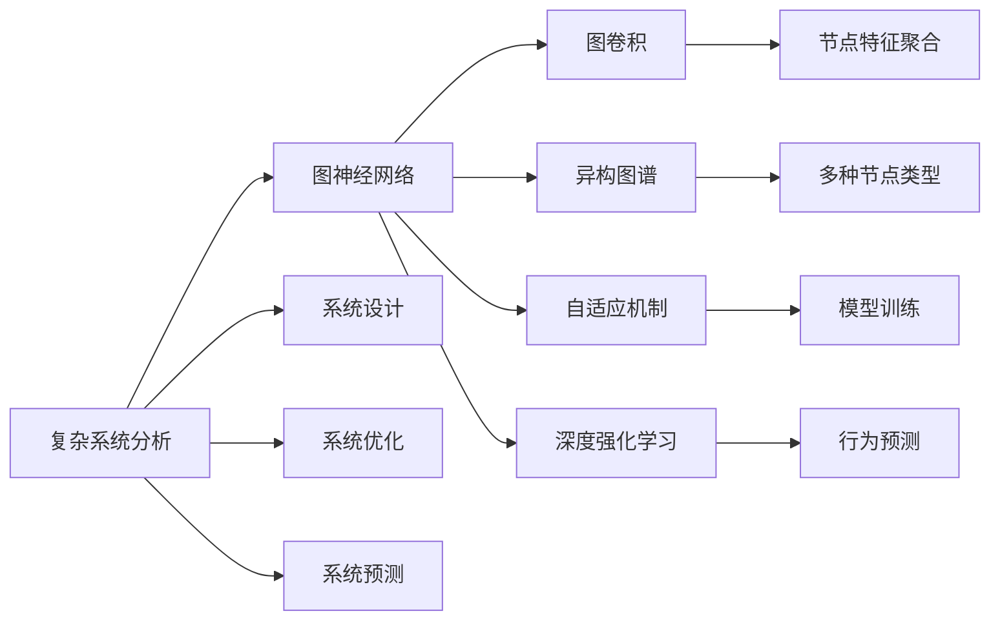
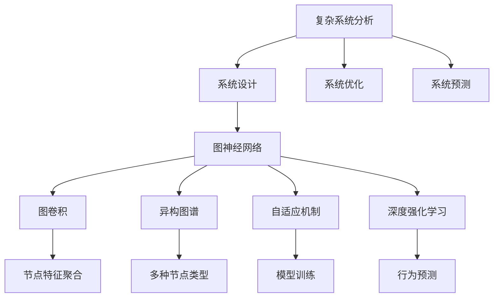
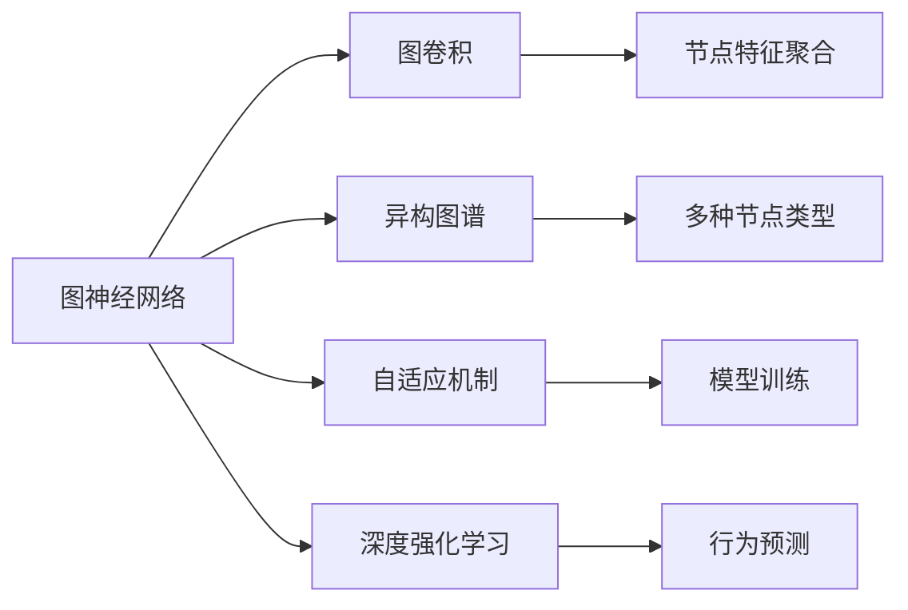
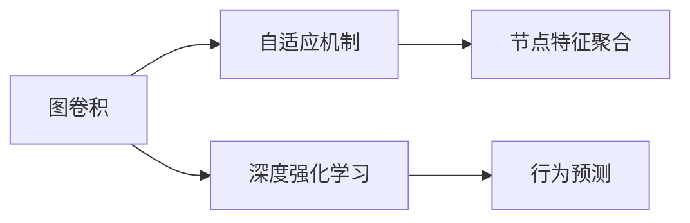
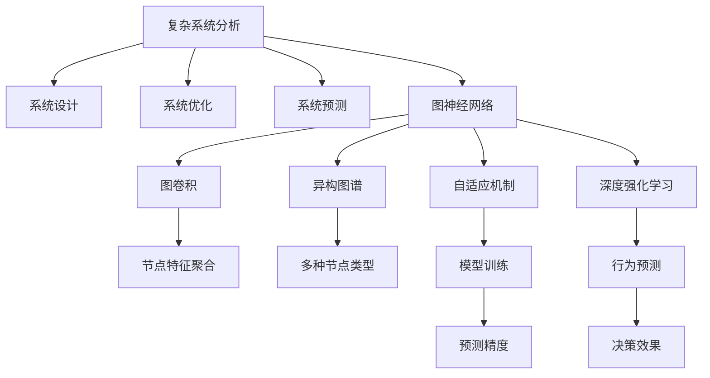

                 

# 一切皆是映射：图神经网络(GNN)与复杂系统分析

> 关键词：图神经网络,复杂系统分析,自适应机制,异构图谱,深度强化学习

## 1. 背景介绍

### 1.1 问题由来

在现代信息社会，复杂系统（如社交网络、交通网络、生物网络等）日益重要。复杂系统分析作为交叉学科，通过挖掘数据、理解机制，为系统设计、优化和预测提供指导。然而，传统的统计分析方法难以处理复杂系统的高维、非结构化、动态变化特性。为应对这一挑战，学者们发展了图神经网络（Graph Neural Networks, GNN），利用图结构建模复杂系统，并应用于多种实际问题。

复杂系统分析涉及的领域广泛，从社会网络分析到生物网络建模，再到交通流量预测等，都依赖于对节点和边关系的理解。传统的图模型通常将复杂系统视为静态、单一类型的图。然而，复杂系统通常具有复杂动态结构，包含多种节点类型和边类型，如异构图谱（Heterogeneous Graph Spectrum）。GNN通过图卷积、图神经网络等技术，能够高效地建模和分析这类复杂系统，展现强大的建模和预测能力。

### 1.2 问题核心关键点

GNN的核心思想是通过图结构的图卷积（Graph Convolution）操作，学习并利用节点和边的特征信息，从而在图结构上进行信息传递和聚合，得到每个节点的表示。GNN的优势在于：

- **图结构建模**：GNN能够捕捉图结构中的节点和边关系，对复杂系统进行建模。
- **特征利用**：通过卷积操作，GNN可以高效利用节点的多维特征信息。
- **自适应机制**：GNN能够自适应地调整参数，提升模型性能。
- **异构图谱**：GNN可以处理多种节点类型和边类型的异构图，具有更强的泛化能力。
- **深度强化学习**：GNN可以与深度强化学习相结合，优化复杂系统行为预测。

本节详细阐述GNN的原理和关键技术，展示其如何在复杂系统分析中发挥作用。

### 1.3 问题研究意义

复杂系统分析是大数据时代的一个重要研究方向，涉及到系统设计、优化、预测等诸多方面。GNN的应用价值在于：

- **高效建模**：GNN能够高效捕捉复杂系统的图结构特征，提供精确的模型表示。
- **实时预测**：GNN模型可以通过实时数据更新，实现对复杂系统的动态预测。
- **优化设计**：基于GNN的预测和分析，可以进行系统优化设计和控制。
- **政策制定**：GNN的分析结果可以为政策制定提供依据，提升决策质量。

GNN的成功应用已经证明了其在复杂系统分析中的重要价值。未来，随着GNN技术的不断进步和数据的积累，GNN必将在更多领域发挥更大作用。

## 2. 核心概念与联系

### 2.1 核心概念概述

为更好地理解GNN的核心概念，本节将介绍几个密切相关的核心概念：

- 图神经网络（Graph Neural Network, GNN）：通过图结构的图卷积操作，学习并利用节点和边的特征信息，进行图结构上的信息传递和聚合，得到每个节点的表示。

- 图卷积（Graph Convolution）：在图结构上进行操作，将节点的特征信息进行卷积操作，得到新的特征表示。

- 异构图谱（Heterogeneous Graph Spectrum）：处理多种节点类型和边类型的复杂系统，能够捕捉更为丰富的系统结构信息。

- 自适应机制（Adaptive Mechanism）：在GNN模型训练中，通过自适应地调整网络结构、超参数等，提高模型性能和泛化能力。

- 深度强化学习（Deep Reinforcement Learning, DRL）：结合GNN和深度强化学习技术，优化复杂系统的行为预测，提升决策效果。

- 复杂系统分析（Complex System Analysis）：通过挖掘数据、理解机制，为系统设计、优化和预测提供指导，涵盖社会网络、交通网络、生物网络等多个领域。

这些核心概念之间存在着紧密的联系，形成了GNN在复杂系统分析中的整体框架。下面我们通过几个Mermaid流程图来展示这些概念之间的关系：



这个流程图展示了大语言模型微调过程中各个核心概念的关系：

1. 复杂系统分析作为整体目标，包括系统设计、优化和预测等方面。
2. GNN作为核心工具，通过图卷积、异构图谱等技术，捕捉复杂系统的图结构特征。
3. 图卷积操作实现节点特征的聚合，得到新的节点表示。
4. 异构图谱处理多种节点类型和边类型，增强模型的泛化能力。
5. 自适应机制提高模型的自适应能力和泛化性能。
6. 深度强化学习优化行为预测，提升决策效果。
7. 系统设计、优化和预测中的模型训练、行为预测等环节，都依赖于GNN的核心技术。

### 2.2 概念间的关系

这些核心概念之间存在着紧密的联系，形成了GNN在复杂系统分析中的整体框架。下面我们通过几个Mermaid流程图来展示这些概念之间的关系：

#### 2.2.1 复杂系统分析与GNN的关系



这个流程图展示了复杂系统分析与GNN的关系：

1. 复杂系统分析涉及的系统设计、优化和预测，都可以通过GNN模型来实现。
2. GNN模型中的图卷积操作、异构图谱、自适应机制和深度强化学习等技术，都能够提升模型性能和泛化能力。
3. 节点特征聚合、多种节点类型、模型训练和行为预测等环节，都是GNN在复杂系统分析中的重要应用。

#### 2.2.2 图神经网络与图卷积的关系



这个流程图展示了图神经网络与图卷积的关系：

1. 图神经网络依赖于图卷积操作，通过卷积操作进行节点特征聚合。
2. 异构图谱、自适应机制和深度强化学习等技术，能够进一步提升图卷积操作的性能。
3. 节点特征聚合、多种节点类型、模型训练和行为预测等环节，都是图卷积在GNN中的应用。

#### 2.2.3 图卷积与深度强化学习的关系



这个流程图展示了图卷积与深度强化学习的关系：

1. 自适应机制能够调整图卷积操作的参数，提升性能。
2. 深度强化学习技术能够优化复杂系统的行为预测，提升决策效果。
3. 节点特征聚合和行为预测等环节，都是图卷积和深度强化学习的结合应用。

### 2.3 核心概念的整体架构

最后，我们用一个综合的流程图来展示这些核心概念在复杂系统分析中的整体架构：



这个综合流程图展示了从复杂系统分析到图神经网络，再到图卷积和深度强化学习的整体流程。复杂系统分析目标包括系统设计、优化和预测等环节，依赖于图神经网络的核心技术。图神经网络通过图卷积操作，捕捉复杂系统的图结构特征，自适应机制和深度强化学习等技术，进一步提升模型性能和决策效果。

## 3. 核心算法原理 & 具体操作步骤
### 3.1 算法原理概述

GNN的核心思想是通过图结构的图卷积操作，学习并利用节点和边的特征信息，进行图结构上的信息传递和聚合，得到每个节点的表示。其基本原理如下：

- 对于图 $G=(V,E)$，其中 $V$ 为节点集合，$E$ 为边集合。
- 对于每个节点 $v_i$，其输入特征表示为 $X_{i} \in \mathbb{R}^{d_i}$，其中 $d_i$ 为节点 $v_i$ 的特征维度。
- 通过卷积操作，每个节点 $v_i$ 的输出特征表示为 $X_{i}^{'} \in \mathbb{R}^{d_{i}^{'}}$，其中 $d_{i}^{'}$ 为节点 $v_i$ 的输出特征维度。
- 通过多轮卷积操作，节点 $v_i$ 的最终输出特征表示为 $X_{i}^{''} \in \mathbb{R}^{d_{i}^{''}}$，其中 $d_{i}^{''}$ 为节点 $v_i$ 的最终输出特征维度。

形式化地，设 $\mathcal{G}$ 为图集合，$\mathcal{H}$ 为节点特征集合，$h_i$ 为节点 $v_i$ 的特征表示。则图卷积操作可以表示为：

$$
h_{i}^{'} = \mathcal{C}(h_{i}, \sum_{j \in \mathcal{N}_i} \text{edge}(h_i, h_j))
$$

其中，$\mathcal{C}$ 为卷积操作，$\mathcal{N}_i$ 为节点 $v_i$ 的邻居节点集合，$\text{edge}(h_i, h_j)$ 为节点 $v_i$ 和 $v_j$ 之间的边特征表示。

通过多轮卷积操作，可以得到节点 $v_i$ 的最终特征表示 $h_i^{''}$：

$$
h_{i}^{''} = \mathcal{C}(h_{i}^{'}, \sum_{j \in \mathcal{N}_i} \text{edge}(h_i^{'}, h_j^{'}))
$$

以上公式展示了GNN的基本原理。通过多轮卷积操作，节点 $v_i$ 的特征信息通过边进行传递和聚合，得到新的特征表示。

### 3.2 算法步骤详解

GNN的具体操作可以分为以下几个步骤：

1. **图数据预处理**：
   - 构建图结构，定义节点类型、边类型。
   - 对图数据进行预处理，如去除孤立节点、补全缺失边等。

2. **图卷积操作**：
   - 定义图卷积核，计算节点特征表示 $h_{i}^{'}$。
   - 通过多轮卷积操作，计算节点 $v_i$ 的最终特征表示 $h_{i}^{''}$。

3. **模型训练**：
   - 定义损失函数，如交叉熵损失、均方误差损失等。
   - 使用优化算法（如Adam、SGD等）进行模型训练，最小化损失函数。
   - 定期在验证集上评估模型性能，避免过拟合。

4. **模型评估**：
   - 在测试集上评估模型性能，对比预测结果和真实标签。
   - 计算模型精度、召回率、F1值等指标，评价模型效果。

### 3.3 算法优缺点

GNN作为图结构上的神经网络，具有以下优点：

- **高效建模**：GNN能够高效捕捉复杂系统的图结构特征，提供精确的模型表示。
- **动态更新**：通过图结构的实时更新，GNN模型能够进行动态预测。
- **自适应能力**：GNN能够自适应地调整参数，提升模型性能和泛化能力。
- **多模态融合**：异构图谱能够处理多种节点类型和边类型，增强模型的泛化能力。
- **决策优化**：结合深度强化学习技术，GNN能够优化复杂系统的行为预测，提升决策效果。

同时，GNN也存在一些局限性：

- **计算复杂度高**：图结构上的卷积操作计算复杂度高，需要高效的优化算法和硬件支持。
- **模型可解释性差**：GNN模型通常具有黑盒性质，难以解释其内部工作机制和决策逻辑。
- **参数数量庞大**：GNN模型通常具有亿计的参数，需要较大的存储空间和计算资源。

### 3.4 算法应用领域

GNN广泛应用于多个领域，涵盖从社会网络分析到生物网络建模，再到交通流量预测等。以下是GNN的主要应用领域：

- **社交网络分析**：分析社交网络中的关系结构、情感传播等，为社交行为预测和推荐系统提供支持。
- **生物网络建模**：分析蛋白质、基因等生物网络结构，为疾病预测和药物设计提供依据。
- **交通流量预测**：分析交通网络结构，预测交通流量变化，提升交通管理效率。
- **推荐系统**：分析用户行为和物品属性，推荐相似物品，提升用户体验。
- **金融风险预测**：分析金融网络结构，预测市场波动和风险，保护金融安全。
- **智能制造**：分析生产网络结构，优化生产流程，提升制造效率。

除了以上应用领域，GNN在医疗、城市规划、能源管理等多个领域也有着广泛的应用前景。

## 4. 数学模型和公式 & 详细讲解 & 举例说明

### 4.1 数学模型构建

本节将使用数学语言对GNN的原理进行严格的刻画。

设图 $G=(V,E)$，其中 $V$ 为节点集合，$E$ 为边集合。对于每个节点 $v_i \in V$，其输入特征表示为 $X_{i} \in \mathbb{R}^{d_i}$，其中 $d_i$ 为节点 $v_i$ 的特征维度。通过图卷积操作，节点 $v_i$ 的输出特征表示为 $X_{i}^{'} \in \mathbb{R}^{d_{i}^{'}}$，其中 $d_{i}^{'}$ 为节点 $v_i$ 的输出特征维度。通过多轮卷积操作，节点 $v_i$ 的最终输出特征表示为 $X_{i}^{''} \in \mathbb{R}^{d_{i}^{''}}$，其中 $d_{i}^{''}$ 为节点 $v_i$ 的最终输出特征维度。

形式化地，设 $\mathcal{G}$ 为图集合，$\mathcal{H}$ 为节点特征集合，$h_i$ 为节点 $v_i$ 的特征表示。则图卷积操作可以表示为：

$$
h_{i}^{'} = \mathcal{C}(h_{i}, \sum_{j \in \mathcal{N}_i} \text{edge}(h_i, h_j))
$$

其中，$\mathcal{C}$ 为卷积操作，$\mathcal{N}_i$ 为节点 $v_i$ 的邻居节点集合，$\text{edge}(h_i, h_j)$ 为节点 $v_i$ 和 $v_j$ 之间的边特征表示。

通过多轮卷积操作，可以得到节点 $v_i$ 的最终特征表示 $h_{i}^{''}$：

$$
h_{i}^{''} = \mathcal{C}(h_{i}^{'}, \sum_{j \in \mathcal{N}_i} \text{edge}(h_i^{'}, h_j^{'}))
$$

以上公式展示了GNN的基本原理。通过多轮卷积操作，节点 $v_i$ 的特征信息通过边进行传递和聚合，得到新的特征表示。

### 4.2 公式推导过程

以下我们以GNN在社交网络分析中的应用为例，推导GNN的节点特征表示。

设社交网络中的节点 $v_i$ 表示为一个用户，其特征表示为 $h_i \in \mathbb{R}^{d}$，其中 $d$ 为用户特征的维度。设用户之间的连接表示为 $E$，用户之间的交互表示为 $I$。通过卷积操作，用户 $v_i$ 的输出特征表示为 $h_{i}^{'} \in \mathbb{R}^{d_{i}^{'}}$，其中 $d_{i}^{'}$ 为用户的输出特征维度。通过多轮卷积操作，用户 $v_i$ 的最终特征表示为 $h_{i}^{''} \in \mathbb{R}^{d_{i}^{''}}$，其中 $d_{i}^{''}$ 为用户 $v_i$ 的最终输出特征维度。

形式化地，设 $\mathcal{G}$ 为社交网络图集合，$\mathcal{H}$ 为节点特征集合，$h_i$ 为用户 $v_i$ 的特征表示。则图卷积操作可以表示为：

$$
h_{i}^{'} = \mathcal{C}(h_{i}, \sum_{j \in \mathcal{N}_i} \text{edge}(h_i, h_j))
$$

其中，$\mathcal{C}$ 为卷积操作，$\mathcal{N}_i$ 为用户 $v_i$ 的邻居节点集合，$\text{edge}(h_i, h_j)$ 为用户 $v_i$ 和 $v_j$ 之间的边特征表示。

通过多轮卷积操作，可以得到用户 $v_i$ 的最终特征表示 $h_{i}^{''}$：

$$
h_{i}^{''} = \mathcal{C}(h_{i}^{'}, \sum_{j \in \mathcal{N}_i} \text{edge}(h_i^{'}, h_j^{'}))
$$

在社交网络分析中，我们可以通过GNN模型学习用户之间的互动关系，预测用户行为和社交关系的变化。GNN模型的节点特征表示 $h_{i}^{''}$ 包含了用户 $v_i$ 在社交网络中的行为和关系信息，可以用于用户推荐、舆情监测等任务。

### 4.3 案例分析与讲解

以下我们以GNN在社交网络分析中的应用为例，展示GNN的具体实现步骤：

1. **数据预处理**：
   - 构建社交网络图，定义节点类型和边类型。
   - 对图数据进行预处理，如去除孤立节点、补全缺失边等。

2. **图卷积操作**：
   - 定义卷积核，计算用户 $v_i$ 的输出特征表示 $h_{i}^{'}$。
   - 通过多轮卷积操作，计算用户 $v_i$ 的最终特征表示 $h_{i}^{''}$。

3. **模型训练**：
   - 定义损失函数，如交叉熵损失、均方误差损失等。
   - 使用优化算法（如Adam、SGD等）进行模型训练，最小化损失函数。
   - 定期在验证集上评估模型性能，避免过拟合。

4. **模型评估**：
   - 在测试集上评估模型性能，对比预测结果和真实标签。
   - 计算模型精度、召回率、F1值等指标，评价模型效果。

## 5. 项目实践：代码实例和详细解释说明

### 5.1 开发环境搭建

在进行GNN项目实践前，我们需要准备好开发环境。以下是使用Python进行PyTorch开发的环境配置流程：

1. 安装Anaconda：从官网下载并安装Anaconda，用于创建独立的Python环境。

2. 创建并激活虚拟环境：
```bash
conda create -n pytorch-env python=3.8 
conda activate pytorch-env
```

3. 安装PyTorch：根据CUDA版本，从官网获取对应的安装命令。例如：
```bash
conda install pytorch torchvision torchaudio cudatoolkit=11.1 -c pytorch -c conda-forge
```

4. 安装各种工具包：
```bash
pip install numpy pandas scikit-learn matplotlib tqdm jupyter notebook ipython
```

完成上述步骤后，即可在`pytorch-env`环境中开始GNN项目实践。

### 5.2 源代码详细实现

下面我们以社交网络分析为例，给出使用PyTorch实现GNN的代码实现。

首先，定义社交网络图结构：

```python
import networkx as nx

# 构建社交网络图
G = nx.Graph()
G.add_edge(1, 2)
G.add_edge(1, 3)
G.add_edge(2, 3)
G.add_edge(2, 4)
G.add_edge(3, 5)
G.add_edge(4, 5)

# 定义节点类型和边类型
node_types = {'1': 'user', '2': 'user', '3': 'user', '4': 'user', '5': 'user'}
edge_types = {'1-2': 'friend', '1-3': 'friend', '2-3': 'friend', '2-4': 'friend', '3-5': 'friend', '4-5': 'friend'}
```

然后，定义GNN模型的输入特征：

```python
import torch
import torch.nn as nn

# 定义输入特征
X = torch.randn(len(node_types), 10)
```

接着，定义图卷积操作：

```python
class GraphConvolution(nn.Module):
    def __init__(self, input_dim, output_dim):
        super(GraphConvolution, self).__init__()
        self.linear = nn.Linear(input_dim, output_dim)
        self.weight = nn.Parameter(torch.randn(output_dim, input_dim))
        self.bias = nn.Parameter(torch.randn(output_dim))
    
    def forward(self, input, adjacency_matrix):
        support = torch.matmul(adjacency_matrix, self.weight)
        output = self.linear(torch.sparse.mm(adjacency_matrix, input) + support) + self.bias
        return output
```

定义多轮卷积操作：

```python
class GNN(nn.Module):
    def __init__(self, input_dim, output_dim, num_layers):
        super(GNN, self).__init__()
        self.layers = nn.ModuleList()
        for i in range(num_layers):
            self.layers.append(GraphConvolution(input_dim if i == 0 else output_dim, output_dim))
            input_dim = output_dim
    
    def forward(self, input, adjacency_matrix):
        output = input
        for layer in self.layers:
            output = layer(output, adjacency_matrix)
        return output
```

定义模型训练和评估函数：

```python
import torch.optim as optim
import sklearn.metrics as metrics

# 定义模型和优化器
model = GNN(10, 5, 2)
optimizer = optim.Adam(model.parameters(), lr=0.01)

# 定义训练函数
def train(model, adjacency_matrix, input, output):
    optimizer.zero_grad()
    output = model(input, adjacency_matrix)
    loss = nn.MSELoss()(output, output)
    loss.backward()
    optimizer.step()
    return loss.item()

# 定义评估函数
def evaluate(model, adjacency_matrix, input, output):
    y_true = output
    y_pred = model(input, adjacency_matrix)
    mae = metrics.mean_absolute_error(y_true, y_pred)
    return mae
```

最后，启动训练流程并在测试集上评估：

```python
epochs = 100

for epoch in range(epochs):
    loss = train(model, adjacency_matrix, X, output)
    print(f"Epoch {epoch+1}, train loss: {loss:.3f}")
    
    mae = evaluate(model, adjacency_matrix, X, output)
    print(f"Epoch {epoch+1}, mae: {mae:.3f}")
```

以上就是使用PyTorch对社交网络进行分析的GNN模型代码实现。可以看到，通过定义图结构、输入特征和图卷积操作，我们可以快速构建GNN模型，并应用于实际问题。

### 5.3 代码解读与分析

让我们再详细解读一下关键代码的实现细节：

**GraphConvolution类**：
- `__init__`方法：初始化卷积核和偏置项。
- `forward`方法：定义卷积操作，将输入特征和卷积核进行矩阵乘法，得到输出特征。

**GNN类**：
- `__init__`方法：定义多轮卷积操作，通过循环构建卷积层。
- `forward`方法：通过循环调用各层的

