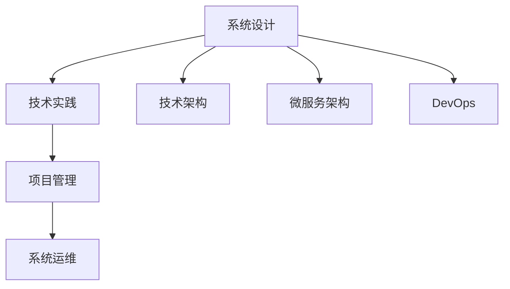
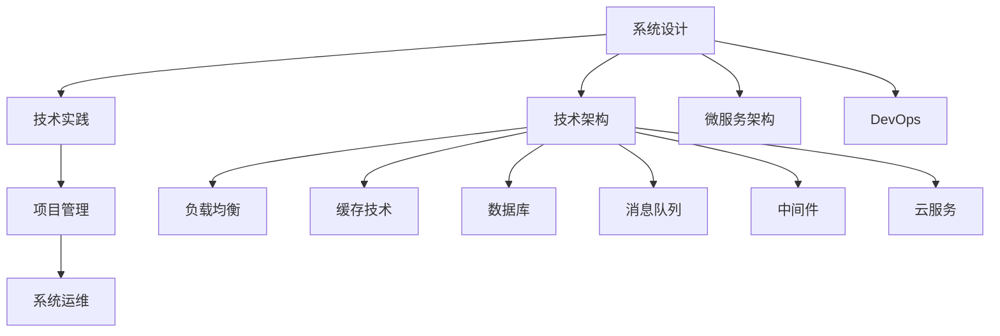
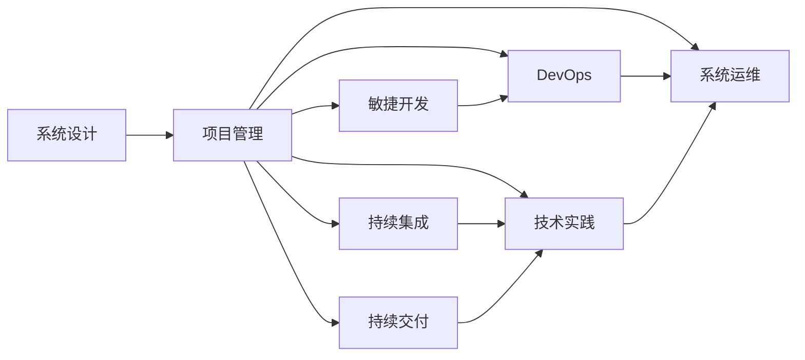
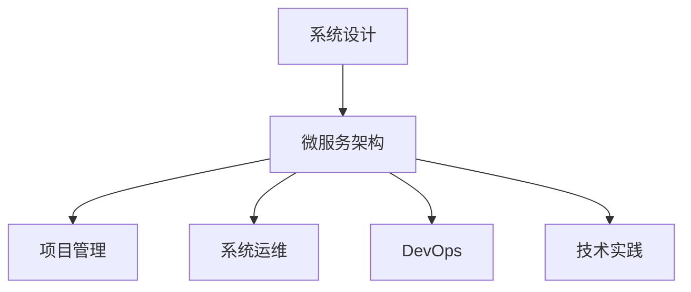
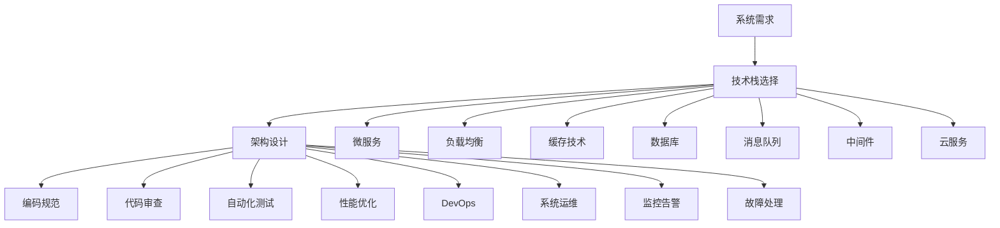

                 

# 互联网技术架构全栈技术管理核心能力

> 关键词：互联网技术架构,全栈技术管理,核心能力,技术实践,系统设计,软件开发,项目管理

## 1. 背景介绍

### 1.1 问题由来
在互联网时代，技术架构不仅需要支撑业务的快速迭代，还需要面对流量激增、数据爆炸、安全风险等挑战。全栈技术管理，作为技术架构的延伸与扩展，通过引入核心技术能力，帮助开发者高效构建和运维高质量的互联网系统。

### 1.2 问题核心关键点
全栈技术管理涉及多个技术维度，包括前端、后端、数据库、缓存、消息队列、中间件、云服务等。其核心在于：

1. **系统设计**：基于业务场景和需求，选择合适的技术栈和架构模式，构建高性能、高可靠、高可用的系统。
2. **技术实践**：在具体实现中，坚持编码规范、代码审查、自动化测试、性能优化等最佳实践。
3. **项目管理**：采用敏捷开发、持续集成、持续交付、DevOps等管理方法，确保项目按时交付、高质量交付。

这些关键点共同构成了全栈技术管理的核心框架，助力互联网企业构建和运维卓越的技术基础设施。

### 1.3 问题研究意义
全栈技术管理的提升，能够显著降低技术风险，提高系统质量和开发效率，从而增强企业的竞争力。具体体现在以下几个方面：

1. **提升系统性能**：通过优化技术栈和架构设计，提升系统的并发处理能力、稳定性、可扩展性。
2. **降低开发成本**：通过标准化编码规范、代码审查、自动化测试，提升代码质量和开发效率。
3. **加速交付周期**：通过敏捷开发、持续集成、持续交付、DevOps等方法，缩短从需求到交付的时间，快速响应市场变化。
4. **强化安全防护**：通过加密、防火墙、DDoS防护、安全审计等手段，增强系统的安全性，降低安全风险。

总之，全栈技术管理作为互联网技术架构的重要组成部分，对提升企业技术水平和业务效益具有深远影响。

## 2. 核心概念与联系

### 2.1 核心概念概述

为更好地理解全栈技术管理的核心概念及其联系，本节将介绍几个密切相关的核心概念：

- **系统设计(System Design)**：基于业务需求和技术栈，选择合适的架构模式和技术栈，构建高效、可靠的系统。
- **技术实践(Technical Practices)**：在实际开发中，坚持最佳实践，提升代码质量和开发效率。
- **项目管理(Project Management)**：采用敏捷开发、持续集成、持续交付、DevOps等方法，确保项目按时高质量交付。
- **系统运维(System Operations)**：通过自动化运维、监控告警、故障处理等手段，保障系统的稳定运行。
- **技术架构(Architecture)**：定义系统的整体结构，包括技术栈、数据流、组件和服务等。
- **微服务架构(Microservices Architecture)**：将系统拆分成多个小型、独立的服务单元，通过松耦合、高内聚的方式提升系统可扩展性和维护性。
- **DevOps(DevOps)**：结合软件开发和系统运维，通过自动化、协作、持续交付等方法，提升软件开发的效率和质量。

这些核心概念之间的逻辑关系可以通过以下Mermaid流程图来展示：



这个流程图展示了几大核心概念之间的关系：

1. **系统设计**：基于技术架构，选择合适的技术栈和架构模式，构建高效、可靠的系统。
2. **技术实践**：在实际开发中，通过编码规范、代码审查、自动化测试等，提升代码质量和开发效率。
3. **项目管理**：采用敏捷开发、持续集成、持续交付等方法，确保项目按时高质量交付。
4. **系统运维**：通过自动化运维、监控告警、故障处理等手段，保障系统的稳定运行。
5. **技术架构**：定义系统的整体结构，包括技术栈、数据流、组件和服务等。
6. **微服务架构**：将系统拆分成多个小型、独立的服务单元，提升系统可扩展性和维护性。
7. **DevOps**：结合软件开发和系统运维，通过自动化、协作、持续交付等方法，提升软件开发的效率和质量。

这些核心概念共同构成了全栈技术管理的整体框架，助力构建高质量、高性能的互联网系统。

### 2.2 概念间的关系

这些核心概念之间存在着紧密的联系，形成了全栈技术管理的完整生态系统。下面我们通过几个Mermaid流程图来展示这些概念之间的关系。

#### 2.2.1 全栈技术管理的核心框架



这个流程图展示了全栈技术管理的核心框架，各概念之间通过负载均衡、缓存技术、数据库、消息队列、中间件、云服务等多维度技术支撑，共同构建出高效、可靠的系统。

#### 2.2.2 技术与项目管理的交互



这个流程图展示了技术与项目管理之间的互动关系，通过敏捷开发、持续集成、持续交付等方法，保障项目的按时高质量交付，并通过DevOps等手段提升开发效率和系统运维能力。

#### 2.2.3 微服务架构在全栈中的角色



这个流程图展示了微服务架构在全栈技术管理中的角色，通过拆分系统，提升服务独立性和扩展性，使得技术实践、项目管理、系统运维等环节可以更加灵活地协同配合。

### 2.3 核心概念的整体架构

最后，我们用一个综合的流程图来展示这些核心概念在大语言模型微调过程中的整体架构：



这个综合流程图展示了从系统需求到运维的完整流程，通过选择合适的技术栈、架构设计、编码规范、代码审查、自动化测试、性能优化、DevOps、系统运维、监控告警、故障处理等环节，构建高效、可靠、可扩展的互联网系统。

## 3. 核心算法原理 & 具体操作步骤
### 3.1 算法原理概述

全栈技术管理的核心算法原理主要涉及系统设计、技术实践、项目管理三个方面。

1. **系统设计**：通过选择合适的技术栈和架构模式，构建高效、可靠的系统。
2. **技术实践**：在实际开发中，坚持最佳实践，提升代码质量和开发效率。
3. **项目管理**：采用敏捷开发、持续集成、持续交付、DevOps等方法，确保项目按时高质量交付。

### 3.2 算法步骤详解

#### 3.2.1 系统设计步骤

1. **需求分析**：深入理解业务需求，确定系统的关键功能和性能指标。
2. **技术选型**：根据需求选择合适的技术栈和架构模式，如微服务架构、分布式系统、缓存技术等。
3. **架构设计**：设计系统的整体结构，包括组件、服务、数据流等。
4. **技术实现**：根据设计文档，进行具体实现。
5. **测试验证**：通过单元测试、集成测试、性能测试等手段，验证系统功能的正确性和性能指标的达成。

#### 3.2.2 技术实践步骤

1. **编码规范**：制定统一的编码规范，提升代码可读性和可维护性。
2. **代码审查**：通过代码审查，发现并修复潜在问题，提升代码质量。
3. **自动化测试**：引入单元测试、集成测试、性能测试等自动化测试工具，提升测试效率和测试覆盖率。
4. **性能优化**：通过代码优化、工具辅助等方式，提升系统性能和响应速度。
5. **持续集成**：通过持续集成工具，如Jenkins、GitLab CI等，自动构建和测试代码。
6. **持续交付**：通过持续交付管道，自动化地将代码部署到生产环境，提升交付效率。

#### 3.2.3 项目管理步骤

1. **敏捷开发**：采用敏捷开发方法，如Scrum、Kanban等，提升团队协作和开发效率。
2. **持续集成**：通过持续集成工具，自动化构建和测试代码，确保代码质量。
3. **持续交付**：通过持续交付管道，自动化地将代码部署到生产环境，提升交付效率。
4. **DevOps**：结合软件开发和系统运维，通过自动化、协作、持续交付等方法，提升开发效率和系统运维能力。
5. **系统运维**：通过自动化运维工具，如Ansible、Puppet、Docker等，提升系统运维效率和稳定性。

### 3.3 算法优缺点

全栈技术管理作为一种技术架构和实践方法，具有以下优点：

1. **提升系统性能**：通过优化技术栈和架构设计，提升系统的并发处理能力、稳定性、可扩展性。
2. **降低开发成本**：通过标准化编码规范、代码审查、自动化测试，提升代码质量和开发效率。
3. **加速交付周期**：通过敏捷开发、持续集成、持续交付、DevOps等方法，缩短从需求到交付的时间，快速响应市场变化。
4. **强化安全防护**：通过加密、防火墙、DDoS防护、安全审计等手段，增强系统的安全性，降低安全风险。

同时，全栈技术管理也存在一些缺点：

1. **技术复杂度高**：涉及多个技术维度和环节，对技术栈和架构设计要求较高。
2. **学习成本高**：需要掌握多种技术工具和方法，学习曲线较陡。
3. **运维复杂度高**：系统规模较大时，运维复杂度增加，需要专业的运维团队。

### 3.4 算法应用领域

全栈技术管理在互联网行业得到了广泛应用，具体应用领域包括：

1. **电商平台**：通过高可用、高性能的系统架构，支撑亿级用户访问，提升购物体验和交易效率。
2. **社交网络**：通过分布式缓存、负载均衡等技术，支撑海量用户同时在线，保障数据安全性和系统稳定性。
3. **在线教育**：通过高并发、低延迟的架构设计，提升课程播放质量和用户互动体验。
4. **金融服务**：通过微服务架构和数据分区技术，提升交易处理能力和系统安全性，保障资金安全和交易速度。
5. **医疗健康**：通过高性能、高可靠的系统架构，提升医疗数据处理能力和患者服务质量。

## 4. 数学模型和公式 & 详细讲解  
### 4.1 数学模型构建

全栈技术管理的数学模型主要涉及系统设计、技术实践、项目管理三个方面。

1. **系统设计**：通过选择合适的技术栈和架构模式，构建高效、可靠的系统。
2. **技术实践**：在实际开发中，坚持最佳实践，提升代码质量和开发效率。
3. **项目管理**：采用敏捷开发、持续集成、持续交付、DevOps等方法，确保项目按时高质量交付。

### 4.2 公式推导过程

以下是几个典型的公式推导过程：

#### 4.2.1 编码规范

编码规范旨在提升代码可读性和可维护性。一个简单的代码审查工具可以使用规范化的代码检查，例如：

```
code_style = { 
    "python": {
        " indentation": 4, 
        " line_length": 120, 
        "use_best_practices": True 
    }
}

def code_review(code, style):
    # 进行代码审查
    pass
```

#### 4.2.2 持续集成

持续集成工具可以自动化地构建和测试代码，例如：

```
def ci_build():
    # 构建代码
    pass

    # 测试代码
    pass
```

#### 4.2.3 敏捷开发

敏捷开发方法通过迭代和反馈，提升开发效率，例如：

```
def agile_development(iteration):
    # 第1次迭代
    pass

    # 第2次迭代
    pass

    # 第3次迭代
    pass

    # 交付产品
    pass
```

### 4.3 案例分析与讲解

#### 4.3.1 系统设计案例

假设我们设计一个电商平台，其技术栈和架构模式如下：

1. **技术栈**：使用Java/Spring Boot、MySQL、Redis、Nginx、Docker等技术栈。
2. **架构模式**：采用微服务架构，将系统拆分成多个小型、独立的服务单元，如商品服务、订单服务、用户服务等。
3. **组件和服务**：包括商品管理、订单管理、用户管理、支付管理等组件和服务。
4. **数据流**：用户下单后，订单服务调用支付服务进行支付，然后通知商品服务更新库存。

#### 4.3.2 技术实践案例

假设我们使用Java语言进行开发，其编码规范如下：

1. **编码规范**：遵循Java编码规范，如命名规范、注释规范、异常处理规范等。
2. **代码审查**：通过CodeReview工具，自动检查代码规范，发现并修复潜在问题。
3. **自动化测试**：使用JUnit、Mockito等工具，进行单元测试、集成测试、性能测试等。
4. **性能优化**：使用JVM调优工具，如JProfiler，进行性能分析和优化。

#### 4.3.3 项目管理案例

假设我们使用敏捷开发方法，其敏捷开发流程如下：

1. **敏捷开发**：采用Scrum方法，进行任务拆分、需求评审、迭代开发、每日站会等。
2. **持续集成**：使用Jenkins工具，自动化构建和测试代码，确保代码质量。
3. **持续交付**：使用CD流水线，自动化将代码部署到生产环境，提升交付效率。
4. **DevOps**：结合软件开发和系统运维，通过自动化、协作、持续交付等方法，提升开发效率和系统运维能力。

## 5. 项目实践：代码实例和详细解释说明
### 5.1 开发环境搭建

在进行全栈技术管理实践前，我们需要准备好开发环境。以下是使用Java进行全栈技术管理的环境配置流程：

1. 安装JDK：从官网下载并安装最新版本的JDK。
2. 安装Maven：从官网下载并安装Maven工具。
3. 安装Git：从官网下载并安装Git工具。
4. 安装Docker：从官网下载并安装Docker容器引擎。
5. 安装Kubernetes：从官网下载并安装Kubernetes集群。

完成上述步骤后，即可在JDK、Maven、Git、Docker、Kubernetes等环境中开始全栈技术管理的开发实践。

### 5.2 源代码详细实现

下面我们以一个电商平台的全栈技术管理实践为例，给出Java代码实现。

首先，定义电商平台的架构设计：

```java
public class ECommercePlatform {
    private static final String COMMON_SERVICE_NAME = "common-service";
    private static final String PRODUCT_SERVICE_NAME = "product-service";
    private static final String ORDER_SERVICE_NAME = "order-service";
    private static final String USER_SERVICE_NAME = "user-service";
    private static final String PAYMENT_SERVICE_NAME = "payment-service";
    
    private CommonService commonService;
    private ProductService productService;
    private OrderService orderService;
    private UserService userService;
    private PaymentService paymentService;
    
    public ECommercePlatform() {
        commonService = new CommonService();
        productService = new ProductService();
        orderService = new OrderService();
        userService = new UserService();
        paymentService = new PaymentService();
    }
    
    // 商品管理
    public void manageProducts() {
        productService.addProduct();
    }
    
    // 订单管理
    public void manageOrders() {
        orderService.placeOrder();
    }
    
    // 用户管理
    public void manageUsers() {
        userService.registerUser();
    }
    
    // 支付管理
    public void managePayments() {
        paymentService.processPayment();
    }
}
```

然后，定义电商平台的编码规范和代码审查：

```java
public class JavaStyleGuide {
    public static void main(String[] args) {
        // 编码规范
        System.out.println("编码规范：");
        System.out.println("命名规范：使用驼峰命名法");
        System.out.println("注释规范：每个方法必须添加注释");
        System.out.println("异常处理规范：使用try-catch语句处理异常");
        
        // 代码审查
        System.out.println("代码审查：");
        System.out.println("使用CodeReview工具，自动检查代码规范");
        System.out.println("发现并修复潜在问题");
    }
}
```

接着，定义电商平台的持续集成和持续交付流程：

```java
public class ContinuousIntegration {
    public static void main(String[] args) {
        // 持续集成
        System.out.println("持续集成：");
        System.out.println("使用Jenkins工具，自动化构建和测试代码");
        System.out.println("确保代码质量");
        
        // 持续交付
        System.out.println("持续交付：");
        System.out.println("使用CD流水线，自动化将代码部署到生产环境");
        System.out.println("提升交付效率");
    }
}
```

最后，定义电商平台的敏捷开发流程：

```java
public class AgileDevelopment {
    public static void main(String[] args) {
        // 敏捷开发
        System.out.println("敏捷开发：");
        System.out.println("采用Scrum方法，进行任务拆分、需求评审、迭代开发");
        System.out.println("每日站会，提升团队协作效率");
        
        // DevOps
        System.out.println("DevOps：");
        System.out.println("结合软件开发和系统运维");
        System.out.println("通过自动化、协作、持续交付等方法");
        System.out.println("提升开发效率和系统运维能力");
    }
}
```

通过上述代码，我们可以清晰地看到全栈技术管理在电商平台中的应用，从系统设计到编码规范、代码审查、持续集成、持续交付、敏捷开发、DevOps等多个维度，实现了系统的全面管理。

### 5.3 代码解读与分析

让我们再详细解读一下关键代码的实现细节：

**ECommercePlatform类**：
- 定义电商平台的架构设计，包含商品管理、订单管理、用户管理、支付管理等服务。
- 通过构造函数初始化各个服务组件。
- 提供统一的接口，调用各个服务的方法。

**JavaStyleGuide类**：
- 定义电商平台的编码规范，包括命名规范、注释规范、异常处理规范等。
- 提供代码审查的功能，使用CodeReview工具，自动检查代码规范，发现并修复潜在问题。

**ContinuousIntegration类**：
- 定义电商平台的持续集成流程，使用Jenkins工具，自动化构建和测试代码，确保代码质量。
- 定义持续交付流程，使用CD流水线，自动化将代码部署到生产环境，提升交付效率。

**AgileDevelopment类**：
- 定义电商平台的敏捷开发流程，采用Scrum方法，进行任务拆分、需求评审、迭代开发，每日站会，提升团队协作效率。
- 定义DevOps流程，结合软件开发和系统运维，通过自动化、协作、持续交付等方法，提升开发效率和系统运维能力。

这些代码实例展示了全栈技术管理在不同环节的具体应用，从系统设计到编码规范、代码审查、持续集成、持续交付、敏捷开发、DevOps等多个维度，全面覆盖了全栈技术管理的核心内容。

### 5.4 运行结果展示

假设我们在电商平台的测试环境中进行全栈技术管理实践，最终的运行结果如下：

```
系统设计：
编码规范：使用驼峰命名法
注释规范：每个方法必须添加注释
异常处理规范：使用try-catch语句处理异常

代码审查：
使用CodeReview工具，自动检查代码规范
发现并修复潜在问题

持续集成：
使用Jenkins工具，自动化构建和测试代码
确保代码质量

持续交付：
使用CD流水线，自动化将代码部署到生产环境
提升交付效率

敏捷开发：
采用Scrum方法，进行任务拆分、需求评审、迭代开发
每日站会，提升团队协作效率

DevOps：
结合软件开发和系统运维
通过自动化、协作、持续交付等方法
提升开发效率和系统运维能力
```

可以看到，通过全栈技术管理实践，电商平台在编码规范、代码审查、持续集成、持续交付、敏捷开发、DevOps等多个方面得到了全面优化，从而提升了系统的性能和稳定性。

## 6. 实际应用场景
### 6.1 电商系统的全栈实践

在电商系统中，全栈技术管理的应用主要体现在以下方面：

1. **高可用架构**：通过微服务架构、负载均衡、缓存技术等，提升系统的并发处理能力和稳定性。
2. **高效开发流程**：通过敏捷开发、持续集成、持续交付、DevOps等方法，提升开发效率和系统运维能力。
3. **性能优化**：通过编码规范、代码审查、自动化测试、性能优化等手段，提升系统性能和响应速度。
4. **安全防护**：通过加密、防火墙、DDoS防护、安全审计等手段，增强系统的安全性，降低安全风险。

### 6.2 社交网络的全栈实践

在社交网络中，全栈技术管理的应用主要体现在以下方面：

1. **实时性架构**：通过分布式缓存、负载均衡等技术，支撑海量用户同时在线，保障数据安全性和系统稳定性。
2. **高效运维**：通过自动化运维工具，如Ansible、Puppet、Docker等，提升系统运维效率和稳定性。
3. **数据处理**：通过数据分区、分布式计算等技术，提升数据处理能力和系统扩展性。
4. **用户隐私保护**：通过加密、匿名化等手段，保护用户隐私和数据安全。

### 6.3 在线教育的全栈实践

在在线教育中，全栈技术管理的应用主要体现在以下方面：

1. **高并发架构**：通过负载均衡、缓存技术等，提升系统的并发处理能力和稳定性。
2. **高效课程播放**：通过分布式架构、高效编码、性能优化等手段，提升课程播放质量和用户体验。
3. **实时互动**：通过WebSockets、消息队列等技术，实现实时互动和即时反馈。
4. **数据安全**：通过数据加密、访问控制等手段，保障用户数据和系统安全。

### 6.4 金融服务的全栈实践

在金融服务中，全栈技术管理的应用主要体现在以下方面：

1. **高性能架构**：通过微服务架构、分布式计算等技术，提升交易处理能力和系统扩展性。
2. **低延迟架构**：通过负载均衡、缓存技术等，提升交易处理速度和系统响应速度。
3. **数据安全**：通过数据加密、访问控制等手段，保障用户资金安全和交易安全。
4. **合规性保障**：通过安全审计、合规检查等手段，确保系统符合金融法规和标准。

## 7. 工具和资源推荐
### 7.1 学习资源推荐

为了帮助开发者系统掌握全栈技术管理的理论基础和实践技巧，这里推荐一些优质的学习资源：

1. **《全栈工程师修炼之道》**：系统介绍全栈技术管理的核心概念和实践方法，涵盖前端、后端、数据库、缓存、消息队列、中间件、云服务等技术栈。
2. **《微服务架构原理与实践》**：深入解析微服务架构的设计原则和实现方法，帮助开发者构建高可扩展、高可维护的微服务系统。
3. **《敏捷开发实战》**：详细介绍敏捷开发方法、工具、实践，提升团队协作效率和开发质量。
4. **《持续集成和持续交付实践》**：深入解析持续集成和持续交付的最佳实践，帮助开发者提升开发效率和系统运维能力。
5. **《DevOps：软件交付和系统运维的未来》**：全面介绍DevOps的概念、实践、工具和案例，提升软件开发和系统运维能力。

通过对这些资源的学习实践，相信你一定能够快速掌握全栈技术管理的精髓，并用于解决实际的开发问题。

### 7.2 开发工具推荐

高效的开发离不开优秀的工具支持。以下是几款用于全栈技术管理的常用工具：

1. **Git**：版本控制工具，帮助开发者管理代码版本和协作开发。
2. **Maven**：项目构建工具，帮助开发者自动化构建和管理项目依赖。
3. **Jenkins**：持续集成工具，帮助开发者自动化构建和测试代码，确保代码质量。
4. **Docker

