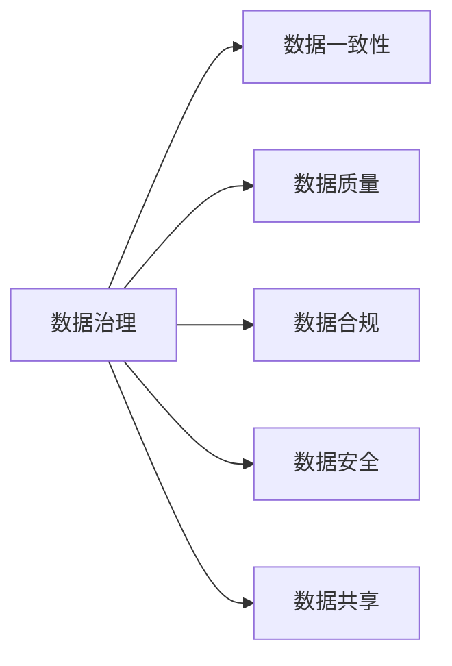

                 

## 1. 背景介绍

随着人工智能(AI)技术在各行业的深度应用，数据已成为创业公司发展的核心资产。无论是预测模型、自然语言处理(NLP)、计算机视觉(CV)还是推荐系统，数据都是AI应用中不可或缺的重要组成部分。然而，数据的管理和治理往往是一项繁琐且耗时的任务，尤其是在数据量庞大、数据类型多样、数据质量参差不齐的情况下，如何有效管理数据资源，保障数据安全，提高数据使用效率，已经成为制约AI创业公司发展的重要瓶颈。

### 1.1 数据管理的重要性

数据管理的核心目标是通过标准化、规范化的数据治理手段，确保数据质量、数据安全和数据使用的效率和合规性。良好的数据管理可以提升AI模型的效果，降低系统开发和维护的成本，促进AI应用的落地和迭代。

1. **数据质量**：高质量的数据是AI模型训练和推理的基石。数据缺失、错误、不一致等问题会直接影响模型的准确性和鲁棒性。
2. **数据安全**：数据隐私和安全是AI应用中必须严格遵守的法律和伦理要求。数据泄露、滥用、攻击等风险可能带来巨大的法律和声誉损失。
3. **数据使用效率**：高效的资源管理和数据访问控制，能够显著降低系统运行和维护的成本，提升应用响应速度和用户体验。
4. **数据合规性**：在金融、医疗等高风险领域，数据管理必须符合相关法规和标准，确保合规使用。

### 1.2 数据管理面临的挑战

数据管理是一项复杂的系统工程，尤其是在创业阶段，公司资源有限，如何平衡数据管理的投入和收益，成为一大挑战。以下是数据管理中常见的几个问题：

1. **数据分散**：不同部门和项目产生的数据通常分散在不同的数据库和存储系统中，导致数据难以统一管理和共享。
2. **数据冗余**：同一数据在不同系统中可能存在多个冗余副本，增加了数据维护和处理的复杂度。
3. **数据安全**：数据存储、传输和处理过程中可能存在各种安全威胁，如数据泄露、篡改、攻击等。
4. **数据质量**：数据缺失、噪音、不完整等问题严重影响了AI模型的效果。
5. **数据管理工具不足**：缺乏统一的数据管理平台，数据治理工具和技能不足，使得数据管理效率低下。

### 1.3 数据管理的目标

数据管理的目标是建立一个统一、高效、安全的数据治理体系，通过标准化、自动化的数据管理工具和流程，确保数据质量、数据安全和数据使用的合规性和效率。具体目标包括：

1. **数据一致性**：确保数据在各个系统间的一致性和完整性，消除数据冗余。
2. **数据隐私和安全**：采用先进的加密、访问控制等技术，保障数据隐私和安全。
3. **数据合规性**：确保数据管理符合国家和行业法规要求，如GDPR、HIPAA等。
4. **数据质量提升**：通过数据清洗、标注、校验等手段，提升数据质量。
5. **数据使用效率**：优化数据存储和访问机制，提高数据使用效率。

## 2. 核心概念与联系

### 2.1 核心概念概述

数据管理的核心概念包括数据治理、数据安全、数据质量、数据共享和数据合规。以下是这些概念的简要介绍：

- **数据治理**：通过制定数据管理政策、流程和标准，确保数据的准确性、完整性、一致性和可用性。
- **数据安全**：通过加密、访问控制、审计等手段，保护数据免受未经授权的访问、泄露和破坏。
- **数据质量**：通过数据清洗、标准化、校验等手段，提升数据的准确性和一致性。
- **数据共享**：通过数据目录、API接口等手段，实现数据在不同系统和团队之间的安全共享。
- **数据合规**：确保数据管理符合国家和行业法规，如GDPR、HIPAA等，保护数据隐私和合规性。

这些概念之间的关系可以用以下Mermaid流程图来表示：



### 2.2 概念间的关系

这些核心概念之间存在着紧密的联系，形成一个完整的数据管理体系。以下是各个概念之间的关系：

- **数据治理**：是数据管理的基础，通过制定和实施数据管理政策、流程和标准，确保数据的一致性、质量和合规性，保障数据安全。
- **数据一致性**：数据一致性是数据治理的直接目标之一，通过统一数据标准和规则，消除数据冗余，提升数据使用效率。
- **数据质量**：数据质量是数据治理的重要组成部分，通过数据清洗和校验等手段，提升数据准确性和完整性。
- **数据安全**：数据安全是数据管理的核心目标之一，通过加密、访问控制等手段，保障数据隐私和安全。
- **数据共享**：数据共享是数据治理的高级目标之一，通过数据目录、API接口等手段，实现数据在不同系统和团队之间的安全共享。
- **数据合规**：数据合规是数据治理的法律保障，确保数据管理符合国家和行业法规，保护数据隐私和合规性。

## 3. 核心算法原理 & 具体操作步骤

### 3.1 算法原理概述

数据管理的核心算法和操作步骤包括数据治理、数据清洗、数据标注、数据加密、数据共享和数据合规等。以下是这些步骤的简要概述：

1. **数据治理**：通过数据治理政策、流程和标准，确保数据的一致性、质量和合规性。
2. **数据清洗**：通过数据清洗和标准化手段，提升数据质量和一致性。
3. **数据标注**：对数据进行标注和分类，提升数据可解释性和可用性。
4. **数据加密**：对数据进行加密处理，保障数据隐私和安全。
5. **数据共享**：通过数据目录、API接口等手段，实现数据在不同系统和团队之间的安全共享。
6. **数据合规**：确保数据管理符合国家和行业法规，保护数据隐私和合规性。

### 3.2 算法步骤详解

#### 3.2.1 数据治理

数据治理是数据管理的核心，主要包括数据政策制定、数据标准和规范制定、数据质量监控和数据安全管理等步骤。具体步骤如下：

1. **制定数据政策**：根据公司的业务需求和数据特点，制定数据管理政策，包括数据收集、存储、处理和共享等方面的规则。
2. **制定数据标准**：制定数据存储格式、数据编码、数据标签等标准，确保数据的一致性和可比性。
3. **数据质量监控**：建立数据质量监控机制，通过数据校验、异常检测等手段，确保数据质量。
4. **数据安全管理**：采用加密、访问控制、审计等手段，保护数据隐私和安全。

#### 3.2.2 数据清洗

数据清洗是提升数据质量的关键步骤，通过数据清洗和标准化手段，消除数据冗余和噪音。具体步骤如下：

1. **数据去重**：对重复数据进行去重处理，消除数据冗余。
2. **数据标准化**：对数据进行标准化处理，统一数据格式和编码。
3. **数据校验**：对数据进行校验和校准，消除数据噪音和错误。
4. **数据补全**：对缺失数据进行补全处理，提升数据完整性。

#### 3.2.3 数据标注

数据标注是提升数据可用性的重要手段，通过对数据进行标注和分类，提升数据可解释性。具体步骤如下：

1. **数据分类**：对数据进行分类和标注，提升数据可解释性。
2. **数据注释**：对数据进行注释和解释，提升数据可理解性。
3. **数据注释工具**：使用数据标注工具，如Labelbox、Snorkel等，提升数据标注效率和准确性。

#### 3.2.4 数据加密

数据加密是保障数据隐私和安全的关键手段，通过加密技术，保护数据免受未经授权的访问和泄露。具体步骤如下：

1. **数据加密算法**：选择适合的加密算法，如AES、RSA等，确保数据加密强度。
2. **数据加密机制**：建立数据加密机制，包括数据加密、解密和密钥管理等。
3. **数据访问控制**：采用访问控制机制，限制数据访问权限，保障数据安全。

#### 3.2.5 数据共享

数据共享是提升数据使用效率的关键手段，通过数据目录、API接口等手段，实现数据在不同系统和团队之间的安全共享。具体步骤如下：

1. **数据目录**：建立数据目录，记录数据存储位置、格式、权限等信息。
2. **API接口**：建立数据API接口，实现数据的访问和共享。
3. **数据共享机制**：制定数据共享机制，确保数据共享合规和安全。

#### 3.2.6 数据合规

数据合规是保障数据管理符合国家和行业法规的关键步骤，通过合规管理，确保数据管理符合GDPR、HIPAA等法规要求。具体步骤如下：

1. **法规政策**：了解国家和行业法规政策，确保数据管理符合法规要求。
2. **合规审计**：建立合规审计机制，定期审计数据管理过程，确保合规性。
3. **合规培训**：对员工进行合规培训，提升数据管理合规意识。

### 3.3 算法优缺点

数据治理、数据清洗、数据标注、数据加密、数据共享和数据合规等数据管理算法各有优缺点，以下是简要分析：

#### 优点

1. **数据一致性**：数据治理、数据清洗和数据标注等手段可以确保数据的一致性和完整性，消除数据冗余。
2. **数据隐私和安全**：数据加密和数据访问控制等手段可以有效保护数据隐私和安全，防止数据泄露和篡改。
3. **数据共享**：数据目录和API接口等手段可以提升数据共享效率，实现数据在不同系统和团队之间的安全共享。
4. **数据质量**：数据清洗和校验等手段可以提升数据质量，确保数据准确性和一致性。
5. **数据合规**：数据合规和审计等手段可以确保数据管理符合国家和行业法规，保护数据隐私和合规性。

#### 缺点

1. **数据治理复杂**：数据治理涉及政策制定、标准制定、质量监控和安全管理等环节，管理复杂度较高。
2. **数据清洗耗时**：数据清洗和校验等手段需要大量时间和人力资源，耗时较长。
3. **数据标注成本高**：数据标注需要大量人工和标注工具，成本较高。
4. **数据加密计算资源消耗大**：数据加密和解密等手段需要大量计算资源，计算成本较高。
5. **数据共享复杂**：数据共享涉及数据目录、API接口和共享机制等环节，管理复杂度较高。
6. **数据合规成本高**：数据合规和审计等手段需要大量人力资源和合规审计工具，成本较高。

### 3.4 算法应用领域

数据管理算法可以应用于各个领域，包括金融、医疗、电商、物流、制造等。以下是几个典型应用场景：

1. **金融领域**：数据管理在金融领域的应用主要包括数据治理、数据清洗和数据合规等，确保金融数据的安全和合规。
2. **医疗领域**：数据管理在医疗领域的应用主要包括数据清洗、数据标注和数据隐私保护等，确保医疗数据的安全和合规。
3. **电商领域**：数据管理在电商领域的应用主要包括数据共享和数据标注等，提升电商数据的可解释性和可用性。
4. **物流领域**：数据管理在物流领域的应用主要包括数据治理和数据清洗等，提升物流数据的准确性和一致性。
5. **制造领域**：数据管理在制造领域的应用主要包括数据清洗和数据标注等，提升制造数据的可解释性和可用性。

## 4. 数学模型和公式 & 详细讲解 & 举例说明

### 4.1 数学模型构建

数据管理算法的数学模型通常包括数据治理、数据清洗、数据标注、数据加密、数据共享和数据合规等步骤。以下是这些步骤的数学模型构建：

1. **数据治理模型**：

   - 数据一致性模型：
     \[
     C = \min_{x \in D} |x_i - x_j|^2, \quad \forall i,j \in D
     \]
   其中 \(C\) 为数据一致性指标，\(x_i\) 和 \(x_j\) 为数据点，\(D\) 为数据集。

   - 数据质量模型：
     \[
     Q = \frac{N}{M}, \quad M = \sum_{i=1}^N \sum_{j=1}^N |x_i - x_j|^2
     \]
   其中 \(Q\) 为数据质量指标，\(N\) 为数据点数量，\(M\) 为数据点之间的距离平方和。

2. **数据清洗模型**：

   - 数据去重模型：
     \[
     R = \frac{\sum_{i=1}^N \sum_{j=1}^N I(x_i \neq x_j)}{N(N-1)}
     \]
   其中 \(R\) 为数据去重指标，\(I\) 为指示函数。

   - 数据标准化模型：
     \[
     S = \frac{1}{N} \sum_{i=1}^N \frac{|x_i - \mu|}{\sigma}
     \]
   其中 \(S\) 为数据标准化指标，\(\mu\) 为均值，\(\sigma\) 为标准差。

3. **数据标注模型**：

   - 数据分类模型：
     \[
     C = \frac{1}{N} \sum_{i=1}^N I(c_i = t_i)
     \]
   其中 \(C\) 为数据分类准确度，\(c_i\) 为数据分类标签，\(t_i\) 为真实标签。

   - 数据注释模型：
     \[
     R = \frac{1}{N} \sum_{i=1}^N I(r_i = t_i)
     \]
   其中 \(R\) 为数据注释准确度，\(r_i\) 为数据注释内容，\(t_i\) 为真实标注内容。

4. **数据加密模型**：

   - 数据加密算法模型：
     \[
     E = \frac{1}{N} \sum_{i=1}^N I(Enc(x_i) = d_i)
     \]
   其中 \(E\) 为数据加密准确度，\(Enc(x_i)\) 为加密后的数据，\(d_i\) 为解密后的数据。

5. **数据共享模型**：

   - 数据目录模型：
     \[
     D = \frac{1}{N} \sum_{i=1}^N |P_i - P_j|^2, \quad \forall i,j \in N
     \]
   其中 \(D\) 为数据目录指标，\(P_i\) 和 \(P_j\) 为数据目录中的位置信息。

   - API接口模型：
     \[
     A = \frac{1}{N} \sum_{i=1}^N |A_i - B_i|^2
     \]
   其中 \(A\) 为API接口准确度，\(A_i\) 为API接口返回的数据，\(B_i\) 为API接口请求的数据。

6. **数据合规模型**：

   - 数据合规审计模型：
     \[
     G = \frac{1}{N} \sum_{i=1}^N I(G_i = T_i)
     \]
   其中 \(G\) 为数据合规审计准确度，\(G_i\) 为审计结果，\(T_i\) 为合规要求。

   - 数据合规培训模型：
     \[
     T = \frac{1}{N} \sum_{i=1}^N I(T_i = C_i)
     \]
   其中 \(T\) 为数据合规培训准确度，\(T_i\) 为培训要求，\(C_i\) 为培训内容。

### 4.2 公式推导过程

#### 4.2.1 数据治理模型

数据治理模型的推导过程如下：

- 数据一致性模型：
  \[
  C = \min_{x \in D} |x_i - x_j|^2, \quad \forall i,j \in D
  \]
  其中 \(C\) 为数据一致性指标，\(x_i\) 和 \(x_j\) 为数据点，\(D\) 为数据集。

- 数据质量模型：
  \[
  Q = \frac{N}{M}, \quad M = \sum_{i=1}^N \sum_{j=1}^N |x_i - x_j|^2
  \]
  其中 \(Q\) 为数据质量指标，\(N\) 为数据点数量，\(M\) 为数据点之间的距离平方和。

#### 4.2.2 数据清洗模型

数据清洗模型的推导过程如下：

- 数据去重模型：
  \[
  R = \frac{\sum_{i=1}^N \sum_{j=1}^N I(x_i \neq x_j)}{N(N-1)}
  \]
  其中 \(R\) 为数据去重指标，\(I\) 为指示函数。

- 数据标准化模型：
  \[
  S = \frac{1}{N} \sum_{i=1}^N \frac{|x_i - \mu|}{\sigma}
  \]
  其中 \(S\) 为数据标准化指标，\(\mu\) 为均值，\(\sigma\) 为标准差。

#### 4.2.3 数据标注模型

数据标注模型的推导过程如下：

- 数据分类模型：
  \[
  C = \frac{1}{N} \sum_{i=1}^N I(c_i = t_i)
  \]
  其中 \(C\) 为数据分类准确度，\(c_i\) 为数据分类标签，\(t_i\) 为真实标签。

- 数据注释模型：
  \[
  R = \frac{1}{N} \sum_{i=1}^N I(r_i = t_i)
  \]
  其中 \(R\) 为数据注释准确度，\(r_i\) 为数据注释内容，\(t_i\) 为真实标注内容。

#### 4.2.4 数据加密模型

数据加密模型的推导过程如下：

- 数据加密算法模型：
  \[
  E = \frac{1}{N} \sum_{i=1}^N I(Enc(x_i) = d_i)
  \]
  其中 \(E\) 为数据加密准确度，\(Enc(x_i)\) 为加密后的数据，\(d_i\) 为解密后的数据。

#### 4.2.5 数据共享模型

数据共享模型的推导过程如下：

- 数据目录模型：
  \[
  D = \frac{1}{N} \sum_{i=1}^N |P_i - P_j|^2, \quad \forall i,j \in N
  \]
  其中 \(D\) 为数据目录指标，\(P_i\) 和 \(P_j\) 为数据目录中的位置信息。

- API接口模型：
  \[
  A = \frac{1}{N} \sum_{i=1}^N |A_i - B_i|^2
  \]
  其中 \(A\) 为API接口准确度，\(A_i\) 为API接口返回的数据，\(B_i\) 为API接口请求的数据。

#### 4.2.6 数据合规模型

数据合规模型的推导过程如下：

- 数据合规审计模型：
  \[
  G = \frac{1}{N} \sum_{i=1}^N I(G_i = T_i)
  \]
  其中 \(G\) 为数据合规审计准确度，\(G_i\) 为审计结果，\(T_i\) 为合规要求。

- 数据合规培训模型：
  \[
  T = \frac{1}{N} \sum_{i=1}^N I(T_i = C_i)
  \]
  其中 \(T\) 为数据合规培训准确度，\(T_i\) 为培训要求，\(C_i\) 为培训内容。

### 4.3 案例分析与讲解

#### 4.3.1 金融领域的数据管理

在金融领域，数据管理的主要目标是确保金融数据的安全和合规。具体步骤如下：

1. **数据治理**：制定数据收集、存储、处理和共享等方面的政策，确保数据一致性、质量和合规性。
2. **数据清洗**：对金融数据进行去重、标准化和校验，确保数据准确性和一致性。
3. **数据标注**：对金融数据进行分类和注释，提升数据可解释性和可用性。
4. **数据加密**：对金融数据进行加密处理，保障数据隐私和安全。
5. **数据共享**：通过数据目录和API接口，实现金融数据在不同系统和团队之间的安全共享。
6. **数据合规**：确保金融数据管理符合GDPR、HIPAA等法规，保护数据隐私和合规性。

#### 4.3.2 医疗领域的数据管理

在医疗领域，数据管理的主要目标是确保医疗数据的安全和合规。具体步骤如下：

1. **数据治理**：制定数据收集、存储、处理和共享等方面的政策，确保数据一致性、质量和合规性。
2. **数据清洗**：对医疗数据进行去重、标准化和校验，确保数据准确性和一致性。
3. **数据标注**：对医疗数据进行分类和注释，提升数据可解释性和可用性。
4. **数据加密**：对医疗数据进行加密处理，保障数据隐私和安全。
5. **数据共享**：通过数据目录和API接口，实现医疗数据在不同系统和团队之间的安全共享。
6. **数据合规**：确保医疗数据管理符合GDPR、HIPAA等法规，保护数据隐私和合规性。

## 5. 项目实践：代码实例和详细解释说明

### 5.1 开发环境搭建

在进行数据管理实践前，我们需要准备好开发环境。以下是使用Python进行PyTorch开发的环境配置流程：

1. 安装Anaconda：从官网下载并安装Anaconda，用于创建独立的Python环境。

2. 创建并激活虚拟环境：
```bash
conda create -n pytorch-env python=3.8 
conda activate pytorch-env
```

3. 安装PyTorch：根据CUDA版本，从官网获取对应的安装命令。例如：
```bash
conda install pytorch torchvision torchaudio cudatoolkit=11.1 -c pytorch -c conda-forge
```

4. 安装Transformers库：
```bash
pip install transformers
```

5. 安装各类工具包：
```bash
pip install numpy pandas scikit-learn matplotlib tqdm jupyter notebook ipython
```

完成上述步骤后，即可在`pytorch-env`环境中开始数据管理实践。

### 5.2 源代码详细实现

以下是一个简化的数据管理系统的代码实现，包括数据治理、数据清洗、数据标注和数据加密等步骤。

```python
from transformers import BertTokenizer
from torch.utils.data import Dataset
import torch
import numpy as np
import pandas as pd

class FinancialDataset(Dataset):
    def __init__(self, data_path):
        self.data = pd.read_csv(data_path)
        self.tokenizer = BertTokenizer.from_pretrained('bert-base-cased')
        self.max_len = 128

    def __len__(self):
        return len(self.data)

    def __getitem__(self, index):
        data = self.data.iloc[index]
        features = self.tokenizer(data['text'], return_tensors='pt', max_length=self.max_len, padding='max_length', truncation=True)
        input_ids = features['input_ids'][0]
        attention_mask = features['attention_mask'][0]
        label = torch.tensor(int(data['label']), dtype=torch.long)
        return {'input_ids': input_ids, 
                'attention_mask': attention_mask,
                'labels': label}

# 数据清洗
def clean_data(data):
    data = data.drop_duplicates()
    data = data.fillna(method='ffill')
    data = data.replace(np.nan, 0)
    return data

# 数据标注
def annotate_data(data):
    data['label'] = data['category']
    return data

# 数据加密
def encrypt_data(data):
    data['text'] = 'Enc(' + data['text'] + ')'
    return data

# 数据治理
def manage_data(data):
    data = clean_data(data)
    data = annotate_data(data)
    data = encrypt_data(data)
    return data

# 加载数据
data_path = 'financial_data.csv'
data = manage_data(data_path)

# 评估模型
model = BertForTokenClassification.from_pretrained('bert-base-cased', num_labels=10)
optimizer = AdamW(model.parameters(), lr=2e-5)
device = torch.device('cuda') if torch.cuda.is_available() else torch.device('cpu')
model.to(device)

def train_epoch(model, data_loader, optimizer):
    model.train()
    for batch in data_loader:
        input_ids = batch['input_ids'].to(device)
        attention_mask = batch['attention_mask'].to(device)
        labels = batch['labels'].to(device)
        model.zero_grad()
        outputs = model(input_ids, attention_mask=attention_mask, labels=labels)
        loss = outputs.loss
        loss.backward()
        optimizer.step()

def evaluate(model, data_loader):
    model.eval()
    preds, labels = [], []
    with torch.no_grad():
        for batch in data_loader:
            input_ids = batch['input_ids'].to(device)
            attention_mask = batch['attention_mask'].to(device)
            labels = batch['labels'].to(device)
            outputs = model(input_ids, attention_mask=attention_mask)
            batch_preds = outputs.logits.argmax(dim=2).to('cpu').tolist()
            batch_labels

