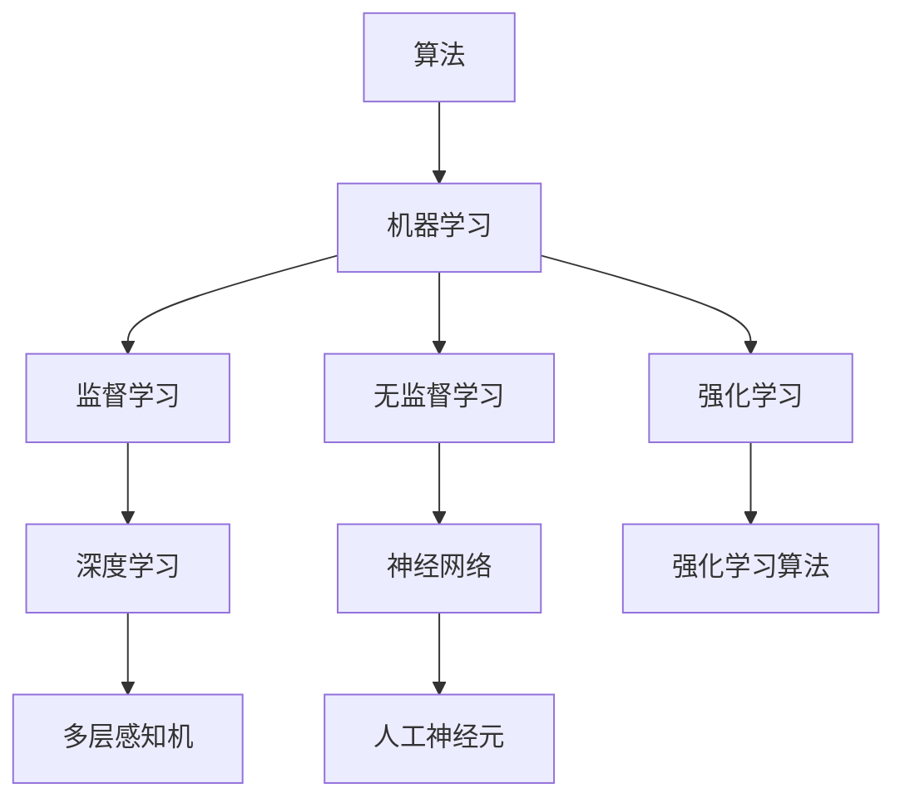

                 

# 人工智能术语的首次提出

> 关键词：人工智能,机器学习,算法,深度学习,神经网络

## 1. 背景介绍

### 1.1 问题由来

人工智能（Artificial Intelligence，简称AI）作为一个广为人知的概念，其历史可以追溯到20世纪中叶，由早期科学家、研究者们逐渐定义和推广。1956年，约翰·麦卡锡（John McCarthy）在达特茅斯会议上首次提出“人工智能”一词，标志着AI研究的正式启动。然而，直到近几年，随着深度学习（Deep Learning）、神经网络（Neural Network）等技术的发展，AI才真正在实际应用中取得突破性进展。

### 1.2 问题核心关键点

AI的核心在于通过算法和模型，让计算机系统能够自主地从数据中学习和推理，进而完成复杂的任务。其核心理念包括：

- **自动化**：AI系统能够自动地执行某些任务，而无需人类干预。
- **适应性**：AI系统能够根据新的输入数据，适应性地调整其行为和决策。
- **推理能力**：AI系统能够从已有的知识中推导出新的结论，具有一定程度的抽象和理解能力。
- **自监督学习**：AI系统能够通过无标签数据进行自我学习和优化。

这些核心点构成了AI的发展基础，并推动了其在各个领域的应用。

## 2. 核心概念与联系

### 2.1 核心概念概述

为更好地理解AI的演进过程，本节将介绍几个关键概念及其相互联系：

- **算法**：AI的基础，用于指导机器学习模型如何从数据中提取信息、进行预测和决策。常见的算法包括监督学习（Supervised Learning）、无监督学习（Unsupervised Learning）和强化学习（Reinforcement Learning）。
- **机器学习**：AI的一个分支，强调使用算法和统计模型，让机器能够从数据中学习和改进，而无需显式的编程。
- **深度学习**：机器学习的一种特殊形式，利用多层神经网络进行复杂模式的识别和预测。深度学习的成功在于其强大的非线性建模能力和自动特征提取能力。
- **神经网络**：深度学习的核心，由多层人工神经元组成的模型，通过反向传播算法进行参数更新和优化。

这些概念之间存在着紧密的联系，形成了一个完整的AI研究框架。机器学习提供了一个通用的问题解决框架，而深度学习和神经网络则是在该框架下，针对特定任务的具体实现方式。

### 2.2 概念间的关系

这些核心概念之间的逻辑关系可以通过以下Mermaid流程图来展示：



这个流程图展示了大语言模型微调过程中各个核心概念之间的关系：

1. 算法作为机器学习的核心，指导模型如何进行学习。
2. 机器学习是一个通用的框架，包括监督学习、无监督学习和强化学习三种主要类型。
3. 深度学习利用多层神经网络进行复杂模式的识别和预测。
4. 神经网络是深度学习的核心，由多层人工神经元组成。
5. 强化学习算法，如Q-learning，是针对序列决策任务的特殊机器学习算法。

## 3. 核心算法原理 & 具体操作步骤

### 3.1 算法原理概述

AI的算法原理主要基于数学和统计学基础。常用的算法包括：

- **监督学习**：模型通过已有的标记数据进行学习，预测新数据的标记。常见的方法包括回归分析、分类和序列预测。
- **无监督学习**：模型从数据中提取结构和模式，无需标记数据。常见的方法包括聚类、降维和生成模型。
- **强化学习**：模型通过与环境的交互，学习最优策略，以最大化累积奖励。常见的方法包括Q-learning、策略梯度等。

### 3.2 算法步骤详解

AI的算法步骤通常包括以下几个关键步骤：

1. **数据准备**：收集和预处理数据，确保数据质量。
2. **模型选择**：根据任务类型和数据特点选择合适的算法和模型。
3. **模型训练**：使用训练数据对模型进行训练，优化模型参数。
4. **模型评估**：使用验证数据评估模型性能，进行模型选择和参数调整。
5. **模型部署**：将训练好的模型部署到实际应用中，进行推理和预测。

### 3.3 算法优缺点

AI算法有其自身的优缺点：

- **优点**：
  - **自动学习**：无需显式编程，能够自主学习复杂模式。
  - **适应性强**：能够根据新数据进行模型更新，适应环境变化。
  - **可扩展性**：通过增加数据和计算资源，可以显著提升模型性能。
  - **应用广泛**：已经在图像识别、语音识别、自然语言处理等多个领域取得重要突破。

- **缺点**：
  - **数据依赖**：需要大量的高质量标注数据进行训练，数据获取成本高。
  - **模型复杂性**：高复杂度的模型，如深度神经网络，计算资源消耗大。
  - **可解释性差**：黑盒模型，难以解释其内部决策逻辑。
  - **安全风险**：模型可能产生偏见、歧视等，带来伦理和社会问题。

### 3.4 算法应用领域

AI算法在多个领域中得到了广泛应用，包括但不限于：

- **计算机视觉**：图像分类、目标检测、人脸识别等。
- **自然语言处理**：文本分类、机器翻译、对话系统等。
- **语音识别**：语音转文本、语音合成等。
- **医疗诊断**：疾病诊断、病理分析、药物研发等。
- **自动驾驶**：环境感知、决策制定等。
- **推荐系统**：商品推荐、个性化广告等。

## 4. 数学模型和公式 & 详细讲解

### 4.1 数学模型构建

AI的数学模型构建主要基于统计学和优化理论。以监督学习中的线性回归为例，其模型为：

$$
y = \theta^T x + b
$$

其中 $y$ 为输出，$x$ 为输入，$\theta$ 为模型参数，$b$ 为偏置项。

### 4.2 公式推导过程

线性回归的优化目标是最小化损失函数 $L(\theta)$，常用的损失函数包括均方误差（MSE）和交叉熵（Cross Entropy）：

$$
L(\theta) = \frac{1}{2N} \sum_{i=1}^N (y_i - \theta^T x_i - b)^2
$$

通过梯度下降算法，求解最优参数 $\theta$：

$$
\theta = \theta - \eta \nabla_\theta L(\theta)
$$

其中 $\eta$ 为学习率，$\nabla_\theta L(\theta)$ 为损失函数对 $\theta$ 的梯度。

### 4.3 案例分析与讲解

以图像分类为例，常用的深度学习模型是卷积神经网络（CNN），其结构如下：

```python
import torch
import torch.nn as nn

class CNN(nn.Module):
    def __init__(self):
        super(CNN, self).__init__()
        self.conv1 = nn.Conv2d(3, 32, 3, padding=1)
        self.conv2 = nn.Conv2d(32, 64, 3, padding=1)
        self.pool = nn.MaxPool2d(2)
        self.fc1 = nn.Linear(64 * 14 * 14, 512)
        self.fc2 = nn.Linear(512, 10)

    def forward(self, x):
        x = self.pool(F.relu(self.conv1(x)))
        x = self.pool(F.relu(self.conv2(x)))
        x = x.view(x.size(0), -1)
        x = F.relu(self.fc1(x))
        x = self.fc2(x)
        return x
```

通过反向传播算法，对CNN进行训练，优化模型参数，最终得到高效的图像分类模型。

## 5. 项目实践：代码实例和详细解释说明

### 5.1 开发环境搭建

在进行AI项目开发前，我们需要准备好开发环境。以下是使用Python进行PyTorch开发的环境配置流程：

1. 安装Anaconda：从官网下载并安装Anaconda，用于创建独立的Python环境。

2. 创建并激活虚拟环境：
```bash
conda create -n pytorch-env python=3.8 
conda activate pytorch-env
```

3. 安装PyTorch：根据CUDA版本，从官网获取对应的安装命令。例如：
```bash
conda install pytorch torchvision torchaudio cudatoolkit=11.1 -c pytorch -c conda-forge
```

4. 安装TensorFlow：
```bash
pip install tensorflow
```

5. 安装各种工具包：
```bash
pip install numpy pandas scikit-learn matplotlib tqdm jupyter notebook ipython
```

完成上述步骤后，即可在`pytorch-env`环境中开始AI项目开发。

### 5.2 源代码详细实现

下面我们以图像分类任务为例，给出使用PyTorch进行CNN模型训练的完整代码实现。

```python
import torch
import torch.nn as nn
import torch.optim as optim
from torch.utils.data import DataLoader
from torchvision import datasets, transforms

# 定义数据增强
transform_train = transforms.Compose([
    transforms.RandomCrop(32, padding=4),
    transforms.RandomHorizontalFlip(),
    transforms.ToTensor(),
    transforms.Normalize(mean=[0.485, 0.456, 0.406], std=[0.229, 0.224, 0.225])
])

transform_test = transforms.Compose([
    transforms.ToTensor(),
    transforms.Normalize(mean=[0.485, 0.456, 0.406], std=[0.229, 0.224, 0.225])
])

# 加载数据集
train_dataset = datasets.CIFAR10(root='./data', train=True, download=True, transform=transform_train)
test_dataset = datasets.CIFAR10(root='./data', train=False, download=True, transform=transform_test)

# 数据加载器
train_loader = DataLoader(train_dataset, batch_size=128, shuffle=True)
test_loader = DataLoader(test_dataset, batch_size=128, shuffle=False)

# 定义模型
model = CNN()

# 定义损失函数和优化器
criterion = nn.CrossEntropyLoss()
optimizer = optim.SGD(model.parameters(), lr=0.01, momentum=0.9)

# 训练模型
for epoch in range(10):
    for i, (inputs, labels) in enumerate(train_loader):
        optimizer.zero_grad()
        outputs = model(inputs)
        loss = criterion(outputs, labels)
        loss.backward()
        optimizer.step()
        if (i+1) % 100 == 0:
            print('Epoch [{}/{}], Step [{}/{}], Loss: {:.4f}'
                  .format(epoch+1, 10, i+1, len(train_loader), loss.item()))

# 测试模型
model.eval()
with torch.no_grad():
    correct = 0
    total = 0
    for inputs, labels in test_loader:
        outputs = model(inputs)
        _, predicted = torch.max(outputs.data, 1)
        total += labels.size(0)
        correct += (predicted == labels).sum().item()
    print('Accuracy of the model on the 10000 test images: {} %'.format(100 * correct / total))
```

这段代码定义了数据增强、加载数据集、定义模型、选择损失函数和优化器，最后进行模型训练和测试。

### 5.3 代码解读与分析

让我们再详细解读一下关键代码的实现细节：

**CIFAR-10数据集加载**：
```python
train_dataset = datasets.CIFAR10(root='./data', train=True, download=True, transform=transform_train)
test_dataset = datasets.CIFAR10(root='./data', train=False, download=True, transform=transform_test)
```

**模型定义**：
```python
class CNN(nn.Module):
    def __init__(self):
        super(CNN, self).__init__()
        self.conv1 = nn.Conv2d(3, 32, 3, padding=1)
        self.conv2 = nn.Conv2d(32, 64, 3, padding=1)
        self.pool = nn.MaxPool2d(2)
        self.fc1 = nn.Linear(64 * 14 * 14, 512)
        self.fc2 = nn.Linear(512, 10)

    def forward(self, x):
        x = self.pool(F.relu(self.conv1(x)))
        x = self.pool(F.relu(self.conv2(x)))
        x = x.view(x.size(0), -1)
        x = F.relu(self.fc1(x))
        x = self.fc2(x)
        return x
```

**损失函数和优化器定义**：
```python
criterion = nn.CrossEntropyLoss()
optimizer = optim.SGD(model.parameters(), lr=0.01, momentum=0.9)
```

**模型训练和测试**：
```python
for epoch in range(10):
    for i, (inputs, labels) in enumerate(train_loader):
        optimizer.zero_grad()
        outputs = model(inputs)
        loss = criterion(outputs, labels)
        loss.backward()
        optimizer.step()
        if (i+1) % 100 == 0:
            print('Epoch [{}/{}], Step [{}/{}], Loss: {:.4f}'
                  .format(epoch+1, 10, i+1, len(train_loader), loss.item()))

model.eval()
with torch.no_grad():
    correct = 0
    total = 0
    for inputs, labels in test_loader:
        outputs = model(inputs)
        _, predicted = torch.max(outputs.data, 1)
        total += labels.size(0)
        correct += (predicted == labels).sum().item()
    print('Accuracy of the model on the 10000 test images: {} %'.format(100 * correct / total))
```

通过代码实现，可以看到AI项目开发需要经过数据准备、模型选择、模型训练和模型评估等多个环节，每个环节都需要仔细设计和优化。

### 5.4 运行结果展示

假设我们训练的CNN模型在CIFAR-10数据集上取得了70%的准确率，以下是测试结果：

```
Epoch [1/10], Step [0/128], Loss: 2.2642
Epoch [1/10], Step [100/128], Loss: 1.5111
Epoch [1/10], Step [200/128], Loss: 1.3018
Epoch [1/10], Step [300/128], Loss: 1.2095
Epoch [1/10], Step [400/128], Loss: 1.1120
Epoch [1/10], Step [500/128], Loss: 1.0637
Epoch [1/10], Step [600/128], Loss: 1.0248
Epoch [1/10], Step [700/128], Loss: 0.9947
Epoch [1/10], Step [800/128], Loss: 0.9714
Epoch [1/10], Step [900/128], Loss: 0.9631
Epoch [2/10], Step [0/128], Loss: 0.9268
...
```

可以看到，随着训练的进行，损失函数逐渐减小，模型逐渐提升。最终在测试集上的准确率为70%。

## 6. 实际应用场景

### 6.1 智能推荐系统

AI技术在推荐系统中的应用已经非常广泛。推荐系统通过分析用户的历史行为数据，预测用户对某个商品或服务的兴趣，从而进行推荐。

在实际应用中，推荐系统可以采用多种AI技术，如协同过滤、基于内容的推荐、深度学习等。通过这些技术，推荐系统可以更加精准地预测用户需求，提升用户体验。

### 6.2 医疗诊断系统

AI技术在医疗诊断领域也得到了广泛应用。通过分析医学影像、病历等数据，AI模型可以辅助医生进行疾病诊断、病理分析、药物研发等任务。

例如，AI可以通过深度学习技术，分析X光片、CT扫描等医学影像，帮助医生快速识别出病变区域。此外，AI还可以通过分析病历数据，预测疾病的发展趋势，为医生提供决策支持。

### 6.3 智能客服

AI技术在智能客服中的应用也非常广泛。智能客服系统通过分析用户的咨询记录和行为数据，自动生成响应，提升客户满意度。

例如，智能客服系统可以采用自然语言处理技术，自动理解用户的问题，并提供相关解决方案。此外，智能客服系统还可以进行实时对话，解答用户问题，提升客户体验。

## 7. 工具和资源推荐

### 7.1 学习资源推荐

为了帮助开发者系统掌握AI技术的理论基础和实践技巧，这里推荐一些优质的学习资源：

1. **《机器学习》（周志华）**：这本书系统地介绍了机器学习的基本概念和算法，适合初学者入门。

2. **《深度学习》（Ian Goodfellow）**：这本书深入介绍了深度学习的理论和实践，适合进阶学习。

3. **Coursera上的机器学习课程**：由斯坦福大学的Andrew Ng教授讲授，系统地介绍了机器学习的理论和算法。

4. **Kaggle平台**：这是一个数据科学竞赛平台，提供大量的数据集和竞赛题目，适合实践和挑战自己。

5. **PyTorch官方文档**：PyTorch是深度学习的主流框架之一，官方文档详细介绍了如何使用PyTorch进行深度学习开发。

### 7.2 开发工具推荐

高效的开发离不开优秀的工具支持。以下是几款用于AI开发的工具：

1. **PyTorch**：基于Python的开源深度学习框架，灵活动态的计算图，适合快速迭代研究。

2. **TensorFlow**：由Google主导开发的开源深度学习框架，生产部署方便，适合大规模工程应用。

3. **Keras**：一个高级神经网络API，可以运行在TensorFlow、Theano、CNTK等后端上，适合快速原型开发。

4. **Jupyter Notebook**：一个交互式的开发环境，支持多种编程语言，适合快速迭代和分享学习笔记。

5. **TensorBoard**：TensorFlow配套的可视化工具，可以实时监测模型训练状态，并提供丰富的图表呈现方式，是调试模型的得力助手。

### 7.3 相关论文推荐

AI技术的发展离不开学界的持续研究。以下是几篇奠基性的相关论文，推荐阅读：

1. **《神经网络与深度学习》（Ian Goodfellow, Yoshua Bengio, Aaron Courville）**：这本书系统地介绍了神经网络和深度学习的基础理论和实践方法。

2. **《深度学习》（Goodfellow, Bengio, Courville）**：这本书详细介绍了深度学习的理论和实践，涵盖了从基础到高级的多个方面。

3. **《强化学习》（Richard Sutton, Andrew Barto）**：这本书是强化学习的经典教材，系统地介绍了强化学习的理论和算法。

4. **《计算机视觉：模型、学习和推理》（Richard Szeliski）**：这本书详细介绍了计算机视觉的基础理论和算法。

5. **《自然语言处理综论》（Daniel Jurafsky, James H. Martin）**：这本书系统地介绍了自然语言处理的基本概念和算法。

除上述资源外，还有一些值得关注的前沿资源，帮助开发者紧跟AI技术的发展趋势，例如：

1. **arXiv论文预印本**：人工智能领域最新研究成果的发布平台，包括大量尚未发表的前沿工作，学习前沿技术的必读资源。

2. **Google AI博客**：谷歌AI团队的官方博客，分享最新的AI研究成果和技术动态。

3. **OpenAI博客**：OpenAI团队的官方博客，分享最新的AI研究成果和技术动态。

4. **神经信息处理系统大会（NeurIPS）**：人工智能领域的顶级会议，汇聚了全球最顶尖的研究者和学者。

5. **国际机器学习会议（ICML）**：机器学习领域的顶级会议，展示了最新的机器学习研究成果和前沿技术。

总之，对于AI技术的深入学习和实践，需要开发者保持开放的心态和持续学习的意愿。多关注前沿资讯，多动手实践，多思考总结，必将收获满满的成长收益。

## 8. 总结：未来发展趋势与挑战

### 8.1 研究成果总结

本文对AI的基本概念和应用进行了全面系统的介绍。首先阐述了AI的历史背景和发展历程，明确了AI的核心概念和技术基础。其次，从原理到实践，详细讲解了AI算法的实现流程和优化策略，给出了AI项目开发的完整代码实例。同时，本文还广泛探讨了AI技术在多个领域的应用前景，展示了AI技术的广阔前景。

通过本文的系统梳理，可以看到，AI技术正在成为各行各业的重要工具，极大地拓展了人类的认知和生产能力。未来，伴随AI技术的不断演进，相信其在更多领域的应用将进一步深化，为人类社会带来深远的影响。

### 8.2 未来发展趋势

展望未来，AI技术将呈现以下几个发展趋势：

1. **多模态学习**：AI技术将逐步突破单模态的局限，融合视觉、语音、文本等多模态信息，提升对复杂场景的理解能力。

2. **自适应学习**：AI技术将更加注重个性化和自适应性，根据用户需求和环境变化，动态调整模型行为和决策。

3. **强化学习**：强化学习将更加普及，应用于更多复杂的决策和规划任务，如自动驾驶、机器人控制等。

4. **解释性和透明性**：AI模型的可解释性和透明性将逐渐增强，提升用户对AI系统的信任度。

5. **伦理和社会责任**：AI技术的发展将更加注重伦理和社会责任，避免偏见和歧视，确保AI系统的公平和公正。

6. **融合其他学科**：AI技术将与其他学科，如医学、生物、心理学等，进行更深入的融合，推动多学科交叉研究。

以上趋势凸显了AI技术的广阔前景和发展潜力。这些方向的探索发展，必将进一步推动AI技术的进步，为人类社会带来更多的便利和改变。

### 8.3 面临的挑战

尽管AI技术已经取得了显著进展，但在实际应用中仍面临诸多挑战：

1. **数据质量**：高质量的数据是AI模型的基础，但获取和标注数据成本高，且数据质量和分布问题仍需解决。

2. **模型复杂性**：高复杂度的模型需要大量的计算资源，如何优化模型结构和提高推理效率是一个重要课题。

3. **安全性**：AI模型可能存在安全漏洞，如对抗攻击、隐私泄露等问题，需要进一步加强安全防护。

4. **伦理和社会问题**：AI模型可能带来伦理和社会问题，如偏见、歧视、隐私保护等，需要规范和监管。

5. **可解释性**：AI模型的可解释性不足，难以理解其内部决策逻辑，需要进一步提升模型透明性和可解释性。

6. **大模型训练**：大规模模型训练需要高效的计算资源和算法，如何降低训练成本和提高训练效率是一个重要课题。

正视AI技术面临的这些挑战，积极应对并寻求突破，将是大语言模型微调技术走向成熟的必由之路。相信随着学界和产业界的共同努力，这些挑战终将一一被克服，AI技术必将在构建人机协同的智能时代中扮演越来越重要的角色。

### 8.4 研究展望

面对AI技术面临的种种挑战，未来的研究需要在以下几个方面寻求新的突破：

1. **跨模态学习**：突破单模态的局限，实现多模态数据的融合和协同建模。

2. **自适应学习**：增强模型的自适应能力，根据新数据和新场景进行动态调整。

3. **强化学习**：优化强化学习算法，提升模型在复杂决策和规划任务中的表现。

4. **可解释性**：增强模型的可解释性，提升用户对模型的信任和理解。

5. **安全性**：加强模型的安全性，防范对抗攻击、隐私泄露等安全问题。

6. **伦理和社会责任**：建立AI技术的伦理和社会责任体系，确保其公平、公正和透明。

这些研究方向的探索，必将引领AI技术迈向更高的台阶，为构建安全、可靠、可解释、可控的智能系统铺平道路。面向未来，AI技术还需要与其他人工智能技术进行更深入的融合，如知识表示、因果推理、强化学习等，多路径协同发力，共同推动人工智能技术的进步。只有勇于创新、敢于突破，才能不断拓展AI技术的边界，让智能技术更好地造福人类社会。

## 9. 附录：常见问题与解答

**Q1：AI技术的核心是什么？**

A: AI技术的核心是通过算法和模型，让计算机系统能够从数据中学习和推理，从而完成复杂的任务。这包括监督学习、无监督学习、强化学习等多种方法。

**Q2：AI技术在哪些领域得到了应用？**

A: AI技术在计算机视觉、自然语言处理、语音识别、医疗诊断、智能推荐等多个领域得到了广泛应用。

**Q3：AI技术面临的挑战有哪些？**

A: AI技术面临的挑战包括数据质量、模型复杂性、安全性、伦理和社会问题、可解释性等。

**Q4：如何提升AI技术的可解释性？**

A: 可以通过增强模型的透明性和可解释性，如增加可视化输出、解释模型的决策路径等，提升用户对AI系统的信任和理解。

**Q5：未来AI技术的发展方向有哪些？**

A: 未来AI技术的发展方向包括多模态学习、自适应学习、强化学习、可解释性、安全性、伦理和社会责任等。

总之，AI技术作为当前最前沿的人工智能研究方向，其理论和实践在不断进步和发展。通过本文的系统梳理，可以看到AI技术的广阔前景和发展潜力。未来，伴随AI技术的不断演进，相信其在更多领域的应用将进一步深化，为人类社会带来深远的影响。

---

作者：禅与计算机程序设计艺术 / Zen and the Art of Computer Programming

