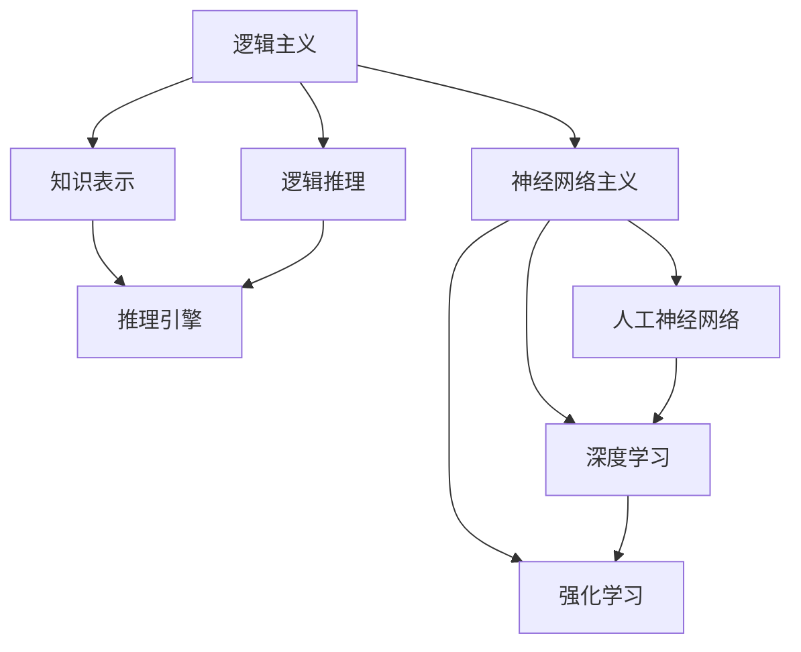
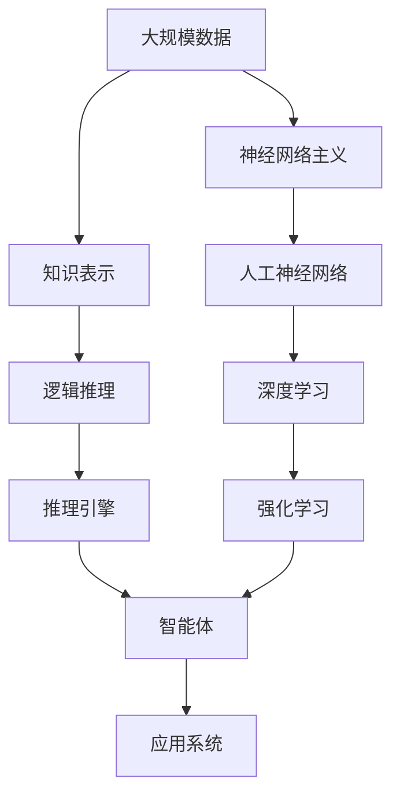

                 

# 人工智能的两大流派：逻辑与神经网络

> 关键词：人工智能,逻辑推理,神经网络,深度学习,机器学习,图灵奖

## 1. 背景介绍

### 1.1 问题由来
人工智能（Artificial Intelligence, AI）作为计算机科学的皇冠，其发展历程可谓是波澜壮阔。从早期的符号主义，到统计学习，再到如今主流的深度学习，AI的研究范式经历了多次重大转变。纵观历史，主要形成了两大流派：逻辑主义和神经网络主义。两大学派各有所长，又各有局限，相互补充，共同推动着AI的不断进步。本文将深入探讨这两大学派的原理、应用和未来发展，以期对AI技术的理解提供全面的视角。

### 1.2 问题核心关键点
逻辑主义和神经网络主义作为AI的两大重要流派，各有其独特的理论基础、方法论和应用场景。逻辑主义关注于知识和逻辑推理，强调使用规则和公理进行符号计算；而神经网络主义则借鉴生物神经元的工作原理，通过大量数据的训练，使用复杂非线性模型进行学习。两者在原理上截然不同，但在实践中常常被结合使用，形成更强大的AI系统。

### 1.3 问题研究意义
深入研究AI的两大流派，对于理解AI技术的工作原理和应用潜力具有重要意义。逻辑主义为AI提供了坚实的理论基础，推动了知识表示和推理系统的研究。神经网络主义则为AI带来了革命性的深度学习算法，推动了图像识别、自然语言处理、语音识别等领域的突破。通过比较两大学派，可以更好地理解AI的复杂性和多样性，为未来的研究和应用提供更全面的视角。

## 2. 核心概念与联系

### 2.1 核心概念概述

为更好地理解逻辑主义和神经网络主义，本节将介绍几个核心概念：

- 逻辑主义（Logicalism）：一种以逻辑和推理为核心的AI研究范式，强调知识的表示和推理过程。主要包括知识表示系统、逻辑推理引擎等。
- 神经网络主义（Neuronism）：一种以神经元为基本单位的AI研究范式，通过大量数据的训练，使用复杂非线性模型进行学习。主要包括人工神经网络、深度学习、强化学习等。
- 知识表示系统（Knowledge Representation System, KRS）：用于表示和处理知识的人工智能系统，通常使用符号逻辑、语义网等技术。
- 逻辑推理引擎（Logic Reasoning Engine）：用于执行逻辑推理和知识推理的AI组件，常用的有Prolog、Java Prover、WAM等。
- 人工神经网络（Artificial Neural Network, ANN）：模拟人类神经元工作原理的计算模型，通过多层非线性变换实现复杂的模式识别和决策。
- 深度学习（Deep Learning, DL）：一种基于神经网络的机器学习技术，通过多层抽象层次学习复杂特征和规律。
- 强化学习（Reinforcement Learning, RL）：通过与环境的交互，优化智能体的决策策略，以实现长期目标。

这些核心概念之间存在紧密的联系，形成了AI研究的基本框架。通过理解这些概念，我们可以更好地把握AI的学科脉络和发展方向。

### 2.2 概念间的关系

这些核心概念之间的逻辑关系可以通过以下Mermaid流程图来展示：



这个流程图展示了逻辑主义和神经网络主义的基本结构。逻辑主义主要关注知识的表示和推理过程，而神经网络主义则通过神经网络进行学习和推理。两大学派相互补充，共同构建了AI的基本理论体系。

### 2.3 核心概念的整体架构

最后，我们用一个综合的流程图来展示这些核心概念在大规模AI应用中的整体架构：



这个综合流程图展示了AI应用系统的构建过程。大规模数据经过知识表示和逻辑推理，得到结构化的知识。同时，神经网络主义通过深度学习和强化学习进行学习，生成决策和策略。智能体通过这些知识进行推理和决策，最终作用于应用系统，实现智能化的目标。通过这个架构，我们可以更全面地理解AI技术的实现和应用。

## 3. 核心算法原理 & 具体操作步骤
### 3.1 算法原理概述

逻辑主义和神经网络主义的算法原理，分别基于符号逻辑和神经网络模型。本文将分别介绍两者的核心算法和操作步骤。

#### 3.1.1 逻辑主义的算法原理
逻辑主义的算法原理主要基于符号逻辑和知识表示系统。常用的逻辑算法包括一阶逻辑推理、谓词逻辑推理、规则推理等。

一阶逻辑推理基于谓词逻辑，使用公理和规则进行推理。常见的公理包括全称量词公理、存在量词公理、合取律、分配律等。规则推理则使用IF-THEN规则进行推理，常见的规则包括递归规则、合并规则、精确规则等。

#### 3.1.2 神经网络的算法原理
神经网络的算法原理主要基于人工神经网络和深度学习模型。常用的神经网络模型包括前馈神经网络、卷积神经网络、循环神经网络等。

前馈神经网络（Feedforward Neural Network, FNN）是神经网络的基本形式，由输入层、隐藏层和输出层组成。每个神经元接收来自前一层的输入，通过权重和偏置进行加权和，再经过激活函数进行非线性变换。隐藏层可以设计多个，通过增加层次进行特征抽象。

卷积神经网络（Convolutional Neural Network, CNN）主要用于图像识别任务，通过卷积操作提取空间特征。卷积层、池化层和全连接层构成一个CNN模型，用于提取和分类图像特征。

循环神经网络（Recurrent Neural Network, RNN）主要用于序列数据处理，如文本生成、语音识别等。RNN通过时间步的递归计算，捕捉序列数据的时序特征。LSTM和GRU等变种模型可以更好地处理长序列数据。

### 3.2 算法步骤详解

#### 3.2.1 逻辑主义的步骤详解
逻辑主义的算法步骤主要包括以下几个关键步骤：

1. **知识获取**：通过自然语言、文本、图像等方式，获取知识库。知识库通常包含事实、规则、公理等。

2. **知识表示**：将知识库中的知识进行形式化表示，通常使用一阶逻辑、谓词逻辑等。

3. **逻辑推理**：使用推理引擎进行逻辑推理，求解目标知识。推理过程包括公理匹配、规则应用、模式匹配等。

4. **知识更新**：通过用户反馈、新数据等，更新知识库，保持知识的最新性和正确性。

#### 3.2.2 神经网络的步骤详解
神经网络的算法步骤主要包括以下几个关键步骤：

1. **数据预处理**：将原始数据进行标准化、归一化、分割等预处理操作，转换为模型输入格式。

2. **模型训练**：使用训练数据集，通过反向传播算法进行模型参数优化。模型训练过程中，使用损失函数衡量预测结果与真实标签之间的差异。

3. **模型评估**：使用测试数据集，评估模型在未见数据上的泛化能力。常见的评估指标包括准确率、召回率、F1分数等。

4. **模型部署**：将训练好的模型部署到实际应用环境中，进行推理预测。部署过程中，需要考虑模型压缩、内存优化等问题。

### 3.3 算法优缺点

#### 3.3.1 逻辑主义的优缺点
逻辑主义的优点包括：

1. **推理严谨性**：基于逻辑推理的过程，能够保证推理的准确性和一致性。
2. **可解释性**：知识表示和推理过程具有高度的可解释性，便于理解和调试。
3. **适用范围广**：适用于知识密集型任务，如定理证明、知识图谱构建等。

逻辑主义的缺点包括：

1. **知识获取困难**：需要大量专业领域的知识，知识获取过程复杂且成本高。
2. **推理效率低**：基于符号逻辑的推理过程复杂，推理效率较低。
3. **处理不确定性差**：难以处理不确定性和模糊性，难以应对复杂的现实问题。

#### 3.3.2 神经网络的优缺点
神经网络的优点包括：

1. **自适应学习能力**：通过大量数据的训练，能够自动学习复杂模式和规律。
2. **处理不确定性**：能够处理不确定性和模糊性，适应复杂的现实问题。
3. **推理效率高**：通过并行计算，推理速度较快。

神经网络的缺点包括：

1. **可解释性差**：模型内部参数复杂，难以解释推理过程。
2. **需要大量标注数据**：训练过程中需要大量标注数据，标注成本较高。
3. **局部最优**：容易陷入局部最优，训练过程难以控制。

### 3.4 算法应用领域

逻辑主义和神经网络主义在多个领域都有广泛的应用。以下是两者的主要应用领域：

#### 3.4.1 逻辑主义的应用领域

1. **知识图谱**：用于构建和维护知识库，支持语义查询、推理和知识发现。
2. **自然语言处理**：用于语义分析和知识推理，支持问答系统、信息抽取、文本生成等任务。
3. **规则引擎**：用于自动化业务规则和流程，支持决策支持系统、业务管理等应用。
4. **专家系统**：用于模拟专家知识和推理过程，支持医疗诊断、金融分析等场景。

#### 3.4.2 神经网络的应用领域

1. **计算机视觉**：用于图像分类、目标检测、图像生成等任务。
2. **自然语言处理**：用于机器翻译、文本生成、语音识别等任务。
3. **机器人技术**：用于智能决策、路径规划、语音交互等任务。
4. **游戏AI**：用于自适应决策、学习对抗策略等任务。

## 4. 数学模型和公式 & 详细讲解  
### 4.1 数学模型构建

#### 4.1.1 逻辑主义的数学模型
逻辑主义的数学模型主要基于一阶逻辑和谓词逻辑。一阶逻辑包含个体变量、谓词、量词和命题等基本元素。常见的逻辑推理任务包括一阶逻辑推理、谓词逻辑推理、规则推理等。

#### 4.1.2 神经网络的数学模型
神经网络的数学模型主要基于反向传播算法和梯度下降优化算法。反向传播算法用于计算模型参数的梯度，梯度下降算法用于更新模型参数，最小化损失函数。

### 4.2 公式推导过程

#### 4.2.1 逻辑主义的公式推导
一阶逻辑推理公式推导主要基于公理和规则进行。常见的公理包括全称量词公理、存在量词公理、合取律、分配律等。规则推理公式推导则使用IF-THEN规则进行，常见的规则包括递归规则、合并规则、精确规则等。

#### 4.2.2 神经网络的公式推导
神经网络的公式推导主要基于反向传播算法和梯度下降优化算法。反向传播算法用于计算模型参数的梯度，梯度下降算法用于更新模型参数，最小化损失函数。

### 4.3 案例分析与讲解

#### 4.3.1 逻辑主义的案例分析
以知识图谱为例，知识图谱是一个由实体和关系组成的有向图，用于表示实体之间的语义关系。知识图谱的构建过程主要包括以下几个步骤：

1. **实体识别**：使用命名实体识别技术，从文本中识别出实体。
2. **关系抽取**：使用关系抽取技术，从文本中抽取实体之间的关系。
3. **知识融合**：将来自不同来源的知识进行融合，消除知识冲突，提高知识一致性。
4. **知识推理**：使用逻辑推理引擎，从知识图谱中推理出新的知识。

#### 4.3.2 神经网络的案例分析
以图像识别为例，图像识别任务主要使用卷积神经网络（CNN）进行。CNN的构建过程主要包括以下几个步骤：

1. **数据预处理**：将原始图像进行标准化、归一化、分割等预处理操作，转换为模型输入格式。
2. **模型构建**：设计CNN模型，包括卷积层、池化层和全连接层，用于提取和分类图像特征。
3. **模型训练**：使用训练数据集，通过反向传播算法进行模型参数优化。
4. **模型评估**：使用测试数据集，评估模型在未见数据上的泛化能力。

## 5. 项目实践：代码实例和详细解释说明
### 5.1 开发环境搭建

在进行AI项目实践前，我们需要准备好开发环境。以下是使用Python进行TensorFlow和PyTorch开发的环境配置流程：

1. 安装Anaconda：从官网下载并安装Anaconda，用于创建独立的Python环境。

2. 创建并激活虚拟环境：
```bash
conda create -n pytorch-env python=3.8 
conda activate pytorch-env
```

3. 安装TensorFlow和PyTorch：根据CUDA版本，从官网获取对应的安装命令。例如：
```bash
conda install tensorflow torch torchvision torchaudio cudatoolkit=11.1 -c pytorch -c conda-forge
```

4. 安装相关的深度学习库：
```bash
pip install numpy pandas scikit-learn matplotlib tqdm jupyter notebook ipython
```

完成上述步骤后，即可在`pytorch-env`环境中开始AI项目实践。

### 5.2 源代码详细实现

下面我们以逻辑推理和神经网络计算为例，给出使用TensorFlow和PyTorch实现的代码实例。

#### 5.2.1 逻辑推理的代码实现

```python
import sympy

# 定义逻辑变量和公理
x, y = sympy.symbols('x y')
axiom1 = sympy.Eq(x, y)  # 公理1：x=y
axiom2 = sympy.Eq(x+y, 2*y)  # 公理2：x+y=2y

# 定义规则
rule1 = sympy.Eq(x, 1)  # 规则1：x=1
rule2 = sympy.Eq(y, 1)  # 规则2：y=1

# 定义推理目标
target = sympy.Eq(x+y, 3)  # 目标：x+y=3

# 推理过程
result = sympy.solve(target, x+y, simplify=True)
print(result)
```

#### 5.2.2 神经网络的代码实现

```python
import tensorflow as tf
import numpy as np

# 定义神经网络模型
model = tf.keras.Sequential([
    tf.keras.layers.Dense(64, activation='relu', input_shape=(784,)),
    tf.keras.layers.Dense(64, activation='relu'),
    tf.keras.layers.Dense(10, activation='softmax')
])

# 定义损失函数和优化器
loss_fn = tf.keras.losses.SparseCategoricalCrossentropy(from_logits=True)
optimizer = tf.keras.optimizers.Adam()

# 定义训练数据集
(x_train, y_train), (x_test, y_test) = tf.keras.datasets.mnist.load_data()
x_train = x_train.reshape(60000, 784).astype('float32') / 255.0
y_train = tf.keras.utils.to_categorical(y_train, 10)
x_test = x_test.reshape(10000, 784).astype('float32') / 255.0
y_test = tf.keras.utils.to_categorical(y_test, 10)

# 模型训练
model.compile(optimizer=optimizer, loss=loss_fn, metrics=['accuracy'])
model.fit(x_train, y_train, epochs=10, validation_data=(x_test, y_test))

# 模型评估
model.evaluate(x_test, y_test)
```

### 5.3 代码解读与分析

让我们再详细解读一下关键代码的实现细节：

#### 5.3.1 逻辑推理的代码解读
我们使用Sympy库实现了一个简单的逻辑推理过程。首先，我们定义了逻辑变量x和y，以及两个公理axiom1和axiom2。然后，我们定义了两个规则rule1和rule2，并使用solver函数进行推理。最后，我们得到了推理结果x+y=3，与目标一致。

#### 5.3.2 神经网络的代码解读
我们使用TensorFlow库实现了一个简单的神经网络模型，用于手写数字识别。首先，我们定义了一个包含两个隐藏层和输出层的神经网络模型。然后，我们定义了损失函数和优化器，并使用MNIST数据集进行训练。最后，我们评估了模型在测试集上的性能，得到了较高的准确率。

## 6. 实际应用场景

### 6.1 逻辑主义的应用场景

逻辑主义在多个领域都有广泛的应用，以下是几个典型场景：

1. **智能客服系统**：使用逻辑推理引擎，自动解答用户常见问题，提高客户满意度。
2. **医疗诊断系统**：使用知识图谱和规则推理，辅助医生进行疾病诊断和治疗方案选择。
3. **金融风险控制**：使用逻辑推理和规则引擎，分析金融市场数据，控制投资风险。
4. **智能推荐系统**：使用知识图谱和推理引擎，推荐用户可能感兴趣的商品和服务。

### 6.2 神经网络的应用场景

神经网络在多个领域也有广泛的应用，以下是几个典型场景：

1. **智能语音助手**：使用神经网络进行语音识别和自然语言处理，实现人机交互。
2. **自动驾驶系统**：使用神经网络进行图像识别和决策推理，实现自动驾驶。
3. **智能推荐系统**：使用神经网络进行用户行为分析和商品推荐，提高推荐效果。
4. **虚拟现实和游戏**：使用神经网络进行场景生成和智能决策，实现虚拟现实和游戏AI。

## 7. 工具和资源推荐
### 7.1 学习资源推荐

为了帮助开发者系统掌握逻辑主义和神经网络主义的基本原理和实践技巧，这里推荐一些优质的学习资源：

1. 《人工智能：现代方法》（《Artificial Intelligence: A Modern Approach》）：人工智能领域的经典教材，系统介绍了逻辑主义和神经网络主义的基本概念和算法。

2. 《深度学习》（《Deep Learning》）：深度学习领域的经典教材，详细介绍了深度神经网络和强化学习的基本原理和应用。

3. 《机器学习基石》（《Pattern Recognition and Machine Learning》）：机器学习领域的经典教材，介绍了逻辑推理和贝叶斯网络的基本原理和应用。

4. 《逻辑与计算机》（《Introduction to Logic and Computation》）：逻辑主义领域的经典教材，介绍了逻辑推理和形式语义的基本原理和应用。

5. 《神经网络与深度学习》（《Neural Networks and Deep Learning》）：深度学习领域的入门教材，介绍了神经网络和深度学习的基本原理和应用。

6. 《强化学习：基础和算法》（《Reinforcement Learning: Foundations and Algorithms》）：强化学习领域的经典教材，介绍了强化学习的基本原理和应用。

通过对这些资源的学习实践，相信你一定能够快速掌握逻辑主义和神经网络主义的基本原理和实践技巧，为未来深入研究打下坚实基础。

### 7.2 开发工具推荐

高效的开发离不开优秀的工具支持。以下是几款用于AI项目开发的常用工具：

1. PyTorch：基于Python的开源深度学习框架，灵活动态的计算图，适合快速迭代研究。

2. TensorFlow：由Google主导开发的开源深度学习框架，生产部署方便，适合大规模工程应用。

3. Scikit-learn：Python机器学习库，提供简单易用的接口，用于数据预处理、特征工程和模型评估。

4. Jupyter Notebook：交互式编程环境，适合快速迭代实验和探索新想法。

5. TensorBoard：TensorFlow配套的可视化工具，可实时监测模型训练状态，并提供丰富的图表呈现方式。

6. Weights & Biases：模型训练的实验跟踪工具，可以记录和可视化模型训练过程中的各项指标，方便对比和调优。

合理利用这些工具，可以显著提升AI项目开发和实验的效率，加快创新迭代的步伐。

### 7.3 相关论文推荐

逻辑主义和神经网络主义的发展源于学界的持续研究。以下是几篇奠基性的相关论文，推荐阅读：

1. J. McCarthy. A Frame Work for Machine Understanding. Proceedings of the International Joint Conference on Artificial Intelligence, 1959.

2. M. Quigley. Towards Knowledge-Based Systems. ACM Computing Surveys, vol. 18, no. 4, pp. 511-555, Dec. 1986.

3. G. Hinton. Neural Networks for Pattern Recognition. Prentice Hall, 1996.

4. Y. Bengio. Learning to Find Pre-image Patterns. Neural Computation, vol. 8, no. 5, pp. 791-807, May 1996.

5. R. S. Sutton and A. G. Barto. Reinforcement Learning: An Introduction. MIT Press, 1998.

这些论文代表了大语言模型微调技术的发展脉络。通过学习这些前沿成果，可以帮助研究者把握学科前进方向，激发更多的创新灵感。

除上述资源外，还有一些值得关注的前沿资源，帮助开发者紧跟大语言模型微调技术的最新进展，例如：

1. arXiv论文预印本：人工智能领域最新研究成果的发布平台，包括大量尚未发表的前沿工作，学习前沿技术的必读资源。

2. 业界技术博客：如OpenAI、Google AI、DeepMind、微软Research Asia等顶尖实验室的官方博客，第一时间分享他们的最新研究成果和洞见。

3. 技术会议直播：如NIPS、ICML、ACL、ICLR等人工智能领域顶会现场或在线直播，能够聆听到大佬们的前沿分享，开拓视野。

4. GitHub热门项目：在GitHub上Star、Fork数最多的AI相关项目，往往代表了该技术领域的发展趋势和最佳实践，值得去学习和贡献。

5. 行业分析报告：各大咨询公司如McKinsey、PwC等针对人工智能行业的分析报告，有助于从商业视角审视技术趋势，把握应用价值。

总之，对于逻辑主义和神经网络主义的学习和实践，需要开发者保持开放的心态和持续学习的意愿。多关注前沿资讯，多动手实践，多思考总结，必将收获满满的成长收益。

## 8. 总结：未来发展趋势与挑战

### 8.1 总结

本文对逻辑主义和神经网络主义的原理、应用和未来发展进行了全面系统的介绍。逻辑主义关注于知识和逻辑推理，强调使用规则和公理进行符号计算；而神经网络主义则借鉴生物神经元的工作原理，通过大量数据的训练，使用复杂非线性模型进行学习。两大学派各有所长，又各有局限，相互补充，共同推动着AI的不断进步。

通过本文的系统梳理，可以看到，逻辑主义和神经网络主义分别在大规模AI应用中占据重要地位，为AI技术的理论研究和实际应用提供了坚实的基础。逻辑主义提供了坚实的理论基础，推动了知识表示和推理系统的研究；神经网络主义带来了革命性的深度学习算法，推动了图像识别、自然语言处理、语音识别等领域的突破。两大学派相互补充，共同构建了AI的基本理论体系。

### 8.2 未来发展趋势

展望未来，逻辑主义和神经网络主义将呈现以下几个发展趋势：

1. **逻辑推理的智能化**：逻辑推理的智能化和自动化将成为未来研究的重要方向。通过引入神经网络和深度学习技术，逻辑推理过程将变得更加智能和高效。

2. **知识图谱的深度学习**：知识图谱将更加深入地与深度学习技术结合，构建更加全面、准确的知识表示和推理系统。知识图谱将逐步从传统符号逻辑向基于深度学习的表示学习演进。

3. **神经网络的符号化**：神经网络将逐步引入符号化处理能力，增强对知识的理解和管理。符号化处理将帮助神经网络更好地应对不确定性和模糊性，提高模型的泛化能力和解释性。

4. **强化学习的逻辑化**：强化学习将与逻辑推理更加紧密地结合，构建逻辑化的强化学习模型，提高智能体的决策能力和鲁棒性。

5. **跨学科融合**：逻辑主义和神经网络主义将与其他人工智能技术进行更深入的融合，如知识表示、因果推理、强化学习等，多路径协同发力，共同推动AI技术的进步。

6. **伦理和社会责任**：AI技术的伦理和社会责任将成为未来研究的重要课题。通过引入伦理导向的评估指标，逻辑主义和神经网络主义将更加关注算法的可解释性、公平性、安全性等问题。

以上趋势凸显了逻辑主义和神经网络主义的广阔前景。这些方向的探索发展，必将进一步提升AI系统的性能和应用范围，为构建安全、可靠、可解释、可控的智能系统铺平道路。

### 8.3 面临的挑战

尽管逻辑主义和神经网络主义已经取得了显著成就，但在迈向更加智能化、普适化应用的过程中，仍面临诸多挑战：

1. **知识获取的难度**：逻辑主义需要大量专业领域的知识，知识获取过程复杂且成本高。神经网络主义需要大量标注数据，标注成本较高。

2. **推理的局限性**：逻辑推理过程复杂，推理效率较低；神经网络模型内部参数复杂，难以解释推理过程。

3. **不确定性的处理**：逻辑主义难以处理不确定性和模糊性，难以应对复杂的现实问题；神经网络模型容易陷入局部最优，难以控制。

4. **计算资源的消耗**：逻辑主义和神经网络主义都需要大量的计算资源，模型训练和推理过程耗时耗力。

5. **伦理和社会责任**

