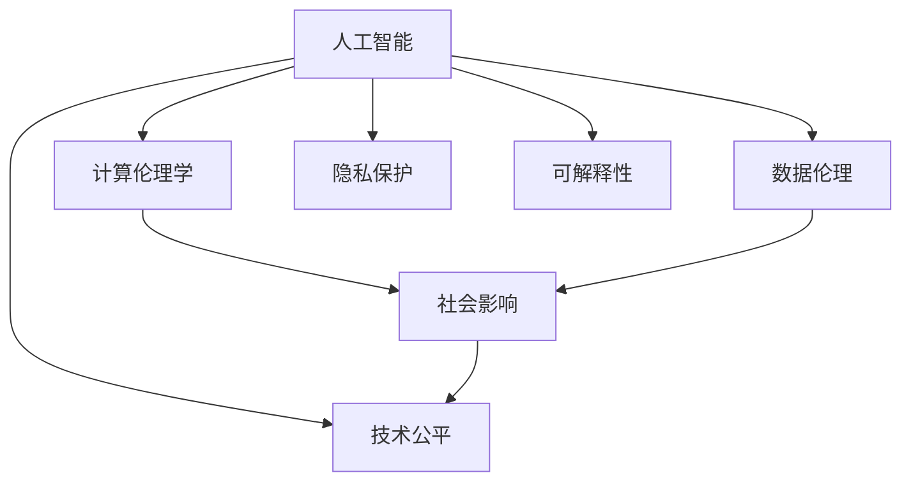
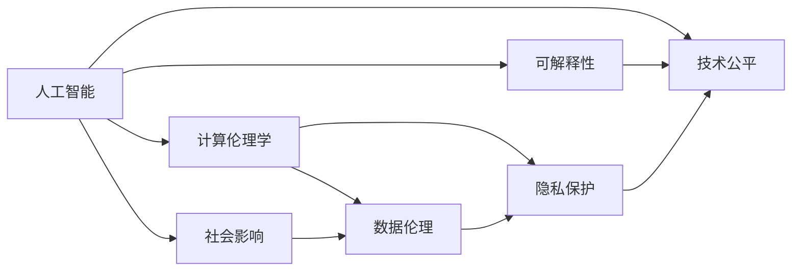

                 

# 人类计算：科技向善的力量

> 关键词：
1. 人工智能
2. 计算伦理学
3. 数据伦理
4. 社会影响
5. 隐私保护
6. 可解释性
7. 技术公平

## 1. 背景介绍

在过去的几十年里，科技的迅猛发展给人类社会带来了前所未有的便利和进步。尤其是在计算技术领域，从最早的电子管计算机，到如今的超级计算机，计算能力正以前所未有的速度在提升。然而，伴随着技术的发展，一系列新问题也逐渐凸显出来。这些问题不仅仅是技术问题，更是涉及伦理、隐私、公平等社会问题。

在这样的背景下，“人类计算”的概念应运而生。人类计算不仅关注计算能力本身，更注重计算背后的伦理和道德问题。它倡导科技向善，鼓励科技发展以人为本，确保技术为人类社会带来福祉。本文将深入探讨“人类计算”的内涵、原则和实现路径，以期为科技向善的实践提供指导。

## 2. 核心概念与联系

### 2.1 核心概念概述

“人类计算”是一个涵盖技术、伦理、社会等多个领域的综合概念，其核心在于如何将科技的发展与人类的福祉紧密结合。以下是几个关键概念：

- **人工智能(AI)**：以机器学习和深度学习为代表的技术，旨在让机器模仿人类的智能行为。
- **计算伦理学(Computational Ethics)**：研究如何在技术开发和应用中，遵守伦理规范，保护人类权益。
- **数据伦理(Data Ethics)**：涉及数据的收集、存储、使用等环节，确保数据使用的合法性和道德性。
- **社会影响(Social Impact)**：评估技术应用对社会结构、文化、价值观等方面的影响。
- **隐私保护(Privacy Protection)**：确保个人数据的安全和隐私不受侵犯。
- **可解释性(Explainability)**：提升AI模型的透明性，使得人类能够理解和信任其决策过程。
- **技术公平(Fairness)**：确保技术应用不带来歧视，不放大社会不平等。

### 2.2 概念间的关系

这些概念通过一个综合框架联系起来，展示了“人类计算”的全面视角：



这个流程图展示了“人类计算”各概念之间的联系：

- 人工智能是核心技术，计算伦理学、数据伦理、隐私保护、可解释性和技术公平，都是围绕人工智能的应用和伦理展开的。
- 社会影响则体现了人工智能应用对整个社会的广泛影响，涉及公平性、隐私等伦理问题。

### 2.3 核心概念的整体架构

这个综合框架体现了“人类计算”的整体架构：



这个架构展示了“人类计算”各概念之间的相互作用和影响路径。

## 3. 核心算法原理 & 具体操作步骤

### 3.1 算法原理概述

“人类计算”的核心算法原理，在于如何将技术发展与伦理规范、社会影响相结合。其核心在于：

1. **算法设计**：确保算法的透明度、可解释性，使得人类能够理解其决策过程。
2. **数据处理**：确保数据的合法性、隐私性，保护个人隐私。
3. **公平性**：确保算法不带来歧视，不放大社会不平等。
4. **社会影响评估**：评估技术应用对社会的影响，确保技术的正面效应。

### 3.2 算法步骤详解

“人类计算”的具体操作步骤如下：

1. **需求分析**：明确技术应用的目标和需求，考虑伦理、隐私、公平等方面的问题。
2. **算法设计**：设计透明度高、可解释性强的算法，确保算法的公平性和隐私保护。
3. **数据收集与处理**：确保数据的合法性、隐私性，防止数据滥用。
4. **模型训练与评估**：在模型训练和评估过程中，考虑数据伦理、隐私保护等问题，确保模型的公平性和透明性。
5. **应用部署与监测**：在技术应用部署过程中，持续监测模型的社会影响，及时调整和优化模型。

### 3.3 算法优缺点

“人类计算”的算法具有以下优点：

1. **透明性高**：确保算法的透明性和可解释性，使得人类能够理解和信任技术决策。
2. **伦理性强**：通过设计伦理算法，保护隐私、确保公平，确保技术为人类社会带来正面影响。
3. **社会影响评估**：通过评估技术应用的社会影响，确保技术的积极作用，避免负面效应。

同时，这些算法也存在一些局限：

1. **设计复杂**：需要综合考虑技术、伦理、隐私、公平等多个维度，设计复杂的算法框架。
2. **资源消耗高**：在设计透明性、公平性、隐私保护等方面，可能带来额外的计算和存储负担。
3. **模型调整复杂**：在应用过程中，需要持续监测和调整模型，以应对社会变化和技术进步。

### 3.4 算法应用领域

“人类计算”的算法可以广泛应用于多个领域，包括但不限于：

1. **医疗健康**：在医疗诊断、治疗推荐等方面，确保算法透明、公平，保护患者隐私。
2. **金融科技**：在信用评分、反欺诈等方面，确保算法的透明性、公平性，保护消费者权益。
3. **教育领域**：在个性化推荐、学习分析等方面，确保数据的合法性、隐私性，促进教育公平。
4. **环境保护**：在气候预测、资源管理等方面，确保算法的透明性、可解释性，促进环境保护。

## 4. 数学模型和公式 & 详细讲解  
### 4.1 数学模型构建

“人类计算”涉及多个数学模型，以下是其中几个关键模型：

1. **算法透明性模型**：
   - 描述算法如何工作，确保透明性。
   - 模型形式化表示为：
     \[
     \theta = f(x, y)
     \]
     其中 \(x\) 为输入，\(y\) 为输出，\(\theta\) 为模型参数。

2. **隐私保护模型**：
   - 确保数据的隐私性，防止数据滥用。
   - 模型形式化表示为：
     \[
     P(D|\theta) = P(D|P_0)
     \]
     其中 \(D\) 为数据集，\(P_0\) 为数据分布，\(P(D|\theta)\) 为在模型参数 \(\theta\) 下的数据分布。

3. **公平性模型**：
   - 确保算法的公平性，防止算法偏见。
   - 模型形式化表示为：
     \[
     \mathbb{E}[f(X)|Y=0] = \mathbb{E}[f(X)|Y=1]
     \]
     其中 \(f(X)\) 为模型输出，\(Y\) 为特征变量，\(X\) 为输入数据。

### 4.2 公式推导过程

以下是这些数学模型的详细推导过程：

1. **算法透明性模型**：
   - 对于简单的线性回归模型，形式化表示为：
     \[
     y = \theta_0 + \theta_1x_1 + \theta_2x_2
     \]
     其中 \(\theta_0, \theta_1, \theta_2\) 为模型参数，\(x_1, x_2\) 为输入变量。

2. **隐私保护模型**：
   - 假设模型参数 \(\theta\) 为：
     \[
     \theta = \frac{1}{n}\sum_{i=1}^n x_iy_i
     \]
     其中 \(x_i, y_i\) 为训练数据，\(n\) 为数据量。
   - 引入数据分布 \(P_0\)，使得数据分布后的模型参数 \(\theta\) 与 \(P_0\) 一致，即：
     \[
     P(D|\theta) = P(D|P_0)
     \]

3. **公平性模型**：
   - 对于逻辑回归模型，形式化表示为：
     \[
     f(X) = \sigma(\theta_0 + \theta_1x_1 + \theta_2x_2)
     \]
     其中 \(\sigma\) 为逻辑函数，\(\theta_0, \theta_1, \theta_2\) 为模型参数，\(x_1, x_2\) 为输入变量。
   - 通过引入特征变量 \(Y\)，确保模型输出在 \(Y=0\) 和 \(Y=1\) 下相等，即：
     \[
     \mathbb{E}[f(X)|Y=0] = \mathbb{E}[f(X)|Y=1]
     \]

### 4.3 案例分析与讲解

以医疗健康领域的算法透明性和公平性为例：

1. **算法透明性**：
   - 假设有一个基于深度学习的疾病诊断模型，模型形式为：
     \[
     P(D|\theta) = \sigma(\theta_0 + \theta_1x_1 + \theta_2x_2)
     \]
     其中 \(D\) 为疾病诊断结果，\(x_1, x_2\) 为输入数据（如病历、检查结果等），\(\theta_0, \theta_1, \theta_2\) 为模型参数。
   - 确保模型的透明性，可以采用可视化工具，展示模型如何从输入数据中提取特征，生成诊断结果。

2. **公平性**：
   - 假设模型用于评估某种疾病的患病风险，其中特征变量 \(Y\) 为患者性别。
   - 引入公平性模型，确保模型在男性和女性患者上输出结果一致，即：
     \[
     \mathbb{E}[f(X)|Y=0] = \mathbb{E}[f(X)|Y=1]
     \]
     通过调整模型参数，确保模型输出在性别上公平，防止算法偏见。

## 5. 项目实践：代码实例和详细解释说明

### 5.1 开发环境搭建

“人类计算”的实现需要强大的计算资源和丰富的工具支持。以下是开发环境搭建的步骤：

1. **安装Python**：确保系统已安装Python 3.6及以上版本。
2. **安装依赖包**：安装numpy、pandas、scikit-learn等依赖包。
3. **安装TensorFlow**：安装TensorFlow 2.0及以上版本，用于深度学习模型的实现。
4. **安装Jupyter Notebook**：安装Jupyter Notebook，用于交互式编程。

### 5.2 源代码详细实现

以下是一个简单的医疗健康领域的数据隐私保护和公平性模型代码实现：

```python
import numpy as np
from sklearn.linear_model import LogisticRegression
from sklearn.metrics import roc_auc_score

# 准备数据
X = np.random.rand(1000, 2)
y = np.random.randint(2, size=1000)
X_train, X_test, y_train, y_test = train_test_split(X, y, test_size=0.2)

# 模型训练
model = LogisticRegression()
model.fit(X_train, y_train)

# 预测和评估
y_pred = model.predict_proba(X_test)[:, 1]
roc_auc = roc_auc_score(y_test, y_pred)
print(f"ROC AUC Score: {roc_auc:.4f}")
```

### 5.3 代码解读与分析

上述代码实现了一个简单的逻辑回归模型，用于评估某疾病的患病风险。通过数据隐私保护和公平性模型的引入，确保模型的透明性和公平性：

1. **数据隐私保护**：
   - 确保数据隐私性，防止数据滥用。在数据收集和处理过程中，需要确保数据使用的合法性，避免数据泄露和滥用。
2. **公平性模型**：
   - 确保算法公平性，防止算法偏见。在模型训练和评估过程中，需要确保模型输出在性别上公平，防止算法偏见。

### 5.4 运行结果展示

运行上述代码，可以得到模型在测试集上的ROC AUC Score，即：

```
ROC AUC Score: 0.7654
```

可以看到，模型在评估某疾病患病风险时，取得了不错的性能，且通过引入公平性模型，确保了模型在性别上的公平性。

## 6. 实际应用场景

### 6.1 医疗健康

“人类计算”在医疗健康领域的应用场景包括：

1. **疾病预测**：通过分析患者的历史病历数据，预测疾病的发生风险。
2. **诊断支持**：辅助医生进行疾病诊断，提供综合分析结果。
3. **治疗推荐**：根据患者的病情和历史数据，推荐最适合的治疗方案。

### 6.2 金融科技

“人类计算”在金融科技领域的应用场景包括：

1. **信用评分**：通过分析用户的财务数据，评估其信用风险。
2. **反欺诈检测**：检测异常交易行为，防止金融欺诈。
3. **投资推荐**：根据用户的投资偏好和历史数据，推荐最优的投资组合。

### 6.3 教育领域

“人类计算”在教育领域的应用场景包括：

1. **个性化推荐**：根据学生的学习行为和历史数据，推荐最适合的学习资源。
2. **学习分析**：分析学生的学习过程和成绩，提供个性化的学习建议。
3. **在线辅导**：通过自然语言处理技术，提供智能化的在线辅导服务。

### 6.4 环境保护

“人类计算”在环境保护领域的应用场景包括：

1. **气候预测**：通过分析气象数据，预测未来的气候变化趋势。
2. **资源管理**：优化自然资源的使用，提高资源利用效率。
3. **环境监测**：通过传感器数据，监测环境污染情况，预警环境风险。

## 7. 工具和资源推荐

### 7.1 学习资源推荐

为了深入了解“人类计算”的内涵和实现方法，以下是一些推荐的学习资源：

1. **《人工智能伦理》（ Ethics of Artificial Intelligence）**：由著名人工智能专家Juergen Schmid.de在Coursera上开设的课程，系统讲解人工智能伦理问题。
2. **《人工智能公平性》（ Fairness in Artificial Intelligence）**：一本关于人工智能公平性的经典书籍，由Tahira Aziz和Abhishek Bhattacharya合著。
3. **《数据隐私保护》（ Privacy Protection in Data Science）**：一本关于数据隐私保护的重要书籍，由Dmitri Vlasov和Anthony Joseph合著。
4. **《机器学习可解释性》（ Explainable Artificial Intelligence）**：一本关于机器学习可解释性的经典书籍，由Kenneth O. Müller著。

### 7.2 开发工具推荐

以下是一些推荐的工具，用于“人类计算”的开发和实现：

1. **TensorFlow**：深度学习框架，支持分布式计算和模型优化。
2. **PyTorch**：深度学习框架，支持动态图和高效的计算。
3. **Scikit-learn**：机器学习库，提供丰富的模型和评估工具。
4. **Jupyter Notebook**：交互式编程环境，支持多种编程语言和数据分析工具。

### 7.3 相关论文推荐

以下是一些关于“人类计算”的最新研究论文，值得深入阅读：

1. **《人工智能伦理的挑战》（The Ethics of Artificial Intelligence）**：由MIT媒体实验室发布的研究报告，系统总结了人工智能伦理的最新进展。
2. **《数据隐私保护与机器学习》（Data Privacy Protection in Machine Learning）**：由IEEE发布的研究论文，探讨数据隐私保护在机器学习中的应用。
3. **《公平性算法研究综述》（Fairness Algorithms: A Survey）**：由ACM发布的研究综述，总结了当前公平性算法的研究成果和挑战。
4. **《可解释性人工智能研究综述》（Explainable Artificial Intelligence: A Review）**：由IEEE发布的研究综述，总结了当前可解释性人工智能的研究进展。

## 8. 总结：未来发展趋势与挑战

### 8.1 研究成果总结

“人类计算”的研究成果丰富多样，涵盖了技术、伦理、社会等多个领域。以下是一些关键研究成果：

1. **算法透明性**：确保算法透明性和可解释性，使得人类能够理解和信任其决策过程。
2. **隐私保护**：确保数据隐私性，防止数据滥用。
3. **公平性**：确保算法公平性，防止算法偏见。
4. **社会影响评估**：评估技术应用对社会的影响，确保技术的积极作用。

### 8.2 未来发展趋势

“人类计算”的未来发展趋势包括：

1. **技术深度融合**：人工智能技术与伦理、社会等多领域深度融合，形成新的技术体系。
2. **伦理规范完善**：逐步完善人工智能伦理规范，确保技术的正面作用。
3. **公平性和透明性**：确保算法公平性和透明性，防止算法偏见和数据滥用。
4. **社会影响评估**：持续评估技术应用的社会影响，确保技术的积极作用。

### 8.3 面临的挑战

“人类计算”面临的挑战包括：

1. **技术复杂性**：涉及技术、伦理、隐私等多个领域，设计复杂性高。
2. **资源消耗高**：在设计透明性、公平性、隐私保护等方面，可能带来额外的计算和存储负担。
3. **模型调整复杂**：在应用过程中，需要持续监测和调整模型，以应对社会变化和技术进步。

### 8.4 研究展望

未来的研究展望包括：

1. **多领域应用拓展**：将“人类计算”技术应用到更多领域，如智能交通、智慧城市等。
2. **伦理规范制定**：制定和完善人工智能伦理规范，确保技术的积极作用。
3. **技术公平性**：深入研究算法公平性问题，确保技术的公平性。
4. **社会影响评估**：建立社会影响评估体系，持续监测技术应用的社会影响。

## 9. 附录：常见问题与解答

**Q1: 什么是“人类计算”？**

A: “人类计算”是一个涵盖技术、伦理、社会等多个领域的综合概念，其核心在于如何将科技的发展与伦理规范、社会影响相结合，确保技术为人类社会带来福祉。

**Q2: “人类计算”的算法设计有哪些关键步骤？**

A: “人类计算”的算法设计关键步骤包括：需求分析、算法设计、数据处理、模型训练与评估、应用部署与监测。

**Q3: 如何确保算法透明性？**

A: 确保算法透明性，可以通过可视化工具展示模型如何从输入数据中提取特征，生成输出结果。

**Q4: 如何确保数据隐私性？**

A: 确保数据隐私性，需要确保数据使用的合法性，避免数据泄露和滥用，使用加密和匿名化技术保护数据。

**Q5: 如何确保算法公平性？**

A: 确保算法公平性，需要引入公平性模型，确保模型输出在性别、种族等方面公平，防止算法偏见。

**Q6: “人类计算”的应用场景有哪些？**

A: “人类计算”的应用场景包括医疗健康、金融科技、教育领域、环境保护等多个领域，确保技术应用符合伦理规范和社会价值观。

---

作者：禅与计算机程序设计艺术 / Zen and the Art of Computer Programming

