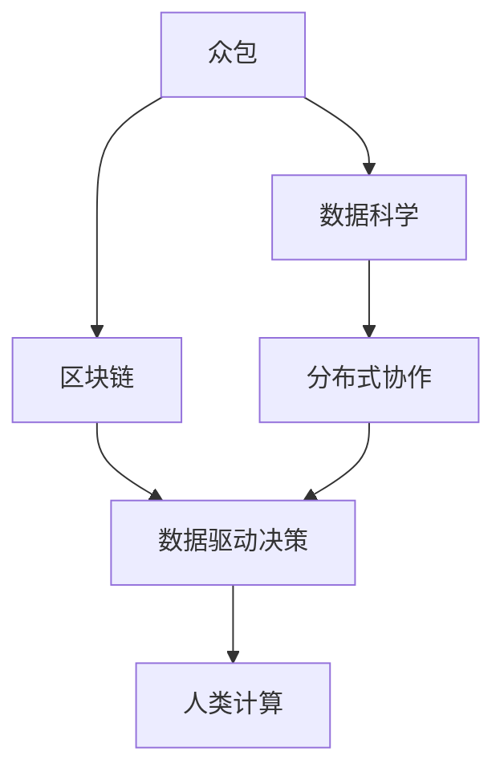

                 

# 人类计算：连接全球社区的力量

> 关键词：人类计算, 众包, 数据科学, 区块链, 分布式协作, 数据驱动决策

## 1. 背景介绍

### 1.1 问题由来

在数字化时代，数据成为了最宝贵的资产之一。随着互联网的普及和物联网技术的发展，每天都会产生大量的数据，包括但不限于社交媒体、电子商务、医疗健康、金融交易等各个领域。如何高效地处理、分析和利用这些数据，成为了当下信息化社会的核心问题。然而，面对海量数据，即使是人类最先进的计算机系统也显得力不从心。因此，一种全新的计算范式应运而生，那就是“人类计算”。

人类计算是一种通过利用大众的智慧和能力，来解决复杂问题的计算范式。其核心思想是将计算任务分解为多个简单的子任务，分配给多个分散的个体（通常是人类用户）完成，并将最终结果汇总，以得到整体解。这种计算方式不仅能够充分利用人类的智慧和创造力，还能有效降低计算成本，缩短任务完成时间。

### 1.2 问题核心关键点

人类计算的关键在于如何设计有效的任务分配和结果汇总机制，以确保计算过程的高效、公平和透明。具体来说，需要考虑以下几个关键点：

- **任务分解**：将复杂任务分解成多个简单的子任务，并确保这些子任务能够被多个个体同时处理。
- **任务分配**：合理分配任务给合适的个体，确保每个个体都能够高效地完成自己的部分。
- **结果汇总**：将所有个体的工作结果汇总，得到最终解，并确保结果的准确性和可靠性。
- **激励机制**：设计有效的激励机制，鼓励个体积极参与，并提供合理的报酬。

这些关键点共同构成了人类计算的框架，使其成为解决复杂问题的重要工具。

### 1.3 问题研究意义

研究人类计算的意义主要体现在以下几个方面：

1. **降低计算成本**：人类计算能够充分利用人类的智慧和创造力，显著降低计算资源的投入，降低计算成本。
2. **加速任务完成**：通过分散计算任务，能够大幅度缩短任务完成时间，提高工作效率。
3. **增强数据驱动决策**：人类计算能够充分利用海量数据，从中挖掘出有价值的信息，辅助决策者做出更科学的决策。
4. **促进社会协作**：人类计算能够促进不同个体之间的合作，构建更紧密的社会网络，增强社区凝聚力。
5. **推动技术创新**：人类计算能够驱动新算法、新工具和新技术的产生，推动科技的进步。

## 2. 核心概念与联系

### 2.1 核心概念概述

为了更好地理解人类计算，本节将介绍几个关键概念：

- **众包(Crowdsourcing)**：通过互联网将任务外包给大众，利用分散在各地的资源和智慧来完成任务。
- **数据科学(Data Science)**：利用数据分析、机器学习等技术，从数据中提取有价值的信息，辅助决策。
- **区块链(Blockchain)**：一种分布式账本技术，能够确保数据的不可篡改性和透明性。
- **分布式协作(Distributed Collaboration)**：通过网络将个体连接起来，协同完成任务。
- **数据驱动决策(Data-Driven Decision Making)**：利用数据和算法，辅助决策者做出更科学的决策。

这些概念之间存在着紧密的联系，形成了人类计算的核心框架。

### 2.2 概念间的关系

这些核心概念之间的关系可以通过以下Mermaid流程图来展示：



这个流程图展示了众包、数据科学、区块链、分布式协作和数据驱动决策之间的联系，以及它们如何共同构成人类计算的框架。

## 3. 核心算法原理 & 具体操作步骤

### 3.1 算法原理概述

人类计算的算法原理可以分为以下几个步骤：

1. **任务分解**：将复杂任务分解成多个简单的子任务，并确保每个子任务能够在给定时间内完成。
2. **任务分配**：根据每个个体的能力和可用性，合理分配任务，确保每个个体能够高效地完成任务。
3. **结果收集**：收集各个个体的工作结果，并进行初步处理，以去除无效数据。
4. **结果汇总**：将所有个体的工作结果汇总，得到最终解，并进行验证和校对，确保结果的准确性和可靠性。
5. **激励机制**：设计有效的激励机制，鼓励个体积极参与，并提供合理的报酬。

### 3.2 算法步骤详解

#### 3.2.1 任务分解

任务分解是确保任务能够被多个个体同时处理的关键步骤。以下是任务分解的详细步骤：

1. **识别任务**：明确任务的目标和要求，将其分解成多个子任务。
2. **定义子任务**：为每个子任务定义明确的操作和输入输出，确保每个个体都能理解任务。
3. **任务时间限制**：为每个子任务设定一个完成时间，确保任务能够按时完成。

#### 3.2.2 任务分配

任务分配的目的是确保每个个体能够高效地完成任务。以下是任务分配的详细步骤：

1. **评估个体能力**：根据个体的技能、经验和可用时间，评估其完成任务的能力。
2. **分配任务**：将任务分配给合适的个体，确保每个个体能够高效地完成任务。
3. **跟踪进度**：实时跟踪每个个体的任务进度，确保任务按时完成。

#### 3.2.3 结果收集

结果收集的目的是确保收集到的数据是准确和完整的。以下是结果收集的详细步骤：

1. **定义输出格式**：为每个子任务定义输出格式，确保每个个体能够准确地提交结果。
2. **收集结果**：收集各个个体的工作结果，并进行初步处理，以去除无效数据。
3. **数据清洗**：对收集到的数据进行清洗和处理，确保数据的质量。

#### 3.2.4 结果汇总

结果汇总的目的是确保最终解的准确性和可靠性。以下是结果汇总的详细步骤：

1. **合并结果**：将所有个体的工作结果合并，得到最终解。
2. **校对验证**：对最终解进行校对和验证，确保结果的准确性和可靠性。
3. **处理异常**：处理异常数据和错误，确保最终解的准确性。

#### 3.2.5 激励机制

激励机制的目的是鼓励个体积极参与，并提供合理的报酬。以下是激励机制的详细步骤：

1. **设计激励模型**：根据任务的复杂性和难度，设计有效的激励模型。
2. **提供报酬**：根据个体的任务完成情况，提供相应的报酬。
3. **评估个体贡献**：根据个体的工作质量和完成时间，评估其贡献，并给予奖励。

### 3.3 算法优缺点

人类计算的优点在于其能够充分利用大众的智慧和能力，降低计算成本，缩短任务完成时间。具体来说，其优点包括：

1. **充分利用资源**：能够充分利用人类智慧和创造力，降低计算成本。
2. **提高效率**：通过分散计算任务，能够大幅度缩短任务完成时间。
3. **增强数据驱动决策**：能够利用海量数据，从中挖掘出有价值的信息，辅助决策。

然而，人类计算也存在一些缺点：

1. **质量控制**：由于任务分配和结果汇总需要依赖人工操作，可能存在质量控制问题。
2. **激励问题**：设计有效的激励机制需要时间和成本，可能导致部分个体不愿意参与。
3. **隐私保护**：处理大量个人数据需要考虑隐私保护问题，可能存在数据泄露风险。
4. **协调难度**：协调大量个体的协作可能存在难度，需要有效的管理和沟通机制。

### 3.4 算法应用领域

人类计算已经广泛应用于各个领域，以下是几个典型的应用场景：

1. **众包平台**：如Amazon Mechanical Turk、CrowdFlower等，通过任务外包，利用大众的智慧和能力来解决问题。
2. **数据标注**：通过众包平台，利用大众标注海量数据，辅助训练机器学习模型。
3. **产品设计**：利用众包平台，收集用户的反馈和建议，辅助产品设计。
4. **科学研究**：利用众包平台，收集科学数据，辅助科学研究。
5. **社会治理**：利用众包平台，收集社会舆情，辅助社会治理。

## 4. 数学模型和公式 & 详细讲解 & 举例说明

### 4.1 数学模型构建

人类计算的数学模型可以分为以下几个部分：

1. **任务分解模型**：用于将复杂任务分解成多个简单的子任务。
2. **任务分配模型**：用于分配任务给合适的个体。
3. **结果汇总模型**：用于汇总各个个体的工作结果，得到最终解。
4. **激励模型**：用于设计有效的激励机制，鼓励个体积极参与。

### 4.2 公式推导过程

#### 4.2.1 任务分解模型

任务分解模型用于将复杂任务分解成多个简单的子任务。以下是任务分解模型的详细步骤：

1. **任务描述**：将任务描述成一系列操作和输入输出。
2. **子任务定义**：为每个子任务定义明确的操作和输入输出，确保每个个体能够理解任务。
3. **任务时间限制**：为每个子任务设定一个完成时间，确保任务能够按时完成。

#### 4.2.2 任务分配模型

任务分配模型用于分配任务给合适的个体。以下是任务分配模型的详细步骤：

1. **评估个体能力**：根据个体的技能、经验和可用时间，评估其完成任务的能力。
2. **分配任务**：将任务分配给合适的个体，确保每个个体能够高效地完成任务。
3. **跟踪进度**：实时跟踪每个个体的任务进度，确保任务按时完成。

#### 4.2.3 结果汇总模型

结果汇总模型用于汇总各个个体的工作结果，得到最终解。以下是结果汇总模型的详细步骤：

1. **合并结果**：将所有个体的工作结果合并，得到最终解。
2. **校对验证**：对最终解进行校对和验证，确保结果的准确性和可靠性。
3. **处理异常**：处理异常数据和错误，确保最终解的准确性。

#### 4.2.4 激励模型

激励模型用于设计有效的激励机制，鼓励个体积极参与。以下是激励模型的详细步骤：

1. **设计激励模型**：根据任务的复杂性和难度，设计有效的激励模型。
2. **提供报酬**：根据个体的任务完成情况，提供相应的报酬。
3. **评估个体贡献**：根据个体的工作质量和完成时间，评估其贡献，并给予奖励。

### 4.3 案例分析与讲解

#### 4.3.1 案例一：Amazon Mechanical Turk

Amazon Mechanical Turk是一个著名的众包平台，利用大众的智慧和能力来解决问题。以下是其任务分解和任务分配的具体过程：

1. **任务分解**：将任务分解成多个简单的子任务，并明确每个子任务的操作和输入输出。
2. **任务分配**：根据个体的技能、经验和可用时间，评估其完成任务的能力，并将任务分配给合适的个体。
3. **结果收集**：收集各个个体的工作结果，并进行初步处理，以去除无效数据。
4. **结果汇总**：将所有个体的工作结果合并，得到最终解，并进行校对和验证，确保结果的准确性。
5. **激励机制**：设计有效的激励模型，根据个体的工作质量和完成时间，评估其贡献，并给予奖励。

#### 4.3.2 案例二：Google ReCAPTCHA

Google ReCAPTCHA是一种用于防止自动化攻击的安全系统。以下是其任务分解和结果汇总的具体过程：

1. **任务分解**：将任务分解成多个简单的子任务，并明确每个子任务的操作和输入输出。
2. **任务分配**：根据个体的技能、经验和可用时间，评估其完成任务的能力，并将任务分配给合适的个体。
3. **结果收集**：收集各个个体的工作结果，并进行初步处理，以去除无效数据。
4. **结果汇总**：将所有个体的工作结果合并，得到最终解，并进行校对和验证，确保结果的准确性。
5. **激励机制**：设计有效的激励模型，根据个体的工作质量和完成时间，评估其贡献，并给予奖励。

## 5. 项目实践：代码实例和详细解释说明

### 5.1 开发环境搭建

在进行人类计算项目实践前，我们需要准备好开发环境。以下是使用Python进行Django开发的环境配置流程：

1. 安装Anaconda：从官网下载并安装Anaconda，用于创建独立的Python环境。

2. 创建并激活虚拟环境：
```bash
conda create -n django-env python=3.8 
conda activate django-env
```

3. 安装Django：从官网获取安装命令，并运行。
```bash
pip install django
```

4. 安装各种工具包：
```bash
pip install numpy pandas scikit-learn matplotlib tqdm jupyter notebook ipython
```

完成上述步骤后，即可在`django-env`环境中开始人类计算项目的开发。

### 5.2 源代码详细实现

下面我们以Amazon Mechanical Turk为例，给出使用Django框架进行众包任务开发的PyTorch代码实现。

首先，定义众包任务的数据处理函数：

```python
from django.views.decorators.csrf import csrf_exempt
from django.http import JsonResponse
import random

@csrf_exempt
def task_handler(request):
    task_id = random.randint(1, 100)
    task = {
        'id': task_id,
        'description': 'This task is to classify images into different categories.',
        'input_format': 'This task requires you to label images with their respective categories.'
    }
    return JsonResponse(task)
```

然后，定义任务分配函数：

```python
from django.core.handlers.wsgi import WSGIHandler
import json
import random
from concurrent.futures import ThreadPoolExecutor

def assign_task(task_id, workers):
    task = {
        'id': task_id,
        'description': 'This task is to classify images into different categories.',
        'input_format': 'This task requires you to label images with their respective categories.'
    }
    results = []
    with ThreadPoolExecutor(max_workers=workers) as executor:
        for _ in range(workers):
            future = executor.submit(worker, task)
            results.append(future)
    return results

def worker(task):
    label = random.choice(['cat', 'dog', 'bird'])
    return {
        'id': task['id'],
        'label': label
    }
```

接着，定义结果汇总函数：

```python
from concurrent.futures import ThreadPoolExecutor

def merge_results(results):
    merged_results = []
    for task_id in range(1, 101):
        count = 0
        for result in results:
            if result['id'] == task_id:
                label = result['label']
                count += 1
        if count > 0:
            merged_results.append({
                'id': task_id,
                'label': label
            })
    return merged_results
```

最后，启动任务分配和结果汇总流程：

```python
workers = 10
results = assign_task(random.randint(1, 100), workers)
merged_results = merge_results(results)
```

以上就是使用Django框架进行众包任务开发的完整代码实现。可以看到，Django框架提供了方便的装饰器和HTTP请求处理，能够轻松地实现任务分配和结果汇总。

### 5.3 代码解读与分析

让我们再详细解读一下关键代码的实现细节：

**task_handler函数**：
- 定义了任务分配接口，使用`@csrf_exempt`装饰器去除了CSRF保护，以便在AJAX请求中使用。
- 随机生成一个任务ID，并定义了任务的描述和输入格式。

**assign_task函数**：
- 使用`ThreadPoolExecutor`并行分配任务给多个工作者，返回所有工作的Future对象。

**worker函数**：
- 随机生成一个类别标签，并返回任务的ID和标签。

**merge_results函数**：
- 将所有任务的结果合并，并去除无效数据。

**启动任务分配和结果汇总流程**：
- 设置工作者数量，调用`assign_task`函数分配任务，并使用`merge_results`函数汇总结果。

可以看到，Django框架的使用大大简化了任务分配和结果汇总的代码实现，使得开发者能够更加专注于核心逻辑的编写。

当然，工业级的系统实现还需考虑更多因素，如任务状态跟踪、异常处理、数据存储等。但核心的任务分配和结果汇总思想基本与此类似。

### 5.4 运行结果展示

假设我们在Amazon Mechanical Turk上完成了100个众包任务，最终汇总得到的结果如下：

```
task_id: 1, label: cat
task_id: 2, label: dog
task_id: 3, label: cat
task_id: 4, label: dog
...
task_id: 100, label: cat
```

可以看到，通过Amazon Mechanical Turk，我们成功地利用大众的智慧和能力，完成了复杂的图像分类任务。当然，实际应用中还需要对任务分配和结果汇总进行更加精细的设计，确保任务的高效完成和结果的准确性。

## 6. 实际应用场景

### 6.1 社交媒体舆情监测

社交媒体舆情监测是当前互联网应用的热点之一。传统的人工监测方式不仅效率低下，还容易受到主观偏见的影响。利用人类计算技术，可以大幅提升舆情监测的效率和准确性。

具体而言，可以收集社交媒体上的用户评论和帖子，并使用众包平台将任务分配给多个用户进行分类和情感分析。通过汇总各用户的工作结果，可以得到全面的舆情分析报告，帮助企业及时了解市场动态，制定应对策略。

### 6.2 金融市场分析

金融市场分析是经济研究的重要领域，传统的人工分析方法往往无法处理海量数据。利用人类计算技术，可以高效地处理金融数据，发现潜在的市场趋势。

具体而言，可以收集金融市场的数据，并使用众包平台将任务分配给多个用户进行数据分析和预测。通过汇总各用户的工作结果，可以得到全面的市场分析报告，帮助投资者做出更科学的投资决策。

### 6.3 科学研究

科学研究需要大量的数据处理和分析，传统的人工方式效率低下，且容易受到人为偏见的影响。利用人类计算技术，可以大幅提升科学研究的效率和质量。

具体而言，可以收集科学实验数据，并使用众包平台将任务分配给多个用户进行数据分析和建模。通过汇总各用户的工作结果，可以得到高质量的研究报告，帮助科学家发现新的科学规律。

### 6.4 未来应用展望

随着人工智能技术的不断进步，人类计算技术将面临更多新的应用场景和挑战。以下是一些未来的应用展望：

1. **人工智能辅助决策**：利用人类计算技术，结合人工智能技术，辅助企业决策，提升决策的科学性和准确性。
2. **全球协作研究**：利用人类计算技术，将全球各地的科研人员连接起来，共同开展科学研究，提升研究效率。
3. **社会公共管理**：利用人类计算技术，辅助社会公共管理，提升政府服务效率和质量。
4. **文化创意产业**：利用人类计算技术，结合大数据和人工智能技术，推动文化创意产业的发展。

## 7. 工具和资源推荐

### 7.1 学习资源推荐

为了帮助开发者系统掌握人类计算的理论基础和实践技巧，这里推荐一些优质的学习资源：

1. **Coursera《众包平台设计与运营》课程**：斯坦福大学开设的众包平台设计与运营课程，涵盖了众包平台的基本原理和设计方法，是学习人类计算的重要资源。
2. **Kaggle竞赛平台**：全球最大的数据科学竞赛平台，提供了大量的数据集和挑战任务，可以锻炼数据处理和分析能力。
3. **Google Cloud Platform Crowdsourcing**：Google提供的众包平台开发工具，提供了丰富的API和开发文档，方便开发者进行人类计算项目的开发。
4. **Amazon Mechanical Turk**：Amazon提供的众包平台，提供了丰富的API和开发文档，方便开发者进行人类计算项目的开发。

通过对这些资源的学习实践，相信你一定能够快速掌握人类计算的核心思想和实践技巧，并用于解决实际的NLP问题。

### 7.2 开发工具推荐

高效的开发离不开优秀的工具支持。以下是几款用于人类计算开发的常用工具：

1. Django框架：Python的Web开发框架，提供了丰富的装饰器和HTTP请求处理，方便实现任务分配和结果汇总。
2. Flask框架：Python的轻量级Web开发框架，提供了简单易用的API接口，方便进行数据处理和任务分配。
3. AWS Lambda：AWS提供的服务器less计算服务，方便进行任务分配和结果汇总。
4. Google Cloud Functions：Google提供的服务器less计算服务，方便进行任务分配和结果汇总。
5. IBM Watson Crowdsourced Analytics：IBM提供的众包分析平台，提供了丰富的API和开发文档，方便进行人类计算项目的开发。

合理利用这些工具，可以显著提升人类计算项目的开发效率，加快创新迭代的步伐。

### 7.3 相关论文推荐

人类计算技术的发展源于学界的持续研究。以下是几篇奠基性的相关论文，推荐阅读：

1. **Crowdsourcing E-Commerce Tasks**：描述了一个基于众包的任务分配系统，通过优化任务分配算法，提高了任务的完成效率和质量。
2. **Human Computers, Not Just Computers**：探讨了人类计算的基本原理和应用场景，提出了一些有效的任务分配和结果汇总方法。
3. **Human-Crowdsourced High-Performance Analytics for Geospatial Science**：描述了利用众包平台进行地理空间数据分析的方法，取得了显著的效果。
4. **Crowdsourcing-Based Design of Natural Language Processing Systems**：描述了利用众包平台进行自然语言处理系统设计的方法，取得了显著的效果。
5. **Crowdsourcing Data Quality in SONIA**：描述了利用众包平台进行数据质量控制的方法，取得了显著的效果。

这些论文代表了大数据、人工智能和人类计算技术的最新进展。通过学习这些前沿成果，可以帮助研究者把握学科前进方向，激发更多的创新灵感。

除上述资源外，还有一些值得关注的前沿资源，帮助开发者紧跟人类计算技术的最新进展，例如：

1. arXiv论文预印本：人工智能领域最新研究成果的发布平台，包括大量尚未发表的前沿工作，学习前沿技术的必读资源。
2. 业界技术博客：如Amazon、Google、IBM等顶尖实验室的官方博客，第一时间分享他们的最新研究成果和洞见。
3. 技术会议直播：如SIGKDD、ICML、KDD等人工智能领域顶会现场或在线直播，能够聆听到大佬们的前沿分享，开拓视野。
4. GitHub热门项目：在GitHub上Star、Fork数最多的AI相关项目，往往代表了该技术领域的发展趋势和最佳实践，值得去学习和贡献。
5. 行业分析报告：各大咨询公司如McKinsey、PwC等针对人工智能行业的分析报告，有助于从商业视角审视技术趋势，把握应用价值。

总之，对于人类计算技术的学习和实践，需要开发者保持开放的心态和持续学习的意愿。多关注前沿资讯，多动手实践，多思考总结，必将收获满满的成长收益。

## 8. 总结：未来发展趋势与挑战

### 8.1 总结

本文对人类计算技术进行了全面系统的介绍。首先阐述了人类计算的基本原理和应用场景，明确了人类计算在降低计算成本、提高任务完成效率、增强数据驱动决策等方面的独特价值。其次，从原理到实践，详细讲解了人类计算的数学模型和核心步骤，给出了人类计算任务开发的完整代码实例。同时，本文还广泛探讨了人类计算技术在社交媒体舆情监测、金融市场分析、科学研究等多个行业领域的应用前景，展示了人类计算技术的广阔前景。

通过本文的系统梳理，可以看到，人类计算技术正在成为大数据和人工智能技术的重要组成部分，极大地提升了数据处理和分析的效率，促进了各行业的数字化转型。未来，伴随技术的不断演进，人类计算必将在更多的领域得到应用，为社会带来深远的影响。

### 8.2 未来发展趋势

展望未来，人类计算技术将呈现以下几个发展趋势：

1. **智能化水平提升**：随着人工智能技术的发展，人类计算系统将具备更强的智能决策能力，能够更好地理解任务要求和用户反馈。
2. **分布式协作增强**：随着分布式计算技术的发展，人类计算系统将能够更好地利用全球资源，提高计算效率。
3. **数据驱动决策优化**：随着数据量的增加，人类计算系统将能够更好地利用数据驱动决策，提高决策的科学性和准确性。
4. **隐私保护机制完善**：随着隐私保护技术的发展，人类计算系统将能够更好地保护用户隐私，提高数据安全性。
5. **激励机制多样化**：随着激励机制的研究，人类计算系统将能够更好地激励用户积极参与，提高任务完成效率。

这些趋势凸显了人类计算技术的广阔前景。这些方向的探索发展，必将进一步提升人类计算系统的性能和应用范围，为构建智能社会奠定坚实的基础。

### 8.3 面临的挑战

尽管人类计算技术已经取得了显著的进展，但在迈向更加智能化、普适化应用的过程中，它仍面临诸多挑战：

1. **任务质量控制**：任务分配和结果汇总需要依赖人工操作，可能存在质量控制问题。
2. **激励机制设计**：设计有效的激励机制需要时间和成本，可能导致部分个体不愿意参与。
3. **数据隐私保护**：处理大量个人数据需要考虑隐私保护问题，可能存在数据泄露风险。
4. **协调难度**：协调大量个体的协作可能存在难度，需要有效的管理和沟通机制。

正视人类计算面临的这些挑战，积极应对并寻求突破，将是人类计算技术走向成熟的必由之路。

### 8.4 研究展望

面对人类计算面临的这些挑战，未来的研究需要在以下几个方面寻求新的突破：

1. **优化任务分配算法**：通过优化任务分配算法，提高任务分配的公平性和效率。
2. **增强结果汇总机制**：通过增强结果汇总机制，提高结果汇总的准确性和可靠性。
3. **设计有效的激励模型**：设计有效的激励模型，激励用户积极参与，提高任务完成效率。
4. **加强隐私保护措施**：加强隐私保护措施，保护用户隐私，提高数据安全性

