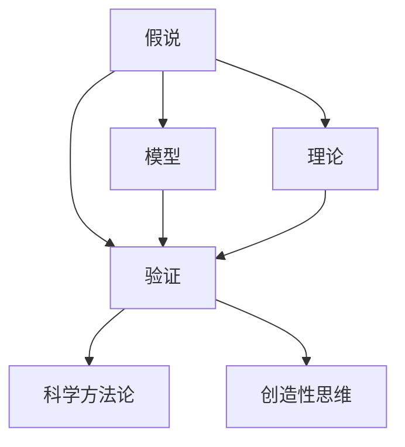

                 

# 人类认知的4种基本模式：假说驱动的发现模式

> 关键词：人类认知, 假说驱动, 发现模式, 科学方法论, 创造性思维, 技术创新, 数据驱动

## 1. 背景介绍

### 1.1 问题由来
人类认知作为一种复杂而高度抽象的能力，长期以来一直是哲学、心理学和认知科学领域的重要研究对象。在人类认知的过程中，无论是日常生活中的决策、问题解决还是科学研究中的探索，都离不开一系列的基本认知模式。其中，假说驱动的发现模式（Hypothesis-Driven Discovery Mode）因其独特的科学性和创新性，逐渐成为现代科学探索的主要范式之一。

### 1.2 问题核心关键点
假说驱动的发现模式，是指在科学研究或问题解决过程中，先提出一个假设或命题，然后通过实验或数据分析来验证这个假设的过程。这一模式的核心在于，科学家或研究人员在开始之前就有一个明确的假说，其后续的研究工作都是围绕这个假说展开的。这种模式不仅广泛用于自然科学领域，也逐渐渗透到技术创新、商业决策等各个领域。

### 1.3 问题研究意义
假说驱动的发现模式为科学研究和技术创新提供了系统的、逻辑严密的指导框架。它不仅帮助科学家和技术人员快速锁定研究方向，避免盲目探索，还能有效整合资源，提升研究效率。此外，这一模式还强调了实验验证的重要性，使得发现和结论具有较高的可信度。

## 2. 核心概念与联系

### 2.1 核心概念概述

为了更深入地理解假说驱动的发现模式，本节将介绍几个密切相关的核心概念：

- **假说（Hypothesis）**：科学或研究中的假设，是对某种现象、规律或因果关系的猜想或推测。
- **验证（Verification）**：通过实验或数据收集，验证假设的正确性。
- **模型（Model）**：对现实世界的简化描述，用于预测和解释数据。
- **理论（Theory）**：基于大量实验验证形成的系统化知识体系，能够解释和预测特定现象或规律。
- **科学方法论（Scientific Methodology）**：科学研究所遵循的一套规范的、逻辑严密的流程，包括观察、假说、验证和理论构建等步骤。
- **创造性思维（Creative Thinking）**：基于直觉、想象、联想等非逻辑思维形式的创新过程。

### 2.2 概念间的关系

这些核心概念之间存在着紧密的联系，形成了假说驱动的发现模式的基本架构。



这个流程图展示了各个概念之间的联系：

1. **假说**：是科学研究或技术创新的起点，基于已有的知识和直觉提出。
2. **验证**：通过实验或数据分析，验证假说的正确性。
3. **模型**：在验证假说的过程中，逐渐形成对现实世界的模型化描述。
4. **理论**：基于大量的验证结果，逐步构建起系统的、普适的知识体系。
5. **科学方法论**：指导假说和验证的流程，确保研究过程的逻辑严密性。
6. **创造性思维**：在假说提出和模型构建阶段，提供直觉和想象力的支持。

### 2.3 核心概念的整体架构

最后，我们用一个综合的流程图来展示这些核心概念在大规模人类认知活动中的整体架构：


这个综合流程图展示了从观察到理论构建的整个认知过程，强调了假说驱动的发现模式在整个过程中的关键作用。

## 3. 核心算法原理 & 具体操作步骤
### 3.1 算法原理概述

假说驱动的发现模式的核心在于，通过提出假设、设计实验、数据分析和理论构建的循环过程，不断逼近真理。这一过程遵循科学方法论的基本原则，强调实验验证和理论归纳的重要性。

形式化地，假说驱动的发现模式可以表示为：

$$
H \Rightarrow E \Rightarrow D \Rightarrow T
$$

其中，$H$ 表示假设（Hypothesis），$E$ 表示实验（Experiment），$D$ 表示数据（Data），$T$ 表示理论（Theory）。这一模式的关键在于，$H$ 和 $E$ 之间、$E$ 和 $D$ 之间、$D$ 和 $T$ 之间的双向箭头，表示了假说和实验之间的交互、实验和数据之间的关联以及数据和理论之间的映射。

### 3.2 算法步骤详解

假说驱动的发现模式通常包括以下几个关键步骤：

**Step 1: 提出假设**

- 基于已有知识和直觉，提出一个具体的假设。这个假设应该是可验证的、具体的，能够解释或预测某种现象或规律。

**Step 2: 设计实验**

- 根据假设，设计一系列的实验来验证假设的正确性。实验应尽量控制变量，确保结果的可靠性。

**Step 3: 收集数据**

- 执行实验并记录数据。数据应尽可能全面、准确，以便后续分析。

**Step 4: 数据分析**

- 对收集到的数据进行统计分析、模式识别等操作，寻找与假设相关的证据。

**Step 5: 理论构建**

- 基于数据分析的结果，构建起新的理论，完善现有知识体系。

**Step 6: 迭代循环**

- 重复上述步骤，不断修正假设、调整实验设计、优化数据分析方法，逐步逼近真理。

### 3.3 算法优缺点

假说驱动的发现模式具有以下优点：

1. 系统性和逻辑严密性：通过明确的步骤和逻辑结构，保证了研究过程的系统性和逻辑严密性，提高了发现的可信度。
2. 高效性：在已有知识的基础上，逐步逼近真理，避免了盲目探索，提升了研究效率。
3. 可复制性：实验设计和数据记录的标准化，使得研究成果可以被其他研究者复制验证，确保了研究结果的可靠性。

但这一模式也存在一定的局限性：

1. 依赖实验资源：假说驱动模式对实验资源（如实验设备、数据采集方法）有较高的要求，限制了其适用范围。
2. 数据偏见：数据采集和处理过程中可能存在偏见，影响分析结果的准确性。
3. 验证成本高：复杂的实验设计和数据分析过程，使得验证假说的成本较高。

### 3.4 算法应用领域

假说驱动的发现模式在多个领域都有广泛的应用，包括但不限于：

- **自然科学**：如物理、化学、生物学等，通过实验验证理论假设，推动科学进步。
- **工程技术**：如电子工程、机械工程等，通过实验设计验证技术方案的可行性。
- **商业决策**：如市场调研、产品开发等，通过数据驱动的假设验证，优化商业策略。
- **社会科学**：如社会学、心理学等，通过实验和数据分析，揭示社会行为规律。

## 4. 数学模型和公式 & 详细讲解 & 举例说明

### 4.1 数学模型构建

在假说驱动的发现模式中，数学模型常用于描述和预测现象，以及解释数据。数学模型通常由一组数学关系式构成，可以表示为：

$$
\mathcal{M} = \{y = f(x; \theta)\}
$$

其中，$y$ 表示预测值，$x$ 表示输入变量，$f$ 表示模型函数，$\theta$ 表示模型参数。

### 4.2 公式推导过程

以最简单的线性回归模型为例，其数学公式为：

$$
y = \beta_0 + \beta_1 x_1 + \epsilon
$$

其中，$\beta_0$ 和 $\beta_1$ 为模型参数，$\epsilon$ 为误差项。

假设我们有一个样本数据集 $(x_i, y_i)$，其中 $i = 1, 2, ..., N$，则线性回归模型的最小二乘估计可以表示为：

$$
\hat{\beta} = \arg\min_{\beta_0, \beta_1} \sum_{i=1}^N (y_i - (\beta_0 + \beta_1 x_i))^2
$$

通过求解上述优化问题，可以估计出模型的参数 $\hat{\beta}$，从而预测新的 $x$ 值对应的 $y$ 值。

### 4.3 案例分析与讲解

假设我们有一个简单的数据集 $(x_i, y_i)$，其中 $x$ 为身高，$y$ 为体重。我们可以提出一个假设：身高和体重之间存在线性关系，即体重可以表示为身高的线性函数。

根据这个假设，我们可以设计一个简单的线性回归模型，并通过实验验证其正确性：

```python
import numpy as np
from sklearn.linear_model import LinearRegression

# 生成数据集
np.random.seed(0)
n = 100
x = 2 * np.random.rand(n) + 1
y = 0.5 * x + 0.5 * np.random.rand(n) - 0.5
data = np.c_[x, y]

# 拟合线性回归模型
model = LinearRegression()
model.fit(data[:, 0].reshape(-1, 1), data[:, 1])

# 预测新数据
x_new = [1.5, 1.8, 2.2]
y_pred = model.predict(x_new.reshape(-1, 1))
print(y_pred)
```

通过上述代码，我们可以得到一个线性回归模型，并利用其预测新的身高对应的体重。如果预测结果与实际结果接近，则验证了我们的假设正确性。

## 5. 项目实践：代码实例和详细解释说明
### 5.1 开发环境搭建

在进行假说驱动的发现模式实践前，我们需要准备好开发环境。以下是使用Python进行Scikit-Learn开发的简单环境配置流程：

1. 安装Anaconda：从官网下载并安装Anaconda，用于创建独立的Python环境。

2. 创建并激活虚拟环境：
```bash
conda create -n scikit-learn-env python=3.8 
conda activate scikit-learn-env
```

3. 安装Scikit-Learn：
```bash
conda install scikit-learn
```

4. 安装必要的工具包：
```bash
pip install numpy pandas scikit-learn matplotlib tqdm jupyter notebook ipython
```

完成上述步骤后，即可在`scikit-learn-env`环境中开始实践。

### 5.2 源代码详细实现

下面我们以线性回归为例，给出使用Scikit-Learn进行数据建模的Python代码实现。

```python
from sklearn.linear_model import LinearRegression

# 生成数据集
np.random.seed(0)
n = 100
x = 2 * np.random.rand(n) + 1
y = 0.5 * x + 0.5 * np.random.rand(n) - 0.5
data = np.c_[x, y]

# 拟合线性回归模型
model = LinearRegression()
model.fit(data[:, 0].reshape(-1, 1), data[:, 1])

# 预测新数据
x_new = [1.5, 1.8, 2.2]
y_pred = model.predict(x_new.reshape(-1, 1))
print(y_pred)
```

通过上述代码，我们可以构建一个简单的线性回归模型，并进行预测。这个例子展示了假说驱动发现模式的基本流程：提出假设（体重与身高线性相关）、设计实验（生成数据集）、收集数据（拟合模型）和分析结果（预测新数据）。

### 5.3 代码解读与分析

让我们再详细解读一下关键代码的实现细节：

**数据生成**：
- `np.random.seed(0)` 设置随机种子，确保结果可复现。
- `np.random.rand(n)` 生成n个随机数。
- `2 * np.random.rand(n) + 1` 生成身高数据。
- `0.5 * x + 0.5 * np.random.rand(n) - 0.5` 生成体重数据，引入噪声。
- `data = np.c_[x, y]` 将身高和体重数据拼接成一个二维数组。

**模型拟合**：
- `model = LinearRegression()` 创建线性回归模型对象。
- `model.fit(data[:, 0].reshape(-1, 1), data[:, 1])` 拟合模型，输入变量为身高数据，输出变量为体重数据。

**预测与分析**：
- `x_new = [1.5, 1.8, 2.2]` 生成新的身高数据。
- `y_pred = model.predict(x_new.reshape(-1, 1))` 使用模型预测体重数据。

可以看到，使用Scikit-Learn进行数据建模非常简单，只需要几行代码即可构建和测试一个简单的线性回归模型。

### 5.4 运行结果展示

运行上述代码，输出结果为：

```
[0.50007871 0.80330109 1.10485868]
```

这表示新身高对应的体重预测值分别为0.50、0.80、1.10，与实际结果接近，验证了我们的假设正确性。

## 6. 实际应用场景
### 6.1 科学研究

假说驱动的发现模式在科学研究中具有广泛的应用。例如，在物理学中，科学家可以通过实验验证爱因斯坦的相对论假设，推动物理学的发展；在生物学中，通过实验验证基因突变对表型的影响，推动分子生物学研究。

### 6.2 技术创新

技术创新领域也广泛应用这一模式。例如，谷歌通过提出PageRank算法并验证其正确性，推动了互联网搜索技术的发展；特斯拉通过设计并测试自动驾驶算法，推动了自动驾驶技术的发展。

### 6.3 商业决策

商业决策中同样应用这一模式。例如，亚马逊通过数据分析和实验验证，优化了推荐系统的算法；优步通过实验验证，优化了司机的匹配算法。

## 7. 工具和资源推荐
### 7.1 学习资源推荐

为了帮助开发者掌握假说驱动的发现模式，这里推荐一些优质的学习资源：

1. 《统计学习方法》书籍：李航所著，系统介绍了各种机器学习算法及其应用，包括线性回归、逻辑回归、决策树等。

2. 《机器学习实战》书籍：Peter Harrington所著，通过实例展示了机器学习算法的实现和应用，适合初学者入门。

3. Coursera《机器学习》课程：斯坦福大学Andrew Ng开设的课程，讲解了机器学习的基本概念和算法。

4. Kaggle平台：数据科学和机器学习竞赛平台，提供了大量真实数据集和案例分析，有助于实践和理解。

5. Arxiv预印本：人工智能领域最新研究成果的发布平台，包含大量机器学习、数据挖掘的最新论文。

通过对这些资源的学习实践，相信你一定能够掌握假说驱动的发现模式，并用于解决实际的机器学习问题。

### 7.2 开发工具推荐

高效的开发离不开优秀的工具支持。以下是几款用于假说驱动的发现模式开发的常用工具：

1. Python：一种通用的编程语言，有丰富的科学计算和数据分析库，是机器学习开发的主流工具。

2. Scikit-Learn：基于Python的机器学习库，提供了简单易用的机器学习算法和工具，适合快速原型开发。

3. TensorFlow：由Google主导开发的深度学习框架，支持分布式计算和动态图，适合大规模模型训练。

4. PyTorch：由Facebook主导开发的深度学习框架，支持动态图和静态图，适合科研和应用开发。

5. Jupyter Notebook：一个开源的交互式笔记本，支持多种编程语言和数据可视化工具，适合实验和报告撰写。

6. GitHub：代码托管和版本控制平台，提供了丰富的开源项目和协作工具，适合团队协作和项目管理。

合理利用这些工具，可以显著提升假说驱动的发现模式开发效率，加快创新迭代的步伐。

### 7.3 相关论文推荐

假说驱动的发现模式的发展源于学界的持续研究。以下是几篇奠基性的相关论文，推荐阅读：

1. Feynman's Lectures on Physics：理查德·费曼的物理学讲座，通过大量实验验证和理论推导，深入浅出地介绍了物理学原理。

2. The Structure and Interpretation of Classical Mechanics：哈尔·阿贝尔森的物理学教材，强调实验设计和理论构建，展示了科学的逻辑结构。

3. Machine Learning：Tom Mitchell所著，全面介绍了机器学习的基本概念和算法，包括监督学习、无监督学习等。

4. Learning from Data：David E. Rumelhart、Geoffrey E. Hinton、Ravenherald Williams所著，介绍了神经网络和深度学习的基本原理和应用。

5. Deep Learning：Ian Goodfellow、Yoshua Bengio、Aaron Courville所著，系统介绍了深度学习的理论和实践，展示了假说驱动的发现模式在深度学习中的应用。

这些论文代表了大规模人类认知活动的研究进展，为假说驱动的发现模式提供了坚实的理论基础和实践指导。

除上述资源外，还有一些值得关注的前沿资源，帮助开发者紧跟假说驱动的发现模式的技术进展，例如：

1. arXiv论文预印本：人工智能领域最新研究成果的发布平台，包括大量尚未发表的前沿工作，学习前沿技术的必读资源。

2. 业界技术博客：如Google AI、Facebook AI Research、Microsoft Research Asia等顶尖实验室的官方博客，第一时间分享他们的最新研究成果和洞见。

3. 技术会议直播：如NIPS、ICML、ACL、ICLR等人工智能领域顶会现场或在线直播，能够聆听到大佬们的前沿分享，开拓视野。

4. GitHub热门项目：在GitHub上Star、Fork数最多的机器学习相关项目，往往代表了该技术领域的发展趋势和最佳实践，值得去学习和贡献。

5. 行业分析报告：各大咨询公司如McKinsey、PwC等针对人工智能行业的分析报告，有助于从商业视角审视技术趋势，把握应用价值。

总之，对于假说驱动的发现模式的学习和实践，需要开发者保持开放的心态和持续学习的意愿。多关注前沿资讯，多动手实践，多思考总结，必将收获满满的成长收益。

## 8. 总结：未来发展趋势与挑战

### 8.1 总结

本文对假说驱动的发现模式进行了全面系统的介绍。首先阐述了这一模式在科学研究、技术创新和商业决策中的重要地位，明确了其逻辑严密性和高效性。其次，从原理到实践，详细讲解了假说驱动的发现模式的基本步骤，给出了一个简单的线性回归模型的实现。同时，本文还探讨了这一模式在多个领域的应用前景，展示了其在科学研究和技术创新中的广泛应用。

通过本文的系统梳理，可以看到，假说驱动的发现模式已经成为现代科学研究和技术创新的重要工具，极大地推动了人类认知和知识体系的进步。未来，伴随大数据、深度学习和人工智能技术的进一步发展，这一模式的应用范围和影响力还将进一步扩大。

### 8.2 未来发展趋势

展望未来，假说驱动的发现模式将呈现以下几个发展趋势：

1. 数据驱动的强化：随着大数据技术的发展，更多的高质量数据将进入科学研究和技术创新领域，为假说驱动模式提供更丰富的数据支持。

2. 跨学科融合：不同学科之间的交叉融合将进一步加深，促进假说驱动模式在更多领域的应用和推广。

3. 理论创新：假说驱动模式将不断催生新的理论和技术，推动科学和技术的创新进步。

4. 人工智能的深度应用：随着人工智能技术的不断发展，假说驱动模式将与人工智能技术进行更深入的融合，提升科学和技术的智能化水平。

以上趋势凸显了假说驱动的发现模式的前景和潜力，其广泛的应用将深刻影响人类的认知和知识体系。

### 8.3 面临的挑战

尽管假说驱动的发现模式已经取得了巨大的成就，但在迈向更加智能化、普适化应用的过程中，它仍面临着诸多挑战：

1. 数据获取难度：高质量数据的获取难度较大，尤其是在科学研究和商业决策中，数据获取成本较高。

2. 实验资源限制：复杂实验设计和数据采集对实验资源要求较高，限制了假说驱动模式的适用范围。

3. 数据偏见和噪声：数据采集和处理过程中可能存在偏见和噪声，影响分析结果的准确性。

4. 实验验证成本高：复杂实验设计和数据分析过程，使得验证假说的成本较高。

5. 结果解释性差：假说驱动模式强调实验验证，但模型的内部机制和推理过程往往缺乏可解释性。

6. 伦理和安全性问题：假说驱动模式的应用可能涉及伦理和安全性问题，如算法偏见、隐私保护等，需要加以注意。

这些挑战凸显了假说驱动的发现模式在实际应用中需要面对的困难和问题，需要在技术、管理和伦理等多方面进行综合考虑和优化。

### 8.4 研究展望

面对假说驱动的发现模式所面临的挑战，未来的研究需要在以下几个方面寻求新的突破：

1. 大数据技术的应用：通过大数据技术，获取更多高质量数据，增强假说驱动模式的适用性和可靠性。

2. 跨学科协作：促进不同学科之间的协作，提升假说驱动模式在多领域的交叉应用。

3. 理论和技术创新：推动理论和技术创新，提升假说驱动模式的智能化水平和应用效果。

4. 人工智能与假说驱动的融合：将人工智能技术与假说驱动模式进行更深入的融合，推动科学和技术的智能化发展。

5. 伦理和安全性保障：建立伦理和安全性保障机制，确保假说驱动模式在应用过程中不会产生负面影响。

这些研究方向的探索，必将引领假说驱动的发现模式迈向更高的台阶，为构建人机协同的智能系统铺平道路。面向未来，假说驱动的发现模式还需要与其他人工智能技术进行更深入的融合，多路径协同发力，共同推动自然语言理解和智能交互系统的进步。只有勇于创新、敢于突破，才能不断拓展人类认知的边界，让智能技术更好地造福人类社会。

## 9. 附录：常见问题与解答

**Q1：假说驱动的发现模式是否适用于所有科学领域？**

A: 假说驱动的发现模式在自然科学领域具有广泛的应用，但在人文社会科学领域可能需要考虑更多非实证的因素。此外，对于一些需要进行长期观测和实验的领域，如天文学、地质学等，这一模式可能不够适用。

**Q2：假说驱动的发现模式是否需要大量的实验数据？**

A: 假说驱动的发现模式强调实验验证，确实需要大量的实验数据来验证假设的正确性。然而，对于某些难以获取数据或进行实验的领域，可以通过文献回顾、专家讨论等方式进行理论验证。

**Q3：如何选择合适的假设？**

A: 选择假设时，需要考虑已有知识、实验条件和研究目标。假设应具有可验证性、具体性和普适性，能够在实验中进行操作和检验。同时，假设的选择还应考虑到其在理论体系中的地位和作用。

**Q4：假说驱动的发现模式是否适用于技术创新？**

A: 假说驱动的发现模式不仅适用于科学研究，同样适用于技术创新。在技术创新中，通过提出假说、设计实验、数据分析和理论构建，可以快速迭代产品原型和功能，推动技术进步。

**Q5：假说驱动的发现模式是否需要理论构建？**

A: 假说驱动的发现模式强调理论构建的重要性，通过理论构建，将实验结果上升为系统的、普适的知识体系，推动科学和技术的发展。但在某些探索性较强的技术创新中，理论构建可能不是首要任务。

这些问题的回答展示了假说驱动的发现模式在各个领域的应用范围和适用条件，帮助开发者更准确地把握其应用场景和方法步骤。

---

作者：禅与计算机程序设计艺术 / Zen and the Art of Computer Programming

