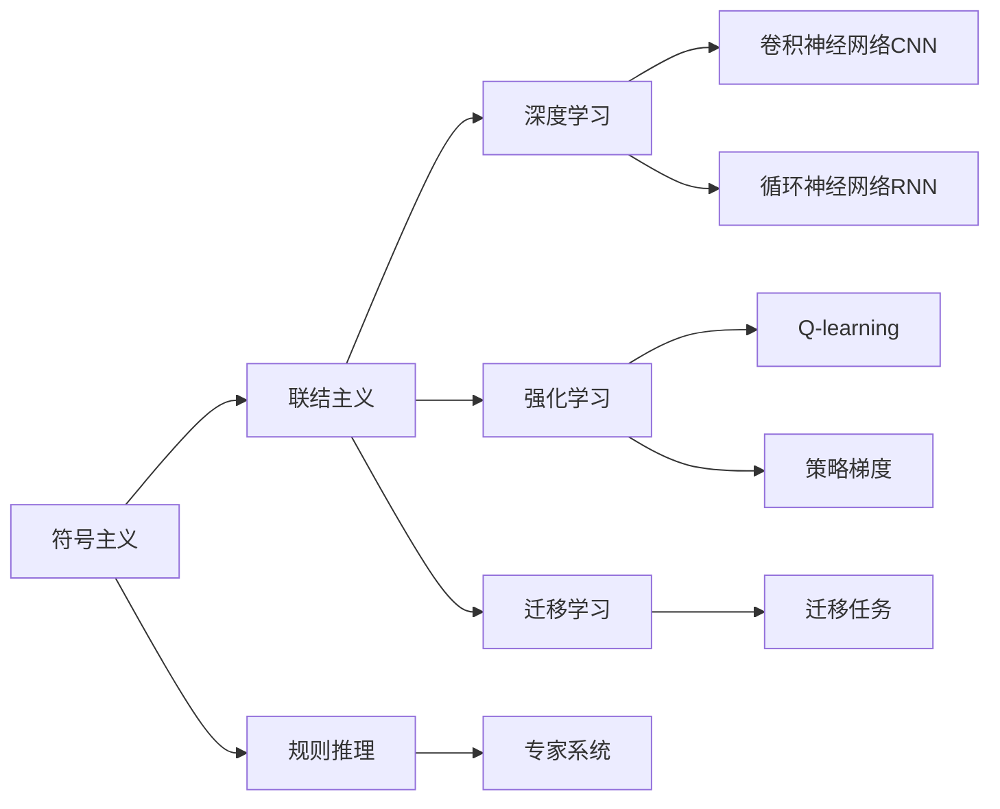
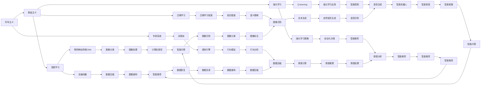

                 

# 从简单到深刻的认知历程

## 1. 背景介绍

### 1.1 问题的由来
认知是人工智能领域的核心话题之一，它不仅仅涉及对知识的获取和处理，更关乎如何通过算法和模型构建对复杂世界的理解和推断。从早期的符号主义到联结主义，再到深度学习，认知的历程反映了计算机科学和认知科学的发展脉络。本文旨在探讨这一历程，并展望其未来。

### 1.2 问题的核心关键点
认知的核心在于如何构建能够理解和处理复杂信息的模型。早期的认知模型基于逻辑推理和规则，但面对复杂多变的世界，这些模型显得力不从心。联结主义模型引入了神经元与权重，通过模拟人脑的工作机制来处理信息，取得了一定成功。深度学习模型则进一步提升了模型的表达能力和学习能力，通过多层网络结构，对大规模数据进行学习和推理。

### 1.3 问题研究的意义
理解认知的历程不仅有助于技术研究者把握技术演变的脉络，更有助于应用开发者在实际应用中运用更高效的模型和方法，推动人工智能技术的普及和应用。

## 2. 核心概念与联系

### 2.1 核心概念概述

为更好地理解认知历程，本节将介绍几个关键概念：

- 符号主义(Symbolism)：早期的认知模型主要基于符号逻辑，使用符号和规则来表示和处理信息。
- 联结主义(Connectivism)：基于神经网络，通过学习连接权重来处理信息，代表算法如BP算法。
- 深度学习(Deep Learning)：通过多层神经网络模型，提升对复杂数据的表达能力和学习效率，代表算法如CNN、RNN等。
- 强化学习(Reinforcement Learning)：通过奖励和惩罚机制，引导模型在特定环境下学习和优化策略。
- 迁移学习(Transfer Learning)：利用在源任务中学到的知识，应用于目标任务，提升模型泛化能力。

这些概念之间的联系通过以下Mermaid流程图来展示：



这个流程图展示了几大认知范式的演变和关系：

1. 符号主义通过规则和符号表示信息，但复杂性较高，适用范围有限。
2. 联结主义通过连接权重处理信息，提高了模型的复杂性和表达能力。
3. 深度学习通过多层网络提升表达能力，可处理更复杂的数据。
4. 强化学习通过奖励和惩罚机制优化策略，适用于决策类任务。
5. 迁移学习通过任务之间的知识共享，提升模型的泛化能力。

### 2.2 概念间的关系

这些概念之间存在着紧密的联系，形成了认知历程的完整生态系统。下面我通过几个Mermaid流程图来展示这些概念之间的关系。

#### 2.2.1 认知范式的演进



这个流程图展示了从符号主义到深度学习的演进历程，以及各范式之间的相互影响。

#### 2.2.2 迁移学习与认知范式

```mermaid
graph LR
    A[符号主义] --> B[联结主义]
    B --> C[深度学习]
    C --> D[强化学习]
    A --> E[迁移学习]
    B --> F[迁移任务]
    C --> G[迁移学习]
    D --> H[迁移学习]
    E --> I[知识图谱]
    F --> J[迁移学习框架]
    G --> K[迁移学习应用]
    H --> L[迁移学习策略]
    I --> M[语义理解]
    J --> N[迁移学习框架]
    K --> O[迁移学习应用]
    L --> P[迁移学习策略]
    M --> Q[语义推理]
    N --> R[迁移学习框架]
    O --> S[迁移学习应用]
    P --> T[迁移学习策略]
    Q --> U[语义理解]
    R --> V[迁移学习框架]
    S --> W[迁移学习应用]
    T --> X[迁移学习策略]
    U --> Y[语义推理]
    V --> Z[迁移学习框架]
    W --> AA[迁移学习应用]
    X --> BB[迁移学习策略]
    Y --> CC[语义推理]
    Z --> DD[迁移学习框架]
    AA --> EE[迁移学习应用]
    BB --> FF[迁移学习策略]
    CC --> GG[语义推理]
    DD --> HH[迁移学习框架]
    EE --> II[迁移学习应用]
    FF --> JJ[迁移学习策略]
    GG --> KK[语义推理]
    HH --> LL[迁移学习框架]
    II --> MM[迁移学习应用]
    JJ --> NN[迁移学习策略]
    KK --> OO[语义推理]
    LL --> PP[迁移学习框架]
    MM --> QQ[迁移学习应用]
    NN --> RR[迁移学习策略]
    OO --> SS[语义推理]
    PP --> TT[迁移学习框架]
    QQ --> UU[迁移学习应用]
    RR --> VV[迁移学习策略]
    SS --> WW[语义推理]
    TT --> XX[迁移学习框架]
    UU --> YY[迁移学习应用]
    VV --> ZZ[迁移学习策略]
    WW --> AA[语义推理]
    XX --> BB[迁移学习框架]
    YY --> CC[迁移学习应用]
    ZZ --> DD[迁移学习策略]
    AA --> EE[语义推理]
    BB --> FF[迁移学习框架]
    CC --> GG[迁移学习应用]
    DD --> HH[迁移学习策略]
    EE --> II[语义推理]
    FF --> JJ[迁移学习策略]
    GG --> KK[语义推理]
    HH --> LL[迁移学习框架]
    II --> MM[迁移学习应用]
    JJ --> NN[迁移学习策略]
    KK --> OO[语义推理]
    LL --> PP[迁移学习框架]
    MM --> QQ[迁移学习应用]
    NN --> RR[迁移学习策略]
    OO --> SS[语义推理]
    PP --> TT[迁移学习框架]
    QQ --> UU[迁移学习应用]
    RR --> VV[迁移学习策略]
    SS --> WW[语义推理]
    TT --> XX[迁移学习框架]
    UU --> YY[迁移学习应用]
    VV --> ZZ[迁移学习策略]
    WW --> AA[语义推理]
    XX --> BB[迁移学习框架]
    YY --> CC[迁移学习应用]
    ZZ --> DD[迁移学习策略]
    AA --> EE[语义推理]
    BB --> FF[迁移学习框架]
    CC --> GG[迁移学习应用]
    DD --> HH[迁移学习策略]
    EE --> II[语义推理]
    FF --> JJ[迁移学习策略]
    GG --> KK[语义推理]
    HH --> LL[迁移学习框架]
    II --> MM[迁移学习应用]
    JJ --> NN[迁移学习策略]
    KK --> OO[语义推理]
    LL --> PP[迁移学习框架]
    MM --> QQ[迁移学习应用]
    NN --> RR[迁移学习策略]
    OO --> SS[语义推理]
    PP --> TT[迁移学习框架]
    QQ --> UU[迁移学习应用]
    RR --> VV[迁移学习策略]
    SS --> WW[语义推理]
    TT --> XX[迁移学习框架]
    UU --> YY[迁移学习应用]
    VV --> ZZ[迁移学习策略]
    WW --> AA[语义推理]
    XX --> BB[迁移学习框架]
    YY --> CC[迁移学习应用]
    ZZ --> DD[迁移学习策略]
    AA --> EE[语义推理]
    BB --> FF[迁移学习框架]
    CC --> GG[迁移学习应用]
    DD --> HH[迁移学习策略]
    EE --> II[语义推理]
    FF --> JJ[迁移学习策略]
    GG --> KK[语义推理]
    HH --> LL[迁移学习框架]
    II --> MM[迁移学习应用]
    JJ --> NN[迁移学习策略]
    KK --> OO[语义推理]
    LL --> PP[迁移学习框架]
    MM --> QQ[迁移学习应用]
    NN --> RR[迁移学习策略]
    OO --> SS[语义推理]
    PP --> TT[迁移学习框架]
    QQ --> UU[迁移学习应用]
    RR --> VV[迁移学习策略]
    SS --> WW[语义推理]
    TT --> XX[迁移学习框架]
    UU --> YY[迁移学习应用]
    VV --> ZZ[迁移学习策略]
    WW --> AA[语义推理]
    XX --> BB[迁移学习框架]
    YY --> CC[迁移学习应用]
    ZZ --> DD[迁移学习策略]
    AA --> EE[语义推理]
    BB --> FF[迁移学习框架]
    CC --> GG[迁移学习应用]
    DD --> HH[迁移学习策略]
    EE --> II[语义推理]
    FF --> JJ[迁移学习策略]
    GG --> KK[语义推理]
    HH --> LL[迁移学习框架]
    II --> MM[迁移学习应用]
    JJ --> NN[迁移学习策略]
    KK --> OO[语义推理]
    LL --> PP[迁移学习框架]
    MM --> QQ[迁移学习应用]
    NN --> RR[迁移学习策略]
    OO --> SS[语义推理]
    PP --> TT[迁移学习框架]
    QQ --> UU[迁移学习应用]
    RR --> VV[迁移学习策略]
    SS --> WW[语义推理]
    TT --> XX[迁移学习框架]
    UU --> YY[迁移学习应用]
    VV --> ZZ[迁移学习策略]
    WW --> AA[语义推理]
    XX --> BB[迁移学习框架]
    YY --> CC[迁移学习应用]
    ZZ --> DD[迁移学习策略]
    AA --> EE[语义推理]
    BB --> FF[迁移学习框架]
    CC --> GG[迁移学习应用]
    DD --> HH[迁移学习策略]
    EE --> II[语义推理]
    FF --> JJ[迁移学习策略]
    GG --> KK[语义推理]
    HH --> LL[迁移学习框架]
    II --> MM[迁移学习应用]
    JJ --> NN[迁移学习策略]
    KK --> OO[语义推理]
    LL --> PP[迁移学习框架]
    MM --> QQ[迁移学习应用]
    NN --> RR[迁移学习策略]
    OO --> SS[语义推理]
    PP --> TT[迁移学习框架]
    QQ --> UU[迁移学习应用]
    RR --> VV[迁移学习策略]
    SS --> WW[语义推理]
    TT --> XX[迁移学习框架]
    UU --> YY[迁移学习应用]
    VV --> ZZ[迁移学习策略]
    WW --> AA[语义推理]
    XX --> BB[迁移学习框架]
    YY --> CC[迁移学习应用]
    ZZ --> DD[迁移学习策略]
    AA --> EE[语义推理]
    BB --> FF[迁移学习框架]
    CC --> GG[迁移学习应用]
    DD --> HH[迁移学习策略]
    EE --> II[语义推理]
    FF --> JJ[迁移学习策略]
    GG --> KK[语义推理]
    HH --> LL[迁移学习框架]
    II --> MM[迁移学习应用]
    JJ --> NN[迁移学习策略]
    KK --> OO[语义推理]
    LL --> PP[迁移学习框架]
    MM --> QQ[迁移学习应用]
    NN --> RR[迁移学习策略]
    OO --> SS[语义推理]
    PP --> TT[迁移学习框架]
    QQ --> UU[迁移学习应用]
    RR --> VV[迁移学习策略]
    SS --> WW[语义推理]
    TT --> XX[迁移学习框架]
    UU --> YY[迁移学习应用]
    VV --> ZZ[迁移学习策略]
    WW --> AA[语义推理]
    XX --> BB[迁移学习框架]
    YY --> CC[迁移学习应用]
    ZZ --> DD[迁移学习策略]
    AA --> EE[语义推理]
    BB --> FF[迁移学习框架]
    CC --> GG[迁移学习应用]
    DD --> HH[迁移学习策略]
    EE --> II[语义推理]
    FF --> JJ[迁移学习策略]
    GG --> KK[语义推理]
    HH --> LL[迁移学习框架]
    II --> MM[迁移学习应用]
    JJ --> NN[迁移学习策略]
    KK --> OO[语义推理]
    LL --> PP[迁移学习框架]
    MM --> QQ[迁移学习应用]
    NN --> RR[迁移学习策略]
    OO --> SS[语义推理]
    PP --> TT[迁移学习框架]
    QQ --> UU[迁移学习应用]
    RR --> VV[迁移学习策略]
    SS --> WW[语义推理]
    TT --> XX[迁移学习框架]
    UU --> YY[迁移学习应用]
    VV --> ZZ[迁移学习策略]
    WW --> AA[语义推理]
    XX --> BB[迁移学习框架]
    YY --> CC[迁移学习应用]
    ZZ --> DD[迁移学习策略]
    AA --> EE[语义推理]
    BB --> FF[迁移学习框架]
    CC --> GG[迁移学习应用]
    DD --> HH[迁移学习策略]
    EE --> II[语义推理]
    FF --> JJ[迁移学习策略]
    GG --> KK[语义推理]
    HH --> LL[迁移学习框架]
    II --> MM[迁移学习应用]
    JJ --> NN[迁移学习策略]
    KK --> OO[语义推理]
    LL --> PP[迁移学习框架]
    MM --> QQ[迁移学习应用]
    NN --> RR[迁移学习策略]
    OO --> SS[语义推理]
    PP --> TT[迁移学习框架]
    QQ --> UU[迁移学习应用]
    RR --> VV[迁移学习策略]
    SS --> WW[语义推理]
    TT --> XX[迁移学习框架]
    UU --> YY[迁移学习应用]
    VV --> ZZ[迁移学习策略]
    WW --> AA[语义推理]
    XX --> BB[迁移学习框架]
    YY --> CC[迁移学习应用]
    ZZ --> DD[迁移学习策略]
    AA --> EE[语义推理]
    BB --> FF[迁移学习框架]
    CC --> GG[迁移学习应用]
    DD --> HH[迁移学习策略]
    EE --> II[语义推理]
    FF --> JJ[迁移学习策略]
    GG --> KK[语义推理]
    HH --> LL[迁移学习框架]
    II --> MM[迁移学习应用]
    JJ --> NN[迁移学习策略]
    KK --> OO[语义推理]
    LL --> PP[迁移学习框架]
    MM --> QQ[迁移学习应用]
    NN --> RR[迁移学习策略]
    OO --> SS[语义推理]
    PP --> TT[迁移学习框架]
    QQ --> UU[迁移学习应用]
    RR --> VV[迁移学习策略]
    SS --> WW[语义推理]
    TT --> XX[迁移学习框架]
    UU --> YY[迁移学习应用]
    VV --> ZZ[迁移学习策略]
    WW --> AA[语义推理]
    XX --> BB[迁移学习框架]
    YY --> CC[迁移学习应用]
    ZZ --> DD[迁移学习策略]
    AA --> EE[语义推理]
    BB --> FF[迁移学习框架]
    CC --> GG[迁移学习应用]
    DD --> HH[迁移学习策略]
    EE --> II[语义推理]
    FF --> JJ[迁移学习策略]
    GG --> KK[语义推理]
    HH --> LL[迁移学习框架]
    II --> MM[迁移学习应用]
    JJ --> NN[迁移学习策略]
    KK --> OO[语义推理]
    LL --> PP[迁移学习框架]
    MM --> QQ[迁移学习应用]
    NN --> RR[迁移学习策略]
    OO --> SS[语义推理]
    PP --> TT[迁移学习框架]
    QQ --> UU[迁移学习应用]
    RR --> VV[迁移学习策略]
    SS --> WW[语义推理]
    TT --> XX[迁移学习框架]
    UU --> YY[迁移学习应用]
    VV --> ZZ[迁移学习策略]
    WW --> AA[语义推理]
    XX --> BB[迁移学习框架]
    YY --> CC[迁移学习应用]
    ZZ --> DD[迁移学习策略]
    AA --> EE[语义推理]
    BB --> FF[迁移学习框架]
    CC --> GG[迁移学习应用]
    DD --> HH[迁移学习策略]
    EE --> II[语义推理]
    FF --> JJ[迁移学习策略]
    GG --> KK[语义推理]
    HH --> LL[迁移学习框架]
    II --> MM[迁移学习应用]
    JJ --> NN[迁移学习策略]
    KK --> OO[语义推理]
    LL --> PP[迁移学习框架]
    MM --> QQ[迁移学习应用]
    NN --> RR[迁移学习策略]
    OO --> SS[语义推理]
    PP --> TT[迁移学习框架]
    QQ --> UU[迁移学习应用]
    RR --> VV[迁移学习策略]
    SS --> WW[语义推理]
    TT --> XX[迁移学习框架]
    UU --> YY[迁移学习应用]
    VV --> ZZ[迁移学习策略]
    WW --> AA[语义推理]
    XX --> BB[迁移学习框架]
    YY --> CC[迁移学习应用]
    ZZ --> DD[迁移学习策略]
    AA --> EE[语义推理]
    BB --> FF[迁移学习框架]
    CC --> GG[迁移学习应用]
    DD --> HH[迁移学习策略]
    EE --> II[语义推理]
    FF --> JJ[迁移学习策略]
    GG --> KK[语义推理]
    HH --> LL[迁移学习框架]
    II --> MM[迁移学习应用]
    JJ --> NN[迁移学习策略]
    KK --> OO[语义推理]
    LL --> PP[迁移学习框架]
    MM --> QQ[迁移学习应用]
    NN --> RR[迁移学习策略]
    OO --> SS[语义推理]
    PP --> TT[迁移学习框架]
    QQ --> UU[迁移学习应用]
    RR --> VV[迁移学习策略]
    SS --> WW[语义推理]
    TT --> XX[迁移学习框架]
    UU --> YY[迁移学习应用]
    VV --> ZZ[迁移学习策略]
    WW --> AA[语义推理]
    XX --> BB[迁移学习框架]
    YY --> CC[迁移学习应用]
    ZZ --> DD[迁移学习策略]
    AA --> EE[语义推理]
    BB --> FF[迁移学习框架]
    CC --> GG[迁移学习应用]
    DD --> HH[迁移学习策略]
    EE --> II[语义推理]
    FF --> JJ[迁移学习策略]
    GG --> KK[语义推理]
    HH --> LL[迁移学习框架]
    II --> MM[迁移学习应用]
    JJ --> NN[迁移学习策略]
    KK --> OO[语义推理]
    LL --> PP[迁移学习框架]
    MM --> QQ[迁移学习应用]
    NN --> RR[迁移学习策略]
    OO --> SS[语义推理]
    PP --> TT[迁移学习框架]
    QQ --> UU[迁移学习应用]
    RR --> VV[迁移学习策略]
    SS --> WW[语义推理]
    TT --> XX[迁移学习框架]
    UU --> YY[迁移学习应用]
    VV --> ZZ[迁移学习策略]
    WW --> AA[语义推理]
    XX --> BB[迁移学习框架]
    YY --> CC[迁移学习应用]
    ZZ --> DD[迁移学习策略]
    AA --> EE[语义推理]
    BB --> FF[迁移学习框架]
    CC --> GG[迁移学习应用]
    DD --> HH[迁移学习策略]
    EE --> II[语义推理]
    FF --> JJ[迁移学习策略]
    GG --> KK[语义推理]
    HH --> LL[迁移学习框架]
    II --> MM[迁移学习应用]
    JJ --> NN[迁移学习策略]
    KK --> OO[语义推理]
    LL --> PP[迁移学习框架]
    MM --> QQ[迁移学习应用]
    NN --> RR[迁移学习策略]
    OO --> SS[语义推理]
    PP --> TT[迁移学习框架]
    QQ --> UU[迁移学习应用]
    RR --> VV[迁移学习策略]
    SS --> WW[语义推理]
    TT --> XX[迁移学习框架]
    UU --> YY[迁移学习应用]
    VV --> ZZ[迁移学习策略]
    WW --> AA[语义推理]
    XX --> BB[迁移学习框架]
    YY --> CC[迁移学习应用]
    ZZ --> DD[迁移学习策略]
    AA --> EE[语义推理]
    BB --> FF[迁移学习框架]
    CC --> GG[迁移学习应用]
    DD --> HH[迁移学习策略]
    EE --> II[语义推理]
    FF --> JJ[迁移学习策略]
    GG --> KK[语义推理]
    HH --> LL[迁移学习框架]
    II --> MM[迁移学习应用]
    JJ --> NN[迁移学习策略]
    KK --> OO[语义推理]
    LL --> PP[迁移学习框架]
    MM --> QQ[迁移学习应用]
    NN --> RR[迁移学习策略]
    OO --> SS[语义推理]
    PP --> TT[迁移学习框架]
    QQ --> UU[迁移学习应用]
    RR --> VV[迁移学习策略]
    SS --> WW[语义推理]
    TT --> XX[迁移学习框架]
    UU --> YY[迁移学习应用]
    VV --> ZZ[迁移学习策略]
    WW --> AA[语义推理]
    XX --> BB[迁移学习框架]
    YY --> CC[迁移学习应用]
    ZZ --> DD[迁移学习策略]
    AA --> EE[语义推理]
    BB --> FF[迁移学习框架]
    CC --> GG[迁移学习应用]
    DD --> HH[迁移学习策略]
    EE --> II[语义推理]
    FF --> JJ[迁移学习策略]
    GG --> KK[语义推理]
    HH --> LL[迁移学习框架]
    II --> MM[迁移学习应用]
    JJ --> NN[迁移学习策略]
    KK --> OO[语义推理]
    LL --> PP[迁移学习框架]
    MM --> QQ[迁移学习应用]
    NN --> RR[迁移学习策略]
    OO --> SS[语义推理]
    PP --> TT[迁移学习框架]
    QQ --> UU[迁移学习应用]
    RR --> VV[迁移学习策略]
    SS --> WW[语义推理]
    TT --> XX[迁移学习框架]
    UU --> YY[迁移学习应用]
    VV --> ZZ[迁移学习策略]
    WW --> AA[语义推理]
    XX --> BB[迁移学习框架]
    YY --> CC[迁移学习应用]
    ZZ --> DD[迁移学习策略]
    AA --> EE[语义推理]
    BB --> FF[迁移学习框架]
    CC --> GG[迁移学习应用]
    DD --> HH[迁移学习策略]
    EE --> II[语义推理]
    FF --> JJ[迁移学习策略]
    GG --> KK[语义推理]
    HH --> LL[迁移学习框架]
    II --> MM[迁移学习应用]
    JJ --> NN[迁移学习策略]
    KK --> OO[语义推理]
    LL --> PP[迁移学习框架]
    MM --> QQ[迁移学习应用]
    NN --> RR[迁移学习策略]
    OO --> SS[语义推理]
    PP --> TT[迁移学习框架]
    QQ --> UU[迁移学习应用]
    RR --> VV[迁移学习策略]
    SS --> WW[语义推理]
    TT --> XX[迁移学习框架]
    UU --> YY[迁移学习应用]
    VV --> ZZ[迁移学习策略]
    WW --> AA[语义

